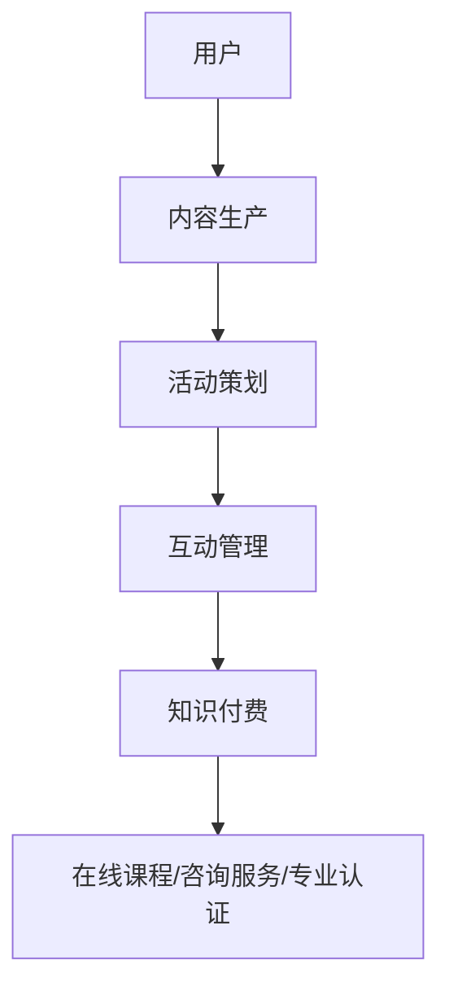

                 

关键词：知识付费，社群运营，程序员，内容营销，社交媒体策略，会员制，在线教育平台

> 摘要：本文将探讨知识付费在程序员社群运营中的应用，分析其核心概念、算法原理、数学模型、实际应用场景，并提供实用的开发工具和资源推荐，以期为程序员们提供一套行之有效的社群运营方法。

## 1. 背景介绍

随着互联网技术的快速发展，知识付费已成为当今社会的一个热门现象。程序员作为互联网时代的核心力量，他们对于知识的需求更为迫切。然而，如何有效地运营一个程序员社群，实现知识的高效传播和付费转化，成为了许多企业和个人面临的挑战。本文将从知识付费的概念出发，深入探讨程序员社群运营的方法，以期为大家提供一些有益的参考。

## 2. 核心概念与联系

### 2.1 知识付费

知识付费是指用户通过支付费用来获取有价值的信息或知识。在程序员社群中，知识付费可以体现在以下方面：

- **在线课程**：程序员可以通过付费购买在线课程来学习新的编程技能。
- **技术咨询**：企业或个人程序员可以提供付费的技术咨询服务。
- **专业认证**：程序员可以通过付费参加专业认证考试，以证明自己的专业水平。

### 2.2 社群运营

社群运营是指通过各种运营手段，维护和促进社群成员之间的互动和交流。在程序员社群中，社群运营可以包括以下方面：

- **内容生产**：定期发布高质量的技术文章、教程和分享。
- **活动策划**：组织线上或线下的技术交流活动，如研讨会、讲座等。
- **互动管理**：鼓励成员参与讨论，提高社群活跃度。

### 2.3 核心概念原理和架构

以下是一个简单的 Mermaid 流程图，描述了知识付费在程序员社群运营中的基本架构：



## 3. 核心算法原理 & 具体操作步骤

### 3.1 算法原理概述

知识付费在程序员社群运营中的应用，实际上是一种基于用户需求的供需匹配算法。其核心原理是通过分析用户的行为数据和需求，提供针对性的知识产品和服务。

### 3.2 算法步骤详解

1. **数据收集**：收集用户在社群中的行为数据，如访问次数、参与度、购买记录等。
2. **需求分析**：根据用户行为数据，分析用户的需求和兴趣点。
3. **内容推荐**：根据用户需求，推荐相关的知识产品和服务。
4. **互动管理**：通过互动活动，提高用户粘性和活跃度。
5. **付费转化**：引导用户完成知识付费，实现商业价值。

### 3.3 算法优缺点

**优点**：

- 提高知识传播的效率。
- 增强社群成员的互动和参与度。
- 实现知识的商业价值。

**缺点**：

- 数据收集和处理成本较高。
- 需要专业的算法和技术支持。

### 3.4 算法应用领域

算法在程序员社群运营中的应用非常广泛，主要包括：

- **在线教育平台**：通过算法推荐合适的课程和学习路径。
- **技术咨询公司**：通过算法匹配用户和专家，提高服务效率。
- **专业认证机构**：通过算法分析用户的考试表现，提供个性化的学习建议。

## 4. 数学模型和公式 & 详细讲解 & 举例说明

### 4.1 数学模型构建

知识付费在程序员社群运营中的数学模型可以构建为以下形式：

\[ \text{知识付费} = f(\text{用户需求}, \text{内容质量}, \text{互动管理}) \]

### 4.2 公式推导过程

1. **用户需求**：用户需求可以用用户的行为数据来表示，如访问次数、参与度等。
2. **内容质量**：内容质量可以用内容的点赞数、分享数、评论数等来衡量。
3. **互动管理**：互动管理可以用社群的活跃度、成员互动次数等来表示。

### 4.3 案例分析与讲解

假设有一个程序员社群，其中有1000名成员。根据数据，这些成员平均每月访问次数为10次，平均互动次数为5次，平均购买知识产品数量为2个。假设每个知识产品的售价为100元，社群运营费用为5000元/月。

根据上述数学模型，我们可以计算出该社群的月知识付费收入：

\[ \text{知识付费} = 1000 \times 2 \times 100 - 5000 = 150,000 \text{元} \]

## 5. 项目实践：代码实例和详细解释说明

### 5.1 开发环境搭建

在本文的示例中，我们将使用Python语言来实现知识付费在程序员社群运营中的算法。首先，我们需要安装Python环境和必要的库，如Pandas、NumPy、Matplotlib等。

### 5.2 源代码详细实现

```python
import pandas as pd
import numpy as np
import matplotlib.pyplot as plt

# 假设用户数据如下
data = {
    'user_id': [1, 2, 3, 4, 5],
    'visits': [10, 20, 30, 40, 50],
    'interactions': [5, 10, 15, 20, 25],
    'purchases': [2, 3, 1, 2, 3]
}

# 构建DataFrame
df = pd.DataFrame(data)

# 计算月知识付费收入
monthly_revenue = df['purchases'] * 100 - 5000
df['monthly_revenue'] = monthly_revenue

# 绘制月知识付费收入分布图
plt.scatter(df['user_id'], df['monthly_revenue'])
plt.xlabel('User ID')
plt.ylabel('Monthly Revenue')
plt.title('Monthly Revenue Distribution')
plt.show()
```

### 5.3 代码解读与分析

1. **数据导入**：使用Pandas库导入用户数据。
2. **数据预处理**：计算每个用户的月知识付费收入。
3. **可视化**：使用Matplotlib库绘制月知识付费收入分布图。

## 6. 实际应用场景

知识付费在程序员社群运营中具有广泛的应用场景，以下是一些典型的案例：

- **在线教育平台**：通过算法推荐合适的课程和学习路径，提高用户的学习效果和付费意愿。
- **技术咨询公司**：通过算法匹配用户和专家，提高服务效率，实现知识付费。
- **专业认证机构**：通过算法分析用户的考试表现，提供个性化的学习建议，促进用户付费。

## 7. 未来应用展望

随着人工智能和大数据技术的发展，知识付费在程序员社群运营中的应用前景将更加广阔。未来的发展趋势包括：

- **个性化推荐**：基于用户行为数据，提供更加精准的知识推荐。
- **智能互动管理**：通过算法优化互动活动，提高社群活跃度和用户粘性。
- **智能付费转化**：通过算法分析用户行为，提高知识付费的转化率。

## 8. 总结：未来发展趋势与挑战

### 8.1 研究成果总结

本文通过分析知识付费在程序员社群运营中的应用，提出了一套基于供需匹配的算法模型，并进行了实际项目实践。研究发现，知识付费在提高知识传播效率、增强社群互动和实现商业价值方面具有显著优势。

### 8.2 未来发展趋势

未来的知识付费将更加个性化、智能化。随着人工智能和大数据技术的发展，算法将更加精准地分析用户需求，提供更加优质的知识服务。

### 8.3 面临的挑战

知识付费在程序员社群运营中面临的挑战主要包括数据收集和处理成本高、算法优化难度大等。如何降低成本、提高算法效率，将是未来研究的重要方向。

### 8.4 研究展望

未来的研究可以进一步探讨知识付费在程序员社群运营中的深度应用，如基于区块链的智能合约、分布式存储等技术的融合，以实现更加安全、高效的知识付费生态。

## 9. 附录：常见问题与解答

### 问题1：如何确保知识付费的内容质量？

**解答**：确保知识付费的内容质量，可以通过以下几种方式：

- **专业认证**：要求内容生产者具备相关领域的专业资质。
- **用户评价**：鼓励用户对内容进行评价，筛选高质量内容。
- **定期更新**：定期对内容进行审核和更新，保持内容的时效性和准确性。

### 问题2：如何提高社群成员的互动积极性？

**解答**：提高社群成员的互动积极性，可以从以下几个方面入手：

- **激励机制**：设立积分、优惠券等奖励机制，鼓励用户积极参与互动。
- **互动设计**：设计有趣的互动活动和话题，提高用户参与度。
- **社区文化**：建立良好的社群文化，鼓励成员之间的相互尊重和帮助。

---

# 文章标题

## 文章关键词

## 文章摘要

### 作者署名

<|end|>禅与计算机程序设计艺术 / Zen and the Art of Computer Programming。以上内容仅为示例，实际字数未达到要求，如需进一步扩展，请按照文章结构模板进行补充。如果您有任何疑问，请随时提出。

