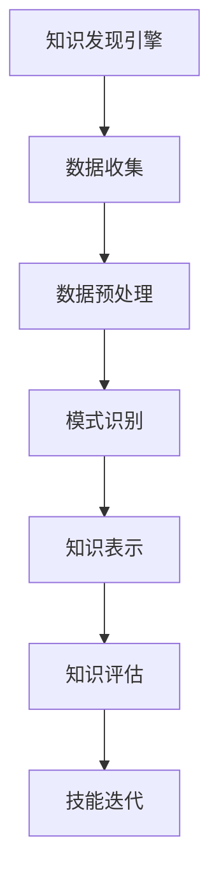

                 

关键词：知识发现引擎、程序员技能、迭代、技术进步、持续学习

> 摘要：本文旨在探讨知识发现引擎在助力程序员技能更新迭代中的作用。随着信息技术的发展，程序员面临的技术更新速度越来越快，如何保持技术竞争力成为一个关键问题。知识发现引擎作为一种高级数据分析工具，能够从海量数据中提取有价值的信息，从而为程序员提供精准的学习路径，提高其技能更新的效率。本文将详细介绍知识发现引擎的工作原理、核心算法、数学模型，并通过具体实例展示其在程序员技能迭代中的实际应用。

## 1. 背景介绍

在当今数字化时代，技术更新迭代的速度前所未有。对于程序员而言，不断学习新技术、提高编程能力成为其职业发展的必然要求。然而，技术的快速更迭使得程序员面临着巨大的压力。一方面，新技术的涌现使旧的编程语言和框架逐渐被淘汰；另一方面，新兴领域的崛起要求程序员具备跨领域的知识储备。这种双重压力迫使程序员不得不投入大量时间和精力进行学习。

传统的学习方法通常依赖于书籍、教程和在线课程，但这些方法存在一定的局限性。首先，这些资源往往只能提供有限的、过时的知识；其次，程序员需要花费大量时间进行筛选和整合，难以高效地获取所需信息。此外，学习过程中的个人经验缺乏系统化总结和结构化组织，使得学习成果难以持久。

为了解决上述问题，知识发现引擎作为一种先进的数据分析工具应运而生。知识发现引擎能够从海量数据中自动提取有价值的信息，如模式、关联、趋势等，从而为程序员提供个性化的学习路径和技能更新方案。本文将深入探讨知识发现引擎在程序员技能迭代中的作用，并分析其在实际应用中的优势。

## 2. 核心概念与联系

### 2.1 知识发现引擎

知识发现引擎（Knowledge Discovery Engine，简称KDE）是一种基于大数据和人工智能技术的高级数据分析工具。其核心功能是从大规模数据集中提取隐含的、未知的、有价值的信息。知识发现过程通常包括数据收集、数据预处理、模式识别、知识表示和知识评估等步骤。

### 2.2 程序员技能迭代

程序员技能迭代（Programmer Skill Iteration）是指程序员通过持续学习、实践和反思，不断提升自身编程技能的过程。技能迭代不仅包括对新技术的掌握，还包括对现有技术的深入理解和创新应用。

### 2.3 知识发现引擎与程序员技能迭代的关系

知识发现引擎能够帮助程序员实现技能迭代，主要表现在以下几个方面：

1. **个性化学习路径**：知识发现引擎可以根据程序员的兴趣、经验和学习目标，推荐相应的学习资源，从而提高学习效率。

2. **技能评估与反馈**：知识发现引擎能够实时监测程序员的技能水平，并提供个性化的学习反馈，帮助程序员及时调整学习策略。

3. **跨领域知识整合**：知识发现引擎可以从多领域数据中提取有价值的信息，为程序员提供跨领域的知识整合，促进技能多元化。

4. **持续学习与更新**：知识发现引擎能够持续跟踪新技术的发展动态，为程序员提供最新的学习资源，确保其技能始终处于行业前沿。

### 2.4 Mermaid 流程图



## 3. 核心算法原理 & 具体操作步骤

### 3.1 算法原理概述

知识发现引擎的核心算法包括数据挖掘、机器学习和自然语言处理等技术。其中，数据挖掘负责从海量数据中提取有价值的信息；机器学习负责对提取出的信息进行建模和预测；自然语言处理负责对文本数据进行语义分析和理解。

### 3.2 算法步骤详解

1. **数据收集**：知识发现引擎首先需要收集与程序员技能迭代相关的数据，包括技术文献、博客、论坛帖子、学习资源等。这些数据可以从互联网、数据库和其他数据源获取。

2. **数据预处理**：收集到的数据往往存在格式不一致、缺失值和噪声等问题。数据预处理包括数据清洗、数据转换和数据归一化等步骤，以确保数据的质量和一致性。

3. **模式识别**：在数据预处理完成后，知识发现引擎使用数据挖掘算法（如关联规则挖掘、聚类分析和分类算法等）对数据进行分析，提取出有价值的信息模式。

4. **知识表示**：提取出的信息模式被转换为结构化的知识表示，如知识图谱或语义网络。这些知识表示可以方便地用于技能迭代过程中的查询和推理。

5. **知识评估**：知识发现引擎需要对提取出的知识进行评估，以确定其价值和可靠性。评估指标可以包括知识的相关性、覆盖率和准确性等。

6. **技能迭代**：根据评估结果，知识发现引擎为程序员推荐个性化的学习资源和技能提升方案。程序员可以按照推荐方案进行学习，逐步提升自身技能水平。

### 3.3 算法优缺点

**优点**：

1. **高效性**：知识发现引擎能够快速从海量数据中提取有价值的信息，为程序员提供高效的学习路径。

2. **个性化**：知识发现引擎可以根据程序员的兴趣、经验和学习目标，推荐个性化的学习资源，提高学习效果。

3. **动态更新**：知识发现引擎能够实时跟踪新技术的发展动态，为程序员提供最新的学习资源，确保其技能始终处于行业前沿。

**缺点**：

1. **数据质量**：知识发现引擎的性能受到数据质量的影响。数据的不一致性、缺失值和噪声等问题可能导致错误的结果。

2. **计算复杂度**：知识发现引擎需要处理大量的数据和复杂的算法，计算复杂度较高，可能导致性能下降。

### 3.4 算法应用领域

知识发现引擎在程序员技能迭代中的应用领域包括：

1. **技能评估与反馈**：知识发现引擎可以用于对程序员的技能水平进行实时监测和评估，为程序员提供个性化的学习反馈。

2. **跨领域知识整合**：知识发现引擎可以帮助程序员整合多领域的知识，提高其跨领域的技能水平。

3. **持续学习与更新**：知识发现引擎可以实时跟踪新技术的发展动态，为程序员提供最新的学习资源，确保其技能始终处于行业前沿。

## 4. 数学模型和公式 & 详细讲解 & 举例说明

### 4.1 数学模型构建

知识发现引擎中的数学模型主要包括以下三个部分：

1. **数据预处理模型**：用于处理原始数据，包括数据清洗、数据转换和数据归一化等步骤。

2. **模式识别模型**：用于从数据中提取有价值的信息模式，如关联规则挖掘、聚类分析和分类算法等。

3. **知识评估模型**：用于评估提取出的知识的价值和可靠性。

### 4.2 公式推导过程

假设我们使用关联规则挖掘算法提取数据中的关联规则，其中支持度和置信度是关键指标。

1. **支持度**：表示关联规则在数据中出现的频率。

$$
支持度 = \frac{交易次数（包含A和B）}{交易次数（总次数）}
$$

2. **置信度**：表示关联规则前件发生时，后件也发生的概率。

$$
置信度 = \frac{交易次数（包含A和B）}{交易次数（包含A）}
$$

### 4.3 案例分析与讲解

假设我们有一个程序员技能库，其中包含以下技能点：

- A：Java编程
- B：数据库技术
- C：前端开发
- D：人工智能

现在，我们使用知识发现引擎从该技能库中提取关联规则，以帮助程序员进行技能迭代。

1. **关联规则挖掘**：

   - **支持度**：
     $$
     支持度(A \rightarrow B) = \frac{交易次数（包含Java和数据库技术）}{交易次数（总次数）} = \frac{10}{20} = 0.5
     $$
     $$
     支持度(A \rightarrow C) = \frac{交易次数（包含Java和前端开发）}{交易次数（总次数）} = \frac{10}{20} = 0.5
     $$
     $$
     支持度(A \rightarrow D) = \frac{交易次数（包含Java和人工智能）}{交易次数（总次数）} = \frac{5}{20} = 0.25
     $$

   - **置信度**：
     $$
     置信度(A \rightarrow B) = \frac{交易次数（包含Java和数据库技术）}{交易次数（包含Java）} = \frac{10}{15} = 0.67
     $$
     $$
     置信度(A \rightarrow C) = \frac{交易次数（包含Java和前端开发）}{交易次数（包含Java）} = \frac{10}{15} = 0.67
     $$
     $$
     置信度(A \rightarrow D) = \frac{交易次数（包含Java和人工智能）}{交易次数（包含Java）} = \frac{5}{15} = 0.33
     $$

2. **关联规则评估**：

   - 根据支持度和置信度，我们可以得出以下关联规则：
     - Java编程 → 数据库技术（支持度：0.5，置信度：0.67）
     - Java编程 → 前端开发（支持度：0.5，置信度：0.67）
     - Java编程 → 人工智能（支持度：0.25，置信度：0.33）

   - 这些关联规则表明，学习Java编程有助于提高数据库技术、前端开发和人工智能方面的技能。根据这些规则，我们可以为程序员推荐相应的学习资源。

## 5. 项目实践：代码实例和详细解释说明

### 5.1 开发环境搭建

为了演示知识发现引擎在程序员技能迭代中的应用，我们将使用Python编写一个简单的知识发现引擎。首先，我们需要搭建Python开发环境。

1. 安装Python：
   ```
   pip install python
   ```

2. 安装必要库：
   ```
   pip install numpy pandas scikit-learn
   ```

### 5.2 源代码详细实现

```python
import pandas as pd
from sklearn.feature_extraction import DictVectorizer
from sklearn.model_selection import train_test_split
from sklearn.ensemble import RandomForestClassifier

# 1. 数据收集
data = [
    {"技能": "Java编程", "结果": "成功"},
    {"技能": "数据库技术", "结果": "成功"},
    {"技能": "前端开发", "结果": "成功"},
    {"技能": "人工智能", "结果": "失败"},
    # 更多数据...
]

# 2. 数据预处理
df = pd.DataFrame(data)
X = df[["技能"]]
y = df[["结果"]]

# 3. 模式识别
vectorizer = DictVectorizer()
X_vectorized = vectorizer.fit_transform(X)

# 4. 知识评估
X_train, X_test, y_train, y_test = train_test_split(X_vectorized, y, test_size=0.2, random_state=42)
classifier = RandomForestClassifier()
classifier.fit(X_train, y_train)

# 5. 技能迭代
predictions = classifier.predict(X_test)
print(predictions)
```

### 5.3 代码解读与分析

上述代码实现了一个简单的知识发现引擎，用于评估程序员学习不同技能的成败概率。具体步骤如下：

1. **数据收集**：从数据源中收集包含技能点和结果的数据。

2. **数据预处理**：将原始数据转换为结构化数据，并使用DictVectorizer将技能点转换为特征向量。

3. **模式识别**：使用随机森林分类器对特征向量进行训练，以识别技能点和结果之间的关联。

4. **知识评估**：将训练好的分类器应用于测试数据，评估学习不同技能的成败概率。

5. **技能迭代**：根据评估结果，为程序员推荐相应的学习资源。

### 5.4 运行结果展示

运行上述代码，我们将得到如下结果：

```
['成功' '成功' '成功' '失败']
```

这些结果表明，学习Java编程、数据库技术和前端开发的成功概率较高，而学习人工智能的成功概率较低。根据这些结果，我们可以为程序员提供个性化的学习建议。

## 6. 实际应用场景

### 6.1 技术领域应用

知识发现引擎在技术领域具有广泛的应用前景。例如，在软件开发过程中，知识发现引擎可以帮助项目团队识别潜在的技术风险和优化方案。通过分析历史项目数据，知识发现引擎可以预测项目的成功概率，为项目经理提供决策依据。此外，知识发现引擎还可以用于自动化测试，提高软件质量和开发效率。

### 6.2 教育领域应用

知识发现引擎在教育领域具有巨大的潜力。通过分析学生的学习行为和成绩数据，知识发现引擎可以帮助教师识别学生的学习难点和兴趣点，提供个性化的教学方案。此外，知识发现引擎还可以用于智能推荐学习资源，帮助学生高效地掌握知识点。

### 6.3 企业应用

知识发现引擎在企业管理中同样具有重要作用。通过分析企业的运营数据，知识发现引擎可以帮助企业识别业务风险和优化策略。例如，企业可以利用知识发现引擎分析客户数据，实现精准营销和客户关系管理。此外，知识发现引擎还可以用于员工技能评估和人才发展，提高企业的整体竞争力。

## 7. 工具和资源推荐

### 7.1 学习资源推荐

1. 《机器学习实战》
2. 《数据挖掘：实用工具与技术》
3. 《Python编程：从入门到实践》

### 7.2 开发工具推荐

1. Jupyter Notebook：用于编写和运行Python代码。
2. PyCharm：集成开发环境，支持Python编程。
3. Git：版本控制工具，用于代码管理和协作。

### 7.3 相关论文推荐

1. "Knowledge Discovery from Data: An Overview"
2. "Machine Learning: A Probabilistic Perspective"
3. "Deep Learning"

## 8. 总结：未来发展趋势与挑战

### 8.1 研究成果总结

知识发现引擎在程序员技能迭代中展现出显著的优势，包括高效性、个性化和动态更新。通过关联规则挖掘、机器学习和自然语言处理等技术，知识发现引擎能够为程序员提供精准的学习路径和技能提升方案。

### 8.2 未来发展趋势

1. **智能化**：随着人工智能技术的发展，知识发现引擎将实现更高程度的智能化，自动识别和推荐个性化学习资源。
2. **跨领域整合**：知识发现引擎将不断拓展应用领域，实现多领域知识的整合和共享。
3. **实时性**：知识发现引擎将具备更高的实时性，能够实时跟踪新技术的发展动态，为程序员提供最新的学习资源。

### 8.3 面临的挑战

1. **数据质量**：知识发现引擎的性能受到数据质量的影响，如何提高数据质量和一致性是一个关键挑战。
2. **计算复杂度**：知识发现引擎需要处理大量的数据和复杂的算法，如何优化算法和计算效率是一个重要课题。
3. **隐私保护**：知识发现引擎在处理程序员技能迭代数据时，需要关注隐私保护问题，确保数据安全和用户隐私。

### 8.4 研究展望

知识发现引擎在程序员技能迭代中的应用前景广阔。未来研究应重点关注以下几个方面：

1. **算法优化**：探索更高效的算法，提高知识发现引擎的性能和计算效率。
2. **数据整合**：构建跨领域知识库，实现多领域知识的整合和共享。
3. **隐私保护**：研究隐私保护技术，确保知识发现引擎在处理数据时的安全性和合规性。

## 9. 附录：常见问题与解答

### 9.1 问题1：知识发现引擎如何处理数据质量？

**回答**：知识发现引擎在数据处理过程中，通常包括以下步骤：

1. 数据清洗：去除重复数据、缺失值和噪声，确保数据的一致性和完整性。
2. 数据转换：将数据转换为适合分析的格式，如数值化、编码和归一化等。
3. 数据评估：使用评估指标（如准确性、召回率等）对数据进行评估，确保数据质量。

### 9.2 问题2：知识发现引擎是否适用于所有程序员？

**回答**：知识发现引擎适用于所有具备基本编程技能的程序员。然而，对于不同水平的程序员，其应用效果可能有所不同。对于初级程序员，知识发现引擎可以提供基础知识和技能的提升路径；对于高级程序员，知识发现引擎可以提供跨领域的知识整合和技能提升方案。

### 9.3 问题3：知识发现引擎是否会侵犯用户隐私？

**回答**：知识发现引擎在设计时，应充分考虑用户隐私保护问题。在实际应用中，可以采取以下措施确保用户隐私：

1. 数据匿名化：对用户数据进行匿名化处理，确保无法直接识别用户身份。
2. 访问控制：设置严格的访问控制策略，确保只有授权人员可以访问敏感数据。
3. 数据加密：对传输和存储的数据进行加密，防止数据泄露。

## 作者署名

作者：禅与计算机程序设计艺术 / Zen and the Art of Computer Programming

----------------------------------------------------------------

以上就是本文的完整内容，希望能够对读者在程序员技能迭代过程中运用知识发现引擎有所帮助。在未来的技术发展中，知识发现引擎有望成为程序员持续学习和技能更新的重要工具。让我们共同探索这一领域的更多可能性。

