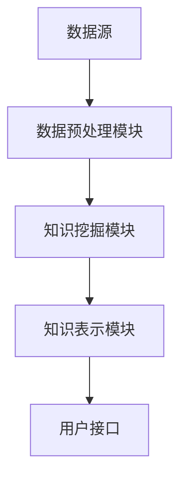

                 

关键词：知识发现引擎，企业应用，大数据，人工智能，商业智能

<|assistant|>摘要：本文将探讨知识发现引擎在企业中的应用，包括其背景介绍、核心概念与联系、核心算法原理、数学模型与公式、项目实践以及实际应用场景等内容。通过详细的分析和实例讲解，旨在为企业用户提供一个全面了解和掌握知识发现引擎的技术和实践指南。

## 1. 背景介绍

知识发现引擎（Knowledge Discovery Engine，简称KDE）是一种利用人工智能和数据挖掘技术，从大量数据中提取有价值知识和信息的高级工具。随着大数据时代的到来，企业面临着海量数据存储、管理和分析的需求，知识发现引擎在这种背景下应运而生。它能够帮助企业从海量数据中快速、准确地提取出有价值的信息和知识，为企业的决策提供强有力的支持。

企业应用知识发现引擎的主要目的是实现以下目标：

1. **提高业务效率**：通过对企业内部数据的分析，发现业务流程中的瓶颈和优化点，提高整体业务效率。
2. **提升客户体验**：通过分析客户行为数据，提供个性化的产品和服务，提升客户满意度和忠诚度。
3. **降低运营成本**：通过对供应链、库存等数据的分析，优化资源配置，降低运营成本。
4. **预测市场趋势**：通过对市场数据的分析，预测市场趋势，为企业制定发展战略提供依据。

## 2. 核心概念与联系

### 2.1 知识发现过程

知识发现（Knowledge Discovery in Databases，简称KDD）是一个循环迭代的过程，主要包括以下几个步骤：

1. **数据清洗**：对原始数据进行处理，去除重复、错误和无关的数据。
2. **数据集成**：将多个数据源中的数据整合到一个统一的格式中。
3. **数据简化**：通过降维、采样等方法减少数据规模，提高处理效率。
4. **数据挖掘**：使用算法从数据中提取出有价值的信息和知识。
5. **评估与解释**：对挖掘结果进行评估，确保其准确性和实用性。

### 2.2 知识发现引擎架构

知识发现引擎的架构通常包括以下几个关键组件：

1. **数据源**：包括内部数据（如企业内部数据库、业务系统）和外部数据（如社交媒体、行业报告等）。
2. **数据预处理模块**：对数据源进行数据清洗、集成和简化。
3. **知识挖掘模块**：包括多种数据挖掘算法，如分类、聚类、关联规则等。
4. **知识表示模块**：将挖掘出的知识以可视化、报告等形式呈现给用户。
5. **用户接口**：提供用户与知识发现引擎的交互界面。

### 2.3 Mermaid 流程图

下面是知识发现引擎的架构流程图：



## 3. 核心算法原理 & 具体操作步骤

### 3.1 算法原理概述

知识发现引擎的核心算法包括以下几种：

1. **分类算法**：根据已有数据对新的数据进行分类，常用的算法有决策树、支持向量机等。
2. **聚类算法**：将数据分为若干个类别，常用的算法有K-Means、层次聚类等。
3. **关联规则算法**：发现数据之间的关联关系，常用的算法有Apriori算法、FP-Growth算法等。
4. **预测算法**：基于历史数据对未来进行预测，常用的算法有线性回归、时间序列分析等。

### 3.2 算法步骤详解

1. **数据预处理**：
   - 数据清洗：去除重复、错误和无关的数据。
   - 数据集成：将多个数据源的数据整合到一个统一的格式中。
   - 数据简化：通过降维、采样等方法减少数据规模。

2. **知识挖掘**：
   - 分类算法：对数据进行分类，得到分类模型。
   - 聚类算法：对数据进行聚类，得到聚类结果。
   - 关联规则算法：发现数据之间的关联关系，得到关联规则。
   - 预测算法：基于历史数据对未来进行预测，得到预测模型。

3. **评估与解释**：
   - 对挖掘结果进行评估，确保其准确性和实用性。
   - 对挖掘结果进行解释，使其易于理解和应用。

### 3.3 算法优缺点

- **分类算法**：优点是能够明确地给出预测结果，缺点是需要大量的训练数据和计算资源。
- **聚类算法**：优点是能够发现数据中的自然分组，缺点是无法直接给出预测结果。
- **关联规则算法**：优点是能够发现数据之间的关联关系，缺点是规则数量过多时难以解释。
- **预测算法**：优点是能够对未来进行预测，缺点是预测结果的不确定性较大。

### 3.4 算法应用领域

- **金融行业**：用于风险评估、欺诈检测、股票市场预测等。
- **零售行业**：用于销售预测、库存管理、客户行为分析等。
- **医疗行业**：用于疾病预测、诊断辅助、药物研发等。
- **制造业**：用于设备故障预测、生产优化、供应链管理等。

## 4. 数学模型和公式 & 详细讲解 & 举例说明

### 4.1 数学模型构建

知识发现引擎中的数学模型通常包括以下几种：

- **分类模型**：如线性回归、决策树、支持向量机等。
- **聚类模型**：如K-Means、层次聚类等。
- **关联规则模型**：如Apriori算法、FP-Growth算法等。
- **预测模型**：如时间序列分析、线性回归等。

### 4.2 公式推导过程

以线性回归模型为例，其公式推导如下：

- **线性回归方程**：
  $$
  y = \beta_0 + \beta_1x + \epsilon
  $$
  其中，$y$为因变量，$x$为自变量，$\beta_0$和$\beta_1$为模型参数，$\epsilon$为误差项。

- **最小二乘法**：
  $$
  \min \sum_{i=1}^{n}(y_i - \beta_0 - \beta_1x_i)^2
  $$
  通过求解上述最小二乘问题，可以得到线性回归模型的参数$\beta_0$和$\beta_1$。

### 4.3 案例分析与讲解

以K-Means聚类算法为例，说明其在知识发现引擎中的应用。

- **案例背景**：
  一家零售企业希望通过分析顾客的购买数据，将顾客分为不同的群体，以便进行精准营销。

- **数据预处理**：
  - 数据清洗：去除重复、错误和无关的数据。
  - 数据集成：将多个数据源的数据整合为一个统一的格式。
  - 数据简化：通过降维、采样等方法减少数据规模。

- **聚类过程**：
  - 初始化聚类中心：随机选择K个数据点作为聚类中心。
  - 计算距离：计算每个数据点到每个聚类中心的距离。
  - 分配数据点：将每个数据点分配到最近的聚类中心。
  - 更新聚类中心：计算每个聚类中心的新位置。
  - 重复步骤3-5，直到聚类中心不再发生变化。

- **结果分析**：
  - 通过聚类结果，可以识别出不同的顾客群体，如高价值顾客、潜在流失顾客等。
  - 对不同群体的特征进行分析，为精准营销提供依据。

## 5. 项目实践：代码实例和详细解释说明

### 5.1 开发环境搭建

在Python环境下搭建知识发现引擎的开发环境，主要步骤如下：

1. 安装Python环境（版本3.6及以上）。
2. 安装必要的Python库，如NumPy、Pandas、Scikit-learn、Matplotlib等。

```shell
pip install numpy pandas scikit-learn matplotlib
```

### 5.2 源代码详细实现

以下是一个基于K-Means聚类算法的知识发现引擎的示例代码：

```python
import numpy as np
import pandas as pd
from sklearn.cluster import KMeans
import matplotlib.pyplot as plt

# 加载数据
data = pd.read_csv('customer_data.csv')
X = data.iloc[:, :2]  # 选择前两个特征

# K-Means聚类
kmeans = KMeans(n_clusters=3, random_state=0)
kmeans.fit(X)

# 绘制聚类结果
plt.scatter(X.iloc[:, 0], X.iloc[:, 1], c=kmeans.labels_)
plt.scatter(kmeans.cluster_centers_[:, 0], kmeans.cluster_centers_[:, 1], s=300, c='red')
plt.show()
```

### 5.3 代码解读与分析

1. **数据加载**：
   - 使用Pandas库加载CSV格式的顾客数据，并选择前两个特征作为输入数据。

2. **聚类过程**：
   - 使用Scikit-learn库的KMeans类进行聚类，设置聚类数量为3，随机种子为0。
   - 调用fit方法进行聚类，得到聚类结果。

3. **结果可视化**：
   - 使用Matplotlib库绘制聚类结果，包括顾客数据点和聚类中心。

### 5.4 运行结果展示

运行上述代码后，会得到一个散点图，显示顾客数据点根据K-Means算法划分的三个聚类结果。聚类中心用红色圈出，每个顾客数据点根据最近的聚类中心进行颜色标注。

## 6. 实际应用场景

### 6.1 金融行业

在金融行业中，知识发现引擎可以用于以下应用：

- **风险评估**：通过对客户的历史交易数据进行聚类分析，识别出高风险客户，降低信用风险。
- **欺诈检测**：通过关联规则挖掘，发现潜在的欺诈行为，提高欺诈检测的准确性。
- **投资预测**：通过时间序列分析和预测模型，预测股票市场的走势，为投资决策提供依据。

### 6.2 零售行业

在零售行业中，知识发现引擎可以用于以下应用：

- **客户细分**：通过对客户购买行为的数据分析，将客户分为不同的群体，提供个性化的营销策略。
- **销售预测**：通过时间序列分析和预测模型，预测未来的销售情况，优化库存管理。
- **供应链优化**：通过对供应链数据的分析，优化供应链各环节的资源配置，降低运营成本。

### 6.3 医疗行业

在医疗行业中，知识发现引擎可以用于以下应用：

- **疾病预测**：通过对患者病史和生物特征的数据分析，预测患者可能患有的疾病，提高诊断准确性。
- **药物研发**：通过对基因数据和药物反应的数据分析，发现新的药物作用机制和药物候选。
- **医疗资源分配**：通过对医院资源利用的数据分析，优化医疗资源的配置，提高医疗效率。

## 7. 工具和资源推荐

### 7.1 学习资源推荐

- **书籍**：
  - 《数据挖掘：实用工具与技术》（Authors: Han, Kamber, Pei）
  - 《机器学习》（Author: Tom Mitchell）
- **在线课程**：
  - Coursera上的《机器学习》课程（由Andrew Ng教授讲授）
  - edX上的《数据科学》课程（由Harvard University提供）

### 7.2 开发工具推荐

- **编程语言**：Python
- **数据挖掘库**：Scikit-learn、Pandas、NumPy
- **数据可视化库**：Matplotlib、Seaborn
- **大数据处理框架**：Apache Spark

### 7.3 相关论文推荐

- "K-Means Clustering: A Review"（2016）
- "A Comprehensive Survey of Classification Algorithms"（2017）
- "An Overview of Association Rule Mining"（2015）

## 8. 总结：未来发展趋势与挑战

### 8.1 研究成果总结

本文介绍了知识发现引擎在企业中的应用，包括其背景、核心概念、算法原理、数学模型、项目实践以及实际应用场景等内容。通过实例分析和代码实现，展示了知识发现引擎在实际业务中的应用价值。

### 8.2 未来发展趋势

1. **算法优化**：随着计算能力的提升，知识发现引擎将采用更高效、更准确的算法。
2. **多模态数据挖掘**：结合多种数据源，如文本、图像、音频等，进行多模态数据挖掘。
3. **实时知识发现**：实现实时数据分析和预测，为企业的实时决策提供支持。
4. **可解释性增强**：提高知识发现过程的透明度和可解释性，降低业务人员的使用门槛。

### 8.3 面临的挑战

1. **数据质量**：确保数据质量，减少数据噪声和错误。
2. **计算资源**：应对大规模数据处理和复杂算法计算的需求。
3. **隐私保护**：保护用户隐私，防止数据泄露。
4. **法律法规**：遵守相关法律法规，确保知识发现引擎的合规性。

### 8.4 研究展望

未来，知识发现引擎将在人工智能、大数据、云计算等技术的推动下，不断发展与创新。随着技术的进步，知识发现引擎将更好地服务于企业，推动企业实现智能化转型和创新发展。

## 9. 附录：常见问题与解答

### Q：知识发现引擎需要哪些基础知识？

A：知识发现引擎主要涉及以下基础知识：

- **数据挖掘**：了解常见的数据挖掘算法和过程。
- **机器学习**：掌握常见的机器学习算法和模型。
- **数据库**：了解数据库的基本概念和操作。
- **编程技能**：熟悉Python、R等编程语言。

### Q：如何选择合适的知识发现引擎？

A：选择合适的知识发现引擎应考虑以下因素：

- **业务需求**：根据业务需求选择适合的数据挖掘算法和功能。
- **数据规模**：考虑数据规模和计算资源，选择适合的引擎。
- **易用性**：考虑使用门槛和用户界面，选择易于操作和使用的引擎。
- **成本**：考虑成本和预算，选择性价比高的引擎。

### Q：知识发现引擎在实际应用中会遇到哪些问题？

A：在实际应用中，知识发现引擎可能会遇到以下问题：

- **数据质量问题**：数据噪声、错误和不一致性会影响模型性能。
- **算法选择问题**：选择不适合的算法可能导致模型效果不佳。
- **模型解释性**：复杂的模型难以解释，影响业务人员的理解和使用。
- **计算资源限制**：大规模数据处理和复杂算法计算可能超出计算资源限制。

