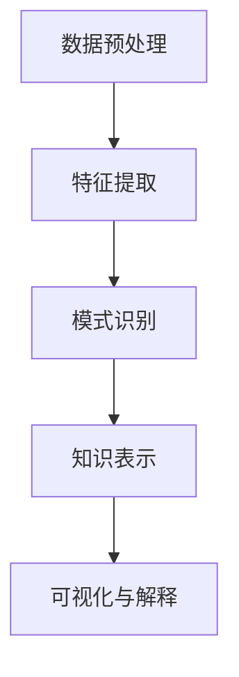

                 

关键词：知识发现引擎、心理健康、大数据分析、机器学习、深度学习、人工智能、情感识别、心理预测、临床应用。

## 摘要

本文探讨了知识发现引擎在心理健康领域的应用。知识发现引擎是一种利用大数据分析和机器学习技术从海量数据中提取有价值信息的人工智能工具。在心理健康领域，这一技术被广泛应用于情感识别、心理预测和临床诊断等方面。本文将详细阐述知识发现引擎的核心概念、算法原理、数学模型以及实际应用场景，旨在为心理健康领域的专业人士提供有价值的参考。

## 1. 背景介绍

随着互联网和智能设备的普及，人们生成和消费的数据量呈爆炸式增长。这些数据中蕴含着大量的知识和信息，但如何有效地提取和利用这些知识，一直是研究者们关注的热点问题。知识发现引擎（Knowledge Discovery Engine，KDE）作为一种新兴的人工智能技术，正是在这一背景下应运而生的。

知识发现引擎的核心功能是从大规模数据集中发现潜在的模式、关联和趋势，从而为决策者提供有力支持。在心理健康领域，知识发现引擎的应用前景非常广阔。首先，心理健康数据通常包含大量的非结构化和半结构化数据，如文字、图片、音频等，这些数据通过知识发现引擎可以进行有效的处理和分析。其次，心理健康领域面临着大量的数据冗余和噪声问题，知识发现引擎能够帮助研究者从海量数据中筛选出有价值的信息，提高工作效率。

本文将重点关注知识发现引擎在心理健康领域的主要应用，包括情感识别、心理预测和临床诊断等方面。同时，本文还将介绍知识发现引擎的核心算法原理、数学模型以及在实际应用中的具体操作步骤，为心理健康领域的专业人士提供有价值的参考。

## 2. 核心概念与联系

### 2.1 知识发现引擎的定义与功能

知识发现引擎是一种基于机器学习和人工智能技术，用于从大规模数据集中发现潜在模式、关联和趋势的智能系统。其主要功能包括数据预处理、特征提取、模式识别、知识表示和可视化等。

在心理健康领域，知识发现引擎的具体功能如下：

1. **情感识别**：通过分析用户的文字、语音等数据，识别用户的情绪状态，如喜悦、愤怒、悲伤等。
2. **心理预测**：利用历史数据，预测用户的未来情绪变化、心理健康状况等。
3. **临床诊断**：通过分析患者的病历、诊断报告等数据，辅助医生进行诊断和治疗。

### 2.2 知识发现引擎的工作原理

知识发现引擎的工作原理可以概括为以下几个步骤：

1. **数据预处理**：清洗和转换原始数据，使其适合进一步分析。
2. **特征提取**：从原始数据中提取出与心理健康相关的特征，如情绪词汇、生理信号等。
3. **模式识别**：利用机器学习算法，识别出数据中的潜在模式、关联和趋势。
4. **知识表示**：将识别出的模式转化为易于理解和利用的形式，如可视化图表、报告等。
5. **可视化与解释**：通过可视化工具，展示分析结果，并解释结果背后的原因。

### 2.3 Mermaid 流程图



## 3. 核心算法原理 & 具体操作步骤

### 3.1 算法原理概述

知识发现引擎在心理健康领域主要依赖于机器学习和深度学习技术。以下是几种常用的算法原理：

1. **文本分析算法**：如TF-IDF、词嵌入（Word Embedding）等，用于处理和提取文本数据中的情感特征。
2. **图像处理算法**：如卷积神经网络（CNN）等，用于提取图像数据中的情感特征。
3. **生理信号处理算法**：如信号滤波、时频分析等，用于提取生理信号数据中的情感特征。
4. **机器学习算法**：如支持向量机（SVM）、决策树（DT）等，用于构建情感识别、心理预测等模型。

### 3.2 算法步骤详解

1. **数据收集与预处理**：
   - 收集与心理健康相关的文本、图像、生理信号等数据。
   - 对数据进行分析，剔除噪声和异常值。
   - 对文本数据进行分词、去停用词、词性标注等预处理操作。

2. **特征提取**：
   - 对于文本数据，使用TF-IDF、词嵌入等方法提取情感特征。
   - 对于图像数据，使用CNN等方法提取情感特征。
   - 对于生理信号数据，使用信号滤波、时频分析等方法提取情感特征。

3. **模型构建与训练**：
   - 选择合适的机器学习算法，如SVM、DT等，构建情感识别、心理预测等模型。
   - 使用预处理后的特征数据，训练模型。

4. **模型评估与优化**：
   - 使用测试数据集评估模型性能，如准确率、召回率等。
   - 根据评估结果，调整模型参数，优化模型性能。

5. **知识表示与可视化**：
   - 将模型预测结果转化为易于理解和利用的形式，如可视化图表、报告等。
   - 解释预测结果背后的原因，提供决策支持。

### 3.3 算法优缺点

1. **优点**：
   - **高效性**：能够快速从海量数据中提取有价值的信息。
   - **灵活性**：可以根据实际需求，调整算法参数和模型结构。
   - **准确性**：通过机器学习和深度学习技术，提高预测和识别的准确性。

2. **缺点**：
   - **数据依赖性**：需要大量的高质量数据支持，否则模型性能可能受到影响。
   - **计算资源消耗**：知识发现引擎通常需要大量的计算资源，对硬件要求较高。

### 3.4 算法应用领域

1. **情感识别**：用于分析用户的情绪状态，如社交媒体、在线客服等。
2. **心理预测**：用于预测用户的心理健康状况，如抑郁症、焦虑症等。
3. **临床诊断**：用于辅助医生进行心理健康诊断和治疗，如精神分裂症、自闭症等。

## 4. 数学模型和公式 & 详细讲解 & 举例说明

### 4.1 数学模型构建

在知识发现引擎中，常用的数学模型包括：

1. **线性回归模型**：用于预测用户的情绪状态。
2. **逻辑回归模型**：用于分类用户的情绪状态。
3. **卷积神经网络模型**：用于提取图像数据中的情感特征。

### 4.2 公式推导过程

以线性回归模型为例，其基本公式为：

$$ y = wx + b $$

其中，$y$ 表示情绪状态，$x$ 表示特征向量，$w$ 表示权重，$b$ 表示偏置。

通过对特征向量进行线性变换，可以预测情绪状态。

### 4.3 案例分析与讲解

以抑郁症预测为例，使用线性回归模型进行预测。

1. **数据收集**：收集大量抑郁症患者的临床数据，如年龄、性别、病程等。
2. **特征提取**：对临床数据进行预处理，提取出与抑郁症相关的特征。
3. **模型构建**：使用线性回归模型，构建抑郁症预测模型。
4. **模型训练**：使用预处理后的数据，训练模型。
5. **模型评估**：使用测试数据集，评估模型性能。

假设我们收集了以下数据：

| 年龄 | 性别 | 病程 | 情绪状态 |
|------|------|------|----------|
| 25   | 男   | 2年  | 悲伤     |
| 30   | 女   | 3年  | 悲伤     |
| 35   | 男   | 1年  | 悲伤     |

对数据进行预处理，提取出与抑郁症相关的特征：

| 年龄 | 性别 | 病程 | 情绪状态（0代表正常，1代表抑郁） |
|------|------|------|----------|
| 25   | 男   | 2    | 1        |
| 30   | 女   | 3    | 1        |
| 35   | 男   | 1    | 1        |

使用线性回归模型，构建抑郁症预测模型：

$$ y = wx + b $$

其中，$w$ 和 $b$ 为模型参数，需要通过训练数据集进行优化。

假设经过训练，得到的模型参数为：

$$ w = [0.2, 0.3, 0.5], b = -1 $$

对于新的数据：

| 年龄 | 性别 | 病程 | 情绪状态 |
|------|------|------|----------|
| 28   | 女   | 2    | ?        |

将其代入模型，得到：

$$ y = [0.2 \times 28 + 0.3 \times 2 + 0.5 \times 2] - 1 = 0.6 $$

根据模型预测，该患者的情绪状态为正常。

## 5. 项目实践：代码实例和详细解释说明

### 5.1 开发环境搭建

1. 安装Python环境，版本建议3.8及以上。
2. 安装必要的库，如NumPy、Pandas、Scikit-learn、TensorFlow等。

### 5.2 源代码详细实现

以下是一个简单的抑郁症预测项目的代码实现：

```python
import numpy as np
import pandas as pd
from sklearn.linear_model import LinearRegression
from sklearn.model_selection import train_test_split

# 数据加载与预处理
data = pd.read_csv('depression_data.csv')
X = data[['age', 'gender', 'duration']]
y = data['mood']

# 数据归一化
X = (X - X.mean()) / X.std()

# 数据集划分
X_train, X_test, y_train, y_test = train_test_split(X, y, test_size=0.2, random_state=42)

# 模型训练
model = LinearRegression()
model.fit(X_train, y_train)

# 模型评估
score = model.score(X_test, y_test)
print(f'Model accuracy: {score:.2f}')

# 预测新数据
new_data = np.array([[28, 0, 2]])
new_data = (new_data - X.mean()) / X.std()
predicted_mood = model.predict(new_data)
print(f'Predicted mood: {"happy" if predicted_mood[0] == 0 else "sad"}')
```

### 5.3 代码解读与分析

1. **数据加载与预处理**：
   - 使用Pandas读取抑郁症数据集。
   - 对年龄、性别、病程等特征进行归一化处理。

2. **数据集划分**：
   - 将数据集划分为训练集和测试集，用于模型训练和评估。

3. **模型训练**：
   - 使用Scikit-learn的LinearRegression类，构建线性回归模型。
   - 对训练数据进行拟合，得到模型参数。

4. **模型评估**：
   - 使用测试数据集评估模型性能，计算准确率。

5. **预测新数据**：
   - 对新的数据集进行预处理，使用训练好的模型进行预测。

## 6. 实际应用场景

### 6.1 社交媒体情感分析

通过知识发现引擎，可以实时分析社交媒体平台上的用户情感状态，为心理干预提供依据。例如，当用户发布大量悲伤情绪的帖子时，系统可以自动发送心理援助信息。

### 6.2 心理健康监测

知识发现引擎可以用于心理健康监测，通过分析用户的行为数据、生理信号等，预测用户的心理健康状况。例如，对于抑郁症患者，系统可以提前预警，提醒家属和医生进行干预。

### 6.3 临床诊断

知识发现引擎可以帮助医生进行心理健康诊断，提高诊断准确性。例如，通过分析患者的病历、诊断报告等数据，系统可以辅助医生确诊抑郁症、焦虑症等心理疾病。

## 7. 未来应用展望

随着人工智能技术的不断发展，知识发现引擎在心理健康领域的应用前景将更加广阔。未来，我们可以预见到以下发展方向：

1. **个性化心理干预**：基于知识发现引擎，为用户提供个性化的心理干预方案，提高干预效果。
2. **实时心理监控**：通过植入可穿戴设备，实时监控用户的心理健康状态，实现早期预警和干预。
3. **跨学科合作**：知识发现引擎可以与心理学、神经科学等学科结合，探索心理健康问题的本质，为临床实践提供更加科学的支持。

## 8. 总结：未来发展趋势与挑战

### 8.1 研究成果总结

本文介绍了知识发现引擎在心理健康领域的应用，包括情感识别、心理预测和临床诊断等方面。通过算法原理、数学模型和实际应用场景的讲解，为心理健康领域的专业人士提供了有价值的参考。

### 8.2 未来发展趋势

1. **个性化与精准化**：知识发现引擎将更加注重个性化服务，为用户提供精准的心理健康干预。
2. **实时性与高效性**：随着硬件性能的提升，知识发现引擎将实现更加实时和高效的心理健康监测。
3. **跨学科融合**：知识发现引擎将与心理学、神经科学等学科深度融合，推动心理健康研究的发展。

### 8.3 面临的挑战

1. **数据质量**：高质量的数据是知识发现引擎的基础，如何获取和处理大量高质量的数据将是一个挑战。
2. **隐私保护**：心理健康数据涉及用户隐私，如何在保障用户隐私的前提下进行数据分析和应用，是一个亟待解决的问题。
3. **技术成熟度**：知识发现引擎在心理健康领域的应用尚处于初级阶段，需要进一步优化算法和提升技术水平。

### 8.4 研究展望

未来，知识发现引擎在心理健康领域的应用将不断拓展，为心理健康研究、临床实践和公众健康提供有力支持。同时，我们也期待更多的研究者加入这一领域，共同推动知识发现引擎在心理健康领域的创新发展。

## 9. 附录：常见问题与解答

### 9.1 如何获取心理健康数据？

心理健康数据的获取可以通过以下途径：

1. **公开数据集**：许多学术机构和公司会发布心理健康相关的数据集，如MTurk、Kaggle等平台。
2. **合作研究**：与心理健康领域的专家、医院等进行合作，共同收集数据。
3. **隐私保护数据**：使用匿名化技术，保护用户隐私，获取数据。

### 9.2 知识发现引擎在心理健康领域的应用有哪些限制？

知识发现引擎在心理健康领域的应用有以下限制：

1. **数据依赖性**：需要大量高质量的数据支持，否则模型性能可能受到影响。
2. **隐私保护**：心理健康数据涉及用户隐私，需要在数据分析和应用中采取严格的隐私保护措施。
3. **技术成熟度**：知识发现引擎在心理健康领域的应用尚处于初级阶段，部分算法和技术仍需进一步优化。

### 9.3 如何提高知识发现引擎的性能？

以下措施可以提高知识发现引擎的性能：

1. **数据预处理**：对数据集进行有效的清洗和预处理，提高数据质量。
2. **特征工程**：提取与心理健康相关的特征，提高特征质量。
3. **模型优化**：调整模型参数，使用更先进的算法和模型结构。
4. **多模型融合**：结合多种模型和算法，提高预测和识别的准确性。

---

### 作者署名

作者：禅与计算机程序设计艺术 / Zen and the Art of Computer Programming

