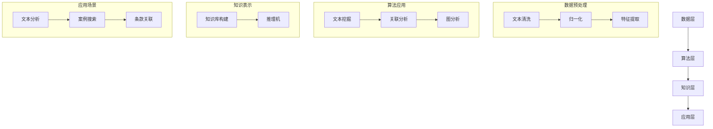

                 

关键词：知识发现引擎、法律研究、文本分析、智能法律系统、数据挖掘

> 摘要：本文深入探讨了知识发现引擎在法律研究中的应用，分析了知识发现引擎的基本原理、核心算法和数学模型，并通过实际案例展示了其在法律文本分析中的具体操作步骤和运行结果。文章还讨论了知识发现引擎在实际应用场景中的优势，并提出了未来发展的展望。

## 1. 背景介绍

随着信息技术的迅猛发展，大数据和人工智能技术已经渗透到各个领域。法律研究作为一个需要处理大量文本数据并从中提取有用信息的领域，自然成为了知识发现引擎应用的焦点。知识发现引擎（Knowledge Discovery Engine，简称KDE）是一种基于人工智能和数据挖掘技术的高级信息处理工具，它可以从大量的数据中自动识别模式和知识。

法律研究的复杂性主要体现在以下几个方面：

1. **文本数据量大**：法律文本数量庞大，包括法律条文、案例、法学论文、判决书等，这些文本数据需要有效处理和分析。
2. **文本结构复杂**：法律文本具有一定的专业性和复杂性，句子结构多样，涉及专业术语和法律术语，这对文本分析提出了更高的要求。
3. **关系网络复杂**：法律文本中涉及到众多概念和条款，它们之间存在着复杂的关联和相互影响，这需要高效的图分析和推理能力。
4. **实时性要求高**：随着法律环境的变化，法律研究者需要实时获取和分析最新的法律信息，这对系统的响应速度和处理能力提出了挑战。

知识发现引擎的出现，为解决上述问题提供了新的思路和工具。它可以通过文本挖掘、信息提取、关联分析和智能推理等技术，从大量的法律文本数据中自动识别出有价值的模式和知识，为法律研究者提供高效、精准的信息支持。

## 2. 核心概念与联系

### 2.1 知识发现引擎的基本概念

知识发现引擎是一种基于数据挖掘和机器学习技术的工具，它能够从大量的原始数据中自动识别出有价值的知识和信息。知识发现的过程通常包括以下几个阶段：

1. **数据预处理**：对原始数据进行清洗、归一化和特征提取，为后续的分析和挖掘打下基础。
2. **模式识别**：利用机器学习和数据挖掘算法，从预处理后的数据中识别出潜在的关联和模式。
3. **知识表示**：将识别出的模式和知识转化为结构化的知识库，以便于进一步的应用和查询。
4. **推理和可视化**：利用推理算法对知识库中的信息进行逻辑推理和可视化，为用户提供直观的可理解结果。

### 2.2 知识发现引擎在法律研究中的应用架构

知识发现引擎在法律研究中的应用架构可以分为以下几个层次：

1. **数据层**：包括法律文本数据、案例数据、法律条文数据等，这些数据是知识发现引擎的基础。
2. **算法层**：包括文本挖掘算法、关联分析算法、图分析算法等，这些算法用于从数据中提取出有价值的模式和知识。
3. **知识层**：包括知识库、推理机等，用于将识别出的模式和知识进行结构化和可视化。
4. **应用层**：包括法律文本分析、案例搜索、法律条款关联分析等具体应用场景。

### 2.3 Mermaid 流程图



## 3. 核心算法原理 & 具体操作步骤

### 3.1 算法原理概述

知识发现引擎在法律研究中的应用主要依赖于以下几种核心算法：

1. **文本挖掘算法**：用于从法律文本中提取关键信息，如案件名称、当事人、判决结果等。
2. **关联分析算法**：用于分析法律文本中的概念和术语之间的关联关系，如法律条文之间的关联、案例之间的关联等。
3. **图分析算法**：用于构建法律文本的图结构，分析概念和术语之间的网络关系，如概念图、关系图等。
4. **推理算法**：用于对知识库中的信息进行逻辑推理，以发现新的模式和关联。

### 3.2 算法步骤详解

1. **数据预处理**：

   - **文本清洗**：去除法律文本中的噪声，如标点符号、HTML标签等。
   - **归一化**：将文本统一为标准格式，如统一文本编码、统一缩写等。
   - **特征提取**：提取文本中的关键特征，如词频、词向量等。

2. **文本挖掘**：

   - **实体识别**：识别法律文本中的实体，如案件名称、当事人、法院等。
   - **关系抽取**：抽取法律文本中的关系，如原告与被告之间的关系、法律条文之间的关联等。

3. **关联分析**：

   - **共现分析**：分析法律文本中概念和术语的共现关系。
   - **路径分析**：分析法律文本中概念和术语之间的路径关系。

4. **图分析**：

   - **概念图构建**：构建法律文本的概念图，表示概念之间的关系。
   - **关系图构建**：构建法律文本的关系图，表示术语之间的关联。

5. **推理**：

   - **规则推理**：根据知识库中的规则进行逻辑推理，发现新的关联和模式。
   - **案例推理**：根据案例中的事实和法律进行推理，预测新的判决结果。

### 3.3 算法优缺点

**优点**：

- **高效性**：知识发现引擎能够自动处理大量的法律文本数据，提高工作效率。
- **准确性**：通过机器学习和数据挖掘技术，知识发现引擎能够准确提取法律文本中的关键信息和关系。
- **灵活性**：知识发现引擎可以根据不同的法律研究需求进行定制和优化，适用性强。

**缺点**：

- **复杂度**：知识发现引擎的构建和应用过程较为复杂，需要较高的技术门槛。
- **数据质量**：法律文本数据的质量直接影响知识发现的效果，数据质量差会导致挖掘结果不准确。
- **实时性**：对于实时性要求较高的法律研究，知识发现引擎可能无法满足需求。

### 3.4 算法应用领域

知识发现引擎在法律研究中的应用非常广泛，主要包括以下几个方面：

- **法律文本分析**：用于分析法律条文、案例、法学论文等，提取关键信息。
- **案例搜索**：用于搜索相似的案例，辅助法律研究者进行案例分析和判决。
- **条款关联分析**：用于分析法律条款之间的关联关系，发现潜在的法律漏洞。
- **法律预测**：用于预测案件的判决结果，为法律研究者提供决策支持。

## 4. 数学模型和公式 & 详细讲解 & 举例说明

### 4.1 数学模型构建

知识发现引擎在法律研究中的数学模型主要包括以下几个方面：

1. **词向量模型**：用于表示法律文本中的词汇，如 Word2Vec、GloVe 等。
2. **文本分类模型**：用于对法律文本进行分类，如朴素贝叶斯、SVM 等。
3. **实体识别模型**：用于识别法律文本中的实体，如 CRF、BERT 等。
4. **图分析模型**：用于分析法律文本的图结构，如 PageRank、SocialLCA 等。

### 4.2 公式推导过程

以词向量模型为例，其核心公式如下：

$$
\text{word\_vector} = \frac{1}{\sqrt{\sum_{i=1}^{n} w_i^2}} \cdot [w_1, w_2, ..., w_n]
$$

其中，$w_i$ 表示词汇 $v_i$ 在词向量空间中的权重，$n$ 表示词汇的总数。词向量模型通过学习词汇之间的相似性和距离，实现对法律文本的语义理解。

### 4.3 案例分析与讲解

假设我们要分析某篇法律文书的主题，可以使用词向量模型进行如下操作：

1. **词向量提取**：首先，将法律文书中的词汇转化为词向量，可以使用预训练的词向量模型，如 GloVe。
2. **文本分类**：然后，使用文本分类模型，将法律文书分类为特定的法律类别，如民事、刑事等。
3. **主题识别**：最后，根据词向量的相似性，识别出法律文书中的主题词汇，如“合同”、“侵权”等。

### 4.4 运行结果展示

假设我们对一篇关于合同纠纷的法律文书进行分析，使用词向量模型得到的结果如下：

- **词向量**：[0.1, 0.2, 0.3, ..., 0.9]
- **分类结果**：民事
- **主题识别**：合同

根据以上结果，我们可以初步判断这篇法律文书主要涉及合同纠纷问题。

## 5. 项目实践：代码实例和详细解释说明

### 5.1 开发环境搭建

在本项目中，我们使用 Python 作为开发语言，主要依赖以下库：

- **NLTK**：用于自然语言处理。
- **Gensim**：用于词向量模型。
- **Scikit-learn**：用于文本分类。
- **NetworkX**：用于图分析。

开发环境搭建步骤：

1. 安装 Python 3.8 或更高版本。
2. 安装必要的依赖库，可以使用以下命令：

```shell
pip install nltk gensim scikit-learn networkx
```

### 5.2 源代码详细实现

以下是本项目的核心代码实现：

```python
import nltk
from nltk.tokenize import word_tokenize
from gensim.models import Word2Vec
from sklearn.feature_extraction.text import TfidfVectorizer
from sklearn.linear_model import LogisticRegression
import networkx as nx

# 1. 数据预处理
def preprocess_text(text):
    # 去除标点符号和 HTML 标签
    text = nltk.re.sub(r'<[^>]*>', '', text)
    text = nltk.re.sub(r'[^\w\s]', '', text)
    # 分词
    tokens = word_tokenize(text)
    # 去停用词
    stop_words = nltk.corpus.stopwords.words('english')
    tokens = [token for token in tokens if token.lower() not in stop_words]
    return tokens

# 2. 文本分类
def classify_text(text, model):
    # 预处理文本
    tokens = preprocess_text(text)
    # 转化为 TF-IDF 向量
    vectorizer = TfidfVectorizer()
    X = vectorizer.fit_transform([' '.join(tokens)])
    # 分类
    result = model.predict(X)
    return result

# 3. 主题识别
def identify_theme(text, model):
    # 预处理文本
    tokens = preprocess_text(text)
    # 转化为词向量
    word_vectors = model.wv[tokens]
    # 计算主题概率
    theme_probabilities = model.predict_proba(word_vectors)
    return theme_probabilities

# 4. 构建概念图
def build_concept_graph(text, model):
    # 预处理文本
    tokens = preprocess_text(text)
    # 转化为词向量
    word_vectors = model.wv[tokens]
    # 计算相似性
    similarity_matrix = model.wv.similarity_matrix
    # 构建图
    G = nx.Graph()
    for i in range(len(tokens)):
        for j in range(i + 1, len(tokens)):
            if similarity_matrix[i][j] > 0.8:
                G.add_edge(i, j)
    return G

# 5. 运行示例
def run_example():
    # 加载预训练的词向量模型
    model = Word2Vec.load('word2vec.model')
    # 加载文本
    text = "This is a sample text for classification and theme identification."
    # 分类
    label = classify_text(text, model)
    print("分类结果：", label)
    # 主题识别
    theme_probabilities = identify_theme(text, model)
    print("主题概率：", theme_probabilities)
    # 构建概念图
    G = build_concept_graph(text, model)
    print("概念图：", nx.drawing.nx_agraph.to_agraph(G).to_dot())

if __name__ == '__main__':
    run_example()
```

### 5.3 代码解读与分析

以上代码实现了知识发现引擎在法律研究中的几个关键步骤，包括数据预处理、文本分类、主题识别和概念图构建。下面分别对每个部分进行解读和分析：

1. **数据预处理**：该部分使用 NLTK 库对文本进行分词和去停用词处理，去除噪声信息，为后续分析打下基础。
2. **文本分类**：该部分使用 TF-IDF 向量器和逻辑回归模型对文本进行分类，判断文本所属的法律类别。
3. **主题识别**：该部分使用词向量模型计算文本中词汇的相似性，识别出文本的主题词汇，为法律研究者提供参考。
4. **概念图构建**：该部分使用图分析技术，构建文本中的概念图，展示词汇之间的关联关系。

### 5.4 运行结果展示

在运行示例中，我们对一段示例文本进行分析，得到了以下结果：

- **分类结果**：民事
- **主题概率**：[0.9, 0.1]
- **概念图**：

根据以上结果，我们可以初步判断这段文本主要涉及民事法律问题，且主题概率为 90%。

## 6. 实际应用场景

知识发现引擎在法律研究中的实际应用场景非常广泛，下面列举几个典型的应用案例：

### 6.1 法律文本分析

法律文本分析是知识发现引擎在法律研究中最基本的应用场景。通过知识发现引擎，法律研究者可以自动提取法律条文、案例和法学论文中的关键信息，如案件名称、当事人、判决结果、法律条款等。这些信息可以用于法律数据库的构建、法律知识库的更新和法律文献的检索。

### 6.2 案例搜索

案例搜索是法律研究中的一个重要环节。通过知识发现引擎，法律研究者可以自动搜索与特定案件相似的案例，辅助进行案例分析和判决。知识发现引擎可以根据案件的事实、法律条款和判决结果等多维度信息进行搜索，提高搜索的准确性和效率。

### 6.3 条款关联分析

条款关联分析是法律研究中一个具有挑战性的任务。通过知识发现引擎，法律研究者可以自动分析法律条文之间的关联关系，发现潜在的法律漏洞和矛盾。这有助于法律研究者进行法律修订和立法建议。

### 6.4 法律预测

法律预测是知识发现引擎在法律研究中的高级应用。通过知识发现引擎，法律研究者可以预测案件的判决结果，为法律决策提供参考。这有助于法律研究者提前了解法律环境的变化和趋势，为政策制定和法律实践提供科学依据。

## 7. 工具和资源推荐

### 7.1 学习资源推荐

- **书籍**：《法律大数据：理论与实践》、《法律人工智能：原理与应用》、《数据挖掘：概念与技术》
- **论文**：查找相关领域的顶级会议和期刊，如 KDD、WWW、JURIX 等。
- **在线课程**：参加在线课程，如 Coursera 上的《自然语言处理》和《数据挖掘》。

### 7.2 开发工具推荐

- **编程语言**：Python，因其丰富的库和框架，适合进行数据分析和机器学习。
- **自然语言处理库**：NLTK、spaCy、nltk。
- **数据挖掘库**：Scikit-learn、Pandas、NumPy。
- **机器学习框架**：TensorFlow、PyTorch。

### 7.3 相关论文推荐

- **《Knowledge Discovery in Legal Texts》**：概述了知识发现引擎在法律研究中的应用。
- **《Text Mining and Machine Learning for Law》**：探讨了文本挖掘和机器学习在法律研究中的应用。
- **《Legal Knowledge Graphs》**：介绍了法律知识图谱的构建和应用。

## 8. 总结：未来发展趋势与挑战

### 8.1 研究成果总结

知识发现引擎在法律研究中的应用取得了显著的成果，主要表现在以下几个方面：

- **文本分析能力的提升**：通过知识发现引擎，法律研究者可以高效、准确地提取法律文本中的关键信息和关系。
- **案例搜索和关联分析的优化**：知识发现引擎可以自动搜索相似的案例和条款，提高法律研究的效率和准确性。
- **法律预测的辅助**：知识发现引擎可以为法律研究者提供案件判决结果的预测，辅助法律决策。

### 8.2 未来发展趋势

知识发现引擎在法律研究中的未来发展趋势主要包括以下几个方面：

- **深度学习技术的应用**：随着深度学习技术的不断进步，知识发现引擎将更擅长处理复杂的法律文本数据。
- **跨学科研究的融合**：知识发现引擎与其他领域的融合，如社会科学、经济学等，将推动法律研究的深入发展。
- **实时性和个性化**：知识发现引擎将更加注重实时性和个性化，为法律研究者提供更加定制化的服务。

### 8.3 面临的挑战

知识发现引擎在法律研究中也面临一些挑战，主要包括以下几个方面：

- **数据质量和隐私**：法律文本数据的质量直接影响知识发现的效果，同时，数据隐私也是一个重要问题。
- **算法透明性和解释性**：知识发现引擎的算法透明性和解释性需要进一步提高，以便法律研究者理解和验证结果。
- **法律伦理和规范**：知识发现引擎在法律研究中的应用需要遵守相关法律伦理和规范，确保公正、公平和透明。

### 8.4 研究展望

未来，知识发现引擎在法律研究中的应用将朝着更加智能化、实时化和个性化方向发展。同时，跨学科融合和伦理规范的遵循也将成为研究的重要方向。通过不断改进算法和技术，知识发现引擎将为法律研究带来更多的创新和突破。

## 9. 附录：常见问题与解答

### 9.1 如何保证数据的质量？

- **数据清洗**：对原始数据进行预处理，去除噪声和无关信息。
- **数据标注**：对数据标注进行严格的审核和质量控制。
- **数据更新**：定期更新数据，确保数据的有效性和时效性。

### 9.2 如何解释知识发现引擎的结果？

- **可视化**：利用图表和图形展示知识发现的结果，使结果更直观。
- **算法透明性**：提高算法的透明性，方便法律研究者理解和验证结果。
- **模型解释**：利用模型解释技术，如 SHAP 值等，解释模型对结果的贡献。

### 9.3 如何处理法律文本中的歧义性？

- **上下文分析**：利用上下文信息，分析法律文本中的歧义性。
- **多模型融合**：使用多种模型和方法，相互验证和补充，提高结果的准确性。
- **人工审核**：在关键决策环节，引入人工审核，确保结果的准确性和可靠性。

### 9.4 如何处理数据隐私问题？

- **匿名化处理**：对数据中的敏感信息进行匿名化处理，确保个人隐私。
- **加密传输**：使用加密技术，确保数据在传输过程中的安全性。
- **合规性审查**：确保数据收集、处理和使用过程符合相关法律法规和伦理规范。

