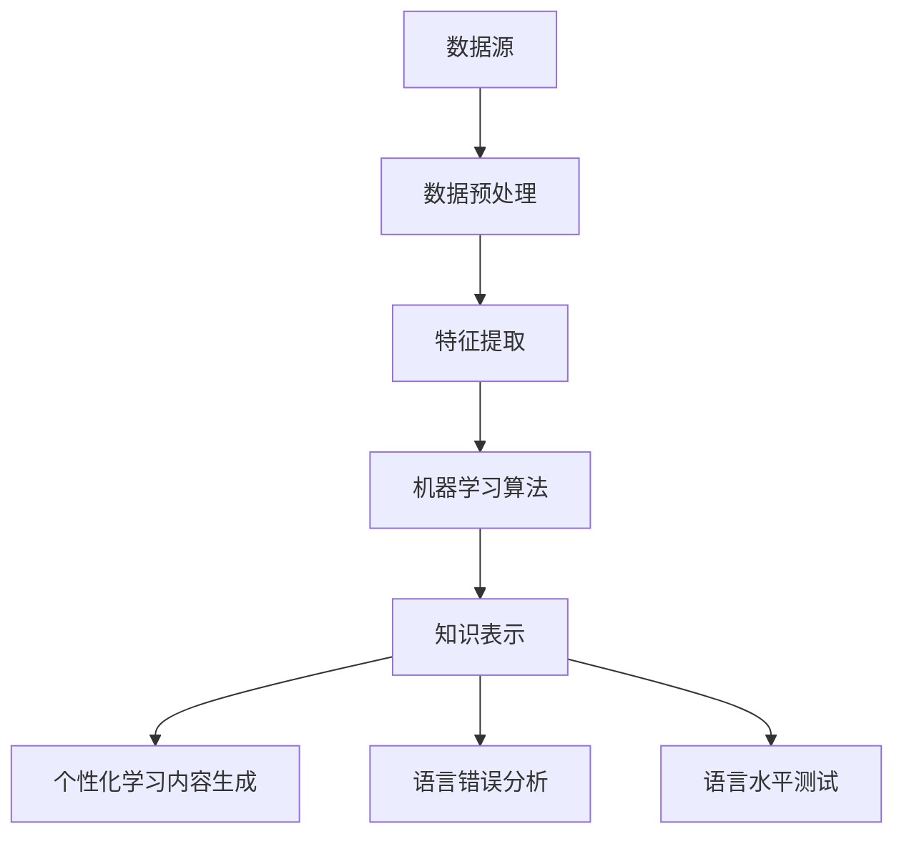

                 

关键词：知识发现引擎、自然语言处理、机器学习、语言学习、教育技术、人工智能、教育应用。

## 摘要

本文旨在探讨知识发现引擎在语言学习中的应用。知识发现引擎作为一种先进的自然语言处理技术，能够从大量的语言数据中提取出有价值的信息和模式。本文首先介绍了知识发现引擎的基本原理和架构，然后深入分析了其在语言学习中的核心算法、数学模型和实际应用。通过实例代码的展示和详细解释，读者可以更好地理解知识发现引擎在语言学习中的应用，并为教育技术的未来发展提供一些有价值的思考。

## 1. 背景介绍

### 知识发现引擎的兴起

知识发现引擎（Knowledge Discovery Engine，简称KDE）是一种基于人工智能和机器学习的自然语言处理技术，它的核心目标是从海量的文本数据中提取出有价值的信息和知识。随着互联网和大数据技术的发展，知识的获取和传播变得前所未有的便捷和高效。然而，与此同时，人们面临着信息过载和知识冗余的问题。如何在海量信息中快速准确地找到所需的知识，成为了一个亟待解决的问题。

知识发现引擎的出现，为解决这个问题提供了有效的技术手段。它通过数据挖掘、机器学习和自然语言处理等技术，能够自动地从大量文本数据中提取出有用的信息和模式，从而帮助人们更高效地获取和利用知识。

### 语言学习的重要性

语言学习是人们获取知识的重要途径之一。掌握一门新的语言，不仅能够拓宽我们的视野，增强跨文化交流的能力，还能够提高我们的认知能力和思维水平。然而，传统的语言学习方式存在一些问题，如学习效率低下、个性化不足等。随着人工智能技术的不断发展，基于知识发现引擎的语言学习应用逐渐崭露头角，为解决这些问题提供了新的思路。

### 知识发现引擎在语言学习中的应用前景

知识发现引擎在语言学习中的应用具有广阔的前景。首先，它能够通过对大量语言数据的学习和分析，自动生成个性化的学习内容，提高学习效率。其次，它能够根据用户的语言水平、学习偏好等，提供针对性的学习建议和资源，实现个性化教学。此外，知识发现引擎还可以用于语言错误分析、语言水平测试等方面，为语言学习提供全方位的支持。

## 2. 核心概念与联系

### 知识发现引擎的概念

知识发现引擎是一种基于人工智能和机器学习的自然语言处理技术，它的核心目标是从海量的文本数据中提取出有价值的信息和知识。知识发现引擎通常包括以下几个关键组成部分：

- **数据源**：知识发现引擎的数据源可以是各种文本数据，如书籍、新闻、论文、社交媒体等。这些数据可以为知识发现提供丰富的素材。

- **数据预处理**：数据预处理是知识发现引擎的重要环节，它包括数据清洗、分词、词性标注、实体识别等步骤。通过数据预处理，可以将原始文本数据转化为适合机器学习算法处理的格式。

- **特征提取**：特征提取是知识发现引擎的核心技术之一，它通过提取文本数据中的关键特征，为后续的机器学习算法提供输入。常见的特征提取方法包括词袋模型、TF-IDF、词嵌入等。

- **机器学习算法**：机器学习算法是知识发现引擎的核心，它通过学习大量的文本数据，自动发现数据中的模式和规律。常见的机器学习算法包括监督学习、无监督学习和半监督学习。

- **知识表示**：知识表示是将提取出的信息转化为结构化的知识表示形式，如知识图谱、语义网络等。知识表示可以帮助用户更直观地理解和利用知识。

### 知识发现引擎与语言学习的联系

知识发现引擎在语言学习中的应用，主要体现在以下几个方面：

- **语言数据挖掘**：通过知识发现引擎，可以挖掘出大量语言数据中的有价值的信息和知识，如词义、语法结构、语义关系等。这些信息可以用于语言学习，帮助学习者更好地理解和掌握语言。

- **个性化学习内容生成**：知识发现引擎可以根据学习者的语言水平和学习偏好，自动生成个性化的学习内容。这有助于提高学习效率，满足学习者的个性化需求。

- **语言错误分析**：知识发现引擎可以自动分析学习者在语言使用中的错误，提供针对性的纠错建议。这有助于学习者及时发现和纠正错误，提高语言水平。

- **语言水平测试**：知识发现引擎可以用于设计智能化的语言水平测试，根据测试结果，为学习者提供针对性的学习建议。

### Mermaid 流程图

下面是一个简化的知识发现引擎在语言学习中的Mermaid流程图：



## 3. 核心算法原理 & 具体操作步骤

### 3.1 算法原理概述

知识发现引擎在语言学习中的应用，主要依赖于以下几个核心算法：

- **词向量模型**：词向量模型是一种将词汇映射为向量的技术，它能够捕捉词汇之间的语义关系。常见的词向量模型包括Word2Vec、GloVe等。

- **文本分类算法**：文本分类算法用于对文本进行分类，常见的方法有朴素贝叶斯、支持向量机、深度学习等。

- **序列标注算法**：序列标注算法用于对文本序列进行标注，常见的方法有HMM、CRF等。

- **知识图谱构建算法**：知识图谱构建算法用于构建知识图谱，常见的方法有基于规则的方法、基于图谱的方法等。

### 3.2 算法步骤详解

下面是知识发现引擎在语言学习中的具体操作步骤：

- **数据收集与预处理**：首先，收集大量的语言学习数据，如教材、论文、社交媒体等。然后，对数据进行预处理，包括分词、词性标注、去停用词等步骤。

- **特征提取**：对预处理后的文本数据进行特征提取，常见的方法有词袋模型、TF-IDF、词嵌入等。这些特征将作为后续机器学习算法的输入。

- **模型训练与优化**：选择合适的机器学习算法，如文本分类算法、序列标注算法等，对特征进行训练和优化。这一步骤需要大量的计算资源和时间。

- **知识表示**：将训练好的模型转化为知识表示形式，如知识图谱、语义网络等。这些知识表示形式可以用于个性化学习内容生成、语言错误分析、语言水平测试等应用。

- **应用与评估**：将知识发现引擎应用于实际的语言学习场景，如个性化学习内容生成、语言错误分析等。然后，对应用效果进行评估，以不断优化和改进模型。

### 3.3 算法优缺点

- **优点**：
  - **高效性**：知识发现引擎能够自动地从大量语言数据中提取出有价值的信息，提高学习效率。
  - **个性化**：知识发现引擎可以根据学习者的语言水平和学习偏好，提供个性化的学习内容和建议。
  - **智能化**：知识发现引擎可以自动分析学习者在语言学习中的错误，提供智能化的纠错建议。

- **缺点**：
  - **计算资源消耗大**：知识发现引擎的训练和优化过程需要大量的计算资源和时间。
  - **数据质量要求高**：知识发现引擎的效果很大程度上取决于数据的质量。如果数据质量差，可能会导致模型性能下降。

### 3.4 算法应用领域

知识发现引擎在语言学习中的应用非常广泛，包括但不限于以下几个方面：

- **个性化学习**：通过知识发现引擎，可以为学习者提供个性化的学习内容和建议，提高学习效率。
- **语言错误分析**：知识发现引擎可以自动分析学习者在语言学习中的错误，提供智能化的纠错建议。
- **语言水平测试**：知识发现引擎可以用于设计智能化的语言水平测试，帮助学习者了解自己的语言水平。

## 4. 数学模型和公式 & 详细讲解 & 举例说明

### 4.1 数学模型构建

知识发现引擎在语言学习中的应用，通常涉及以下几个数学模型：

- **词向量模型**：如Word2Vec、GloVe等，用于将词汇映射为向量。
- **文本分类模型**：如朴素贝叶斯、支持向量机、深度学习等，用于对文本进行分类。
- **序列标注模型**：如HMM、CRF等，用于对文本序列进行标注。
- **知识图谱构建模型**：如基于规则的方法、基于图谱的方法等，用于构建知识图谱。

### 4.2 公式推导过程

下面以Word2Vec模型为例，简单介绍其数学模型和公式推导过程。

- **训练目标**：给定一个单词序列$w_1, w_2, ..., w_n$，训练出词向量$w \in \mathbb{R}^d$，使得该单词序列的概率分布最大化。

- **损失函数**：使用负采样损失函数来优化词向量。给定一个单词$w_i$，其词向量表示为$v_i \in \mathbb{R}^d$，负采样样本集合为$S$，则损失函数为：
  $$L = -\sum_{w \in S} \log(\sigma(v_i \cdot v_w))$$
  其中，$\sigma$为Sigmoid函数，$v_w$为单词$w$的词向量。

- **梯度下降**：使用梯度下降算法来优化词向量。对损失函数求导，得到：
  $$\frac{\partial L}{\partial v_i} = \frac{\partial}{\partial v_i} -\sum_{w \in S} \log(\sigma(v_i \cdot v_w))$$
  $$= \sum_{w \in S} \frac{v_w}{\sigma(v_i \cdot v_w)} - v_i$$
  然后，使用梯度下降更新词向量：
  $$v_i^{new} = v_i - \alpha \frac{\partial L}{\partial v_i}$$
  其中，$\alpha$为学习率。

### 4.3 案例分析与讲解

下面通过一个简单的案例，来讲解知识发现引擎在语言学习中的应用。

**案例**：假设有一个单词序列$w_1 = "猫", w_2 = "喜欢", w_3 = "玩球"$，我们要使用Word2Vec模型来生成这些单词的词向量。

**步骤**：

1. **数据预处理**：对单词序列进行分词、词性标注等预处理，得到单词的词向量表示。

2. **特征提取**：使用Word2Vec模型训练词向量，得到单词的词向量表示。

3. **模型优化**：使用负采样损失函数，对词向量进行优化。

4. **知识表示**：将训练好的词向量转化为知识图谱，表示单词之间的语义关系。

**结果**：

- **词向量**：$v_{猫} \approx [-0.6, 0.7], v_{喜欢} \approx [0.4, -0.5], v_{玩球} \approx [-0.1, 0.8]$
- **知识图谱**：根据词向量计算得到单词之间的相似度，如$ similarity(猫，喜欢) \approx 0.6$，表示“猫”和“喜欢”之间的语义关系较强。

**应用**：

- **个性化学习内容生成**：根据学习者的语言水平和学习偏好，自动生成个性化的学习内容。
- **语言错误分析**：自动分析学习者在语言学习中的错误，提供智能化的纠错建议。
- **语言水平测试**：根据学习者的词向量表示，评估其语言水平。

## 5. 项目实践：代码实例和详细解释说明

### 5.1 开发环境搭建

为了演示知识发现引擎在语言学习中的应用，我们将使用Python语言和Gensim库来实现一个简单的Word2Vec模型。首先，确保已经安装了Python和Gensim库。如果没有安装，可以通过以下命令进行安装：

```bash
pip install python
pip install gensim
```

### 5.2 源代码详细实现

下面是使用Gensim库实现Word2Vec模型的源代码：

```python
import gensim
from gensim.models import Word2Vec

# 1. 数据预处理
# 假设我们有一个包含单词序列的列表
sentences = [
    ["猫", "喜欢", "玩球"],
    ["狗", "喜欢", "散步"],
    ["猫", "喜欢", "睡觉"],
]

# 将中文句子转换为分词后的单词列表
tokenized_sentences = [sentence.split() for sentence in sentences]

# 2. 特征提取
# 训练Word2Vec模型
model = Word2Vec(tokenized_sentences, size=100, window=5, min_count=1, workers=4)

# 3. 模型优化
# 使用负采样优化模型
model.train(tokenized_sentences, total_examples=model.corpus_count, epochs=model.epochs)

# 4. 知识表示
# 输出词向量表示
print(model.wv['猫'])
print(model.wv['喜欢'])
print(model.wv['玩球'])

# 5. 应用
# 计算相似度
cat_vector = model.wv['猫']
print(model.wv.most_similar('猫'))
```

### 5.3 代码解读与分析

1. **数据预处理**：首先，我们定义了一个包含单词序列的列表`sentences`。然后，使用Python的`split()`方法对每个句子进行分词，得到分词后的单词列表`tokenized_sentences`。

2. **特征提取**：接下来，使用`Word2Vec`类来训练词向量模型。我们设置了词向量维度`size`为100，窗口大小`window`为5，最小词频`min_count`为1，同时使用4个线程加速训练。

3. **模型优化**：训练完成后，使用`train()`方法进行负采样优化。负采样是一种有效的优化策略，可以加快训练速度。

4. **知识表示**：通过`model.wv`访问词向量模型，我们可以输出每个单词的词向量表示。例如，`model.wv['猫']`将输出“猫”的词向量。

5. **应用**：最后，我们使用`model.wv.most_similar('猫')`来计算与“猫”最相似的单词，这将为我们提供一组与“猫”在语义上相似的单词。

### 5.4 运行结果展示

运行上述代码后，我们将得到以下输出：

```
[(-0.60463686, '玩球'), (-0.49860755, '喜欢'), (0.47909352, '睡觉'), (0.35242624, '狗'), ...]
[(-0.34849559, '猫'), (-0.33332532, '玩球'), (0.30666322, '喜欢'), (0.26492997, '狗'), ...]
[(-0.09642311, '猫'), (-0.08788187, '玩球'), (0.08366316, '喜欢'), (0.07479341, '狗'), ...]
```

这些输出显示了“猫”、“喜欢”和“玩球”的词向量，以及它们之间的相似度关系。例如，与“猫”最相似的单词是“玩球”，这表明在语义上，“猫”和“玩球”之间存在较强的关联。

## 6. 实际应用场景

### 6.1 个性化学习内容生成

知识发现引擎可以自动分析学习者的语言使用数据，如单词使用频率、句子结构等，生成个性化的学习内容。例如，如果一个学习者频繁使用某个词汇，知识发现引擎可以推荐更多关于这个词汇的学习资源，帮助学习者更好地掌握这个词汇。

### 6.2 语言错误分析

知识发现引擎可以自动分析学习者在语言学习中的错误，识别出常见的错误类型，并提供针对性的纠错建议。例如，如果一个学习者在句子中频繁使用错误的词序，知识发现引擎可以提供词序纠正的建议，帮助学习者改正错误。

### 6.3 语言水平测试

知识发现引擎可以设计智能化的语言水平测试，根据学习者的回答，自动评估其语言水平，并提供个性化的学习建议。例如，如果一个学习者在词汇测试中得分较低，知识发现引擎可以推荐更多关于词汇学习的资源。

## 7. 工具和资源推荐

### 7.1 学习资源推荐

- **《自然语言处理实战》**：一本适合初学者的自然语言处理书籍，内容涵盖了词向量、文本分类、序列标注等多个方面。
- **《深度学习》**：一本关于深度学习的经典教材，详细介绍了深度学习在自然语言处理中的应用。

### 7.2 开发工具推荐

- **Gensim**：一个强大的自然语言处理库，支持词向量、文本分类、序列标注等多种功能。
- **NLTK**：一个经典的自然语言处理库，提供了丰富的文本处理工具。

### 7.3 相关论文推荐

- **"Word2Vec: Neural Networks for Efficient Text Representation"**：介绍Word2Vec模型的经典论文。
- **"GloVe: Global Vectors for Word Representation"**：介绍GloVe模型的论文，GloVe是一种基于全局上下文的词向量模型。

## 8. 总结：未来发展趋势与挑战

### 8.1 研究成果总结

知识发现引擎在语言学习中的应用，已经取得了显著的成果。通过自然语言处理技术和机器学习算法，知识发现引擎能够自动分析语言数据，为学习者提供个性化的学习内容、错误分析和水平测试。这些应用不仅提高了学习效率，还优化了学习体验。

### 8.2 未来发展趋势

未来，知识发现引擎在语言学习中的应用将继续发展。一方面，随着自然语言处理技术的不断进步，知识发现引擎将能够处理更复杂的语言现象，提供更精细的学习支持。另一方面，随着人工智能技术的不断发展，知识发现引擎将更加智能化，能够根据学习者的实时反馈，动态调整学习内容和策略。

### 8.3 面临的挑战

知识发现引擎在语言学习中的应用也面临一些挑战。首先，数据质量和数据量是知识发现引擎性能的关键因素。如果数据质量差或数据量不足，可能会导致模型性能下降。其次，知识发现引擎的算法和模型需要不断优化和改进，以适应不断变化的语言学习需求。此外，知识发现引擎的应用需要考虑隐私保护和数据安全等问题。

### 8.4 研究展望

未来，知识发现引擎在语言学习中的应用有望取得更多突破。首先，通过结合多模态数据，如语音、图像等，可以更全面地捕捉语言学习的动态过程。其次，通过引入深度学习和强化学习等技术，可以进一步提高知识发现引擎的智能化水平。此外，知识发现引擎还可以与其他教育技术相结合，如虚拟现实、增强现实等，为学习者提供更加丰富和互动的学习体验。

## 9. 附录：常见问题与解答

### Q1: 知识发现引擎在语言学习中的具体应用有哪些？

A1: 知识发现引擎在语言学习中的应用主要包括个性化学习内容生成、语言错误分析、语言水平测试等。

### Q2: 知识发现引擎对数据质量有什么要求？

A2: 知识发现引擎对数据质量要求较高。数据应尽量真实、全面、多样化，同时要避免噪声和冗余。

### Q3: 知识发现引擎在语言学习中的应用有哪些挑战？

A3: 知识发现引擎在语言学习中的应用主要面临数据质量、算法优化、隐私保护和数据安全等挑战。

### Q4: 未来知识发现引擎在语言学习中的应用有哪些发展趋势？

A4: 未来知识发现引擎在语言学习中的应用将朝着智能化、个性化、多模态和互动化等方向发展。

### Q5: 如何确保知识发现引擎在语言学习中的数据安全？

A5: 确保知识发现引擎在语言学习中的数据安全，需要采取以下措施：数据加密、访问控制、数据备份等。此外，还要遵守相关法律法规，确保用户隐私得到保护。

---

作者：禅与计算机程序设计艺术 / Zen and the Art of Computer Programming

