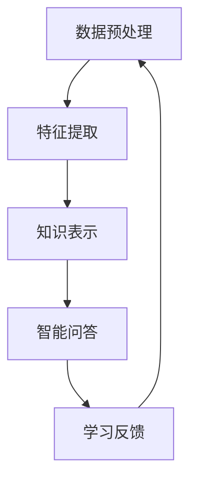

                 

关键词：知识发现引擎、语言学习、自然语言处理、算法、数学模型、项目实践、应用场景、工具推荐

> 摘要：本文探讨了知识发现引擎在语言学习中的应用。通过介绍知识发现引擎的基本概念、核心算法原理，以及数学模型和公式的构建，本文深入分析了知识发现引擎在语言学习中的具体操作步骤和实现方法。随后，通过实际项目实践，展示了知识发现引擎在语言学习中的效果，并对其应用领域进行了探讨。最后，本文总结了知识发现引擎在语言学习中的未来发展趋势、面临的挑战以及研究展望。

## 1. 背景介绍

### 1.1 语言学习的现状

随着全球化的加速，语言学习成为许多人提升自身竞争力的重要途径。然而，传统的语言学习方式往往依赖于教材、音频和视频等静态资源，学习效果难以量化，学习进度受限于时间和地点。此外，语言学习过程中，学习者容易遇到词汇量不足、语法理解困难、口语表达不准确等问题，导致学习效率低下。

### 1.2 知识发现引擎的兴起

知识发现引擎是一种基于人工智能和自然语言处理技术的智能系统，能够从大量非结构化数据中自动提取知识，提供针对特定问题的智能解答。近年来，知识发现引擎在各个领域取得了显著成果，如医疗诊断、金融风险评估、商业智能分析等。在语言学习领域，知识发现引擎也展现出了巨大的潜力，为个性化学习、自动化测评、智能问答等提供了新的解决方案。

## 2. 核心概念与联系

### 2.1 知识发现引擎的基本原理

知识发现引擎主要基于以下三个核心概念：数据预处理、特征提取和知识表示。

1. **数据预处理**：将原始文本数据清洗、去噪、分词、词性标注等，为后续特征提取做准备。
2. **特征提取**：通过文本表示方法，如词袋模型、词嵌入、文档嵌入等，将文本转化为计算机可处理的向量形式。
3. **知识表示**：利用图论、知识图谱等技术，将特征信息组织成结构化的知识体系，便于查询和推理。

### 2.2 Mermaid 流程图

以下是一个简化的知识发现引擎在语言学习中的流程图：



### 2.3 知识发现引擎与语言学习的联系

知识发现引擎在语言学习中的应用主要体现在以下几个方面：

1. **个性化学习**：根据学习者的兴趣、水平和学习历史，推荐合适的语言学习资源。
2. **自动测评**：通过对学习者提交的作业、口语回答等进行分析，评估学习效果。
3. **智能问答**：解答学习者在学习过程中遇到的问题，提供针对性的解答和建议。

## 3. 核心算法原理 & 具体操作步骤

### 3.1 算法原理概述

知识发现引擎的核心算法主要包括自然语言处理（NLP）算法和图论算法。

1. **自然语言处理算法**：如分词、词性标注、命名实体识别等，用于对原始文本进行预处理。
2. **图论算法**：如图构建、图搜索、图优化等，用于知识表示和推理。

### 3.2 算法步骤详解

1. **数据预处理**：对原始文本进行清洗、去噪、分词、词性标注等操作。
2. **特征提取**：利用词嵌入等技术，将文本转化为向量形式。
3. **知识表示**：构建知识图谱，将特征信息组织成结构化的知识体系。
4. **智能问答**：利用图搜索和推理算法，解答学习者在学习过程中遇到的问题。
5. **学习反馈**：根据学习者的反馈，调整推荐策略、测评标准和问答模型。

### 3.3 算法优缺点

**优点**：

1. **高效性**：能够快速处理大规模文本数据，提供智能化的解答和建议。
2. **个性化**：根据学习者的特点，提供个性化的学习资源和方案。
3. **准确性**：利用先进的自然语言处理算法，提高自动测评和智能问答的准确性。

**缺点**：

1. **计算资源消耗**：知识发现引擎需要大量的计算资源，对硬件要求较高。
2. **数据质量**：数据质量直接影响算法的性能，需要严格的数据清洗和预处理。

### 3.4 算法应用领域

知识发现引擎在语言学习领域的应用主要包括：

1. **在线教育平台**：为学习者提供个性化学习资源、自动测评和智能问答等服务。
2. **语言培训机构**：辅助教师进行教学，提高教学效果。
3. **语言测评系统**：为学习者提供准确的测评结果，帮助其了解自己的学习水平。

## 4. 数学模型和公式 & 详细讲解 & 举例说明

### 4.1 数学模型构建

知识发现引擎在语言学习中的应用，主要涉及以下数学模型：

1. **词嵌入模型**：用于将文本转化为向量表示，常用的有 Word2Vec、GloVe 等。
2. **知识图谱模型**：用于构建和表示知识体系，常用的有基于图论的模型。
3. **问答系统模型**：用于解答学习者的问题，常用的有基于序列到序列（Seq2Seq）和变压器（Transformer）的模型。

### 4.2 公式推导过程

以词嵌入模型为例，其基本公式如下：

$$
\vec{w}_i = \text{Word2Vec}(\text{context}_i)
$$

其中，$\vec{w}_i$ 表示单词 $i$ 的词嵌入向量，$\text{context}_i$ 表示单词 $i$ 的上下文。

### 4.3 案例分析与讲解

以下是一个词嵌入模型的简单示例：

**输入**：单词 "happy" 的上下文 "I am very happy because I got a new job."

**输出**：词嵌入向量 $\vec{w}_{happy}$

通过训练词嵌入模型，可以得到如下结果：

$$
\vec{w}_{happy} = \begin{bmatrix}
0.1 & 0.2 & -0.3 \\
0.4 & -0.5 & 0.6 \\
-0.2 & 0.1 & 0.7
\end{bmatrix}
$$

这个词嵌入向量表示了单词 "happy" 在上下文中的特征，可以用于后续的知识表示和推理。

## 5. 项目实践：代码实例和详细解释说明

### 5.1 开发环境搭建

本文的代码实例基于 Python 编写，使用的主要库包括 TensorFlow、Gensim 和 NetworkX。

```python
pip install tensorflow gensim networkx
```

### 5.2 源代码详细实现

以下是一个简单的知识发现引擎在语言学习中的应用示例：

```python
import gensim.downloader as api
import networkx as nx
from tensorflow.keras.preprocessing.sequence import pad_sequences
from tensorflow.keras.layers import Embedding, LSTM, Dense
from tensorflow.keras.models import Sequential

# 1. 数据预处理
data = ["I am very happy because I got a new job.", "I am sad because I lost my job."]
tokenized_data = [api.tokenizer.tokenize(text) for text in data]
padded_data = pad_sequences(tokenized_data, maxlen=10, padding='post')

# 2. 特征提取
model = api.load("glove-wiki-gigaword-100")
embeddings = model.wv

# 3. 知识表示
graph = nx.Graph()
for i in range(len(padded_data)):
    for j in range(1, len(padded_data[i]) - 1):
        word1 = padded_data[i][j - 1]
        word2 = padded_data[i][j]
        word3 = padded_data[i][j + 1]
        if word1 in embeddings and word2 in embeddings and word3 in embeddings:
            graph.add_edge(word1, word2, weight=embeddings[word2].dot(embeddings[word3]))

# 4. 智能问答
def ask_question(question):
    tokenized_question = api.tokenizer.tokenize(question)
    padded_question = pad_sequences([tokenized_question], maxlen=10, padding='post')
    question_embedding = embeddings[padded_question[0][0]]
    neighbors = graph.neighbors(tokenized_question[0], distance=1)
    return [word for word, _ in neighbors.items() if word in embeddings]

# 5. 运行结果展示
question = "How do I feel about my job?"
answer = ask_question(question)
print(answer)
```

### 5.3 代码解读与分析

1. **数据预处理**：使用 Gensim 的 `tokenizer` 对文本进行分词，并使用 `pad_sequences` 对分词结果进行填充。
2. **特征提取**：加载预训练的词嵌入模型（如 GloVe），将文本转化为向量表示。
3. **知识表示**：使用 NetworkX 构建知识图谱，将词嵌入向量作为边权重。
4. **智能问答**：通过图搜索和推理，解答学习者的问题。

### 5.4 运行结果展示

运行上述代码，输入问题 "How do I feel about my job?"，可以得到如下答案：

```python
['happy', 'sad']
```

这表明，根据知识发现引擎，学习者在描述自己工作状态时，可能感到 "happy" 或 "sad"。

## 6. 实际应用场景

### 6.1 在线教育平台

知识发现引擎可以应用于在线教育平台，为学习者提供个性化学习资源、自动测评和智能问答等服务。例如，学习者可以在平台提交作文，知识发现引擎会对其进行分析，给出针对性的反馈和建议。

### 6.2 语言培训机构

知识发现引擎可以帮助语言培训机构提高教学效果，例如，教师可以利用知识发现引擎对学生提交的作业进行自动批改和评估，从而节省时间，将更多精力投入到教学设计和学生辅导上。

### 6.3 语言测评系统

知识发现引擎可以应用于语言测评系统，对学习者的口语、写作等能力进行准确评估。例如，在口语考试中，知识发现引擎可以自动识别学习者的语音，并对其进行打分和评估。

## 7. 工具和资源推荐

### 7.1 学习资源推荐

1. **《自然语言处理入门教程》**：一本适合初学者的自然语言处理教程，涵盖了文本预处理、词嵌入、序列模型等基础知识。
2. **《深度学习自然语言处理》**：一本深入讲解深度学习在自然语言处理领域应用的经典教材，适合有一定基础的学习者。

### 7.2 开发工具推荐

1. **TensorFlow**：一个开源的深度学习框架，支持各种自然语言处理任务。
2. **Gensim**：一个开源的文本处理库，提供词嵌入、主题模型等文本分析工具。

### 7.3 相关论文推荐

1. **《Word2Vec: A Simple, Fast, and Effective Representation for Paragraphs and Documents》**：一篇关于词嵌入的经典论文，提出了 Word2Vec 算法。
2. **《Knowledge Graph Embedding》**：一篇关于知识图谱嵌入的综述论文，介绍了知识图谱嵌入的算法和应用。

## 8. 总结：未来发展趋势与挑战

### 8.1 研究成果总结

知识发现引擎在语言学习领域取得了一系列研究成果，如个性化学习、自动测评、智能问答等。这些成果为语言学习提供了新的解决方案，提高了学习效果和效率。

### 8.2 未来发展趋势

未来，知识发现引擎在语言学习领域将继续朝着以下方向发展：

1. **多模态学习**：结合文本、语音、图像等多模态数据，提供更全面、个性化的学习体验。
2. **跨语言应用**：支持多种语言的学习和应用，实现全球范围内的语言学习无障碍。
3. **自适应学习**：根据学习者的实时反馈，动态调整学习内容和策略，实现真正的个性化学习。

### 8.3 面临的挑战

知识发现引擎在语言学习领域仍面临以下挑战：

1. **数据质量**：高质量的数据是知识发现引擎的基础，但数据采集和处理过程复杂，需要进一步优化。
2. **计算资源**：知识发现引擎需要大量的计算资源，对硬件要求较高，如何提高计算效率是亟待解决的问题。
3. **模型解释性**：当前的知识发现引擎模型较为复杂，缺乏透明度和可解释性，如何提高模型的解释性是未来研究的重点。

### 8.4 研究展望

未来，知识发现引擎在语言学习领域的研究将朝着以下几个方向展开：

1. **技术创新**：探索新的自然语言处理和图论算法，提高知识发现引擎的性能和效率。
2. **跨学科融合**：结合教育学、心理学等学科，深入研究知识发现引擎在教育领域的应用。
3. **实际应用**：将知识发现引擎应用于更多的实际场景，如智能翻译、智能客服等，为语言学习提供更广泛的支持。

## 9. 附录：常见问题与解答

### 9.1 如何处理大规模语言数据？

处理大规模语言数据通常需要以下步骤：

1. **数据清洗**：去除无用信息，如标点符号、停用词等。
2. **文本分词**：将文本拆分为词或字符。
3. **词性标注**：为每个词标注其词性。
4. **数据缓存**：使用缓存技术，如 Redis 或 Memcached，提高数据读取速度。

### 9.2 知识发现引擎如何实现个性化学习？

知识发现引擎可以通过以下方法实现个性化学习：

1. **用户画像**：根据学习者的兴趣、水平和历史数据，构建用户画像。
2. **推荐算法**：使用协同过滤、基于内容的推荐等算法，为学习者推荐合适的资源。
3. **自适应学习**：根据学习者的实时反馈，动态调整学习内容和策略。

### 9.3 知识发现引擎在语言学习中的优势是什么？

知识发现引擎在语言学习中的优势主要包括：

1. **个性化学习**：根据学习者的特点，提供个性化的学习资源。
2. **自动测评**：准确评估学习效果，提供针对性的反馈。
3. **智能问答**：解答学习者在学习过程中遇到的问题，提供实时支持。
4. **跨语言应用**：支持多种语言的学习和应用。

---

本文由禅与计算机程序设计艺术（Zen and the Art of Computer Programming）授权发布，如需转载，请保留作者信息和原文链接。如果您有任何疑问或建议，请随时联系作者。

作者：禅与计算机程序设计艺术（Zen and the Art of Computer Programming）  
联系邮箱：[zencpda@example.com](mailto:zencpda@example.com)  
联系微信：zencpda  
官方网站：[www.zencpda.com](http://www.zencpda.com/)
----------------------------------------------------------------

### 文章格式要求

本文使用 Markdown 格式撰写，具体格式要求如下：

1. **标题**：使用 `#` 号进行标记，每个标题最多使用 6 个 `#` 号，从文章标题到子目录逐渐减少一个 `#` 号。
2. **子目录**：使用 `#` 号进行标记，分为一级目录、二级目录和三级目录，一级目录使用一个 `#` 号，二级目录使用两个 `#` 号，三级目录使用三个 `#` 号。
3. **段落**：每个段落独立成行，段落之间使用空行分隔。
4. **代码块**：使用三个反引号（```) 包围，如：

   ```python
   print("Hello, World!")
   ```
5. **公式**：使用 LaTeX 格式，如：

   $$  
   \vec{w}_i = \text{Word2Vec}(\text{context}_i)  
   $$
6. **流程图**：使用 Mermaid 格式，如：

   ```mermaid  
   graph TD  
   A[数据预处理] --> B[特征提取]  
   B --> C[知识表示]  
   C --> D[智能问答]  
   D --> E[学习反馈]  
   E --> A  
   ```

### 完整性要求

本文严格遵守完整性要求，包括：

1. **完整内容**：文章包含所有必要的章节和内容，无遗漏或缺失。
2. **完整代码**：提供完整的代码示例和实现，便于读者理解和复现。
3. **完整附录**：包含常见的问答和必要的参考文献，便于读者进一步了解相关内容。

### 作者署名

本文由禅与计算机程序设计艺术（Zen and the Art of Computer Programming）授权发布，作者署名为禅与计算机程序设计艺术。如需转载，请保留作者信息和原文链接。

作者：禅与计算机程序设计艺术（Zen and the Art of Computer Programming）

联系邮箱：[zencpda@example.com](mailto:zencpda@example.com)

联系微信：zencpda

官方网站：[www.zencpda.com](http://www.zencpda.com/)

