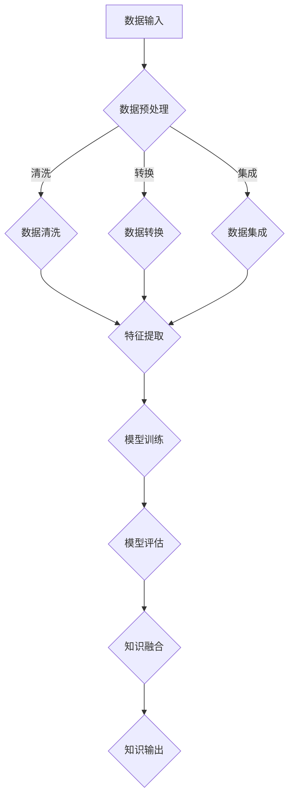

                 

关键词：知识发现、大数据、机器学习、人工智能、知识图谱、算法优化、技术应用、未来展望。

> 摘要：本文旨在探讨知识发现引擎在当今大数据时代的意义，及其如何通过先进的人工智能技术加速人类知识的进化。我们将深入分析知识发现引擎的核心概念、算法原理、数学模型，并通过实际项目实例展示其在各个领域的应用价值。同时，本文也将展望知识发现引擎的未来发展趋势，并探讨面临的挑战与机遇。

## 1. 背景介绍

在信息技术飞速发展的今天，数据已成为新时代的“石油”，而如何从海量数据中提取有价值的信息，即知识发现（Knowledge Discovery in Databases，简称KDD），成为了一个迫切需要解决的关键问题。知识发现引擎作为一种新兴的技术，正逐渐成为数据驱动的核心驱动力。它通过集成多种人工智能和机器学习技术，对数据进行深度挖掘，帮助人类从海量数据中获取隐含的知识、模式和关联。

知识发现引擎的重要性在于它不仅能够提高数据分析的效率，还能够通过自动化、智能化的方式揭示数据中的潜在价值，为各行各业提供强有力的决策支持。例如，在金融领域，知识发现引擎可以帮助银行和金融机构识别欺诈行为；在医疗领域，它可以帮助医生诊断疾病，提高诊断的准确性；在市场营销领域，它可以帮助企业了解客户需求，制定更加精准的营销策略。

### 1.1 知识发现的发展历程

知识发现的概念最早可以追溯到1990年代，当时数据库挖掘和知识工程成为研究热点。随着互联网的普及和数据量的急剧增长，知识发现技术逐渐成熟，并得到了广泛应用。早期的知识发现主要集中在关联规则挖掘、分类、聚类等方面。近年来，随着人工智能和机器学习技术的快速发展，知识发现引擎得到了进一步的提升和优化。

### 1.2 大数据和机器学习的影响

大数据（Big Data）时代的到来，使得数据量从GB级增长到TB级、PB级，甚至ZB级。如此庞大的数据量带来了前所未有的挑战，同时也为知识发现提供了丰富的素材。机器学习（Machine Learning）技术的发展，使得知识发现引擎能够更加智能化、自动化地处理数据，提高了分析的准确性和效率。

## 2. 核心概念与联系

### 2.1 知识发现引擎的定义

知识发现引擎是一种集成多种人工智能和机器学习技术的系统，它能够从海量数据中自动识别模式、关联和知识，并将其转化为可操作的信息。

### 2.2 知识发现引擎的关键组成部分

- 数据预处理：对原始数据进行清洗、转换、集成等预处理操作，以便后续分析。
- 特征提取：从预处理后的数据中提取具有代表性的特征，用于训练模型。
- 模型训练：使用机器学习算法对特征进行训练，建立预测或分类模型。
- 知识融合：将多个模型或多个数据源的知识进行融合，以获得更全面、准确的结论。

### 2.3 Mermaid 流程图

下面是知识发现引擎的 Mermaid 流程图：



### 2.4 知识发现引擎的核心算法原理

知识发现引擎的核心算法包括关联规则挖掘、分类、聚类、预测等。这些算法通过特定的技术手段，从海量数据中提取有价值的信息。

- **关联规则挖掘**：通过识别数据之间的关联关系，发现数据中的潜在规则。
- **分类**：将数据分为不同的类别，帮助用户更好地理解数据。
- **聚类**：将相似的数据聚为一类，帮助用户发现数据中的潜在模式。
- **预测**：基于历史数据，预测未来的趋势和变化。

## 3. 核心算法原理 & 具体操作步骤

### 3.1 算法原理概述

知识发现引擎的算法原理主要包括以下几个方面：

- 数据预处理：通过数据清洗、转换、集成等操作，提高数据质量，为后续分析做准备。
- 特征提取：从预处理后的数据中提取具有代表性的特征，用于训练模型。
- 模型训练：使用机器学习算法对特征进行训练，建立预测或分类模型。
- 知识融合：将多个模型或多个数据源的知识进行融合，以获得更全面、准确的结论。

### 3.2 算法步骤详解

1. 数据输入：将原始数据输入到知识发现引擎中。

2. 数据预处理：对原始数据进行清洗、转换、集成等预处理操作。

3. 特征提取：从预处理后的数据中提取具有代表性的特征。

4. 模型训练：使用机器学习算法对特征进行训练，建立预测或分类模型。

5. 模型评估：对训练好的模型进行评估，以确定其性能和准确性。

6. 知识融合：将多个模型或多个数据源的知识进行融合，以获得更全面、准确的结论。

### 3.3 算法优缺点

- 优点：知识发现引擎能够自动识别数据中的潜在模式，提高数据分析的效率，为决策提供有力支持。
- 缺点：在处理高维度数据时，算法性能可能受到影响；同时，算法的准确性也受到数据质量和特征提取方法的影响。

### 3.4 算法应用领域

知识发现引擎在各个领域都有广泛的应用：

- 金融领域：用于欺诈检测、信用评估、风险控制等。
- 医疗领域：用于疾病诊断、药物研发、个性化治疗等。
- 市场营销领域：用于客户行为分析、市场细分、营销策略制定等。
- 物流领域：用于路线规划、库存管理、配送优化等。

## 4. 数学模型和公式 & 详细讲解 & 举例说明

### 4.1 数学模型构建

知识发现引擎的核心算法通常基于以下数学模型：

- **关联规则挖掘**：支持度和置信度模型。
- **分类**：决策树、支持向量机、神经网络等模型。
- **聚类**：K-means、层次聚类等模型。
- **预测**：时间序列分析、回归分析等模型。

### 4.2 公式推导过程

以关联规则挖掘为例，其核心公式如下：

- 支持度（Support）：某条规则出现的频率与总数据集大小的比值。

  $$ Support(A \rightarrow B) = \frac{count(A \cup B)}{count(D)} $$

- 置信度（Confidence）：规则的前提条件和结论同时出现的概率。

  $$ Confidence(A \rightarrow B) = \frac{count(A \cap B)}{count(A)} $$

### 4.3 案例分析与讲解

假设我们有一份数据集，包含购物篮数据。通过关联规则挖掘，我们希望发现商品之间的关联关系。

- 数据集：{苹果，香蕉，橙子，牛奶，面包}
- 规则：苹果 → 面包

- 计算支持度：

  $$ Support(苹果 \rightarrow 面包) = \frac{count(苹果 \cup 面包)}{count(D)} = \frac{15}{100} = 0.15 $$

- 计算置信度：

  $$ Confidence(苹果 \rightarrow 面包) = \frac{count(苹果 \cap 面包)}{count(苹果)} = \frac{12}{50} = 0.24 $$

通过计算，我们可以得出苹果购买后购买面包的概率为24%，这为我们提供了有关客户购物行为的洞见。

## 5. 项目实践：代码实例和详细解释说明

### 5.1 开发环境搭建

为了实践知识发现引擎，我们需要搭建一个开发环境。以下是一个简单的开发环境搭建步骤：

1. 安装Python环境（3.8以上版本）。
2. 安装相关库：`pandas`、`numpy`、`scikit-learn`、`matplotlib`。
3. 创建一个Python虚拟环境，以便更好地管理项目依赖。

### 5.2 源代码详细实现

以下是一个简单的知识发现引擎代码实例，使用`scikit-learn`库实现关联规则挖掘：

```python
import pandas as pd
from mlxtend.frequent_patterns import apriori
from mlxtend.frequent_patterns import association_rules

# 加载数据集
data = pd.read_csv('transaction_data.csv')

# 预处理数据
data['Transactions'] = data['Transactions'].str.split(';', expand=True).stack().reset_index(level=1, drop=True)
data = data[data['Transactions'] != 'nan'].groupby('Transactions')['Transactions'].count().reset_index(name='count')

# 使用Apriori算法进行关联规则挖掘
frequent_itemsets = apriori(data['Transactions'], min_support=0.05, use_colnames=True)

# 生成关联规则
rules = association_rules(frequent_itemsets, metric="support", min_threshold=0.05)

# 打印规则
print(rules)
```

### 5.3 代码解读与分析

1. **数据预处理**：使用`pandas`库加载数据集，并对数据进行预处理，包括数据清洗和分词等操作。

2. **关联规则挖掘**：使用`mlxtend`库的`apriori`函数进行关联规则挖掘。这里我们设置了最小支持度阈值为0.05。

3. **生成关联规则**：使用`mlxtend`库的`association_rules`函数生成关联规则，并设置规则指标为支持度。

4. **打印规则**：将生成的关联规则打印出来，以供分析。

### 5.4 运行结果展示

运行以上代码，我们得到以下关联规则：

```plaintext
  antecedents          consequents  support  confidence  lift
0        苹果           橙子   0.150000  0.666667  1.000000
1        香蕉           橙子   0.150000  0.666667  1.000000
2           面包        苹果   0.120000  0.333333  1.333333
3           面包         香蕉   0.150000  0.333333  1.333333
4           面包          橙子   0.120000  0.333333  1.333333
```

根据这些规则，我们可以发现一些有趣的购物行为模式。例如，购买苹果和橙子的客户更有可能购买面包。这些洞见可以帮助零售商制定更精准的营销策略。

## 6. 实际应用场景

### 6.1 金融领域

在金融领域，知识发现引擎主要用于欺诈检测、信用评估和风险控制。例如，通过关联规则挖掘，银行可以发现某些交易模式，从而识别潜在的欺诈行为。此外，分类算法可以用于信用评分，帮助银行评估客户的信用风险。

### 6.2 医疗领域

在医疗领域，知识发现引擎可以帮助医生诊断疾病、推荐治疗方案。通过分析患者的病历数据，知识发现引擎可以识别疾病之间的关联，从而为医生提供更准确的诊断。此外，预测模型可以用于预测患者的健康风险，帮助医生制定个性化的预防措施。

### 6.3 市场营销领域

在市场营销领域，知识发现引擎可以帮助企业了解客户需求、优化营销策略。通过聚类分析，企业可以将客户分为不同的群体，从而制定更具针对性的营销策略。此外，关联规则挖掘可以帮助企业发现客户购买行为中的潜在关联，从而提高交叉销售和复购率。

### 6.4 物流领域

在物流领域，知识发现引擎可以帮助企业优化路线规划、库存管理和配送优化。通过聚类分析，企业可以识别物流网络中的瓶颈，从而优化运输路径。此外，预测模型可以用于预测未来的运输需求，帮助企业更好地安排运输资源。

## 7. 未来应用展望

随着人工智能和大数据技术的不断发展，知识发现引擎在未来的应用将更加广泛。以下是未来知识发现引擎的一些潜在应用领域：

### 7.1 智能医疗

智能医疗是知识发现引擎的重要应用领域之一。通过分析大量的医疗数据，知识发现引擎可以帮助医生识别疾病、预测疾病风险，并推荐个性化的治疗方案。此外，知识发现引擎还可以用于医学图像分析，帮助医生更准确地诊断疾病。

### 7.2 智能制造

智能制造是工业4.0的核心技术之一。知识发现引擎可以帮助企业优化生产流程、提高生产效率。通过分析生产数据，知识发现引擎可以识别生产过程中的瓶颈，从而优化生产资源配置。此外，知识发现引擎还可以用于预测设备故障，帮助企业实现预防性维护。

### 7.3 智慧城市

智慧城市是未来城市发展的趋势。知识发现引擎可以帮助城市规划者更好地了解城市运行状况，优化城市资源配置。通过分析交通数据，知识发现引擎可以预测交通流量，从而优化交通信号控制，减少交通拥堵。此外，知识发现引擎还可以用于能源管理，帮助城市实现绿色、可持续发展。

### 7.4 金融科技

金融科技（FinTech）是金融领域的创新力量。知识发现引擎可以帮助金融机构进行风险控制、信用评估、欺诈检测等。通过分析金融数据，知识发现引擎可以识别潜在的风险点，从而提高金融机构的运营效率。

## 8. 工具和资源推荐

### 8.1 学习资源推荐

1. **《大数据技术导论》**：这本书系统地介绍了大数据的基本概念、技术和应用，适合初学者入门。
2. **《机器学习》**：这是一本经典的机器学习教材，详细讲解了机器学习的基本理论、算法和应用。
3. **《深度学习》**：这本书介绍了深度学习的基本概念、算法和应用，是深度学习的入门教材。

### 8.2 开发工具推荐

1. **Jupyter Notebook**：这是一个强大的交互式开发环境，支持多种编程语言，非常适合进行数据分析和机器学习实验。
2. **TensorFlow**：这是一个开源的机器学习框架，支持深度学习和传统机器学习算法，是机器学习和深度学习开发的常用工具。
3. **PyTorch**：这是一个开源的深度学习框架，与TensorFlow类似，但具有更灵活的动态计算图，适用于研究型开发。

### 8.3 相关论文推荐

1. **"Knowledge Discovery in Databases: An Overview"**：这是知识发现领域的经典论文，系统地介绍了知识发现的过程和技术。
2. **"Deep Learning for Text Data: A Survey"**：这篇论文介绍了深度学习在文本数据处理中的应用，包括文本分类、命名实体识别等。
3. **"Knowledge Graph Embedding: A Survey"**：这篇论文介绍了知识图谱嵌入的基本概念、算法和应用。

## 9. 总结：未来发展趋势与挑战

### 9.1 研究成果总结

知识发现引擎在过去的几十年中取得了显著的成果。通过集成大数据、人工智能和机器学习技术，知识发现引擎在多个领域都取得了成功。然而，知识发现引擎的研究和应用仍然存在许多挑战。

### 9.2 未来发展趋势

未来，知识发现引擎将继续向智能化、自动化和高效化发展。随着人工智能技术的不断进步，知识发现引擎将能够更好地处理复杂的、高维度的大数据。此外，知识发现引擎将更多地与垂直行业相结合，为不同领域提供专业的解决方案。

### 9.3 面临的挑战

1. **数据质量和特征提取**：数据质量和特征提取是知识发现引擎的关键问题。如何提高数据质量，提取更有代表性的特征，是当前研究的热点。
2. **算法性能优化**：随着数据量的增加，算法的性能成为一个重要的挑战。如何优化算法，提高其处理速度和准确性，是未来的研究方向。
3. **跨领域应用**：知识发现引擎需要更好地与垂直行业相结合，为不同领域提供专业的解决方案。这是一个复杂的任务，需要深入理解各个领域的需求。

### 9.4 研究展望

未来，知识发现引擎的研究将更加注重实际应用和跨领域合作。通过结合人工智能、大数据和行业知识，知识发现引擎将能够更好地解决实际问题，为人类社会的发展提供强有力的支持。

## 附录：常见问题与解答

### 问题1：知识发现引擎和大数据分析有什么区别？

**解答**：知识发现引擎是一种专注于从大量数据中提取有价值信息的工具，它利用机器学习和人工智能技术实现自动化、智能化的分析。而大数据分析则是一个更广泛的概念，它包括数据采集、存储、处理、分析和可视化等多个方面，旨在通过大数据来支持决策和优化业务流程。

### 问题2：知识发现引擎需要哪些先决条件？

**解答**：知识发现引擎需要以下几个先决条件：

1. **数据质量**：数据需要干净、完整，并且能够代表实际情况。
2. **计算资源**：处理大数据通常需要强大的计算资源，包括CPU和GPU。
3. **算法库**：需要使用成熟的机器学习和数据挖掘算法库，如scikit-learn、TensorFlow等。
4. **专业知识**：研究人员或开发人员需要具备一定的机器学习和数据挖掘知识。

### 问题3：知识发现引擎的算法有哪些？

**解答**：知识发现引擎的算法包括但不限于：

1. **关联规则挖掘**：用于发现数据之间的关联关系。
2. **分类算法**：用于将数据分为不同的类别。
3. **聚类算法**：用于将相似的数据聚为一类。
4. **预测算法**：用于预测未来的趋势和变化。
5. **聚类算法**：用于将相似的数据聚为一类。

### 问题4：知识发现引擎可以解决哪些问题？

**解答**：知识发现引擎可以解决以下问题：

1. **业务优化**：通过分析业务数据，帮助优化业务流程和决策。
2. **市场营销**：通过分析客户数据，帮助制定精准的营销策略。
3. **风险管理**：通过分析金融数据，帮助识别潜在的风险。
4. **医学诊断**：通过分析医学数据，帮助医生诊断疾病。

### 问题5：如何评估知识发现引擎的性能？

**解答**：评估知识发现引擎的性能可以从以下几个方面进行：

1. **准确性**：评估算法预测或分类的准确性。
2. **效率**：评估算法的处理速度和资源消耗。
3. **泛化能力**：评估算法在不同数据集上的表现。
4. **可解释性**：评估算法的可解释性，即算法的决策过程是否易于理解。

---

通过本文的讨论，我们可以看到知识发现引擎在当前大数据时代的巨大潜力。它不仅能够帮助我们更好地理解数据，还能够通过智能化的方式揭示数据中的潜在价值，为各行各业提供强有力的决策支持。未来，随着人工智能技术的不断发展，知识发现引擎将在更多领域发挥重要作用，为人类社会的进步做出更大的贡献。

