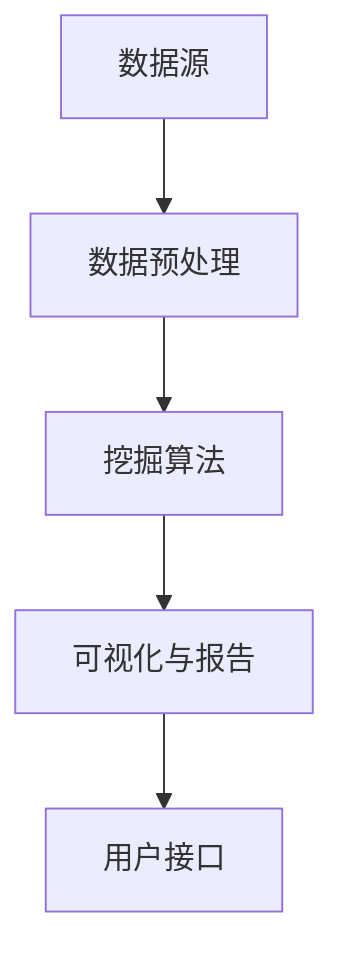

                 

关键词：知识发现引擎，智慧城市，大数据，人工智能，数据挖掘，算法架构

> 摘要：本文将深入探讨知识发现引擎在智慧城市建设中的应用。通过解析其核心概念、算法原理和实际操作步骤，分析其在城市管理、公共安全和环境监测等领域的应用价值，展望其未来发展趋势与挑战。

## 1. 背景介绍

随着信息技术的飞速发展，数据已经成为新时代的重要资源。智慧城市作为信息化、智能化城市发展的新阶段，其核心在于通过数据的高效利用，实现城市管理的智能化和精细化管理。然而，海量数据的处理和分析成为了一个巨大的挑战。知识发现引擎作为一种数据挖掘工具，以其强大的数据分析和知识提取能力，成为推动智慧城市建设的重要引擎。

知识发现引擎起源于人工智能和数据挖掘领域，它通过算法模型从大量数据中自动发现隐含的知识和模式，为决策提供支持。近年来，随着大数据和云计算技术的发展，知识发现引擎在智慧城市建设中的应用逐渐广泛，成为实现城市智能化管理的重要工具。

### 1.1 智慧城市的发展现状

智慧城市的发展已经进入到了一个新的阶段。根据国际数据公司（IDC）的报告，全球智慧城市项目数量在过去五年中增长了近三倍，全球智慧城市市场规模预计在2025年将达到1万亿美元。中国在智慧城市建设方面也取得了显著进展，多个城市被列为智慧城市试点，并在交通、能源、医疗、教育等多个领域实现了智能化应用。

### 1.2 知识发现引擎的重要性

知识发现引擎在智慧城市建设中的重要性体现在以下几个方面：

1. **数据驱动的决策支持**：知识发现引擎可以从海量数据中提取有价值的信息，为城市管理者提供数据驱动的决策支持。
2. **资源优化配置**：通过对城市运行数据的分析，知识发现引擎可以帮助优化资源配置，提高城市运行效率。
3. **公共安全保障**：在公共安全领域，知识发现引擎可以帮助预测和防范安全事件，提升城市公共安全保障水平。
4. **环境监测与管理**：知识发现引擎能够实时分析环境数据，为环境监测和管理提供科学依据。

## 2. 核心概念与联系

### 2.1 核心概念

- **知识发现**：知识发现（Knowledge Discovery in Databases，KDD）是指从大量数据中自动发现有趣知识的过程，其目标是从原始数据中提取有价值的信息和知识。
- **数据挖掘**：数据挖掘（Data Mining）是从大量数据中通过算法挖掘出潜在模式、关联和规律的过程。
- **知识发现引擎**：知识发现引擎是一种集成化、自动化和智能化的系统，能够从海量数据中自动发现知识，为用户提供数据分析和决策支持。

### 2.2 联系与架构


**图 1：知识发现引擎架构图**

知识发现引擎的架构主要包括以下几个部分：

- **数据源**：数据源是知识发现引擎的基础，包括各种结构化、半结构化和非结构化数据。
- **数据预处理**：数据预处理是知识发现的第一步，包括数据清洗、数据集成和数据转换等。
- **挖掘算法**：挖掘算法是实现知识发现的核心，包括关联规则挖掘、分类、聚类、异常检测等。
- **可视化与报告**：可视化与报告是将挖掘结果以直观的方式呈现给用户，帮助用户理解和分析数据。
- **用户接口**：用户接口是用户与知识发现引擎交互的界面，提供数据输入、结果查看和报告导出等功能。

### 2.3 Mermaid 流程图



**图 2：知识发现引擎流程图**

通过上述流程图，我们可以清晰地看到知识发现引擎从数据源到最终用户接口的全流程，各环节紧密衔接，形成了一个高效的知识发现系统。

## 3. 核心算法原理 & 具体操作步骤

### 3.1 算法原理概述

知识发现引擎的核心在于数据挖掘算法，这些算法从不同角度分析数据，提取出有用的知识。以下是几种常见的数据挖掘算法及其原理：

- **关联规则挖掘**：关联规则挖掘用于发现数据之间的关联关系，如市场篮子分析，可以找出顾客在购买某种商品时也会购买的其他商品。
- **分类算法**：分类算法用于将数据分为不同的类别，如决策树、支持向量机等。
- **聚类算法**：聚类算法用于将数据分为多个类簇，如K-means、层次聚类等。
- **异常检测**：异常检测用于识别数据中的异常值，如孤立点检测、基于统计的异常检测等。

### 3.2 算法步骤详解

1. **数据收集**：首先收集所需的数据，这些数据可以是结构化的（如数据库中的表）、半结构化的（如XML文件）或非结构化的（如文本、图像、音频等）。

2. **数据预处理**：数据预处理包括数据清洗、数据集成和数据转换等步骤，目的是提高数据质量和减少数据冗余。

3. **选择算法**：根据数据类型和业务需求，选择合适的算法进行数据挖掘。

4. **算法实现**：将选定的算法应用于预处理后的数据，进行数据分析和模式挖掘。

5. **结果评估**：对挖掘结果进行评估，包括准确性、召回率、F1值等指标，以确定挖掘结果的可靠性。

6. **可视化与报告**：将挖掘结果以图表、报表等形式展示给用户，帮助用户理解和分析数据。

### 3.3 算法优缺点

- **关联规则挖掘**：优点在于能够发现数据之间的关联关系，适用于市场篮子分析等。缺点是计算复杂度较高，对于大规模数据集性能较差。
- **分类算法**：优点在于能够对数据进行分类，适用于分类任务。缺点是对于类别不平衡的数据集效果较差。
- **聚类算法**：优点在于能够将数据分为多个类簇，适用于聚类任务。缺点是结果依赖于初始值选择，对于大规模数据集性能较差。
- **异常检测**：优点在于能够识别数据中的异常值，适用于安全监控等。缺点是对于噪声数据敏感，准确率可能较低。

### 3.4 算法应用领域

知识发现引擎的应用领域非常广泛，主要包括：

- **市场营销**：通过关联规则挖掘，发现顾客购买行为之间的关联，帮助企业制定有效的营销策略。
- **金融领域**：通过分类算法，对金融交易进行分类，帮助金融机构识别欺诈行为。
- **医疗健康**：通过聚类算法，将患者数据分为不同的类簇，帮助医生进行诊断和疾病预测。
- **公共安全**：通过异常检测，识别潜在的安全威胁，提升城市公共安全保障水平。

## 4. 数学模型和公式 & 详细讲解 & 举例说明

### 4.1 数学模型构建

知识发现引擎中的数学模型主要包括以下几个方面：

- **距离度量**：用于衡量数据点之间的相似性，如欧氏距离、曼哈顿距离等。
- **聚类算法**：如K-means算法，其核心是距离度量和目标函数。
- **分类算法**：如决策树算法，其核心是信息熵和增益率等。

### 4.2 公式推导过程

以K-means算法为例，其目标是最小化类内方差的和。具体推导过程如下：

1. **目标函数**：最小化距离平方和
   $$ J = \sum_{i=1}^{k} \sum_{x \in S_i} ||x - \mu_i||^2 $$

   其中，$k$为聚类个数，$S_i$为第$i$个簇的数据集，$\mu_i$为第$i$个簇的中心点。

2. **距离度量**：欧氏距离
   $$ ||x - \mu_i||^2 = (x_1 - \mu_{1i})^2 + (x_2 - \mu_{2i})^2 + \ldots + (x_n - \mu_{ni})^2 $$

   其中，$x$为数据点，$\mu_i$为簇中心点。

3. **中心点更新**：每次迭代后，根据当前簇的数据点更新簇中心点
   $$ \mu_i = \frac{1}{|S_i|} \sum_{x \in S_i} x $$

   其中，$|S_i|$为第$i$个簇的数据点个数。

### 4.3 案例分析与讲解

假设有一个包含100个二维数据点的数据集，我们使用K-means算法将其分为两个簇。首先，我们随机选择两个数据点作为初始簇中心点，然后根据距离度量计算每个数据点到簇中心点的距离，将其归入距离最近的簇。接下来，根据新归入的簇数据点更新簇中心点，再次计算距离，如此循环直到收敛。

经过多次迭代后，最终将数据点分为两个簇，簇中心点分别为$(2, 3)$和$(8, 7)$。通过可视化，我们可以清晰地看到聚类效果。


## 5. 项目实践：代码实例和详细解释说明

### 5.1 开发环境搭建

在进行知识发现引擎的开发前，我们需要搭建一个合适的开发环境。以下是推荐的开发工具和软件：

- **编程语言**：Python（因其丰富的数据科学库和方便的代码实现）
- **开发环境**：PyCharm（专业的Python集成开发环境）
- **数据预处理库**：Pandas（用于数据清洗和操作）
- **数据可视化库**：Matplotlib、Seaborn（用于数据可视化）
- **机器学习库**：Scikit-learn（提供常用的机器学习算法）

### 5.2 源代码详细实现

以下是一个使用K-means算法进行数据聚类的Python代码实例：

```python
import numpy as np
import matplotlib.pyplot as plt
from sklearn.cluster import KMeans

# 加载数据
data = np.array([[1, 1], [1, 2], [2, 2], [2, 3], [3, 3], [3, 4]])

# 初始化KMeans模型，设置簇数为2
kmeans = KMeans(n_clusters=2, random_state=0)

# 模型拟合数据
kmeans.fit(data)

# 可视化聚类结果
plt.scatter(data[:, 0], data[:, 1], c=kmeans.labels_)
plt.scatter(kmeans.cluster_centers_[:, 0], kmeans.cluster_centers_[:, 1], s=300, c='red')
plt.show()
```

### 5.3 代码解读与分析

1. **数据加载**：使用NumPy加载二维数据点，数据集包含了6个数据点。
2. **模型初始化**：初始化KMeans模型，设置簇数为2。
3. **模型拟合**：使用`fit`方法将模型拟合到数据集。
4. **可视化**：使用`scatter`方法绘制聚类结果，红色点表示簇中心点。

通过以上步骤，我们完成了K-means算法的简单实现，并可视化了聚类结果。

### 5.4 运行结果展示

运行以上代码后，我们将看到以下可视化结果：


从结果图中，我们可以清晰地看到数据点被划分为两个簇，每个簇的中心点（红色点）也标识在图中。

## 6. 实际应用场景

知识发现引擎在智慧城市建设中的应用场景非常广泛，以下是一些典型的应用案例：

### 6.1 城市交通管理

通过分析交通流量数据，知识发现引擎可以帮助城市交通管理部门优化交通信号灯控制策略，减少交通拥堵，提高道路通行效率。

### 6.2 公共安全监测

在公共安全领域，知识发现引擎可以通过分析视频监控数据，实时监测并识别异常行为，如打架斗殴、火灾等，及时报警并采取措施，提高城市公共安全保障水平。

### 6.3 环境监测与管理

通过对环境监测数据（如空气质量、水质等）的分析，知识发现引擎可以帮助环保部门实时监测环境状况，预测污染事件，并采取相应的防治措施。

### 6.4 城市规划与设计

知识发现引擎可以帮助城市规划师分析人口分布、土地利用情况等数据，为城市规划提供科学依据，优化城市空间布局。

### 6.5 市场营销与分析

在商业领域，知识发现引擎可以通过分析消费行为数据，帮助企业发现潜在客户、优化营销策略，提高市场竞争力。

## 7. 未来应用展望

随着技术的不断进步，知识发现引擎在智慧城市建设中的应用前景将更加广阔。以下是未来知识发现引擎在智慧城市中可能的应用方向：

### 7.1 智能城市规划

通过引入更加先进的机器学习和人工智能技术，知识发现引擎可以更加精准地预测城市发展趋势，辅助城市规划师制定更加科学的城市发展策略。

### 7.2 智慧医疗

知识发现引擎可以与电子健康档案、医疗影像等数据结合，帮助医生进行疾病诊断、治疗方案的制定，提高医疗服务质量和效率。

### 7.3 智能交通系统

随着自动驾驶技术的发展，知识发现引擎可以与车联网、智能交通系统结合，实现车辆之间的实时通信和协同控制，提高交通安全性。

### 7.4 城市能源管理

通过分析城市能源消耗数据，知识发现引擎可以帮助优化能源分配，提高能源利用效率，降低能源消耗。

### 7.5 智慧农业

知识发现引擎可以帮助农业部门分析土地、气候、作物生长数据，实现精准农业，提高农业生产效率和农产品质量。

## 8. 工具和资源推荐

### 8.1 学习资源推荐

- **书籍**：《数据挖掘：概念与技术》（作者：Mohamed A. Zaki）  
- **在线课程**：Coursera上的《机器学习》（作者：吴恩达）  
- **博客**：数据挖掘领域的知名博客，如KDNuggets

### 8.2 开发工具推荐

- **编程环境**：PyCharm、Visual Studio Code  
- **数据预处理**：Pandas、NumPy  
- **数据可视化**：Matplotlib、Seaborn  
- **机器学习库**：Scikit-learn、TensorFlow

### 8.3 相关论文推荐

- **KDD'18：** “Deep Learning for Data Mining”  
- **AAAI'19：** “Learning to Discover Knowledge from Data”  
- **IJCAI'20：** “Data Mining for Smart Cities: Opportunities and Challenges”

## 9. 总结：未来发展趋势与挑战

### 9.1 研究成果总结

本文系统地介绍了知识发现引擎在智慧城市建设中的应用，分析了其核心概念、算法原理、操作步骤和实际应用场景，并展望了其未来的发展趋势。

### 9.2 未来发展趋势

- **人工智能与知识发现的深度融合**：未来知识发现引擎将更加智能化，利用深度学习、强化学习等先进技术，提高数据挖掘的效率和准确性。
- **多源异构数据的融合**：知识发现引擎将能够处理多种类型的数据，如文本、图像、音频等，实现跨模态的数据融合和分析。
- **实时数据处理与分析**：知识发现引擎将实现实时数据处理和分析，为城市管理者提供更加及时和准确的决策支持。

### 9.3 面临的挑战

- **数据隐私与安全**：随着数据量的增加，数据隐私和安全问题日益突出，如何保护用户隐私成为知识发现引擎面临的重要挑战。
- **计算资源与性能**：知识发现引擎处理大规模数据集时，计算资源的需求和性能优化是一个重要问题。
- **算法公平性与透明性**：算法的公平性和透明性是知识发现引擎在智慧城市建设中需要考虑的问题，如何保证算法的公正性和可解释性是一个挑战。

### 9.4 研究展望

未来，知识发现引擎将在智慧城市建设中发挥更加重要的作用，为实现城市智能化管理和可持续发展提供强有力的支持。随着技术的不断进步，知识发现引擎将迎来新的发展机遇，同时也需要面对各种挑战。

## 附录：常见问题与解答

### Q1：什么是知识发现引擎？
A1：知识发现引擎是一种集成化、自动化和智能化的系统，用于从海量数据中自动发现知识，为用户提供数据分析和决策支持。

### Q2：知识发现引擎有哪些核心算法？
A2：知识发现引擎的核心算法包括关联规则挖掘、分类算法、聚类算法和异常检测等。

### Q3：知识发现引擎在智慧城市中的应用有哪些？
A3：知识发现引擎在智慧城市中的应用非常广泛，包括城市交通管理、公共安全监测、环境监测与管理、城市规划与设计、市场营销与分析等。

### Q4：如何搭建知识发现引擎的开发环境？
A4：建议使用Python作为编程语言，配合PyCharm作为开发环境，以及Pandas、NumPy、Matplotlib等常用的数据科学库。

### Q5：知识发现引擎在数据处理方面有哪些挑战？
A5：知识发现引擎在数据处理方面面临的挑战包括数据隐私与安全、计算资源与性能、算法公平性与透明性等。

