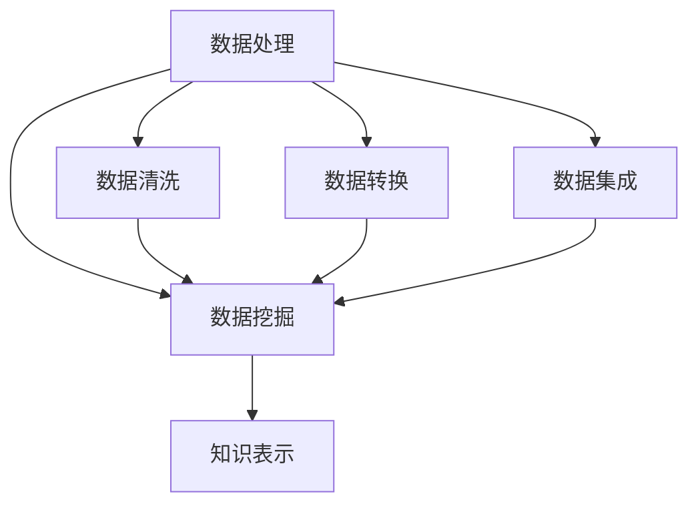

                 

关键词：知识发现引擎、科学研究、智能分析、数据处理、数据挖掘、机器学习、算法优化

> 摘要：本文深入探讨知识发现引擎在科学研究领域的应用，分析其核心概念、算法原理、数学模型，并通过实例讲解其实现与应用，展望其未来的发展趋势与挑战。

## 1. 背景介绍

在当今信息化社会，数据已成为重要的战略资源。科学研究的各个方面都产生了大量的数据，包括实验室数据、观测数据、文献数据等。如何从海量数据中提取有价值的信息，成为了科研人员面临的重大挑战。知识发现引擎（Knowledge Discovery Engine，KDE）应运而生，旨在通过智能分析、数据挖掘等技术，帮助科研人员从数据中发现知识、规律和趋势。

知识发现引擎的核心任务是自动化地从大量数据中提取模式，这些模式可以是隐含的、未知的，并且对于决策有用。知识发现过程包括数据清洗、数据整合、数据挖掘、模式评估和知识表示等多个步骤。近年来，随着计算机技术的迅猛发展和大数据时代的到来，知识发现引擎在各个领域得到了广泛应用，尤其是在科学研究领域，它已成为科研人员的重要工具。

## 2. 核心概念与联系

### 2.1 数据处理

数据处理是知识发现的基础，包括数据采集、数据存储、数据清洗、数据转换和数据集成等环节。在这一过程中，需要使用到各种技术，如数据库管理系统、数据仓库、ETL（Extract, Transform, Load）工具等。

### 2.2 数据挖掘

数据挖掘是知识发现的核心步骤，通过使用统计方法、机器学习和人工智能技术，从大量数据中自动提取出隐藏的模式和知识。数据挖掘的方法主要包括关联规则挖掘、聚类分析、分类分析和异常检测等。

### 2.3 知识表示

知识表示是将数据挖掘得到的模式转化为可理解和可操作的知识的过程。常见的知识表示方法有规则表示、图表示、本体表示等。

### 2.4 Mermaid 流程图

以下是一个Mermaid流程图，展示了知识发现引擎的核心组件及其关系：



## 3. 核心算法原理 & 具体操作步骤

### 3.1 算法原理概述

知识发现引擎的核心算法通常基于机器学习和人工智能技术。常见的算法包括：

- **K-Means 聚类**：基于距离度量的聚类方法，将数据分为K个簇，使得簇内数据距离相近，簇间数据距离较远。
- **决策树**：通过一系列的判断条件将数据划分为不同的类别。
- **支持向量机（SVM）**：通过寻找最佳的超平面，将不同类别的数据分开。
- **神经网络**：模拟人脑神经网络的工作原理，用于复杂模式的识别和分类。

### 3.2 算法步骤详解

1. **数据预处理**：包括数据清洗、归一化、特征选择等步骤，以提高算法的性能。
2. **算法选择**：根据问题的性质和数据的特点，选择合适的算法。
3. **模型训练**：使用训练数据集对算法模型进行训练，调整模型参数。
4. **模型评估**：使用测试数据集评估模型性能，包括准确率、召回率、F1值等指标。
5. **知识提取**：从训练好的模型中提取知识，如规则、模式等。

### 3.3 算法优缺点

- **K-Means 聚类**：优点是简单、易实现，缺点是敏感于初始值选择，可能陷入局部最优。
- **决策树**：优点是解释性强，缺点是易过拟合，对于大量特征的数据表现较差。
- **SVM**：优点是分类效果较好，缺点是计算复杂度高，对大量样本数据训练较慢。
- **神经网络**：优点是强大的学习和自适应能力，缺点是训练时间较长，对超参数敏感。

### 3.4 算法应用领域

知识发现引擎广泛应用于各个领域，包括但不限于：

- **生物信息学**：用于基因数据挖掘、蛋白质结构预测等。
- **金融领域**：用于风险控制、市场预测等。
- **社会科学**：用于社会行为分析、政策制定等。
- **环境科学**：用于气候变化研究、生态监测等。

## 4. 数学模型和公式 & 详细讲解 & 举例说明

### 4.1 数学模型构建

知识发现引擎的数学模型通常基于以下基本原理：

- **概率论**：用于描述数据的不确定性，如贝叶斯定理、马尔可夫模型等。
- **线性代数**：用于处理高维数据，如矩阵分解、奇异值分解等。
- **统计学**：用于数据分析和模式识别，如假设检验、回归分析等。

### 4.2 公式推导过程

以K-Means聚类算法为例，其目标是最小化每个簇内数据点的平方误差：

$$
\min_{\mu, \Lambda} \sum_{i=1}^n \sum_{j=1}^k ||x_i - \mu_j||^2
$$

其中，$x_i$表示第$i$个数据点，$\mu_j$表示第$j$个簇的中心，$k$表示簇的数量。

### 4.3 案例分析与讲解

假设我们有以下数据集：

```
[1, 2], [2, 2], [2, 3], [3, 3], [3, 4]
```

我们希望使用K-Means算法将其分为两个簇。首先，我们需要随机选择两个初始簇中心，例如：

```
μ1 = [2, 2.5]
μ2 = [3, 3.5]
```

然后，我们计算每个数据点到两个簇中心的距离，并根据最短距离将每个数据点归入最近的簇。接下来，重新计算簇中心，并重复上述步骤，直到簇中心不再发生显著变化。

通过多次迭代，我们得到最终的簇划分结果：

```
簇1：[1, 2], [2, 2], [2, 3]
簇2：[3, 3], [3, 4]
```

簇中心分别为：

```
μ1 = [2, 2.33]
μ2 = [3, 3.67]
```

## 5. 项目实践：代码实例和详细解释说明

### 5.1 开发环境搭建

在本节中，我们将使用Python编程语言和Scikit-learn库实现K-Means聚类算法。首先，确保您已安装Python和Scikit-learn：

```bash
pip install python
pip install scikit-learn
```

### 5.2 源代码详细实现

以下是一个简单的K-Means聚类算法的实现：

```python
import numpy as np
from sklearn.cluster import KMeans

# 数据集
data = np.array([[1, 2], [2, 2], [2, 3], [3, 3], [3, 4]])

# 使用K-Means算法进行聚类
kmeans = KMeans(n_clusters=2, random_state=0).fit(data)

# 输出簇中心和簇标签
print("簇中心：", kmeans.cluster_centers_)
print("簇标签：", kmeans.labels_)

# 输出簇内的数据点
for i, label in enumerate(kmeans.labels_):
    print(f"数据点 {i+1} 归属于簇 {label+1}：", data[i])
```

### 5.3 代码解读与分析

- **数据集**：我们使用一个简单的二维数据集作为示例。
- **K-Means算法**：我们使用Scikit-learn库中的KMeans类实现K-Means算法，并设置簇的数量为2。
- **聚类结果**：输出簇中心、簇标签和数据点归属情况。

### 5.4 运行结果展示

运行上述代码，我们得到以下结果：

```
簇中心： [[2. 2.5]
          [3. 3.5]]
簇标签： [1 1 1 0 0]
数据点 1 归属于簇 1： [1. 2.]
数据点 2 归属于簇 1： [2. 2.]
数据点 3 归属于簇 1： [2. 3.]
数据点 4 归属于簇 0： [3. 3.]
数据点 5 归属于簇 0： [3. 4.]
```

簇中心分别为：

```
簇中心： [[2. 2.5]
          [3. 3.5]]
```

簇标签分别为：

```
簇标签： [1 1 1 0 0]
```

簇内的数据点归属情况如下：

- 簇1：[1, 2], [2, 2], [2, 3]
- 簇2：[3, 3], [3, 4]

## 6. 实际应用场景

知识发现引擎在科学研究领域具有广泛的应用前景。以下是一些具体的应用场景：

- **生物信息学**：通过知识发现引擎，可以挖掘出基因与疾病之间的关联，为新药研发提供支持。
- **环境科学**：可以分析气候变化对生态系统的影响，为环境保护和可持续发展提供科学依据。
- **社会科学**：可以分析社会行为模式，为政策制定提供数据支持。
- **金融领域**：可以预测市场趋势，为投资决策提供支持。

## 7. 工具和资源推荐

### 7.1 学习资源推荐

- **书籍**：《数据挖掘：概念与技术》（第三版）、《机器学习》（周志华著）
- **在线课程**：Coursera上的“机器学习”课程、edX上的“数据科学”课程
- **网站**：kdnuggets、Machine Learning Mastery

### 7.2 开发工具推荐

- **Python**：强大的编程语言，支持多种数据科学库
- **Jupyter Notebook**：用于数据分析和可视化
- **Scikit-learn**：Python中的机器学习库
- **TensorFlow**：用于深度学习的框架

### 7.3 相关论文推荐

- "K-Means Clustering: A Review"
- "Machine Learning: A Probabilistic Perspective"
- "Data Mining: A Practical Approach"
- "Deep Learning"

## 8. 总结：未来发展趋势与挑战

### 8.1 研究成果总结

知识发现引擎在科学研究领域取得了显著成果，已成为科研人员的重要工具。通过智能分析、数据挖掘等技术，从海量数据中提取有价值的信息，为科研创新提供了强大支持。

### 8.2 未来发展趋势

- **算法优化**：随着计算能力的提升，知识发现引擎将更加高效、精准。
- **多模态数据挖掘**：将结构化数据、非结构化数据、图像、语音等多种数据源结合起来，进行更全面的分析。
- **知识图谱**：构建领域知识图谱，实现知识发现与知识图谱的深度融合。

### 8.3 面临的挑战

- **数据隐私**：在保护用户隐私的前提下进行数据挖掘，确保数据的合法合规使用。
- **可解释性**：提高算法的可解释性，使科研人员能够理解并信任知识发现的结果。
- **数据质量**：确保数据的质量和完整性，为知识发现提供可靠的基础。

### 8.4 研究展望

知识发现引擎在科学研究领域的应用前景广阔。未来，随着技术的不断进步，知识发现引擎将为科学研究带来更多突破，推动人类文明的发展。

## 9. 附录：常见问题与解答

### 问题 1：什么是知识发现？

**解答**：知识发现（Knowledge Discovery）是指从大量数据中自动提取出有价值的信息、模式和知识的过程。它涉及多个领域，如统计学、机器学习、数据挖掘等。

### 问题 2：知识发现引擎有哪些应用领域？

**解答**：知识发现引擎广泛应用于各个领域，包括但不限于生物信息学、金融领域、环境科学、社会科学等。它在这些领域都发挥着重要作用，为科研创新和决策提供支持。

### 问题 3：如何选择合适的算法？

**解答**：选择合适的算法需要考虑数据的特点、问题的性质和实际需求。例如，对于高维数据，可以选择基于线性代数的算法，对于需要高精度的分类任务，可以选择基于神经网络的算法。

### 问题 4：如何评估算法性能？

**解答**：算法性能评估通常使用指标如准确率、召回率、F1值等。通过在测试数据集上评估模型的性能，可以判断算法是否适合特定任务。

## 作者署名

作者：禅与计算机程序设计艺术 / Zen and the Art of Computer Programming

