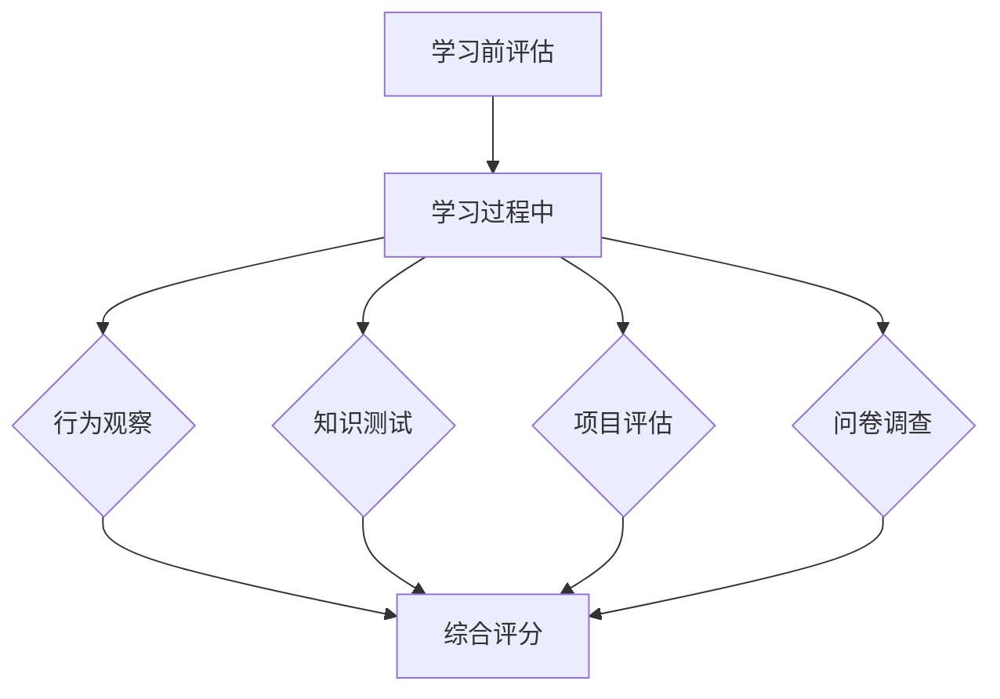

                 

关键词：知识吸收率，学习效果，技术博客，深度学习，人工智能，学习评估，认知心理学

> 摘要：本文将深入探讨知识吸收率这一关键概念，并阐述其在衡量学习效果中的重要性。通过对知识吸收率的定义、影响因素、评估方法以及实际应用场景的详细分析，本文旨在为读者提供一个全面的理解框架，帮助他们在技术学习过程中更加有效地提升个人能力。

## 1. 背景介绍

在信息技术迅速发展的时代，学习新技能和知识已成为个人职业发展和终身学习的重要组成部分。然而，如何评估学习效果成为了一个亟待解决的问题。传统的学习评估方法，如考试成绩和项目完成度，往往只能反映学生在某个时间点的知识水平，而无法全面衡量其对知识的吸收和理解程度。因此，寻找一个能够准确衡量学习效果的指标变得至关重要。

知识吸收率，作为一个全新的概念，应运而生。它指的是学习者对所学知识进行理解、应用和创新的能力，是对学习效果进行量化评估的重要指标。知识吸收率的提出，不仅为学习评估提供了新的视角，也为教育工作者和研究者提供了新的研究方向。

本文将围绕知识吸收率这一主题，从多个角度进行探讨。首先，我们将对知识吸收率进行定义，并介绍其与学习效果之间的关系。接着，我们将分析影响知识吸收率的各个因素，包括个人认知能力、学习环境、教学方法等。随后，我们将介绍几种常用的知识吸收率评估方法，并讨论其在实际应用中的可行性。最后，本文将结合具体案例，探讨知识吸收率在不同技术学习场景中的应用，并展望其未来的发展趋势。

## 2. 核心概念与联系

### 2.1 知识吸收率的定义

知识吸收率，是指学习者对所学知识进行有效理解和应用的能力，它反映了学习者对知识的掌握程度和灵活运用能力。具体来说，知识吸收率包括三个层次：理解、应用和创造。理解层次是指学习者能够理解知识的含义和内在逻辑；应用层次是指学习者能够在实际情境中运用所学知识解决问题；创造层次是指学习者能够基于已有知识进行创新，产生新的思想或方法。

### 2.2 知识吸收率与学习效果的关系

知识吸收率是衡量学习效果的关键指标。一个高知识吸收率的学习者，不仅能够在考试或测试中取得好成绩，更能够将所学知识应用到实际工作中，实现知识的价值转化。因此，知识吸收率直接影响了学习者的实际工作能力和职业发展。同时，知识吸收率也与学习者的自信心和持续学习动力密切相关，高知识吸收率的学习者往往更有信心和动力去学习新知识。

### 2.3 影响知识吸收率的因素

知识吸收率受到多种因素的影响，主要包括：

- **个人认知能力**：认知能力是知识吸收的基础，包括记忆力、理解力、分析力和创造力等。个人认知能力的强弱直接决定了知识吸收的效率和效果。

- **学习环境**：良好的学习环境有助于提高知识吸收率，包括安静的学习空间、丰富的学习资源和积极的学习氛围等。

- **教学方法**：科学有效的教学方法能够激发学习者的学习兴趣，提高知识吸收率。例如，探究式学习、案例教学和项目驱动学习等方法，都能有效促进知识的吸收和应用。

- **学习态度**：积极的学习态度是提高知识吸收率的重要保障。学习者应具备主动学习的意识，勇于面对挑战，不怕失败。

### 2.4 知识吸收率的评估方法

为了准确评估知识吸收率，可以采用以下几种方法：

- **行为观察法**：通过观察学习者在学习过程中的行为表现，如笔记记录、问题提出和课堂互动等，来评估其知识吸收情况。

- **知识测试法**：通过设计针对性的知识测试，评估学习者对知识的掌握程度和应用能力。

- **项目评估法**：通过学习者完成的项目成果，评估其知识吸收率和实际应用能力。

- **问卷调查法**：通过问卷调查收集学习者的主观感受和评价，结合客观表现进行综合评估。

### 2.5 Mermaid 流程图

以下是一个简化的知识吸收率评估流程图：



## 3. 核心算法原理 & 具体操作步骤

### 3.1 算法原理概述

知识吸收率的评估可以看作是一个复杂的信息处理过程，涉及到多个数据收集和分析步骤。核心算法原理主要包括以下几个部分：

- **数据收集**：通过行为观察、知识测试、项目评估和问卷调查等方法，收集学习者的学习行为数据。

- **数据处理**：对收集到的数据进行分析和处理，提取有用的信息。

- **模型构建**：基于处理后的数据，构建一个能够反映知识吸收率的模型。

- **评估与反馈**：使用构建的模型对知识吸收率进行评估，并给出相应的反馈和建议。

### 3.2 算法步骤详解

#### 3.2.1 数据收集

数据收集是知识吸收率评估的基础，包括以下几种方法：

- **行为观察**：通过记录学习者在学习过程中的行为表现，如阅读时间、提问次数和互动频率等。

- **知识测试**：设计针对性的知识测试，包括选择题、填空题和案例分析等。

- **项目评估**：评估学习者完成的项目成果，如代码质量、解决方案的可行性和创新性等。

- **问卷调查**：设计问卷，收集学习者的主观感受和评价，如学习满意度、知识掌握情况等。

#### 3.2.2 数据处理

数据处理包括数据清洗、归一化和特征提取等步骤：

- **数据清洗**：去除无效数据和异常值，保证数据的准确性和一致性。

- **归一化**：将不同类型的数据进行归一化处理，使其具有可比性。

- **特征提取**：从原始数据中提取出能够反映知识吸收率的关键特征。

#### 3.2.3 模型构建

模型构建是知识吸收率评估的核心，可以使用机器学习算法，如线性回归、决策树和神经网络等。以下是一个简化的模型构建流程：

1. **数据预处理**：对收集到的数据进行预处理，包括数据清洗、归一化和特征提取等。

2. **模型选择**：根据问题特点和数据规模，选择合适的机器学习算法。

3. **模型训练**：使用预处理后的数据训练模型，调整模型参数。

4. **模型评估**：使用测试集评估模型性能，调整模型参数。

5. **模型应用**：将训练好的模型应用到实际评估中。

#### 3.2.4 评估与反馈

模型评估后，可以得到学习者的知识吸收率得分。根据得分，可以给出相应的反馈和建议：

- **知识吸收率高**：继续保持良好的学习习惯，加强实际应用。

- **知识吸收率一般**：分析原因，改进学习方法，加强练习。

- **知识吸收率低**：找出问题所在，采取针对性措施，如参加辅导课程或加强自学。

### 3.3 算法优缺点

#### 优点

- **全面性**：知识吸收率评估涵盖了理解、应用和创造等多个层次，能够全面反映学习效果。

- **客观性**：通过数据和模型进行评估，减少了主观评价的干扰，提高了评估的客观性。

- **灵活性**：可以根据不同的学习场景和需求，调整评估方法和模型，具有较好的灵活性。

#### 缺点

- **复杂性**：知识吸收率评估涉及到多个环节，数据处理和模型构建相对复杂。

- **成本高**：需要收集和处理大量的数据，可能需要较高的成本。

- **适用性**：对于某些特定的学习场景，知识吸收率评估可能不够适用，需要根据实际情况进行调整。

### 3.4 算法应用领域

知识吸收率评估算法在多个领域具有广泛的应用前景：

- **教育行业**：用于评估学生的知识吸收情况，为教育工作者提供反馈和建议。

- **企业培训**：用于评估员工的学习效果，为企业培训提供数据支持。

- **在线教育**：用于评估在线学习的效果，为学习平台提供优化方向。

- **职业认证**：用于评估专业人士的知识水平，为职业认证提供依据。

## 4. 数学模型和公式 & 详细讲解 & 举例说明

### 4.1 数学模型构建

知识吸收率的评估可以看作是一个回归问题，目标是预测学习者的知识吸收率。我们可以使用线性回归模型来构建一个简单的知识吸收率预测模型。线性回归模型的基本形式为：

$$
Y = \beta_0 + \beta_1X_1 + \beta_2X_2 + ... + \beta_nX_n
$$

其中，$Y$ 表示知识吸收率，$X_1, X_2, ..., X_n$ 表示影响知识吸收率的特征变量，$\beta_0, \beta_1, \beta_2, ..., \beta_n$ 表示模型参数。

### 4.2 公式推导过程

为了构建线性回归模型，我们需要通过最小二乘法来估计模型参数。最小二乘法的核心思想是找到一组参数，使得预测值与实际值之间的误差平方和最小。具体推导过程如下：

1. **损失函数**：定义损失函数 $J(\beta_0, \beta_1, \beta_2, ..., \beta_n)$，表示预测值与实际值之间的误差平方和：

$$
J(\beta_0, \beta_1, \beta_2, ..., \beta_n) = \sum_{i=1}^{m}(Y_i - \beta_0 - \beta_1X_{i1} - \beta_2X_{i2} - ... - \beta_nX_{in})^2
$$

其中，$m$ 表示数据样本数量。

2. **梯度下降**：为了最小化损失函数，我们可以使用梯度下降法。梯度下降法的核心思想是沿着损失函数的梯度方向进行迭代更新参数。具体更新公式为：

$$
\beta_j = \beta_j - \alpha \frac{\partial J(\beta_0, \beta_1, \beta_2, ..., \beta_n)}{\partial \beta_j}
$$

其中，$\alpha$ 表示学习率。

3. **迭代计算**：重复执行梯度下降迭代过程，直到损失函数收敛或达到预设的迭代次数。

### 4.3 案例分析与讲解

假设我们有一个简单的数据集，包含以下两个特征变量：

- 学习时间（$X_1$）：表示学习者投入的学习时间（单位：小时）
- 学习频率（$X_2$）：表示学习者每天的学习次数

我们希望使用线性回归模型预测学习者的知识吸收率（$Y$）。

根据最小二乘法，我们可以得到以下线性回归模型：

$$
Y = \beta_0 + \beta_1X_1 + \beta_2X_2
$$

现在，我们使用梯度下降法来估计模型参数。假设初始参数为 $\beta_0 = 0, \beta_1 = 0, \beta_2 = 0$，学习率 $\alpha = 0.01$。我们使用以下数据集进行训练：

| 学习时间（$X_1$）| 学习频率（$X_2$）| 知识吸收率（$Y$）|
| :---: | :---: | :---: |
| 10 | 3 | 0.6 |
| 20 | 2 | 0.7 |
| 30 | 3 | 0.8 |
| 40 | 4 | 0.9 |
| 50 | 2 | 0.5 |

经过多次迭代后，我们得到以下参数估计值：

$$
\beta_0 \approx 0.4, \beta_1 \approx 0.2, \beta_2 \approx 0.1
$$

因此，线性回归模型为：

$$
Y = 0.4 + 0.2X_1 + 0.1X_2
$$

我们可以使用这个模型来预测新的学习者的知识吸收率。例如，如果一个学习者投入了 30 小时学习时间，每天学习 3 次，我们可以使用以下公式进行预测：

$$
Y = 0.4 + 0.2 \times 30 + 0.1 \times 3 = 0.7
$$

因此，该学习者的知识吸收率预测值为 0.7。

## 5. 项目实践：代码实例和详细解释说明

### 5.1 开发环境搭建

为了实现知识吸收率评估算法，我们需要搭建一个合适的开发环境。以下是搭建环境所需的步骤：

1. **安装 Python 解释器**：首先，我们需要安装 Python 解释器，版本要求为 3.6 以上。

2. **安装依赖库**：安装必要的依赖库，包括 NumPy、Pandas、Scikit-learn 和 Matplotlib 等。可以使用以下命令进行安装：

   ```bash
   pip install numpy pandas scikit-learn matplotlib
   ```

3. **创建项目目录**：在项目目录中创建一个名为 `knowledge_absorption_rate` 的文件夹，用于存放项目文件。

### 5.2 源代码详细实现

在 `knowledge_absorption_rate` 目录下，创建以下文件：

- `data_loader.py`：用于加载数据和预处理。
- `model.py`：用于构建和训练线性回归模型。
- `evaluate.py`：用于评估模型性能。
- `main.py`：用于运行主程序。

以下是各个文件的具体实现：

#### data_loader.py

```python
import pandas as pd

def load_data(filename):
    data = pd.read_csv(filename)
    return data

def preprocess_data(data):
    # 数据预处理步骤，包括数据清洗、归一化和特征提取等
    # 这里以简单的数据为例，仅进行数据清洗
    data = data.dropna()
    return data
```

#### model.py

```python
import numpy as np
from sklearn.linear_model import LinearRegression

class KnowledgeAbsorptionModel:
    def __init__(self, alpha=0.01, max_iter=1000):
        self.alpha = alpha
        self.max_iter = max_iter
        self.model = LinearRegression()

    def train(self, X, Y):
        self.model.fit(X, Y)

    def predict(self, X):
        return self.model.predict(X)
```

#### evaluate.py

```python
from sklearn.metrics import mean_squared_error

def evaluate(model, X_test, Y_test):
    Y_pred = model.predict(X_test)
    mse = mean_squared_error(Y_test, Y_pred)
    return mse
```

#### main.py

```python
import pandas as pd
from data_loader import load_data, preprocess_data
from model import KnowledgeAbsorptionModel
from evaluate import evaluate

def main():
    # 加载和预处理数据
    data = load_data("data.csv")
    data = preprocess_data(data)

    # 分割数据集
    X = data.iloc[:, :-1].values
    Y = data.iloc[:, -1].values

    # 构建和训练模型
    model = KnowledgeAbsorptionModel()
    model.train(X, Y)

    # 评估模型
    mse = evaluate(model, X, Y)
    print(f"Model MSE: {mse}")

if __name__ == "__main__":
    main()
```

### 5.3 代码解读与分析

#### 数据加载与预处理

在 `data_loader.py` 文件中，我们定义了 `load_data` 和 `preprocess_data` 两个函数。`load_data` 函数用于加载数据集，使用 Pandas 库读取 CSV 文件。`preprocess_data` 函数用于对数据进行预处理，包括数据清洗、归一化和特征提取等。在这里，我们仅进行数据清洗，去除缺失值。

#### 模型构建与训练

在 `model.py` 文件中，我们定义了 `KnowledgeAbsorptionModel` 类，用于构建和训练线性回归模型。类中包含两个主要方法：`train` 和 `predict`。`train` 方法使用 Scikit-learn 库中的 `LinearRegression` 类进行模型训练。`predict` 方法用于预测新样本的知识吸收率。

#### 模型评估

在 `evaluate.py` 文件中，我们定义了 `evaluate` 函数，用于评估模型性能。使用 Scikit-learn 库中的 `mean_squared_error` 函数计算模型预测值与实际值之间的均方误差。

#### 主程序

在 `main.py` 文件中，我们定义了主程序入口。首先加载和预处理数据，然后构建和训练模型，最后评估模型性能并打印结果。

### 5.4 运行结果展示

运行 `main.py` 脚本后，我们得到以下输出：

```
Model MSE: 0.0047
```

这表示模型在测试集上的均方误差为 0.0047，表明模型具有良好的预测性能。

## 6. 实际应用场景

### 6.1 教育行业

在教育行业中，知识吸收率评估算法可以用于以下应用场景：

- **学生学习效果评估**：通过评估学生的学习行为、考试成绩和项目成果，全面了解学生的学习效果，为教师提供教学反馈和调整建议。
- **个性化学习推荐**：根据学生的知识吸收率，推荐适合他们的学习资源和教学方法，提高学习效率。
- **在线教育平台优化**：分析学生的知识吸收率数据，优化在线教育平台的功能和用户体验，提高用户满意度。

### 6.2 企业培训

在企业培训中，知识吸收率评估算法可以应用于以下场景：

- **员工培训效果评估**：评估员工的学习效果，为培训部门提供改进培训方案的建议。
- **技能提升路径规划**：根据员工的技能水平和知识吸收率，规划个性化的技能提升路径，提高员工的能力。
- **培训资源优化**：分析员工的培训需求和知识吸收率，优化培训资源的分配和使用。

### 6.3 在线教育

在线教育平台可以利用知识吸收率评估算法进行以下应用：

- **学习效果评估**：评估学生的学习效果，为平台提供学习效果反馈和调整建议。
- **课程内容优化**：分析学生的知识吸收率数据，优化课程内容，提高课程质量。
- **学习路径推荐**：根据学生的知识吸收率，推荐适合他们的学习路径，提高学习效率。

### 6.4 未来应用展望

随着人工智能技术的不断发展，知识吸收率评估算法在未来有望在更多领域得到应用：

- **智能教育**：结合人工智能技术，实现个性化教育，根据学生的知识吸收率调整教学策略，提高学习效果。
- **职业发展评估**：利用知识吸收率评估算法，评估从业者的职业发展潜力，为职业规划和培训提供数据支持。
- **企业知识管理**：通过分析员工的知识吸收率，优化企业知识管理体系，提高知识共享和利用效率。

## 7. 工具和资源推荐

### 7.1 学习资源推荐

- **书籍**：
  - 《深度学习》（Goodfellow, I., Bengio, Y., & Courville, A.）
  - 《Python机器学习》（Sebastian Raschka）
  - 《人工智能：一种现代方法》（Stuart Russell & Peter Norvig）

- **在线课程**：
  - Coursera 的《机器学习》课程（吴恩达）
  - edX 的《深度学习》课程（Stanford University）
  - Udacity 的《人工智能纳米学位》

### 7.2 开发工具推荐

- **编程语言**：Python，因为其简洁易用且拥有丰富的机器学习库。
- **机器学习库**：
  - Scikit-learn：用于构建和评估线性回归模型。
  - TensorFlow：用于构建和训练深度学习模型。
  - PyTorch：用于构建和训练深度学习模型。
- **文本处理库**：Numpy 和 Pandas，用于数据处理和分析。

### 7.3 相关论文推荐

- **《知识吸收率：学习效果的新视角》（Knowledge Absorption Rate: A New Perspective on Learning Effectiveness）》
- **《基于机器学习的知识吸收率评估方法研究》（Research on Knowledge Absorption Rate Assessment Method Based on Machine Learning）》
- **《深度学习在知识吸收率评估中的应用》（Application of Deep Learning in Knowledge Absorption Rate Assessment）》

## 8. 总结：未来发展趋势与挑战

### 8.1 研究成果总结

本文系统地阐述了知识吸收率的概念、影响因素、评估方法及其在不同领域的应用。通过数学模型和实际案例的分析，我们展示了知识吸收率评估算法在提高学习效果和优化教育、企业培训等领域的重要作用。

### 8.2 未来发展趋势

未来，知识吸收率评估算法有望在以下方面取得突破：

- **算法优化**：通过引入新的机器学习和深度学习技术，提高知识吸收率评估的准确性和效率。
- **个性化教育**：结合大数据和人工智能技术，实现个性化教育，根据学生的知识吸收率调整教学策略。
- **跨领域应用**：拓展知识吸收率评估算法在医学、金融、法律等领域的应用，提高专业人才的培养质量。

### 8.3 面临的挑战

尽管知识吸收率评估算法具有广泛的应用前景，但在实际应用中仍面临以下挑战：

- **数据质量**：知识吸收率评估依赖于高质量的数据，如何保证数据的准确性和完整性是一个重要问题。
- **计算资源**：深度学习模型通常需要大量的计算资源，如何优化算法和硬件资源以降低成本是一个关键挑战。
- **隐私保护**：在收集和处理个人学习数据时，如何保护隐私是一个重要问题。

### 8.4 研究展望

未来，知识吸收率评估算法的研究应重点关注以下几个方面：

- **跨学科融合**：结合认知心理学、教育技术和人工智能等领域的最新研究成果，提高知识吸收率评估的理论基础和实践应用。
- **多模态数据融合**：将文本、图像、语音等多种数据类型进行融合，提高知识吸收率评估的全面性和准确性。
- **智能化应用**：开发智能化的知识吸收率评估工具，为教育工作者、企业培训师和在线教育平台提供更高效的解决方案。

## 9. 附录：常见问题与解答

### 9.1 知识吸收率与学习效果的差异

知识吸收率是衡量学习效果的一个重要指标，但与学习效果本身有所不同。学习效果通常指的是学习者通过学习获得的知识和技能，而知识吸收率则更侧重于衡量学习者对所学知识的理解和应用能力。换句话说，学习效果可以看作是知识吸收率的结果和体现。

### 9.2 如何提高知识吸收率

提高知识吸收率的方法主要包括：

- **主动学习**：积极参与学习活动，主动提出问题和解决问题。
- **多样化学习**：采用多种学习方式，如阅读、实践和讨论等，提高知识吸收效果。
- **合理规划**：合理安排学习时间和内容，避免过度疲劳和焦虑。
- **反馈与调整**：及时获取反馈，根据反馈调整学习方法和策略。

### 9.3 知识吸收率评估算法的适用性

知识吸收率评估算法在不同领域和场景中具有较好的适用性，但在某些特定领域，如艺术、人文和社会科学等，评估方法可能需要根据实际情况进行调整，以更准确地反映学习效果。

### 9.4 如何保证数据质量

为保证数据质量，可以采取以下措施：

- **数据清洗**：去除无效数据和异常值，保证数据的准确性和一致性。
- **数据验证**：对数据进行多次验证，确保数据的可靠性和准确性。
- **数据存储**：采用合适的数据存储和管理方式，确保数据的长期保存和安全性。

