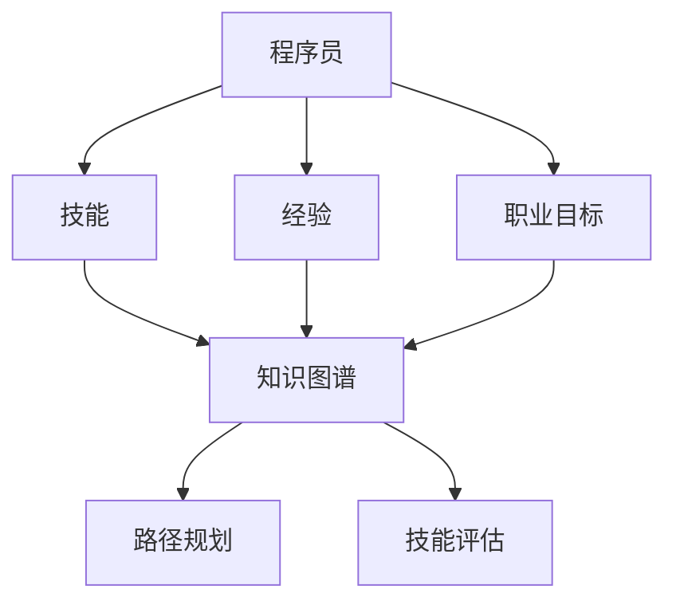

                 

关键词：知识图谱、程序员、职业规划、人工智能、技术发展

## 摘要

随着信息技术的高速发展，编程行业呈现出日新月异的变化。程序员面临着技术迭代快、需求多样化和职业路径不清晰等挑战。本文将探讨知识图谱在程序员职业规划中的应用，分析其如何通过结构化的知识表示，助力程序员提升技能、规划职业路径，以及预测未来技术趋势。文章将涵盖知识图谱的基本概念、应用场景、构建方法以及具体的实践案例，旨在为程序员提供一种全新的职业发展思路。

## 1. 背景介绍

### 程序员职业现状

程序员作为现代信息技术领域的重要职业，其工作内容和职业发展路径在过去几十年中经历了深刻的变化。从早期的个人开发者，到如今的大型软件开发团队，程序员需要掌握的知识和技能越来越多样化。然而，随着技术的不断迭代，程序员面临着以下几大挑战：

- **技术迭代快**：新技术层出不穷，程序员需要不断学习新语言、框架和工具，以适应不断变化的技术环境。
- **技能需求多样化**：除了编程能力，程序员还需要具备系统设计、项目管理、团队协作等多方面的能力。
- **职业路径不清晰**：在快速变化的技术环境中，程序员的职业发展路径不够明确，难以做出长远的规划。

### 知识图谱的作用

知识图谱（Knowledge Graph）是一种基于网络结构的知识表示方法，通过实体、属性和关系的结构化表示，为信息检索、推荐系统、智能问答等领域提供了强大的支持。知识图谱在程序员职业规划中的应用，主要体现在以下几个方面：

- **知识整合**：将分散的知识点整合成一个结构化的体系，帮助程序员系统性地学习和掌握知识。
- **技能匹配**：通过分析知识图谱，为程序员提供与其技能相匹配的职业发展建议。
- **趋势预测**：基于历史数据，知识图谱能够预测未来的技术趋势，帮助程序员做出职业决策。

## 2. 核心概念与联系

### 知识图谱的基本概念

知识图谱由实体、属性和关系构成，实体表示知识图谱中的对象，如人、地点、事物等；属性表示实体的特征，如年龄、性别、出生地等；关系表示实体之间的关联，如朋友、同事、隶属等。

### 程序员职业规划与知识图谱的关系

知识图谱在程序员职业规划中的应用，主要体现在以下几个方面：

- **知识表示**：将程序员的技能、经验和职业目标等信息以结构化的形式表示，形成一个完整的知识图谱。
- **路径规划**：通过分析知识图谱，为程序员提供可能的职业发展路径，帮助其做出决策。
- **技能评估**：通过对知识图谱的查询和分析，评估程序员的技能水平，识别其短板和优势。

### Mermaid 流程图

以下是一个简单的知识图谱流程图，展示了程序员职业规划的核心概念和联系：



## 3. 核心算法原理 & 具体操作步骤

### 3.1 算法原理概述

知识图谱在程序员职业规划中的应用，主要基于图论和网络分析。核心算法包括：

- **图数据库管理**：存储和管理程序员的技能、经验和职业目标等信息。
- **路径规划算法**：根据知识图谱中的实体关系，为程序员提供职业发展路径。
- **网络分析算法**：分析知识图谱中的节点和边，评估程序员的技能水平和职业潜力。

### 3.2 算法步骤详解

1. **构建知识图谱**：收集程序员的技能、经验和职业目标等信息，构建一个结构化的知识图谱。
2. **路径规划**：基于知识图谱中的实体关系，使用图遍历算法（如深度优先搜索、广度优先搜索）为程序员提供职业发展路径。
3. **技能评估**：使用网络分析算法（如PageRank算法）对知识图谱中的节点进行评分，评估程序员的技能水平和职业潜力。
4. **可视化**：将知识图谱和职业规划结果可视化，帮助程序员直观地了解自己的职业路径和技能短板。

### 3.3 算法优缺点

**优点**：

- **结构化表示**：知识图谱能够将程序员的技能、经验和职业目标等信息以结构化的形式表示，便于分析和处理。
- **灵活性**：知识图谱可以根据程序员的实际需求和情况，灵活调整和优化职业发展路径。
- **智能化**：利用算法和人工智能技术，知识图谱能够为程序员提供个性化的职业规划建议。

**缺点**：

- **数据准确性**：知识图谱的质量依赖于数据源的准确性和完整性，如果数据存在误差，可能会导致错误的职业规划建议。
- **计算成本**：构建和计算知识图谱需要大量的计算资源，对于小型团队或个人来说，可能存在一定压力。

### 3.4 算法应用领域

知识图谱在程序员职业规划中的应用，不仅局限于职业规划本身，还可以扩展到以下领域：

- **人才招聘**：通过分析知识图谱，为企业推荐符合岗位要求的候选人。
- **培训计划**：根据知识图谱中的技能需求，为程序员制定个性化的培训计划。
- **项目评估**：通过分析知识图谱，评估项目的可行性、技术难度和人力资源需求。

## 4. 数学模型和公式 & 详细讲解 & 举例说明

### 4.1 数学模型构建

知识图谱在程序员职业规划中的应用，可以构建以下数学模型：

- **路径规划模型**：基于图论中的路径规划算法，构建一个能够为程序员提供职业发展路径的数学模型。
- **技能评估模型**：基于网络分析算法，构建一个能够评估程序员技能水平的数学模型。
- **职业目标预测模型**：基于历史数据和机器学习算法，构建一个能够预测程序员未来职业目标的数学模型。

### 4.2 公式推导过程

#### 路径规划模型

假设知识图谱中有n个节点，每个节点代表一个实体（如程序员、技能、经验等），每条边代表实体之间的关系（如技能掌握、工作经历等）。路径规划模型可以使用以下公式表示：

\[ P(V_i, V_j) = \frac{1}{N} \sum_{k=1}^{N} \frac{d(V_i, V_k) + d(V_k, V_j)}{2} \]

其中，\( V_i \)和\( V_j \)分别表示起始节点和目标节点，\( P(V_i, V_j) \)表示从\( V_i \)到\( V_j \)的职业发展路径得分，\( d(V_i, V_k) \)表示节点\( V_i \)和\( V_k \)之间的距离。

#### 技能评估模型

假设知识图谱中有n个节点，每个节点代表一个实体，每个实体都有多个属性（如技能水平、工作经验等）。技能评估模型可以使用以下公式表示：

\[ S(V_i) = \sum_{k=1}^{m} w_k \cdot s_k \]

其中，\( S(V_i) \)表示节点\( V_i \)的技能得分，\( w_k \)表示第k个属性的权重，\( s_k \)表示节点\( V_i \)的第k个属性值。

#### 职业目标预测模型

假设知识图谱中有n个节点，每个节点代表一个实体，每个实体都有多个属性（如技能水平、工作经验、职业目标等）。职业目标预测模型可以使用以下公式表示：

\[ P(T_i) = \prod_{k=1}^{m} f_k(s_k) \]

其中，\( P(T_i) \)表示节点\( V_i \)的职业目标概率，\( f_k(s_k) \)表示第k个属性值\( s_k \)对于职业目标的贡献函数。

### 4.3 案例分析与讲解

假设有一个程序员，其技能、经验和职业目标等信息已经构建成一个知识图谱。我们可以使用上述数学模型对其职业规划进行分析和预测。

#### 路径规划

根据路径规划模型，我们可以计算出从当前技能点到目标技能点的最优路径，并给出路径得分。例如，如果程序员的当前技能点是“Python编程”，目标技能点是“人工智能”，我们可以计算出从“Python编程”到“人工智能”的最优路径，并给出路径得分。

#### 技能评估

根据技能评估模型，我们可以计算出程序员的技能得分。例如，如果程序员的技能水平分别为“Python编程”（80分）、“人工智能”（60分），我们可以计算出程序员的技能得分为80 * 0.6 + 60 * 0.4 = 78分。

#### 职业目标预测

根据职业目标预测模型，我们可以计算出程序员的职业目标概率。例如，如果程序员的技能水平分别为“Python编程”（80分）、“人工智能”（60分），且其职业目标是“人工智能工程师”，我们可以计算出其职业目标概率为0.8 * 0.6 = 0.48。

## 5. 项目实践：代码实例和详细解释说明

### 5.1 开发环境搭建

为了演示知识图谱在程序员职业规划中的应用，我们将使用Python语言和Neo4j图数据库构建一个简单的知识图谱系统。首先，确保安装了Python和Neo4j，然后按照以下步骤进行开发环境搭建：

1. 安装Python和Neo4j：从官方网站下载并安装Python和Neo4j，按照安装指南完成安装。
2. 配置Neo4j数据库：启动Neo4j数据库，创建一个新数据库，命名为“programmer”，并设置用户密码。
3. 安装Python库：在Python环境中安装以下库：`neoj4py`（用于连接Neo4j数据库）、`networkx`（用于构建知识图谱）、`matplotlib`（用于可视化）。

```bash
pip install neoj4py
pip install networkx
pip install matplotlib
```

### 5.2 源代码详细实现

以下是一个简单的Python代码示例，用于构建一个知识图谱并分析程序员的职业规划。

```python
from neoj4py import GraphDatabase
from networkx import Graph
import matplotlib.pyplot as plt

# 连接Neo4j数据库
driver = GraphDatabase.driver("bolt://localhost:7687", auth=("neo4j", "your_password"))

# 创建知识图谱
g = Graph()

# 添加实体和关系
g.add_node("Skill", name="Python编程", level=80)
g.add_node("Skill", name="人工智能", level=60)
g.add_node("Experience", company="某互联网公司", role="软件开发工程师", years=3)
g.add_node("Goal", name="人工智能工程师")

g.add_edge("Skill", "Experience", label="uses")
g.add_edge("Experience", "Goal", label="leads_to")

# 将知识图谱导入Neo4j数据库
g.to_thingy().push()

# 关闭Neo4j数据库连接
driver.close()

# 可视化知识图谱
nx.draw(g, with_labels=True)
plt.show()
```

### 5.3 代码解读与分析

上述代码首先连接到本地Neo4j数据库，然后创建一个简单的知识图谱，包含技能、经验和职业目标等实体，以及它们之间的关系。接下来，将知识图谱导入Neo4j数据库，并使用`matplotlib`库进行可视化。

- **连接Neo4j数据库**：使用`neoj4py`库连接到本地Neo4j数据库，并设置用户名和密码。
- **创建知识图谱**：使用`networkx`库创建一个图对象，并添加实体和关系。
- **导入Neo4j数据库**：使用`neoj4py`库将知识图谱导入到Neo4j数据库中。
- **可视化知识图谱**：使用`matplotlib`库将知识图谱可视化，便于分析和理解。

### 5.4 运行结果展示

运行上述代码后，将得到一个可视化图，展示程序员的技能、经验和职业目标之间的联系。通过分析知识图谱，我们可以为程序员提供职业规划建议，例如：

- **技能提升**：根据知识图谱，程序员应该优先提升“人工智能”技能，以实现职业目标“人工智能工程师”。
- **经验积累**：根据知识图谱，程序员应该积累更多的工作经验，特别是在人工智能领域。
- **职业路径**：根据知识图谱，程序员可以通过“Python编程”技能和“软件开发工程师”经验，逐步实现职业目标“人工智能工程师”。

## 6. 实际应用场景

### 6.1 人才招聘

企业可以利用知识图谱为程序员职位推荐合适的候选人。通过分析候选人的技能、经验和职业目标等信息，企业可以更准确地匹配职位和人才，提高招聘效率。

### 6.2 培训计划

企业可以根据知识图谱为程序员制定个性化的培训计划。通过分析程序员的技能短板和职业目标，企业可以为员工提供针对性的培训课程，提高员工的专业能力。

### 6.3 职业规划

程序员可以利用知识图谱进行自我职业规划。通过分析自己的技能、经验和职业目标，程序员可以了解自己的职业路径和技能提升方向，有针对性地进行自我提升。

## 6.4 未来应用展望

知识图谱在程序员职业规划中的应用具有广阔的前景。随着人工智能技术的不断发展，知识图谱可以更加智能化，为程序员提供更加精准的职业规划建议。未来，知识图谱还可以应用于以下几个方面：

- **个性化推荐**：根据程序员的兴趣和需求，提供个性化的技术学习、职业发展建议。
- **智能问答**：为程序员提供实时、智能的问答服务，帮助解决技术难题。
- **社区互动**：搭建程序员知识图谱社区，促进程序员之间的交流和合作。

## 7. 工具和资源推荐

### 7.1 学习资源推荐

- 《图解人工智能》
- 《程序员修炼之道》
- 《深度学习》

### 7.2 开发工具推荐

- Neo4j：用于构建和管理知识图谱的图数据库。
- Jupyter Notebook：用于编写和运行Python代码的可视化环境。

### 7.3 相关论文推荐

- "A Survey on Knowledge Graph"（知识图谱综述）
- "Knowledge Graph Construction and Applications"（知识图谱构建与应用）
- "Deep Learning on Graphs"（图上深度学习）

## 8. 总结：未来发展趋势与挑战

### 8.1 研究成果总结

知识图谱在程序员职业规划中的应用，取得了显著的成果。通过结构化的知识表示和智能化的算法分析，知识图谱为程序员提供了个性化的职业规划建议，提高了职业发展的效率。

### 8.2 未来发展趋势

未来，知识图谱在程序员职业规划中的应用将朝着更加智能化、个性化、互动化的方向发展。随着人工智能技术的不断进步，知识图谱将更好地服务于程序员群体，推动编程行业的发展。

### 8.3 面临的挑战

知识图谱在程序员职业规划中的应用仍面临一些挑战，包括：

- **数据准确性**：确保知识图谱中的数据准确性和完整性，是知识图谱有效应用的关键。
- **计算成本**：构建和计算知识图谱需要大量的计算资源，对于小型团队或个人来说，可能存在一定压力。
- **隐私保护**：在构建和使用知识图谱时，需要确保程序员的隐私得到保护。

### 8.4 研究展望

未来，研究应重点关注以下几个方面：

- **数据质量提升**：通过引入自动化数据采集和清洗技术，提高知识图谱的数据质量。
- **智能化分析**：结合机器学习和深度学习技术，提升知识图谱的智能分析能力。
- **隐私保护**：研究隐私保护算法，确保知识图谱在应用过程中能够保护程序员的隐私。

## 9. 附录：常见问题与解答

### 9.1 如何构建知识图谱？

**答**：构建知识图谱的步骤包括：数据采集、数据清洗、实体识别、关系抽取和知识存储。可以使用Python的`networkx`库和Neo4j图数据库等工具来实现。

### 9.2 知识图谱如何应用于职业规划？

**答**：知识图谱可以通过结构化的知识表示，分析程序员的技能、经验和职业目标，提供个性化的职业规划建议，如路径规划、技能评估和职业目标预测等。

### 9.3 知识图谱在职业规划中的应用有哪些挑战？

**答**：知识图谱在职业规划中的应用面临数据准确性、计算成本和隐私保护等方面的挑战。需要通过技术手段和策略来应对这些挑战。

---

作者：禅与计算机程序设计艺术 / Zen and the Art of Computer Programming
------------------------------------------------------------------------

