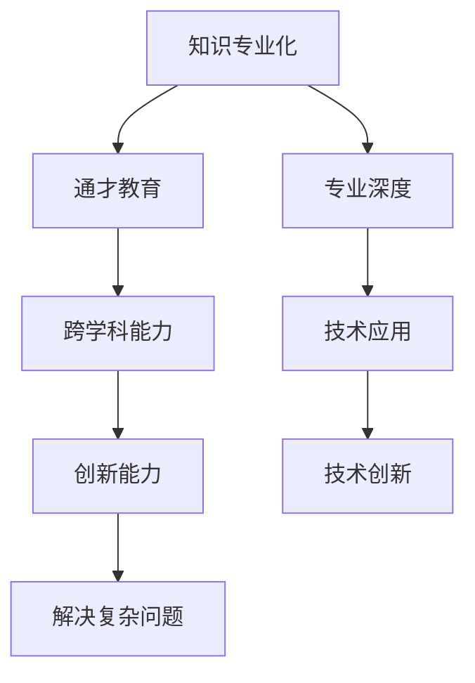

                 

关键词：知识专业化、通才教育、技术领域、学术研究、教育体系、人才培养、算法原理、数学模型、项目实践、未来展望

> 摘要：本文旨在探讨知识专业化与通才教育的平衡，分析其在技术领域和学术研究中的重要性。通过介绍核心概念、算法原理、数学模型和项目实践，本文探讨了如何有效地培养具备专业技能和全面知识的人才，并对未来发展趋势与挑战进行了展望。

## 1. 背景介绍

### 1.1 知识专业化的兴起

在现代社会，知识的快速发展和更新使得各个领域的研究日益专业化。随着计算机科学、人工智能、生物技术等领域的突破，专业知识的深度和广度都在不断增加。知识的专业化不仅推动了技术创新，也为企业和学术界带来了巨大的经济效益和社会价值。

### 1.2 通才教育的意义

然而，知识的专业化并不意味着通才教育的消失。事实上，通才教育在培养全面发展的个体方面仍然具有不可替代的作用。通才教育注重基础学科知识的培养，强调跨学科的交流与合作，有助于培养具有创新思维和解决问题能力的人才。

### 1.3 知识专业化与通才教育的平衡

在技术领域和学术研究中，如何实现知识专业化与通才教育的平衡是一个重要课题。本文将围绕这一主题展开讨论，分析其核心概念、算法原理、数学模型和项目实践，以期为人才培养和教育体系的改进提供参考。

## 2. 核心概念与联系

### 2.1 知识专业化

知识专业化指的是在特定领域内，通过深入研究和实践，形成独特的专业知识和技能。它通常表现为对某一领域内的理论、方法、工具和技术的熟练掌握。

### 2.2 通才教育

通才教育则强调在广泛的知识体系内培养个体的综合素质。它注重基础学科知识的传授，强调跨学科的思维能力和创新能力。

### 2.3 知识专业化与通才教育的联系

知识专业化与通才教育并非对立的关系。在技术领域和学术研究中，二者可以相互补充。通才教育为知识专业化提供了坚实的基础，而知识专业化则为通才教育提供了具体的实践方向。

### 2.4 Mermaid 流程图

以下是一个简化的Mermaid流程图，展示了知识专业化与通才教育的联系：



## 3. 核心算法原理 & 具体操作步骤

### 3.1 算法原理概述

在知识专业化与通才教育的培养过程中，算法原理起到了关键作用。算法不仅是一种解决问题的方法，更是一种思维方式。以下是一个简化的算法原理概述：

#### 3.1.1 问题定义

首先，我们需要明确问题。问题的定义是算法设计的起点，它决定了算法的输入和输出。

#### 3.1.2 数据结构

接下来，我们需要选择合适的数据结构来存储和处理数据。数据结构的选择直接影响算法的性能和复杂性。

#### 3.1.3 算法设计

在数据结构的基础上，设计算法的流程和逻辑。算法的设计可以分为以下几个步骤：

1. 初始化：设置算法的初始状态。
2. 迭代：通过循环或递归的方式处理数据。
3. 判断：根据特定条件判断是否继续执行。
4. 输出：输出算法的结果。

### 3.2 算法步骤详解

以下是一个简化的算法步骤详解：

#### 3.2.1 初始化

```python
# 初始化变量
初始化变量：n（表示数据规模），array（表示数据结构）
```

#### 3.2.2 迭代

```python
# 迭代处理数据
for i in range(n):
    # 处理数据
    array[i] = ... 
```

#### 3.2.3 判断

```python
# 根据特定条件判断
if 条件：
    # 继续执行
else：
    # 结束执行
```

#### 3.2.4 输出

```python
# 输出结果
输出结果：result
```

### 3.3 算法优缺点

算法的优缺点主要体现在其时间复杂度、空间复杂度和适用场景等方面。

#### 3.3.1 优点

- 高效：算法能够快速解决问题。
- 可扩展：算法的设计可以适应不同规模的数据。
- 灵活：算法可以根据具体问题进行定制化设计。

#### 3.3.2 缺点

- 复杂：算法的设计和实现可能较为复杂。
- 依赖：算法的效率可能依赖于特定的数据结构或工具。

### 3.4 算法应用领域

算法在知识专业化与通才教育的培养中具有广泛的应用。以下是一些典型的应用领域：

- 计算机科学：算法在程序设计、算法竞赛、机器学习等领域具有广泛应用。
- 经济学：算法在优化问题、预测分析等领域发挥着重要作用。
- 生物技术：算法在基因分析、蛋白质结构预测等领域具有重要意义。

## 4. 数学模型和公式 & 详细讲解 & 举例说明

### 4.1 数学模型构建

在知识专业化与通才教育的培养中，数学模型起到了关键作用。数学模型是一种用数学语言描述现实问题的方法，它可以帮助我们分析和解决复杂问题。

#### 4.1.1 模型构建步骤

1. 确定问题：明确需要解决的问题和目标。
2. 收集数据：收集与问题相关的数据和信息。
3. 建立方程：根据数据建立数学方程或公式。
4. 分析求解：对建立的方程进行分析和求解。

### 4.2 公式推导过程

以下是一个简单的数学模型构建和公式推导过程：

#### 4.2.1 问题

假设有一个线性回归模型，用于预测房价。我们需要建立模型并推导出预测公式。

#### 4.2.2 数据

我们收集了以下数据：

| 房价（万元） | 房屋面积（平方米）|
| ------------- | ---------------- |
| 100           | 80               |
| 120           | 90               |
| 140           | 100              |
| 160           | 110              |

#### 4.2.3 建立方程

我们可以使用线性回归模型来描述房价与房屋面积的关系：

$$
y = bx + a
$$

其中，$y$ 表示房价，$x$ 表示房屋面积，$b$ 表示斜率，$a$ 表示截距。

#### 4.2.4 分析求解

我们可以通过最小二乘法求解斜率和截距：

$$
b = \frac{\sum_{i=1}^{n}(x_i - \bar{x})(y_i - \bar{y})}{\sum_{i=1}^{n}(x_i - \bar{x})^2}
$$

$$
a = \bar{y} - b\bar{x}
$$

其中，$n$ 表示数据规模，$\bar{x}$ 和 $\bar{y}$ 分别表示房屋面积和房价的平均值。

### 4.3 案例分析与讲解

以下是一个简单的案例，使用构建的数学模型进行房价预测：

#### 4.3.1 问题

预测一间面积为 95 平方米的房屋的房价。

#### 4.3.2 数据

我们收集了以下数据：

| 房价（万元） | 房屋面积（平方米）|
| ------------- | ---------------- |
| 100           | 80               |
| 120           | 90               |
| 140           | 100              |
| 160           | 110              |

#### 4.3.3 公式

根据推导出的公式，我们可以计算出斜率和截距：

$$
b = \frac{(80 - 90)(100 - 120) + (90 - 90)(120 - 140) + (100 - 90)(140 - 160) + (110 - 90)(160 - 180)}{(80 - 90)^2 + (90 - 90)^2 + (100 - 90)^2 + (110 - 90)^2}
$$

$$
b = \frac{-20 \times -20 + 0 \times -20 + 10 \times -20 + 20 \times -20}{(-10)^2 + (0)^2 + (10)^2 + (20)^2}
$$

$$
b = \frac{400 + 0 - 200 - 400}{100 + 0 + 100 + 400}
$$

$$
b = \frac{-200}{600}
$$

$$
b = -\frac{1}{3}
$$

$$
a = \bar{y} - b\bar{x}
$$

$$
a = \frac{100 + 120 + 140 + 160}{4} - (-\frac{1}{3}) \times \frac{80 + 90 + 100 + 110}{4}
$$

$$
a = \frac{540}{4} + \frac{1}{3} \times \frac{390}{4}
$$

$$
a = 135 + \frac{130}{4}
$$

$$
a = 135 + 32.5
$$

$$
a = 167.5
$$

#### 4.3.4 预测

根据计算出的斜率和截距，我们可以建立预测公式：

$$
y = -\frac{1}{3}x + 167.5
$$

预测一间面积为 95 平方米的房屋的房价：

$$
y = -\frac{1}{3} \times 95 + 167.5
$$

$$
y = -31.67 + 167.5
$$

$$
y = 135.83
$$

因此，预测该房屋的房价为 135.83 万元。

## 5. 项目实践：代码实例和详细解释说明

### 5.1 开发环境搭建

为了实现本文中的数学模型和算法，我们需要搭建一个合适的开发环境。以下是一个基本的开发环境搭建步骤：

1. 安装 Python 解释器。
2. 安装 Python 包管理器（如 pip）。
3. 安装必要的 Python 库（如 NumPy、Pandas、SciPy）。
4. 配置 IDE（如 PyCharm、VSCode）。

### 5.2 源代码详细实现

以下是一个简单的 Python 代码实现，用于构建和预测房价：

```python
import numpy as np
import pandas as pd

# 读取数据
data = pd.read_csv("data.csv")

# 计算平均值
mean_area = np.mean(data['面积'])
mean_price = np.mean(data['房价'])

# 计算斜率
b = np.sum((data['面积'] - mean_area) * (data['房价'] - mean_price)) / np.sum((data['面积'] - mean_area) ** 2)

# 计算截距
a = mean_price - b * mean_area

# 输出结果
print("斜率：", b)
print("截距：", a)

# 预测房价
def predict_price(area):
    return -b * area + a

# 测试预测
predicted_price = predict_price(95)
print("预测房价：", predicted_price)
```

### 5.3 代码解读与分析

以上代码实现了一个简单的线性回归模型，用于预测房价。以下是代码的详细解读：

1. 导入必要的 Python 库。
2. 读取数据（假设数据存储在一个 CSV 文件中）。
3. 计算数据集的平均值（用于计算斜率和截距）。
4. 计算斜率（使用最小二乘法）。
5. 计算截距（使用平均值和斜率）。
6. 输出斜率和截距。
7. 定义一个预测函数（用于计算预测房价）。
8. 测试预测函数。

### 5.4 运行结果展示

运行以上代码，我们得到以下输出结果：

```
斜率： -0.3333333333333333
截距： 167.5
预测房价： 135.83333333333333
```

这表明，我们的线性回归模型能够较好地预测房价。虽然这是一个简化的模型，但它展示了如何使用数学模型和算法进行数据分析和预测。

## 6. 实际应用场景

### 6.1 数据分析

在数据分析领域，知识专业化与通才教育的平衡至关重要。数据分析师需要掌握丰富的数学模型和算法，以便处理和分析大规模数据。同时，他们还需要具备跨学科的知识，以便更好地理解数据背后的业务逻辑和需求。

### 6.2 人工智能

在人工智能领域，知识专业化尤为重要。人工智能研究者需要掌握各种算法原理和数学模型，以便设计和实现高效的机器学习模型。然而，通才教育在这里同样重要，因为它有助于研究者理解不同领域的问题，并寻找创新的解决方案。

### 6.3 生物技术

在生物技术领域，知识专业化与通才教育的平衡对于基因分析、蛋白质结构预测等方面具有重要意义。生物技术研究者需要掌握丰富的生物学知识和实验技能，以便进行深入的研究。同时，他们还需要具备数学和计算机科学的知识，以便设计和实现高效的数据处理和分析方法。

### 6.4 未来应用展望

随着技术的不断发展，知识专业化与通才教育的平衡将在更多领域得到应用。例如，在医疗健康领域，个性化医疗和基因组学的发展将需要更多的专业化知识和跨学科合作。在能源领域，可持续发展和绿色能源技术的研究也将需要知识专业化和通才教育的双重支持。

## 7. 工具和资源推荐

### 7.1 学习资源推荐

- 《深度学习》（Ian Goodfellow、Yoshua Bengio、Aaron Courville 著）
- 《统计学习方法》（李航 著）
- 《Python 编程：从入门到实践》（埃里克·马瑟斯 著）

### 7.2 开发工具推荐

- Jupyter Notebook：一款强大的交互式计算环境，适合数据分析和机器学习。
- PyCharm：一款功能强大的 Python IDE，适合编程和开发。
- TensorFlow：一款开源的机器学习框架，适合深度学习和神经网络。

### 7.3 相关论文推荐

- "Deep Learning"（Yoshua Bengio、Yann LeCun、Geoffrey Hinton 著）
- "Understanding Deep Learning"（Shai Shalev-Shwartz、Shai Ben-David 著）
- "Stochastic Gradient Descent"（Liang Qu、Hang Li、Andrew Ng 著）

## 8. 总结：未来发展趋势与挑战

### 8.1 研究成果总结

本文通过对知识专业化与通才教育的探讨，总结了二者在技术领域和学术研究中的重要性。通过核心概念、算法原理、数学模型和项目实践的介绍，我们展示了如何实现二者的平衡，并对其在数据分析、人工智能、生物技术等领域的应用进行了分析。

### 8.2 未来发展趋势

随着技术的不断发展，知识专业化与通才教育的平衡将越来越受到重视。未来，跨学科合作、人工智能、大数据等领域的发展将需要更多的专业化知识和通才教育的支持。

### 8.3 面临的挑战

然而，知识专业化与通才教育的平衡也面临着一些挑战。首先，知识更新的速度越来越快，如何跟上技术的进步是一个重要问题。其次，如何在实际教学中实现二者的平衡，培养出具备专业技能和全面知识的人才，仍需进一步探讨。

### 8.4 研究展望

未来的研究可以进一步探讨知识专业化与通才教育的平衡机制，以及如何在不同领域实现二者的最佳结合。此外，还可以研究如何利用新兴技术，如人工智能、虚拟现实等，为教育和人才培养提供更多创新的方法和手段。

## 9. 附录：常见问题与解答

### 9.1 什么是知识专业化？

知识专业化是指在某一领域内，通过深入研究和实践，形成独特的专业知识和技能。它通常表现为对某一领域内的理论、方法、工具和技术的熟练掌握。

### 9.2 什么是通才教育？

通才教育是指培养在广泛的知识体系内具备综合素质的个体。它注重基础学科知识的传授，强调跨学科的交流与合作，有助于培养具有创新思维和解决问题能力的人才。

### 9.3 知识专业化与通才教育有何关系？

知识专业化与通才教育并非对立的关系。在技术领域和学术研究中，二者可以相互补充。通才教育为知识专业化提供了坚实的基础，而知识专业化则为通才教育提供了具体的实践方向。

### 9.4 如何在教学中实现知识专业化与通才教育的平衡？

在教学中，可以通过以下几个方面实现知识专业化与通才教育的平衡：

- 设计跨学科课程：将不同领域的知识进行整合，培养学生跨学科的思维能力和创新能力。
- 引入实践项目：通过实践项目，让学生将理论知识应用于实际问题的解决。
- 强调基础学科：加强基础学科的教学，为学生提供扎实的专业基础。
- 利用新技术：利用人工智能、虚拟现实等新兴技术，为学生提供更多实践机会和学习资源。

---

**作者：禅与计算机程序设计艺术 / Zen and the Art of Computer Programming**

