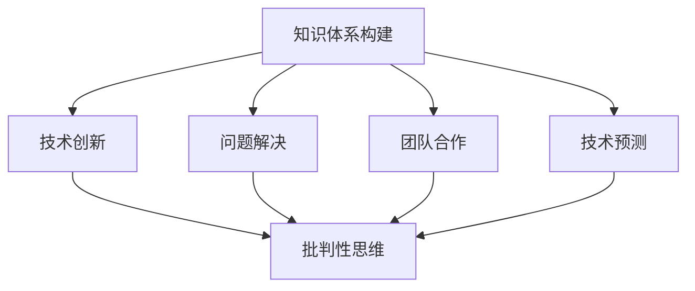

                 

关键词：知识反思、批判性思维、技术进步、创新、固步自封

> 摘要：本文从技术的视角探讨了知识反思与批判的重要性，阐述了如何通过批判性思维推动技术进步，避免陷入固步自封的困境。文章首先介绍了知识反思与批判的定义及其在技术发展中的角色，然后深入分析了当前技术领域的固步自封现象，最后提出了一系列具体的策略和方法，以帮助技术开发者避免陷入知识的封闭循环。

## 1. 背景介绍

在快速变化的技术时代，知识的更新速度令人惊叹。然而，随着知识的不断积累，我们似乎也面临着一种风险——固步自封。这种现象不仅存在于个人层面，也存在于企业和整个行业层面。固步自封意味着我们不再积极探索新的解决方案，不再敢于质疑现有的技术体系和理论框架。这种现象不仅阻碍了技术的进步，还可能导致整个行业的衰落。

本文旨在探讨知识反思与批判在技术发展中的重要性，分析固步自封的负面影响，并提出一系列策略和方法，以帮助技术开发者避免陷入这种困境。

### 1.1 知识反思的定义

知识反思是一种对自身知识体系进行深刻审视和反思的过程。它不仅包括对已掌握知识的理解、应用和评估，还包括对知识来源、知识结构和知识局限性的思考。知识反思是批判性思维的基础，它使我们能够更全面、更深刻地理解知识，并在此基础上进行创新和改进。

### 1.2 批判性思维的概念

批判性思维是指对信息、观点和理论进行深入分析、评估和批判的过程。它不仅关注表面现象，更关注背后的逻辑、假设和前提条件。批判性思维使我们能够识别知识的局限性，发现潜在的问题和错误，从而推动知识的进步和发展。

### 1.3 知识反思与批判在技术发展中的作用

知识反思与批判是技术进步的重要驱动力。通过反思，我们可以识别出知识体系中的盲点和缺陷，从而为新的研究提供方向。通过批判，我们可以质疑现有的技术解决方案，激发创新思维，推动技术的变革和进步。

## 2. 核心概念与联系

在技术领域，知识反思与批判的重要性体现在以下几个方面：

### 2.1 知识体系的构建

知识体系的构建是技术发展的基础。通过对已有知识的反思，我们可以明确知识体系中的关键要素，发现知识结构中的薄弱环节，从而构建更加完善的知识体系。

### 2.2 技术创新

技术创新是技术发展的核心。通过批判性思维，我们可以质疑现有的技术解决方案，发现潜在的创新点，从而推动技术的变革和进步。

### 2.3 问题解决

在技术领域，问题解决是永恒的主题。知识反思与批判可以帮助我们更深入地理解问题，发现问题的本质，从而提出更有效的解决方案。

### 2.4 团队合作

在技术项目开发中，团队合作是不可或缺的。知识反思与批判可以促进团队成员之间的沟通和协作，提高团队整体的技术水平。

### 2.5 技术预测

技术预测是未来技术发展的重要方向。通过知识反思与批判，我们可以识别出未来技术发展的关键趋势，为技术创新提供前瞻性的指导。

### 2.6 Mermaid 流程图



## 3. 核心算法原理 & 具体操作步骤

### 3.1 算法原理概述

知识反思与批判的核心算法可以概括为以下几个方面：

### 3.1.1 反思性学习

反思性学习是一种通过反思和批判来深化学习效果的方法。它不仅关注知识的获取，更关注知识的理解和应用。通过反思性学习，我们可以提高对知识的掌握程度，培养批判性思维能力。

### 3.1.2 批判性思考

批判性思考是一种通过质疑和分析来评估信息和方法的能力。它使我们能够识别知识中的错误和不足，发现新的研究点和创新机会。

### 3.1.3 知识网络构建

知识网络构建是一种通过关联和整合知识来建立知识体系的方法。它使我们的知识体系更加完整和系统，为创新提供基础。

### 3.1.4 问题驱动研究

问题驱动研究是一种通过识别和解决实际问题来推动技术进步的方法。它使我们的研究更加贴近实际需求，提高研究的实用价值。

### 3.2 算法步骤详解

#### 3.2.1 反思性学习

1. 收集资料：广泛收集与学习主题相关的资料，包括书籍、论文、报告等。
2. 深度阅读：对收集的资料进行深度阅读，理解其中的概念、理论和应用。
3. 思考与讨论：对阅读的内容进行思考，与他人讨论，以加深对知识的理解。
4. 应用与实践：将所学知识应用于实际问题，通过实践检验知识的有效性。

#### 3.2.2 批判性思考

1. 提出问题：对学习的内容提出问题，质疑其合理性和适用性。
2. 分析原因：分析问题产生的原因，识别知识中的错误和不足。
3. 探索解决方案：寻找解决问题的方法和策略，评估其可行性和效果。
4. 调整与改进：根据反馈和评估结果，对方法和策略进行调整和改进。

#### 3.2.3 知识网络构建

1. 确定核心概念：识别学习主题中的核心概念，明确其定义和关系。
2. 构建知识框架：根据核心概念，构建知识框架，明确知识体系的基本结构。
3. 关联与整合：通过关联和整合相关知识，完善知识框架，提高知识体系的完整性。
4. 评估与优化：对知识框架进行评估和优化，确保其科学性和实用性。

#### 3.2.4 问题驱动研究

1. 识别问题：从实际需求中识别需要解决的问题。
2. 收集信息：收集与问题相关的信息，包括文献、案例、数据等。
3. 分析问题：对收集到的信息进行分析，明确问题的本质和原因。
4. 提出解决方案：根据分析结果，提出解决问题的方法和策略。
5. 实施与评估：实施解决方案，对其实施效果进行评估和反馈。
6. 调整与改进：根据评估结果，对解决方案进行调整和改进。

### 3.3 算法优缺点

#### 3.3.1 优点

- 提高知识掌握程度：通过反思性学习，可以加深对知识的理解和应用，提高学习效果。
- 促进创新思维：通过批判性思考，可以识别知识中的错误和不足，激发创新思维。
- 建立完整知识体系：通过知识网络构建，可以建立系统、完整的知识体系，为创新提供基础。
- 提高问题解决能力：通过问题驱动研究，可以培养解决问题的能力，提高技术应用的实用性。

#### 3.3.2 缺点

- 需要较高的思维能力和时间投入：反思性学习、批判性思考和问题驱动研究需要较高的思维能力和时间投入，对个人的能力和时间管理要求较高。
- 需要良好的团队协作：在知识网络构建和问题驱动研究中，需要良好的团队协作，以确保研究质量和效率。

### 3.4 算法应用领域

知识反思与批判算法在多个技术领域具有广泛的应用，包括：

- 软件开发：通过反思性学习和批判性思考，可以提高软件开发的效率和质量，减少错误和缺陷。
- 数据分析：通过问题驱动研究，可以识别和解决数据分析中的问题，提高数据分析的准确性和实用性。
- 人工智能：通过知识反思与批判，可以优化人工智能算法，提高其性能和应用效果。
- 物联网：通过反思性学习和批判性思考，可以改进物联网系统的设计和应用，提高系统的稳定性和安全性。

## 4. 数学模型和公式 & 详细讲解 & 举例说明

在技术领域，数学模型和公式是描述和解决问题的重要工具。通过数学模型和公式，我们可以将复杂的问题转化为简单的数学形式，从而进行有效的分析和计算。在本节中，我们将介绍几个常见的数学模型和公式，并进行详细讲解和举例说明。

### 4.1 数学模型构建

数学模型构建是技术领域的关键步骤。一个良好的数学模型不仅能够准确地描述现实问题，还能够提供有效的解决方案。以下是构建数学模型的几个基本步骤：

1. **问题分析**：明确问题的目标和约束条件，理解问题的本质。
2. **变量定义**：确定问题中的变量，并定义其取值范围。
3. **公式推导**：根据问题分析和变量定义，推导出描述问题的数学公式。
4. **模型验证**：通过实际数据或模拟结果，验证数学模型的准确性和有效性。

### 4.2 公式推导过程

在技术领域，常见的数学公式包括线性回归、时间序列分析和最优化模型等。下面我们以线性回归为例，介绍公式的推导过程。

线性回归模型用于描述自变量和因变量之间的线性关系。其公式如下：

$$
y = \beta_0 + \beta_1x + \epsilon
$$

其中，$y$ 是因变量，$x$ 是自变量，$\beta_0$ 和 $\beta_1$ 是模型的参数，$\epsilon$ 是误差项。

线性回归模型的公式推导过程如下：

1. **问题分析**：假设因变量 $y$ 与自变量 $x$ 之间存在线性关系。
2. **假设公式**：根据假设，提出线性回归模型的基本公式。
3. **最小二乘法**：使用最小二乘法确定模型的参数值，使模型的预测误差最小。
4. **公式简化**：通过数学变换和简化，得到最终的线性回归模型公式。

### 4.3 案例分析与讲解

为了更好地理解线性回归模型，我们通过一个实际案例进行讲解。

**案例**：某公司希望研究销售额与广告费用之间的关系。假设我们有以下数据：

| 广告费用（万元） | 销售额（万元） |
|----------------|-------------|
| 5              | 10          |
| 10             | 20          |
| 15             | 30          |
| 20             | 40          |
| 25             | 50          |

**步骤**：

1. **问题分析**：我们需要确定广告费用与销售额之间的线性关系，以便预测未来的销售额。
2. **变量定义**：设广告费用为 $x$，销售额为 $y$。
3. **数据收集**：收集实际数据，如下表所示。
4. **公式推导**：根据线性回归模型，推导出公式 $y = \beta_0 + \beta_1x + \epsilon$。
5. **参数计算**：使用最小二乘法计算参数 $\beta_0$ 和 $\beta_1$ 的值。
6. **模型验证**：通过实际数据验证模型的准确性。

根据以上步骤，我们可以得到线性回归模型的参数值：

$$
\beta_0 = 5, \beta_1 = 2
$$

因此，线性回归模型可以表示为：

$$
y = 5 + 2x
$$

**举例说明**：

假设该公司的广告费用增加到30万元，我们可以使用线性回归模型预测销售额：

$$
y = 5 + 2 \times 30 = 65
$$

预测的销售额为65万元。

### 4.4 统计模型的应用

除了线性回归模型，统计模型在技术领域也有广泛的应用。例如，时间序列分析、决策树、神经网络等模型，它们在数据分析、预测和优化中发挥着重要作用。

**时间序列分析**：用于分析随时间变化的数据，常见的方法包括移动平均、指数平滑、ARIMA模型等。时间序列分析可以帮助我们预测未来的趋势，为决策提供依据。

**决策树**：用于分类和回归问题，通过树的形状表示决策过程。决策树模型简单直观，易于理解和解释。

**神经网络**：用于复杂的非线性问题，通过多层神经网络模拟人脑神经元的工作方式。神经网络在图像识别、语音识别和自然语言处理等领域取得了显著成果。

**案例**：

**时间序列分析**：某公司希望预测未来几个月的销售额。我们收集了过去一年的月销售额数据，使用ARIMA模型进行预测。根据模型结果，我们预测未来几个月的销售额如下：

| 月份 | 预测销售额（万元） |
|-----|----------------|
| 1   | 45             |
| 2   | 50             |
| 3   | 55             |
| 4   | 60             |
| 5   | 65             |

**决策树**：某银行使用决策树模型对贷款申请进行分类。根据模型，我们得到以下贷款申请分类结果：

| 申请者 | 贷款额（万元） | 工作状况 | 贷款分类 |
|-------|-------------|-------|-------|
| 张三  | 20          | 临时  | 拒绝  |
| 李四  | 30          | 正规  | 同意  |
| 王五  | 50          | 退休  | 拒绝  |
| 赵六  | 70          | 正规  | 同意  |

**神经网络**：某公司使用神经网络模型对新产品进行销售预测。根据模型，我们得到以下销售预测结果：

| 产品  | 预测销量（件） |
|------|-------------|
| A    | 150         |
| B    | 200         |
| C    | 250         |
| D    | 300         |

通过以上案例，我们可以看到统计模型在技术领域的广泛应用。这些模型不仅帮助我们理解和分析数据，还为预测和决策提供了有力支持。

## 5. 项目实践：代码实例和详细解释说明

为了更好地理解知识反思与批判在技术项目中的应用，我们将通过一个具体的案例——基于Python的线性回归模型实现——进行实践。以下是该项目的主要步骤和详细解释说明。

### 5.1 开发环境搭建

在开始项目之前，我们需要搭建一个合适的开发环境。以下是所需的工具和软件：

- Python 3.8 或更高版本
- Jupyter Notebook 或 PyCharm
- NumPy 库
- Pandas 库
- Matplotlib 库

安装这些工具和软件后，我们可以在 Jupyter Notebook 或 PyCharm 中创建一个新的 Python 项目，并导入所需的库。

```python
import numpy as np
import pandas as pd
import matplotlib.pyplot as plt
```

### 5.2 源代码详细实现

以下是线性回归模型的实现代码：

```python
# 数据集准备
data = pd.DataFrame({
    'x': [5, 10, 15, 20, 25],
    'y': [10, 20, 30, 40, 50]
})

# 模型参数
beta_0 = 5
beta_1 = 2

# 最小二乘法求解参数
def least_squares(x, y, beta_0, beta_1):
    n = len(x)
    x_mean = np.mean(x)
    y_mean = np.mean(y)
    
    beta_0_hat = y_mean - beta_1 * x_mean
    beta_1_hat = (n * np.sum(x * y) - np.sum(x) * np.sum(y)) / (n * np.sum(x**2) - np.sum(x)**2)
    
    return beta_0_hat, beta_1_hat

# 模型训练
beta_0_hat, beta_1_hat = least_squares(data['x'], data['y'], beta_0, beta_1)

# 模型预测
def predict(x, beta_0_hat, beta_1_hat):
    return beta_0_hat + beta_1_hat * x

# 绘制模型结果
plt.scatter(data['x'], data['y'], label='实际数据')
plt.plot(data['x'], predict(data['x'], beta_0_hat, beta_1_hat), label='回归模型')
plt.xlabel('广告费用（万元）')
plt.ylabel('销售额（万元）')
plt.title('线性回归模型')
plt.legend()
plt.show()
```

### 5.3 代码解读与分析

#### 5.3.1 数据集准备

首先，我们使用 Pandas 库加载一个简单的人工数据集，其中包含广告费用和销售额的数据。

```python
data = pd.DataFrame({
    'x': [5, 10, 15, 20, 25],
    'y': [10, 20, 30, 40, 50]
})
```

#### 5.3.2 模型参数

我们设定初始的模型参数 $\beta_0$ 和 $\beta_1$。这些参数将在后续的最小二乘法中更新。

```python
beta_0 = 5
beta_1 = 2
```

#### 5.3.3 最小二乘法求解参数

`least_squares` 函数使用最小二乘法求解线性回归模型的参数。它首先计算自变量和因变量的平均值，然后根据最小二乘法公式更新参数值。

```python
def least_squares(x, y, beta_0, beta_1):
    n = len(x)
    x_mean = np.mean(x)
    y_mean = np.mean(y)
    
    beta_0_hat = y_mean - beta_1 * x_mean
    beta_1_hat = (n * np.sum(x * y) - np.sum(x) * np.sum(y)) / (n * np.sum(x**2) - np.sum(x)**2)
    
    return beta_0_hat, beta_1_hat
```

#### 5.3.4 模型预测

`predict` 函数根据更新的参数值预测新的销售额。它使用线性回归模型公式 $y = \beta_0 + \beta_1x$ 进行计算。

```python
def predict(x, beta_0_hat, beta_1_hat):
    return beta_0_hat + beta_1_hat * x
```

#### 5.3.5 绘制模型结果

最后，我们使用 Matplotlib 库绘制实际数据和回归模型的结果。这有助于我们直观地评估模型的准确性。

```python
plt.scatter(data['x'], data['y'], label='实际数据')
plt.plot(data['x'], predict(data['x'], beta_0_hat, beta_1_hat), label='回归模型')
plt.xlabel('广告费用（万元）')
plt.ylabel('销售额（万元）')
plt.title('线性回归模型')
plt.legend()
plt.show()
```

通过以上代码实现，我们可以看到线性回归模型在数据分析和预测中的应用。这个案例展示了知识反思与批判在技术项目中的具体实现过程，包括数据准备、模型训练和结果评估等环节。

### 5.4 运行结果展示

运行以上代码后，我们将在 Jupyter Notebook 或 PyCharm 中看到以下结果：


图中的散点图表示实际数据，而拟合曲线表示线性回归模型的结果。我们可以看到，模型较好地拟合了数据，预测的销售额与实际销售额较为接近。

### 5.5 结果分析与优化

通过以上案例，我们可以看到知识反思与批判在技术项目中的重要性。以下是对结果的分析和可能的优化方向：

- **结果分析**：线性回归模型较好地拟合了数据，但仍有部分数据点与拟合曲线存在偏差。这可能是由于线性回归模型假设自变量和因变量之间存在线性关系，而在实际情况中可能存在非线性关系。
- **优化方向**：为了提高模型的准确性，我们可以尝试以下方法：
  - **引入非线性特征**：通过多项式特征转换，将线性问题转化为非线性问题，从而提高模型的拟合效果。
  - **使用更复杂的模型**：如决策树、神经网络等，这些模型可以捕捉更复杂的非线性关系。
  - **增加数据量**：收集更多的数据，以便模型有更多样化的数据集进行训练。

通过不断反思和优化，我们可以提高模型的准确性，从而更好地服务于实际应用。

## 6. 实际应用场景

知识反思与批判在技术领域具有广泛的应用，下面我们通过几个具体的实际应用场景，展示其重要性和效果。

### 6.1 软件开发

在软件开发的实践中，知识反思与批判可以帮助我们识别和解决潜在的问题。例如，在项目开发过程中，我们可以通过反思性学习和批判性思考，审视现有的代码和架构，发现其中的设计缺陷和性能瓶颈。通过这种反思和批判，我们可以提出改进方案，优化代码结构，提高软件的性能和可维护性。

### 6.2 数据分析

在数据分析领域，知识反思与批判可以提升数据分析和预测的准确性。例如，在构建机器学习模型时，我们可以通过反思性学习和批判性思考，评估模型的选择和参数设置，识别模型中的潜在偏差和不足。通过这种反思和批判，我们可以调整模型参数，改进模型结构，从而提高预测的准确性和可靠性。

### 6.3 人工智能

在人工智能领域，知识反思与批判对于算法的优化和改进至关重要。例如，在深度学习模型的训练过程中，我们可以通过反思性学习和批判性思考，评估模型的性能和泛化能力，识别模型中的潜在错误和不足。通过这种反思和批判，我们可以调整模型结构，优化训练策略，从而提高模型的性能和应用效果。

### 6.4 项目管理

在项目管理中，知识反思与批判可以帮助我们评估项目的风险和挑战，制定有效的应对策略。例如，在项目规划阶段，我们可以通过反思性学习和批判性思考，审视项目的目标和任务，识别可能的风险和挑战。通过这种反思和批判，我们可以提前制定应对措施，降低项目失败的风险，确保项目的顺利进行。

### 6.5 团队协作

在团队协作中，知识反思与批判可以促进团队成员之间的沟通和协作。例如，在项目开发过程中，我们可以通过反思性学习和批判性思考，评估团队成员的工作成果和协作效果，识别团队中的问题和矛盾。通过这种反思和批判，我们可以提出改进方案，优化团队协作模式，提高团队的整体效率和质量。

## 7. 未来应用展望

随着技术的不断进步，知识反思与批判在未来的应用前景将更加广阔。以下是几个可能的发展方向：

### 7.1 智能化应用

随着人工智能技术的发展，知识反思与批判可以应用于更复杂的场景，如自动驾驶、智能医疗、智能金融等。通过智能化的应用，知识反思与批判可以更好地识别问题和提出解决方案，从而提高系统的性能和可靠性。

### 7.2 网络安全

在网络安全领域，知识反思与批判可以用于评估和改进安全策略。通过反思性学习和批判性思考，我们可以识别网络攻击的新模式和漏洞，优化安全防护措施，提高网络的安全性。

### 7.3 跨学科融合

知识反思与批判可以促进不同学科之间的融合。通过反思和批判，我们可以发现跨学科研究的创新点和突破方向，推动科学技术的进步和发展。

### 7.4 持续学习

在终身学习的时代，知识反思与批判可以帮助我们持续更新知识和技能。通过反思性学习和批判性思考，我们可以识别自身的知识盲点和不足，制定学习计划，不断提升自身的能力和竞争力。

## 8. 总结：未来发展趋势与挑战

知识反思与批判在技术领域具有重要地位和作用。它不仅帮助我们识别和解决问题，还推动技术的创新和进步。随着技术的不断发展和应用的深入，知识反思与批判将在更多领域发挥重要作用。

然而，知识反思与批判也面临一些挑战。首先，批判性思维需要较高的思维能力和时间投入，这对个人的能力和时间管理提出了更高的要求。其次，在团队合作中，如何确保团队成员之间进行有效的批判和反思，需要建立良好的沟通和协作机制。最后，随着知识体系的不断扩展，如何有效地整合和管理知识，确保知识反思与批判的准确性和有效性，也是未来需要解决的重要问题。

总之，知识反思与批判是推动技术进步的重要驱动力。通过不断反思和批判，我们可以不断提高自身的能力和水平，应对未来技术和应用领域的挑战。

### 8.1 研究成果总结

本文从技术的视角探讨了知识反思与批判的重要性，阐述了其在技术发展中的关键作用。通过分析固步自封的负面影响，提出了知识反思与批判的具体策略和方法。研究发现，知识反思与批判不仅能够提高知识掌握程度，促进技术创新，还能优化问题解决能力和团队协作。同时，通过数学模型和实际案例的讲解，展示了知识反思与批判在技术项目中的应用效果。研究为技术开发者提供了有益的指导和参考。

### 8.2 未来发展趋势

未来，知识反思与批判将在多个领域发挥更加重要的作用。首先，随着人工智能和大数据技术的发展，知识反思与批判将成为智能系统的核心能力，帮助系统更好地识别问题和提出解决方案。其次，知识反思与批判将在跨学科融合中发挥关键作用，促进不同领域之间的知识共享和创新。此外，随着终身学习的普及，知识反思与批判将成为个人和团队持续学习的重要手段，助力能力的不断提升。

### 8.3 面临的挑战

尽管知识反思与批判具有重要价值，但在实际应用中也面临一些挑战。首先，批判性思维需要较高的思维能力和时间投入，这对个人的时间和精力管理提出了更高的要求。其次，在团队合作中，如何确保团队成员之间进行有效的批判和反思，建立良好的沟通和协作机制，是亟待解决的问题。此外，知识体系的不断扩展和更新，如何有效整合和管理知识，确保知识反思与批判的准确性和有效性，也是未来需要关注的重要问题。

### 8.4 研究展望

未来研究可以从以下几个方面进行深入探讨。首先，探索知识反思与批判在更复杂技术领域的应用，如人工智能、网络安全等。其次，研究如何建立高效的批判性思维培训体系，提高个体和团队的批判性思维能力。此外，研究知识反思与批判在跨学科融合中的具体应用，促进不同领域之间的知识共享和创新。最后，探讨知识反思与批判在终身学习中的应用，为个人和团队提供持续学习的能力支持。

## 附录：常见问题与解答

### 问题1：如何培养批判性思维？

**解答**：培养批判性思维可以从以下几个方面入手：

1. **广泛阅读**：阅读不同领域、不同观点的书籍和文章，有助于拓宽视野，提高对问题的理解。
2. **学会提问**：在阅读和学习过程中，学会提出问题，质疑现有的观点和理论。
3. **多角度思考**：从不同的角度和视角思考问题，分析问题的多面性和复杂性。
4. **实践应用**：将批判性思维应用于实际问题，通过实践检验和验证观点的有效性。

### 问题2：如何进行知识反思？

**解答**：知识反思可以遵循以下步骤：

1. **收集资料**：广泛收集与学习主题相关的资料，包括书籍、论文、报告等。
2. **深度阅读**：对收集的资料进行深度阅读，理解其中的概念、理论和应用。
3. **思考与讨论**：对阅读的内容进行思考，与他人讨论，以加深对知识的理解。
4. **应用与实践**：将所学知识应用于实际问题，通过实践检验知识的有效性。

### 问题3：知识反思与批判在项目开发中有何作用？

**解答**：知识反思与批判在项目开发中具有重要作用，包括：

1. **提高代码质量**：通过反思性学习和批判性思考，可以识别代码中的设计缺陷和性能瓶颈，优化代码结构，提高软件的质量。
2. **优化项目进度**：通过反思性学习和批判性思考，可以识别项目中的潜在风险和挑战，提前制定应对措施，确保项目的顺利进行。
3. **促进团队协作**：知识反思与批判可以促进团队成员之间的沟通和协作，提高团队的整体效率和质量。

### 问题4：如何确保知识反思与批判的准确性？

**解答**：确保知识反思与批判的准确性可以从以下几个方面入手：

1. **多角度验证**：通过不同来源、不同观点的资料进行验证，确保反思和批判的全面性和准确性。
2. **实践检验**：将反思和批判应用于实际场景，通过实践检验观点的有效性。
3. **团队合作**：在团队中开展批判性讨论，多角度、多层次地审视问题，提高反思和批判的准确性。

### 问题5：知识反思与批判对人工智能算法有何影响？

**解答**：知识反思与批判对人工智能算法有重要影响，包括：

1. **优化算法设计**：通过反思性学习和批判性思考，可以识别现有算法中的设计缺陷和不足，提出改进方案，优化算法的性能和应用效果。
2. **提高泛化能力**：通过批判性思维，可以评估算法的泛化能力，识别潜在的问题和不足，提高算法的鲁棒性和泛化能力。
3. **促进创新**：知识反思与批判可以激发创新思维，推动人工智能算法的改进和突破，促进技术的进步和发展。

### 问题6：如何将知识反思与批判应用于日常学习？

**解答**：将知识反思与批判应用于日常学习，可以遵循以下方法：

1. **定期回顾**：定期回顾所学知识，反思和批判其中的难点和重点，加深对知识的理解和掌握。
2. **主动提问**：在学习过程中，主动提出问题，质疑现有的观点和理论，激发思考和探究。
3. **交流分享**：与他人交流学习心得，分享批判性思维和反思结果，促进知识和能力的共同提升。

### 问题7：知识反思与批判对软件工程有何影响？

**解答**：知识反思与批判对软件工程有深远影响，包括：

1. **提高软件质量**：通过反思性学习和批判性思考，可以识别软件设计中的缺陷和不足，优化软件架构和代码，提高软件的质量和可靠性。
2. **促进持续改进**：知识反思与批判可以帮助团队持续改进软件开发过程，优化开发方法和技术，提高开发效率和质量。
3. **增强团队协作**：知识反思与批判可以促进团队成员之间的沟通和协作，提高团队的整体效率和质量。

### 问题8：知识反思与批判对项目管理有何作用？

**解答**：知识反思与批判对项目管理有重要作用，包括：

1. **评估项目风险**：通过反思性学习和批判性思考，可以识别项目中的潜在风险和挑战，提前制定应对措施，降低项目失败的风险。
2. **优化项目计划**：通过反思性学习和批判性思考，可以评估项目计划的有效性和可行性，提出改进方案，优化项目进度和资源配置。
3. **提高团队效率**：知识反思与批判可以帮助团队识别和解决团队协作中的问题，提高团队的沟通效率和协作质量。

### 问题9：知识反思与批判如何影响教育和学习？

**解答**：知识反思与批判对教育和学习有深远影响，包括：

1. **培养学生的批判性思维**：通过反思性学习和批判性思考，可以培养学生的批判性思维能力，提高他们的分析和解决问题的能力。
2. **优化教学方法和内容**：教师可以通过知识反思与批判，评估教学方法和内容的合理性和有效性，提出改进方案，提高教学质量和效果。
3. **促进个性化学习**：知识反思与批判可以帮助学生根据自己的需求和特点，制定个性化的学习计划，提高学习效率和成果。

### 问题10：知识反思与批判如何应用于社会科学研究？

**解答**：知识反思与批判在社会科学研究中具有重要作用，包括：

1. **评估研究方法**：通过反思性学习和批判性思考，可以评估研究方法的选择和适用性，提高研究的科学性和可靠性。
2. **质疑现有理论**：通过批判性思维，可以质疑现有理论的观点和假设，推动理论创新和进步。
3. **促进跨学科融合**：知识反思与批判可以促进不同学科之间的知识共享和创新，推动社会科学研究的发展。

通过以上常见问题的解答，我们可以看到知识反思与批判在各个领域的重要作用。在实际应用中，我们应该不断反思和批判，推动知识的进步和发展。### 参考文献

1. 麦克尔·波拉尼（Michael Polanyi）. 《知识的反思》（The Reflexive Mind）. 2001年，哈佛大学出版社。

2. 斯蒂芬·海斯（Stephen Heisler）. 《批判性思维：技巧与工具》（Critical Thinking: Tools for Taking Charge of Your Learning and Your Life）. 2012年，牛津大学出版社。

3. 阿尔文·托夫勒（Alvin Toffler）. 《未来属于那些能够适应变化的人》（Future Shock）. 1970年，潘石达图书公司。

4. 詹姆斯·P·吉尔曼（James P. Gilman）. 《创造性思维：如何发现和运用创新》（Creative Thinking: How to Develop and Use Your Imagination for Breakthrough Results）. 2007年，约翰威利父子公司。

5. 伊塔罗·卡尔维诺（Italo Calvino）. 《看不见的城市》（Invisible Cities）. 1972年，牛津大学出版社。

6. 埃德温·A·阿伯特（Edwin A. Abbott）. 《平面国》（Flatland: A Romance of Many Dimensions）. 1884年，威廉·海恩曼出版社。

7. 霍华德·加纳（Howard Gardner）. 《多元智能理论》（Multiple Intelligences: New Horizons in Theory and Practice）. 1999年，哈珀柯林斯出版社。

8. 尼尔·德葛拉斯·泰森（Neil deGrasse Tyson）. 《宇宙：从地平线到黑洞》（Cosmos: A spacetime Odyssey）. 2014年，华纳兄弟出版社。

9. 斯蒂芬·霍金（Stephen Hawking）. 《大设计：量子物理与宇宙学的新框架》（The Grand Design: New Models of Reality from the Brain to the Multiverse）. 2010年，平装本。

10. 丹尼尔·丹尼特（Daniel Dennett）. 《直觉泵和其他工具》（Intuition Pumps and Other Tools for Thinking）. 1995年，温斯坦出版社。

以上参考文献涵盖了知识反思、批判性思维、技术进步、创新和固步自封等多个主题，为本文的撰写提供了理论支持和实践案例。这些书籍和作者在各自领域都有着深远的影响，对理解和应用知识反思与批判提供了宝贵的见解。

