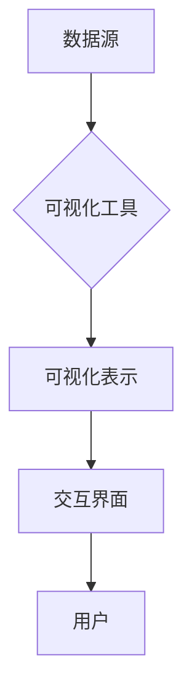

                 

关键词：知识可视化，信息图形，认知科学，数据展示，学习辅助

> 摘要：本文探讨了知识可视化作为一种辅助理解的新方法，通过介绍其核心概念、原理和具体应用，展示了其在教育、科研和商业等领域的广泛应用。文章还分析了知识可视化的数学模型和公式，提供了项目实践中的代码实例，并对未来的发展趋势与挑战进行了展望。

## 1. 背景介绍

在信息爆炸的时代，人们面对的海量数据和信息变得越来越难以处理和理解。传统的文本和表格已经无法满足人们对知识获取和理解的深层次需求。知识可视化作为一种新兴的方法，通过将复杂的信息结构以视觉化的形式呈现，极大地提高了信息的可读性和理解性。它不仅帮助人们快速捕捉信息的关键点，还能够发现数据之间的潜在关系，从而促进更深入的理解和洞察。

知识可视化不仅在学术研究领域得到广泛应用，还在商业、教育、医疗等多个领域展现出了巨大的潜力。例如，在商业领域，知识可视化可以帮助企业更好地理解和分析市场数据，优化业务流程；在教育领域，知识可视化工具能够辅助学生更有效地学习和记忆知识；在医疗领域，知识可视化可以使得复杂的医学信息更加直观易懂，帮助医生和患者共同决策。

## 2. 核心概念与联系

### 2.1. 知识可视化的定义

知识可视化（Knowledge Visualization）是指利用视觉表现形式来传达抽象的知识和概念，帮助人们更直观地理解复杂的信息结构。它不仅仅是一种信息的展示方式，更是一种认知工具，旨在提高信息的可理解性和可用性。

### 2.2. 知识可视化与信息图形的关系

知识可视化与信息图形（Information Graphics）有密切的联系。信息图形是通过视觉元素（如图表、图形、符号等）来表示信息，通常用于传达具体的数据或事实。而知识可视化则更加注重抽象概念的呈现和信息的组织结构，旨在揭示数据之间的关联和趋势。

### 2.3. 知识可视化与认知科学的关系

认知科学研究表明，人类的认知系统在处理视觉信息时效率更高，更容易记忆和提取。知识可视化利用这一点，通过图形化的方式呈现信息，帮助人们更好地理解和记忆复杂知识。同时，知识可视化还可以模拟人脑的思维过程，促进深层次的信息加工和知识构建。

## 2.4. 知识可视化的架构

知识可视化通常包含以下几个关键组成部分：

1. **数据源**：提供用于可视化的原始数据，可以是结构化的数据集，也可以是非结构化的文本、图像、声音等。

2. **可视化工具**：用于将数据转换成视觉图形的工具或软件，如数据可视化软件、图形编辑器等。

3. **可视化表示**：根据数据特性和目的，选择合适的可视化方式，如图表、地图、流程图、网络图等。

4. **交互界面**：提供用户与可视化结果之间的互动，如缩放、筛选、链接等，以增强用户体验和信息的可访问性。

下面是一个使用Mermaid绘制的知识可视化架构流程图：



### 2.5. 知识可视化在实践中的应用

知识可视化在多个领域中得到了广泛应用，以下是一些典型的应用实例：

- **商业分析**：企业使用知识可视化工具来分析市场数据，监控销售趋势，优化供应链等。

- **教育**：教育机构利用知识可视化来制作教学辅助材料，帮助学生更好地理解和记忆知识点。

- **科研**：科研人员使用知识可视化来展示研究成果，揭示数据之间的复杂关系。

- **医疗**：医疗领域通过知识可视化来呈现医学影像，帮助医生进行诊断和治疗规划。

## 3. 核心算法原理 & 具体操作步骤

### 3.1. 算法原理概述

知识可视化的核心在于将抽象的信息结构转化为视觉图形，从而提高信息的可理解性。这一过程中涉及多个关键步骤，包括数据预处理、选择合适的可视化方法、设计用户交互界面等。

### 3.2. 算法步骤详解

1. **数据预处理**：对原始数据进行清洗、转换和格式化，以确保数据适合可视化。

2. **可视化方法选择**：根据数据类型和目标，选择合适的可视化方法。常见的可视化方法包括折线图、柱状图、饼图、散点图、热力图等。

3. **可视化表示设计**：设计视觉图形的布局、颜色、标注等元素，确保视觉效果美观且信息传达清晰。

4. **用户交互界面设计**：开发交互界面，允许用户与可视化结果进行互动，如缩放、筛选、链接等。

### 3.3. 算法优缺点

**优点**：

- 提高信息可读性：通过视觉化方式，复杂信息变得更加直观易懂。
- 帮助发现数据模式：可视化方法能够揭示数据之间的潜在关系和趋势。
- 支持多感官学习：知识可视化结合视觉和其他感官，有助于加深理解和记忆。

**缺点**：

- 可视化设计难度：需要专业知识和技能，设计出既美观又有效的可视化表示。
- 信息过载风险：过于复杂或设计不当的可视化可能导致用户信息过载，反而降低理解效率。
- 技术实现复杂：知识可视化涉及到数据预处理、图形渲染、交互界面等多个方面，实现难度较高。

### 3.4. 算法应用领域

知识可视化在多个领域有广泛应用，如：

- **数据分析**：企业、政府和研究机构使用知识可视化工具来分析大量数据，揭示关键信息。
- **教育**：教育机构使用知识可视化工具制作教学材料，帮助学生更好地掌握知识点。
- **科研**：科研人员使用知识可视化工具展示研究成果，促进学术交流和合作。
- **医疗**：医疗领域通过知识可视化工具呈现医学影像，辅助医生进行诊断和治疗。

## 4. 数学模型和公式 & 详细讲解 & 举例说明

### 4.1. 数学模型构建

知识可视化涉及多个数学模型和公式，用于数据预处理、图形渲染、交互界面设计等。以下是一个简单的数学模型示例：

$$
V = f(D, M, S)
$$

其中：

- \( V \)：可视化结果
- \( D \)：数据集
- \( M \)：可视化方法
- \( S \)：可视化表示

### 4.2. 公式推导过程

公式的推导过程依赖于具体的可视化任务和数据特点。以下是一个简化的推导过程：

1. **数据预处理**：对原始数据进行清洗、转换和格式化，得到一个结构化的数据集 \( D \)。

2. **选择可视化方法**：根据数据类型和目标，选择一个合适的可视化方法 \( M \)。

3. **设计可视化表示**：根据数据特点和目标，设计一个合适的可视化表示 \( S \)，如热力图、折线图等。

4. **渲染图形**：使用图形渲染算法，将数据集 \( D \) 和可视化表示 \( S \) 转换为可视化结果 \( V \)。

### 4.3. 案例分析与讲解

以下是一个案例，展示如何使用知识可视化方法分析一家电商公司的销售数据。

**案例背景**：

一家电商公司希望了解其销售数据中的关键趋势和模式，以便优化营销策略和提高销售额。

**数据集**：

销售数据包含以下字段：

- 产品ID
- 销售额
- 销售日期
- 产品类别

**可视化方法**：

选择折线图来展示销售额随时间的变化趋势。

**可视化表示**：

设计一个带有日期轴和销售额刻度的折线图，同时使用不同颜色表示不同产品类别。

**渲染图形**：

使用数据可视化工具（如D3.js）将销售数据转换为折线图，并显示在网页上。

**案例分析**：

通过分析折线图，公司可以发现以下趋势：

- 某些产品类别在特定时间段的销售额较高，说明这些产品在市场上的需求较大。
- 某些产品类别的销售额在特定时间段呈现下降趋势，可能需要调整营销策略。
- 通过对比不同产品类别的销售额，可以识别出最具潜力的产品类别，并制定相应的营销计划。

## 5. 项目实践：代码实例和详细解释说明

### 5.1. 开发环境搭建

为了实现知识可视化项目，我们需要以下开发环境和工具：

- **编程语言**：Python
- **数据可视化库**：Matplotlib、Seaborn、Plotly
- **数据分析库**：Pandas、NumPy
- **版本控制工具**：Git
- **集成开发环境**：PyCharm或Visual Studio Code

### 5.2. 源代码详细实现

以下是一个简单的示例，展示如何使用Python和Matplotlib库创建一个简单的知识可视化项目。

```python
import pandas as pd
import matplotlib.pyplot as plt

# 读取数据
data = pd.read_csv('sales_data.csv')

# 数据预处理
data['date'] = pd.to_datetime(data['date'])
data.set_index('date', inplace=True)

# 可视化：销售额随时间变化趋势
data['sales'].plot()
plt.title('Sales Trend Over Time')
plt.xlabel('Date')
plt.ylabel('Sales')
plt.show()
```

### 5.3. 代码解读与分析

以上代码实现了以下关键步骤：

1. **导入库**：导入所需的Python库，包括Pandas、Matplotlib等。

2. **读取数据**：使用Pandas库读取CSV文件中的销售数据，并将其转换为DataFrame格式。

3. **数据预处理**：将日期字段转换为日期类型，并设置日期为索引。

4. **可视化**：使用Matplotlib库绘制销售额随时间变化的折线图。

5. **展示图形**：使用`plt.show()`函数显示可视化结果。

### 5.4. 运行结果展示

运行以上代码后，将显示一个折线图，展示销售额随时间的变化趋势。通过这个简单的示例，我们可以看到知识可视化项目的基本实现流程。

## 6. 实际应用场景

### 6.1. 教育领域

在教育领域，知识可视化工具可以辅助教师制作教学材料，如思维导图、概念图等。这些工具不仅能够帮助学生更好地理解和记忆知识点，还能够促进师生之间的互动和讨论。例如，通过在课堂上展示知识点之间的关联和层次结构，教师可以引导学生深入思考，激发学习兴趣。

### 6.2. 科研领域

在科研领域，知识可视化工具可以帮助研究人员更好地理解复杂的数据集和研究结果。通过将数据以图形化的形式呈现，研究人员可以更直观地发现数据之间的关联和趋势，从而提出新的假设和见解。例如，在生物信息学研究中，知识可视化工具可以用于展示基因表达数据的聚类结果，帮助研究人员识别关键基因和生物通路。

### 6.3. 商业领域

在商业领域，知识可视化工具可以帮助企业更好地理解和分析市场数据，优化业务流程。例如，通过可视化分析销售数据，企业可以识别出畅销产品和滞销产品，调整营销策略；通过可视化分析客户行为数据，企业可以了解客户偏好，提供更个性化的服务。此外，知识可视化工具还可以用于项目管理、供应链优化等领域，帮助企业提高运营效率。

### 6.4. 未来应用展望

随着技术的不断发展，知识可视化工具将在更多领域得到应用。未来，我们将看到以下趋势：

- **更加智能化**：知识可视化工具将结合人工智能技术，自动分析数据，提供更精准的可视化结果。
- **多模态融合**：知识可视化将融合多种感官信息，如音频、视频等，提供更丰富的信息展示方式。
- **云计算与大数据**：知识可视化工具将充分利用云计算和大数据技术，处理和分析大规模数据集，提供更高效的可视化服务。
- **个性化定制**：知识可视化工具将根据用户需求和偏好，提供个性化定制服务，满足不同领域的需求。

## 7. 工具和资源推荐

### 7.1. 学习资源推荐

- **书籍**：
  - 《数据可视化：使用图表、地图和交互式图形进行数据展示》（Data Visualization: Design and Meaning） - Colin Ware
  - 《知识的可视化：原理、方法与应用》 - 郑旭东
- **在线课程**：
  - Coursera - Data Visualization with Tableau
  - edX - Visualization and Communication of Quantitative Information
- **网站**：
  - Data visualization blogs：如Visualizing Data、Datawrapper等

### 7.2. 开发工具推荐

- **数据可视化库**：
  - Matplotlib、Seaborn、Plotly（Python）
  - D3.js、ECharts（JavaScript）
  - Tableau、Power BI（商业软件）
- **图形编辑器**：
  - Adobe Illustrator
  - Sketch
  - Figma

### 7.3. 相关论文推荐

- **经典论文**：
  - "Visual Thinking: The Concept, How It Evolves, And How It Functions" - Colin Ware
  - "The Visual Display of Quantitative Information" - Edward Tufte
- **最新论文**：
  - "Interactive Data Visualization for the Web" - Scott Murray
  - "Exploratory Data Visualization" - Michael J. P. Selvaraj

## 8. 总结：未来发展趋势与挑战

### 8.1. 研究成果总结

知识可视化作为一种辅助理解的新方法，已经在教育、科研、商业等多个领域取得了显著成果。通过将抽象的信息结构以视觉化的形式呈现，知识可视化提高了信息的可读性和理解性，帮助人们更好地处理和分析复杂的数据。

### 8.2. 未来发展趋势

未来，知识可视化将朝着更加智能化、多模态融合、云计算与大数据、个性化定制等方向发展。随着技术的不断进步，知识可视化工具将更加高效、直观，满足不同领域的需求。

### 8.3. 面临的挑战

尽管知识可视化取得了显著成果，但仍面临一些挑战。首先，可视化设计难度较高，需要专业知识和技能。其次，信息过载风险依然存在，复杂或设计不当的可视化可能导致用户理解困难。此外，技术实现复杂，涉及到数据预处理、图形渲染、交互界面等多个方面。

### 8.4. 研究展望

未来，知识可视化研究应重点关注以下几个方面：

- **智能化**：结合人工智能技术，提高可视化工具的自动分析能力和个性化推荐。
- **多模态融合**：融合多种感官信息，提供更丰富的信息展示方式。
- **用户体验优化**：通过交互设计，提高可视化工具的用户友好性。
- **教育应用**：探索知识可视化在教育中的应用，提高教学效果和学习体验。

## 9. 附录：常见问题与解答

### 9.1. 什么是知识可视化？

知识可视化是指利用视觉表现形式来传达抽象的知识和概念，帮助人们更直观地理解复杂的信息结构。

### 9.2. 知识可视化有哪些应用领域？

知识可视化在多个领域得到应用，包括教育、科研、商业、医疗等。

### 9.3. 如何选择合适的可视化方法？

根据数据类型、目标和分析需求，选择合适的可视化方法，如折线图、柱状图、饼图等。

### 9.4. 知识可视化工具有哪些？

常见的知识可视化工具有Matplotlib、D3.js、Tableau、Power BI等。

### 9.5. 知识可视化如何优化用户体验？

通过交互设计、色彩搭配、布局优化等手段，提高可视化工具的用户体验。

作者：禅与计算机程序设计艺术 / Zen and the Art of Computer Programming
----------------------------------------------------------------

本文通过深入探讨知识可视化的核心概念、算法原理、数学模型以及实际应用场景，展示了知识可视化作为一种辅助理解的新方法的广泛应用和潜力。未来，随着技术的不断进步，知识可视化将在更多领域发挥重要作用，助力人类更好地理解和利用信息。作者希望本文能为广大读者提供有益的启示和指导。

