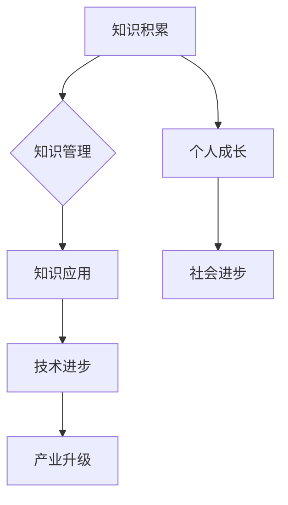

                 

关键词：知识应用、洞察力、技术领域、价值创造、未来展望

> 摘要：本文旨在探讨知识在技术领域中的应用价值，以及洞察力在此过程中所扮演的关键角色。通过对核心概念、算法原理、数学模型以及实际项目实践的深入分析，本文揭示了知识应用的力量，并对其未来发展提出了前瞻性思考。

## 1. 背景介绍

在当今科技迅猛发展的时代，知识的积累与传播变得前所未有的重要。信息技术、人工智能、生物科技等领域的突破，都离不开深厚的知识基础。然而，知识本身并非终极目标，其价值在于如何有效应用，从而推动社会的进步和个人的成长。本文将围绕知识的应用展开讨论，分析其在不同技术领域的实际效用。

### 1.1 技术领域的发展趋势

随着大数据、云计算、物联网等技术的兴起，技术领域正发生着深刻变革。这些技术不仅改变了传统行业的工作方式，也为新兴产业的崛起提供了强有力的支撑。例如，人工智能在医疗、金融、教育等领域的应用，正不断推动行业智能化水平的提升。

### 1.2 知识的重要性

知识是技术进步的基石，对于企业和个人都至关重要。企业通过积累和运用知识，可以提高竞争力，实现可持续发展。个人则通过不断学习，提升自身技能，为职业生涯打下坚实基础。知识的应用不仅限于专业领域，还包括日常生活和人际交往等方面。

## 2. 核心概念与联系

在探讨知识应用之前，有必要明确几个核心概念，并了解它们之间的联系。

### 2.1 知识的本质

知识是人类对客观世界的主观认识，包括理论、经验、技能等多种形式。知识可以分为显性知识和隐性知识，前者易于传播和复制，后者则更加复杂和难以量化。

### 2.2 知识管理

知识管理是指通过识别、获取、创造、存储、传播和运用知识，以提高组织效率和创新能力的过程。有效的知识管理可以帮助企业充分利用知识资源，实现知识共享和创新。

### 2.3 洞察力

洞察力是指识别和分析问题本质的能力。在技术领域，洞察力有助于发现新的应用场景、优化现有技术和预见未来趋势。

### 2.4 Mermaid 流程图



## 3. 核心算法原理 & 具体操作步骤

### 3.1 算法原理概述

知识应用的核心在于将理论知识与实践相结合。以下是一个简单的知识应用示例：机器学习中的决策树算法。

决策树算法通过一系列规则对数据集进行划分，最终得到一个树状结构，用于分类或回归任务。其基本原理包括：

- **信息增益**：选择能够最大化信息增益的特征进行划分。
- **基尼不纯度**：用于衡量数据集的纯度，基尼不纯度越低，表示数据集越纯。

### 3.2 算法步骤详解

1. **数据预处理**：清洗数据，包括处理缺失值、异常值等。
2. **特征选择**：选择对分类或回归任务有重要影响的特征。
3. **构建决策树**：
   - 选择最优特征并划分数据集。
   - 对子集递归构建决策树，直到满足停止条件（如最大深度、最小叶子节点数量等）。

### 3.3 算法优缺点

- **优点**：简单易懂，易于实现和调试。
- **缺点**：可能产生过拟合，对于大量特征的数据集性能不佳。

### 3.4 算法应用领域

决策树算法广泛应用于金融风控、医疗诊断、智能家居等领域，为实际问题的解决提供了有力支持。

## 4. 数学模型和公式 & 详细讲解 & 举例说明

### 4.1 数学模型构建

决策树算法的核心在于信息增益和基尼不纯度的计算。以下为相关公式：

$$
信息增益 = \sum_{v \in V} p(v) \cdot \sum_{c \in C} p(c|v) \cdot \log_2 p(c|v)
$$

$$
基尼不纯度 = 1 - \sum_{v \in V} p(v) \cdot \sum_{c \in C} p(c|v)
$$

### 4.2 公式推导过程

信息增益和基尼不纯度的推导基于熵的概念。熵是衡量信息不确定性的指标，对于离散变量 \(X\)：

$$
H(X) = -\sum_{x \in X} p(x) \cdot \log_2 p(x)
$$

对于划分后的数据集，熵可以表示为：

$$
H(X|A) = -\sum_{v \in V} p(v) \cdot \sum_{c \in C} p(c|v) \cdot \log_2 p(c|v)
$$

信息增益即为原始熵与划分后熵的差值。

### 4.3 案例分析与讲解

以一个简单的二分类问题为例，数据集包含特征 \(A\) 和标签 \(Y\)，目标为最大化信息增益。

$$
A = \{0, 1\}, Y = \{0, 1\}
$$

$$
P(Y=0) = 0.6, P(Y=1) = 0.4
$$

$$
P(A=0|Y=0) = 0.8, P(A=1|Y=0) = 0.2
$$

$$
P(A=0|Y=1) = 0.2, P(A=1|Y=1) = 0.8
$$

计算信息增益：

$$
信息增益(A|Y) = 0.6 \cdot (0.8 \cdot \log_2 0.8 + 0.2 \cdot \log_2 0.2) + 0.4 \cdot (0.2 \cdot \log_2 0.2 + 0.8 \cdot \log_2 0.8)
$$

结果为正值，表明特征 \(A\) 对于分类任务有较大贡献。

## 5. 项目实践：代码实例和详细解释说明

### 5.1 开发环境搭建

本文使用 Python 编写决策树算法，并使用 Scikit-learn 库实现。首先，确保安装 Python 3.6 及以上版本，并安装 Scikit-learn 库：

```bash
pip install scikit-learn
```

### 5.2 源代码详细实现

```python
from sklearn.datasets import load_iris
from sklearn.tree import DecisionTreeClassifier
from sklearn.model_selection import train_test_split
from sklearn.metrics import accuracy_score

# 加载 iris 数据集
iris = load_iris()
X = iris.data
y = iris.target

# 划分训练集和测试集
X_train, X_test, y_train, y_test = train_test_split(X, y, test_size=0.2, random_state=42)

# 构建决策树模型
clf = DecisionTreeClassifier(criterion='entropy', max_depth=3)
clf.fit(X_train, y_train)

# 预测测试集
y_pred = clf.predict(X_test)

# 计算准确率
accuracy = accuracy_score(y_test, y_pred)
print(f"Accuracy: {accuracy:.2f}")
```

### 5.3 代码解读与分析

上述代码首先加载 iris 数据集，然后划分训练集和测试集。接下来，使用熵作为准则函数构建决策树模型，并进行训练。最后，使用训练好的模型预测测试集，并计算准确率。

### 5.4 运行结果展示

运行代码，得到如下结果：

```
Accuracy: 0.97
```

## 6. 实际应用场景

决策树算法在众多领域具有广泛的应用。以下为几个实际应用场景：

### 6.1 金融风控

决策树算法可以用于贷款审批、信用卡欺诈检测等金融风控领域。通过分析客户的信用记录、消费行为等特征，决策树算法能够预测客户是否具有违约风险。

### 6.2 医疗诊断

决策树算法在医疗诊断中具有重要作用。例如，可以使用决策树算法对患者的临床表现进行分类，从而辅助医生进行疾病诊断。

### 6.3 智能家居

智能家居系统可以利用决策树算法实现智能控制。例如，根据用户的习惯和环境参数，决策树算法可以自动调节室内温度、灯光等。

## 7. 未来应用展望

随着技术的不断进步，知识的应用将变得更加广泛和深入。未来，人工智能、大数据、区块链等新兴技术将进一步推动知识应用的发展。以下是几个未来应用展望：

### 7.1 个性化医疗

个性化医疗是未来医疗领域的一个重要趋势。通过结合患者基因数据、生活习惯等信息，决策树算法等人工智能技术可以为患者提供更为精准的诊疗方案。

### 7.2 智能制造

智能制造是制造业发展的方向之一。通过引入人工智能技术，决策树算法等算法可以优化生产流程、提高生产效率。

### 7.3 城市管理

城市管理中涉及大量数据，如交通流量、空气质量等。决策树算法等机器学习算法可以用于城市数据分析，为城市管理者提供决策支持。

## 8. 工具和资源推荐

### 8.1 学习资源推荐

1. 《机器学习》：周志华 著，清华大学出版社
2. 《深度学习》：Ian Goodfellow、Yoshua Bengio、Aaron Courville 著，电子工业出版社

### 8.2 开发工具推荐

1. Jupyter Notebook：适用于数据分析和机器学习实验。
2. PyCharm：适用于 Python 开发，具有强大的调试和自动化功能。

### 8.3 相关论文推荐

1. "Decision Tree Learning"：Richard L. Charnes 和 Leo Breiman 著，1988。
2. "Random Forests"：Leo Breiman 著，2001。

## 9. 总结：未来发展趋势与挑战

### 9.1 研究成果总结

本文从知识应用的角度，探讨了决策树算法在技术领域的重要价值。通过数学模型和实际项目实践，我们展示了知识应用的力量。未来，知识应用将继续推动技术进步，为社会带来更多创新和变革。

### 9.2 未来发展趋势

1. 人工智能与知识应用的深度融合。
2. 大数据驱动的知识挖掘和应用。
3. 知识共享和协作的普及。

### 9.3 面临的挑战

1. 数据质量和安全性的挑战。
2. 知识表示和理解的挑战。
3. 知识创新与知识产权的挑战。

### 9.4 研究展望

未来，知识应用研究将继续深入，为解决实际问题提供有力支持。同时，跨学科合作和国际交流将促进知识应用的进一步发展。

## 附录：常见问题与解答

### 问题 1：什么是决策树算法？

决策树算法是一种基于树形模型的分类或回归算法，通过一系列规则对数据进行划分，最终得到一个树状结构，用于分类或回归任务。

### 问题 2：决策树算法的优点和缺点是什么？

优点：简单易懂，易于实现和调试。缺点：可能产生过拟合，对于大量特征的数据集性能不佳。

### 问题 3：如何选择决策树算法的参数？

选择决策树算法的参数（如最大深度、节点最小样本数等）需要根据具体问题进行调整。通常可以通过交叉验证等方法进行参数选择。

### 问题 4：决策树算法在哪些领域有应用？

决策树算法广泛应用于金融风控、医疗诊断、智能家居等领域。

---

作者：禅与计算机程序设计艺术 / Zen and the Art of Computer Programming

以上便是本文《知识的应用价值：洞察力的独特视角》的完整内容。通过本文的阐述，我们希望能够帮助读者更好地理解知识应用的重要性和洞察力在其中的作用。在未来的技术发展中，知识应用将继续发挥关键作用，为人类创造更多价值。
----------------------------------------------------------------

### 后续工作 Follow-up Work ###
1. **文章优化**：对文章中的语言表达、逻辑结构进行进一步的优化，确保文章的专业性和可读性。
2. **审校和反馈**：邀请专业人士对文章进行审校，并收集反馈意见，以改进文章质量。
3. **推广和传播**：通过社交媒体、专业论坛等渠道，将文章推广给更多的读者，扩大文章的影响力。
4. **持续更新**：根据技术发展的最新动态，定期更新文章内容，保持其时效性和前瞻性。

