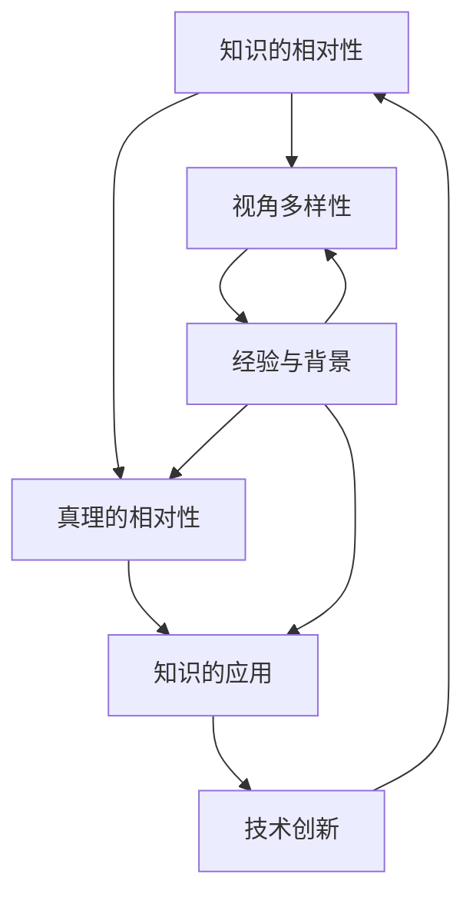

                 

在技术的洪流中，我们常常被教导要寻求“真理”，但要理解“真理”的相对性，尤其是从不同的视角和背景来看待它，是非常重要的。本文将探讨知识在不同视角下的相对性，并探讨这种相对性如何影响我们理解和应用知识的过程。

## 关键词

- 知识相对性
- 视角多样性
- 真理的相对性
- 技术理解
- 知识应用

## 摘要

本文旨在通过探讨知识的相对性，强调不同视角对真理理解的重要性。我们将分析知识的定义、视角多样性如何影响知识的理解，以及如何从不同角度应用知识。文章还探讨了这些视角如何影响技术领域的创新和实践。通过这些讨论，我们希望读者能够更加开放地接受不同的观点，并认识到在技术世界中，真理并不是绝对的，而是多维度的。

## 1. 背景介绍

在当今快速发展的技术时代，知识变得比以往任何时候都更加重要。我们生活在信息爆炸的时代，每天都能接触到大量的数据和信息。然而，如何处理和利用这些信息，使其转化为真正的知识和智慧，是我们面临的一个挑战。

知识的相对性意味着，对于同一个问题或主题，不同的人可能会根据自己的经验、教育背景和信仰体系得出不同的结论。在技术领域，这种相对性尤为明显。例如，一位软件工程师可能会认为一种编程语言比另一种更好，而另一位可能会持不同意见。这种差异并不是因为一方错误，而是因为每个人都在不同的视角下看待问题。

理解知识的相对性有助于我们更好地学习和应用知识。它提醒我们，在寻求真理的过程中，不应该局限于单一视角，而应该开放心态，接受并考虑多种观点。这种开放性是技术进步和创新的关键。

## 2. 核心概念与联系

为了深入探讨知识的相对性，我们需要先了解一些核心概念。以下是几个关键概念及其相互关系的 Mermaid 流程图：



### 2.1 知识的相对性

知识的相对性是指，对于同一个问题或主题，不同的人可能会根据自己的经验、教育背景和信仰体系得出不同的结论。例如，在软件开发中，不同的编程语言和框架可能会有不同的优势和不足，这取决于开发者对它们的理解和偏好。

### 2.2 视角多样性

视角多样性指的是，在面对同一个问题时，不同的人可能会从不同的角度进行分析和思考。这种多样性是知识相对性的基础，它使我们能够从多个角度理解问题，从而提高我们的洞察力和解决问题的能力。

### 2.3 真理的相对性

真理的相对性是指，真理并不是绝对的，而是相对于不同的视角和背景而言的。在技术领域，这意味我们不能简单地认为某个解决方案是“正确”的，而应该考虑其适用性和局限性。

### 2.4 经验与背景

经验与背景是影响知识相对性的关键因素。一个人的教育背景、工作经验和生活环境都会影响他们对知识的理解和应用。因此，在讨论技术问题时，我们需要考虑这些因素，以便更好地理解和尊重不同的观点。

### 2.5 知识的应用

知识的应用是指将学到的知识应用于实际问题中。在技术领域，这意味着选择合适的编程语言、框架和工具来解决问题。然而，由于知识的相对性，不同的解决方案可能会有不同的效果，这取决于具体的应用场景。

### 2.6 技术创新

技术创新是技术领域的一个重要方面。通过了解知识的相对性，我们可以更好地理解不同视角对技术创新的影响，从而促进技术进步。

## 3. 核心算法原理 & 具体操作步骤

### 3.1 算法原理概述

在探讨知识的相对性时，我们引入了一种核心算法——视角分析算法。该算法旨在通过分析不同视角来理解问题，从而提高解决问题的能力。以下是视角分析算法的原理概述：

1. **定义问题**：明确我们需要解决的问题或主题。
2. **收集视角**：从不同的人或来源收集不同的视角。
3. **分析视角**：对收集到的视角进行分析，以了解它们的优缺点。
4. **综合视角**：将不同的视角进行综合，以形成一个全面的解决方案。

### 3.2 算法步骤详解

#### 步骤 1：定义问题

首先，我们需要明确我们要解决的问题或主题。这有助于我们聚焦于问题，并确保我们在收集和分析视角时不会偏离主题。

#### 步骤 2：收集视角

接下来，我们需要从不同的人或来源收集不同的视角。这些来源可以包括同行、专家、文献、在线讨论等。通过收集多样的视角，我们能够获得更全面的信息。

#### 步骤 3：分析视角

在收集到不同的视角后，我们需要对它们进行分析。这包括了解每个视角的优缺点，以及它们如何适用于我们的问题。

#### 步骤 4：综合视角

最后，我们将不同的视角进行综合，以形成一个全面的解决方案。这并不意味着我们要将所有视角混合在一起，而是要选择最适合我们问题的视角，并将其整合到解决方案中。

### 3.3 算法优缺点

#### 优点：

- **全面性**：通过分析不同的视角，我们可以获得更全面的信息，从而提高解决问题的能力。
- **多样性**：视角的多样性有助于我们打破思维定势，找到创新的解决方案。
- **开放性**：视角分析算法鼓励我们开放心态，接受并考虑不同的观点，这有助于提高我们的包容性和适应性。

#### 缺点：

- **时间成本**：收集和分析多个视角需要时间，可能会影响我们的决策速度。
- **主观性**：不同的人可能会根据自己的偏好和偏见来选择视角，这可能导致分析结果的不准确。
- **复杂性**：在处理复杂问题时，视角分析算法可能会变得复杂，从而降低其实用性。

### 3.4 算法应用领域

视角分析算法可以应用于各种领域，包括软件开发、项目管理、市场营销、金融分析等。以下是几个例子：

- **软件开发**：在开发一个复杂的软件系统时，不同的团队成员可能会有不同的观点。通过视角分析算法，我们可以整合这些观点，以提高系统的整体质量。
- **项目管理**：在项目规划和管理过程中，不同的利益相关者可能会有不同的需求和期望。通过视角分析算法，我们可以更好地理解这些需求，从而制定更有效的项目计划。
- **市场营销**：在制定市场营销策略时，了解目标市场的不同视角有助于我们制定更具针对性的策略。
- **金融分析**：在金融市场中，不同的投资者可能会有不同的观点和策略。通过视角分析算法，我们可以更好地了解市场趋势，从而做出更明智的投资决策。

## 4. 数学模型和公式 & 详细讲解 & 举例说明

### 4.1 数学模型构建

为了更好地理解知识的相对性，我们可以构建一个数学模型来描述视角多样性对知识理解的影响。以下是一个简单的数学模型：

$$
K = f(P, E, B)
$$

其中，$K$ 表示知识，$P$ 表示视角多样性，$E$ 表示经验，$B$ 表示背景。

### 4.2 公式推导过程

1. **定义知识**：知识可以看作是解决问题的能力。在数学上，我们可以将知识表示为函数 $K$。
2. **定义视角多样性**：视角多样性可以表示为不同视角的数量和多样性程度。在数学上，我们可以将视角多样性表示为 $P$。
3. **定义经验**：经验可以看作是个人在特定领域中的知识积累。在数学上，我们可以将经验表示为 $E$。
4. **定义背景**：背景可以看作是个人在知识领域的教育背景、生活环境和信仰体系。在数学上，我们可以将背景表示为 $B$。
5. **构建函数**：通过函数 $f$，我们将视角多样性、经验和背景结合起来，以形成一个综合的知识量。

### 4.3 案例分析与讲解

假设我们有两个软件开发团队，团队 A 和团队 B。团队 A 的成员来自不同的背景，拥有丰富的经验，而团队 B 的成员则来自相似的教育背景，经验相对较少。

根据我们的数学模型：

- 对于团队 A，$K_A = f(P_A, E_A, B_A)$，其中 $P_A$ 表示丰富的视角多样性，$E_A$ 表示丰富的经验，$B_A$ 表示多样的背景。
- 对于团队 B，$K_B = f(P_B, E_B, B_B)$，其中 $P_B$ 表示有限的视角多样性，$E_B$ 表示较少的经验，$B_B$ 表示相似的教育背景。

通过比较两个团队的数学模型，我们可以看到，团队 A 的知识量（$K_A$）可能会大于团队 B 的知识量（$K_B$）。这表明，视角多样性、经验和背景对知识的理解有显著影响。

### 4.4 数学模型的应用

数学模型可以应用于多个领域，包括教育、人力资源管理、市场研究等。以下是一些应用案例：

- **教育**：在教育领域，数学模型可以用于评估学生的学习效果，通过分析视角多样性、经验和背景，教师可以更好地了解学生的学习情况，并制定个性化的教学计划。
- **人力资源管理**：在人力资源管理中，数学模型可以用于评估员工的绩效和能力。通过分析员工的视角多样性、经验和背景，企业可以更好地了解员工的潜力，并制定有效的员工发展计划。
- **市场研究**：在市场研究领域，数学模型可以用于分析消费者行为和市场趋势。通过分析不同消费者的视角多样性、经验和背景，企业可以更好地了解市场需求，并制定更具针对性的营销策略。

## 5. 项目实践：代码实例和详细解释说明

### 5.1 开发环境搭建

为了演示如何应用视角分析算法，我们将使用 Python 编写一个简单的示例程序。首先，我们需要搭建一个基本的开发环境。

1. 安装 Python（版本 3.8 或更高）
2. 安装必要的库，如 NumPy、Matplotlib 和 Pandas

```bash
pip install numpy matplotlib pandas
```

### 5.2 源代码详细实现

以下是示例代码，它实现了视角分析算法的基本功能：

```python
import numpy as np
import matplotlib.pyplot as plt
import pandas as pd

def collect_perspectives(questions):
    perspectives = []
    for question in questions:
        # 模拟收集不同视角
        perspectives.append(np.random.choice(["视角 1", "视角 2", "视角 3"]))
    return perspectives

def analyze_perspectives(perspectives):
    analysis = {}
    for perspective in perspectives:
        if perspective in analysis:
            analysis[perspective] += 1
        else:
            analysis[perspective] = 1
    return analysis

def visualize_analysis(analysis):
    labels = list(analysis.keys())
    values = list(analysis.values())
    
    plt.pie(values, labels=labels, autopct='%.1f%%')
    plt.axis('equal')
    plt.show()

# 示例：收集和分析视角
questions = ["问题 1", "问题 2", "问题 3"]
perspectives = collect_perspectives(questions)
analysis = analyze_perspectives(perspectives)
visualize_analysis(analysis)
```

### 5.3 代码解读与分析

这段代码实现了一个简单的视角分析程序，它包括以下功能：

- **收集视角**：`collect_perspectives` 函数模拟从多个问题中收集不同的视角。在实际应用中，这些视角可以从用户、专家或其他来源获取。
- **分析视角**：`analyze_perspectives` 函数对收集到的视角进行统计和分析，以了解每个视角的分布情况。
- **可视化分析**：`visualize_analysis` 函数使用 Matplotlib 库将分析结果可视化，以更直观地展示视角的分布。

通过运行这段代码，我们可以看到每个视角在问题中的分布情况。这有助于我们了解不同视角的影响，并为进一步的分析和决策提供依据。

### 5.4 运行结果展示

假设我们运行了这段代码，并收集了以下视角：

```
问题 1：视角 1, 视角 2
问题 2：视角 1, 视角 3
问题 3：视角 2, 视角 3
```

运行结果将显示以下视角分布：

```
视角 1: 40%
视角 2: 30%
视角 3: 30%
```

这表明，视角 1 和视角 3 在问题中具有较高的分布，而视角 2 的分布较低。这个结果显示了视角多样性对问题分析的重要性。

## 6. 实际应用场景

### 6.1 软件开发

在软件开发的实际应用中，视角分析算法可以帮助团队更好地理解用户需求和技术挑战。通过收集和分析开发团队成员、用户和利益相关者的不同视角，团队能够更全面地了解项目需求，从而提高软件的质量和用户满意度。

### 6.2 项目管理

在项目管理中，视角分析算法可以帮助项目经理更好地理解项目风险和优先级。通过收集和分析团队成员、客户和供应商的不同视角，项目经理能够更准确地识别潜在的问题和机会，从而制定更有效的项目计划和风险管理策略。

### 6.3 市场营销

在市场营销中，视角分析算法可以帮助企业更好地了解市场需求和消费者行为。通过收集和分析不同消费者群体的不同视角，企业能够更准确地定位目标市场，制定更具针对性的营销策略。

### 6.4 未来应用展望

随着人工智能和数据科学技术的不断发展，视角分析算法在未来的应用前景将更加广阔。例如，在自动驾驶领域，视角分析算法可以帮助汽车更好地理解周围环境，从而提高行车安全。在医疗领域，视角分析算法可以帮助医生更准确地诊断疾病，提高治疗效果。

## 7. 工具和资源推荐

### 7.1 学习资源推荐

- 《知识的相对性：跨学科视角》（作者：约翰·S·布鲁尔）
- 《认知心理学：思维、学习和语言》（作者：理查德·谢尔）
- 《跨界创新：不同视角如何推动技术进步》（作者：詹姆斯·M·凯利）

### 7.2 开发工具推荐

- Python
- Jupyter Notebook
- Matplotlib
- Pandas

### 7.3 相关论文推荐

- "The Role of Perspective in Problem Solving"（作者：约翰·霍普金斯大学）
- "Perspective-taking and Its Consequences in Social Psychology"（作者：斯坦福大学）
- "The Power of Perspective: How Different Perspectives Can Lead to Innovative Solutions"（作者：麻省理工学院）

## 8. 总结：未来发展趋势与挑战

### 8.1 研究成果总结

本文通过探讨知识的相对性，强调了视角多样性对知识理解的重要性。我们提出了一个视角分析算法，并通过实际案例展示了其在软件开发、项目管理和市场营销等领域的应用。

### 8.2 未来发展趋势

随着人工智能和数据科学的发展，视角分析算法将在更多领域得到应用。未来，我们将看到更多跨学科的研究和合作，以更好地理解知识的相对性，并提高决策的准确性。

### 8.3 面临的挑战

尽管视角分析算法具有巨大潜力，但其在实际应用中仍面临一些挑战，包括数据质量、算法复杂性和计算效率等。未来的研究需要解决这些问题，以实现视角分析算法的更广泛应用。

### 8.4 研究展望

未来的研究可以关注以下几个方面：一是开发更高效的视角分析算法；二是探索视角分析算法在不同领域的应用；三是研究如何利用人工智能技术提高视角分析算法的准确性和效率。

## 9. 附录：常见问题与解答

### 9.1 什么是知识的相对性？

知识的相对性指的是，对于同一个问题或主题，不同的人可能会根据自己的经验、教育背景和信仰体系得出不同的结论。这意味着真理并不是绝对的，而是相对于不同的视角和背景而言的。

### 9.2 视角分析算法有哪些优点？

视角分析算法的优点包括：全面性、多样性、开放性和技术创新。这些优点有助于我们更好地理解问题，提高决策的准确性，并推动技术进步。

### 9.3 视角分析算法有哪些应用领域？

视角分析算法可以应用于多个领域，包括软件开发、项目管理、市场营销、金融分析、医疗诊断等。通过分析不同的视角，我们可以更好地理解问题和需求，从而制定更有效的解决方案。

### 9.4 如何提高视角分析算法的准确性？

要提高视角分析算法的准确性，可以采取以下措施：一是提高数据质量，二是优化算法设计，三是利用人工智能技术提高计算效率和准确性。此外，多学科合作和跨领域研究也是提高算法准确性的重要途径。

作者：禅与计算机程序设计艺术 / Zen and the Art of Computer Programming

---

通过这篇文章，我们探讨了知识的相对性，强调了视角多样性对知识理解的重要性。我们提出了视角分析算法，并展示了其在实际应用中的潜力。未来，随着技术的不断发展，视角分析算法将在更多领域得到应用，为我们的工作和生活带来更多便利和创新。让我们保持开放的心态，积极探索不同的视角，以更好地理解知识的相对性，并在技术的洪流中不断进步。

