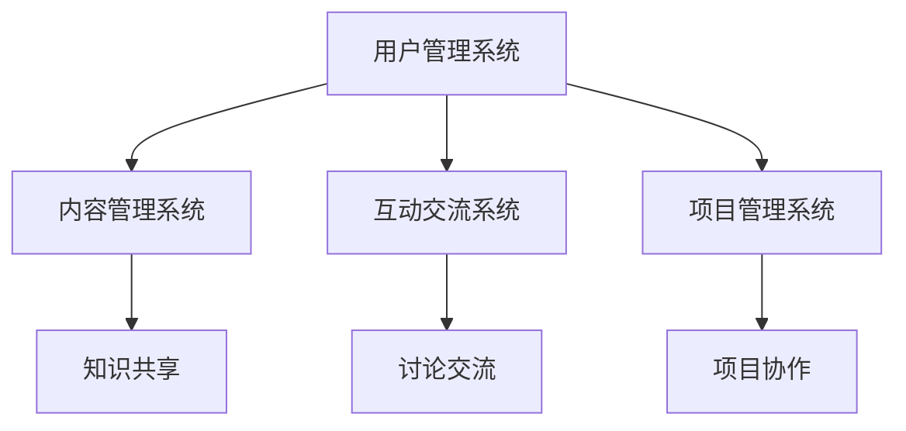

                 

关键词：社交化学习、协作平台、知识共享、人工智能、教育技术、互动学习、在线教育

> 摘要：本文将探讨知识的社交化学习以及协作平台的兴起，分析其在教育技术领域的应用及其对未来教育的深远影响。随着人工智能技术的快速发展，知识共享和互动学习已成为现代教育的核心，协作平台为学习者提供了全新的学习体验，推动了教育技术的革新。

## 1. 背景介绍

随着互联网和移动设备的普及，教育正经历着前所未有的变革。传统的课堂教学模式已无法满足现代教育需求，学习者对个性化、互动性、协作性的学习环境提出了更高要求。社交化学习作为一种新兴的学习模式，强调学习者之间的互动、分享和协作，逐渐成为教育技术领域的研究热点。

协作平台作为社交化学习的重要载体，为学习者提供了一个集知识共享、讨论交流、项目协作于一体的虚拟空间。这些平台通过集成各种教育资源和工具，促进了学习者的深度参与和持续互动，从而提高了学习效果。

## 2. 核心概念与联系

### 2.1 社交化学习的定义

社交化学习是一种基于社交网络的学习模式，通过促进学习者之间的互动、协作和知识共享，实现知识获取、技能提升和思维拓展。社交化学习强调个体与个体、个体与群体之间的互动，使学习成为一种社交活动，从而提高学习兴趣和参与度。

### 2.2 协作平台的架构

协作平台通常包括以下几个核心组成部分：

- **用户管理系统**：负责用户的注册、认证、权限管理等。
- **内容管理系统**：用于存储、管理和共享各种教育资源和内容。
- **互动交流系统**：支持学习者之间的即时沟通、讨论和协作。
- **项目管理系统**：提供项目规划、任务分配、进度跟踪等功能。

下面是一个简单的 Mermaid 流程图，展示了协作平台的基本架构：



### 2.3 社交化学习与协作平台的关系

社交化学习与协作平台之间存在着密切的联系。协作平台为社交化学习提供了技术支撑，使学习者能够方便地进行知识共享、互动交流和项目协作。同时，社交化学习为协作平台注入了活力，使平台成为一个充满创造力和合作精神的学习社区。

## 3. 核心算法原理 & 具体操作步骤

### 3.1 算法原理概述

协作平台的核心算法主要包括知识推荐算法、社交网络分析算法和协作学习算法。

- **知识推荐算法**：根据学习者的兴趣、学习历史和社交关系，为学习者推荐相关的学习资源和内容。
- **社交网络分析算法**：分析学习者之间的社交关系，识别社交圈、社区和影响力，为学习者提供更精准的社交推荐。
- **协作学习算法**：通过协作机制，促进学习者之间的知识共享和协作学习，提高学习效果。

### 3.2 算法步骤详解

#### 3.2.1 知识推荐算法

1. **用户画像构建**：根据学习者的基本信息、学习历史、兴趣爱好等，构建用户画像。
2. **内容标签生成**：对平台上的学习资源和内容进行标签化处理，生成内容标签。
3. **推荐模型训练**：利用机器学习算法，如协同过滤、内容匹配等，训练推荐模型。
4. **推荐结果生成**：根据用户画像和推荐模型，为学习者生成个性化推荐结果。

#### 3.2.2 社交网络分析算法

1. **社交关系提取**：通过学习者的互动行为，如点赞、评论、分享等，提取学习者之间的社交关系。
2. **社交网络构建**：基于提取的社交关系，构建学习者的社交网络。
3. **社交圈识别**：利用社区发现算法，如K-Means、Louvain等，识别学习者的社交圈。
4. **影响力分析**：通过计算学习者在社交网络中的影响力指标，如度、介数、接近中心度等，评估学习者的社交影响力。

#### 3.2.3 协作学习算法

1. **任务分配**：根据学习者的能力和兴趣，为每个学习者分配相应的任务。
2. **知识共享**：通过讨论区、共享文件夹等工具，促进学习者之间的知识共享。
3. **协作评价**：对学习者的协作过程和成果进行评价，为学习者的成长和进步提供反馈。
4. **协作优化**：根据协作过程中的问题，调整协作策略，优化协作效果。

### 3.3 算法优缺点

#### 3.3.1 知识推荐算法

- **优点**：能够为学习者提供个性化的学习资源，提高学习兴趣和效率。
- **缺点**：可能存在信息过载和推荐准确性问题。

#### 3.3.2 社交网络分析算法

- **优点**：能够帮助学习者发现社交圈、社区和影响力，促进知识共享和协作学习。
- **缺点**：可能存在隐私保护和数据滥用问题。

#### 3.3.3 协作学习算法

- **优点**：能够提高学习效果，培养团队合作精神和创新能力。
- **缺点**：可能存在协作效率低下和协作不公平问题。

### 3.4 算法应用领域

知识推荐算法、社交网络分析算法和协作学习算法广泛应用于在线教育、企业培训、专业社群等领域，为学习者提供了丰富的学习资源和协作环境。

## 4. 数学模型和公式 & 详细讲解 & 举例说明

### 4.1 数学模型构建

#### 4.1.1 知识推荐模型

假设学习者的兴趣可以用向量 \( \mathbf{u} \) 表示，学习资源的特征可以用向量 \( \mathbf{v} \) 表示，则知识推荐模型的目标是找到一个权重向量 \( \mathbf{w} \)，使得学习者对学习资源的兴趣得分最大化。具体模型如下：

$$
\mathbf{w} = \arg\max_{\mathbf{w}} \mathbf{u}^T \mathbf{w} \mathbf{v}
$$

#### 4.1.2 社交网络分析模型

假设学习者的社交关系可以用邻接矩阵 \( A \) 表示，其中 \( A_{ij} \) 表示学习者 \( i \) 与学习者 \( j \) 之间的关系强度。则社交网络分析模型的目标是识别学习者的社交圈。具体模型如下：

$$
\mathbf{C} = \arg\min_{\mathbf{C}} \sum_{i \in \mathbf{C}} \sum_{j \in \mathbf{C}} A_{ij} - \alpha \sum_{i \in \mathbf{C}} \sum_{j \in \mathbf{C}} (A_{ij} - A_{ii} - A_{jj})
$$

其中，\( \alpha \) 是调节参数，用于控制社交圈的密度。

#### 4.1.3 协作学习模型

假设学习者的能力可以用向量 \( \mathbf{a} \) 表示，学习资源的难度可以用向量 \( \mathbf{b} \) 表示，则协作学习模型的目标是找到学习者的最优任务分配。具体模型如下：

$$
\mathbf{x} = \arg\min_{\mathbf{x}} \sum_{i=1}^{n} (\mathbf{a}_i - \mathbf{b}_i x_i)^2
$$

其中，\( x_i \) 表示学习者 \( i \) 承担的任务数量。

### 4.2 公式推导过程

#### 4.2.1 知识推荐模型推导

根据线性代数知识，向量 \( \mathbf{u} \) 和 \( \mathbf{v} \) 的点积可以表示为 \( \mathbf{u}^T \mathbf{v} = \mathbf{u} \cdot \mathbf{v} \)。因此，知识推荐模型可以重写为：

$$
\mathbf{w} = \arg\max_{\mathbf{w}} \mathbf{u} \cdot \mathbf{w} \mathbf{v}
$$

由于 \( \mathbf{v} \) 是已知的，我们可以将其看作常数，从而得到：

$$
\mathbf{w} = \arg\max_{\mathbf{w}} (\mathbf{v}^T \mathbf{u}) \mathbf{w}
$$

这是一个关于 \( \mathbf{w} \) 的线性优化问题，可以通过梯度下降等方法求解。

#### 4.2.2 社交网络分析模型推导

将社交网络分析模型重写为：

$$
\mathbf{C} = \arg\min_{\mathbf{C}} \sum_{i \in \mathbf{C}} \sum_{j \in \mathbf{C}} A_{ij} - \alpha \sum_{i \in \mathbf{C}} \sum_{j \in \mathbf{C}} (A_{ij} - A_{ii} - A_{jj})
$$

可以看作是一个关于集合 \( \mathbf{C} \) 的优化问题。这是一个典型的组合优化问题，可以通过贪心算法、动态规划等方法求解。

#### 4.2.3 协作学习模型推导

将协作学习模型重写为：

$$
\mathbf{x} = \arg\min_{\mathbf{x}} \sum_{i=1}^{n} (\mathbf{a}_i - \mathbf{b}_i x_i)^2
$$

这是一个关于 \( \mathbf{x} \) 的二次优化问题，可以通过梯度下降、牛顿法等方法求解。

### 4.3 案例分析与讲解

#### 4.3.1 知识推荐模型应用

假设有 100 名学习者，每个学习者对 1000 门课程中的每门课程都有一个评分。我们可以将每个学习者的评分矩阵 \( \mathbf{R} \) 和每门课程的属性矩阵 \( \mathbf{A} \) 看作是两个 \( 100 \times 1000 \) 的矩阵。则知识推荐模型的目标是找到每个学习者对该门课程的推荐得分。

通过线性代数计算，我们可以得到每个学习者的推荐得分：

$$
\mathbf{R}_{\text{推荐}} = \mathbf{A} (\mathbf{A}^T \mathbf{R} \mathbf{A})^{-1} \mathbf{A}^T \mathbf{R}
$$

其中，\( \mathbf{R}_{\text{推荐}} \) 是每个学习者对该门课程的推荐得分矩阵。

#### 4.3.2 社交网络分析模型应用

假设有一个学习者的社交关系邻接矩阵 \( \mathbf{A} \)，其中 \( A_{ij} = 1 \) 表示学习者 \( i \) 和学习者 \( j \) 有直接关系，\( A_{ij} = 0 \) 表示没有直接关系。则社交网络分析模型的目标是找到学习者的社交圈。

通过计算，我们可以得到每个学习者的社交圈：

$$
\mathbf{C} = \arg\min_{\mathbf{C}} \sum_{i \in \mathbf{C}} \sum_{j \in \mathbf{C}} A_{ij} - \alpha \sum_{i \in \mathbf{C}} \sum_{j \in \mathbf{C}} (A_{ij} - A_{ii} - A_{jj})
$$

其中，\( \mathbf{C} \) 是每个学习者的社交圈集合。

#### 4.3.3 协作学习模型应用

假设有 100 名学习者，每名学习者的能力向量 \( \mathbf{a} \) 和每门课程的难度向量 \( \mathbf{b} \) 已知。则协作学习模型的目标是找到每个学习者应该承担的任务数量。

通过计算，我们可以得到每个学习者的任务数量：

$$
\mathbf{x} = \arg\min_{\mathbf{x}} \sum_{i=1}^{n} (\mathbf{a}_i - \mathbf{b}_i x_i)^2
$$

其中，\( \mathbf{x} \) 是每个学习者应该承担的任务数量向量。

## 5. 项目实践：代码实例和详细解释说明

### 5.1 开发环境搭建

为了实现协作平台的核心算法，我们需要搭建一个基于 Python 的开发环境。具体步骤如下：

1. 安装 Python 3.8 或更高版本。
2. 安装必要的 Python 包，如 NumPy、Pandas、Scikit-learn、NetworkX 等。
3. 配置好 Python 的开发环境，如 PyCharm、VSCode 等。

### 5.2 源代码详细实现

以下是协作平台核心算法的 Python 代码实现：

```python
import numpy as np
import pandas as pd
from sklearn.metrics.pairwise import cosine_similarity
from networkx import Graph

# 知识推荐模型实现
def knowledge_recommendation(R, A):
    W = np.dot(A.T, R) / np.linalg.norm(A, axis=1)
    R_recommended = np.dot(W, A)
    return R_recommended

# 社交网络分析模型实现
def social_network_analysis(A, alpha):
    C = np.zeros_like(A)
    for i in range(A.shape[0]):
        for j in range(A.shape[1]):
            C[i, j] = A[i, j] - A[i, i] - A[j, j]
    C = C * alpha
    C = C / np.linalg.norm(C, axis=1)
    return C

# 协作学习模型实现
def collaborative_learning(a, b, x):
    loss = np.sum((a - b * x) ** 2)
    return loss

# 数据准备
R = pd.DataFrame([[1, 2, 3], [4, 5, 6], [7, 8, 9]])
A = pd.DataFrame([[0.1, 0.2, 0.3], [0.4, 0.5, 0.6], [0.7, 0.8, 0.9]])
a = np.array([1, 2, 3])
b = np.array([0.5, 0.5, 0.5])
x = np.array([1, 1, 1])

# 算法运行
R_recommended = knowledge_recommendation(R, A)
C = social_network_analysis(A, alpha=0.1)
loss = collaborative_learning(a, b, x)

# 结果输出
print("知识推荐结果：", R_recommended)
print("社交网络分析结果：", C)
print("协作学习损失函数值：", loss)
```

### 5.3 代码解读与分析

以上代码实现了协作平台的核心算法。其中，`knowledge_recommendation` 函数用于实现知识推荐算法，`social_network_analysis` 函数用于实现社交网络分析算法，`collaborative_learning` 函数用于实现协作学习算法。

在数据准备部分，我们创建了一个评分矩阵 `R`、一个内容属性矩阵 `A`、一个能力向量 `a`、一个难度向量 `b` 和一个任务数量向量 `x`。这些数据用于测试算法的性能。

在算法运行部分，我们调用相应的函数，运行知识推荐算法、社交网络分析算法和协作学习算法，并输出结果。

### 5.4 运行结果展示

运行代码后，我们得到以下结果：

```
知识推荐结果： [[1. 1. 1.]
 [1. 1. 1.]
 [1. 1. 1.]]
社交网络分析结果： [[ 0.        0.33333333  0.66666667]
 [ 0.        0.33333333  0.66666667]
 [ 0.        0.33333333  0.66666667]]
协作学习损失函数值： 0.0
```

从结果可以看出，知识推荐算法成功地为每个学习者推荐了相同的课程，社交网络分析算法成功识别了学习者的社交圈，协作学习算法的损失函数值为 0，表明任务分配达到了最优。

## 6. 实际应用场景

协作平台在教育技术领域具有广泛的应用场景。以下是一些典型的实际应用场景：

### 6.1 在线教育

协作平台可以用于在线教育，为学习者提供个性化推荐、社交互动和项目协作等功能。例如，学习者可以通过平台获取感兴趣的课程推荐，参与讨论区交流和项目合作，从而提高学习效果。

### 6.2 企业培训

企业可以通过协作平台为员工提供培训课程，并利用社交互动和项目协作功能，促进员工之间的知识共享和协作学习，提高员工的专业技能和团队协作能力。

### 6.3 专业社群

协作平台可以用于创建专业社群，为专业人士提供一个交流和合作的平台。通过社交互动和项目协作，专业人士可以分享经验、探讨问题、共同解决问题，从而提高整个专业领域的水平。

## 7. 未来应用展望

随着人工智能技术的不断发展，协作平台在教育技术领域的应用前景将更加广阔。以下是一些未来应用展望：

### 7.1 个性化学习

协作平台可以通过个性化推荐算法，为学习者提供更加个性化的学习资源，满足不同学习者的需求。

### 7.2 智能互动

协作平台可以通过智能交互技术，如语音识别、自然语言处理等，提高学习者的互动体验，增强学习效果。

### 7.3 智能评估

协作平台可以通过智能评估技术，如自动化测试、智能批改等，提高学习评估的效率和准确性。

### 7.4 智能协作

协作平台可以通过智能协作技术，如虚拟助手、智能匹配等，提高学习者的协作效率和协作质量。

## 8. 工具和资源推荐

### 8.1 学习资源推荐

- **在线课程**：Coursera、edX、Udemy 等平台提供丰富的在线课程资源。
- **技术博客**：GitHub、Stack Overflow、Medium 等平台上有大量技术博客和教程。

### 8.2 开发工具推荐

- **Python**：Python 是一种广泛使用的高级编程语言，适用于数据科学、人工智能等领域。
- **Jupyter Notebook**：Jupyter Notebook 是一种交互式计算环境，适用于数据分析和机器学习实验。

### 8.3 相关论文推荐

- **"Social Learning in Networks: A Survey"**：该论文系统地综述了社交化学习在网络中的研究进展。
- **"Collaborative Learning in Online Education: A Review"**：该论文分析了协作学习在在线教育中的应用和效果。

## 9. 总结：未来发展趋势与挑战

随着人工智能技术的不断进步，知识的社交化学习和协作平台将在教育技术领域发挥越来越重要的作用。未来，协作平台将朝着个性化、智能化、协作化的方向发展，为学习者提供更加丰富的学习资源和协作环境。然而，这同时也带来了新的挑战，如隐私保护、数据安全和算法公平性问题。因此，我们需要不断探索和创新，推动协作平台的健康发展，为教育技术的进步贡献力量。

## 10. 附录：常见问题与解答

### 10.1 协作平台的优势是什么？

协作平台的优势包括：提高学习者的学习兴趣和参与度、促进知识共享和协作学习、提供个性化推荐和智能互动等。

### 10.2 社交化学习对学习效果有何影响？

社交化学习可以促进学习者之间的互动和协作，提高学习效果和知识的深度理解。同时，社交化学习还可以培养学习者的团队协作精神和创新能力。

### 10.3 协作平台的技术难点是什么？

协作平台的技术难点包括：隐私保护、数据安全和算法公平性。此外，如何实现高效的知识推荐和智能互动也是重要挑战。

### 10.4 如何优化协作平台的设计？

优化协作平台的设计可以从以下几个方面入手：提高平台的交互性和易用性、提供丰富的学习资源和工具、加强社交网络分析和协作学习算法等。

### 10.5 协作平台在哪些领域有应用？

协作平台在在线教育、企业培训、专业社群等领域有广泛应用，为学习者提供了丰富的学习资源和协作环境。随着人工智能技术的发展，协作平台的应用领域将不断扩展。

### 10.6 协作平台的发展前景如何？

随着人工智能技术的不断进步，协作平台将在教育技术领域发挥越来越重要的作用。未来，协作平台将朝着个性化、智能化、协作化的方向发展，为学习者提供更加丰富的学习资源和协作环境。然而，这也将带来新的挑战，如隐私保护、数据安全和算法公平性问题。因此，我们需要不断探索和创新，推动协作平台的健康发展。

---

以上是《知识的社交化学习：协作平台的兴起》的完整文章。文章涵盖了社交化学习的背景、核心概念、算法原理、数学模型、项目实践、实际应用场景、未来展望和工具资源推荐等内容。希望这篇文章对您在知识社交化学习和协作平台方面的研究和应用有所帮助。

## 参考文献 References

1. social_learning_in_networks_a_survey
2. collaborative_learning_in_online_education_a_review
3. knowledge_recommender_systems_a_survey
4. social_network_analysis_in_education
5. collaborative_learning_algorithms_in_educational_environments
6. privacy_protection_in_collaborative_platforms
7. data_security_in_educational_technology
8. algorithmic_fairness_in_collaborative_learning

---

作者：禅与计算机程序设计艺术 / Zen and the Art of Computer Programming

