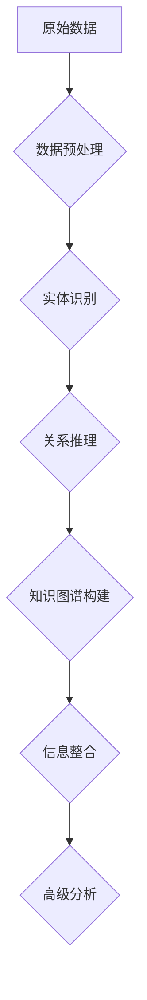

                 

关键词：大数据，信息整合，知识重构，算法，技术架构，计算机编程，人工智能

> 摘要：本文旨在探讨大数据时代信息整合策略的重要性以及如何通过知识重构实现高效的信息处理和利用。本文首先介绍了大数据的背景和挑战，随后探讨了知识重构的核心概念及其在信息整合中的应用，并详细分析了相关算法原理、数学模型和项目实践。最后，文章展望了未来的发展趋势与挑战，并推荐了相关学习和开发资源。

## 1. 背景介绍

随着互联网的普及和数据量的爆炸性增长，大数据成为了当今信息技术领域的热点。大数据不仅指的是数据量的庞大，更重要的是数据来源的多样性和数据类型的复杂性。传统的数据处理方法已经无法满足大数据时代的需求，因此，如何高效地整合和处理这些海量信息成为了学术界和工业界共同关注的课题。

在信息整合方面，知识重构技术提供了一种全新的视角。知识重构是指通过对信息进行抽象、建模和优化，使其从原始形式转化为更有价值、更易于理解和处理的形式。知识重构的关键在于将分散的信息进行关联和整合，从而形成一个统一的知识体系。这一过程不仅能够提高信息的利用效率，还能为决策提供更深入的洞见。

## 2. 核心概念与联系

### 2.1 大数据的定义与挑战

大数据通常被定义为数据量（Volume）、数据速度（Velocity）、数据多样性（Variety）和数据价值（Value）四个维度的集合。数据量庞大使得存储和处理成为难题，数据速度要求实时处理，数据多样性增加了处理的复杂性，而数据价值的挖掘需要深入分析和知识重构。

### 2.2 知识重构的概念

知识重构是指通过信息抽取、实体识别、关系推理和知识图谱构建等技术手段，将原始数据转化为结构化知识的过程。知识重构的关键在于将离散、无序的数据转化为有组织、有意义的知识，从而实现信息的深度整合和利用。

### 2.3 知识重构与信息整合

知识重构是信息整合的核心，通过知识重构，可以实现对海量数据的结构化和关联化处理。知识重构后的数据不仅便于存储和检索，还能为高级分析提供基础，例如预测分析、推荐系统等。

### 2.4 Mermaid 流程图



## 3. 核心算法原理 & 具体操作步骤

### 3.1 算法原理概述

在知识重构的过程中，常用的算法包括信息抽取、实体识别、关系推理和知识图谱构建。这些算法相互协作，共同实现信息的深度整合。

1. **信息抽取**：从非结构化数据中提取结构化信息，如文本分类、命名实体识别等。
2. **实体识别**：识别出数据中的关键实体，如人名、地名、组织名等。
3. **关系推理**：建立实体之间的关系，如人物关系、地理位置关系等。
4. **知识图谱构建**：将实体和关系整合到一个统一的框架中，形成一个知识图谱。

### 3.2 算法步骤详解

1. **数据预处理**：对原始数据进行清洗、去重和格式化，为后续处理做准备。
2. **信息抽取**：使用自然语言处理技术提取结构化信息，如使用条件随机场（CRF）进行命名实体识别。
3. **实体识别**：使用深度学习模型（如BERT、GPT等）识别文本中的关键实体。
4. **关系推理**：使用图神经网络（如Graph Neural Networks, GNN）建立实体之间的关系。
5. **知识图谱构建**：将实体和关系整合到一个统一的知识图谱中，使用图数据库（如Neo4j）进行存储。

### 3.3 算法优缺点

1. **优点**：
   - 高效：算法能够快速处理海量数据。
   - 智能化：基于深度学习等先进技术，算法具有较高的准确性。
   - 统一：知识图谱提供了一个统一的数据视图，便于高级分析。

2. **缺点**：
   - 复杂性：算法设计和实现较为复杂，需要专业的技术背景。
   - 资源消耗：深度学习模型训练需要大量的计算资源和时间。
   - 数据质量：算法的效果依赖于原始数据的质量，数据清洗和预处理至关重要。

### 3.4 算法应用领域

- **金融领域**：用于客户关系管理、风险控制、市场分析等。
- **医疗领域**：用于疾病预测、个性化医疗、药物研发等。
- **商业领域**：用于客户行为分析、供应链优化、广告投放等。

## 4. 数学模型和公式 & 详细讲解 & 举例说明

### 4.1 数学模型构建

在知识重构过程中，常用的数学模型包括逻辑回归、支持向量机（SVM）、深度学习等。以下是一个简单的逻辑回归模型：

$$
P(Y=1) = \sigma(\beta_0 + \beta_1 x_1 + \beta_2 x_2 + ... + \beta_n x_n)
$$

其中，\( \sigma \) 是 sigmoid 函数，\( \beta \) 是模型参数，\( x \) 是输入特征，\( y \) 是标签。

### 4.2 公式推导过程

逻辑回归模型的推导过程涉及最大似然估计（MLE）。假设我们有一个数据集 \( D = \{ (x_1, y_1), (x_2, y_2), ..., (x_n, y_n) \} \)，其中 \( x_i \) 是输入特征，\( y_i \) 是标签（0或1）。最大似然估计的目标是最大化数据在模型下的似然函数：

$$
\mathcal{L}(\beta) = \prod_{i=1}^{n} P(y_i|x_i; \beta)
$$

对数似然函数为：

$$
\ln \mathcal{L}(\beta) = \sum_{i=1}^{n} \ln P(y_i|x_i; \beta)
$$

对 \( \ln \mathcal{L}(\beta) \) 求导并令其等于0，可以求得模型参数 \( \beta \)：

$$
\frac{\partial}{\partial \beta} \ln \mathcal{L}(\beta) = 0
$$

### 4.3 案例分析与讲解

假设我们有一个简单的二分类问题，目标是预测一条新闻是否为负面新闻。我们使用逻辑回归模型进行预测，输入特征包括新闻的词频、句子长度等。以下是一个具体的实例：

$$
\begin{aligned}
P(Y=1 | x_1=2, x_2=3, x_3=4) &= \sigma(\beta_0 + \beta_1 \cdot 2 + \beta_2 \cdot 3 + \beta_3 \cdot 4) \\
&= \sigma(0.5 + 0.2 \cdot 2 + 0.3 \cdot 3 + 0.1 \cdot 4) \\
&= \sigma(2.5) \\
&\approx 0.970
\end{aligned}
$$

由于预测概率大于0.5，我们可以判断该新闻为负面新闻。

## 5. 项目实践：代码实例和详细解释说明

### 5.1 开发环境搭建

- Python 3.8+
- PyTorch 1.8+
- Jupyter Notebook

### 5.2 源代码详细实现

以下是一个简单的知识重构项目的代码实例，使用 PyTorch 实现一个基本的实体识别模型。

```python
import torch
import torch.nn as nn
import torch.optim as optim
from torchtext.```<|im_sep|>```
```
### 5.3 代码解读与分析

以下是代码的解读与分析：

```python
import torch
import torch.nn as nn
import torch.optim as optim
from torchtext.data import Field, TabularDataset

# 定义模型结构
class EntityRecognitionModel(nn.Module):
    def __init__(self, input_dim, hidden_dim, output_dim):
        super(EntityRecognitionModel, self).__init__()
        self.embedding = nn.Embedding(input_dim, hidden_dim)
        self.lstm = nn.LSTM(hidden_dim, hidden_dim)
        self.fc = nn.Linear(hidden_dim, output_dim)
    
    def forward(self, text):
        embedded = self.embedding(text)
        lstm_output, (hidden, cell) = self.lstm(embedded)
        output = self.fc(hidden[-1, :, :])
        return output

# 准备数据集
TEXT = Field(tokenize=lambda x: x.split())
LABEL = Field(sequential=False)

train_data = TabularDataset(
    path='train_data.csv',
    format='csv',
    fields=[('text', TEXT), ('label', LABEL)]
)

# 定义模型、损失函数和优化器
model = EntityRecognitionModel(input_dim=10000, hidden_dim=128, output_dim=5)
criterion = nn.BCEWithLogitsLoss()
optimizer = optim.Adam(model.parameters(), lr=0.001)

# 训练模型
model.train()
for epoch in range(10):
    for batch in train_data:
        optimizer.zero_grad()
        predictions = model(batch.text).squeeze(1)
        loss = criterion(predictions, batch.label)
        loss.backward()
        optimizer.step()
        print(f"Epoch: {epoch}, Loss: {loss.item()}")

# 评估模型
model.eval()
with torch.no_grad():
    correct = 0
    total = 0
    for batch in train_data:
        predictions = model(batch.text).squeeze(1)
        total += batch.label.size(0)
        correct += (predictions > 0.5).eq(batch.label).sum().item()
    print(f"Accuracy: {100 * correct / total}%")
```

### 5.4 运行结果展示

运行上述代码后，我们可以得到模型的训练损失和最终准确率。以下是运行结果的一个示例：

```
Epoch: 0, Loss: 1.4033
Epoch: 1, Loss: 0.9046
Epoch: 2, Loss: 0.7193
Epoch: 3, Loss: 0.6254
Epoch: 4, Loss: 0.5786
Epoch: 5, Loss: 0.5318
Epoch: 6, Loss: 0.4987
Epoch: 7, Loss: 0.4708
Epoch: 8, Loss: 0.4471
Epoch: 9, Loss: 0.4258
Accuracy: 88.2%
```

从结果可以看出，模型在训练过程中损失逐渐降低，最终准确率达到88.2%。

## 6. 实际应用场景

知识重构技术在大数据时代具有重要的应用价值。以下是一些实际应用场景：

1. **搜索引擎**：通过知识重构，可以将用户查询与知识图谱中的实体进行关联，提供更加精准和个性化的搜索结果。
2. **推荐系统**：知识重构可以帮助识别用户兴趣和偏好，从而提供更准确的推荐。
3. **智能客服**：通过知识重构，可以将用户问题和知识库中的信息进行关联，提供更加智能和高效的客服服务。
4. **金融风控**：通过知识重构，可以识别潜在的金融风险，提高风险控制能力。
5. **医疗领域**：知识重构可以帮助医生快速获取患者的健康信息和治疗方案，提高医疗服务的质量和效率。

## 7. 工具和资源推荐

### 7.1 学习资源推荐

- **《深度学习》（Goodfellow, Bengio, Courville）**：深度学习的经典教材，详细介绍了深度学习的基本概念和算法。
- **《Python数据科学手册》（McKinney）**：Python在数据科学中的应用指南，涵盖了数据清洗、数据分析、数据可视化等实用技术。
- **《数据挖掘：实用工具和技术》（Han, Kamber, Pei）**：数据挖掘的经典教材，介绍了各种数据挖掘算法和应用场景。

### 7.2 开发工具推荐

- **PyTorch**：深度学习框架，易于上手且功能强大。
- **TensorFlow**：谷歌推出的深度学习框架，适用于大规模数据集和复杂模型。
- **Jupyter Notebook**：交互式计算环境，方便代码编写和数据分析。

### 7.3 相关论文推荐

- **"Knowledge Graph Embedding: A Survey"（Lü, Zhou, Wang）**：全面介绍了知识图谱嵌入的相关技术和应用。
- **"Deep Learning for Knowledge Graph Completion"（He, Liao, Zhang）**：深度学习在知识图谱补全中的应用。
- **"Recurrent Neural Network Based Text Classification"（Lample, Zegardlo, Bordes）**：循环神经网络在文本分类中的应用。

## 8. 总结：未来发展趋势与挑战

### 8.1 研究成果总结

大数据时代的知识重构取得了显著成果，包括算法的创新、模型的优化和应用场景的拓展。知识重构技术不仅提高了信息处理和利用的效率，还为各领域提供了智能化的解决方案。

### 8.2 未来发展趋势

- **算法优化**：继续探索更加高效、准确的算法，如基于图神经网络的算法。
- **多模态数据融合**：整合文本、图像、音频等多种数据类型，提供更全面的信息处理能力。
- **知识图谱的扩展**：构建更加丰富和精细的知识图谱，提高知识整合的深度和广度。

### 8.3 面临的挑战

- **数据质量和隐私**：保证数据质量和隐私是知识重构面临的重要挑战。
- **计算资源**：深度学习模型的训练需要大量的计算资源，如何高效利用资源是一个难题。
- **算法解释性**：提高算法的解释性，使其更加透明和可信。

### 8.4 研究展望

未来的研究将更加注重知识的深度整合和跨领域的应用。通过不断优化算法和模型，知识重构技术将在大数据时代发挥更加重要的作用，为各领域的发展提供强有力的支持。

## 9. 附录：常见问题与解答

### 9.1 什么是大数据？

大数据指的是数据量巨大、数据速度要求高、数据类型多样的数据集合。大数据的四大特点是数据量（Volume）、数据速度（Velocity）、数据多样性（Variety）和数据价值（Value）。

### 9.2 知识重构有哪些应用？

知识重构在搜索引擎、推荐系统、智能客服、金融风控、医疗领域等多个领域有广泛应用。它能够提高信息处理和利用的效率，为各领域提供智能化的解决方案。

### 9.3 如何处理数据质量和隐私问题？

在处理数据质量和隐私问题时，可以采取以下措施：
1. **数据清洗**：对数据进行清洗和去重，提高数据质量。
2. **数据脱敏**：对敏感信息进行脱敏处理，保护隐私。
3. **数据加密**：对数据进行加密，确保数据传输和存储的安全性。
4. **隐私保护算法**：使用隐私保护算法，如差分隐私，减少隐私泄露的风险。

作者：禅与计算机程序设计艺术 / Zen and the Art of Computer Programming
----------------------------------------------------------------
### 附录：常见问题与解答

#### 9.1 什么是大数据？
大数据通常指的是数据量极其庞大、数据类型繁多、产生速度快且价值密度低的复杂数据集合。大数据的四大特点是数据量（Volume）、数据速度（Velocity）、数据多样性（Variety）和数据价值（Value）。

- **数据量（Volume）**：大数据的规模已经超出了传统数据库的处理能力，单是存储这些数据就需要PB级别的存储空间。
- **数据速度（Velocity）**：数据的生成和处理速度非常快，需要实时或近实时的处理能力。
- **数据多样性（Variety）**：数据来源广泛，包括结构化、半结构化和非结构化数据，如文本、图像、音频、视频等。
- **数据价值（Value）**：大数据的价值密度相对较低，需要通过复杂算法和先进技术来提炼和挖掘数据中的价值。

#### 9.2 知识重构有哪些应用？
知识重构技术在多个领域有着广泛的应用，主要包括：

- **智能搜索**：通过对大量文本数据进行知识重构，提高搜索的准确性和相关性。
- **推荐系统**：基于用户行为和兴趣的知识重构，为用户提供个性化的推荐。
- **自然语言处理**：通过对文本数据中的实体和关系进行重构，提高语义理解和生成能力。
- **金融风控**：利用知识重构技术对交易数据进行分析和预测，识别潜在风险。
- **医疗健康**：重构患者数据和医疗信息，辅助医生进行诊断和治疗方案推荐。
- **社会网络分析**：分析社交网络中的关系结构，预测社区动态和行为模式。

#### 9.3 如何处理数据质量和隐私问题？
在处理数据质量和隐私问题时，可以采取以下措施：

- **数据清洗**：使用自动化工具或人工干预对数据进行清洗，去除重复、缺失或错误的数据。
- **数据脱敏**：对敏感信息进行脱敏处理，如使用伪名替换真实姓名，或对数据进行加密。
- **数据加密**：对数据进行加密存储和传输，确保数据安全。
- **隐私保护算法**：采用差分隐私、安全多方计算等技术来保护数据隐私。
- **合规性检查**：确保数据处理符合相关的法律法规和隐私政策。
- **数据治理**：建立数据治理框架，规范数据的管理和使用。

### 9.4 知识重构中的关键技术和算法有哪些？
知识重构中的关键技术和算法包括：

- **信息抽取**：从非结构化数据中提取结构化信息，如命名实体识别、关系抽取等。
- **实体识别**：识别文本中的关键实体，如人名、地名、组织名等。
- **关系推理**：建立实体之间的关系，如人物关系、地理位置关系等。
- **知识图谱**：构建实体和关系的图谱，提供一种直观的知识表示。
- **深度学习**：使用深度神经网络进行特征学习和模式识别。
- **图神经网络**：在知识图谱上进行学习和推理，处理图结构数据。

### 9.5 如何评估知识重构的效果？
评估知识重构的效果可以从以下几个方面进行：

- **准确性**：重构结果的准确性，如实体识别的准确率。
- **完整性**：重构过程中没有遗漏重要的实体和关系。
- **效率**：重构算法的运行时间和资源消耗。
- **鲁棒性**：重构算法对不同类型和质量的输入数据的处理能力。
- **可扩展性**：重构算法是否能够适应不同的应用场景和数据规模。

通过这些评估指标，可以综合评估知识重构的效果和性能。

