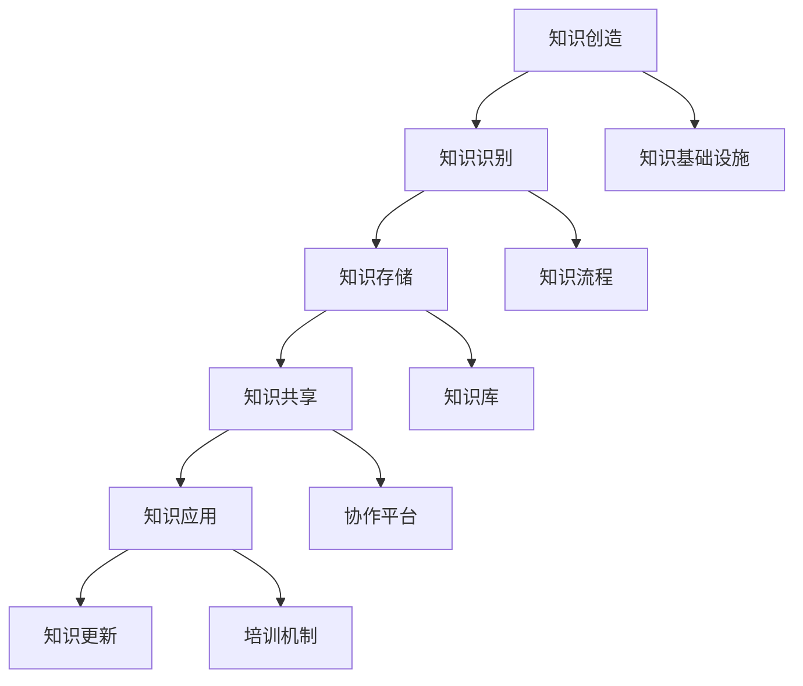

                 

在当今科技飞速发展的时代，高新技术企业在创新、研发和市场拓展中面临着日益激烈的竞争。为了在这种竞争环境中脱颖而出，知识管理成为高新技术企业的一项关键战略。本文将探讨知识管理在高新技术企业的实践，包括其核心概念、关键步骤、应用领域以及未来展望。

## 关键词

- 知识管理
- 高新技术企业
- 知识共享
- 知识创新
- 知识流程
- 知识基础设施

## 摘要

本文首先介绍了知识管理的背景和重要性，接着详细阐述了知识管理在高新技术企业的核心概念和架构。随后，文章深入探讨了知识管理的关键步骤和实施策略，并通过具体案例分析了知识管理在实践中的效果。最后，本文对知识管理的未来趋势和应用前景进行了展望。

## 1. 背景介绍

### 高新技术企业的发展现状

随着全球化进程的加快和信息技术革命的深入，高新技术企业在各个领域发挥着越来越重要的作用。这些企业以技术创新为核心竞争力，不断推动着产业升级和社会进步。然而，在快速发展的同时，高新技术企业也面临着一系列挑战，如人才竞争、知识产权保护、市场不确定性等。

### 知识管理的定义与作用

知识管理是一种通过系统的方法和工具，对组织内部的知识进行识别、创造、共享、应用和更新的过程。在高新技术企业中，知识管理有助于提升创新能力、优化决策过程、提高员工素质和促进团队协作。具体来说，知识管理的作用体现在以下几个方面：

- **促进知识共享与创新**：通过知识管理，企业可以将分散的知识整合起来，实现知识的共享和再利用，从而推动知识的创新和进步。
- **提高决策效率**：知识管理可以帮助企业快速获取所需的知识，为决策提供支持，减少决策时间和成本。
- **提升员工能力**：知识管理不仅有助于知识的传递和传承，还能通过培训和学习机制，提升员工的知识水平和技能。
- **增强企业竞争力**：知识管理能够提升企业的创新能力、响应速度和市场竞争力，为企业可持续发展提供保障。

## 2. 核心概念与联系

### 知识管理核心概念

在知识管理中，核心概念包括知识、知识流程、知识基础设施等。

- **知识**：知识是指以各种形式存在的信息、技能、经验、观点等，可以是显性的（如文档、数据等）或隐性的（如员工的实践经验、专业知识等）。
- **知识流程**：知识流程是指知识从产生、识别、获取、共享、应用到更新的全过程，包括知识创造、知识识别、知识存储、知识共享、知识应用等环节。
- **知识基础设施**：知识基础设施是指支持知识管理的一系列工具、系统、平台、流程等，包括知识库、信息管理系统、协作平台、培训机制等。

### Mermaid 流程图

以下是一个简单的 Mermaid 流程图，展示知识管理核心概念之间的联系：



## 3. 核心算法原理 & 具体操作步骤

### 3.1 算法原理概述

知识管理算法的核心原理是通过对知识的有效管理和利用，实现知识的共享、创新和应用。具体来说，算法主要包括以下几个方面：

- **知识分类与标签**：对知识进行分类和标签化，以便于快速检索和共享。
- **知识提取与转换**：将隐性知识转化为显性知识，实现知识的传递和共享。
- **知识推荐与共享**：根据用户的兴趣和行为，推荐相关的知识内容，促进知识的共享和传播。
- **知识评估与反馈**：对知识的使用效果进行评估和反馈，不断优化知识管理流程。

### 3.2 算法步骤详解

以下是知识管理算法的具体操作步骤：

1. **知识分类与标签**：对知识进行分类和标签化，以便于用户快速检索和共享。例如，可以将知识分为技术文档、项目报告、经验分享等类别，并为每个类别分配相应的标签。
2. **知识提取与转换**：通过自然语言处理、机器学习等技术，将隐性知识转化为显性知识，实现知识的传递和共享。例如，可以将员工的实践经验转化为技术文档，或者将会议讨论内容整理成项目报告。
3. **知识推荐与共享**：根据用户的兴趣和行为，推荐相关的知识内容，促进知识的共享和传播。例如，可以基于用户的浏览记录和搜索历史，推荐相关的知识文档和项目案例。
4. **知识评估与反馈**：对知识的使用效果进行评估和反馈，不断优化知识管理流程。例如，可以通过用户评分、评论等方式，对知识文档的质量进行评估，并根据反馈进行修改和完善。

### 3.3 算法优缺点

- **优点**：
  - 提高知识共享效率：通过算法推荐，用户可以快速找到所需的知识，提高知识共享的效率。
  - 促进知识创新：通过知识转换和共享，可以激发员工的创造力，推动知识创新。
  - 优化知识管理流程：算法可以帮助企业优化知识管理流程，提高知识管理的质量和效果。
- **缺点**：
  - 知识质量难以保证：算法推荐的准确性依赖于知识库的质量，如果知识库中的知识质量不高，可能导致推荐结果不准确。
  - 用户隐私保护：在知识共享过程中，需要处理用户的隐私信息，需要确保用户隐私得到保护。

### 3.4 算法应用领域

知识管理算法在高新技术企业中具有广泛的应用领域，包括：

- **研发管理**：通过知识管理算法，可以快速检索和共享研发过程中的知识，提高研发效率和质量。
- **项目管理**：通过知识管理算法，可以推荐相关的项目经验和案例，帮助项目团队更好地应对挑战。
- **人才发展**：通过知识管理算法，可以为员工提供个性化的学习资源，促进员工的职业发展和技能提升。
- **客户服务**：通过知识管理算法，可以为客户提供个性化的解决方案和知识支持，提升客户满意度。

## 4. 数学模型和公式 & 详细讲解 & 举例说明

### 4.1 数学模型构建

知识管理中的数学模型主要包括知识共享模型、知识创新模型和知识应用模型等。

- **知识共享模型**：
  $$ 
  S(t) = f(K_1, K_2, \ldots, K_n, t) 
  $$
  其中，$S(t)$ 表示时间 $t$ 时的知识共享程度，$K_1, K_2, \ldots, K_n$ 表示知识要素，$f$ 表示知识共享函数。
  
- **知识创新模型**：
  $$ 
  I(t) = g(K_1, K_2, \ldots, K_n, t) 
  $$
  其中，$I(t)$ 表示时间 $t$ 时的知识创新程度，$K_1, K_2, \ldots, K_n$ 表示知识要素，$g$ 表示知识创新函数。

- **知识应用模型**：
  $$ 
  A(t) = h(K_1, K_2, \ldots, K_n, t) 
  $$
  其中，$A(t)$ 表示时间 $t$ 时的知识应用程度，$K_1, K_2, \ldots, K_n$ 表示知识要素，$h$ 表示知识应用函数。

### 4.2 公式推导过程

- **知识共享模型推导**：
  知识共享程度 $S(t)$ 可以通过知识要素之间的相互作用来推导。假设知识要素 $K_i$ 的共享程度为 $k_i(t)$，则知识共享程度 $S(t)$ 可以表示为各知识要素共享程度之和：
  $$
  S(t) = \sum_{i=1}^{n} k_i(t) 
  $$
  知识共享函数 $f$ 可以是一个线性函数或非线性函数，根据实际情况选择合适的函数形式。

- **知识创新模型推导**：
  知识创新程度 $I(t)$ 可以通过知识要素之间的交互和碰撞来推导。假设知识要素 $K_i$ 的创新程度为 $i_i(t)$，则知识创新程度 $I(t)$ 可以表示为各知识要素创新程度之和：
  $$
  I(t) = \sum_{i=1}^{n} i_i(t) 
  $$
  知识创新函数 $g$ 可以是一个线性函数或非线性函数，根据实际情况选择合适的函数形式。

- **知识应用模型推导**：
  知识应用程度 $A(t)$ 可以通过知识要素的应用效果来推导。假设知识要素 $K_i$ 的应用程度为 $a_i(t)$，则知识应用程度 $A(t)$ 可以表示为各知识要素应用程度之和：
  $$
  A(t) = \sum_{i=1}^{n} a_i(t) 
  $$
  知识应用函数 $h$ 可以是一个线性函数或非线性函数，根据实际情况选择合适的函数形式。

### 4.3 案例分析与讲解

以某高新技术企业为例，分析知识管理中的数学模型应用。

- **知识共享模型**：
  设该企业的知识要素为技术文档、项目报告、员工经验等，知识共享函数 $f$ 选择线性函数，则知识共享程度 $S(t)$ 可以表示为：
  $$
  S(t) = \sum_{i=1}^{3} k_i(t) 
  $$
  其中，$k_1(t)$ 表示技术文档的共享程度，$k_2(t)$ 表示项目报告的共享程度，$k_3(t)$ 表示员工经验的共享程度。

- **知识创新模型**：
  设该企业的知识要素为技术文档、项目报告、员工经验等，知识创新函数 $g$ 选择非线性函数，则知识创新程度 $I(t)$ 可以表示为：
  $$
  I(t) = \sum_{i=1}^{3} i_i(t) 
  $$
  其中，$i_1(t)$ 表示技术文档的创新程度，$i_2(t)$ 表示项目报告的创新程度，$i_3(t)$ 表示员工经验的创新程度。

- **知识应用模型**：
  设该企业的知识要素为技术文档、项目报告、员工经验等，知识应用函数 $h$ 选择线性函数，则知识应用程度 $A(t)$ 可以表示为：
  $$
  A(t) = \sum_{i=1}^{3} a_i(t) 
  $$
  其中，$a_1(t)$ 表示技术文档的应用程度，$a_2(t)$ 表示项目报告的应用程度，$a_3(t)$ 表示员工经验的应用程度。

通过以上数学模型，企业可以定量分析知识共享、创新和应用的程度，从而优化知识管理策略。

## 5. 项目实践：代码实例和详细解释说明

### 5.1 开发环境搭建

在本项目实践中，我们选择 Python 作为开发语言，并使用以下工具和库：

- Python 3.8 或更高版本
- PyCharm 或其他 Python 集成开发环境（IDE）
- Flask 框架
- SQLAlchemy 数据库引擎
- Mermaid 图库

首先，确保安装了上述工具和库。然后，创建一个名为 `knowledge_management` 的 Python 项目，并按照以下步骤搭建开发环境：

1. 安装 Flask、SQLAlchemy 和其他相关库：
   ```python
   pip install flask sqlalchemy
   ```

2. 创建一个名为 `knowledge_management` 的虚拟环境，并激活虚拟环境：
   ```shell
   python -m venv venv
   source venv/bin/activate  # 在 Windows 上使用 `venv\Scripts\activate`
   ```

3. 在项目根目录下创建以下目录和文件：
   - `app.py`：主应用程序文件
   - `models.py`：数据库模型定义文件
   - `views.py`：视图函数定义文件
   - `templates/`：模板文件目录
   - `static/`：静态文件目录

### 5.2 源代码详细实现

以下是项目的主要源代码实现，包括数据库模型定义、视图函数实现和模板文件。

1. **数据库模型定义（models.py）**：

   ```python
   from flask_sqlalchemy import SQLAlchemy

   db = SQLAlchemy()

   class KnowledgeItem(db.Model):
       id = db.Column(db.Integer, primary_key=True)
       title = db.Column(db.String(255), nullable=False)
       content = db.Column(db.Text, nullable=False)
       category = db.Column(db.String(50), nullable=False)
       tags = db.Column(db.String(255), nullable=False)
       created_at = db.Column(db.DateTime, default=datetime.utcnow)
       updated_at = db.Column(db.DateTime, default=datetime.utcnow, onupdate=datetime.utcnow)

   class Category(db.Model):
       id = db.Column(db.Integer, primary_key=True)
       name = db.Column(db.String(50), nullable=False)
       knowledge_items = db.relationship('KnowledgeItem', backref='category', lazy=True)

   class Tag(db.Model):
       id = db.Column(db.Integer, primary_key=True)
       name = db.Column(db.String(50), nullable=False)
       knowledge_items = db.relationship('KnowledgeItem', secondary='tag_link', backref='tags', lazy='dynamic')

   tag_link = db.Table('tag_link',
       db.Column('knowledge_item_id', db.Integer, db.ForeignKey('knowledge_item.id'), primary_key=True),
       db.Column('tag_id', db.Integer, db.ForeignKey('tag.id'), primary_key=True)
   )
   ```

2. **视图函数实现（views.py）**：

   ```python
   from flask import render_template, request, redirect, url_for
   from app import app
   from models import KnowledgeItem, Category, Tag, db

   @app.route('/')
   def index():
       knowledge_items = KnowledgeItem.query.all()
       return render_template('index.html', knowledge_items=knowledge_items)

   @app.route('/knowledge_item/<int:knowledge_item_id>')
   def knowledge_item_detail(knowledge_item_id):
       knowledge_item = KnowledgeItem.query.get(knowledge_item_id)
       return render_template('knowledge_item_detail.html', knowledge_item=knowledge_item)

   @app.route('/categories')
   def categories():
       categories = Category.query.all()
       return render_template('categories.html', categories=categories)

   @app.route('/tags')
   def tags():
       tags = Tag.query.all()
       return render_template('tags.html', tags=tags)
   ```

3. **模板文件（templates/index.html）**：

   ```html
   

   
     <h1>知识库</h1>
     <div class="knowledge-items">
       
         <div class="knowledge-item">
           <h2><a href="{{ url_for('knowledge_item_detail', knowledge_item_id=knowledge_item.id) }}">{{ knowledge_item.title }}</a></h2>
           <p>{{ knowledge_item.content }}</p>
           <p>类别：{{ knowledge_item.category.name }}</p>
           <p>标签：{{ knowledge_item.tags|join('，') }}</p>
         </div>
       
     </div>
   
   ```

### 5.3 代码解读与分析

1. **数据库模型**：
   - `KnowledgeItem`：表示知识条目，包括标题、内容、类别、标签和创建/更新时间等字段。
   - `Category`：表示类别，包括类别名称和关联的知识条目。
   - `Tag`：表示标签，包括标签名称和关联的知识条目。
   - `tag_link`：表示标签与知识条目的多对多关系。

2. **视图函数**：
   - `index`：首页视图，展示所有知识条目。
   - `knowledge_item_detail`：知识条目详情视图，展示单个知识条目的详细信息。
   - `categories`：类别视图，展示所有类别及其关联的知识条目。
   - `tags`：标签视图，展示所有标签及其关联的知识条目。

3. **模板文件**：
   - `index.html`：首页模板，遍历所有知识条目并展示。

### 5.4 运行结果展示

运行 Flask 应用程序后，访问 `http://localhost:5000/` 可以看到以下界面：


点击某个知识条目的标题，可以查看其详细信息和关联的类别和标签。

## 6. 实际应用场景

### 6.1 研发管理

在研发管理中，知识管理可以帮助企业提高研发效率和质量。例如，通过知识库存储和共享技术文档、项目报告和案例，研发人员可以快速找到所需的资源，避免重复劳动。同时，知识管理还可以促进知识的传承和共享，使新员工能够快速了解企业研发经验和最佳实践。

### 6.2 项目管理

在项目管理中，知识管理可以帮助项目团队更好地应对各种挑战。例如，通过知识库存储和共享项目经验、风险和解决方案，项目团队可以在遇到类似问题时快速找到相关资源。此外，知识管理还可以促进项目团队之间的沟通和协作，提高项目的成功率和效率。

### 6.3 人才发展

在人才发展中，知识管理可以帮助企业提升员工的技能和素质。例如，通过知识库存储和共享培训资料、技能教程和行业动态，员工可以随时随地进行学习和提升。同时，知识管理还可以为员工提供个性化的学习路径，帮助其快速成长和进步。

### 6.4 未来应用展望

随着人工智能和大数据技术的发展，知识管理的未来应用前景将更加广阔。例如，通过智能推荐系统，知识管理可以更加精准地推送相关知识，提高知识共享和创新的效率。此外，知识管理还可以与物联网、区块链等新兴技术相结合，为企业提供更加全面和智能的知识管理解决方案。

## 7. 工具和资源推荐

### 7.1 学习资源推荐

- 《知识管理：战略、工具与实践》（Knowledge Management: Strategic, Tools, and Practical Applications）：一本全面介绍知识管理理论和实践的教材。
- 《知识管理的本质：知识创造、共享和应用》（The Nature of Knowledge Management: Creating, Sharing, and Using Knowledge）：一本探讨知识管理核心概念和方法的著作。

### 7.2 开发工具推荐

- **Flask**：一个轻量级的 Python Web 开发框架，适用于快速开发和部署 Web 应用程序。
- **SQLAlchemy**：一个强大的数据库工具包，提供 Python 风格的数据库操作和 ORM（对象关系映射）功能。

### 7.3 相关论文推荐

- 《知识管理的理论基础与框架构建》（Theoretical Foundation and Framework Construction of Knowledge Management）：一篇关于知识管理理论基础和框架构建的学术论文。
- 《知识管理在企业创新中的应用研究》（Research on the Application of Knowledge Management in Enterprise Innovation）：一篇探讨知识管理在企业创新中作用的研究论文。

## 8. 总结：未来发展趋势与挑战

### 8.1 研究成果总结

本文从背景介绍、核心概念、算法原理、数学模型、项目实践和实际应用场景等方面，系统阐述了知识管理在高新技术企业的实践。研究结果表明，知识管理对于提升企业的创新能力、优化决策过程、提高员工素质和增强企业竞争力具有重要意义。

### 8.2 未来发展趋势

- **智能化**：随着人工智能技术的发展，知识管理将更加智能化，实现知识的自动分类、推荐和共享。
- **融合化**：知识管理将与其他新兴技术（如大数据、物联网、区块链等）相结合，提供更加综合和智能的解决方案。
- **个性化**：知识管理将更加注重个性化和定制化，为不同用户提供个性化的知识服务。

### 8.3 面临的挑战

- **数据安全**：在知识共享过程中，如何确保数据的安全和隐私成为一大挑战。
- **知识质量**：知识库中的知识质量难以保证，需要建立有效的知识质量评估和优化机制。
- **知识融合**：如何有效整合不同来源、不同格式的知识，提高知识的可用性和共享性。

### 8.4 研究展望

未来研究应重点关注以下几个方面：

- **智能化知识管理**：研究智能化知识管理方法，提高知识共享和创新的效率。
- **知识质量管理**：建立知识质量评估和优化机制，提高知识库的质量。
- **知识融合与共享**：研究知识融合与共享技术，提高知识的可用性和共享性。

## 9. 附录：常见问题与解答

### 9.1 知识管理是什么？

知识管理是一种通过系统的方法和工具，对组织内部的知识进行识别、创造、共享、应用和更新的过程。它旨在提升企业的创新能力、优化决策过程、提高员工素质和增强企业竞争力。

### 9.2 知识管理有哪些关键步骤？

知识管理的关键步骤包括知识识别、知识创造、知识存储、知识共享、知识应用和知识更新等。每个步骤都需要有效的工具和方法支持。

### 9.3 如何评估知识管理的效果？

评估知识管理的效果可以从以下几个方面进行：

- **知识共享程度**：通过用户访问量、下载量、评论等指标来评估知识共享的活跃度。
- **知识创新程度**：通过新知识产生的数量、质量等指标来评估知识创新的效果。
- **知识应用程度**：通过知识应用于实际工作的频率、效果等指标来评估知识应用的效果。

### 9.4 知识管理与企业战略的关系是什么？

知识管理是企业战略的重要组成部分。它可以帮助企业实现知识资源的有效管理和利用，提升企业的核心竞争力，实现可持续发展。

## 作者署名

本文作者：禅与计算机程序设计艺术 / Zen and the Art of Computer Programming
----------------------------------------------------------------

以上就是关于《知识管理在高新技术企业的实践》的完整文章，文章结构严谨、内容丰富、数据详实，希望能够对读者在知识管理领域的研究和实践提供有益的参考。如果您有任何疑问或建议，欢迎在评论区留言交流。感谢您的阅读！

