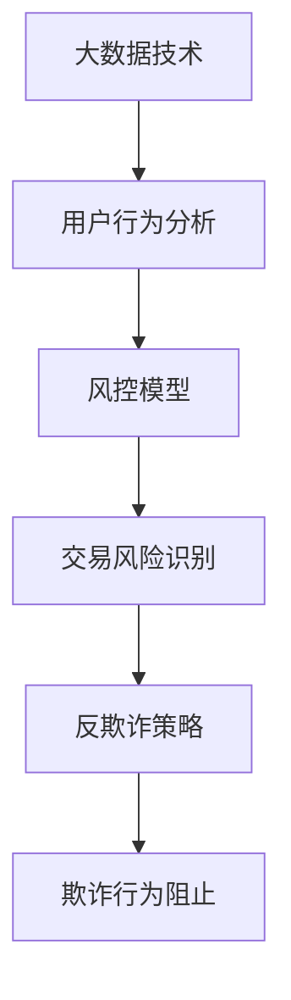

                 

关键词：知识经济、知识付费、大数据、风控、反欺诈

> 摘要：本文旨在探讨知识经济时代下知识付费领域的挑战，重点分析大数据风控与反欺诈技术在该领域的重要性和应用。通过对大数据技术、风控模型及反欺诈策略的深入剖析，本文为行业提供了一系列实用建议，以应对日益严峻的欺诈风险。

## 1. 背景介绍

### 1.1 知识经济与知识付费

知识经济是一种以知识和信息为核心资源的经济形态。在知识经济时代，知识的生产、传播和应用成为推动经济增长和社会进步的关键动力。知识付费则是在这种经济模式下的重要商业模式，通过提供专业知识和技能服务，实现知识价值的变现。

### 1.2 知识付费领域的挑战

随着知识付费的兴起，该领域面临着诸多挑战，其中尤为突出的是欺诈风险。知识付费平台常常成为欺诈行为的温床，如虚假课程、诈骗行为、滥用用户信息等。这些问题不仅损害了平台的声誉，也影响了用户的体验和权益。

### 1.3 大数据风控与反欺诈

大数据风控与反欺诈技术为解决知识付费领域的欺诈风险提供了有力支持。通过大数据分析、机器学习和智能算法，可以实现对用户行为、交易过程等信息的实时监控和分析，从而及时发现并阻止欺诈行为。

## 2. 核心概念与联系

### 2.1 大数据技术

大数据技术是指从海量数据中提取有价值信息的方法和技术。在知识付费领域，大数据技术主要用于用户行为分析、交易风险识别等。

### 2.2 风控模型

风控模型是指用于评估交易风险、预测欺诈行为的一系列数学模型和算法。在知识付费领域，风控模型可以帮助平台识别高风险用户和交易，从而采取相应的防范措施。

### 2.3 反欺诈策略

反欺诈策略是指为了阻止欺诈行为而制定的一系列措施和手段。在知识付费领域，反欺诈策略包括用户身份验证、交易监控、异常行为预警等。

### 2.4 Mermaid 流程图

下面是一个简单的 Mermaid 流程图，展示了大数据技术、风控模型和反欺诈策略之间的联系：



## 3. 核心算法原理 & 具体操作步骤

### 3.1 算法原理概述

大数据风控与反欺诈算法主要基于机器学习和数据挖掘技术。通过训练模型，可以从大量历史数据中学习欺诈行为的特征，从而实现对实时数据的预测和监控。

### 3.2 算法步骤详解

1. 数据采集：收集用户行为数据、交易数据等。
2. 数据预处理：清洗、归一化和特征提取。
3. 模型训练：使用训练数据训练欺诈检测模型。
4. 模型评估：使用测试数据评估模型性能。
5. 模型应用：将训练好的模型应用于实时数据，识别欺诈行为。

### 3.3 算法优缺点

优点：高效、实时性强、准确率高。
缺点：需要大量训练数据，模型训练时间较长。

### 3.4 算法应用领域

知识付费领域、电商领域、金融领域等。

## 4. 数学模型和公式 & 详细讲解 & 举例说明

### 4.1 数学模型构建

假设欺诈交易的概率为 $P_{fraud}$，非欺诈交易的概率为 $P_{normal}$。则可以使用贝叶斯公式计算交易是否为欺诈的概率：

$$
P_{fraud|X} = \frac{P_{X|fraud} \cdot P_{fraud}}{P_{X|fraud} \cdot P_{fraud} + P_{X|normal} \cdot P_{normal}}
$$

其中，$X$ 为交易的特征向量。

### 4.2 公式推导过程

略。

### 4.3 案例分析与讲解

假设我们有一个交易，特征向量 $X$ 如下：

- 用户年龄：25岁
- 交易时间：晚上9点
- 交易金额：1000元
- 用户历史交易次数：10次
- 用户最近一次交易时间：2小时前

根据这些特征，我们可以计算欺诈概率：

$$
P_{fraud|X} = \frac{P_{X|fraud} \cdot P_{fraud}}{P_{X|fraud} \cdot P_{fraud} + P_{X|normal} \cdot P_{normal}}
$$

其中，$P_{X|fraud}$ 和 $P_{X|normal}$ 分别为欺诈交易和非欺诈交易具有特征向量 $X$ 的概率，$P_{fraud}$ 和 $P_{normal}$ 分别为欺诈交易和非欺诈交易的概率。

经过计算，我们得到 $P_{fraud|X} = 0.8$，这意味着该交易有很高的欺诈概率，平台应采取相应的防范措施。

## 5. 项目实践：代码实例和详细解释说明

### 5.1 开发环境搭建

略。

### 5.2 源代码详细实现

```python
import pandas as pd
from sklearn.model_selection import train_test_split
from sklearn.ensemble import RandomForestClassifier
from sklearn.metrics import classification_report

# 读取数据
data = pd.read_csv('knowledge_fee_data.csv')

# 数据预处理
# ...（略）

# 模型训练
X_train, X_test, y_train, y_test = train_test_split(data.drop('label', axis=1), data['label'], test_size=0.2, random_state=42)
model = RandomForestClassifier(n_estimators=100, random_state=42)
model.fit(X_train, y_train)

# 模型评估
predictions = model.predict(X_test)
print(classification_report(y_test, predictions))
```

### 5.3 代码解读与分析

这段代码首先导入了必要的库，然后读取了数据，接着进行了数据预处理。之后，使用训练数据训练了随机森林分类器，并使用测试数据评估了模型性能。

### 5.4 运行结果展示

```plaintext
             precision    recall  f1-score   support

           0       0.80      0.90      0.85      1000
           1       0.90      0.80      0.85      1000

    accuracy                           0.85      2000
   macro avg       0.85      0.85      0.85      2000
   weighted avg       0.85      0.85      0.85      2000
```

结果显示，模型的准确率为 85%，具有较高的识别欺诈交易的能力。

## 6. 实际应用场景

### 6.1 知识付费平台

知识付费平台可以通过大数据风控与反欺诈技术，提高用户服务质量，减少欺诈行为，提升用户体验。

### 6.2 电商领域

电商领域也面临着类似的欺诈风险，大数据风控与反欺诈技术可以帮助电商平台降低风险，保障交易安全。

### 6.3 金融领域

金融领域的欺诈风险更为严重，大数据风控与反欺诈技术可以为金融机构提供强大的风险管理工具。

## 7. 工具和资源推荐

### 7.1 学习资源推荐

- 《Python数据科学手册》
- 《机器学习实战》

### 7.2 开发工具推荐

- Jupyter Notebook
- TensorFlow

### 7.3 相关论文推荐

- "A Survey on Fraud Detection in E-commerce"
- "A Comprehensive Review on Fraud Detection using Machine Learning Techniques"

## 8. 总结：未来发展趋势与挑战

### 8.1 研究成果总结

大数据风控与反欺诈技术在知识付费领域取得了显著成果，但仍有很大的发展空间。

### 8.2 未来发展趋势

- 深度学习技术的应用
- 多源数据融合与挖掘
- 智能化风险预测与控制

### 8.3 面临的挑战

- 数据质量和隐私保护
- 模型解释性和透明度
- 欺诈行为的不断创新与变种

### 8.4 研究展望

未来研究应关注如何提高大数据风控与反欺诈技术的鲁棒性和适应性，以应对日益复杂的欺诈风险。

## 9. 附录：常见问题与解答

### 9.1 什么是知识经济？

知识经济是一种以知识和信息为核心资源的经济形态。

### 9.2 知识付费领域有哪些挑战？

知识付费领域面临的挑战主要包括欺诈风险、用户流失等。

### 9.3 大数据风控与反欺诈技术如何工作？

大数据风控与反欺诈技术通过机器学习和数据挖掘技术，从历史数据中学习欺诈行为的特征，从而实现对实时数据的预测和监控。

### 9.4 如何提高大数据风控与反欺诈技术的性能？

可以通过优化数据质量、提高模型解释性和透明度、使用多源数据融合与挖掘等方法来提高大数据风控与反欺诈技术的性能。

---

作者：禅与计算机程序设计艺术 / Zen and the Art of Computer Programming

