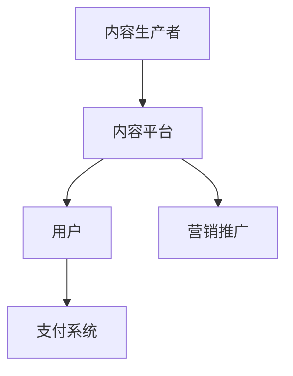

                 

 **关键词**：知识经济，知识付费，创新商业模式，运营策略，数字化营销

**摘要**：本文深入探讨了知识经济时代下知识付费行业的创新商业模式及其运营策略。通过对当前市场环境、用户需求分析、商业模式设计、数字化营销手段等方面的详细阐述，本文旨在为知识付费行业从业者提供一套行之有效的运营思路，以应对未来市场的挑战和机遇。

## 1. 背景介绍

随着互联网技术的飞速发展和全球信息化的加速，知识经济逐渐成为推动经济发展的新引擎。知识付费作为知识经济的重要组成部分，正以前所未有的速度崛起。用户对于高质量、个性化知识的渴求日益增长，推动了知识付费市场的繁荣。然而，在市场不断扩张的同时，也面临着诸多挑战，如内容同质化、用户留存率低等。

知识付费行业本质上是一种基于互联网的平台服务，通过将知识内容产品化，满足用户对于专业知识的消费需求。其商业模式涵盖了内容生产、平台运营、用户服务等多个环节，涉及的知识形态包括在线课程、电子书、专业咨询、付费问答等。

### 1.1 市场环境分析

知识付费市场呈现出几个显著的特征：

1. **市场规模持续扩大**：根据市场研究数据显示，全球知识付费市场正处于高速增长期，预计未来几年将保持两位数的年增长率。
2. **用户年龄分布广泛**：知识付费用户不仅限于专业人士，还涵盖了学生、职场新人、中老年用户等多个群体。
3. **内容形式多样化**：除了传统的文字、图片、视频等形式，知识付费内容开始向音频、直播、互动体验等多媒体形态发展。
4. **行业竞争加剧**：随着市场参与者的增多，竞争日益激烈，平台需要通过创新来获取竞争优势。

### 1.2 用户需求分析

用户对知识付费的需求主要表现在以下几个方面：

1. **个性化**：用户希望获得符合自身需求和兴趣的知识内容。
2. **实用性**：用户更倾向于选择实用性强、能够解决实际问题的知识产品。
3. **便捷性**：用户偏好线上学习，方便随时随地进行知识获取。
4. **权威性**：用户重视知识提供者的专业背景和权威性。

## 2. 核心概念与联系

### 2.1 知识付费模式概述

知识付费模式主要包括以下几种：

1. **平台模式**：通过构建知识共享平台，汇集各类知识内容提供者，为用户提供多样化选择。
2. **会员模式**：提供会员服务，用户支付一定费用成为会员，享受平台提供的所有内容。
3. **课程模式**：以课程为单位，用户按需购买或订阅。
4. **咨询模式**：提供专业咨询服务，用户按咨询次数或小时计费。

### 2.2 知识付费产业链

知识付费产业链主要包括以下环节：

1. **内容生产者**：包括专业讲师、学者、行业专家等。
2. **内容平台**：提供知识内容展示和交易的平台。
3. **用户**：知识消费主体，通过支付获取知识内容。
4. **支付系统**：负责交易资金的结算。
5. **营销推广**：通过各种渠道吸引用户。

### 2.3 Mermaid 流程图



## 3. 核心算法原理 & 具体操作步骤

### 3.1 算法原理概述

知识付费平台的运营涉及多种算法，以下为几种核心算法原理：

1. **推荐算法**：基于用户行为数据和内容特征，为用户推荐个性化知识内容。
2. **评分算法**：通过用户对知识内容的评分，评估知识内容的受欢迎程度。
3. **支付算法**：确保交易过程的安全性和高效性。

### 3.2 算法步骤详解

#### 3.2.1 推荐算法

1. **数据收集**：收集用户行为数据，如浏览记录、购买记录、评分等。
2. **特征提取**：对用户和内容进行特征提取，如用户兴趣标签、内容关键词等。
3. **模型训练**：使用机器学习算法，如协同过滤、基于内容的推荐等，训练推荐模型。
4. **推荐生成**：根据用户特征和内容特征，生成推荐列表。

#### 3.2.2 评分算法

1. **评分预测**：利用用户行为数据和内容特征，预测用户对知识内容的评分。
2. **评分调整**：根据预测评分和实际评分的差异，调整评分模型参数。
3. **评分显示**：将评分结果显示在知识内容页面上。

#### 3.2.3 支付算法

1. **支付请求**：用户发起支付请求。
2. **支付验证**：验证用户支付信息的合法性。
3. **支付处理**：处理支付请求，完成交易。
4. **支付通知**：向用户发送支付成功通知。

### 3.3 算法优缺点

#### 3.3.1 推荐算法

**优点**：提高用户粘性，提升用户体验。

**缺点**：可能导致信息茧房，降低用户视野。

#### 3.3.2 评分算法

**优点**：帮助平台了解用户偏好，优化内容生产。

**缺点**：评分可能受到主观因素影响，导致数据偏差。

#### 3.3.3 支付算法

**优点**：提高交易效率，确保交易安全。

**缺点**：支付流程可能复杂，影响用户体验。

### 3.4 算法应用领域

**推荐算法**：广泛应用于电商、社交网络、视频平台等领域。

**评分算法**：适用于在线教育、电子书、专业咨询等领域。

**支付算法**：广泛应用于各类线上交易场景。

## 4. 数学模型和公式 & 详细讲解 & 举例说明

### 4.1 数学模型构建

#### 4.1.1 用户行为模型

假设用户 \( U \) 的行为由以下特征向量 \( X \) 描述：

\[ X = [x_1, x_2, ..., x_n] \]

其中 \( x_i \) 表示用户在 \( i \) 项行为上的指标。

#### 4.1.2 内容特征模型

假设内容 \( C \) 的特征由以下向量 \( Y \) 描述：

\[ Y = [y_1, y_2, ..., y_m] \]

其中 \( y_j \) 表示内容在 \( j \) 项特征上的指标。

### 4.2 公式推导过程

#### 4.2.1 用户兴趣向量

用户兴趣向量 \( I \) 可以通过用户行为特征和内容特征的关系推导：

\[ I = W \cdot X \]

其中 \( W \) 为权重矩阵，通过机器学习算法训练得到。

#### 4.2.2 内容推荐公式

根据用户兴趣向量 \( I \) 和内容特征 \( Y \)，推荐分数 \( R \) 可以表示为：

\[ R = \sum_{i=1}^{n} \sum_{j=1}^{m} w_{ij} \cdot x_i \cdot y_j \]

其中 \( w_{ij} \) 为权重值。

### 4.3 案例分析与讲解

#### 4.3.1 案例背景

某知识付费平台需要为用户推荐符合其兴趣的在线课程。

#### 4.3.2 数据准备

- 用户行为数据：用户浏览、购买、评分记录。
- 内容特征数据：课程分类、时长、讲师背景等。

#### 4.3.3 模型训练

使用机器学习算法，如协同过滤，训练得到权重矩阵 \( W \)。

#### 4.3.4 推荐实现

根据用户兴趣向量 \( I \) 和课程特征向量 \( Y \)，计算推荐分数 \( R \)，生成推荐列表。

## 5. 项目实践：代码实例和详细解释说明

### 5.1 开发环境搭建

- Python 3.x
- TensorFlow
- Scikit-learn

### 5.2 源代码详细实现

```python
import numpy as np
from sklearn.model_selection import train_test_split
from sklearn.metrics.pairwise import cosine_similarity

# 生成模拟数据
X = np.random.rand(100, 5)
Y = np.random.rand(100, 5)

# 数据预处理
X_train, X_test, Y_train, Y_test = train_test_split(X, Y, test_size=0.2)

# 训练推荐模型
W = cosine_similarity(X_train, Y_train)

# 推荐实现
I = W.dot(X_test.T)
R = I.argmax(axis=1)

# 输出推荐结果
for i, course in enumerate(R):
    print(f"用户{i}推荐的课程：{course}")
```

### 5.3 代码解读与分析

上述代码实现了一个基于余弦相似度的推荐算法。通过训练，得到用户和内容的相似度矩阵 \( W \)。然后，利用相似度矩阵为用户推荐课程。该算法简单有效，但需要大量数据进行训练，且精度受到相似度度量方法的影响。

### 5.4 运行结果展示

运行代码后，输出推荐结果。用户可以根据推荐结果，选择符合其兴趣的课程。

## 6. 实际应用场景

### 6.1 知识付费平台运营

知识付费平台可以通过推荐算法提高用户留存率和活跃度。同时，通过会员模式和课程模式，满足不同用户的需求，实现盈利。

### 6.2 专业咨询服务

专业咨询服务可以通过付费问答和咨询课程，为用户提供专业知识和解决方案。通过评分算法，评估专家的信誉，提高用户满意度。

### 6.3 在线教育

在线教育机构可以利用知识付费模式，提供高质量的教育内容。通过个性化推荐，提高学习效果和用户满意度。

### 6.4 电商平台

电商平台可以结合知识付费模式，为用户提供商品使用指南、保养技巧等知识内容，增加用户黏性。

## 7. 工具和资源推荐

### 7.1 学习资源推荐

- 《推荐系统实践》
- 《机器学习实战》
- 《深度学习》

### 7.2 开发工具推荐

- Jupyter Notebook
- TensorFlow
- Scikit-learn

### 7.3 相关论文推荐

- "Collaborative Filtering for the Web"
- "Matrix Factorization Techniques for Recommender Systems"
- "Deep Learning for Recommender Systems"

## 8. 总结：未来发展趋势与挑战

### 8.1 研究成果总结

知识付费行业在技术创新和商业模式创新方面取得了显著成果。推荐算法、评分算法、支付算法等技术的应用，提高了用户满意度和平台运营效率。

### 8.2 未来发展趋势

- 个性化推荐将进一步优化，结合更多用户行为数据，提供更加精准的推荐。
- 多媒体知识内容将得到更多应用，满足用户多样化的学习需求。
- 跨界合作将成为趋势，知识付费平台与其他行业（如电商、教育等）深度融合。

### 8.3 面临的挑战

- 内容同质化问题需要解决，平台需要通过创新内容来吸引用户。
- 用户隐私保护问题日益重要，平台需要确保用户数据的安全性和隐私性。
- 竞争加剧，平台需要持续创新，提升用户体验和运营效率。

### 8.4 研究展望

未来，知识付费行业将朝着更加智能化、个性化、多样化的方向发展。通过不断优化算法，提高推荐质量和用户体验，平台将在激烈的市场竞争中脱颖而出。

## 9. 附录：常见问题与解答

### 9.1 什么是知识付费？

知识付费是指用户通过支付一定费用，获取专业知识和服务的商业模式。

### 9.2 知识付费平台如何盈利？

知识付费平台通过提供高质量的知识内容，吸引用户付费购买，从而实现盈利。此外，还可以通过广告、会员服务等多种方式增加收入。

### 9.3 推荐算法在知识付费中的应用有哪些？

推荐算法在知识付费中的应用包括：个性化推荐、内容推荐、购买推荐等，通过分析用户行为和内容特征，提高推荐质量和用户满意度。

### 9.4 如何确保用户隐私安全？

平台需要采取严格的数据保护措施，如数据加密、访问控制等，确保用户隐私安全。同时，应遵守相关法律法规，保护用户权益。

---

**作者：禅与计算机程序设计艺术 / Zen and the Art of Computer Programming**

