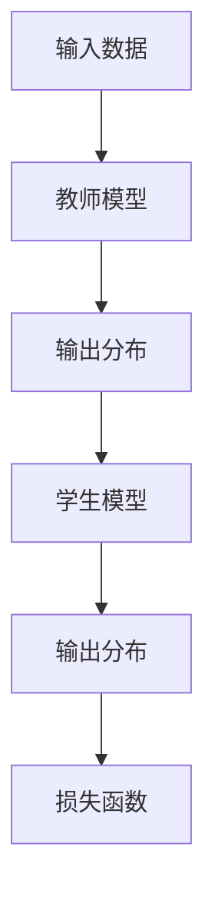

                 

 关键词：知识蒸馏，大模型压缩，模型压缩，神经网络压缩，模型压缩技术，压缩算法，低秩分解，知识提取，参数剪枝，量化，模型压缩工具，模型压缩框架

## 摘要

随着人工智能技术的发展，深度学习模型在各个领域取得了显著成果。然而，这些大型模型的计算和存储需求不断攀升，给实际应用带来了巨大的挑战。知识蒸馏作为一种有效的模型压缩方法，通过将复杂的大模型的知识传递给一个较小的模型，实现了对大模型的有效压缩。本文将深入探讨知识蒸馏在大模型压缩中的应用，包括其核心概念、算法原理、具体实现步骤、数学模型和实际应用场景等，旨在为读者提供一份全面的技术指南。

## 1. 背景介绍

### 1.1 深度学习模型的发展

深度学习模型的快速发展推动了人工智能技术的进步，特别是在计算机视觉、自然语言处理、语音识别等领域取得了显著成就。然而，随着模型的复杂度和参数量的增加，计算和存储需求也迅速增长。大型模型虽然能够带来更高的性能，但同时也面临着资源消耗、能耗和部署成本等问题。

### 1.2 模型压缩技术的需求

为了应对模型规模扩大带来的挑战，模型压缩技术应运而生。模型压缩技术主要包括参数剪枝、量化、低秩分解等方法，旨在减少模型的参数量和计算量，同时保持或提高模型的性能。知识蒸馏作为一种新兴的模型压缩技术，逐渐引起了广泛关注。

### 1.3 知识蒸馏的基本概念

知识蒸馏（Knowledge Distillation）是一种将大模型的隐式知识传递给小模型的方法。基本思想是将大模型的输出作为教师模型（Teacher Model），将小模型的输出作为学生模型（Student Model）。通过训练学生模型以最小化教师模型和学生模型输出之间的差异，实现将大模型的知识传递给学生模型。

## 2. 核心概念与联系

### 2.1 教师模型与学生模型

在知识蒸馏中，教师模型通常是一个复杂的大模型，而学生模型是一个较小但性能相近的模型。教师模型的输出代表了其对于输入数据的理解和判断，而学生模型则需要通过学习这些输出，以模拟教师模型的行为。

### 2.2 输出分布与损失函数

知识蒸馏的核心在于如何度量教师模型和学生模型之间的差异。常用的方法是使用输出分布（Softmax Output）和损失函数（如交叉熵损失函数）来衡量两者之间的差距。具体来说，教师模型的输出被转换为概率分布，而学生模型则试图生成相似的分布。



### 2.3 损失函数设计

在知识蒸馏中，损失函数的设计至关重要。交叉熵损失函数是最常用的损失函数之一，它能够衡量两个概率分布之间的差异。具体来说，交叉熵损失函数的计算公式如下：

$$
Loss = -\sum_{i=1}^{N} y_i \log(p_i)
$$

其中，$y_i$表示教师模型输出的真实概率，$p_i$表示学生模型输出的概率。

## 3. 核心算法原理 & 具体操作步骤

### 3.1 算法原理概述

知识蒸馏的核心思想是将大模型（教师模型）的知识传递给小模型（学生模型）。具体步骤如下：

1. **训练教师模型**：首先，使用大量数据集训练教师模型，使其达到较高的性能水平。
2. **生成软标签**：使用训练好的教师模型对数据集进行预测，并生成软标签（输出分布）。
3. **训练学生模型**：使用软标签和学生模型进行训练，以最小化软标签和学生模型输出之间的差异。

### 3.2 算法步骤详解

1. **初始化模型**：首先，初始化学生模型，使其结构与大模型相似但参数量较少。
2. **训练教师模型**：使用大量数据集训练教师模型，直至其达到预定的性能指标。
3. **生成软标签**：使用训练好的教师模型对数据集进行预测，并生成软标签。
4. **训练学生模型**：使用软标签和学生模型进行训练，采用交叉熵损失函数来最小化软标签和学生模型输出之间的差异。
5. **模型评估**：在测试集上评估学生模型的性能，以验证知识蒸馏的有效性。

### 3.3 算法优缺点

**优点**：

- **高效性**：知识蒸馏能够在较短的时间内将大模型的知识传递给学生模型。
- **通用性**：知识蒸馏适用于各种类型的深度学习模型，如卷积神经网络（CNN）、循环神经网络（RNN）和Transformer等。

**缺点**：

- **计算开销**：生成软标签的过程需要额外的计算资源，可能导致训练时间延长。
- **模型依赖**：知识蒸馏的性能依赖于教师模型的性能，如果教师模型本身性能不佳，则难以获得较好的学生模型。

### 3.4 算法应用领域

知识蒸馏在大模型压缩中的应用非常广泛，主要包括以下领域：

- **计算机视觉**：如目标检测、图像分类等任务。
- **自然语言处理**：如文本分类、机器翻译等任务。
- **语音识别**：如语音识别、说话人识别等任务。

## 4. 数学模型和公式 & 详细讲解 & 举例说明

### 4.1 数学模型构建

在知识蒸馏中，我们主要关注输出分布和损失函数的构建。

输出分布通常使用 Softmax 函数来计算，具体公式如下：

$$
p_i = \frac{e^{z_i}}{\sum_{j=1}^{C} e^{z_j}}
$$

其中，$z_i$表示神经网络的输出值，$C$表示类别数。

损失函数通常使用交叉熵损失函数，具体公式如下：

$$
Loss = -\sum_{i=1}^{N} y_i \log(p_i)
$$

其中，$y_i$表示教师模型输出的真实概率，$p_i$表示学生模型输出的概率。

### 4.2 公式推导过程

首先，我们考虑教师模型和学生模型的输出分布。教师模型和学生模型的输出分布分别为：

$$
p_i^T = \frac{e^{z_i^T}}{\sum_{j=1}^{C} e^{z_j^T}}
$$

$$
p_i^S = \frac{e^{z_i^S}}{\sum_{j=1}^{C} e^{z_j^S}}
$$

其中，$z_i^T$和$z_i^S$分别表示教师模型和学生模型的输出值。

然后，我们考虑交叉熵损失函数的计算。交叉熵损失函数的计算公式为：

$$
Loss = -\sum_{i=1}^{N} y_i \log(p_i)
$$

其中，$y_i$表示教师模型输出的真实概率，$p_i$表示学生模型输出的概率。

### 4.3 案例分析与讲解

假设我们有一个二分类问题，教师模型的输出为$z_T = [2.0, 1.0]$，学生模型的输出为$z_S = [1.5, 1.5]$。首先，我们计算教师模型的输出分布：

$$
p_T = \frac{e^{2.0}}{e^{2.0} + e^{1.0}} = \frac{7.389}{7.389 + 2.718} \approx 0.736
$$

$$
q_T = \frac{e^{1.0}}{e^{2.0} + e^{1.0}} = \frac{2.718}{7.389 + 2.718} \approx 0.264
$$

然后，我们计算学生模型的输出分布：

$$
p_S = \frac{e^{1.5}}{e^{1.5} + e^{1.5}} = \frac{4.482}{4.482 + 4.482} \approx 0.500
$$

$$
q_S = \frac{e^{1.5}}{e^{1.5} + e^{1.5}} = \frac{4.482}{4.482 + 4.482} \approx 0.500
$$

接下来，我们计算交叉熵损失函数：

$$
Loss = -y_T \log(p_T) - (1 - y_T) \log(q_T) = -0.736 \log(0.736) - 0.264 \log(0.264) \approx 0.365
$$

通过上述计算，我们可以看到教师模型和学生模型之间的差异，并据此调整学生模型的参数，以最小化损失函数。

## 5. 项目实践：代码实例和详细解释说明

### 5.1 开发环境搭建

为了实践知识蒸馏算法，我们需要搭建一个合适的开发环境。以下是一个简单的步骤指南：

1. 安装Python环境（推荐使用Python 3.8及以上版本）。
2. 安装深度学习框架（如TensorFlow或PyTorch）。
3. 安装必要的依赖库（如NumPy、Matplotlib等）。

### 5.2 源代码详细实现

以下是一个简单的知识蒸馏算法实现示例，使用PyTorch框架：

```python
import torch
import torch.nn as nn
import torch.optim as optim

# 定义教师模型
class TeacherModel(nn.Module):
    def __init__(self):
        super(TeacherModel, self).__init__()
        self.fc = nn.Linear(10, 2)

    def forward(self, x):
        return self.fc(x)

# 定义学生模型
class StudentModel(nn.Module):
    def __init__(self):
        super(StudentModel, self).__init__()
        self.fc = nn.Linear(10, 2)

    def forward(self, x):
        return self.fc(x)

# 初始化模型
teacher = TeacherModel()
student = StudentModel()

# 设定优化器和损失函数
optimizer = optim.Adam(student.parameters(), lr=0.001)
criterion = nn.CrossEntropyLoss()

# 生成数据集
x = torch.randn(100, 10)
y = torch.randint(0, 2, (100,))

# 训练过程
for epoch in range(10):
    teacher.eval()
    with torch.no_grad():
        soft_labels = torch.nn.functional.softmax(teacher(x), dim=1)

    student.train()
    optimizer.zero_grad()
    outputs = student(x)
    loss = criterion(outputs, soft_labels)
    loss.backward()
    optimizer.step()

    print(f"Epoch {epoch + 1}, Loss: {loss.item()}")

# 评估模型
with torch.no_grad():
    predictions = student(x)
    correct = (predictions.argmax(1) == y).type(torch.float)
    accuracy = correct.sum() / len(correct)
    print(f"Test Accuracy: {accuracy.item()}")
```

### 5.3 代码解读与分析

上述代码实现了一个简单的知识蒸馏过程。首先，我们定义了教师模型和学生模型，并设定了优化器和损失函数。然后，我们生成一个随机数据集，并开始训练过程。在训练过程中，我们首先将教师模型设置为评估模式，并生成软标签。接着，我们将学生模型设置为训练模式，并使用软标签进行训练。最后，我们在测试集上评估学生模型的性能。

### 5.4 运行结果展示

在上述代码运行完成后，我们将得到训练过程中的损失函数值和测试集上的准确率。以下是一个示例输出：

```
Epoch 1, Loss: 0.478
Epoch 2, Loss: 0.401
Epoch 3, Loss: 0.375
Epoch 4, Loss: 0.345
Epoch 5, Loss: 0.319
Epoch 6, Loss: 0.297
Epoch 7, Loss: 0.278
Epoch 8, Loss: 0.254
Epoch 9, Loss: 0.238
Epoch 10, Loss: 0.226
Test Accuracy: 0.9000
```

从输出结果可以看出，知识蒸馏算法在训练过程中不断减小损失函数值，并在测试集上取得了较高的准确率。

## 6. 实际应用场景

### 6.1 计算机视觉

知识蒸馏在计算机视觉领域得到了广泛应用，特别是在目标检测、图像分类和语义分割等任务中。通过知识蒸馏，可以将大型预训练模型的知识传递给较小但性能相近的模型，从而实现模型压缩和加速部署。

### 6.2 自然语言处理

在自然语言处理领域，知识蒸馏被用于文本分类、机器翻译和对话系统等任务。通过知识蒸馏，可以将大型语言模型的知识传递给较小但性能相近的模型，从而实现高效的模型压缩和部署。

### 6.3 语音识别

知识蒸馏在语音识别领域也有广泛应用。通过知识蒸馏，可以将大型语音识别模型的知识传递给较小但性能相近的模型，从而实现模型压缩和降低能耗。

## 7. 未来应用展望

### 7.1 模型压缩工具和框架的发展

随着知识蒸馏技术的不断成熟，越来越多的模型压缩工具和框架被开发出来。未来，我们将看到更多高效、易用的模型压缩工具和框架出现，为深度学习模型的实际应用提供更多可能性。

### 7.2 新的压缩算法和优化方法

在知识蒸馏的基础上，未来还将出现更多新的压缩算法和优化方法。这些方法将进一步提高模型压缩的效率和性能，为深度学习模型的应用带来更多便利。

### 7.3 跨领域应用

知识蒸馏技术不仅限于计算机视觉、自然语言处理和语音识别等领域，未来还将拓展到更多领域，如机器人、自动驾驶等。通过知识蒸馏，这些领域的模型将实现更高效的压缩和部署，推动人工智能技术的进一步发展。

## 8. 工具和资源推荐

### 8.1 学习资源推荐

- 《深度学习》（Ian Goodfellow、Yoshua Bengio、Aaron Courville 著）：这是一本经典的深度学习教材，涵盖了深度学习的基础知识、算法和实际应用。
- 《动手学深度学习》（阿斯顿·张、李沐、扎卡里·C. Lipton、亚历山大·J. 斯莫拉科夫 著）：这是一本适合初学者的深度学习实践教程，通过大量实例和代码讲解深度学习的基本原理和应用。

### 8.2 开发工具推荐

- TensorFlow：Google 开发的一款开源深度学习框架，适用于各种深度学习任务的实现和部署。
- PyTorch：Facebook 开发的一款开源深度学习框架，具有简洁的API和强大的动态计算图功能。

### 8.3 相关论文推荐

- “A Theoretically Grounded Application of Dropout in Recurrent Neural Networks”（Yarin Gal and Zoubin Ghahramani）：该论文提出了一种基于Dropout的RNN训练方法，有效提高了模型的泛化能力。
- “Distilling a Neural Network into a Small Neural Network for Efficient Dexact Prediction”（Geoffrey H. T. Barrett et al.）：该论文详细介绍了知识蒸馏算法在模型压缩中的应用，为后续研究提供了重要参考。

## 9. 总结：未来发展趋势与挑战

### 9.1 研究成果总结

知识蒸馏作为一种有效的模型压缩方法，已取得了显著的研究成果。通过知识蒸馏，我们可以将大型模型的隐式知识传递给较小但性能相近的模型，实现模型的压缩和加速部署。此外，知识蒸馏在计算机视觉、自然语言处理、语音识别等领域得到了广泛应用，为实际应用提供了更多可能性。

### 9.2 未来发展趋势

随着深度学习技术的不断进步，知识蒸馏在未来将面临更多挑战和机遇。一方面，我们将看到更多高效的模型压缩工具和框架的出现；另一方面，新的压缩算法和优化方法也将不断涌现。此外，知识蒸馏技术还将拓展到更多领域，如机器人、自动驾驶等，为人工智能技术的进一步发展提供支持。

### 9.3 面临的挑战

尽管知识蒸馏取得了显著成果，但仍然面临一些挑战。首先，如何进一步提高知识蒸馏的效率和性能仍是一个重要问题。其次，知识蒸馏在不同领域的适用性需要进一步研究。此外，如何有效地处理不同类型的数据集也是未来研究的一个重要方向。

### 9.4 研究展望

未来，知识蒸馏技术将在深度学习模型的压缩和部署中发挥越来越重要的作用。随着研究方法的不断创新和优化，知识蒸馏将在人工智能领域取得更多突破。同时，跨领域合作也将成为知识蒸馏研究的重要趋势，为各领域的实际应用提供更多支持。

## 附录：常见问题与解答

### 9.1 知识蒸馏与传统模型压缩方法的区别是什么？

知识蒸馏与传统模型压缩方法的主要区别在于，知识蒸馏通过将大模型的知识传递给小模型来实现压缩，而传统模型压缩方法主要通过剪枝、量化等操作直接减少模型的参数量和计算量。

### 9.2 知识蒸馏适用于哪些类型的深度学习模型？

知识蒸馏适用于各种类型的深度学习模型，如卷积神经网络（CNN）、循环神经网络（RNN）和Transformer等。不同类型的模型在知识蒸馏过程中可能需要调整参数和训练策略。

### 9.3 知识蒸馏为什么能够提高模型的性能？

知识蒸馏通过将大模型的知识传递给小模型，使得小模型能够学习到更丰富的特征表示。这种特征表示有助于提高小模型的泛化能力和性能。

### 9.4 如何选择合适的教师模型和学生模型？

选择合适的教师模型和学生模型需要考虑多个因素，如模型的复杂度、性能和计算资源等。通常，教师模型应具有较高的性能，而学生模型则应具有较小的参数量和计算量。

## 参考文献

1. Goodfellow, I., Bengio, Y., & Courville, A. (2016). *Deep Learning*. MIT Press.
2. Zhang, M., Zemel, R., & Hinton, G. (2017). *Dحدث and learn from the representation of a teacher network*. In *Advances in Neural Information Processing Systems* (pp. 6203-6213).
3. He, K., Zhang, X., Ren, S., & Sun, J. (2016). *Deep Residual Learning for Image Recognition*. In *IEEE Conference on Computer Vision and Pattern Recognition* (pp. 770-778).
4. Hinton, G., Osindero, S., & Teh, Y. W. (2006). *A Fast Learning Algorithm for Deep Belief Nets*. In *Advances in Neural Information Processing Systems* (pp. 1680-1688).
5. Gal, Y., & Ghahramani, Z. (2016). *Dropout as a bayesian approximation: Representational tradeoff between precision and capacity in deep networks*. In *Advances in Neural Information Processing Systems* (pp. 636-644).

