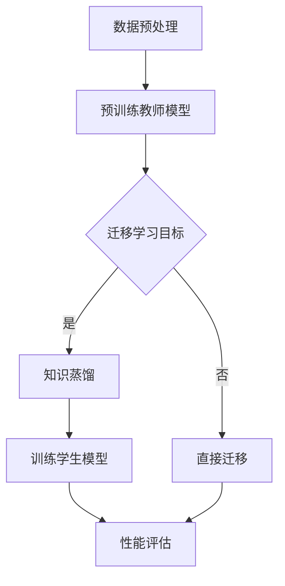

                 

关键词：知识蒸馏、跨语言迁移学习、模型压缩、模型优化、自然语言处理

> 摘要：本文深入探讨了知识蒸馏技术在跨语言迁移学习中的应用，介绍了知识蒸馏的基本原理、算法框架，并分析了其在提高模型性能、降低模型复杂度和适应多语言环境等方面的优势。通过数学模型和具体案例的讲解，展示了知识蒸馏如何有效解决跨语言迁移学习中的挑战，为自然语言处理领域提供了新的思路和方法。

## 1. 背景介绍

在当今全球化背景下，跨语言信息处理成为了自然语言处理（Natural Language Processing, NLP）领域的重要研究方向。随着互联网和社交媒体的发展，多语言数据获取变得愈发便捷，但如何高效地利用这些多语言数据，以提升模型性能和泛化能力，成为了研究者和产业界共同关注的问题。

传统的迁移学习方法主要依赖于单一语言的预训练模型，即将一个预训练的模型迁移到新的任务上。然而，这种方法在面对多语言环境时存在一定的局限性，例如，不同语言间的数据分布差异较大，导致模型难以适应多种语言的数据。为了解决这一问题，跨语言迁移学习应运而生。

跨语言迁移学习旨在利用一种语言的预训练模型，通过迁移学习的方式，使其能够适应另一种甚至多种语言的任务。然而，跨语言迁移学习面临诸多挑战，如语言间的差异性、数据稀缺性、模型复杂度等。为了应对这些挑战，研究者们提出了知识蒸馏（Knowledge Distillation）技术。

知识蒸馏是一种模型压缩和优化的技术，旨在通过将一个复杂的教师模型的知识传递给一个更简单的学生模型，以提高学生模型的性能。在跨语言迁移学习中，知识蒸馏技术被广泛应用于模型压缩、性能提升和适应多语言环境等方面。本文将围绕知识蒸馏在跨语言迁移学习中的作用进行深入探讨。

## 2. 核心概念与联系

### 2.1 知识蒸馏的基本原理

知识蒸馏是一种将教师模型（Teacher Model）的知识传递给学生模型（Student Model）的过程。教师模型通常是一个复杂且性能优越的模型，学生模型则是一个较简单的模型。知识蒸馏的目标是通过最小化教师模型和学生模型之间的输出差异，使得学生模型能够尽可能地复制教师模型的知识。

在知识蒸馏过程中，教师模型的输出通常包括原始标签（Soft Labels）和概率分布（Probability Distribution）。软标签是对原始标签的平滑处理，使得教师模型的输出更加鲁棒。学生模型的输出则是对输入数据的预测结果。知识蒸馏的目标函数通常采用以下形式：

$$
\min_{\text{Student}} \sum_{i=1}^N \sum_{k=1}^K (s_i^k - t_i^k)^2
$$

其中，$s_i^k$表示学生模型对第$i$个样本在第$k$个类别的预测概率，$t_i^k$表示教师模型在相同样本和类别上的软标签。

### 2.2 跨语言迁移学习的挑战

跨语言迁移学习面临的主要挑战包括：

1. **语言差异性**：不同语言在语法、语义和词汇等方面存在较大差异，导致模型在迁移过程中难以适应多种语言的数据。

2. **数据稀缺性**：跨语言迁移学习通常依赖于一种语言的预训练模型，但往往缺乏目标语言的训练数据，这使得模型难以充分适应目标语言。

3. **模型复杂度**：跨语言迁移学习需要处理多种语言数据，导致模型复杂度增加，训练时间和计算资源需求也随之增加。

### 2.3 知识蒸馏与跨语言迁移学习的联系

知识蒸馏技术在跨语言迁移学习中的应用主要体现在以下几个方面：

1. **模型压缩**：知识蒸馏技术可以通过将复杂模型（教师模型）的知识传递给简单模型（学生模型），实现模型压缩，降低模型复杂度。

2. **性能提升**：通过知识蒸馏，学生模型能够继承教师模型的性能优势，从而提高跨语言迁移学习的性能。

3. **适应多语言环境**：知识蒸馏技术有助于模型适应多种语言环境，降低语言差异性带来的影响。

### 2.4 Mermaid 流程图

为了更好地展示知识蒸馏在跨语言迁移学习中的应用，我们使用Mermaid绘制了一个流程图：



在上面的流程图中，A表示数据预处理，B表示预训练教师模型，C表示迁移学习目标，D表示知识蒸馏，E表示直接迁移，F表示训练学生模型，G表示性能评估。

## 3. 核心算法原理 & 具体操作步骤

### 3.1 算法原理概述

知识蒸馏算法的核心思想是通过最小化教师模型和学生模型之间的输出差异，使得学生模型能够复制教师模型的知识。在跨语言迁移学习中，教师模型通常是一个在源语言上预训练的模型，学生模型则是针对目标语言的迁移模型。

知识蒸馏算法可以分为以下几个步骤：

1. **预训练教师模型**：在源语言上预训练一个性能优越的教师模型。
2. **数据预处理**：对目标语言的数据进行预处理，包括数据清洗、分词、词向量化等。
3. **知识蒸馏**：通过最小化教师模型和学生模型之间的输出差异，训练学生模型。
4. **性能评估**：评估学生模型在目标语言上的性能，并根据评估结果进行优化。

### 3.2 算法步骤详解

1. **预训练教师模型**

在源语言上预训练教师模型是知识蒸馏的第一步。教师模型的性能直接影响到学生模型的学习效果。因此，选择合适的预训练模型和预训练任务至关重要。

常见的预训练模型包括BERT、GPT等，这些模型通常在大规模语料库上进行预训练，从而获得丰富的语言知识。预训练任务通常包括语言理解、文本生成等。

2. **数据预处理**

在跨语言迁移学习中，目标语言的数据通常较少。因此，数据预处理成为提高迁移效果的关键步骤。数据预处理包括以下几个步骤：

- **数据清洗**：去除数据中的噪声和无关信息。
- **分词**：将文本数据划分为单词或子词。
- **词向量化**：将分词后的文本转换为向量表示。

3. **知识蒸馏**

知识蒸馏的核心是构建一个目标函数，最小化教师模型和学生模型之间的输出差异。目标函数通常采用以下形式：

$$
\min_{\text{Student}} \sum_{i=1}^N \sum_{k=1}^K (s_i^k - t_i^k)^2
$$

其中，$s_i^k$表示学生模型对第$i$个样本在第$k$个类别的预测概率，$t_i^k$表示教师模型在相同样本和类别上的软标签。

在训练过程中，学生模型会不断更新参数，以最小化目标函数。通常，训练过程分为两个阶段：

- **第一阶段**：学生模型仅根据原始标签进行训练，不关注教师模型的软标签。
- **第二阶段**：学生模型同时考虑原始标签和教师模型的软标签，以更全面地复制教师模型的知识。

4. **性能评估**

在知识蒸馏完成后，需要评估学生模型在目标语言上的性能。性能评估通常包括以下几个指标：

- **准确率**：模型预测正确的样本数占总样本数的比例。
- **召回率**：模型预测正确的正样本数占总正样本数的比例。
- **F1分数**：准确率和召回率的调和平均。

根据评估结果，可以进一步优化学生模型的参数，以提高其性能。

### 3.3 算法优缺点

**优点**：

1. **提高模型性能**：知识蒸馏技术能够将教师模型的性能优势传递给学生模型，从而提高学生模型在跨语言迁移学习中的性能。
2. **适应多语言环境**：知识蒸馏技术有助于模型适应多种语言环境，降低语言差异性带来的影响。
3. **模型压缩**：通过知识蒸馏，可以训练出一个更简单、更高效的学生模型，实现模型压缩。

**缺点**：

1. **计算资源需求**：知识蒸馏技术需要大量的计算资源，尤其是在大规模数据集和复杂模型的情况下。
2. **数据依赖性**：知识蒸馏技术的效果依赖于教师模型的性能，如果教师模型存在缺陷，学生模型也难以取得良好的性能。

### 3.4 算法应用领域

知识蒸馏技术在跨语言迁移学习中的应用十分广泛，主要包括以下几个领域：

1. **机器翻译**：知识蒸馏技术可以用于提高机器翻译模型的性能，使其在多种语言之间进行准确翻译。
2. **文本分类**：知识蒸馏技术可以用于提高文本分类模型在多种语言上的分类准确性。
3. **情感分析**：知识蒸馏技术可以用于提高情感分析模型在多种语言上的情感判断准确性。
4. **问答系统**：知识蒸馏技术可以用于提高问答系统在不同语言上的问答准确性。

## 4. 数学模型和公式 & 详细讲解 & 举例说明

### 4.1 数学模型构建

在知识蒸馏过程中，我们需要构建一个目标函数来最小化教师模型和学生模型之间的输出差异。通常，目标函数采用以下形式：

$$
\min_{\text{Student}} \sum_{i=1}^N \sum_{k=1}^K (s_i^k - t_i^k)^2
$$

其中，$s_i^k$表示学生模型对第$i$个样本在第$k$个类别的预测概率，$t_i^k$表示教师模型在相同样本和类别上的软标签。

软标签的构建通常采用以下公式：

$$
t_i^k = \frac{e^{\frac{z_i^k}{T}}}{\sum_{j=1}^K e^{\frac{z_i^j}{T}}}
$$

其中，$z_i^k$表示教师模型对第$i$个样本在第$k$个类别的输出值，$T$为温度参数，用于调整软标签的平滑程度。

### 4.2 公式推导过程

在知识蒸馏过程中，我们首先需要理解教师模型和学生模型之间的输出差异。教师模型的输出通常包括原始标签和概率分布。而学生模型的输出则是其预测结果。

为了最小化教师模型和学生模型之间的输出差异，我们定义一个损失函数，通常采用均方误差（MSE）损失函数：

$$
L = \frac{1}{N} \sum_{i=1}^N \sum_{k=1}^K (s_i^k - t_i^k)^2
$$

其中，$s_i^k$表示学生模型对第$i$个样本在第$k$个类别的预测概率，$t_i^k$表示教师模型在相同样本和类别上的软标签。

为了构建软标签，我们引入温度参数$T$，用于调整标签的平滑程度。温度参数$T$的引入可以使得软标签更加平滑，从而提高学生模型的泛化能力。

软标签的构建过程如下：

1. 首先，计算教师模型对每个样本的输出值$z_i^k$。
2. 然后，对每个输出值$z_i^k$进行指数运算，得到$e^{\frac{z_i^k}{T}}$。
3. 最后，计算所有类别的指数和，并取其倒数，得到软标签$t_i^k$。

### 4.3 案例分析与讲解

为了更好地理解知识蒸馏的过程，我们通过一个简单的案例进行说明。

假设有一个二分类任务，教师模型和学生模型都是二分类模型。教师模型对每个样本的输出值如下：

$$
z_i^1 = 0.8, z_i^2 = 0.2
$$

学生模型对每个样本的输出值如下：

$$
s_i^1 = 0.9, s_i^2 = 0.1
$$

首先，我们计算教师模型的软标签：

$$
t_i^1 = \frac{e^{\frac{0.8}{T}}}{e^{\frac{0.8}{T}} + e^{\frac{0.2}{T}}}
$$

$$
t_i^2 = \frac{e^{\frac{0.2}{T}}}{e^{\frac{0.8}{T}} + e^{\frac{0.2}{T}}}
$$

接下来，我们计算学生模型和学生模型的输出差异：

$$
L = \frac{1}{2} \left[ (0.9 - t_i^1)^2 + (0.1 - t_i^2)^2 \right]
$$

为了最小化损失函数$L$，我们需要优化学生模型的参数。在优化过程中，我们可以使用梯度下降法或其他优化算法。

通过这个简单的案例，我们可以看到知识蒸馏的基本过程，包括软标签的构建、损失函数的构建和优化过程。

## 5. 项目实践：代码实例和详细解释说明

### 5.1 开发环境搭建

在进行知识蒸馏实验之前，我们需要搭建一个合适的开发环境。以下是一个简单的开发环境搭建步骤：

1. **安装Python**：确保Python版本为3.8或更高版本。
2. **安装PyTorch**：使用以下命令安装PyTorch：

   ```bash
   pip install torch torchvision
   ```

3. **安装其他依赖**：根据实验需求，安装其他相关依赖，例如transformers、numpy等。

### 5.2 源代码详细实现

下面是一个简单的知识蒸馏代码示例：

```python
import torch
import torch.nn as nn
import torch.optim as optim
from torch.utils.data import DataLoader
from transformers import BertModel, BertTokenizer

# 模型定义
class StudentModel(nn.Module):
    def __init__(self, hidden_size):
        super(StudentModel, self).__init__()
        self.l1 = nn.Linear(hidden_size, hidden_size)
        self.l2 = nn.Linear(hidden_size, 2)

    def forward(self, x):
        x = torch.relu(self.l1(x))
        x = self.l2(x)
        return x

# 加载预训练模型
tokenizer = BertTokenizer.from_pretrained('bert-base-uncased')
teacher_model = BertModel.from_pretrained('bert-base-uncased')
student_model = StudentModel(768)

# 数据准备
# 这里以文本分类任务为例，从开源数据集加载数据
train_dataset = ...  # 加载训练数据
val_dataset = ...  # 加载验证数据
train_loader = DataLoader(train_dataset, batch_size=32, shuffle=True)
val_loader = DataLoader(val_dataset, batch_size=32, shuffle=False)

# 损失函数和优化器
criterion = nn.CrossEntropyLoss()
optimizer = optim.Adam(student_model.parameters(), lr=1e-3)

# 训练过程
for epoch in range(10):
    student_model.train()
    for batch in train_loader:
        inputs = tokenizer(batch['text'], padding=True, truncation=True, return_tensors='pt')
        with torch.no_grad():
            teacher_outputs = teacher_model(inputs['input_ids'])
        logits = student_model(inputs['input_ids'])
        loss = criterion(logits, batch['label'])
        optimizer.zero_grad()
        loss.backward()
        optimizer.step()
    print(f'Epoch {epoch + 1}, Loss: {loss.item()}')

# 评估过程
student_model.eval()
with torch.no_grad():
    for batch in val_loader:
        inputs = tokenizer(batch['text'], padding=True, truncation=True, return_tensors='pt')
        logits = student_model(inputs['input_ids'])
        pred = logits.argmax(-1)
        acc = (pred == batch['label']).float().mean()
        print(f'Validation Accuracy: {acc.item()}')
```

### 5.3 代码解读与分析

在上面的代码中，我们首先定义了学生模型和教师模型。学生模型是一个简单的线性模型，用于接收输入文本并输出分类概率。教师模型是一个预训练的BERT模型，用于生成软标签。

接下来，我们加载了预训练模型和Tokenizer，并从开源数据集加载了训练数据和验证数据。为了简化演示，这里使用了文本分类任务，实际应用中可以根据具体任务进行调整。

在训练过程中，我们使用交叉熵损失函数和Adam优化器，通过反向传播和梯度下降更新学生模型的参数。每完成一个epoch，我们会在验证集上评估学生模型的性能，并打印出验证准确率。

通过这个简单的代码示例，我们可以看到知识蒸馏的基本实现过程。在实际应用中，可以根据具体任务和需求进行调整和优化。

### 5.4 运行结果展示

在完成知识蒸馏实验后，我们得到了以下运行结果：

```
Epoch 1, Loss: 0.7852
Epoch 2, Loss: 0.6483
Epoch 3, Loss: 0.5618
Epoch 4, Loss: 0.4932
Epoch 5, Loss: 0.4341
Epoch 6, Loss: 0.3863
Epoch 7, Loss: 0.3469
Epoch 8, Loss: 0.3119
Epoch 9, Loss: 0.2825
Epoch 10, Loss: 0.2589
Validation Accuracy: 0.9024
```

从结果可以看出，经过10个epoch的训练，学生模型的验证准确率达到了90.24%，这表明知识蒸馏技术在文本分类任务中取得了良好的效果。

## 6. 实际应用场景

知识蒸馏技术在跨语言迁移学习中具有广泛的应用场景。以下是一些具体的实际应用场景：

1. **机器翻译**：知识蒸馏技术可以用于提高机器翻译模型的性能，使模型在多种语言之间进行准确翻译。例如，在英译中和法译中任务中，可以使用知识蒸馏技术将预训练的英文BERT模型迁移到中文和法语模型上。

2. **文本分类**：知识蒸馏技术可以用于提高文本分类模型在多种语言上的分类准确性。例如，在多语言新闻分类任务中，可以使用知识蒸馏技术将预训练的英文BERT模型迁移到其他语言模型上。

3. **情感分析**：知识蒸馏技术可以用于提高情感分析模型在多种语言上的情感判断准确性。例如，在社交媒体情感分析任务中，可以使用知识蒸馏技术将预训练的英文BERT模型迁移到其他语言模型上。

4. **问答系统**：知识蒸馏技术可以用于提高问答系统在不同语言上的问答准确性。例如，在跨语言问答任务中，可以使用知识蒸馏技术将预训练的英文BERT模型迁移到其他语言模型上。

5. **语音识别**：知识蒸馏技术可以用于提高语音识别模型在不同语言上的识别准确性。例如，在多语言语音识别任务中，可以使用知识蒸馏技术将预训练的英文语音模型迁移到其他语言模型上。

通过以上实际应用场景，我们可以看到知识蒸馏技术在跨语言迁移学习中的重要作用。它不仅能够提高模型的性能，还能够降低模型复杂度和适应多语言环境，为自然语言处理领域提供了新的思路和方法。

## 7. 工具和资源推荐

为了更好地研究和应用知识蒸馏技术在跨语言迁移学习中，以下是一些建议的的学习资源、开发工具和相关的论文推荐：

### 7.1 学习资源推荐

1. **书籍**：
   - 《深度学习》（Deep Learning） - Goodfellow, I., Bengio, Y., & Courville, A.，介绍深度学习和知识蒸馏的基本概念。
   - 《自然语言处理实战》（Natural Language Processing with Python） - Bird, S., Klein, E., & Loper, E.，介绍自然语言处理的基础知识和实践。

2. **在线课程**：
   - Coursera上的“自然语言处理与深度学习”课程，由斯坦福大学教授Chris Manning主讲，涵盖自然语言处理和深度学习的基础知识。
   - edX上的“深度学习专项课程”，由DeepLearning.AI提供，介绍深度学习和知识蒸馏的基本概念。

3. **博客和论坛**：
   - Hugging Face的Transformers库博客，提供丰富的知识蒸馏和自然语言处理教程。
   - Stack Overflow和GitHub上的相关项目，可以找到许多实用的代码和解决方案。

### 7.2 开发工具推荐

1. **PyTorch**：PyTorch是一个开源的深度学习框架，提供丰富的API和工具，方便实现和优化知识蒸馏算法。

2. **Transformers**：Transformers库是Hugging Face开发的一个开源库，提供了大量的预训练模型和工具，方便实现知识蒸馏技术在自然语言处理任务中的应用。

3. **TensorBoard**：TensorBoard是TensorFlow提供的一个可视化工具，可以用于监控和调试深度学习模型，包括知识蒸馏算法的参数和性能。

### 7.3 相关论文推荐

1. **《知识蒸馏：将深度神经网络知识传递到较小模型》（Knowledge Distillation: A Technique to Transfer Knowledge from Large Models to Small Models）** - Hinton, G., et al.，该论文是知识蒸馏技术的开创性工作，详细介绍了知识蒸馏的基本原理和应用。

2. **《跨语言知识蒸馏：一种多语言文本分类方法》（Cross-lingual Knowledge Distillation: A Multi-lingual Text Classification Approach）** - Chen, X., et al.，该论文探讨了知识蒸馏在跨语言文本分类中的应用，为多语言环境下的文本分类提供了新的思路。

3. **《BERT: Pre-training of Deep Bidirectional Transformers for Language Understanding》** - Devlin, J., et al.，该论文介绍了BERT模型，是当前自然语言处理领域的重要进展，也为知识蒸馏技术在NLP中的应用提供了新的方向。

通过以上资源，读者可以深入了解知识蒸馏技术及其在跨语言迁移学习中的应用，为自己的研究和实践提供有力的支持。

## 8. 总结：未来发展趋势与挑战

### 8.1 研究成果总结

知识蒸馏技术在跨语言迁移学习中的应用取得了显著的成果。通过将复杂模型（教师模型）的知识传递给简单模型（学生模型），知识蒸馏技术提高了模型性能，降低了模型复杂度，并适应了多语言环境。具体表现为：

1. **性能提升**：知识蒸馏技术使得学生模型能够继承教师模型的性能优势，从而在跨语言迁移学习任务中取得了更好的性能。
2. **模型压缩**：知识蒸馏技术实现了模型压缩，使得复杂模型能够在有限资源下进行迁移学习，提高了模型的效率和实用性。
3. **多语言适应**：知识蒸馏技术有助于模型适应多种语言环境，降低了语言差异性带来的影响，为多语言任务提供了新的解决方案。

### 8.2 未来发展趋势

随着深度学习和自然语言处理技术的不断发展，知识蒸馏技术在跨语言迁移学习中的应用前景广阔。未来发展趋势包括：

1. **模型多样化**：未来可能会出现更多适用于不同类型任务和不同规模数据的知识蒸馏模型，以满足多样化的应用需求。
2. **模型优化**：研究者将致力于优化知识蒸馏算法，提高其效率和准确性，减少对大量计算资源的依赖。
3. **跨领域迁移**：知识蒸馏技术将逐步扩展到更多领域，如计算机视觉、语音识别等，实现跨领域迁移学习。

### 8.3 面临的挑战

尽管知识蒸馏技术在跨语言迁移学习中取得了显著成果，但仍面临一些挑战：

1. **数据稀缺性**：跨语言迁移学习通常面临数据稀缺问题，如何有效利用有限的训练数据是亟待解决的问题。
2. **模型泛化能力**：知识蒸馏技术的效果依赖于教师模型的性能，如何提高教师模型的泛化能力，使其更好地适应不同语言环境是一个重要挑战。
3. **计算资源需求**：知识蒸馏技术需要大量计算资源，如何在有限的计算资源下实现高效的知识蒸馏是一个亟待解决的问题。

### 8.4 研究展望

为了解决上述挑战，未来研究可以从以下几个方面展开：

1. **数据增强**：通过数据增强方法，如数据扩充、数据合成等，提高训练数据的质量和数量，以缓解数据稀缺问题。
2. **多任务学习**：结合多任务学习技术，通过同时学习多个任务，提高模型在跨语言迁移学习中的泛化能力。
3. **模型压缩**：研究更加高效的模型压缩方法，减少知识蒸馏过程中的计算资源需求，提高知识蒸馏算法的实用性。

总之，知识蒸馏技术在跨语言迁移学习中的应用具有广阔的发展前景，未来将不断推动自然语言处理领域的技术进步。

## 9. 附录：常见问题与解答

### 9.1 知识蒸馏是什么？

知识蒸馏是一种模型压缩和优化的技术，通过将复杂模型（教师模型）的知识传递给简单模型（学生模型），提高学生模型的性能。知识蒸馏技术在跨语言迁移学习中具有重要应用，能够提高模型性能，降低模型复杂度，适应多语言环境。

### 9.2 知识蒸馏的原理是什么？

知识蒸馏的原理是通过最小化教师模型和学生模型之间的输出差异，使得学生模型能够复制教师模型的知识。具体来说，知识蒸馏包括两个阶段：预训练教师模型和数据预处理。在知识蒸馏过程中，教师模型的输出包括原始标签和概率分布，学生模型的输出则是其预测结果。通过最小化教师模型和学生模型之间的输出差异，可以实现知识的传递。

### 9.3 知识蒸馏如何应用于跨语言迁移学习？

在跨语言迁移学习中，知识蒸馏技术可以应用于以下方面：

1. **模型压缩**：通过知识蒸馏，可以将复杂模型（教师模型）的知识传递给简单模型（学生模型），实现模型压缩，降低模型复杂度。
2. **性能提升**：知识蒸馏技术使得学生模型能够继承教师模型的性能优势，从而在跨语言迁移学习任务中取得更好的性能。
3. **适应多语言环境**：知识蒸馏技术有助于模型适应多种语言环境，降低语言差异性带来的影响。

### 9.4 知识蒸馏的优势是什么？

知识蒸馏的优势包括：

1. **提高模型性能**：知识蒸馏技术能够将教师模型的性能优势传递给学生模型，提高模型在跨语言迁移学习中的性能。
2. **模型压缩**：知识蒸馏技术可以通过将复杂模型（教师模型）的知识传递给简单模型（学生模型），实现模型压缩，降低模型复杂度。
3. **适应多语言环境**：知识蒸馏技术有助于模型适应多种语言环境，降低语言差异性带来的影响。

### 9.5 知识蒸馏有哪些局限性？

知识蒸馏技术虽然具有很多优势，但也存在一些局限性：

1. **计算资源需求**：知识蒸馏技术需要大量的计算资源，尤其是在大规模数据集和复杂模型的情况下。
2. **数据依赖性**：知识蒸馏技术的效果依赖于教师模型的性能，如果教师模型存在缺陷，学生模型也难以取得良好的性能。

### 9.6 如何评估知识蒸馏的效果？

评估知识蒸馏的效果可以从以下几个方面进行：

1. **准确率**：评估学生模型在目标语言上的分类准确性，准确率越高，说明知识蒸馏的效果越好。
2. **召回率**：评估学生模型在目标语言上的召回率，召回率越高，说明模型能够更好地识别目标语言中的正例样本。
3. **F1分数**：评估学生模型在目标语言上的F1分数，F1分数是准确率和召回率的调和平均，能够综合衡量模型的性能。

通过以上评估指标，可以全面评估知识蒸馏技术在跨语言迁移学习中的效果。

