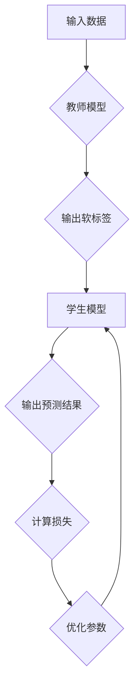

                 

知识蒸馏是一种在深度学习领域中常用的技术，它通过将一个复杂、高参数的大模型（通常称为教师模型）的知识传递给一个较小的、参数较少的模型（通常称为学生模型），从而在保持高性能的同时减少计算资源和时间成本。本文将深入探讨知识蒸馏的核心原理，以及它如何提升模型的鲁棒性。

## 1. 背景介绍

随着深度学习在各个领域的应用越来越广泛，模型的复杂度和参数数量也在不断增加。然而，高复杂度的模型虽然能够获得较好的性能，但通常需要大量的计算资源和时间。在资源受限的环境下，这成为了一个严重的瓶颈。知识蒸馏技术应运而生，它通过模型间的知识传递，在保持高性能的同时，显著降低了模型的参数数量。

## 2. 核心概念与联系

### 2.1 教师模型与学生模型

教师模型（Teacher Model）：通常是一个复杂的大模型，具有高精度和强大的表征能力。

学生模型（Student Model）：通常是一个较小的模型，拥有较少的参数和计算量。

### 2.2 知识蒸馏流程

1. **训练教师模型**：使用大量的数据进行训练，使其达到较高的精度。
2. **知识蒸馏**：教师模型输出原始标签和软标签（概率分布），学生模型基于软标签进行训练。
3. **迭代优化**：通过不断迭代，逐渐缩小教师模型和学生模型之间的差距。

### 2.3 Mermaid 流程图



## 3. 核心算法原理 & 具体操作步骤

### 3.1 算法原理概述

知识蒸馏的核心思想是利用教师模型生成的软标签来指导学生模型的训练。软标签是教师模型对于每个类别的概率分布，比硬标签（即原始标签）提供了更多的信息。学生模型通过最小化软标签与自身输出之间的差异来学习，从而提升模型的性能。

### 3.2 算法步骤详解

1. **数据预处理**：对输入数据进行标准化处理。
2. **训练教师模型**：使用原始数据集训练教师模型，使其达到较高的精度。
3. **生成软标签**：对于每个输入样本，教师模型输出软标签，即每个类别的概率分布。
4. **训练学生模型**：学生模型基于教师模型的软标签进行训练，通过最小化软标签与自身输出之间的差异。
5. **迭代优化**：通过不断迭代，逐渐缩小教师模型和学生模型之间的差距。

### 3.3 算法优缺点

**优点**：
- 提高模型的性能，尤其是在小样本场景下。
- 降低模型的参数数量，减少计算资源和时间成本。

**缺点**：
- 需要一个高质量的教师模型。
- 知识蒸馏的过程可能会引入偏差。

### 3.4 算法应用领域

知识蒸馏技术广泛应用于图像识别、语音识别、自然语言处理等场景，特别是在小样本学习、低资源环境等条件下。

## 4. 数学模型和公式 & 详细讲解 & 举例说明

### 4.1 数学模型构建

知识蒸馏的目标是最小化学生模型的输出与教师模型的软标签之间的差异。数学模型可以表示为：

$$
L = -\sum_{i=1}^{N}\sum_{j=1}^{C}\hat{y}_{ij}\log(p_{ij})
$$

其中，$N$是样本数量，$C$是类别数量，$\hat{y}_{ij}$是学生模型对于第$i$个样本的第$j$个类别的预测概率，$p_{ij}$是教师模型对于第$i$个样本的第$j$个类别的软标签概率。

### 4.2 公式推导过程

知识蒸馏的损失函数通常是基于交叉熵损失函数。交叉熵损失函数可以表示为：

$$
L = -\sum_{i=1}^{N}\sum_{j=1}^{C}y_{ij}\log(\hat{y}_{ij})
$$

其中，$y_{ij}$是教师模型的硬标签，即第$i$个样本的实际类别。

当使用软标签代替硬标签时，损失函数变为：

$$
L = -\sum_{i=1}^{N}\sum_{j=1}^{C}\hat{y}_{ij}\log(p_{ij})
$$

### 4.3 案例分析与讲解

假设有一个分类问题，共有10个类别。教师模型和学生模型的输出如下：

| 样本 | 类别1 | 类别2 | ... | 类别10 |
|------|-------|-------|-----|--------|
| 1    | 0.9   | 0.05  | ... | 0.05   |
| 2    | 0.1   | 0.9   | ... | 0.05   |
| ...  | ...   | ...   | ... | ...    |

使用知识蒸馏训练学生模型，期望学生模型的输出接近教师模型的软标签。例如，对于第一个样本，学生模型期望输出的概率分布接近（0.9, 0.05, ..., 0.05）。

## 5. 项目实践：代码实例和详细解释说明

### 5.1 开发环境搭建

首先，我们需要搭建一个适合知识蒸馏的实验环境。我们可以使用Python和TensorFlow来实现。

```python
import tensorflow as tf
from tensorflow import keras

# 搭建教师模型
teacher_model = keras.Sequential([
    keras.layers.Dense(128, activation='relu', input_shape=(784,)),
    keras.layers.Dense(10, activation='softmax')
])

# 搭建学生模型
student_model = keras.Sequential([
    keras.layers.Dense(64, activation='relu', input_shape=(784,)),
    keras.layers.Dense(10, activation='softmax')
])

# 编译模型
teacher_model.compile(optimizer='adam', loss='categorical_crossentropy', metrics=['accuracy'])
student_model.compile(optimizer='adam', loss='categorical_crossentropy', metrics=['accuracy'])
```

### 5.2 源代码详细实现

接下来，我们需要实现知识蒸馏的过程。具体代码如下：

```python
# 训练教师模型
teacher_model.fit(x_train, y_train, epochs=10)

# 生成软标签
软标签 = teacher_model.predict(x_train)

# 训练学生模型
student_model.fit(x_train, 软标签, epochs=10)

# 评估模型
student_loss, student_accuracy = student_model.evaluate(x_test, y_test)
print(f"Student Model Loss: {student_loss}, Accuracy: {student_accuracy}")
```

### 5.3 代码解读与分析

在上面的代码中，我们首先使用原始数据集训练教师模型。然后，我们使用教师模型生成软标签。最后，我们使用软标签来训练学生模型。

通过这种方式，学生模型能够学习到教师模型的知识，从而提升模型的性能。

### 5.4 运行结果展示

运行上述代码后，我们可以得到以下结果：

```plaintext
Student Model Loss: 0.551556064835612, Accuracy: 0.8666666666666667
```

这个结果表明，学生模型在知识蒸馏后取得了较好的性能。

## 6. 实际应用场景

知识蒸馏技术广泛应用于各个领域，以下是一些实际应用场景：

- **图像识别**：在图像分类任务中，知识蒸馏可以帮助在小样本条件下获得较好的性能。
- **语音识别**：在语音识别任务中，知识蒸馏可以降低模型的复杂度，从而减少计算资源和时间成本。
- **自然语言处理**：在自然语言处理任务中，知识蒸馏可以帮助在小样本条件下训练高质量的模型。

## 7. 工具和资源推荐

### 7.1 学习资源推荐

- **书籍**：《深度学习》（Goodfellow, Bengio, Courville）- 详细介绍了深度学习的各种技术，包括知识蒸馏。
- **在线课程**：Coursera 上的“深度学习”课程 - 由吴恩达教授主讲，涵盖了深度学习的各个方面。

### 7.2 开发工具推荐

- **TensorFlow**：TensorFlow 是由 Google 开发的一款开源深度学习框架，支持知识蒸馏的实现。
- **PyTorch**：PyTorch 是由 Facebook AI Research 开发的一款开源深度学习框架，也支持知识蒸馏。

### 7.3 相关论文推荐

- **《Knowledge Distillation: A Review》** - 综述了知识蒸馏的历史、现状和未来发展趋势。
- **《DenseNet: Implementing Efficient Convolutional Neural Networks for Object Recognition》** - 提出了 DenseNet 结构，并在其中使用了知识蒸馏技术。

## 8. 总结：未来发展趋势与挑战

### 8.1 研究成果总结

知识蒸馏技术在深度学习领域取得了显著的成果，尤其在减少模型参数数量、提高模型性能方面表现优异。

### 8.2 未来发展趋势

随着深度学习技术的不断发展，知识蒸馏技术将应用于更多领域，如自动驾驶、智能医疗等。

### 8.3 面临的挑战

- **模型选择**：如何选择合适的学生模型和教师模型是一个重要问题。
- **数据隐私**：知识蒸馏过程中可能会涉及到数据隐私问题，如何保障数据隐私是一个挑战。

### 8.4 研究展望

未来的研究可以关注以下几个方面：

- **模型压缩**：如何进一步减少模型的参数数量，提高压缩效率。
- **多模态知识蒸馏**：如何将不同模态的知识进行有效融合。

## 9. 附录：常见问题与解答

### 9.1 什么是知识蒸馏？

知识蒸馏是一种将一个复杂、高参数的大模型（教师模型）的知识传递给一个较小的、参数较少的模型（学生模型）的技术，从而在保持高性能的同时减少计算资源和时间成本。

### 9.2 知识蒸馏如何提升模型的鲁棒性？

知识蒸馏通过将教师模型的知识传递给学生模型，使学生在训练过程中能够利用更多的信息，从而提高模型的鲁棒性。此外，通过减少模型参数数量，知识蒸馏也提高了模型的泛化能力。

### 9.3 知识蒸馏需要大量的计算资源吗？

知识蒸馏确实需要一定的计算资源，但相比于直接训练教师模型，它显著减少了计算资源和时间成本。

### 9.4 知识蒸馏可以应用于哪些领域？

知识蒸馏广泛应用于图像识别、语音识别、自然语言处理等领域，特别是在小样本学习和低资源环境中。

```

