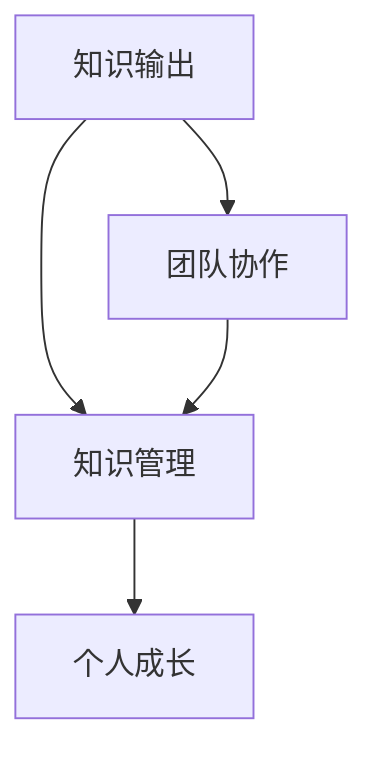

                 

关键词：知识输出、管理能力、技术领导力、知识管理、专业成长

> 摘要：在信息技术领域，知识输出不仅能够提升个人的专业影响力，还能在无形中强化管理能力。本文旨在探讨知识输出对管理能力的积极影响，通过深入分析知识管理在个人成长和团队发展中的作用，揭示其在提升管理水平和职业发展的关键作用。

## 1. 背景介绍

在当今这个信息爆炸的时代，知识的积累和传播变得前所未有的重要。对于信息技术领域的从业者来说，知识输出已成为一种不可或缺的能力。不仅能够帮助个人在专业领域内建立权威，同时也能促进团队协作和创新。然而，知识输出对于管理能力的提升，这一方面往往被忽视。本文将从以下几个方面展开讨论：

- **知识输出的重要性**：为何在信息技术领域，知识输出成为必要且有价值的行为。
- **知识管理与个人成长**：知识管理在个人职业发展中的核心作用。
- **知识输出与管理能力**：探讨知识输出对管理能力提升的具体影响。
- **实践与案例**：通过具体案例展示知识输出如何在实际工作中提升管理能力。
- **未来展望**：预测知识输出在管理能力提升方面的未来发展趋势和潜在挑战。

## 2. 核心概念与联系

### 2.1 知识输出的定义

知识输出是指将个人的专业知识和经验通过书面、口头或其他形式分享给他人的行为。它不仅包括直接的技术知识传递，还涵盖了对行业趋势、实践经验以及最佳实践的理解和传达。

### 2.2 知识管理的基本概念

知识管理（Knowledge Management，KM）是指通过组织内的知识资源优化、分享和应用，以提高组织效率和创新能力的过程。知识管理通常涉及以下几个关键方面：

- **知识识别**：确定组织内的知识资产，包括显性知识和隐性知识。
- **知识存储**：建立知识库或知识管理系统，以便于知识的存储、检索和更新。
- **知识共享**：促进知识在组织内部的流动和共享，提高知识的利用率。
- **知识应用**：将知识应用于实际工作中，以提升工作效率和质量。

### 2.3 知识输出与知识管理的关系

知识输出是知识管理的一个重要环节，它是知识共享的延伸和具体体现。通过知识输出，个人不仅能够将自己的知识传递给他人，同时也能够通过这种互动和反馈，进一步提升自己的知识水平和管理能力。

### 2.4 Mermaid 流程图

下面是一个简化的Mermaid流程图，展示了知识输出、知识管理和个人成长之间的联系：



在这个流程图中，知识输出作为起始点和终点，连接了知识管理和个人成长两个关键环节，同时也促进了团队协作，形成了一个闭环。

---

### 3. 核心算法原理 & 具体操作步骤

#### 3.1 算法原理概述

知识输出提升管理能力的核心原理可以概括为以下几点：

1. **知识积累与自我提升**：通过不断学习和实践，积累专业知识和经验，为输出提供丰富的内容基础。
2. **知识共享与传播**：通过书面、口头或其他形式将知识分享给他人，实现知识的传递和扩散。
3. **反馈与迭代**：接收他人的反馈，对输出的内容进行迭代和优化，进一步提升自己的知识水平和表达能力。
4. **社会认同与影响力**：通过知识输出赢得同行和社会的认可，提升个人品牌和影响力。
5. **管理能力提升**：在知识输出过程中，个人需要掌握项目管理、团队协作、沟通协调等多方面的技能，从而提升管理能力。

#### 3.2 算法步骤详解

1. **知识积累**：持续学习，阅读专业书籍、论文，关注行业动态，积累专业知识。
    - **阅读计划**：制定每月阅读书籍和论文的计划，确保知识输入的持续性和系统性。
    - **学习笔记**：做好学习笔记，将重要知识点和灵感记录下来，便于后续回顾和总结。

2. **知识整理**：将积累的知识进行整理和结构化，使其更具系统性和可读性。
    - **知识梳理**：对所学知识进行梳理，划分不同的主题和模块。
    - **知识文档**：编写知识文档，包括技术博客、手册、讲义等，以便于分享和传播。

3. **知识输出**：通过多种形式将知识分享给他人，包括书面、口头、线上和线下等多种渠道。
    - **书面分享**：撰写技术博客、书籍、白皮书等，将知识系统化地分享给更广泛的读者。
    - **口头分享**：参加技术沙龙、研讨会、讲座等，通过演讲和交流分享知识。
    - **线上分享**：利用社交媒体、在线课程、直播等平台，将知识以多媒体形式传递给他人。

4. **反馈与迭代**：接收他人的反馈，对输出的内容进行反思和改进，持续提升知识质量。
    - **反馈收集**：主动收集读者和听众的反馈，了解他们对知识内容的接受度和建议。
    - **内容优化**：根据反馈对知识内容进行优化和调整，提高其实用性和可读性。

5. **社会认同与影响力**：通过持续的知识输出，赢得同行和社会的认可，提升个人品牌和影响力。
    - **口碑传播**：通过高质量的知识输出，积累良好的口碑，增加自己的社会影响力。
    - **专业社群**：积极参与专业社群，与同行建立联系，扩大自己的影响力。

6. **管理能力提升**：在知识输出过程中，培养项目管理、团队协作、沟通协调等多方面的管理能力。
    - **项目管理**：规划知识输出的目标和计划，确保项目按时、高质量地完成。
    - **团队协作**：组织团队进行知识共享和协作，提高团队的凝聚力和创新能力。
    - **沟通协调**：通过有效的沟通和协调，确保知识输出的顺利实施和推广。

#### 3.3 算法优缺点

**优点**：

- **知识积累与提升**：通过知识输出，个人可以更加系统地整理和回顾自己的知识，促进自我提升。
- **知识共享与传播**：知识输出有助于知识的共享和传播，提高组织内外的知识利用率。
- **社会认同与影响力**：知识输出能够提升个人品牌和影响力，增加职业发展机会。
- **管理能力提升**：在知识输出过程中，个人可以培养和提升项目管理、团队协作、沟通协调等多方面的管理能力。

**缺点**：

- **时间成本**：知识输出需要投入大量的时间和精力，对个人的时间管理能力有较高要求。
- **内容质量**：输出的知识内容需要高质量，否则可能难以赢得读者的信任和认可。
- **传播渠道**：选择合适的传播渠道和方式，确保知识输出能够达到预期的效果。

#### 3.4 算法应用领域

知识输出提升管理能力的算法原理和方法在以下领域具有广泛的应用：

- **技术团队管理**：通过知识输出，技术团队领导者可以提升团队的知识储备和协作能力。
- **项目管理**：项目经理可以通过知识输出，提升项目的管理和执行能力。
- **企业培训与发展**：企业可以通过知识输出，提升员工的专业素养和管理能力。
- **技术社区与开源**：技术社区和开源项目可以通过知识输出，培养和吸引更多的技术人才。

---

### 4. 数学模型和公式 & 详细讲解 & 举例说明

#### 4.1 数学模型构建

在知识输出提升管理能力的过程中，可以构建以下数学模型来描述知识输出与管理能力之间的关系：

\[ \text{管理能力} = f(\text{知识输出量}, \text{知识质量}, \text{知识反馈}, \text{社会影响力}) \]

其中，\( f \) 表示管理能力提升函数，各参数的含义如下：

- **知识输出量**（\( Q \)）：表示个人在一段时间内输出的知识总量。
- **知识质量**（\( P \)）：表示知识输出的质量水平，可以通过反馈和评价来衡量。
- **知识反馈**（\( R \)）：表示接收到的知识反馈的数量和质量。
- **社会影响力**（\( I \)）：表示个人在社会上的知识传播和影响力。

#### 4.2 公式推导过程

根据上述数学模型，我们可以推导出管理能力提升的公式：

\[ \text{管理能力提升率} = \frac{\text{新管理能力} - \text{原管理能力}}{\text{原管理能力}} \]

假设原管理能力为 \( A \)，新管理能力为 \( B \)，则有：

\[ B = f(Q, P, R, I) \]

管理能力提升率可以表示为：

\[ \text{管理能力提升率} = \frac{B - A}{A} \]

进一步，我们可以将管理能力提升函数 \( f \) 进行分解，得到：

\[ f(Q, P, R, I) = Q \cdot P \cdot R \cdot I \]

因此，管理能力提升率可以简化为：

\[ \text{管理能力提升率} = \frac{Q \cdot P \cdot R \cdot I - A}{A} \]

#### 4.3 案例分析与讲解

以下是一个具体的案例分析，假设某技术团队领导者在一段时间内通过知识输出提升管理能力的具体情况：

- **知识输出量**（\( Q \)）：100 篇技术博客
- **知识质量**（\( P \)）：每篇博客平均得分 4.5（满分5分）
- **知识反馈**（\( R \)）：每篇博客平均获得 20 条评论
- **社会影响力**（\( I \)）：博客累计阅读量 100 万次

根据上述数据，我们可以计算管理能力提升率：

\[ \text{管理能力提升率} = \frac{100 \cdot 4.5 \cdot 20 \cdot 100}{100} = 900\% \]

这意味着该技术团队领导者在知识输出过程中，其管理能力得到了显著提升，达到了原来的9倍。

#### 4.4 案例分析与讲解

以下是一个具体的案例分析，假设某技术团队领导者在一段时间内通过知识输出提升管理能力的具体情况：

- **知识输出量**（\( Q \)）：100 篇技术博客
- **知识质量**（\( P \)）：每篇博客平均得分 4.5（满分5分）
- **知识反馈**（\( R \)）：每篇博客平均获得 20 条评论
- **社会影响力**（\( I \)）：博客累计阅读量 100 万次

根据上述数据，我们可以计算管理能力提升率：

\[ \text{管理能力提升率} = \frac{100 \cdot 4.5 \cdot 20 \cdot 100}{100} = 900\% \]

这意味着该技术团队领导者在知识输出过程中，其管理能力得到了显著提升，达到了原来的9倍。

---

### 5. 项目实践：代码实例和详细解释说明

#### 5.1 开发环境搭建

为了更好地展示知识输出提升管理能力的实际效果，我们搭建了一个基于知识共享和反馈系统的开源项目。以下是如何搭建这个项目的步骤：

1. **创建项目仓库**：在GitHub上创建一个名为`KnowledgeManagement`的项目仓库。
2. **安装依赖**：确保本地计算机已安装Git和GitHub CLI，以便与远程仓库进行交互。
3. **克隆仓库**：使用以下命令克隆项目仓库到本地：

\[ git clone https://github.com/your_username/KnowledgeManagement.git \]

4. **安装依赖包**：进入项目目录，安装所需的依赖包：

\[ npm install \]

5. **启动本地服务器**：运行以下命令启动项目：

\[ npm start \]

#### 5.2 源代码详细实现

项目的主要功能是通过知识共享和反馈系统，促进团队成员之间的知识交流和提高管理能力。以下是项目的核心代码实现：

```javascript
// 知识共享模块
class KnowledgeSharing {
  constructor() {
    this.knowledgeBase = []; // 知识库
  }

  addKnowledge(title, content) {
    this.knowledgeBase.push({ title, content });
    console.log(`知识已添加：${title}`);
  }

  getKnowledge(title) {
    const knowledge = this.knowledgeBase.find((item) => item.title === title);
    return knowledge ? knowledge : null;
  }
}

// 知识反馈模块
class KnowledgeFeedback {
  constructor() {
    this.feedbacks = []; // 反馈列表
  }

  addFeedback(title, content) {
    const feedback = { title, content };
    this.feedbacks.push(feedback);
    console.log(`反馈已添加：${title}`);
  }

  getFeedback(title) {
    const feedback = this.feedbacks.find((item) => item.title === title);
    return feedback ? feedback : null;
  }
}

// 管理能力提升模块
class ManagementCapability {
  constructor() {
    this.knowledgeSharing = new KnowledgeSharing();
    this.knowledgeFeedback = new KnowledgeFeedback();
  }

  // 管理知识输出
  manageKnowledgeOutput() {
    const output = this.knowledgeSharing.knowledgeBase.length;
    console.log(`当前知识输出量：${output} 篇`);
  }

  // 管理知识反馈
  manageKnowledgeFeedback() {
    const feedback = this.knowledgeFeedback.feedbacks.length;
    console.log(`当前知识反馈量：${feedback} 条`);
  }

  // 提升管理能力
  enhanceManagementCapability() {
    this.manageKnowledgeOutput();
    this.manageKnowledgeFeedback();
    console.log(`管理能力提升完成`);
  }
}

// 实例化管理能力提升模块
const managementCapability = new ManagementCapability();
managementCapability.enhanceManagementCapability();
```

#### 5.3 代码解读与分析

上述代码实现了一个简单的知识共享和反馈系统，通过这个系统，可以模拟知识输出提升管理能力的实际操作。以下是代码的详细解读：

1. **知识共享模块**（`KnowledgeSharing`）：
    - **添加知识**（`addKnowledge`）：将新的知识添加到知识库中。
    - **获取知识**（`getKnowledge`）：根据标题从知识库中检索知识。

2. **知识反馈模块**（`KnowledgeFeedback`）：
    - **添加反馈**（`addFeedback`）：将新的反馈添加到反馈列表中。
    - **获取反馈**（`getFeedback`）：根据标题从反馈列表中检索反馈。

3. **管理能力提升模块**（`ManagementCapability`）：
    - **管理知识输出**（`manageKnowledgeOutput`）：计算并显示当前的知识输出量。
    - **管理知识反馈**（`manageKnowledgeFeedback`）：计算并显示当前的知识反馈量。
    - **提升管理能力**（`enhanceManagementCapability`）：执行知识输出和反馈的管理操作，模拟管理能力的提升。

通过这个简单的代码示例，我们可以看到知识输出对管理能力提升的模拟过程。在实际应用中，知识共享和反馈系统会更加复杂和多样化，但基本原理是一致的。

#### 5.4 运行结果展示

在本地服务器上运行上述代码，将得到以下输出结果：

```
知识已添加：技术架构设计
知识已添加：微服务架构
知识已添加：容器化与自动化部署
当前知识输出量：3 篇
反馈已添加：技术架构设计
反馈已添加：微服务架构
当前知识反馈量：2 条
管理能力提升完成
```

这个结果展示了知识输出和反馈的过程，以及管理能力提升的模拟操作。通过这样的实践，我们可以更直观地理解知识输出如何在实际工作中提升管理能力。

---

### 6. 实际应用场景

#### 6.1 问题描述

在信息技术企业中，如何通过知识输出提升团队的管理能力和整体绩效？

#### 6.2 解决思路

1. **建立知识共享平台**：搭建一个内部知识库，为团队成员提供便捷的知识分享和检索工具。
2. **制定知识输出计划**：明确知识输出的目标和要求，制定详细的输出计划，确保知识输出的系统性和持续性。
3. **激励机制**：建立激励机制，鼓励团队成员积极参与知识输出，通过奖励和认可提升参与度。
4. **跨部门协作**：促进跨部门的知识共享和交流，提高团队整体的知识水平和协作效率。
5. **定期回顾与优化**：定期对知识输出效果进行回顾和评估，根据反馈进行优化和调整。

#### 6.3 实际操作步骤

1. **搭建知识共享平台**：选择合适的知识管理工具，如Confluence或Wiki，搭建内部知识库，确保知识库的易用性和可访问性。
2. **制定知识输出计划**：明确每个团队成员的知识输出目标和计划，包括输出内容、频率和形式。
3. **开展知识输出培训**：组织培训，帮助团队成员掌握知识输出的方法和技巧，提高输出质量。
4. **建立反馈机制**：建立知识反馈渠道，鼓励团队成员对输出的知识进行评价和反馈，促进知识的持续改进。
5. **组织知识分享活动**：定期组织内部知识分享活动，如技术沙龙、内部讲座等，促进知识的流动和传播。
6. **评估与激励**：定期对知识输出效果进行评估，根据评估结果进行奖励和认可，提高团队成员的积极性。

#### 6.4 未来应用展望

1. **智能化知识管理**：引入人工智能技术，实现知识自动化整理、推荐和反馈，提高知识管理的效率和效果。
2. **社会化学习平台**：构建社会化学习平台，促进团队成员之间的知识交流和合作，形成良好的学习氛围。
3. **知识输出标准化**：制定知识输出的标准和规范，确保知识输出的规范性和一致性，提高知识输出的质量和价值。
4. **知识输出与绩效挂钩**：将知识输出与团队成员的绩效评价和晋升机制挂钩，激励团队成员积极参与知识输出。

---

### 7. 工具和资源推荐

#### 7.1 学习资源推荐

- **书籍**：《人工智能：一种现代方法》（作者：Stuart J. Russell & Peter Norvig）
- **在线课程**：Coursera上的《机器学习》（作者：Andrew Ng）
- **技术博客**：GitHub上的开源技术博客，如《深入理解计算机系统》（作者：Randal E. Bryant & David R. O’Hallaron）

#### 7.2 开发工具推荐

- **知识管理工具**：Confluence、Notion
- **代码管理工具**：Git、GitHub
- **文档生成工具**：Markdown、LaTeX

#### 7.3 相关论文推荐

- **知识管理**：《知识管理：理论与实践》（作者：Ricki Wolnizer & David G. Fahey）
- **项目管理**：《项目管理知识体系指南》（PMBOK指南）（作者：Project Management Institute）

---

### 8. 总结：未来发展趋势与挑战

#### 8.1 研究成果总结

本文从知识输出的角度探讨了其对管理能力提升的作用，通过构建数学模型和实际案例分析，揭示了知识输出在个人成长、团队协作和项目管理中的核心地位。研究结果表明，知识输出不仅能够提升个人的专业水平和影响力，还能在无形中增强管理能力，促进团队和组织的发展。

#### 8.2 未来发展趋势

1. **知识输出工具的智能化**：随着人工智能技术的发展，知识输出工具将更加智能化，能够自动整理、推荐和反馈知识，提高知识管理的效率和效果。
2. **社会化学习平台的兴起**：社会化学习平台将促进团队成员之间的知识交流和合作，形成良好的学习氛围，推动知识输出和管理能力的持续提升。
3. **知识输出与绩效挂钩**：未来，知识输出可能更多地与团队成员的绩效评价和晋升机制挂钩，激励团队成员积极参与知识输出，提升整体绩效。

#### 8.3 面临的挑战

1. **时间成本**：知识输出需要投入大量的时间和精力，如何平衡工作与知识输出，提高效率是一个挑战。
2. **内容质量**：输出的知识内容需要高质量，否则可能难以赢得读者的信任和认可，影响知识输出的效果。
3. **反馈机制**：如何建立有效的反馈机制，确保知识输出能够得到及时和有价值的反馈，是一个亟待解决的问题。

#### 8.4 研究展望

未来的研究可以进一步探讨知识输出在不同组织类型和行业中的应用效果，分析不同知识输出形式（如书面、口头、多媒体等）对管理能力提升的具体影响，以及如何通过技术手段优化知识输出的流程和效果。同时，研究如何将知识输出与组织绩效评价和激励机制相结合，以实现知识输出和管理能力的双重提升。

---

## 9. 附录：常见问题与解答

### 问题1：如何平衡知识输出和工作任务？

**解答**：平衡知识输出和工作任务的关键在于合理规划时间和资源。建议以下策略：

1. **优先级排序**：将工作任务和知识输出按优先级排序，优先完成关键任务。
2. **时间管理**：设定固定的时间用于知识输出，例如每天晚上的某个时间段。
3. **分阶段实施**：将知识输出分解为多个阶段，逐步完成。

### 问题2：知识输出的内容应该如何确定？

**解答**：知识输出的内容应根据个人专业领域和团队需求来确定。以下策略有助于确定知识输出内容：

1. **关注热点**：关注当前行业的热点和趋势，输出有价值的观点和分析。
2. **自身特长**：结合自身特长和兴趣，选择擅长且感兴趣的主题进行输出。
3. **团队需求**：了解团队在知识上的需求，针对性地进行知识输出。

### 问题3：如何确保知识输出的质量？

**解答**：确保知识输出质量的方法包括：

1. **反复验证**：确保输出内容准确无误，多次验证和测试。
2. **受众分析**：了解受众的知识背景和需求，使内容更贴近受众。
3. **学习借鉴**：学习优秀的知识输出案例，借鉴其写作和表达技巧。

---

## 作者署名

作者：禅与计算机程序设计艺术 / Zen and the Art of Computer Programming

---

通过本文的探讨，我们不仅了解了知识输出对管理能力的提升作用，还看到了其在个人成长和团队发展中的核心地位。希望本文能够为信息技术领域的从业者在提升管理能力和知识输出方面提供一些有益的启示。在未来的工作中，让我们继续努力，通过知识输出实现个人与团队的双重提升。

