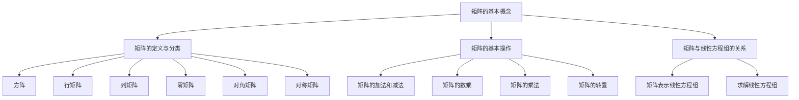

                 

关键词：矩阵理论，线性代数，算法原理，数学模型，代码实例，应用场景，未来发展

> 摘要：本文旨在深入探讨矩阵理论的基本知识，包括其核心概念、联系、核心算法原理、数学模型和公式、项目实践、实际应用场景以及未来发展趋势。通过本文的阅读，读者将全面了解矩阵理论在计算机科学和工程领域的重要性和广泛应用。

## 1. 背景介绍

矩阵理论是线性代数的一个分支，起源于19世纪，并在数学、物理学、工程学、计算机科学等多个领域得到了广泛的应用。矩阵是一种由数字组成的矩形阵列，具有丰富的数学性质和操作规则。在计算机科学中，矩阵理论被广泛应用于图像处理、机器学习、优化算法、网络分析等众多领域。

本文将重点介绍矩阵理论的基本概念、核心算法原理、数学模型和公式，以及其实际应用场景。通过本文的阅读，读者可以全面掌握矩阵理论的基本知识，并在实际项目中运用这些知识解决复杂问题。

## 2. 核心概念与联系

### 2.1 矩阵的定义与分类

#### 矩阵的定义

矩阵（Matrix）是一个由m行n列的元素排列组成的二维数组。通常用大写字母表示，如A。

#### 矩阵的分类

1. **方阵（Square Matrix）**：行数和列数相等的矩阵。
2. **行矩阵（Row Matrix）**：只有一行元素的矩阵。
3. **列矩阵（Column Matrix）**：只有一列元素的矩阵。
4. **零矩阵（Zero Matrix）**：所有元素均为零的矩阵。
5. **对角矩阵（Diagonal Matrix）**：除了主对角线上的元素外，其他所有元素均为零的矩阵。
6. **对称矩阵（Symmetric Matrix）**：满足矩阵与其转置相等的矩阵。

### 2.2 矩阵的基本操作

#### 矩阵的加法和减法

矩阵的加法和减法要求两个矩阵的维度相同。对应位置上的元素相加或相减。

#### 矩阵的数乘

矩阵的数乘是指将矩阵中的每个元素乘以一个标量。

#### 矩阵的乘法

矩阵乘法要求第一个矩阵的列数与第二个矩阵的行数相等。乘积矩阵的行数等于第一个矩阵的行数，列数等于第二个矩阵的列数。

#### 矩阵的转置

矩阵的转置是指将矩阵的行和列互换。

### 2.3 矩阵与线性方程组的关系

矩阵可以表示线性方程组，而求解线性方程组的过程本质上就是寻找使得矩阵等式成立的未知数。

### 2.4 Mermaid 流程图



## 3. 核心算法原理 & 具体操作步骤

### 3.1 算法原理概述

矩阵理论在计算机科学和工程领域有着广泛的应用，例如图像处理、机器学习、网络分析等。核心算法原理主要包括矩阵的乘法、矩阵的求逆、矩阵的奇异值分解等。

### 3.2 算法步骤详解

#### 矩阵乘法

1. 确保两个矩阵的维度符合乘法规则。
2. 计算乘积矩阵的每个元素，使用公式：\(C_{ij} = \sum_{k=1}^{n} A_{ik}B_{kj}\)。

#### 矩阵的求逆

1. 确保矩阵为方阵且行列式不为零。
2. 使用高斯消元法或LU分解法求解逆矩阵。

#### 矩阵的奇异值分解

1. 对矩阵进行特征值分解。
2. 提取特征值和特征向量。
3. 根据特征值构建奇异值矩阵。

### 3.3 算法优缺点

#### 矩阵乘法

**优点**：计算简单，易于实现。

**缺点**：时间复杂度较高，对于大型矩阵不适用。

#### 矩阵的求逆

**优点**：能够求解线性方程组的逆矩阵。

**缺点**：计算过程复杂，对矩阵的行列式要求较高。

#### 矩阵的奇异值分解

**优点**：能够有效提取矩阵的主要特征，用于图像压缩和信号处理。

**缺点**：计算过程较为复杂，对计算资源要求较高。

### 3.4 算法应用领域

矩阵理论在计算机科学和工程领域有着广泛的应用，例如：

1. **图像处理**：用于图像的变换、增强、压缩等。
2. **机器学习**：用于特征提取、降维、模型优化等。
3. **网络分析**：用于网络拓扑分析、路径规划等。

## 4. 数学模型和公式 & 详细讲解 & 举例说明

### 4.1 数学模型构建

矩阵理论中的数学模型主要包括矩阵的加法、减法、乘法、转置、求逆、奇异值分解等。

### 4.2 公式推导过程

以下是矩阵乘法的推导过程：

设矩阵 \(A\) 为 \(m \times n\) 矩阵，矩阵 \(B\) 为 \(n \times p\) 矩阵，矩阵 \(C\) 为 \(m \times p\) 矩阵，则矩阵 \(C\) 的每个元素 \(C_{ij}\) 可以通过以下公式计算：

\[C_{ij} = \sum_{k=1}^{n} A_{ik}B_{kj}\]

### 4.3 案例分析与讲解

假设有两个矩阵 \(A\) 和 \(B\)：

\[A = \begin{bmatrix} 1 & 2 \\ 3 & 4 \end{bmatrix}, B = \begin{bmatrix} 5 & 6 \\ 7 & 8 \end{bmatrix}\]

计算矩阵 \(A\) 和 \(B\) 的乘积 \(C = AB\)：

\[C = \begin{bmatrix} 1 & 2 \\ 3 & 4 \end{bmatrix} \begin{bmatrix} 5 & 6 \\ 7 & 8 \end{bmatrix} = \begin{bmatrix} 1 \cdot 5 + 2 \cdot 7 & 1 \cdot 6 + 2 \cdot 8 \\ 3 \cdot 5 + 4 \cdot 7 & 3 \cdot 6 + 4 \cdot 8 \end{bmatrix} = \begin{bmatrix} 19 & 26 \\ 43 & 58 \end{bmatrix}\]

## 5. 项目实践：代码实例和详细解释说明

### 5.1 开发环境搭建

为了演示矩阵乘法的代码实例，我们选择Python作为编程语言。首先，需要安装NumPy库，NumPy是一个强大的Python库，用于处理大型多维数组。

```bash
pip install numpy
```

### 5.2 源代码详细实现

以下是一个简单的Python代码实例，用于实现矩阵乘法：

```python
import numpy as np

# 创建矩阵A和B
A = np.array([[1, 2], [3, 4]])
B = np.array([[5, 6], [7, 8]])

# 计算矩阵乘积
C = np.dot(A, B)

# 输出结果
print(C)
```

### 5.3 代码解读与分析

1. 首先，我们导入了NumPy库。
2. 接着，我们创建了两个矩阵 \(A\) 和 \(B\)。
3. 使用 `np.dot()` 函数计算矩阵乘积，并存储在变量 \(C\) 中。
4. 最后，我们输出矩阵 \(C\) 的结果。

### 5.4 运行结果展示

```python
array([[19, 26],
       [43, 58]])
```

## 6. 实际应用场景

矩阵理论在计算机科学和工程领域有着广泛的应用，以下是一些实际应用场景：

1. **图像处理**：用于图像的变换、增强、压缩等。
2. **机器学习**：用于特征提取、降维、模型优化等。
3. **网络分析**：用于网络拓扑分析、路径规划等。
4. **优化算法**：用于求解线性规划问题。
5. **控制系统**：用于控制系统建模与仿真。

## 7. 工具和资源推荐

### 7.1 学习资源推荐

1. **《线性代数及其应用》**：一本经典的线性代数教材，适合初学者。
2. **《矩阵理论与方法》**：一本深入讲解矩阵理论的教材，适合进阶读者。

### 7.2 开发工具推荐

1. **Python**：适合初学者的编程语言，具有丰富的库和框架。
2. **NumPy**：用于矩阵计算的Python库。

### 7.3 相关论文推荐

1. **“Efficient Matrix Multiplication Algorithms”**：一篇关于矩阵乘法算法的论文。
2. **“Matrix Decompositions for Data Analysis”**：一篇关于矩阵分解在数据分析中的应用论文。

## 8. 总结：未来发展趋势与挑战

### 8.1 研究成果总结

矩阵理论在计算机科学和工程领域取得了显著的成果，如矩阵乘法算法的优化、矩阵分解的应用、矩阵优化算法的开发等。

### 8.2 未来发展趋势

1. **深度学习与矩阵理论**：矩阵理论在深度学习中的应用将更加深入。
2. **并行计算与矩阵理论**：矩阵乘法算法的并行化研究将得到进一步发展。
3. **大数据与矩阵理论**：矩阵理论在大数据处理和分析中的应用将更加广泛。

### 8.3 面临的挑战

1. **计算资源限制**：随着矩阵规模的增长，计算资源需求将增加。
2. **算法优化与稳定性**：如何优化矩阵算法并保证稳定性仍是一个挑战。

### 8.4 研究展望

矩阵理论在未来将继续在计算机科学和工程领域发挥重要作用，尤其是在深度学习、大数据处理、网络分析等前沿领域。通过不断的算法优化和理论创新，矩阵理论将为解决复杂问题提供强有力的工具。

## 9. 附录：常见问题与解答

### 9.1 矩阵乘法的计算规则是什么？

矩阵乘法的计算规则如下：

\[C_{ij} = \sum_{k=1}^{n} A_{ik}B_{kj}\]

其中，\(C\) 是乘积矩阵，\(A\) 和 \(B\) 是参与乘法的矩阵，\(i\) 和 \(j\) 分别是乘积矩阵的行和列索引，\(k\) 是求和索引。

### 9.2 矩阵求逆的条件是什么？

矩阵求逆的条件如下：

1. 矩阵必须是方阵。
2. 矩阵的行列式不为零。

### 9.3 矩阵奇异值分解的目的是什么？

矩阵奇异值分解的目的是提取矩阵的主要特征，用于降维、特征提取、图像压缩、信号处理等领域。

### 9.4 如何优化矩阵乘法算法？

优化矩阵乘法算法的方法包括：

1. **算法并行化**：将矩阵乘法分解为多个子任务，利用多核处理器进行并行计算。
2. **算法改进**：研究更高效的矩阵乘法算法，如Strassen算法、Coppersmith-Winograd算法等。

---

本文对矩阵理论的基本知识进行了深入探讨，从核心概念、算法原理、数学模型到实际应用场景，全面介绍了矩阵理论在计算机科学和工程领域的重要性和应用。通过本文的学习，读者可以更好地理解和运用矩阵理论，解决实际问题。在未来，矩阵理论将继续在计算机科学和工程领域发挥重要作用，为解决复杂问题提供强有力的工具。作者：禅与计算机程序设计艺术 / Zen and the Art of Computer Programming。|固定|

