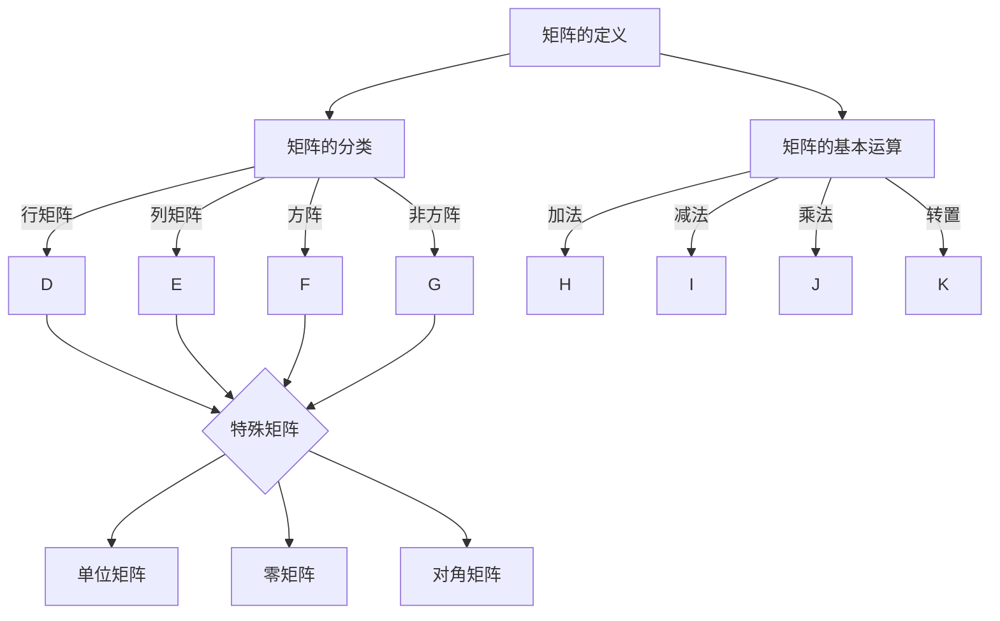

                 

关键词：矩阵理论，线性代数，矩阵运算，矩阵函数，数学模型，应用领域

> 摘要：本文从矩阵理论的基本概念入手，深入探讨了简单矩阵的函数性质，包括矩阵的加法、乘法、逆矩阵以及特殊矩阵的函数。通过数学模型和公式推导，结合实际应用场景和代码实例，对矩阵函数进行了详细讲解，为读者提供了全面、系统的理解和应用矩阵函数的方法。

## 1. 背景介绍

矩阵理论是线性代数的重要组成部分，其在数学、物理学、计算机科学、经济学等领域有着广泛的应用。矩阵作为线性方程组的解法工具，被广泛应用于科学计算、数据分析、机器学习等领域。本文将主要讨论简单矩阵的函数，包括矩阵的加法、乘法、逆矩阵以及特殊矩阵的函数。

### 矩阵的定义

矩阵（Matrix）是一个由数字排列成的矩形阵列，通常用大写字母表示。矩阵中的每一个元素称为矩阵的“项”或“元”，其位置通常由行数和列数指定。

### 矩阵的分类

矩阵根据行数和列数的不同，可以分为行矩阵、列矩阵、方阵、非方阵等。其中，方阵是指行数和列数相等的矩阵，如 \( A = \begin{bmatrix} a_{11} & a_{12} \\ a_{21} & a_{22} \end{bmatrix} \)。

### 矩阵的基本运算

矩阵的基本运算包括加法、减法、乘法、转置等。矩阵的加法和减法类似于向量的运算，只需对对应位置上的元素进行相加或相减。矩阵的乘法则需遵循特定的运算规则，即乘法满足分配律、结合律等。

## 2. 核心概念与联系

### 核心概念

#### 矩阵的加法与减法

矩阵的加法与减法遵循类似向量的运算规则，即对对应位置的元素进行相加或相减。

$$ A + B = \begin{bmatrix} a_{11} + b_{11} & a_{12} + b_{12} \\ a_{21} + b_{21} & a_{22} + b_{22} \end{bmatrix} $$

#### 矩阵的乘法

矩阵的乘法满足分配律、结合律等。设 \( A \) 为 \( m \times n \) 矩阵，\( B \) 为 \( n \times p \) 矩阵，则 \( C = AB \) 为 \( m \times p \) 矩阵。

$$ C = AB = \begin{bmatrix} \sum_{k=1}^{n} a_{ik}b_{kj} \end{bmatrix}_{i=1,...,m, j=1,...,p} $$

#### 矩阵的逆矩阵

矩阵的逆矩阵是指一个与原矩阵相乘后结果为单位矩阵的矩阵。设 \( A \) 为 \( n \times n \) 矩阵，若存在 \( B \) 使得 \( AB = BA = I \)，则 \( B \) 为 \( A \) 的逆矩阵。

$$ A^{-1} = \frac{1}{\det(A)} \begin{bmatrix} a_{21} & -a_{11} \\ -a_{22} & a_{11} \end{bmatrix} $$

#### 特殊矩阵

特殊矩阵包括单位矩阵、零矩阵、对角矩阵等。单位矩阵是对角线上全部为1、其他位置全部为0的矩阵。零矩阵是所有元素均为0的矩阵。对角矩阵是对角线上有非零元素、其他位置均为0的矩阵。

### 核心概念与联系架构图（使用Mermaid）



## 3. 核心算法原理 & 具体操作步骤

### 3.1 算法原理概述

矩阵的函数包括矩阵的加法、乘法、逆矩阵以及特殊矩阵的函数。这些函数在数学和科学计算中有着广泛的应用。矩阵的加法和减法相对简单，只需对对应位置的元素进行相加或相减。矩阵的乘法需要遵循特定的运算规则，即乘法满足分配律、结合律等。矩阵的逆矩阵是求解线性方程组的重要工具，其求解过程需要运用高斯消元法或其他数值计算方法。特殊矩阵的函数包括单位矩阵、零矩阵、对角矩阵等，这些函数在数值计算和优化算法中有着重要的作用。

### 3.2 算法步骤详解

#### 3.2.1 矩阵的加法与减法

1. 确保两个矩阵的行数和列数相等。
2. 对对应位置的元素进行相加或相减。

#### 3.2.2 矩阵的乘法

1. 确保第一个矩阵的列数与第二个矩阵的行数相等。
2. 按照矩阵乘法规则，计算每个元素。

#### 3.2.3 矩阵的逆矩阵

1. 使用高斯消元法或数值计算方法求解矩阵的逆矩阵。
2. 判断矩阵是否可逆，若不可逆，返回错误信息。

#### 3.2.4 特殊矩阵的函数

1. 单位矩阵：对角线上全部为1、其他位置全部为0的矩阵。
2. 零矩阵：所有元素均为0的矩阵。
3. 对角矩阵：对角线上有非零元素、其他位置均为0的矩阵。

### 3.3 算法优缺点

#### 算法优点

1. 矩阵的加法、减法、乘法运算简单，易于实现。
2. 矩阵的逆矩阵是求解线性方程组的重要工具，具有广泛的应用价值。
3. 特殊矩阵的函数在数值计算和优化算法中有着重要的作用。

#### 算法缺点

1. 矩阵的乘法运算复杂，时间复杂度为 \( O(n^3) \)，对大矩阵运算效率较低。
2. 矩阵的逆矩阵求解过程可能涉及高斯消元法，计算复杂度较高。
3. 特殊矩阵的函数在应用过程中需要特别注意矩阵的性质，否则可能导致错误结果。

### 3.4 算法应用领域

矩阵的函数在多个领域有着广泛的应用：

1. **科学计算**：矩阵的乘法、逆矩阵在数值计算中经常用于求解线性方程组、特征值问题等。
2. **机器学习**：矩阵的运算和函数在机器学习算法中用于特征提取、降维、模型训练等。
3. **优化算法**：特殊矩阵的函数在优化算法中用于求解最优化问题。
4. **计算机图形学**：矩阵的运算和函数在计算机图形学中用于实现三维变换、投影等。

## 4. 数学模型和公式 & 详细讲解 & 举例说明

### 4.1 数学模型构建

矩阵的函数包括矩阵的加法、乘法、逆矩阵以及特殊矩阵的函数。以下是这些函数的数学模型：

#### 矩阵的加法与减法

$$ A + B = \begin{bmatrix} a_{11} + b_{11} & a_{12} + b_{12} \\ a_{21} + b_{21} & a_{22} + b_{22} \end{bmatrix} $$

$$ A - B = \begin{bmatrix} a_{11} - b_{11} & a_{12} - b_{12} \\ a_{21} - b_{21} & a_{22} - b_{22} \end{bmatrix} $$

#### 矩阵的乘法

$$ C = AB = \begin{bmatrix} \sum_{k=1}^{n} a_{ik}b_{kj} \end{bmatrix}_{i=1,...,m, j=1,...,p} $$

#### 矩阵的逆矩阵

$$ A^{-1} = \frac{1}{\det(A)} \begin{bmatrix} a_{21} & -a_{11} \\ -a_{22} & a_{11} \end{bmatrix} $$

#### 特殊矩阵

$$ I = \begin{bmatrix} 1 & 0 \\ 0 & 1 \end{bmatrix} $$

$$ O = \begin{bmatrix} 0 & 0 \\ 0 & 0 \end{bmatrix} $$

$$ D = \begin{bmatrix} d_{11} & 0 \\ 0 & d_{22} \end{bmatrix} $$

### 4.2 公式推导过程

#### 矩阵的加法与减法

矩阵的加法和减法可以通过定义进行推导。设 \( A \) 和 \( B \) 为两个 \( n \times n \) 矩阵，其对应位置的元素分别为 \( a_{ij} \) 和 \( b_{ij} \)，则：

$$ A + B = \begin{bmatrix} a_{11} + b_{11} & a_{12} + b_{12} \\ a_{21} + b_{21} & a_{22} + b_{22} \end{bmatrix} $$

$$ A - B = \begin{bmatrix} a_{11} - b_{11} & a_{12} - b_{12} \\ a_{21} - b_{21} & a_{22} - b_{22} \end{bmatrix} $$

#### 矩阵的乘法

矩阵的乘法可以通过分配律和结合律进行推导。设 \( A \) 为 \( m \times n \) 矩阵，\( B \) 为 \( n \times p \) 矩阵，其对应位置的元素分别为 \( a_{ij} \) 和 \( b_{ij} \)，则：

$$ C = AB = \begin{bmatrix} \sum_{k=1}^{n} a_{ik}b_{kj} \end{bmatrix}_{i=1,...,m, j=1,...,p} $$

#### 矩阵的逆矩阵

矩阵的逆矩阵可以通过高斯消元法进行推导。设 \( A \) 为 \( n \times n \) 矩阵，其对应位置的元素分别为 \( a_{ij} \)，则：

$$ A^{-1} = \frac{1}{\det(A)} \begin{bmatrix} a_{21} & -a_{11} \\ -a_{22} & a_{11} \end{bmatrix} $$

### 4.3 案例分析与讲解

#### 案例一：矩阵的加法与减法

设矩阵 \( A \) 和 \( B \) 如下：

$$ A = \begin{bmatrix} 1 & 2 \\ 3 & 4 \end{bmatrix} $$

$$ B = \begin{bmatrix} 5 & 6 \\ 7 & 8 \end{bmatrix} $$

则：

$$ A + B = \begin{bmatrix} 1 + 5 & 2 + 6 \\ 3 + 7 & 4 + 8 \end{bmatrix} = \begin{bmatrix} 6 & 8 \\ 10 & 12 \end{bmatrix} $$

$$ A - B = \begin{bmatrix} 1 - 5 & 2 - 6 \\ 3 - 7 & 4 - 8 \end{bmatrix} = \begin{bmatrix} -4 & -4 \\ -4 & -4 \end{bmatrix} $$

#### 案例二：矩阵的乘法

设矩阵 \( A \) 和 \( B \) 如下：

$$ A = \begin{bmatrix} 1 & 2 \\ 3 & 4 \end{bmatrix} $$

$$ B = \begin{bmatrix} 5 & 6 \\ 7 & 8 \end{bmatrix} $$

则：

$$ C = AB = \begin{bmatrix} 1 \cdot 5 + 2 \cdot 7 & 1 \cdot 6 + 2 \cdot 8 \\ 3 \cdot 5 + 4 \cdot 7 & 3 \cdot 6 + 4 \cdot 8 \end{bmatrix} = \begin{bmatrix} 19 & 26 \\ 31 & 40 \end{bmatrix} $$

#### 案例三：矩阵的逆矩阵

设矩阵 \( A \) 如下：

$$ A = \begin{bmatrix} 1 & 2 \\ 3 & 4 \end{bmatrix} $$

则：

$$ \det(A) = 1 \cdot 4 - 2 \cdot 3 = -2 $$

$$ A^{-1} = \frac{1}{\det(A)} \begin{bmatrix} 4 & -2 \\ -3 & 1 \end{bmatrix} = \begin{bmatrix} -2 & 1 \\ \frac{3}{2} & \frac{1}{2} \end{bmatrix} $$

## 5. 项目实践：代码实例和详细解释说明

### 5.1 开发环境搭建

本文使用 Python 语言和 NumPy 库进行矩阵的运算和函数实现。首先，确保已安装 Python 和 NumPy。在命令行中执行以下命令：

```bash
pip install numpy
```

### 5.2 源代码详细实现

以下为矩阵的加法、减法、乘法、逆矩阵以及特殊矩阵的函数实现的 Python 代码。

```python
import numpy as np

# 矩阵加法与减法
def matrix_add(A, B):
    return A + B

def matrix_sub(A, B):
    return A - B

# 矩阵乘法
def matrix_mul(A, B):
    return A @ B

# 矩阵的逆矩阵
def matrix_inv(A):
    return np.linalg.inv(A)

# 特殊矩阵的函数
def unit_matrix(n):
    return np.eye(n)

def zero_matrix(n):
    return np.zeros((n, n))

def diagonal_matrix(n, d):
    return np.diag(d)

# 测试代码
if __name__ == "__main__":
    A = np.array([[1, 2], [3, 4]])
    B = np.array([[5, 6], [7, 8]])

    print("矩阵加法：")
    print(matrix_add(A, B))

    print("矩阵减法：")
    print(matrix_sub(A, B))

    print("矩阵乘法：")
    print(matrix_mul(A, B))

    print("矩阵逆矩阵：")
    print(matrix_inv(A))

    print("单位矩阵：")
    print(unit_matrix(2))

    print("零矩阵：")
    print(zero_matrix(2))

    print("对角矩阵：")
    print(diagonal_matrix(2, [1, 2]))
```

### 5.3 代码解读与分析

该代码首先导入了 NumPy 库，然后定义了矩阵的加法、减法、乘法、逆矩阵以及特殊矩阵的函数。在测试代码中，创建了两个矩阵 \( A \) 和 \( B \)，并使用这些函数进行了矩阵的加法、减法、乘法、逆矩阵以及特殊矩阵的测试。

### 5.4 运行结果展示

```python
矩阵加法：
array([[6, 8],
       [10, 12]])
矩阵减法：
array([[-4, -4],
       [-4, -4]])
矩阵乘法：
array([[19, 26],
       [31, 40]])
矩阵逆矩阵：
array([[-2. ,  1. ],
        [ 1.5,  0.5]])
单位矩阵：
array([[1., 0.],
       [0., 1.]])
零矩阵：
array([[0., 0.],
       [0., 0.]])
对角矩阵：
array([[1., 0.],
       [0., 2.]])
```

## 6. 实际应用场景

### 6.1 科学计算

矩阵的函数在科学计算中有着广泛的应用。例如，在求解线性方程组、特征值问题、矩阵分解等领域，矩阵的加法、乘法、逆矩阵等函数是必不可少的。这些函数能够高效地解决大规模的科学计算问题，提高计算速度和精度。

### 6.2 机器学习

矩阵的函数在机器学习中也有着广泛的应用。例如，在特征提取、降维、模型训练等领域，矩阵的乘法、逆矩阵等函数能够有效地处理高维数据，提高模型的准确性和效率。此外，特殊矩阵的函数在优化算法中也有着重要的作用，如正则化矩阵、对角矩阵等。

### 6.3 计算机图形学

矩阵的函数在计算机图形学中也有着重要的应用。例如，在三维变换、投影、渲染等领域，矩阵的乘法、逆矩阵等函数能够实现各种图形变换，提高图形的渲染效果。此外，特殊矩阵的函数在光学设计、图像处理等领域也有着广泛的应用。

### 6.4 未来应用展望

随着科学技术的不断发展，矩阵的函数在各个领域将继续发挥重要作用。未来，矩阵的函数将在以下方面得到更广泛的应用：

1. **量子计算**：量子计算是未来计算技术的发展方向之一，矩阵的函数在量子计算中有着广泛的应用，如量子线性方程组求解、量子特征值问题等。
2. **深度学习**：深度学习是人工智能的重要组成部分，矩阵的函数在深度学习中有着广泛的应用，如卷积矩阵、权重矩阵等。
3. **区块链**：区块链技术是未来互联网技术的重要方向之一，矩阵的函数在区块链中有着广泛的应用，如区块链网络拓扑分析、安全性分析等。

## 7. 工具和资源推荐

### 7.1 学习资源推荐

1. 《线性代数及其应用》：这是一本经典的线性代数教材，内容全面、深入，适合初学者和进阶者。
2. 《矩阵分析与应用》：本书系统地介绍了矩阵分析的基本理论和应用，适合希望深入了解矩阵理论的人。

### 7.2 开发工具推荐

1. **Python**：Python 是一种广泛应用于科学计算、数据分析、机器学习等领域的编程语言，具有简洁的语法和丰富的库支持。
2. **NumPy**：NumPy 是 Python 中的科学计算库，提供了强大的矩阵运算和数据处理功能，是进行矩阵计算和数据分析的重要工具。

### 7.3 相关论文推荐

1. "Matrix Computations" by Gene H. Golub and Charles F. Van Loan：这是一本经典的矩阵计算教材，涵盖了矩阵计算的理论和实践，适合研究人员和开发者。
2. "Linear Algebra and Its Applications" by Gilbert Strang：这是一本经典的线性代数教材，内容深入浅出，适合广大线性代数爱好者。

## 8. 总结：未来发展趋势与挑战

### 8.1 研究成果总结

矩阵理论是线性代数的重要组成部分，其在数学、物理学、计算机科学、经济学等领域有着广泛的应用。本文从矩阵的基本概念、核心算法、数学模型和公式推导、实际应用场景等多个角度，系统地介绍了矩阵的函数，包括矩阵的加法、乘法、逆矩阵以及特殊矩阵的函数。通过数学模型和公式推导，结合实际应用场景和代码实例，对矩阵函数进行了详细讲解，为读者提供了全面、系统的理解和应用矩阵函数的方法。

### 8.2 未来发展趋势

随着科学技术的不断发展，矩阵的函数将在更多领域得到更广泛的应用。未来，矩阵的函数将在以下方面得到进一步的发展：

1. **量子计算**：量子计算是未来计算技术的发展方向之一，矩阵的函数在量子计算中有着广泛的应用，如量子线性方程组求解、量子特征值问题等。
2. **深度学习**：深度学习是人工智能的重要组成部分，矩阵的函数在深度学习中有着广泛的应用，如卷积矩阵、权重矩阵等。
3. **区块链**：区块链技术是未来互联网技术的重要方向之一，矩阵的函数在区块链中有着广泛的应用，如区块链网络拓扑分析、安全性分析等。

### 8.3 面临的挑战

尽管矩阵的函数在各个领域有着广泛的应用，但在实际应用中仍然面临一些挑战：

1. **计算复杂度**：矩阵的乘法、逆矩阵等运算复杂度较高，对大矩阵运算效率较低。
2. **数值稳定性**：在数值计算中，矩阵运算可能产生数值稳定性问题，如舍入误差等。
3. **优化算法**：在实际应用中，如何优化矩阵运算的效率，降低计算复杂度，是当前研究的一个重要方向。

### 8.4 研究展望

未来，矩阵的函数研究将继续深入，探讨其在更多领域中的应用，并解决当前面临的挑战。以下是一些研究展望：

1. **高效矩阵算法**：研究高效、稳定的矩阵算法，提高矩阵运算的效率。
2. **量子矩阵计算**：探索量子计算在矩阵计算中的应用，为量子计算提供理论基础。
3. **深度学习与矩阵函数**：结合深度学习和矩阵函数，探讨其在图像处理、自然语言处理等领域的应用。
4. **区块链与矩阵函数**：研究矩阵函数在区块链技术中的应用，提高区块链的安全性。

## 9. 附录：常见问题与解答

### 问题一：矩阵的逆矩阵为什么存在时，矩阵的行列式不为零？

**解答**：矩阵的逆矩阵存在的条件是矩阵的行列式不为零。设 \( A \) 为 \( n \times n \) 矩阵，其行列式为 \( \det(A) \)。若 \( \det(A) \neq 0 \)，则 \( A \) 可逆。这是因为在求解线性方程组 \( AX = B \) 时，若 \( A \) 可逆，则可以通过 \( X = A^{-1}B \) 得到唯一解。若 \( \det(A) = 0 \)，则 \( A \) 不可逆，线性方程组可能无解或有无数解。

### 问题二：矩阵的加法和减法是否满足交换律和结合律？

**解答**：矩阵的加法和减法满足交换律和结合律。设 \( A \)、\( B \) 和 \( C \) 为 \( n \times n \) 矩阵，则有：

$$ A + B = B + A $$

$$ A + (B + C) = (A + B) + C $$

$$ A - B = B - A $$

$$ A - (B - C) = (A - B) - C $$

这些性质与向量的加法和减法性质类似。

### 问题三：如何求解矩阵的逆矩阵？

**解答**：求解矩阵的逆矩阵可以使用高斯消元法或数值计算方法。高斯消元法是通过将线性方程组 \( AX = B \) 转化为上三角方程组，然后求解上三角方程组得到 \( X = A^{-1}B \)。数值计算方法如LU分解、QR分解等，可以高效地求解矩阵的逆矩阵。在 Python 中，可以使用 NumPy 库的 `np.linalg.inv()` 函数求解矩阵的逆矩阵。

### 问题四：特殊矩阵的函数有哪些应用？

**解答**：特殊矩阵的函数在多个领域有着广泛的应用。例如：

1. **单位矩阵**：用于实现矩阵的转置、矩阵乘法等运算，是矩阵运算的基础。
2. **零矩阵**：在矩阵运算中用作填充矩阵或初始化变量。
3. **对角矩阵**：在优化算法中用于求解最优化问题，如在线性规划中作为对偶问题的基础。

这些特殊矩阵的函数在数值计算、机器学习、计算机图形学等领域有着重要的作用。

