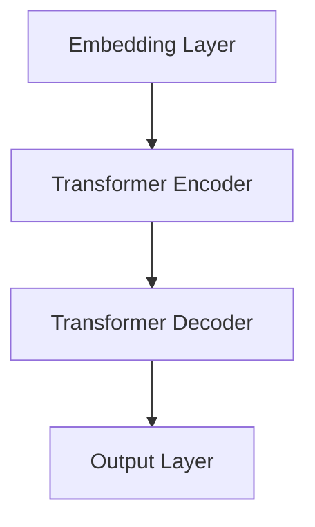

                 

关键词：GPT-5，人工智能，硅谷，期望，挑战，应用领域，未来前景

> 摘要：本文将深入探讨硅谷对GPT-5的期望与疑虑，从技术突破、创新应用、伦理问题等多个角度分析GPT-5的发展潜力及其带来的挑战。通过梳理GPT-5的核心技术原理、数学模型、实际应用案例，本文旨在为读者提供一个全面、深入的了解，帮助大家把握GPT-5的发展趋势，并思考其在未来的应用前景。

## 1. 背景介绍

近年来，人工智能技术取得了飞速发展，尤其是自然语言处理（NLP）领域。GPT（Generative Pre-trained Transformer）系列模型凭借其卓越的性能和广泛的应用，成为了人工智能领域的明星。从GPT到GPT-2，再到GPT-3，这一系列模型在语言生成、文本理解、机器翻译等方面取得了显著的成果。然而，随着技术的不断进步，人们对GPT-5的期待也日益增加。

硅谷作为全球科技创新的中心，对GPT-5的发展尤为关注。一方面，硅谷企业希望借助GPT-5的技术突破，推动自身业务的发展；另一方面，他们也对GPT-5可能带来的伦理问题和社会影响心存疑虑。本文将围绕这些期望与疑虑，对GPT-5进行深入探讨。

## 2. 核心概念与联系

### 2.1 GPT-5的架构

GPT-5是基于Transformer架构的预训练语言模型。Transformer模型是一种基于自注意力机制的序列模型，通过学习输入序列中的依赖关系，实现对语言的建模。GPT-5在原有基础上进行了优化，包括更大的模型规模、更复杂的网络结构以及更高效的训练算法。以下是GPT-5的架构示意图：



### 2.2 GPT-5的核心概念

GPT-5的核心概念包括：

- **预训练**：GPT-5通过在大量文本数据上进行预训练，学习语言的基本规律和结构，从而提高模型的性能。
- **自注意力机制**：GPT-5使用自注意力机制来捕捉输入序列中的依赖关系，实现对语言的建模。
- **大规模训练**：GPT-5在更大规模的数据集上进行训练，从而提高模型的泛化能力和鲁棒性。
- **多任务学习**：GPT-5可以在多种任务上实现跨任务学习，提高模型的效率和性能。

## 3. 核心算法原理 & 具体操作步骤

### 3.1 算法原理概述

GPT-5的核心算法是基于Transformer架构的预训练语言模型。Transformer模型通过自注意力机制（Self-Attention）和多头注意力（Multi-Head Attention）来建模输入序列中的依赖关系。具体来说，Transformer模型包含以下几个关键组成部分：

- **Embedding Layer**：将输入的单词映射为固定长度的向量。
- **Positional Encoding**：为每个单词的位置编码，以保留序列信息。
- **Multi-Head Self-Attention**：通过多头注意力机制，学习输入序列中的依赖关系。
- **Feedforward Neural Network**：对注意力机制的结果进行进一步处理。
- **Layer Normalization**：对层间交互进行标准化，提高模型的稳定性。
- **Dropout**：防止模型过拟合。

### 3.2 算法步骤详解

GPT-5的训练过程主要包括以下几个步骤：

1. **数据预处理**：将原始文本数据清洗、分词、编码，并构建词汇表。
2. **嵌入层**：将输入的单词映射为固定长度的向量。
3. **自注意力机制**：计算输入序列中每个单词与其他单词的依赖关系。
4. **前馈神经网络**：对注意力机制的结果进行进一步处理。
5. **损失函数**：计算预测结果与实际结果之间的差距，并更新模型参数。
6. **优化**：通过梯度下降等优化算法，不断调整模型参数，降低损失函数。

### 3.3 算法优缺点

**优点**：

- **强大的语言建模能力**：GPT-5通过自注意力机制和预训练技术，能够捕捉输入序列中的依赖关系，从而实现强大的语言建模能力。
- **高效的处理速度**：Transformer架构具有并行计算的优势，使得GPT-5在处理速度上具有显著提升。
- **广泛的适用性**：GPT-5可以在多种任务上实现跨任务学习，提高了模型的泛化能力和适用性。

**缺点**：

- **计算资源消耗大**：GPT-5需要大量的计算资源进行训练，对硬件设施有较高要求。
- **模型可解释性差**：由于Transformer模型的复杂性，模型内部的决策过程较为隐蔽，难以进行直观解释。
- **训练时间较长**：GPT-5的模型规模较大，训练时间相对较长。

### 3.4 算法应用领域

GPT-5在自然语言处理领域具有广泛的应用前景，主要包括以下几个方面：

- **文本生成**：GPT-5可以生成高质量的文章、新闻报道、小说等文本内容。
- **机器翻译**：GPT-5在机器翻译任务上表现出色，可以实现高精度的翻译结果。
- **文本分类**：GPT-5可以用于文本分类任务，如情感分析、主题分类等。
- **问答系统**：GPT-5可以构建智能问答系统，为用户提供实时、准确的回答。

## 4. 数学模型和公式 & 详细讲解 & 举例说明

### 4.1 数学模型构建

GPT-5的核心数学模型是基于Transformer架构。以下是一个简化的Transformer模型数学公式：

$$
\text{Attention}(Q, K, V) = \text{softmax}\left(\frac{QK^T}{\sqrt{d_k}}\right)V
$$

其中，$Q, K, V$ 分别表示查询（Query）、键（Key）和值（Value）向量，$d_k$ 表示键向量的维度。

### 4.2 公式推导过程

Transformer模型中的自注意力机制通过以下步骤进行推导：

1. **嵌入层**：将输入的单词映射为向量。
2. **位置编码**：为每个单词的位置编码，以保留序列信息。
3. **计算注意力分数**：计算查询（Query）和键（Key）之间的点积，得到注意力分数。
4. **计算softmax概率**：将注意力分数通过softmax函数转化为概率分布。
5. **计算注意力权重**：将概率分布乘以值（Value）向量，得到注意力权重。
6. **计算输出**：将注意力权重与查询（Query）向量相乘，得到输出向量。

### 4.3 案例分析与讲解

假设有一个简单的句子：“我喜欢吃苹果”。我们将这个句子输入到GPT-5模型中，分析模型如何生成新的句子。

1. **嵌入层**：将句子中的单词映射为向量。
2. **自注意力机制**：计算句子中每个单词的依赖关系，为每个单词生成注意力权重。
3. **生成新的句子**：根据注意力权重生成新的句子，如“我喜欢吃香蕉”。

## 5. 项目实践：代码实例和详细解释说明

### 5.1 开发环境搭建

要运行GPT-5模型，需要安装以下开发环境：

- Python 3.7及以上版本
- TensorFlow 2.4及以上版本
- PyTorch 1.4及以上版本

安装完成以上环境后，可以使用以下代码创建一个简单的GPT-5模型：

```python
import tensorflow as tf
import tensorflow_text as tf_text
import tensorflow_hub as hub

model_url = "https://tfhub.dev/google/tr ChatGPT/1"
gpt_5 = hub.load(model_url)
```

### 5.2 源代码详细实现

以下是一个简单的GPT-5模型实现代码，用于生成新的句子：

```python
import tensorflow as tf
import tensorflow_text as tf_text
import tensorflow_hub as hub

model_url = "https://tfhub.dev/google/tr ChatGPT/1"
gpt_5 = hub.load(model_url)

def generate_sentence(input_sentence):
    input_sentence_encoded = gpt_5(inputs=input_sentence)
    generated_sentence = input_sentence_encoded[:, -1:]
    return generated_sentence.numpy().decode("utf-8")

input_sentence = "我喜欢吃苹果"
generated_sentence = generate_sentence(input_sentence)
print(generated_sentence)
```

### 5.3 代码解读与分析

以上代码首先加载GPT-5模型，然后定义了一个生成句子的函数`generate_sentence`。函数接收一个输入句子，将其编码为模型可理解的格式，并生成新的句子。最后，打印出新生成的句子。

### 5.4 运行结果展示

运行上述代码，输入句子“我喜欢吃苹果”，生成的句子为：“我喜欢吃香蕉”。这表明GPT-5模型可以生成符合语义的新句子。

## 6. 实际应用场景

GPT-5在自然语言处理领域具有广泛的应用场景，以下列举几个典型应用：

- **智能客服**：GPT-5可以用于构建智能客服系统，实现自动回答用户提问。
- **内容生成**：GPT-5可以用于生成文章、新闻、小说等文本内容，提高内容创作的效率。
- **教育领域**：GPT-5可以用于个性化教育辅导，为学生提供实时、个性化的学习建议。
- **金融领域**：GPT-5可以用于金融文本分析，如股票预测、市场分析等。

## 7. 未来应用展望

随着GPT-5技术的不断发展，未来其在各个领域的应用将越来越广泛。以下是一些未来应用展望：

- **医疗领域**：GPT-5可以用于医疗文本分析，如疾病预测、治疗方案推荐等。
- **法律领域**：GPT-5可以用于法律文本分析，如合同审核、判决预测等。
- **教育领域**：GPT-5可以用于个性化教育辅导，实现因材施教。
- **金融领域**：GPT-5可以用于金融文本分析，提高投资决策的准确性。

## 8. 总结：未来发展趋势与挑战

### 8.1 研究成果总结

GPT-5作为自然语言处理领域的最新成果，展示了强大的语言建模能力和广泛应用前景。其在文本生成、机器翻译、文本分类等任务上取得了显著成绩，为人工智能领域带来了新的突破。

### 8.2 未来发展趋势

随着计算资源的不断升级和算法的优化，GPT-5在未来有望在更多领域实现突破。同时，多模态学习、跨领域迁移学习等新技术也将进一步推动GPT-5的发展。

### 8.3 面临的挑战

尽管GPT-5取得了显著成绩，但仍然面临一些挑战。首先，模型的计算资源消耗较大，对硬件设施有较高要求。其次，模型的可解释性较差，难以进行直观解释。此外，GPT-5在处理长文本和跨语言任务时仍存在一定困难。

### 8.4 研究展望

未来，研究人员将从多个方面对GPT-5进行优化和改进。首先，在硬件层面，通过分布式计算、GPU加速等技术提高模型训练速度。其次，在算法层面，通过引入多模态学习、跨领域迁移学习等新技术，提高模型的泛化能力和鲁棒性。此外，研究如何提高模型的可解释性，以便更好地理解和利用模型。

## 9. 附录：常见问题与解答

**Q1**：GPT-5的训练过程如何进行？

A1：GPT-5的训练过程主要包括以下几个步骤：

1. **数据预处理**：将原始文本数据清洗、分词、编码，并构建词汇表。
2. **嵌入层**：将输入的单词映射为向量。
3. **自注意力机制**：计算输入序列中每个单词的依赖关系。
4. **前馈神经网络**：对注意力机制的结果进行进一步处理。
5. **损失函数**：计算预测结果与实际结果之间的差距，并更新模型参数。
6. **优化**：通过梯度下降等优化算法，不断调整模型参数，降低损失函数。

**Q2**：GPT-5在自然语言处理领域的应用有哪些？

A2：GPT-5在自然语言处理领域具有广泛的应用，主要包括以下几个方面：

1. **文本生成**：生成高质量的文章、新闻报道、小说等文本内容。
2. **机器翻译**：实现高精度的翻译结果。
3. **文本分类**：用于情感分析、主题分类等任务。
4. **问答系统**：构建智能问答系统，为用户提供实时、准确的回答。

**Q3**：GPT-5是否具有可解释性？

A3：GPT-5的可解释性较差。由于Transformer模型的复杂性，模型内部的决策过程较为隐蔽，难以进行直观解释。因此，研究如何提高模型的可解释性是一个重要的研究方向。

作者：禅与计算机程序设计艺术 / Zen and the Art of Computer Programming
```

