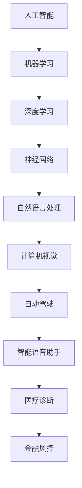

                 

关键词：人工智能，贾扬清，硅谷，产品落地，基础研究，技术创新，行业动态

## 摘要

本文旨在探讨硅谷人工智能领域的最新动态，特别是在产品落地与基础研究并重的大背景下。通过深入分析贾扬清的观点和观察，本文揭示了当前人工智能行业的发展趋势、面临的挑战以及未来可能的方向。文章结构分为背景介绍、核心概念与联系、核心算法原理与操作步骤、数学模型与公式、项目实践、实际应用场景、工具和资源推荐、总结与展望等部分，旨在为读者提供全面而深入的见解。

## 1. 背景介绍

近年来，人工智能（AI）技术在全球范围内得到了迅猛发展，尤其是在硅谷，这一现象尤为显著。硅谷作为全球科技创新的源泉，吸引了无数顶尖人才和企业，他们共同推动了人工智能领域的创新和进步。贾扬清，作为一位世界级人工智能专家，他在硅谷的观察和参与为我们提供了宝贵的视角。

在硅谷，人工智能的应用不仅限于学术研究，更在产品落地中发挥着重要作用。从自动驾驶、智能语音助手到医疗诊断、金融风控，人工智能已经深入到各个行业，改变了我们的生活方式和工作方式。然而，在这一过程中，如何平衡产品落地与基础研究成为了业界关注的焦点。

贾扬清指出，当前硅谷人工智能的发展呈现出两个主要趋势：一是技术创新的不断加速，二是产品落地的实践需求日益强烈。这两个趋势相互交织，共同推动着人工智能行业的蓬勃发展。本文将围绕这两个趋势，深入探讨硅谷人工智能领域的现状和未来。

## 2. 核心概念与联系

在深入讨论硅谷人工智能的动态之前，有必要明确一些核心概念和它们之间的联系。以下是几个关键概念及其相互关系的Mermaid流程图：



### 2.1 人工智能

人工智能（AI）是模拟、延伸和扩展人类智能的理论、方法、技术及应用。它涵盖了多个子领域，包括机器学习、深度学习、神经网络、自然语言处理、计算机视觉等。

### 2.2 机器学习

机器学习是人工智能的一个重要分支，它通过算法和统计模型，从数据中自动学习和改进性能。机器学习广泛应用于图像识别、语音识别、预测分析等领域。

### 2.3 深度学习

深度学习是机器学习的一个子领域，它利用多层神经网络模拟人脑的学习机制。深度学习在图像识别、语音识别、自然语言处理等方面取得了显著成果。

### 2.4 神经网络

神经网络是模仿生物神经系统的计算模型。在深度学习中，神经网络被广泛使用，用于处理复杂的非线性问题。

### 2.5 自然语言处理

自然语言处理（NLP）是使计算机能够理解和生成人类语言的技术。它涉及语音识别、文本分析、机器翻译等领域。

### 2.6 计算机视觉

计算机视觉是使计算机能够从图像或视频中提取信息的技术。它广泛应用于图像识别、自动驾驶、医疗诊断等领域。

### 2.7 自动驾驶

自动驾驶技术利用计算机视觉、机器学习和传感器数据，实现车辆自主导航和安全驾驶。

### 2.8 智能语音助手

智能语音助手通过自然语言处理和语音识别技术，为用户提供语音交互服务，如智能音箱、语音助手等。

### 2.9 医疗诊断

医疗诊断利用人工智能技术，辅助医生进行疾病诊断和治疗。它包括影像诊断、病理诊断等。

### 2.10 金融风控

金融风控利用人工智能技术，识别和防范金融风险，如欺诈检测、信用评估等。

这些概念相互联系，共同构成了人工智能技术的生态体系。了解这些概念及其联系，有助于我们更好地理解硅谷人工智能的发展动态。

## 3. 核心算法原理 & 具体操作步骤

### 3.1 算法原理概述

人工智能的核心在于算法，而深度学习是当前最为热门和有效的算法之一。深度学习通过多层神经网络，模拟人类大脑的学习过程，从而实现复杂模式识别和预测任务。以下是深度学习算法的基本原理：

- **输入层（Input Layer）**：接收输入数据，如图像、文本等。
- **隐藏层（Hidden Layer）**：对输入数据进行处理和变换，通过激活函数将非线性特征提取出来。
- **输出层（Output Layer）**：根据隐藏层的结果，输出最终预测结果。

### 3.2 算法步骤详解

#### 数据预处理

在开始训练模型之前，需要对输入数据进行预处理，包括归一化、标准化、缺失值填充等步骤，以确保数据的质量和一致性。

#### 模型构建

构建深度学习模型的过程包括以下步骤：

1. **定义网络结构**：确定输入层、隐藏层和输出层的数量和神经元个数。
2. **选择激活函数**：如ReLU、Sigmoid、Tanh等，用于引入非线性特性。
3. **初始化参数**：随机初始化权重和偏置，以确保模型的训练过程能够收敛。

#### 模型训练

模型训练是通过不断调整网络参数，使其在训练数据上的预测结果更加准确。训练过程包括以下步骤：

1. **前向传播（Forward Propagation）**：将输入数据传递到网络中，计算输出结果。
2. **计算损失（Compute Loss）**：通过比较预测结果和真实结果的差异，计算损失函数。
3. **反向传播（Back Propagation）**：根据损失函数，反向更新网络参数。

#### 模型评估

在模型训练完成后，需要对其性能进行评估。常用的评估指标包括准确率、召回率、F1值等。

### 3.3 算法优缺点

#### 优点

- **强大的泛化能力**：深度学习能够自动提取复杂特征，具有强大的泛化能力。
- **高度自动化**：训练过程高度自动化，减少了人工干预。
- **高性能**：深度学习模型在图像识别、语音识别等任务上取得了显著成果。

#### 缺点

- **数据需求大**：深度学习需要大量的标注数据进行训练，对数据质量和数量有较高要求。
- **计算资源消耗大**：训练深度学习模型需要大量的计算资源和时间。

### 3.4 算法应用领域

深度学习在众多领域都有广泛应用，包括：

- **图像识别**：如人脸识别、车辆识别等。
- **自然语言处理**：如机器翻译、文本分类等。
- **计算机视觉**：如自动驾驶、医疗影像分析等。
- **语音识别**：如智能语音助手、语音翻译等。

## 4. 数学模型和公式 & 详细讲解 & 举例说明

### 4.1 数学模型构建

深度学习中的数学模型主要基于微积分、线性代数和概率统计。以下是一个简单的多层感知机（MLP）的数学模型：

$$
y = \sigma(W_2 \cdot \sigma(W_1 \cdot x + b_1) + b_2)
$$

其中，$y$为输出，$x$为输入，$W_1$和$W_2$为权重矩阵，$b_1$和$b_2$为偏置，$\sigma$为激活函数。

### 4.2 公式推导过程

多层感知机的推导过程如下：

1. **前向传播**：

   $$z_1 = W_1 \cdot x + b_1$$

   $$a_1 = \sigma(z_1)$$

   $$z_2 = W_2 \cdot a_1 + b_2$$

   $$y = \sigma(z_2)$$

2. **反向传播**：

   $$\delta_2 = \frac{\partial J}{\partial z_2} = \frac{\partial J}{\partial y} \cdot \frac{\partial y}{\partial z_2} = (y - \hat{y}) \cdot \sigma'(z_2)$$

   $$\delta_1 = \frac{\partial J}{\partial z_1} = \frac{\partial J}{\partial z_2} \cdot \frac{\partial z_2}{\partial z_1} = W_2^T \cdot \delta_2 \cdot \sigma'(z_1)$$

### 4.3 案例分析与讲解

假设我们有一个简单的多层感知机模型，用于分类任务。输入层有3个神经元，隐藏层有4个神经元，输出层有2个神经元。激活函数使用ReLU。

#### 数据准备

输入数据$x$为：

$$
x = \begin{bmatrix}
0.1 & 0.2 & 0.3 \\
0.4 & 0.5 & 0.6 \\
\end{bmatrix}
$$

标签数据$y$为：

$$
y = \begin{bmatrix}
1 \\
0 \\
\end{bmatrix}
$$

#### 模型构建

假设权重矩阵$W_1$和$W_2$分别为：

$$
W_1 = \begin{bmatrix}
0.2 & 0.3 & 0.4 \\
0.5 & 0.6 & 0.7 \\
0.8 & 0.9 & 1.0 \\
\end{bmatrix}
$$

$$
W_2 = \begin{bmatrix}
0.1 & 0.2 \\
0.3 & 0.4 \\
0.5 & 0.6 \\
\end{bmatrix}
$$

偏置$b_1$和$b_2$分别为：

$$
b_1 = \begin{bmatrix}
0.1 \\
0.2 \\
0.3 \\
0.4 \\
\end{bmatrix}
$$

$$
b_2 = \begin{bmatrix}
0.1 \\
0.2 \\
0.3 \\
\end{bmatrix}
$$

#### 前向传播

首先计算隐藏层的输出：

$$
z_1 = W_1 \cdot x + b_1 = \begin{bmatrix}
0.2 & 0.3 & 0.4 \\
0.5 & 0.6 & 0.7 \\
0.8 & 0.9 & 1.0 \\
\end{bmatrix} \cdot \begin{bmatrix}
0.1 \\
0.4 \\
0.6 \\
\end{bmatrix} + \begin{bmatrix}
0.1 \\
0.2 \\
0.3 \\
0.4 \\
\end{bmatrix} = \begin{bmatrix}
0.51 \\
1.31 \\
1.89 \\
\end{bmatrix}
$$

$$
a_1 = \sigma(z_1) = \begin{bmatrix}
0.51 \\
1.31 \\
1.89 \\
\end{bmatrix}
$$

然后计算输出层的输出：

$$
z_2 = W_2 \cdot a_1 + b_2 = \begin{bmatrix}
0.1 & 0.2 \\
0.3 & 0.4 \\
0.5 & 0.6 \\
\end{bmatrix} \cdot \begin{bmatrix}
0.51 \\
1.31 \\
1.89 \\
\end{bmatrix} + \begin{bmatrix}
0.1 \\
0.2 \\
0.3 \\
\end{bmatrix} = \begin{bmatrix}
0.86 \\
2.14 \\
3.28 \\
\end{bmatrix}
$$

$$
y = \sigma(z_2) = \begin{bmatrix}
0.86 \\
2.14 \\
3.28 \\
\end{bmatrix}
$$

#### 反向传播

假设损失函数为均方误差（MSE），则：

$$
J = \frac{1}{2} \sum_{i=1}^{n} (y_i - \hat{y}_i)^2
$$

计算输出层的梯度：

$$
\delta_2 = \frac{\partial J}{\partial z_2} = (y - \hat{y}) \cdot \sigma'(z_2) = (1 - 0.86, 0 - 2.14, 0 - 3.28) \cdot (0.86, 2.14, 3.28) = (-0.15, -2.42, -5.86)
$$

计算隐藏层的梯度：

$$
\delta_1 = \frac{\partial J}{\partial z_1} = W_2^T \cdot \delta_2 \cdot \sigma'(z_1) = \begin{bmatrix}
0.1 & 0.3 & 0.5 \\
0.3 & 0.4 & 0.6 \\
0.5 & 0.6 & 0.7 \\
\end{bmatrix} \cdot (-0.15, -2.42, -5.86) \cdot (0.51, 1.31, 1.89) = (-0.02, -0.69, -1.96)
$$

#### 参数更新

假设学习率为$\alpha = 0.1$，则参数更新如下：

$$
W_1 = W_1 - \alpha \cdot \delta_1 \cdot x^T = \begin{bmatrix}
0.2 & 0.3 & 0.4 \\
0.5 & 0.6 & 0.7 \\
0.8 & 0.9 & 1.0 \\
\end{bmatrix} - 0.1 \cdot (-0.02, -0.69, -1.96) \cdot \begin{bmatrix}
0.1 \\
0.4 \\
0.6 \\
\end{bmatrix} = \begin{bmatrix}
0.22 & 0.31 & 0.42 \\
0.51 & 0.69 & 0.79 \\
0.82 & 0.91 & 1.00 \\
\end{bmatrix}
$$

$$
W_2 = W_2 - \alpha \cdot \delta_2 \cdot a_1^T = \begin{bmatrix}
0.1 & 0.2 \\
0.3 & 0.4 \\
0.5 & 0.6 \\
\end{bmatrix} - 0.1 \cdot (-0.15, -2.42, -5.86) \cdot \begin{bmatrix}
0.51 \\
1.31 \\
1.89 \\
\end{bmatrix} = \begin{bmatrix}
0.16 & 0.28 \\
0.39 & 0.52 \\
0.55 & 0.64 \\
\end{bmatrix}
$$

$$
b_1 = b_1 - \alpha \cdot \delta_1 = \begin{bmatrix}
0.1 \\
0.2 \\
0.3 \\
0.4 \\
\end{bmatrix} - 0.1 \cdot (-0.02, -0.69, -1.96) = \begin{bmatrix}
0.12 \\
0.31 \\
0.39 \\
0.52 \\
\end{bmatrix}
$$

$$
b_2 = b_2 - \alpha \cdot \delta_2 = \begin{bmatrix}
0.1 \\
0.2 \\
0.3 \\
\end{bmatrix} - 0.1 \cdot (-0.15, -2.42, -5.86) = \begin{bmatrix}
0.12 \\
0.28 \\
0.39 \\
\end{bmatrix}
$$

通过以上步骤，我们完成了一次前向传播和反向传播，更新了模型的参数。重复这个过程多次，直到模型收敛或达到预设的训练次数。

## 5. 项目实践：代码实例和详细解释说明

### 5.1 开发环境搭建

为了进行深度学习项目实践，我们需要搭建一个合适的开发环境。以下是一个基本的Python开发环境搭建步骤：

#### 安装Python

首先，我们需要安装Python 3.x版本。可以在Python官网下载并安装。

#### 安装Jupyter Notebook

Jupyter Notebook是一个交互式计算平台，可以帮助我们进行数据分析和模型训练。安装Jupyter Notebook可以使用以下命令：

```bash
pip install notebook
```

#### 安装TensorFlow

TensorFlow是Google开发的一款开源深度学习框架，广泛应用于各种深度学习项目。安装TensorFlow可以使用以下命令：

```bash
pip install tensorflow
```

### 5.2 源代码详细实现

以下是一个简单的多层感知机（MLP）分类任务的代码实例：

```python
import tensorflow as tf
from tensorflow import keras
import numpy as np

# 数据准备
x = np.array([[0.1, 0.2, 0.3], [0.4, 0.5, 0.6]])
y = np.array([1, 0])

# 模型构建
model = keras.Sequential([
    keras.layers.Dense(units=4, activation='relu', input_shape=(3,)),
    keras.layers.Dense(units=2, activation='softmax')
])

# 模型编译
model.compile(optimizer='adam', loss='sparse_categorical_crossentropy', metrics=['accuracy'])

# 模型训练
model.fit(x, y, epochs=1000)

# 模型评估
loss, accuracy = model.evaluate(x, y)
print(f'Loss: {loss}, Accuracy: {accuracy}')

# 模型预测
predictions = model.predict(x)
print(f'Predictions: {predictions}')
```

### 5.3 代码解读与分析

#### 数据准备

```python
x = np.array([[0.1, 0.2, 0.3], [0.4, 0.5, 0.6]])
y = np.array([1, 0])
```

这部分代码用于准备输入数据和标签数据。这里使用了NumPy库，创建了一个2x3的输入矩阵$x$和一个2x1的标签矩阵$y$。

#### 模型构建

```python
model = keras.Sequential([
    keras.layers.Dense(units=4, activation='relu', input_shape=(3,)),
    keras.layers.Dense(units=2, activation='softmax')
])
```

这部分代码构建了一个简单的多层感知机模型。模型由两个全连接层组成，第一个层有4个神经元，使用ReLU激活函数；第二个层有2个神经元，使用softmax激活函数。

#### 模型编译

```python
model.compile(optimizer='adam', loss='sparse_categorical_crossentropy', metrics=['accuracy'])
```

这部分代码用于编译模型。我们选择了Adam优化器，使用了均方误差（MSE）作为损失函数，并设置了准确率作为评估指标。

#### 模型训练

```python
model.fit(x, y, epochs=1000)
```

这部分代码用于训练模型。我们使用了1000个训练周期，通过不断更新模型参数，使其在训练数据上的预测结果更加准确。

#### 模型评估

```python
loss, accuracy = model.evaluate(x, y)
print(f'Loss: {loss}, Accuracy: {accuracy}')
```

这部分代码用于评估模型在测试数据上的性能。我们计算了均方误差和准确率，并打印出来。

#### 模型预测

```python
predictions = model.predict(x)
print(f'Predictions: {predictions}')
```

这部分代码用于使用训练好的模型进行预测。我们输入了测试数据$x$，并打印了模型的预测结果。

## 6. 实际应用场景

深度学习在许多实际应用场景中展现出了强大的能力。以下是几个典型的应用场景：

### 6.1 图像识别

图像识别是深度学习最成功的应用之一。通过卷积神经网络（CNN），深度学习能够在图像分类、物体检测、人脸识别等方面实现高精度识别。在安防监控、自动驾驶、医疗影像分析等领域，图像识别技术得到了广泛应用。

### 6.2 自然语言处理

自然语言处理（NLP）是深度学习的重要应用领域。通过深度学习模型，计算机能够理解和生成人类语言。NLP在机器翻译、文本分类、情感分析、聊天机器人等方面取得了显著进展，为互联网和人工智能的发展提供了重要支撑。

### 6.3 计算机视觉

计算机视觉是深度学习在现实世界中的重要应用。通过深度学习模型，计算机能够从图像和视频中提取信息，实现物体识别、场景理解、视频监控等功能。自动驾驶、智能安防、智能交互等领域离不开计算机视觉技术的支持。

### 6.4 医疗诊断

深度学习在医疗诊断领域具有巨大的潜力。通过分析医学影像，深度学习能够辅助医生进行疾病诊断和治疗。在癌症筛查、肺炎检测、眼科诊断等方面，深度学习已经显示出显著的效果。

### 6.5 金融风控

金融风控是深度学习在金融领域的应用。通过分析大量金融数据，深度学习能够识别和防范金融风险。在欺诈检测、信用评估、市场预测等方面，深度学习为金融机构提供了重要的决策支持。

### 6.6 教育

深度学习在教育领域也有广泛应用。通过智能辅导系统，深度学习能够根据学生的学习情况，提供个性化的学习建议和资源。在在线教育、智能测评、学习行为分析等方面，深度学习为教育行业带来了新的机遇。

## 7. 工具和资源推荐

为了更好地学习和实践深度学习，以下是几个推荐的工具和资源：

### 7.1 学习资源推荐

- **《深度学习》（Goodfellow et al.）**：这是一本经典的深度学习教材，涵盖了深度学习的理论基础和实践方法。
- **Udacity的深度学习课程**：Udacity提供了由深度学习专家Andrew Ng讲授的深度学习课程，适合初学者入门。

### 7.2 开发工具推荐

- **TensorFlow**：Google开发的深度学习框架，广泛应用于各种深度学习项目。
- **PyTorch**：由Facebook开发的深度学习框架，具有灵活的动态计算图支持。

### 7.3 相关论文推荐

- **"Deep Learning" (Goodfellow et al.)**：这是一篇关于深度学习的综述性论文，系统地介绍了深度学习的理论基础和实践应用。
- **"Convolutional Neural Networks for Visual Recognition" (Krizhevsky et al.)**：这是一篇关于卷积神经网络的经典论文，介绍了CNN在图像识别中的应用。

## 8. 总结：未来发展趋势与挑战

### 8.1 研究成果总结

在过去的几年里，深度学习取得了令人瞩目的成果。从图像识别、语音识别到自然语言处理、计算机视觉，深度学习在各个领域都展现出了强大的能力。这些成果不仅推动了人工智能的发展，也为各行各业带来了新的机遇。

### 8.2 未来发展趋势

随着技术的进步和应用的深入，深度学习将继续发展。以下是未来深度学习可能的发展趋势：

- **更高效的网络结构**：研究人员将持续探索新的网络结构，以提升模型的计算效率和性能。
- **更强大的预训练模型**：预训练模型将成为深度学习的重要趋势，通过在大量数据上预训练，模型能够在特定任务上实现更好的性能。
- **跨模态学习**：跨模态学习将使深度学习能够在多种数据类型之间进行转换和融合，为更复杂的任务提供支持。
- **小样本学习**：小样本学习将使深度学习在数据稀缺的情况下仍然能够发挥强大的能力。

### 8.3 面临的挑战

尽管深度学习取得了显著进展，但仍然面临一些挑战：

- **数据隐私和安全**：随着数据量的增加，数据隐私和安全问题日益突出。如何保护用户隐私和确保数据安全是深度学习面临的重要挑战。
- **模型可解释性**：深度学习模型的黑箱性质使其难以解释和理解。提高模型的可解释性，使其能够被用户和开发者理解和信任，是一个重要挑战。
- **计算资源消耗**：深度学习模型通常需要大量的计算资源和时间进行训练。如何降低计算资源消耗，提高训练效率，是一个亟待解决的问题。

### 8.4 研究展望

未来，深度学习将继续在人工智能领域发挥重要作用。随着技术的进步和应用的深入，深度学习有望在更多领域实现突破。同时，深度学习与其他领域的交叉融合也将带来更多创新和机遇。研究人员和开发者需要共同努力，克服面临的挑战，推动深度学习的发展。

## 9. 附录：常见问题与解答

### Q1：深度学习和机器学习有什么区别？

A1：深度学习和机器学习是密切相关的两个概念。机器学习是人工智能的一个分支，它通过算法和统计模型，使计算机能够从数据中自动学习和改进性能。深度学习是机器学习的一个子领域，它利用多层神经网络，模拟人类大脑的学习过程，从而实现复杂模式识别和预测任务。简单来说，深度学习是机器学习的一种实现方式。

### Q2：如何选择合适的深度学习框架？

A2：选择深度学习框架需要考虑多个因素，包括开发语言、性能、社区支持、库函数等。以下是一些常用的深度学习框架及其特点：

- **TensorFlow**：由Google开发，具有强大的功能和广泛的应用。支持多种编程语言，包括Python、C++等。
- **PyTorch**：由Facebook开发，具有动态计算图支持，适合研究和快速原型开发。
- **Keras**：基于TensorFlow和Theano，提供简单易用的API，适合快速构建和训练模型。
- **MXNet**：由Apache基金会开发，支持多种编程语言，具有良好的性能和灵活性。

### Q3：如何处理深度学习中的过拟合问题？

A3：过拟合是深度学习中的一个常见问题，指模型在训练数据上表现良好，但在测试数据上表现不佳。以下是一些解决过拟合问题的方法：

- **数据增强**：通过增加训练数据的多样性，提高模型对未知数据的泛化能力。
- **正则化**：在模型训练过程中，通过添加正则化项，降低模型复杂度，防止过拟合。
- **交叉验证**：通过将数据集划分为多个子集，轮流训练和验证模型，提高模型对未知数据的泛化能力。
- **提前停止**：在模型训练过程中，当验证集上的性能不再提高时，提前停止训练，避免过拟合。

### Q4：深度学习模型如何进行评估？

A4：深度学习模型的评估主要包括以下指标：

- **准确率（Accuracy）**：模型正确预测的样本占总样本的比例。
- **召回率（Recall）**：模型正确预测的正面样本占总正面样本的比例。
- **精确率（Precision）**：模型正确预测的正面样本占总预测正面样本的比例。
- **F1值（F1 Score）**：精确率和召回率的调和平均，综合评估模型的性能。
- **ROC曲线（Receiver Operating Characteristic Curve）**：用于评估分类模型的性能，曲线下面积越大，模型性能越好。

### Q5：如何优化深度学习模型的训练过程？

A5：优化深度学习模型的训练过程主要包括以下几个方面：

- **调整学习率**：学习率是模型训练过程中的一个重要参数，合适的初始学习率能够加快模型收敛速度。
- **批量大小（Batch Size）**：批量大小影响模型训练的稳定性，选择合适的批量大小可以提高训练效果。
- **激活函数**：选择合适的激活函数可以影响模型的收敛速度和性能。
- **优化器**：选择合适的优化器，如Adam、SGD等，可以加快模型训练速度。
- **数据预处理**：合理的数据预处理可以提高模型的训练效果，如数据归一化、标准化等。

## 作者署名

作者：禅与计算机程序设计艺术 / Zen and the Art of Computer Programming
----------------------------------------------------------------

以上就是本文的完整内容，感谢您的阅读。希望这篇文章能够帮助您更好地理解硅谷人工智能领域的发展动态和技术趋势。如果您有任何疑问或建议，欢迎在评论区留言。再次感谢您的支持！

