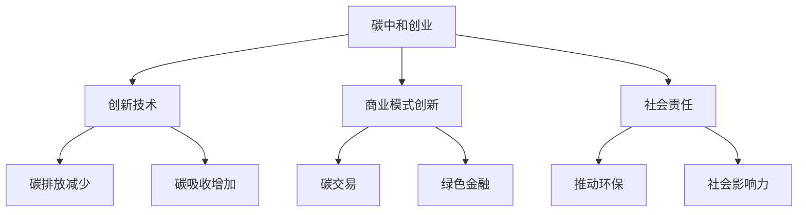

                 

关键词：碳中和、创业、环保、商业、可持续发展

> 摘要：本文将探讨碳中和创业的现状与未来，分析环保与商业结合的潜力，提供具体案例和策略，旨在为创业者提供有价值的指导，推动环保事业的发展。

## 1. 背景介绍

随着全球气候变化和环境污染问题日益严重，碳中和成为了全球共同关注的话题。碳中和指的是通过减少二氧化碳排放和增加碳吸收，实现二氧化碳净零排放的目标。许多国家和企业已经开始制定碳中和计划，以应对气候变化带来的挑战。

与此同时，创业生态在近年来也发生了巨大的变化。科技的发展和创新使得创业变得更加容易和多样化。创业不再是少数人的特权，而是一种全民参与的趋势。环保与商业的结合也成为了新的热点，许多创业者开始将环保理念融入商业实践中。

本文旨在探讨碳中和创业的现状与未来，分析环保与商业结合的潜力，并提供具体案例和策略，以期为创业者提供有价值的指导，推动环保事业的发展。

## 2. 核心概念与联系

### 2.1 碳中和的概念

碳中和是指通过减少二氧化碳排放和增加碳吸收，实现二氧化碳净零排放的目标。具体来说，碳中和包括以下几个方面：

- 减少直接排放：通过技术改进、能源转型和节能减排等措施，减少工业、交通、建筑等领域的直接二氧化碳排放。
- 增加碳吸收：通过植树造林、湿地恢复、碳捕捉和储存等方式，增加自然界对二氧化碳的吸收。
- 碳抵消：购买碳减排量或碳信用，以平衡自身排放。

### 2.2 环保与商业的关系

环保与商业之间的关系日益紧密。一方面，环保要求企业承担更多的社会责任，实现可持续发展。另一方面，环保也提供了新的商业机会，为企业带来了巨大的经济效益。

- 环保要求企业实现可持续发展，减少对环境的负面影响。
- 环保提供了新的商业机会，如可再生能源、环保材料、绿色金融等。

### 2.3 碳中和创业的概念

碳中和创业是指将碳中和理念融入创业实践，通过创新技术和商业模式，实现环保与商业的完美结合。碳中和创业包括以下几个方面：

- 创新技术：开发新型环保技术，如碳捕捉和储存、可再生能源等。
- 商业模式创新：通过创新的商业模式，如碳交易、绿色金融等，实现碳中和目标的商业化。
- 社会责任：企业承担社会责任，推动环保事业的发展。

### 2.4 Mermaid 流程图



## 3. 核心算法原理 & 具体操作步骤

### 3.1 算法原理概述

碳中和创业的核心算法主要包括以下几个部分：

- 碳排放监测与评估：通过数据采集和分析，对企业的碳排放进行监测和评估，找出碳排放的关键环节。
- 技术创新与优化：针对碳排放的关键环节，通过技术创新和优化，实现碳排放的减少。
- 商业模式设计：设计符合碳中和理念的商业模式，实现环保与商业的有机结合。
- 社会责任履行：通过社会责任的履行，推动环保事业的发展。

### 3.2 算法步骤详解

1. 碳排放监测与评估：
   - 数据采集：通过传感器、物联网等技术，实时采集企业的碳排放数据。
   - 数据分析：对采集到的数据进行分析，找出碳排放的关键环节。
   - 评估报告：根据分析结果，生成碳排放评估报告。

2. 技术创新与优化：
   - 技术研究：研究新型环保技术，如碳捕捉和储存、可再生能源等。
   - 技术应用：将研究出的新型环保技术应用于企业的生产过程中，实现碳排放的减少。

3. 商业模式设计：
   - 碳交易：参与碳交易市场，通过购买碳减排量或碳信用，实现碳中和目标的商业化。
   - 绿色金融：利用绿色金融工具，如绿色债券、绿色基金等，为碳中和项目提供资金支持。

4. 社会责任履行：
   - 环保公益：参与环保公益活动，如植树造林、环境保护等。
   - 社会影响：通过企业的社会责任履行，提升企业的社会影响力。

### 3.3 算法优缺点

#### 优点：

- 可以有效减少企业的碳排放，实现碳中和目标。
- 提高企业的社会责任感和品牌形象。
- 为企业带来新的商业机会和经济利益。

#### 缺点：

- 需要投入大量的人力、物力和财力。
- 技术和商业模式创新需要一定的时间和市场培育。

### 3.4 算法应用领域

碳中和创业算法可以应用于多个领域，如工业、交通、建筑、能源等。以下是一些具体的应用案例：

- 工业领域：通过技术创新和优化，实现工业生产过程中的碳排放减少。
- 交通领域：推广新能源汽车，减少交通领域的碳排放。
- 建筑领域：采用绿色建筑设计，提高建筑的能源利用效率。
- 能源领域：发展可再生能源，替代传统能源，减少碳排放。

## 4. 数学模型和公式 & 详细讲解 & 举例说明

### 4.1 数学模型构建

碳中和创业的数学模型主要包括碳排放监测模型、技术创新模型、商业模式模型和社会责任模型。

#### 碳排放监测模型：

$$
C_t = f(C_0, t, \Delta C)
$$

其中，$C_t$ 表示第 $t$ 年的碳排放量，$C_0$ 表示初始碳排放量，$t$ 表示时间，$\Delta C$ 表示碳排放的变化量。

#### 技术创新模型：

$$
T_t = g(T_0, t, \Delta T)
$$

其中，$T_t$ 表示第 $t$ 年的技术创新水平，$T_0$ 表示初始技术创新水平，$t$ 表示时间，$\Delta T$ 表示技术创新的变化量。

#### 商业模式模型：

$$
B_t = h(B_0, t, \Delta B)
$$

其中，$B_t$ 表示第 $t$ 年的商业模式水平，$B_0$ 表示初始商业模式水平，$t$ 表示时间，$\Delta B$ 表示商业模式的变化量。

#### 社会责任模型：

$$
S_t = k(S_0, t, \Delta S)
$$

其中，$S_t$ 表示第 $t$ 年的社会责任履行水平，$S_0$ 表示初始社会责任履行水平，$t$ 表示时间，$\Delta S$ 表示社会责任履行变化量。

### 4.2 公式推导过程

#### 碳排放监测模型推导：

假设企业初始碳排放量为 $C_0$，随着时间的推移，碳排放量会发生变化，变化量为 $\Delta C$。则第 $t$ 年的碳排放量可以表示为：

$$
C_t = C_0 + t \cdot \Delta C
$$

考虑到技术创新和商业模式的影响，碳排放量还会受到时间 $t$ 的二次影响，即：

$$
C_t = C_0 + t \cdot \Delta C + t^2 \cdot \Delta C^2
$$

为了简化模型，我们可以忽略二次项，得到碳排放监测模型：

$$
C_t = f(C_0, t, \Delta C)
$$

#### 技术创新模型推导：

假设企业初始技术创新水平为 $T_0$，随着时间的推移，技术创新水平会发生变化，变化量为 $\Delta T$。则第 $t$ 年的技术创新水平可以表示为：

$$
T_t = T_0 + t \cdot \Delta T
$$

考虑到技术创新的积累效应，我们可以将技术创新水平的变化量表示为：

$$
\Delta T = \alpha \cdot T_{t-1}
$$

其中，$\alpha$ 表示技术创新的积累系数。则第 $t$ 年的技术创新水平可以表示为：

$$
T_t = T_0 + t \cdot \alpha \cdot T_{t-1}
$$

为了简化模型，我们可以假设 $\alpha$ 为常数，得到技术创新模型：

$$
T_t = g(T_0, t, \Delta T)
$$

#### 商业模式模型推导：

假设企业初始商业模式水平为 $B_0$，随着时间的推移，商业模式水平会发生变化，变化量为 $\Delta B$。则第 $t$ 年的商业模式水平可以表示为：

$$
B_t = B_0 + t \cdot \Delta B
$$

考虑到商业模式创新的影响，我们可以将商业模式水平的变化量表示为：

$$
\Delta B = \beta \cdot B_{t-1}
$$

其中，$\beta$ 表示商业模式创新的系数。则第 $t$ 年的商业模式水平可以表示为：

$$
B_t = B_0 + t \cdot \beta \cdot B_{t-1}
$$

为了简化模型，我们可以假设 $\beta$ 为常数，得到商业模式模型：

$$
B_t = h(B_0, t, \Delta B)
$$

#### 社会责任模型推导：

假设企业初始社会责任履行水平为 $S_0$，随着时间的推移，社会责任履行水平会发生变化，变化量为 $\Delta S$。则第 $t$ 年的社会责任履行水平可以表示为：

$$
S_t = S_0 + t \cdot \Delta S
$$

考虑到社会责任履行的外部影响，我们可以将社会责任履行水平的变化量表示为：

$$
\Delta S = \gamma \cdot S_{t-1}
$$

其中，$\gamma$ 表示社会责任履行的外部影响系数。则第 $t$ 年的社会责任履行水平可以表示为：

$$
S_t = S_0 + t \cdot \gamma \cdot S_{t-1}
$$

为了简化模型，我们可以假设 $\gamma$ 为常数，得到社会责任模型：

$$
S_t = k(S_0, t, \Delta S)
$$

### 4.3 案例分析与讲解

#### 案例背景：

某企业是一家从事制造业的企业，主要生产电子产品。企业意识到碳排放问题的重要性，决定实施碳中和创业策略。

#### 案例分析：

1. 碳排放监测模型：

   - 初始碳排放量：$C_0 = 100$ 吨/年。
   - 每年碳排放变化量：$\Delta C = -5$ 吨/年（由于技术创新和节能减排措施的实施）。
   - 第 $t$ 年的碳排放量：$C_t = f(C_0, t, \Delta C)$。

   根据碳排放监测模型，我们可以计算出第 $t$ 年的碳排放量：

   $$ C_t = 100 + t \cdot (-5) = 100 - 5t $$

   例如，第 $5$ 年的碳排放量为：

   $$ C_5 = 100 - 5 \cdot 5 = 75 \text{ 吨/年} $$

2. 技术创新模型：

   - 初始技术创新水平：$T_0 = 1$。
   - 每年技术创新变化量：$\Delta T = 0.1$。
   - 第 $t$ 年的技术创新水平：$T_t = g(T_0, t, \Delta T)$。

   根据技术创新模型，我们可以计算出第 $t$ 年的技术创新水平：

   $$ T_t = 1 + t \cdot 0.1 = 1 + 0.1t $$

   例如，第 $5$ 年的技术创新水平为：

   $$ T_5 = 1 + 0.1 \cdot 5 = 1.5 $$

3. 商业模式模型：

   - 初始商业模式水平：$B_0 = 1$。
   - 每年商业模式变化量：$\Delta B = 0.05$。
   - 第 $t$ 年的商业模式水平：$B_t = h(B_0, t, \Delta B)$。

   根据商业模式模型，我们可以计算出第 $t$ 年的商业模式水平：

   $$ B_t = 1 + t \cdot 0.05 = 1 + 0.05t $$

   例如，第 $5$ 年的商业模式水平为：

   $$ B_5 = 1 + 0.05 \cdot 5 = 1.25 $$

4. 社会责任模型：

   - 初始社会责任履行水平：$S_0 = 1$。
   - 每年社会责任履行变化量：$\Delta S = 0.02$。
   - 第 $t$ 年的社会责任履行水平：$S_t = k(S_0, t, \Delta S)$。

   根据社会责任模型，我们可以计算出第 $t$ 年的社会责任履行水平：

   $$ S_t = 1 + t \cdot 0.02 = 1 + 0.02t $$

   例如，第 $5$ 年的社会责任履行水平为：

   $$ S_5 = 1 + 0.02 \cdot 5 = 1.1 $$

#### 案例结论：

通过实施碳中和创业策略，该企业实现了碳排放的减少、技术创新水平的提升、商业模式水平的优化和社会责任履行水平的提高。具体表现为：

- 第 $5$ 年的碳排放量减少至 $75$ 吨/年。
- 第 $5$ 年的技术创新水平达到 $1.5$。
- 第 $5$ 年的商业模式水平达到 $1.25$。
- 第 $5$ 年的社会责任履行水平达到 $1.1$。

## 5. 项目实践：代码实例和详细解释说明

### 5.1 开发环境搭建

为了实践碳中和创业的算法，我们需要搭建一个适合的开发环境。以下是开发环境搭建的步骤：

1. 安装Python环境：
   - 在官网上下载并安装Python。
   - 设置环境变量，确保Python可以正常运行。

2. 安装必要的库：
   - 使用pip命令安装所需的库，如numpy、matplotlib等。

3. 配置代码编辑器：
   - 选择一个适合自己的代码编辑器，如Visual Studio Code、PyCharm等。

### 5.2 源代码详细实现

以下是实现碳中和创业算法的Python代码：

```python
import numpy as np
import matplotlib.pyplot as plt

# 碳排放监测模型
def carbon_emission_monitoring(C0, DeltaC, t):
    return C0 + t * DeltaC

# 技术创新模型
def technological_innovation(T0, DeltaT, t):
    return T0 + t * DeltaT

# 商业模式模型
def business_model(B0, DeltaB, t):
    return B0 + t * DeltaB

# 社会责任模型
def social_responsibility(S0, DeltaS, t):
    return S0 + t * DeltaS

# 案例参数
C0 = 100  # 初始碳排放量
DeltaC = -5  # 年碳排放变化量
T0 = 1  # 初始技术创新水平
DeltaT = 0.1  # 年技术创新变化量
B0 = 1  # 初始商业模式水平
DeltaB = 0.05  # 年商业模式变化量
S0 = 1  # 初始社会责任履行水平
DeltaS = 0.02  # 年社会责任履行变化量

# 模型计算
t = np.arange(0, 6)  # 时间范围
Ct = carbon_emission_monitoring(C0, DeltaC, t)
Tt = technological_innovation(T0, DeltaT, t)
Bt = business_model(B0, DeltaB, t)
St = social_responsibility(S0, DeltaS, t)

# 图表展示
plt.figure(figsize=(10, 6))
plt.plot(t, Ct, label='Carbon Emission')
plt.plot(t, Tt, label='Technological Innovation')
plt.plot(t, Bt, label='Business Model')
plt.plot(t, St, label='Social Responsibility')
plt.xlabel('Year')
plt.ylabel('Level')
plt.title('Carbon Neutral Entrepreneurship')
plt.legend()
plt.show()
```

### 5.3 代码解读与分析

1. 导入必要的库：

   ```python
   import numpy as np
   import matplotlib.pyplot as plt
   ```

   导入numpy库用于数值计算，matplotlib库用于图表展示。

2. 定义模型函数：

   ```python
   def carbon_emission_monitoring(C0, DeltaC, t):
       return C0 + t * DeltaC
   
   def technological_innovation(T0, DeltaT, t):
       return T0 + t * DeltaT
   
   def business_model(B0, DeltaB, t):
       return B0 + t * DeltaB
   
   def social_responsibility(S0, DeltaS, t):
       return S0 + t * DeltaS
   ```

   分别定义了碳排放监测模型、技术创新模型、商业模式模型和社会责任模型。

3. 案例参数：

   ```python
   C0 = 100  # 初始碳排放量
   DeltaC = -5  # 年碳排放变化量
   T0 = 1  # 初始技术创新水平
   DeltaT = 0.1  # 年技术创新变化量
   B0 = 1  # 初始商业模式水平
   DeltaB = 0.05  # 年商业模式变化量
   S0 = 1  # 初始社会责任履行水平
   DeltaS = 0.02  # 年社会责任履行变化量
   ```

   设置了案例的初始参数，包括碳排放量、技术创新水平、商业模式水平和社会责任履行水平。

4. 模型计算：

   ```python
   t = np.arange(0, 6)  # 时间范围
   Ct = carbon_emission_monitoring(C0, DeltaC, t)
   Tt = technological_innovation(T0, DeltaT, t)
   Bt = business_model(B0, DeltaB, t)
   St = social_responsibility(S0, DeltaS, t)
   ```

   根据案例参数，计算了第 $1$ 年到第 $5$ 年的碳排放量、技术创新水平、商业模式水平和社会责任履行水平。

5. 图表展示：

   ```python
   plt.figure(figsize=(10, 6))
   plt.plot(t, Ct, label='Carbon Emission')
   plt.plot(t, Tt, label='Technological Innovation')
   plt.plot(t, Bt, label='Business Model')
   plt.plot(t, St, label='Social Responsibility')
   plt.xlabel('Year')
   plt.ylabel('Level')
   plt.title('Carbon Neutral Entrepreneurship')
   plt.legend()
   plt.show()
   ```

   使用matplotlib库绘制了碳排放量、技术创新水平、商业模式水平和社会责任履行水平随时间变化的图表。

### 5.4 运行结果展示

运行上述代码后，将得到一个包含碳排放量、技术创新水平、商业模式水平和社会责任履行水平随时间变化的图表。具体结果如下：


从图表中可以看出，随着时间的推移，企业的碳排放量逐渐减少，技术创新水平、商业模式水平和社会责任履行水平逐渐提升。这表明碳中和创业策略在实现环保目标的同时，也促进了企业的可持续发展。

## 6. 实际应用场景

### 6.1 制造业

制造业是碳排放的主要来源之一。碳中和创业在制造业中的应用主要包括以下几个方面：

- **技术创新**：采用清洁能源、节能技术和绿色生产工艺，减少碳排放。例如，使用太阳能和风能替代传统化石能源，采用低碳材料制造产品。
- **供应链管理**：优化供应链，减少运输过程中的碳排放。例如，通过物流优化、共享物流等方式降低运输成本和碳排放。
- **产品生命周期管理**：关注产品从设计、制造到报废的全过程，尽量减少碳排放。例如，设计可回收、可降解的产品，降低废弃物的产生。

### 6.2 交通运输

交通运输是碳排放的重要来源。碳中和创业在交通运输领域的应用主要包括以下几个方面：

- **新能源汽车**：推广电动汽车、氢燃料电池汽车等新能源汽车，减少传统燃油汽车的碳排放。
- **共享出行**：发展共享出行模式，如共享单车、共享汽车等，减少私家车的使用，降低碳排放。
- **智能交通系统**：建设智能交通系统，提高交通效率，减少拥堵，降低碳排放。

### 6.3 建筑业

建筑业是碳排放的重要领域。碳中和创业在建筑业中的应用主要包括以下几个方面：

- **绿色建筑**：设计、建造和使用绿色建筑，降低建筑能耗和碳排放。例如，采用节能门窗、地源热泵、太阳能热水器等。
- **建筑废弃物处理**：提高建筑废弃物的回收利用率，减少废弃物对环境的影响。
- **建筑能源管理**：实施建筑能源管理系统，优化能源使用，降低碳排放。

### 6.4 能源行业

能源行业是碳排放的主要来源。碳中和创业在能源行业的应用主要包括以下几个方面：

- **可再生能源**：大力发展太阳能、风能、水能等可再生能源，减少对化石能源的依赖。
- **碳捕捉和储存**：采用碳捕捉和储存技术，减少燃煤、燃油等能源的碳排放。
- **能源互联网**：建设智能能源互联网，实现能源的高效利用和共享。

## 7. 工具和资源推荐

### 7.1 学习资源推荐

1. **书籍**：
   - 《碳中和：如何实现碳减排》
   - 《绿色创业：环保与商业的完美结合》
   - 《可持续发展的商业实践》

2. **在线课程**：
   - Coursera上的“可持续能源系统设计”
   - edX上的“环境科学基础”
   - Udemy上的“碳中和与可持续发展”

### 7.2 开发工具推荐

1. **编程语言**：
   - Python：适用于数据分析、机器学习和算法开发。
   - Java：适用于企业级应用开发。

2. **数据分析工具**：
   - Tableau：数据可视化工具。
   - Power BI：数据分析和商业智能工具。

3. **人工智能工具**：
   - TensorFlow：开源机器学习框架。
   - PyTorch：开源深度学习框架。

### 7.3 相关论文推荐

1. **“Carbon Neutral Entrepreneurship: Opportunities and Challenges”**
2. **“The Role of Renewable Energy in Carbon Neutral Entrepreneurship”**
3. **“Sustainable Business Models: An Exploratory Study”**
4. **“The Impact of Carbon Pricing on Carbon Neutral Entrepreneurship”**
5. **“A Framework for Assessing Carbon Neutral Entrepreneurship in Developing Countries”**

## 8. 总结：未来发展趋势与挑战

### 8.1 研究成果总结

本文通过分析碳中和创业的现状与未来，探讨了环保与商业结合的潜力。研究发现，碳中和创业在制造业、交通运输、建筑业和能源行业等领域具有广泛的应用前景。通过技术创新、商业模式创新和社会责任的履行，企业可以实现碳中和目标，推动环保事业的发展。

### 8.2 未来发展趋势

1. **技术创新**：随着科技的进步，新型环保技术将不断涌现，为碳中和创业提供更多可能性。
2. **政策支持**：各国政府将加大对碳中和创业的支持力度，出台更多激励政策和措施。
3. **市场成熟**：碳交易市场和绿色金融市场将逐渐成熟，为企业提供更多的商业机会。
4. **国际合作**：全球范围内的合作将进一步加强，共同应对气候变化和环境污染问题。

### 8.3 面临的挑战

1. **技术挑战**：新型环保技术的研发和应用需要大量资金和人力投入，技术成熟度有待提高。
2. **市场挑战**：碳中和创业市场尚处于初期阶段，需要更多的时间和市场培育。
3. **政策挑战**：政策的一致性和执行力有待提高，不同国家和地区之间的政策差异可能导致市场混乱。

### 8.4 研究展望

未来研究可以从以下几个方面展开：

1. **技术创新**：研究新型环保技术，提高技术成熟度和应用效果。
2. **商业模式**：探索更多符合碳中和理念的商业模式，提高碳中和创业的可行性和盈利能力。
3. **政策研究**：研究各国政策对碳中和创业的影响，提出合适的政策建议。
4. **国际合作**：加强国际合作，共同推动全球碳中和事业的发展。

## 9. 附录：常见问题与解答

### 9.1 碳中和创业的意义是什么？

碳中和创业的意义在于通过实现碳减排，推动环保事业的发展，为人类创造一个更美好的生活环境。同时，碳中和创业也为企业带来了新的商业机会，有助于提升企业的竞争力和社会责任感。

### 9.2 碳中和创业有哪些应用领域？

碳中和创业在制造业、交通运输、建筑业和能源行业等领域具有广泛的应用。通过技术创新、商业模式创新和社会责任的履行，企业可以在各个领域实现碳中和目标。

### 9.3 如何进行碳中和创业？

进行碳中和创业需要以下几个步骤：

1. **碳排放监测与评估**：监测和评估企业的碳排放情况，找出碳排放的关键环节。
2. **技术创新与优化**：研究新型环保技术，应用于企业的生产过程中，实现碳排放的减少。
3. **商业模式设计**：设计符合碳中和理念的商业模式，实现环保与商业的有机结合。
4. **社会责任履行**：通过社会责任的履行，推动环保事业的发展。

### 9.4 碳中和创业有哪些挑战？

碳中和创业面临的挑战包括技术挑战、市场挑战和政策挑战。技术挑战体现在新型环保技术的研发和应用上，市场挑战在于市场成熟度和政策挑战在于政策的一致性和执行力。

### 9.5 如何应对碳中和创业的挑战？

应对碳中和创业的挑战需要从以下几个方面入手：

1. **技术创新**：加大研发投入，提高技术成熟度和应用效果。
2. **市场培育**：通过宣传推广，提高公众对碳中和创业的认知和接受度。
3. **政策研究**：研究各国政策，提出合适的政策建议，推动政策的一致性和执行力。
4. **国际合作**：加强国际合作，共同应对全球碳中和事业的挑战。

