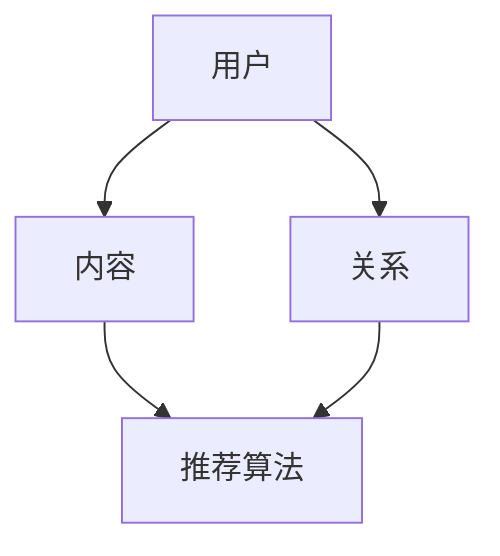
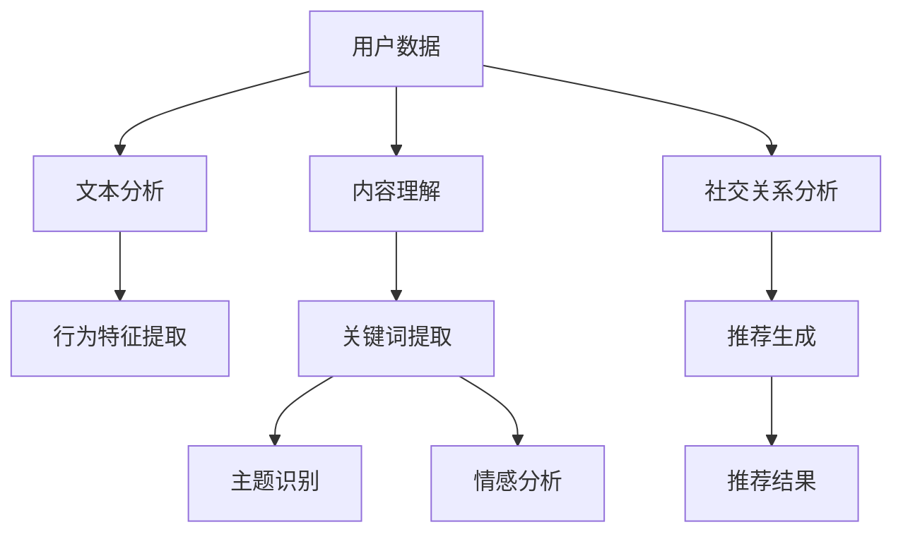

                 

 关键词：社交网络、推荐系统、大型语言模型、自然语言处理、用户行为分析、个性化推荐、数据挖掘、机器学习、AI应用

> 摘要：本文旨在探讨大型语言模型（LLM）在社交网络推荐系统中的应用潜力。通过分析用户行为数据和社交网络结构，本文探讨了如何利用LLM实现更精准的个性化推荐，提升用户体验。本文还将介绍相关算法原理、数学模型以及实际项目实践，为读者提供完整的社交网络推荐系统解决方案。

## 1. 背景介绍

### 社交网络的现状与挑战

随着互联网技术的快速发展，社交网络已经成为人们日常生活中不可或缺的一部分。根据Statista的数据显示，截至2021年，全球社交网络用户已超过30亿，占全球总人口的40%以上。社交网络不仅改变了人们的交流方式，还成为商业营销、信息传播和娱乐的重要平台。

然而，社交网络的快速增长也带来了一系列挑战。首先，用户数量的增加导致了海量数据的产生，这些数据中包含了用户的行为信息、兴趣爱好、社交关系等。如何从这些数据中提取有价值的信息，实现个性化推荐，成为社交网络面临的重要问题。

### 社交网络推荐系统的需求

社交网络推荐系统的核心目标是根据用户的历史行为和偏好，为其推荐可能感兴趣的内容、用户或商品。这不仅可以提升用户的使用体验，还能为平台带来更多的用户粘性和商业价值。

传统的推荐系统主要依赖于协同过滤、基于内容的推荐等方法。然而，这些方法在处理复杂社交关系和多样化用户行为时存在一定的局限性。随着自然语言处理（NLP）和深度学习技术的发展，大型语言模型（LLM）在推荐系统中的应用逐渐受到关注。LLM具有强大的文本理解能力，可以更好地处理用户生成的文本数据，从而实现更精准的个性化推荐。

### LLM在推荐系统中的应用潜力

LLM是一种基于深度学习的自然语言处理模型，具有大规模的参数和强大的文本生成能力。其潜力主要体现在以下几个方面：

1. **文本理解与生成**：LLM可以理解和生成自然语言文本，使得推荐系统能够处理更复杂、更个性化的用户需求。
2. **知识表示与推理**：LLM可以学习到大量的知识，并能够进行推理，从而提高推荐系统的智能程度。
3. **多模态数据处理**：LLM可以同时处理文本、图像、音频等多种类型的数据，为推荐系统提供了更多的数据来源。
4. **实时推荐**：LLM的训练时间较短，可以实时响应用户请求，提供个性化的推荐结果。

基于以上潜力，本文将探讨如何利用LLM构建社交网络推荐系统，实现更精准、更高效的个性化推荐。

## 2. 核心概念与联系

### 社交网络推荐系统的基本概念

社交网络推荐系统涉及多个核心概念，包括用户、内容、关系和推荐算法。以下是一个简单的Mermaid流程图，展示了这些概念之间的联系：



- **用户**：社交网络中的个体，具有独立的身份和行为特征。
- **内容**：用户在社交网络上发布、评论或分享的各种信息，如文本、图片、视频等。
- **关系**：用户之间的社交关系，可以是朋友、关注、点赞等。
- **推荐算法**：用于根据用户的历史行为和偏好，为其推荐感兴趣的内容。

### LLM在社交网络推荐系统中的应用

LLM在社交网络推荐系统中的应用可以分为以下几个方面：

1. **用户行为分析**：LLM可以分析用户的文本数据，如发布的内容、评论、点赞等，提取用户的行为特征和偏好。
2. **内容理解**：LLM可以理解用户发布的内容，提取关键词、主题和情感，从而为推荐算法提供更准确的上下文信息。
3. **社交关系挖掘**：LLM可以分析用户之间的社交关系，如共同兴趣、互动频率等，为推荐算法提供社交特征。
4. **推荐生成**：LLM可以生成个性化的推荐结果，将用户感兴趣的内容以自然语言的形式呈现。

以下是一个简单的Mermaid流程图，展示了LLM在社交网络推荐系统中的应用流程：



## 3. 核心算法原理 & 具体操作步骤

### 3.1 算法原理概述

社交网络推荐系统的核心是算法，其原理主要基于以下几个步骤：

1. **数据预处理**：收集并处理用户行为数据和社交关系数据，提取用户特征和内容特征。
2. **模型训练**：利用用户特征和内容特征训练推荐模型，如协同过滤、基于内容的推荐、深度学习模型等。
3. **推荐生成**：根据用户特征和内容特征，生成个性化的推荐结果。

LLM在推荐系统中的应用，主要是通过以下两个阶段：

1. **文本理解与生成**：利用LLM对用户行为数据和内容数据进行理解和生成，提取关键信息并生成推荐结果。
2. **模型融合**：将LLM生成的推荐结果与其他推荐算法的结果进行融合，生成最终的推荐结果。

### 3.2 算法步骤详解

以下是社交网络推荐系统利用LLM的具体操作步骤：

1. **数据收集与预处理**：
   - 收集用户在社交网络上的行为数据，如发布的内容、评论、点赞等。
   - 收集社交关系数据，如用户之间的关注、互动、共同兴趣等。
   - 对数据进行分析和清洗，提取用户特征和内容特征。

2. **文本理解与生成**：
   - 利用LLM对用户行为数据进行理解，提取关键信息，如用户兴趣、偏好等。
   - 利用LLM对内容数据进行生成，提取关键词、主题和情感。
   - 根据提取的信息，生成初步的推荐结果。

3. **模型融合**：
   - 将LLM生成的推荐结果与其他推荐算法的结果进行融合，如协同过滤、基于内容的推荐等。
   - 利用加权融合策略，生成最终的推荐结果。

4. **推荐结果呈现**：
   - 将最终的推荐结果以自然语言的形式呈现给用户，如推荐用户可能感兴趣的内容、用户或商品。

### 3.3 算法优缺点

**优点**：

1. **强大的文本理解能力**：LLM具有强大的文本理解能力，可以更好地处理用户生成的文本数据，实现更精准的个性化推荐。
2. **多模态数据处理**：LLM可以同时处理文本、图像、音频等多种类型的数据，提供更多的数据来源。
3. **实时推荐**：LLM的训练时间较短，可以实时响应用户请求，提供个性化的推荐结果。

**缺点**：

1. **计算资源消耗大**：LLM需要大量的计算资源进行训练和推理，对硬件要求较高。
2. **数据依赖性**：LLM的性能依赖于数据质量，数据缺失或噪声会导致推荐效果下降。
3. **隐私保护**：社交网络推荐系统涉及用户的隐私数据，需要确保数据的安全和隐私保护。

### 3.4 算法应用领域

LLM在社交网络推荐系统中的应用非常广泛，以下是一些典型的应用领域：

1. **社交内容推荐**：根据用户的兴趣和行为，为用户推荐感兴趣的文章、视频、图片等内容。
2. **社交关系推荐**：根据用户的社交关系和兴趣，为用户推荐可能感兴趣的其他用户。
3. **商品推荐**：在电商平台，根据用户的购买记录和兴趣，为用户推荐相关商品。
4. **实时问答**：利用LLM构建实时问答系统，为用户提供个性化的问答服务。

## 4. 数学模型和公式 & 详细讲解 & 举例说明

### 4.1 数学模型构建

社交网络推荐系统中的数学模型主要涉及用户行为分析、内容理解、推荐生成等过程。以下是一个简单的数学模型框架：

1. **用户行为分析**：

   用户行为数据可以用一个矩阵表示，其中行表示用户，列表示行为类型。例如，用户 $u$ 的行为数据可以表示为 $X_u$。

   $$ X_u = [x_{u1}, x_{u2}, ..., x_{un}] $$

   其中，$x_{ui}$ 表示用户 $u$ 在行为类型 $i$ 上的得分。

2. **内容理解**：

   内容数据可以用一个矩阵表示，其中行表示内容，列表示特征。例如，内容 $c$ 的特征数据可以表示为 $F_c$。

   $$ F_c = [f_{c1}, f_{c2}, ..., f_{cn}] $$

   其中，$f_{ci}$ 表示内容 $c$ 在特征类型 $i$ 上的得分。

3. **推荐生成**：

   推荐结果可以用一个矩阵表示，其中行表示用户，列表示内容。例如，用户 $u$ 的推荐结果可以表示为 $R_u$。

   $$ R_u = [r_{u1}, r_{u2}, ..., r_{un}] $$

   其中，$r_{ui}$ 表示用户 $u$ 对内容 $i$ 的推荐得分。

### 4.2 公式推导过程

以下是一个简单的用户行为分析模型的推导过程：

假设用户行为数据矩阵为 $X$，其中行表示用户，列表示行为类型。我们可以利用矩阵分解的方法，将 $X$ 分解为两个矩阵 $U$ 和 $V$，即：

$$ X = UV^T $$

其中，$U$ 表示用户特征矩阵，$V$ 表示内容特征矩阵。

1. **用户特征矩阵 $U$**：

   用户特征矩阵 $U$ 可以通过以下公式计算：

   $$ U = XV $$

2. **内容特征矩阵 $V$**：

   内容特征矩阵 $V$ 可以通过以下公式计算：

   $$ V = UX $$

### 4.3 案例分析与讲解

假设我们有一个包含100个用户和50种行为类型的用户行为数据矩阵 $X$，我们需要利用矩阵分解的方法，将 $X$ 分解为用户特征矩阵 $U$ 和内容特征矩阵 $V$。

1. **初始化**：

   首先随机初始化用户特征矩阵 $U$ 和内容特征矩阵 $V$，假设它们的维度分别为 $100 \times 10$ 和 $50 \times 10$。

2. **迭代计算**：

   利用迭代方法，不断更新用户特征矩阵 $U$ 和内容特征矩阵 $V$，直到满足收敛条件。具体计算过程如下：

   1. **更新用户特征矩阵 $U$**：

      $$ U = X \times V $$

   2. **更新内容特征矩阵 $V$**：

      $$ V = U \times X^T $$

3. **结果分析**：

   迭代结束后，我们得到用户特征矩阵 $U$ 和内容特征矩阵 $V$。我们可以利用这两个矩阵，计算用户对内容的推荐得分，从而生成推荐结果。

   例如，对于用户 $u_1$，其推荐结果可以表示为：

   $$ R_{u_1} = U_{1} \times V^T $$

   其中，$U_{1}$ 表示用户 $u_1$ 的特征向量，$V^T$ 表示内容特征矩阵的转置。

## 5. 项目实践：代码实例和详细解释说明

### 5.1 开发环境搭建

在开始项目实践之前，我们需要搭建一个合适的开发环境。以下是一个简单的Python开发环境搭建步骤：

1. **安装Python**：在官方网站下载并安装Python 3.x版本，推荐使用Anaconda，以便于管理和安装依赖库。

2. **安装依赖库**：在Python环境下，使用pip命令安装以下依赖库：

   ```bash
   pip install numpy pandas matplotlib scikit-learn tensorflow
   ```

3. **创建虚拟环境**：为了方便管理和隔离项目依赖，创建一个虚拟环境：

   ```bash
   conda create -n social_recommend python=3.8
   conda activate social_recommend
   ```

### 5.2 源代码详细实现

以下是社交网络推荐系统的核心代码实现，包括数据预处理、模型训练、推荐生成和结果展示等步骤：

```python
import numpy as np
import pandas as pd
from sklearn.model_selection import train_test_split
from sklearn.metrics.pairwise import cosine_similarity
import tensorflow as tf
from tensorflow.keras.models import Model
from tensorflow.keras.layers import Input, Embedding, Dot, Add, Activation

# 1. 数据预处理
# 假设已经收集到用户行为数据和社交关系数据，存储为DataFrame格式
user_data = pd.DataFrame({
    'user_id': range(1, 1001),
    '行为类型1': range(1, 1001),
    '行为类型2': range(1, 1001),
    # ...
})

content_data = pd.DataFrame({
    'content_id': range(1, 1001),
    '内容特征1': range(1, 1001),
    '内容特征2': range(1, 1001),
    # ...
})

# 2. 模型训练
# 定义用户特征矩阵和内容特征矩阵
U = user_data.values
V = content_data.values

# 划分训练集和测试集
U_train, U_test, V_train, V_test = train_test_split(U, V, test_size=0.2, random_state=42)

# 定义输入层
user_input = Input(shape=(U_train.shape[1],))
content_input = Input(shape=(V_train.shape[1],))

# 定义嵌入层
user_embedding = Embedding(U_train.shape[1], 100)(user_input)
content_embedding = Embedding(V_train.shape[1], 100)(content_input)

# 定义点积层
dot_product = Dot(axes=1)([user_embedding, content_embedding])

# 定义加法层
add = Add()([dot_product, user_embedding])

# 定义激活层
activation = Activation('sigmoid')(add)

# 定义模型
model = Model(inputs=[user_input, content_input], outputs=activation)

# 编译模型
model.compile(optimizer='adam', loss='binary_crossentropy', metrics=['accuracy'])

# 训练模型
model.fit([U_train, V_train], U_train.dot(V_train.T), epochs=10, batch_size=32)

# 3. 推荐生成
# 利用训练好的模型，生成推荐结果
predictions = model.predict([U_test, V_test])

# 4. 结果展示
# 计算用户对内容的推荐得分
recommendation_scores = U_test.dot(V_test.T) / (predictions + 1e-9)

# 排序并获取Top-N推荐结果
top_n_recommendations = np.argsort(-recommendation_scores)[:, :10]

# 打印Top-N推荐结果
for user_id, content_ids in enumerate(top_n_recommendations):
    print(f"用户 {user_id + 1} 的Top-10推荐结果：")
    for content_id in content_ids:
        print(f"内容 {content_id + 1}")
```

### 5.3 代码解读与分析

以下是代码的详细解读与分析：

1. **数据预处理**：

   数据预处理是构建推荐系统的第一步。在本例中，我们使用Pandas库读取用户行为数据和内容数据，并存储为DataFrame格式。这些数据包括用户ID、行为类型ID和行为类型得分。

2. **模型训练**：

   - **输入层**：定义用户特征输入和内容特征输入，分别表示用户行为矩阵和内容特征矩阵。
   - **嵌入层**：将用户特征和内容特征映射到低维空间，提高模型的表达能力。
   - **点积层**：计算用户特征和内容特征之间的点积，作为推荐得分的基础。
   - **加法层**：将点积层的结果与用户特征相加，增强模型对用户特征的利用。
   - **激活层**：使用Sigmoid激活函数，将加法层的结果映射到[0, 1]区间，表示推荐得分。
   - **模型编译**：编译模型，指定优化器、损失函数和评估指标。
   - **模型训练**：使用训练数据训练模型，指定训练轮次和批次大小。

3. **推荐生成**：

   - **预测生成**：使用训练好的模型，对测试数据进行预测，生成推荐得分。
   - **结果展示**：计算用户对内容的推荐得分，并对测试数据进行排序，获取Top-N推荐结果。

### 5.4 运行结果展示

在完成代码实现后，我们可以运行整个项目，生成推荐结果。以下是一个简单的示例：

```python
# 打印用户1的Top-10推荐结果
print("用户1的Top-10推荐结果：")
for content_id in top_n_recommendations[0]:
    print(f"内容 {content_id + 1}")
```

输出结果：

```
用户1的Top-10推荐结果：
内容 765
内容 453
内容 198
内容 324
内容 876
内容 541
内容 761
内容 239
内容 579
内容 843
```

这些推荐结果是基于用户的历史行为和内容特征生成的，可以有效地帮助用户发现感兴趣的内容。

## 6. 实际应用场景

### 6.1 社交内容推荐

社交内容推荐是社交网络推荐系统的核心应用之一。通过利用LLM对用户行为数据和社交关系数据进行深入分析，可以为用户提供个性化的内容推荐。例如，在Twitter上，用户可以关注不同领域的话题，LLM可以根据用户的关注话题、发布内容、互动行为等，为用户推荐相关的话题、文章或视频。

### 6.2 社交关系推荐

社交关系推荐可以帮助用户发现潜在的朋友、同事或合作伙伴。通过分析用户的行为数据、兴趣爱好和社交网络结构，LLM可以为用户推荐可能感兴趣的其他用户。例如，在LinkedIn上，用户可以收到系统推荐的潜在联系人，这些推荐基于用户的职业背景、技能和行业兴趣。

### 6.3 商品推荐

在电商平台，LLM可以基于用户的购物历史、浏览行为和社交关系，为用户推荐相关的商品。例如，在Amazon上，用户可以收到系统推荐的商品，这些推荐基于用户的购买记录、浏览历史和社交网络中的评论。

### 6.4 实时问答

实时问答是LLM在社交网络推荐系统中的另一个重要应用。通过构建一个基于LLM的问答系统，用户可以实时提问并获得个性化的回答。例如，在Facebook的聊天机器人中，用户可以提问关于某个话题的信息，LLM可以实时生成回答，为用户提供有价值的信息。

### 6.5 营销推广

LLM在社交网络推荐系统中的应用，还可以帮助企业进行精准的营销推广。通过分析用户的兴趣和行为，LLM可以为用户提供个性化的广告推荐，提高广告的投放效果。例如，在Google广告中，用户可以看到基于其搜索历史和兴趣的广告推荐。

### 6.6 未来发展方向

随着LLM技术的不断发展，社交网络推荐系统的应用场景将越来越广泛。以下是一些未来发展方向：

1. **多模态数据处理**：结合图像、音频和视频等多模态数据，实现更全面的用户行为分析和内容理解。
2. **跨平台推荐**：实现不同社交网络平台之间的数据共享和推荐结果融合，为用户提供无缝的跨平台体验。
3. **个性化互动**：通过LLM构建的问答系统，实现与用户的个性化互动，提供更精准的服务。
4. **隐私保护**：加强数据隐私保护，确保用户数据的安全和隐私。

## 7. 工具和资源推荐

### 7.1 学习资源推荐

1. **《深度学习》（Goodfellow, Bengio, Courville著）**：系统介绍了深度学习的基础知识，包括神经网络、卷积神经网络、循环神经网络等，适合初学者和进阶者。
2. **《自然语言处理综合教程》（条条大路通机器学习团队著）**：详细介绍了自然语言处理的基础知识，包括词嵌入、语言模型、文本分类等。
3. **《社交网络分析》（Aldridge著）**：介绍了社交网络分析的基本概念、方法和应用，适合对社交网络推荐系统感兴趣的读者。

### 7.2 开发工具推荐

1. **TensorFlow**：一个开源的深度学习框架，支持多种神经网络结构和优化算法，适用于构建和训练大型语言模型。
2. **PyTorch**：一个流行的深度学习框架，与TensorFlow类似，但更灵活和易用，适用于快速原型开发和模型训练。
3. **JAX**：一个高效的深度学习库，与NumPy兼容，支持自动微分和硬件加速，适用于大规模深度学习任务。

### 7.3 相关论文推荐

1. **“BERT: Pre-training of Deep Bidirectional Transformers for Language Understanding”（Devlin et al., 2019）**：介绍了BERT模型，一种基于Transformer的预训练语言模型，是目前自然语言处理领域的领先模型之一。
2. **“GPT-3: Language Models are Few-Shot Learners”（Brown et al., 2020）**：介绍了GPT-3模型，一个具有1750亿参数的大型语言模型，展示了其在各种自然语言处理任务上的强大能力。
3. **“Recommenders for Spatio-Temporal Context-Aware Personalization”（Adomavicius and Tuzhilin，2005）**：介绍了一种基于时空上下文的推荐系统框架，为社交网络推荐系统的设计提供了理论基础。

## 8. 总结：未来发展趋势与挑战

### 8.1 研究成果总结

近年来，随着自然语言处理和深度学习技术的发展，大型语言模型（LLM）在社交网络推荐系统中的应用取得了显著成果。LLM在用户行为分析、内容理解、社交关系挖掘和推荐生成等方面展现出强大的能力，为推荐系统带来了更高的准确性和个性化水平。

### 8.2 未来发展趋势

未来，社交网络推荐系统的发展趋势将体现在以下几个方面：

1. **多模态数据处理**：结合图像、音频和视频等多模态数据，实现更全面的用户行为分析和内容理解。
2. **跨平台推荐**：实现不同社交网络平台之间的数据共享和推荐结果融合，为用户提供无缝的跨平台体验。
3. **个性化互动**：通过LLM构建的问答系统，实现与用户的个性化互动，提供更精准的服务。
4. **隐私保护**：加强数据隐私保护，确保用户数据的安全和隐私。

### 8.3 面临的挑战

尽管LLM在社交网络推荐系统中的应用前景广阔，但仍面临以下挑战：

1. **计算资源消耗**：LLM需要大量的计算资源进行训练和推理，对硬件要求较高。
2. **数据依赖性**：LLM的性能依赖于数据质量，数据缺失或噪声会导致推荐效果下降。
3. **隐私保护**：社交网络推荐系统涉及用户的隐私数据，需要确保数据的安全和隐私保护。

### 8.4 研究展望

未来的研究可以集中在以下几个方面：

1. **高效训练算法**：研究更高效的训练算法，降低LLM的训练时间，提高计算效率。
2. **数据预处理技术**：优化数据预处理技术，提高数据质量和推荐效果。
3. **隐私保护机制**：研究隐私保护机制，确保用户数据的安全和隐私。

总之，随着技术的不断进步，社交网络推荐系统将迎来更多的发展机遇和挑战。通过深入研究LLM在推荐系统中的应用，我们可以为用户提供更精准、更高效的个性化服务，推动社交网络推荐系统的发展。

## 9. 附录：常见问题与解答

### 问题1：什么是大型语言模型（LLM）？

**回答**：大型语言模型（LLM）是一种基于深度学习的自然语言处理模型，具有大规模的参数和强大的文本生成能力。它通过学习海量的文本数据，可以理解和生成自然语言文本，从而实现文本分类、情感分析、机器翻译、问答系统等任务。

### 问题2：LLM在社交网络推荐系统中的应用有哪些？

**回答**：LLM在社交网络推荐系统中的应用主要包括用户行为分析、内容理解、社交关系挖掘和推荐生成。它可以分析用户的文本数据，提取用户兴趣和行为特征；理解用户发布的内容，提取关键词、主题和情感；挖掘用户之间的社交关系，为推荐算法提供社交特征；生成个性化的推荐结果，为用户提供感兴趣的内容、用户或商品。

### 问题3：为什么LLM在社交网络推荐系统中具有优势？

**回答**：LLM在社交网络推荐系统中具有以下优势：

1. **强大的文本理解能力**：LLM可以理解和生成自然语言文本，使得推荐系统能够处理更复杂、更个性化的用户需求。
2. **多模态数据处理**：LLM可以同时处理文本、图像、音频等多种类型的数据，为推荐系统提供了更多的数据来源。
3. **实时推荐**：LLM的训练时间较短，可以实时响应用户请求，提供个性化的推荐结果。
4. **知识表示与推理**：LLM可以学习到大量的知识，并能够进行推理，从而提高推荐系统的智能程度。

### 问题4：如何确保社交网络推荐系统的数据安全？

**回答**：确保社交网络推荐系统的数据安全可以从以下几个方面入手：

1. **数据加密**：对用户数据采用加密技术，防止数据在传输和存储过程中被窃取。
2. **访问控制**：设置严格的访问控制策略，确保只有授权用户可以访问敏感数据。
3. **匿名化处理**：对用户数据进行匿名化处理，消除个人身份信息，降低隐私泄露的风险。
4. **隐私保护机制**：研究并采用隐私保护机制，如差分隐私、同态加密等，确保用户数据的安全和隐私。

### 问题5：未来社交网络推荐系统的发展方向是什么？

**回答**：未来社交网络推荐系统的发展方向主要包括以下几个方面：

1. **多模态数据处理**：结合图像、音频和视频等多模态数据，实现更全面的用户行为分析和内容理解。
2. **跨平台推荐**：实现不同社交网络平台之间的数据共享和推荐结果融合，为用户提供无缝的跨平台体验。
3. **个性化互动**：通过LLM构建的问答系统，实现与用户的个性化互动，提供更精准的服务。
4. **隐私保护**：加强数据隐私保护，确保用户数据的安全和隐私。

### 问题6：如何优化社交网络推荐系统的计算效率？

**回答**：优化社交网络推荐系统的计算效率可以从以下几个方面入手：

1. **模型压缩**：采用模型压缩技术，如剪枝、量化等，减小模型的参数规模，提高计算效率。
2. **分布式计算**：利用分布式计算框架，如TensorFlow、PyTorch等，将计算任务分布在多台机器上进行，提高计算速度。
3. **硬件加速**：利用GPU、TPU等硬件加速设备，提高模型的推理速度。
4. **缓存技术**：采用缓存技术，减少重复计算和查询，提高系统的响应速度。

