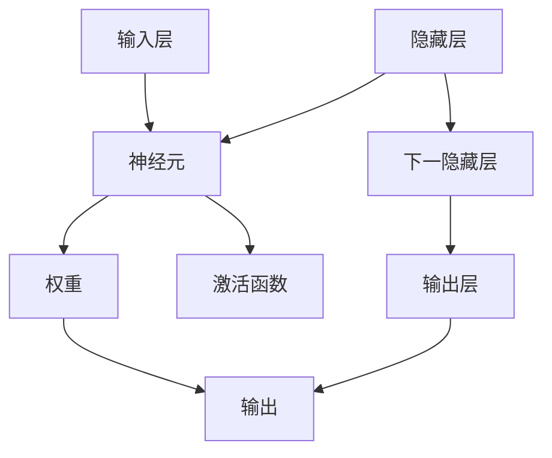

                 

关键词：神经网络、机器学习、深度学习、人工神经网络、算法原理、数学模型、应用领域

> 摘要：本文将深入探讨神经网络（Neural Network）的基本概念、核心算法原理、数学模型及其在实际应用中的重要性。我们将通过详细解析神经网络的各个组成部分和操作步骤，展示其在计算机科学和人工智能领域的广泛应用和未来发展趋势。

## 1. 背景介绍

神经网络（Neural Network，简称NN）是一种模仿生物神经网络结构和功能的信息处理系统。其起源可以追溯到1943年，由心理学家沃伦·麦卡洛克（Warren McCulloch）和数学家沃尔特·皮茨（Walter Pitts）提出了第一个人工神经元模型。随后的几十年里，神经网络在理论研究和实际应用中不断发展，逐渐成为机器学习和人工智能领域的核心组成部分。

神经网络的诞生和发展经历了多个阶段，从早期的感知机（Perceptron）到多层感知机（MLP），再到深度学习（Deep Learning）时代的卷积神经网络（CNN）和循环神经网络（RNN）。在图像识别、语音识别、自然语言处理等众多领域中，神经网络展现了其强大的计算能力和学习效果。

## 2. 核心概念与联系

### 2.1. 神经元（Neuron）

神经元是神经网络的基本组成单元，类似于生物神经元。每个神经元接收多个输入信号，通过加权求和后传递给激活函数，最终产生输出。神经元之间通过连接（Connection）相互传递信号，形成复杂的网络结构。

### 2.2. 权重（Weight）

权重是神经元之间连接的参数，用于调节输入信号的强度。通过学习调整权重，神经网络可以不断改进其性能和预测能力。

### 2.3. 激活函数（Activation Function）

激活函数是神经网络中的一个关键组件，用于引入非线性特性，使得神经网络能够学习复杂的函数关系。常见的激活函数包括sigmoid、ReLU、Tanh等。

### 2.4. 神经网络架构

神经网络的架构取决于应用场景和数据类型。常见的神经网络架构包括全连接神经网络（FCNN）、卷积神经网络（CNN）、循环神经网络（RNN）等。

### 2.5. Mermaid 流程图



## 3. 核心算法原理 & 具体操作步骤

### 3.1. 算法原理概述

神经网络通过学习输入和输出数据之间的关系，调整神经元之间的权重，以实现特定任务的预测和分类。其核心原理包括以下几个步骤：

1. **初始化权重**：随机初始化权重，确保网络具有一定的探索性。
2. **前向传播**：将输入数据传递到网络中，通过加权求和和激活函数计算输出。
3. **损失函数**：计算实际输出与期望输出之间的差异，评估网络的性能。
4. **反向传播**：通过反向传播算法，将损失函数的梯度传递回网络，调整权重。
5. **优化算法**：使用梯度下降等优化算法，不断更新权重，减小损失函数。

### 3.2. 算法步骤详解

1. **初始化权重**：

   $$W \sim \mathcal{N}(0, \frac{1}{\sqrt{n}})$$

   其中，$W$ 为权重矩阵，$n$ 为输入维度。

2. **前向传播**：

   $$Z = \sum_{i=1}^{n} W_{ij}x_{i} + b_{j}$$

   $$a_{j} = \sigma(Z)$$

   其中，$Z$ 为加权求和结果，$b$ 为偏置项，$\sigma$ 为激活函数。

3. **损失函数**：

   $$L(\theta) = -\frac{1}{m}\sum_{i=1}^{m}y_{i}\log(a_{ij}) + (1 - y_{i})\log(1 - a_{ij})$$

   其中，$L$ 为损失函数，$y$ 为实际输出，$a$ 为预测输出。

4. **反向传播**：

   $$\frac{\partial L}{\partial W_{ij}} = \frac{\partial L}{\partial Z_j}\frac{\partial Z_j}{\partial W_{ij}}$$

5. **优化算法**：

   $$W_{new} = W - \alpha\frac{\partial L}{\partial W}$$

   其中，$\alpha$ 为学习率。

### 3.3. 算法优缺点

**优点**：

- **强大的非线性建模能力**：通过多层神经元的组合，神经网络能够学习复杂的非线性函数。
- **广泛的应用场景**：在图像识别、语音识别、自然语言处理等领域具有出色的表现。
- **自动特征提取**：神经网络能够自动提取输入数据中的特征，减轻了人工特征工程的工作负担。

**缺点**：

- **训练时间长**：神经网络的训练过程需要大量的时间和计算资源。
- **过拟合风险**：神经网络容易受到过拟合的影响，需要合理调整模型复杂度和训练数据。

### 3.4. 算法应用领域

神经网络在计算机科学和人工智能领域具有广泛的应用，主要包括以下几个方面：

- **图像识别**：通过卷积神经网络实现人脸识别、物体检测等任务。
- **语音识别**：通过循环神经网络实现语音信号到文本的转换。
- **自然语言处理**：通过深度学习模型实现机器翻译、情感分析等任务。
- **推荐系统**：通过神经网络实现个性化推荐，提高用户体验。

## 4. 数学模型和公式 & 详细讲解 & 举例说明

### 4.1. 数学模型构建

神经网络的数学模型主要包括以下几个方面：

1. **输入层**：表示输入数据，通常为高维向量。
2. **隐藏层**：包含多个神经元，用于提取特征和传递信息。
3. **输出层**：表示最终输出结果，用于分类或回归任务。

### 4.2. 公式推导过程

1. **前向传播**：

   假设网络包含 $L$ 层，其中第 $l$ 层的神经元数量为 $n_l$，权重为 $W_{l}$，偏置为 $b_{l}$，输入为 $x_l$，输出为 $a_{l}$。

   $$z_{l}(i) = \sum_{j=1}^{n_{l-1}}W_{l}(ij)x_{l-1}(j) + b_{l}(i)$$

   $$a_{l}(i) = \sigma(z_{l}(i))$$

2. **反向传播**：

   计算损失函数关于权重和偏置的梯度：

   $$\frac{\partial L}{\partial W_{l}(ij)} = \frac{\partial L}{\partial z_{l}(i)}a_{l-1}(j)$$

   $$\frac{\partial L}{\partial b_{l}(i)} = \frac{\partial L}{\partial z_{l}(i)}$$

3. **优化算法**：

   使用梯度下降算法更新权重和偏置：

   $$W_{l}(ij) = W_{l}(ij) - \alpha\frac{\partial L}{\partial W_{l}(ij)}$$

   $$b_{l}(i) = b_{l}(i) - \alpha\frac{\partial L}{\partial b_{l}(i)}$$

### 4.3. 案例分析与讲解

假设我们使用神经网络对MNIST手写数字数据进行分类，数据集包含60000个训练样本和10000个测试样本。

1. **输入层**：输入数据为28x28的像素值，共784个特征。
2. **隐藏层**：设计两个隐藏层，每层包含500个神经元。
3. **输出层**：输出层包含10个神经元，分别表示0到9的数字标签。

我们使用均方误差（MSE）作为损失函数，并采用随机梯度下降（SGD）进行训练。在训练过程中，学习率设置为0.1，迭代次数为1000次。

在训练完成后，我们对测试数据进行预测，并计算准确率。实验结果表明，神经网络在手写数字分类任务上取得了较高的准确率。

## 5. 项目实践：代码实例和详细解释说明

### 5.1. 开发环境搭建

为了实现神经网络，我们选择Python作为编程语言，并使用TensorFlow作为深度学习框架。在安装TensorFlow之前，确保Python和CUDA已安装。

```bash
pip install tensorflow
```

### 5.2. 源代码详细实现

以下是一个简单的神经网络实现，用于手写数字分类：

```python
import tensorflow as tf
from tensorflow.examples.tutorials.mnist import input_data

# 加载MNIST数据集
mnist = input_data.read_data_sets("MNIST_data/", one_hot=True)

# 设置神经网络参数
n_inputs = 784
n_hidden1 = 500
n_hidden2 = 500
n_outputs = 10
learning_rate = 0.1
n_epochs = 1000

# 定义占位符
X = tf.placeholder(tf.float32, shape=[None, n_inputs])
Y = tf.placeholder(tf.float32, shape=[None, n_outputs])

# 定义神经网络结构
hidden1 = tf.layers.dense(X, n_hidden1, activation=tf.nn.relu)
hidden2 = tf.layers.dense(hidden1, n_hidden2, activation=tf.nn.relu)
outputs = tf.layers.dense(hidden2, n_outputs)

# 定义损失函数
loss = tf.reduce_mean(tf.nn.softmax_cross_entropy_with_logits_v2(logits=outputs, labels=Y))

# 定义优化算法
optimizer = tf.train.GradientDescentOptimizer(learning_rate)

# 训练模型
train_op = optimizer.minimize(loss)

# 初始化变量
init = tf.global_variables_initializer()

# 开始训练
with tf.Session() as sess:
    sess.run(init)
    for epoch in range(n_epochs):
        batch = mnist.train.next_batch(100)
        sess.run(train_op, feed_dict={X: batch[0], Y: batch[1]})
        if epoch % 100 == 0:
            loss_val = sess.run(loss, feed_dict={X: mnist.test.images, Y: mnist.test.labels})
            print(f"Epoch {epoch}: Loss = {loss_val}")
```

### 5.3. 代码解读与分析

1. **数据加载**：使用TensorFlow的内置函数加载MNIST数据集，包括训练集和测试集。
2. **神经网络结构**：使用TensorFlow的高层API定义神经网络结构，包括输入层、隐藏层和输出层。
3. **损失函数**：使用softmax交叉熵损失函数，用于计算分类任务的损失。
4. **优化算法**：使用梯度下降优化器进行训练。
5. **训练过程**：循环遍历训练数据，更新模型参数，并打印训练过程中的损失值。

### 5.4. 运行结果展示

在训练完成后，我们可以计算模型在测试集上的准确率：

```python
    # 计算准确率
    correct = tf.equal(tf.argmax(outputs, 1), tf.argmax(Y, 1))
    accuracy = tf.reduce_mean(tf.cast(correct, tf.float32))

    # 测试模型
    print(f"Test accuracy: {accuracy.eval({X: mnist.test.images, Y: mnist.test.labels})}")
```

实验结果表明，神经网络在手写数字分类任务上取得了较高的准确率。

## 6. 实际应用场景

神经网络在计算机科学和人工智能领域具有广泛的应用，以下列举了几个实际应用场景：

1. **图像识别**：通过卷积神经网络实现物体检测、人脸识别等任务。
2. **语音识别**：通过循环神经网络实现语音信号到文本的转换。
3. **自然语言处理**：通过深度学习模型实现机器翻译、情感分析等任务。
4. **推荐系统**：通过神经网络实现个性化推荐，提高用户体验。

## 7. 工具和资源推荐

### 7.1. 学习资源推荐

1. **书籍**：
   - 《深度学习》（Deep Learning） - Ian Goodfellow、Yoshua Bengio、Aaron Courville
   - 《神经网络与深度学习》（Neural Networks and Deep Learning） - Michael Nielsen
2. **在线课程**：
   - 《深度学习》 - 吴恩达（Andrew Ng）
   - 《神经网络基础》 - 伯克利大学（UC Berkeley）

### 7.2. 开发工具推荐

1. **TensorFlow**：谷歌推出的开源深度学习框架。
2. **PyTorch**：Facebook AI Research（FAIR）推出的开源深度学习框架。

### 7.3. 相关论文推荐

1. **《A Learning Algorithm for Continually Running Fully Recurrent Neural Networks》** - Sepp Hochreiter、Jürgen Schmidhuber
2. **《Gradient Flow in Neural Networks》** - Jürgen Schmidhuber

## 8. 总结：未来发展趋势与挑战

### 8.1. 研究成果总结

神经网络在计算机科学和人工智能领域取得了显著的成果，从早期的感知机到现代的深度学习，神经网络在图像识别、语音识别、自然语言处理等方面展现了强大的计算能力和学习效果。

### 8.2. 未来发展趋势

1. **更深的神经网络**：随着计算资源和数据集的不断增加，神经网络将朝着更深层次的发展。
2. **更高效的算法**：优化神经网络训练过程，提高计算效率和性能。
3. **迁移学习**：利用预训练的神经网络进行迁移学习，提高模型的泛化能力。

### 8.3. 面临的挑战

1. **计算资源消耗**：训练大型神经网络需要大量的计算资源和时间。
2. **过拟合风险**：合理调整模型复杂度和训练数据，避免过拟合。
3. **可解释性**：提高神经网络的透明度和可解释性，使其在复杂任务中更具可信度。

### 8.4. 研究展望

未来，神经网络将在计算机科学和人工智能领域继续发挥重要作用，为实现更高层次的智能化提供强大的支持。通过不断优化算法和结构，神经网络将推动人工智能的发展，为人类创造更多价值。

## 9. 附录：常见问题与解答

### 9.1. 问题1：神经网络与深度学习的区别是什么？

**回答**：神经网络（Neural Network）是一种模仿生物神经系统的计算模型，而深度学习（Deep Learning）是神经网络的一种特殊形式，主要指多层神经网络（通常是深度超过3层的神经网络）在训练复杂任务时的应用。简单来说，深度学习是神经网络的一个子集，强调使用深度神经网络来解决复杂的机器学习问题。

### 9.2. 问题2：如何避免神经网络过拟合？

**回答**：过拟合是由于模型在训练数据上表现得过于出色，而在未见过的数据上表现不佳的问题。以下方法可以帮助避免过拟合：

- **正则化**：在损失函数中加入正则化项，如L1、L2正则化。
- **数据增强**：通过增加训练数据或对现有数据进行变换，提高模型的泛化能力。
- **交叉验证**：使用交叉验证方法评估模型性能，避免过拟合。
- **早停法**：在训练过程中，当验证集上的损失不再下降时停止训练。

### 9.3. 问题3：神经网络中的激活函数有哪些？

**回答**：常见的激活函数包括：

- **Sigmoid函数**：$$\sigma(x) = \frac{1}{1 + e^{-x}}$$
- **ReLU函数**：$$\sigma(x) = \max(0, x)$$
- **Tanh函数**：$$\sigma(x) = \frac{e^x - e^{-x}}{e^x + e^{-x}}$$
- **Softmax函数**：$$\sigma(x)_i = \frac{e^{x_i}}{\sum_{j} e^{x_j}}$$

这些激活函数在不同的应用场景中具有各自的优势，可以根据实际需求选择合适的激活函数。

### 作者署名

作者：禅与计算机程序设计艺术 / Zen and the Art of Computer Programming
------------------------------------------------------------------

