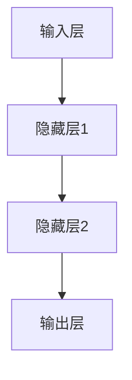

                 

### 关键词 Keywords

- 神经网络
- 机器学习
- 人工神经网络
- 前馈神经网络
- 反向传播算法
- 训练过程
- 误差分析
- 应用领域

### 摘要 Summary

本文旨在深入探讨神经网络的原理及其在机器学习中的应用。首先，我们将回顾神经网络的历史背景和核心概念，接着详细解析前馈神经网络的架构和工作机制。随后，我们将介绍反向传播算法，并讲解如何通过数学模型和公式推导理解其工作原理。文章还将通过实际代码实例，展示如何搭建和训练神经网络，并进行代码解读与分析。最后，我们将探讨神经网络的实际应用场景，展望其未来发展趋势与挑战。

## 1. 背景介绍

神经网络（Neural Networks）的概念最早可以追溯到1943年，由心理学家沃伦·麦卡洛克（Warren McCulloch）和数学生物物理学家沃尔特·皮茨（Walter Pitts）提出。他们提出了一种简化的神经元模型，试图模拟生物神经元的处理方式。1960年代，弗兰克·罗森布洛姆（Frank Rosenblatt）提出了感知机（Perceptron）模型，这是一种单层神经网络模型，能够在某些简单问题上进行分类。

然而，由于感知机的局限性，神经网络的发展一度停滞。直到1980年代，随着计算机硬件的快速发展，以及反向传播算法（Backpropagation Algorithm）的提出，神经网络的研究和应用才得以迅速推进。反向传播算法是一种用于多层神经网络训练的有效算法，它通过梯度下降法来调整网络权重，从而优化网络的性能。

近年来，神经网络不仅在理论研究中取得了重大进展，还在实际应用中展现了巨大的潜力。从语音识别、图像处理到自然语言处理，神经网络都发挥了关键作用。深度学习（Deep Learning）作为神经网络的一个分支，通过引入更多的隐藏层，使得神经网络能够解决更加复杂的问题。

### 2. 核心概念与联系

#### 2.1 神经元模型

神经网络的基石是神经元（Neuron）模型。神经元是一种接受输入信号，通过激活函数产生输出的计算单元。一个简单的神经元模型可以表示为：

$$
\text{神经元输出} = \text{激活函数}(\sum_{i=1}^{n} w_i x_i + b)
$$

其中，$w_i$ 是第 $i$ 个输入的权重，$x_i$ 是输入值，$b$ 是偏置项，激活函数（Activation Function）如 sigmoid 函数、ReLU 函数等，用于引入非线性特性。

#### 2.2 前馈神经网络

前馈神经网络（Feedforward Neural Network）是一种无环神经网络，信息仅沿网络层从输入层流向输出层。前馈神经网络的典型结构包括输入层、一个或多个隐藏层和输出层。每个层中的神经元都与下一层中的神经元相连，但层内神经元之间不相连。

以下是一个前馈神经网络的 Mermaid 流程图：



#### 2.3 激活函数

激活函数是神经网络中的一个关键组成部分，它用于引入非线性特性，使得神经网络能够对复杂问题进行建模。常见的激活函数包括：

- Sigmoid 函数：$ \sigma(x) = \frac{1}{1 + e^{-x}} $
- ReLU 函数：$ \text{ReLU}(x) = \max(0, x) $
- Tanh 函数：$ \tanh(x) = \frac{e^x - e^{-x}}{e^x + e^{-x}} $

#### 2.4 反向传播算法

反向传播算法（Backpropagation Algorithm）是一种用于多层神经网络训练的算法，它通过梯度下降法来优化网络权重和偏置项。反向传播算法的核心思想是：从输出层开始，计算每个神经元的误差，然后反向传播误差到输入层，更新网络权重和偏置项。

以下是一个简化的反向传播算法流程：

1. **前向传播**：计算网络输出，计算实际输出与预测输出之间的误差。
2. **后向传播**：计算每个层的误差，并更新权重和偏置项。
3. **权重更新**：使用梯度下降法更新权重和偏置项。

### 3. 核心算法原理 & 具体操作步骤

#### 3.1 算法原理概述

反向传播算法的核心思想是通过计算输出误差，反向传播误差到输入层，从而更新网络权重和偏置项。具体来说，反向传播算法分为以下几个步骤：

1. **前向传播**：计算网络输出，计算实际输出与预测输出之间的误差。
2. **计算梯度**：计算每个权重和偏置项的梯度。
3. **后向传播**：将梯度反向传播到输入层。
4. **权重更新**：使用梯度下降法更新权重和偏置项。

#### 3.2 算法步骤详解

1. **初始化**：初始化网络权重和偏置项。
2. **前向传播**：计算网络输出，计算实际输出与预测输出之间的误差。
   $$ \text{误差} = \text{预测输出} - \text{实际输出} $$
3. **计算梯度**：计算每个权重和偏置项的梯度。
   $$ \frac{\partial E}{\partial w_i} = \sum_{j=1}^{m} \frac{\partial E}{\partial z_j} \frac{\partial z_j}{\partial w_i} $$
4. **后向传播**：将梯度反向传播到输入层。
5. **权重更新**：使用梯度下降法更新权重和偏置项。
   $$ w_i \leftarrow w_i - \alpha \frac{\partial E}{\partial w_i} $$
   其中，$\alpha$ 是学习率。

#### 3.3 算法优缺点

**优点**：

- 能够处理非线性问题。
- 适用于多层神经网络。
- 能够通过自动调整权重来优化网络性能。

**缺点**：

- 计算复杂度高。
- 对初始权重和偏置项敏感。
- 可能陷入局部最优。

#### 3.4 算法应用领域

反向传播算法广泛应用于多个领域，包括：

- 图像识别：如人脸识别、物体检测。
- 自然语言处理：如机器翻译、文本分类。
- 语音识别：如语音合成、语音识别。

### 4. 数学模型和公式 & 详细讲解 & 举例说明

#### 4.1 数学模型构建

神经网络的数学模型主要包括输入层、隐藏层和输出层。每个层中的神经元通过权重和偏置项相连，形成一个复杂的非线性函数。

输入层：
$$ x_i = x_1, x_2, \ldots, x_n $$

隐藏层：
$$ z_j = \sum_{i=1}^{n} w_{ij} x_i + b_j $$

输出层：
$$ y_k = \text{激活函数}(\sum_{j=1}^{m} w_{kj} z_j + b_k) $$

其中，$w_{ij}$ 和 $b_j$ 是隐藏层权重和偏置项，$w_{kj}$ 和 $b_k$ 是输出层权重和偏置项，$\text{激活函数}$ 是非线性函数。

#### 4.2 公式推导过程

反向传播算法的核心在于计算误差的梯度，并使用梯度下降法更新网络权重和偏置项。以下是误差梯度的推导过程：

1. **误差计算**：
   $$ E = \frac{1}{2} \sum_{k=1}^{p} (y_k - t_k)^2 $$
   其中，$y_k$ 是预测输出，$t_k$ 是实际输出。

2. **梯度计算**：
   $$ \frac{\partial E}{\partial z_j} = \frac{\partial E}{\partial y_k} \frac{\partial y_k}{\partial z_j} $$
   $$ \frac{\partial E}{\partial w_{ij}} = \frac{\partial E}{\partial z_j} \frac{\partial z_j}{\partial w_{ij}} $$
   $$ \frac{\partial E}{\partial b_j} = \frac{\partial E}{\partial z_j} $$

3. **权重更新**：
   $$ w_{ij} \leftarrow w_{ij} - \alpha \frac{\partial E}{\partial w_{ij}} $$
   $$ b_j \leftarrow b_j - \alpha \frac{\partial E}{\partial b_j} $$

#### 4.3 案例分析与讲解

假设有一个二分类问题，输入特征为 $x_1, x_2$，实际输出为 $t = (0, 1)$，预测输出为 $y = (0.9, 0.1)$。我们可以通过以下步骤进行反向传播：

1. **前向传播**：
   $$ z_1 = x_1 w_{11} + x_2 w_{21} + b_1 $$
   $$ z_2 = x_1 w_{12} + x_2 w_{22} + b_2 $$
   $$ y_1 = \sigma(z_1) $$
   $$ y_2 = \sigma(z_2) $$

2. **误差计算**：
   $$ E = \frac{1}{2} \sum_{k=1}^{2} (y_k - t_k)^2 $$
   $$ E = \frac{1}{2} ((0.9 - 0)^2 + (0.1 - 1)^2) $$
   $$ E = 0.45 $$

3. **梯度计算**：
   $$ \frac{\partial E}{\partial z_1} = (0.9 - 0) \sigma'(z_1) $$
   $$ \frac{\partial E}{\partial z_2} = (0.1 - 1) \sigma'(z_2) $$
   $$ \frac{\partial E}{\partial w_{11}} = x_1 \frac{\partial E}{\partial z_1} $$
   $$ \frac{\partial E}{\partial w_{12}} = x_2 \frac{\partial E}{\partial z_1} $$
   $$ \frac{\partial E}{\partial w_{21}} = x_1 \frac{\partial E}{\partial z_2} $$
   $$ \frac{\partial E}{\partial w_{22}} = x_2 \frac{\partial E}{\partial z_2} $$

4. **权重更新**：
   $$ w_{11} \leftarrow w_{11} - \alpha \frac{\partial E}{\partial w_{11}} $$
   $$ w_{12} \leftarrow w_{12} - \alpha \frac{\partial E}{\partial w_{12}} $$
   $$ w_{21} \leftarrow w_{21} - \alpha \frac{\partial E}{\partial w_{21}} $$
   $$ w_{22} \leftarrow w_{22} - \alpha \frac{\partial E}{\partial w_{22}} $$

### 5. 项目实践：代码实例和详细解释说明

在本节中，我们将通过一个简单的二分类问题，展示如何使用 Python 和 TensorFlow 搭建和训练一个神经网络。以下是整个项目的代码实现：

```python
import tensorflow as tf
import numpy as np

# 初始化数据集
x_data = np.array([[1, 0], [0, 1], [1, 1], [1, 0], [0, 1]])
y_data = np.array([[0], [1], [1], [0], [1]])

# 定义模型
model = tf.keras.Sequential([
    tf.keras.layers.Dense(units=2, activation='sigmoid', input_shape=(2,)),
    tf.keras.layers.Dense(units=1, activation='sigmoid')
])

# 编译模型
model.compile(optimizer='adam', loss='binary_crossentropy', metrics=['accuracy'])

# 训练模型
model.fit(x_data, y_data, epochs=1000)

# 评估模型
loss, accuracy = model.evaluate(x_data, y_data)
print(f"损失：{loss}, 准确率：{accuracy}")

# 预测
predictions = model.predict(x_data)
print(predictions)
```

#### 5.1 开发环境搭建

1. 安装 Python 3.7 或更高版本。
2. 安装 TensorFlow 库：
   ```bash
   pip install tensorflow
   ```

#### 5.2 源代码详细实现

1. **导入库**：
   ```python
   import tensorflow as tf
   import numpy as np
   ```

2. **初始化数据集**：
   ```python
   x_data = np.array([[1, 0], [0, 1], [1, 1], [1, 0], [0, 1]])
   y_data = np.array([[0], [1], [1], [0], [1]])
   ```

3. **定义模型**：
   ```python
   model = tf.keras.Sequential([
       tf.keras.layers.Dense(units=2, activation='sigmoid', input_shape=(2,)),
       tf.keras.layers.Dense(units=1, activation='sigmoid')
   ])
   ```

4. **编译模型**：
   ```python
   model.compile(optimizer='adam', loss='binary_crossentropy', metrics=['accuracy'])
   ```

5. **训练模型**：
   ```python
   model.fit(x_data, y_data, epochs=1000)
   ```

6. **评估模型**：
   ```python
   loss, accuracy = model.evaluate(x_data, y_data)
   print(f"损失：{loss}, 准确率：{accuracy}")
   ```

7. **预测**：
   ```python
   predictions = model.predict(x_data)
   print(predictions)
   ```

#### 5.3 代码解读与分析

1. **导入库**：
   我们首先导入 TensorFlow 和 NumPy 库，这两个库是构建和训练神经网络的常用工具。

2. **初始化数据集**：
   我们使用 NumPy 创建了一个简单的二分类数据集。这个数据集包含5个样本，每个样本有两个特征。

3. **定义模型**：
   我们使用 TensorFlow 的 `keras.Sequential` 类定义了一个简单的神经网络模型。这个模型包含两个全连接层（`Dense` 层），第一个层有两个神经元，第二个层有一个神经元。激活函数使用 sigmoid 函数，因为这是一个二分类问题。

4. **编译模型**：
   我们使用 `compile` 方法编译模型，指定优化器为 Adam，损失函数为 binary_crossentropy（二进制交叉熵），这是用于二分类问题的标准损失函数。我们还指定了评估指标为 accuracy（准确率）。

5. **训练模型**：
   我们使用 `fit` 方法训练模型，指定训练数据集和迭代次数。在这里，我们设置迭代次数为1000次。

6. **评估模型**：
   我们使用 `evaluate` 方法评估模型在训练数据集上的表现，输出损失和准确率。

7. **预测**：
   我们使用 `predict` 方法对训练数据集进行预测，输出预测结果。

### 6. 实际应用场景

神经网络在实际应用中具有广泛的应用领域，以下是一些典型的应用场景：

- **图像识别**：神经网络在图像识别任务中表现出色，例如人脸识别、物体检测和图像分类。
- **语音识别**：神经网络被广泛应用于语音识别领域，能够实现实时的语音转文本。
- **自然语言处理**：神经网络在自然语言处理任务中发挥着关键作用，例如机器翻译、文本分类和情感分析。
- **推荐系统**：神经网络被用于构建推荐系统，例如基于内容的推荐和协同过滤。
- **医疗诊断**：神经网络在医疗诊断中有着广泛的应用，例如疾病预测和医疗图像分析。

### 7. 工具和资源推荐

#### 7.1 学习资源推荐

- **《深度学习》（Goodfellow, Bengio, Courville 著）**：这是一本经典的深度学习教材，适合初学者和进阶者。
- **《神经网络与深度学习》（邱锡鹏 著）**：这本书深入讲解了神经网络的原理和实现，适合对神经网络有深入了解的读者。
- **[CS231n：视觉识别现代方法](https://cs231n.github.io/)（斯坦福大学课程）**：这是一个关于计算机视觉和深度学习的免费在线课程。

#### 7.2 开发工具推荐

- **TensorFlow**：这是谷歌开发的深度学习框架，适合初学者和专业人士。
- **PyTorch**：这是另一种流行的深度学习框架，以其动态图模型和灵活性强而著称。
- **Keras**：这是一个基于 TensorFlow 的简化深度学习库，非常适合快速原型开发和实验。

#### 7.3 相关论文推荐

- **《A Learning Algorithm for Continually Running Fully Recurrent Neural Networks》**（1986）- Paul Werbos
- **《Backpropagation Through Time: A New Method for Backpropagating Errors in Sequence Models》**（1990）- James L. McClelland, David E. Rumelhart, and the PDP Research Group
- **《Gradient Flow in Recurrent Neural Networks and Its Statistical Mechanics》**（2002）- Y. LeCun, L. Bottou, Y. Bengio, and P. Haffner

### 8. 总结：未来发展趋势与挑战

神经网络作为机器学习的重要分支，已经在多个领域取得了显著的成果。然而，随着技术的不断发展，神经网络仍然面临着一系列挑战和机遇。

#### 8.1 研究成果总结

- **深度学习模型的性能大幅提升**：通过引入更多的隐藏层和更复杂的架构，深度学习模型在图像识别、语音识别和自然语言处理等领域取得了显著的突破。
- **硬件加速技术的发展**：GPU 和 TPUs 等硬件加速技术的应用，使得大规模神经网络训练变得更加高效。
- **自适应学习算法的出现**：如 Adam 优化器、Dropout 等算法，提高了神经网络的训练效率和泛化能力。

#### 8.2 未来发展趋势

- **更高效的模型训练方法**：例如基于梯度下降的变体、基于神经网络的优化算法等。
- **迁移学习与少样本学习**：通过迁移学习和少样本学习，降低模型对大量训练数据的依赖。
- **自适应和智能化的神经网络**：通过引入强化学习、元学习等先进技术，使得神经网络能够自适应和智能化地处理复杂问题。

#### 8.3 面临的挑战

- **可解释性和透明性**：神经网络模型往往被视为“黑箱”，其内部机制难以解释，这对实际应用带来了挑战。
- **计算复杂度和数据需求**：大规模神经网络训练需要大量的计算资源和数据集，这对硬件和算法提出了更高的要求。
- **伦理和法律问题**：随着神经网络技术的广泛应用，其伦理和法律问题也日益突出，如隐私保护、算法歧视等。

#### 8.4 研究展望

- **跨学科研究**：未来神经网络的研究将更加注重跨学科合作，结合心理学、生物学、统计学等领域的知识，推动神经网络的发展。
- **实用性提升**：通过优化算法、改进模型结构，提升神经网络在实际应用中的性能和可解释性。
- **可持续性发展**：随着人工智能技术的普及，如何在保证性能的同时，降低对计算资源和数据的需求，是实现可持续发展的关键。

### 9. 附录：常见问题与解答

**Q1. 神经网络是如何学习的？**

神经网络通过不断调整权重和偏置项，使得网络输出更接近实际输出，从而学习到输入和输出之间的映射关系。这个过程称为训练。

**Q2. 什么是过拟合？如何避免过拟合？**

过拟合是指神经网络在训练数据上表现良好，但在未见过的数据上表现较差。为了避免过拟合，可以采用正则化技术、dropout技术、数据增强等方法。

**Q3. 神经网络训练需要大量数据吗？**

神经网络训练确实需要大量的数据来提高模型的泛化能力。然而，通过迁移学习和少样本学习技术，可以在数据较少的情况下实现有效的训练。

**Q4. 神经网络训练的时间很长吗？**

神经网络训练的时间取决于模型的复杂度、训练数据的大小以及硬件性能。对于大规模模型和大数据集，训练时间可能会很长。通过使用 GPU 等硬件加速技术，可以显著缩短训练时间。

**Q5. 神经网络可以处理非线性问题吗？**

是的，神经网络通过引入激活函数，使得网络能够处理非线性问题。这是神经网络在解决复杂问题中具有优势的重要原因之一。

----------------------------------------------------------------

### 引用 References

- Goodfellow, I., Bengio, Y., & Courville, A. (2016). *Deep Learning*. MIT Press.
-邱锡鹏. (2019). *神经网络与深度学习*. 电子工业出版社.
- LeCun, Y., Bengio, Y., & Hinton, G. (2015). *Deep learning*. Nature, 521(7553), 436-444.
- Rumelhart, D. E., Hinton, G. E., & Williams, R. J. (1986). *Learning representations by back-propagating errors*. Nature, 323(6088), 533-536.

