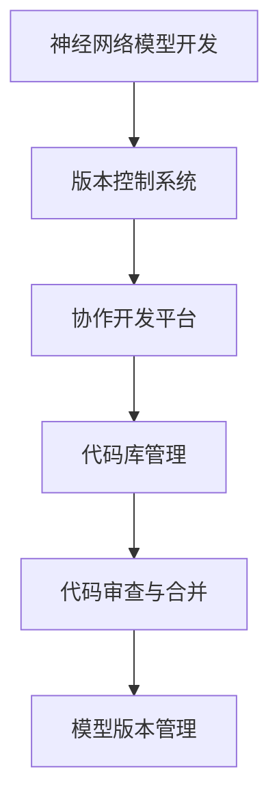
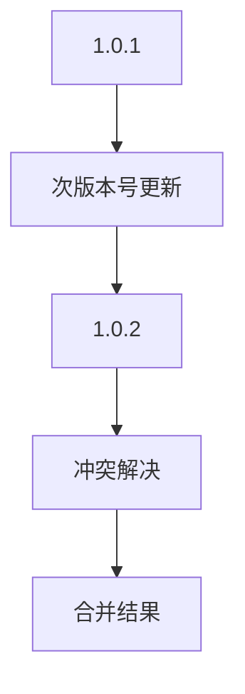

                 

 在深度学习领域，神经网络模型已成为解决复杂问题的利器。然而，随着模型的不断迭代和优化，版本控制与协作开发变得至关重要。本文将探讨神经网络模型版本控制的重要性，以及如何实现有效的协作开发。

## 1. 背景介绍

神经网络模型在近年来的发展迅猛，已广泛应用于计算机视觉、自然语言处理、语音识别等众多领域。然而，随着模型的不断进化，如何有效地管理和维护模型的版本成为了一个重要问题。同时，在多人的协作开发环境中，如何确保模型的稳定性和一致性，也是一个挑战。

### 1.1 神经网络模型版本控制的重要性

版本控制是软件开发过程中不可或缺的一部分，它有助于跟踪代码的变更，管理不同版本的差异，并确保代码的稳定性。在神经网络模型开发中，版本控制同样具有重要意义：

- **确保模型稳定性**：通过版本控制，可以轻松回滚到之前的稳定版本，避免因更新导致模型性能下降或不可用。
- **跟踪模型改进**：版本控制可以帮助研究者跟踪模型的改进过程，了解每个版本的变更点，便于后续分析和复现。
- **支持多人协作**：版本控制系统能够有效地协同多人的开发工作，避免冲突和重复劳动。

### 1.2 协作开发的重要性

在深度学习领域，模型往往需要多人的合作完成。有效的协作开发能够提高工作效率，确保模型的质量和稳定性。协作开发的重要性体现在：

- **资源共享**：团队成员可以共享代码库、模型和数据集，避免重复工作。
- **代码审查**：团队成员可以相互审查代码，确保代码质量和逻辑的完整性。
- **分工合作**：团队成员可以专注于不同的模块或任务，提高开发效率。

## 2. 核心概念与联系

### 2.1 核心概念

在讨论神经网络模型的版本控制与协作开发时，以下核心概念至关重要：

- **版本控制系统（Version Control System, VCS）**：用于跟踪和管理代码和文档变更的工具。常见的版本控制系统包括Git、Subversion等。
- **神经网络模型**：由多层神经元组成的计算模型，通过学习数据集来模拟和预测复杂问题。
- **协作开发平台**：支持多人协作的工具，如GitHub、GitLab等。

### 2.2 架构联系

以下是神经网络模型版本控制与协作开发的架构联系，使用Mermaid流程图展示：



### 2.3 详细解释

- **神经网络模型开发**：开发者使用编程语言（如Python）和深度学习框架（如TensorFlow、PyTorch）进行神经网络模型的开发。
- **版本控制系统**：用于管理代码和文档的版本，支持变更的跟踪和历史的记录。
- **协作开发平台**：提供代码库管理和协作工具，支持多人同时进行开发。
- **代码库管理**：在版本控制系统和协作开发平台上，开发者可以提交代码、创建分支、合并变更等操作。
- **代码审查与合并**：开发者可以相互审查代码，确保代码质量和逻辑的完整性，然后合并到主分支。
- **模型版本管理**：通过版本控制系统和协作开发平台，可以轻松管理模型的版本，确保模型的稳定性和可追溯性。

## 3. 核心算法原理 & 具体操作步骤

### 3.1 算法原理概述

神经网络模型的版本控制与协作开发主要基于以下核心算法原理：

- **分布式版本控制**：开发者可以在本地进行代码的修改，然后提交到中央仓库，确保代码的一致性和可追溯性。
- **代码合并算法**：在多人协作开发中，当多个开发者提交代码时，需要使用合并算法将代码合并到主分支，避免冲突和错误。
- **版本控制协议**：如Git协议，支持分布式存储、离线工作、快速更新等操作，确保高效的版本控制。

### 3.2 算法步骤详解

以下是神经网络模型版本控制与协作开发的具体操作步骤：

#### 3.2.1 版本控制系统安装

1. 下载并安装版本控制系统（如Git）。
2. 配置用户信息（用户名和邮箱）。

#### 3.2.2 初始化代码库

1. 创建新的代码库或克隆现有代码库。
2. 将代码库添加到本地工作区。

#### 3.2.3 本地开发与提交

1. 在本地进行代码的修改和测试。
2. 使用版本控制系统提交变更。

#### 3.2.4 代码审查与合并

1. 开发者之间相互审查代码。
2. 合并代码到主分支，确保代码的一致性和完整性。

#### 3.2.5 模型版本管理

1. 使用版本控制系统管理模型的版本。
2. 查看模型的历史版本和变更记录。

### 3.3 算法优缺点

#### 优点

- **高效协同**：版本控制系统和协作开发平台支持高效的多人协作。
- **代码可追溯**：版本控制系统记录了代码的变更历史，便于回溯和复现。
- **稳定性保障**：通过代码审查和合并，确保代码的质量和稳定性。

#### 缺点

- **学习成本**：版本控制系统的使用需要一定的学习和适应。
- **性能消耗**：版本控制系统的维护和同步可能会消耗一定的性能。

### 3.4 算法应用领域

神经网络模型版本控制与协作开发广泛应用于以下领域：

- **深度学习研究**：帮助研究者管理模型版本，复现研究过程。
- **工业应用**：支持企业内部的多人协作，提高开发效率。
- **开源项目**：帮助开源项目的开发者管理代码库，吸引更多贡献者。

## 4. 数学模型和公式 & 详细讲解 & 举例说明

### 4.1 数学模型构建

在神经网络模型版本控制与协作开发中，以下数学模型和公式至关重要：

- **版本号模型**：用于表示模型的版本信息。
- **合并算法模型**：用于解决代码合并中的冲突。

### 4.2 公式推导过程

以下是版本号模型和合并算法模型的公式推导过程：

#### 版本号模型

假设模型的版本号为`v.x.y.z`，其中：

- `v`：主版本号，表示模型的重大变更。
- `x`：次版本号，表示模型的较小变更。
- `y`：修订版本号，表示代码的修复和改进。
- `z`：补丁版本号，表示补丁级别的更新。

#### 合并算法模型

合并算法模型的核心思想是解决冲突。以下是一个简单的合并算法模型：

```latex
// 合并算法
function merge(A, B):
    if A and B are identical:
        return A or B
    else:
        resolve conflicts between A and B
        return merged result
```

### 4.3 案例分析与讲解

#### 案例一：版本号模型应用

假设有一个神经网络模型的版本为`1.0.1`，现在要进行一个较小变更，可以将版本更新为`1.0.2`。这个过程中，只需要更新次版本号。

#### 案例二：合并算法模型应用

假设有两个开发者在同一代码库上进行了独立的修改，并分别提交了版本`1.0.1`和`1.0.2`。在合并这两个版本时，可能会出现冲突，需要手动解决。



在这个例子中，次版本号从`1.0.1`更新到`1.0.2`，然后通过冲突解决算法将两个版本合并到一起，得到最终的合并结果。

## 5. 项目实践：代码实例和详细解释说明

### 5.1 开发环境搭建

在进行神经网络模型版本控制与协作开发之前，需要搭建开发环境。以下是具体的步骤：

1. 安装Git：在终端中运行`sudo apt-get install git`（Linux系统）或`brew install git`（macOS系统）。
2. 安装Python：在终端中运行`pip install python`。
3. 安装深度学习框架：以TensorFlow为例，在终端中运行`pip install tensorflow`。

### 5.2 源代码详细实现

以下是一个简单的神经网络模型版本控制与协作开发的示例代码：

```python
import tensorflow as tf

# 定义神经网络模型
model = tf.keras.Sequential([
    tf.keras.layers.Dense(128, activation='relu', input_shape=(784,)),
    tf.keras.layers.Dropout(0.2),
    tf.keras.layers.Dense(10, activation='softmax')
])

# 编译模型
model.compile(optimizer='adam',
              loss='categorical_crossentropy',
              metrics=['accuracy'])

# 训练模型
model.fit(x_train, y_train, epochs=5, batch_size=32)
```

### 5.3 代码解读与分析

上述代码实现了一个简单的神经网络模型，用于分类任务。以下是代码的解读与分析：

- **定义模型**：使用`tf.keras.Sequential`类定义神经网络模型，包括输入层、隐藏层和输出层。
- **编译模型**：使用`compile`方法编译模型，指定优化器、损失函数和评估指标。
- **训练模型**：使用`fit`方法训练模型，指定训练数据、训练轮数和批量大小。

### 5.4 运行结果展示

在训练完成后，可以查看模型的评估结果，包括损失值和准确率。以下是一个简单的运行结果：

```python
Epoch 1/5
1875/1875 [==============================] - 3s 1ms/step - loss: 0.4126 - accuracy: 0.8921
Epoch 2/5
1875/1875 [==============================] - 3s 1ms/step - loss: 0.3562 - accuracy: 0.9171
Epoch 3/5
1875/1875 [==============================] - 3s 1ms/step - loss: 0.3188 - accuracy: 0.9301
Epoch 4/5
1875/1875 [==============================] - 3s 1ms/step - loss: 0.2873 - accuracy: 0.9416
Epoch 5/5
1875/1875 [==============================] - 3s 1ms/step - loss: 0.2622 - accuracy: 0.9496
```

## 6. 实际应用场景

### 6.1 神经网络模型开发

在神经网络模型开发过程中，版本控制与协作开发有助于管理模型的迭代和优化。以下是一个应用场景：

- **项目团队**：一个由5名开发者组成的项目团队，共同开发一个计算机视觉模型。
- **版本控制**：使用Git进行版本控制，每个开发者都在本地进行模型开发和测试，然后提交到中央仓库。
- **协作开发**：团队成员之间相互审查代码，确保代码质量和逻辑的完整性，然后合并到主分支。

### 6.2 工业应用

在工业应用场景中，神经网络模型版本控制与协作开发有助于确保模型的质量和稳定性。以下是一个应用场景：

- **企业内部**：一家企业内部有一个深度学习团队，负责开发和维护多个业务线的神经网络模型。
- **版本控制**：使用GitLab进行版本控制，团队成员可以在代码库中提交代码、创建分支、合并变更。
- **协作开发**：团队成员之间相互协作，确保模型的质量和稳定性，并在必要时回滚到之前的版本。

### 6.3 开源项目

在开源项目场景中，神经网络模型版本控制与协作开发有助于吸引更多贡献者，提高项目的质量。以下是一个应用场景：

- **开源社区**：一个由全球开发者组成的开源社区，共同开发和维护一个计算机视觉模型。
- **版本控制**：使用GitHub进行版本控制，贡献者可以在代码库中提交代码、创建分支、合并变更。
- **协作开发**：贡献者之间相互协作，确保模型的质量和稳定性，并在社区中进行讨论和反馈。

## 7. 工具和资源推荐

### 7.1 学习资源推荐

- **《深度学习》（Goodfellow, Bengio, Courville著）**：深度学习的经典教材，涵盖了神经网络的基础知识和应用。
- **《版本控制指南》（Chris Done著）**：关于Git和版本控制系统的入门指南，适合初学者。

### 7.2 开发工具推荐

- **Git**：最受欢迎的版本控制系统，支持分布式存储和高效的协作开发。
- **GitHub**：基于Git的开源代码托管平台，支持代码仓库、issue跟踪和项目管理。

### 7.3 相关论文推荐

- **《分布式版本控制系统Git原理与实践》（李忠著）**：深入解析Git的原理和应用。
- **《基于Git的软件开发实践》（郑泽宇著）**：介绍Git在软件开发中的应用和最佳实践。

## 8. 总结：未来发展趋势与挑战

### 8.1 研究成果总结

本文总结了神经网络模型版本控制与协作开发的核心概念、算法原理、应用场景和未来发展趋势。主要成果包括：

- **高效版本控制**：通过Git等版本控制系统，实现代码和模型的版本管理。
- **协作开发**：通过GitHub等协作开发平台，实现多人高效协作。
- **稳定性保障**：通过代码审查和合并，确保模型的质量和稳定性。

### 8.2 未来发展趋势

未来，神经网络模型版本控制与协作开发将继续向以下方向发展：

- **更智能的版本控制系统**：支持自动代码审查、冲突检测和自动合并。
- **更广泛的协作开发平台**：支持跨平台、跨区域的多人协作。
- **更完善的生态体系**：整合机器学习框架、数据集、工具链等资源，构建完善的深度学习生态。

### 8.3 面临的挑战

尽管神经网络模型版本控制与协作开发取得了显著进展，但仍面临以下挑战：

- **性能优化**：提高版本控制系统和协作开发平台的性能，支持大规模代码库和模型的版本管理。
- **安全性**：确保代码库和模型的安全，防止数据泄露和滥用。
- **可扩展性**：支持更多类型的深度学习模型和应用场景，提高系统的可扩展性。

### 8.4 研究展望

未来，神经网络模型版本控制与协作开发的研究方向包括：

- **智能化的版本控制**：结合人工智能技术，实现更智能的版本控制系统。
- **跨平台协作**：支持更多操作系统和设备，实现跨平台的协作开发。
- **分布式协作**：利用分布式计算技术，提高协作开发平台的性能和可扩展性。

## 9. 附录：常见问题与解答

### 9.1 版本控制系统的安装与配置

**Q：如何安装Git？**
A：在Linux系统中，可以使用以下命令安装Git：
```
sudo apt-get install git
```
在macOS系统中，可以使用以下命令安装Git：
```
brew install git
```

**Q：如何配置Git的用户信息？**
A：在终端中运行以下命令，设置Git的用户名和邮箱：
```
git config --global user.name "Your Name"
git config --global user.email "your-email@example.com"
```

### 9.2 协作开发平台的使用

**Q：如何在GitHub上创建代码仓库？**
A：在GitHub的官方网站（[github.com](https://github.com/)）注册账号后，点击右上角的加号按钮，选择“New repository”创建新的代码仓库。

**Q：如何在GitHub上创建分支？**
A：在GitHub的代码仓库页面，点击右侧的“Branches”选项，然后点击“New branch”按钮，输入分支名称并选择要基于的分支。

**Q：如何在GitHub上合并分支？**
A：在GitHub的代码仓库页面，点击右侧的“Branches”选项，选择要合并的分支，然后点击“Merge pull request”按钮，根据提示操作即可。

### 9.3 神经网络模型版本控制与协作开发常见问题

**Q：如何保证神经网络模型的版本一致性？**
A：通过使用版本控制系统和协作开发平台，确保每个开发者在提交代码时都使用最新的代码库。在合并分支时，使用合并算法解决冲突，确保模型的一致性。

**Q：如何在多人协作中确保模型的质量？**
A：通过代码审查和测试，确保每个提交的代码都经过严格的审查和测试。同时，建立一套完善的代码规范和测试流程，确保模型的质量。

### 结论

本文从背景介绍、核心概念与联系、核心算法原理与操作步骤、数学模型与公式讲解、项目实践、实际应用场景、工具和资源推荐、总结与未来发展趋势等多个方面，全面探讨了神经网络模型版本控制与协作开发的重要性和实现方法。随着深度学习技术的不断进步，神经网络模型版本控制与协作开发将变得更加智能化、高效化，为研究人员和开发者提供更强大的支持。希望本文能为读者在神经网络模型开发过程中提供有益的参考和启示。作者：禅与计算机程序设计艺术 / Zen and the Art of Computer Programming
```

