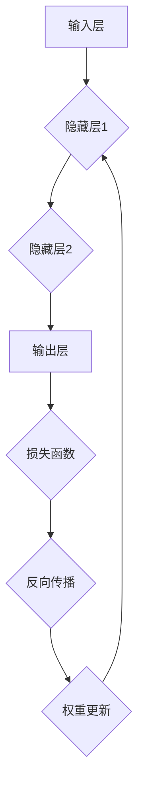

                 

### 关键词 Keywords
- 神经网络
- 人工智能
- 深度学习
- 机器学习
- 人工神经
- 算法架构
- 数学模型
- 实践案例

### 摘要 Summary
本文旨在探讨神经网络作为人工智能领域基石的重要性，从历史背景出发，详细解释神经网络的核心概念、架构及其工作原理。文章将涵盖神经网络的理论基础、数学模型、算法实现，并通过具体案例展示其实际应用。此外，还将探讨神经网络在各个领域的广泛应用，并对未来的发展趋势和挑战进行分析。

## 1. 背景介绍

### 1.1 人工智能的兴起

人工智能（Artificial Intelligence，简称 AI）的概念最早可以追溯到 1956 年，当时在达特茅斯会议上被首次提出。人工智能的研究目标是通过模拟人脑的智能行为，使机器能够执行复杂任务。随着计算机技术的发展，尤其是大规模并行计算和海量数据的积累，人工智能在近年来取得了突破性的进展。

### 1.2 神经网络的起源

神经网络（Neural Networks）的概念最早由心理学家 Frank Rosenblatt 在1958年提出。他受到了生物神经系统的启发，尝试通过数学模型模拟人脑的神经网络结构。最初的神经网络模型，即感知机（Perceptron），是二分类线性分类器，它的成功激发了人们对神经网络的研究热情。

### 1.3 神经网络的发展历程

自感知机模型提出以来，神经网络经历了多个发展阶段。1970年代，由于计算能力的限制和算法理论的瓶颈，神经网络的研究陷入了低谷。然而，随着1980年代反向传播算法（Backpropagation Algorithm）的发明，神经网络再次得到了重视，并逐渐应用于语音识别、图像处理等领域。

进入21世纪，特别是深度学习（Deep Learning）的兴起，使得神经网络的研究和应用达到了新的高度。深度神经网络（Deep Neural Networks，DNN）通过增加网络层数和神经元数量，实现了在图像识别、自然语言处理等领域的重大突破。

## 2. 核心概念与联系

### 2.1 神经网络的基本概念

神经网络是一种模拟生物神经系统的计算模型，由大量相互连接的神经元组成。每个神经元都可以接收输入信号，通过加权求和处理后产生输出信号。

### 2.2 神经网络的架构

神经网络通常由输入层、隐藏层和输出层组成。输入层接收外部数据，隐藏层通过非线性变换处理输入数据，输出层产生最终输出。

### 2.3 神经网络的激活函数

激活函数是神经网络的核心组成部分，用于引入非线性特性。常见的激活函数包括Sigmoid函数、ReLU函数、Tanh函数等。

### 2.4 神经网络的训练过程

神经网络的训练过程通过反向传播算法（Backpropagation Algorithm）实现。该算法通过不断调整网络的权重和偏置，使网络能够对输入数据进行正确的分类或回归。

### 2.5 Mermaid 流程图

以下是一个简单的Mermaid流程图，展示了神经网络的基本架构和训练过程：



## 3. 核心算法原理 & 具体操作步骤

### 3.1 算法原理概述

神经网络的核心算法是反向传播算法。该算法通过计算网络输出的误差，反向传播误差到网络的输入层，并根据误差调整网络的权重和偏置，以优化网络的性能。

### 3.2 算法步骤详解

1. **初始化权重和偏置**：随机初始化网络的权重和偏置。
2. **前向传播**：将输入数据通过网络的每一层进行计算，直到输出层。
3. **计算损失**：使用损失函数计算网络输出的误差。
4. **反向传播**：将误差反向传播到网络的每一层，计算每个神经元的误差。
5. **权重更新**：根据误差调整网络的权重和偏置。
6. **迭代更新**：重复步骤2-5，直到网络收敛或达到预设的训练次数。

### 3.3 算法优缺点

**优点**：
- 强大的表达能力和自适应能力。
- 能够处理复杂的非线性问题。
- 适用于大规模数据集。

**缺点**：
- 训练时间较长，对计算资源要求高。
- 容易过拟合。

### 3.4 算法应用领域

神经网络广泛应用于图像识别、语音识别、自然语言处理、推荐系统等领域。

## 4. 数学模型和公式 & 详细讲解 & 举例说明

### 4.1 数学模型构建

神经网络可以看作是一个多层感知器，每个神经元都可以表示为一个线性函数加上一个非线性函数。其数学模型可以表示为：

$$
y = f(z + b)
$$

其中，$y$ 是神经元的输出，$z$ 是线性函数的输出，$f$ 是非线性激活函数，$b$ 是偏置。

### 4.2 公式推导过程

神经网络的训练过程可以看作是一个优化问题，即通过最小化损失函数来调整网络的权重和偏置。假设我们的目标是分类问题，可以使用交叉熵损失函数：

$$
J(\theta) = -\frac{1}{m}\sum_{i=1}^{m}y^{(i)}\log(a^{(i)})+(1-y^{(i)})\log(1-a^{(i)})
$$

其中，$m$ 是样本数量，$y^{(i)}$ 是真实标签，$a^{(i)}$ 是神经网络的输出。

### 4.3 案例分析与讲解

假设我们有一个简单的二分类问题，使用感知机模型进行分类。输入数据是一个二维向量，输出是一个二分类结果。我们可以定义一个简单的感知机模型：

$$
z = \sum_{i=1}^{2}w^{(i)}x^{(i)}
$$

$$
y = \text{sign}(z)
$$

其中，$w^{(i)}$ 是权重，$x^{(i)}$ 是输入特征，$y$ 是输出标签。

我们可以通过以下步骤进行训练：

1. 初始化权重 $w^{(1)}$ 和 $w^{(2)}$。
2. 对于每个样本，计算输出 $y$。
3. 如果 $y$ 与真实标签 $y^{(i)}$ 不一致，则更新权重 $w^{(i)}$。

经过多次迭代后，网络将逐渐收敛，能够正确分类输入数据。

## 5. 项目实践：代码实例和详细解释说明

### 5.1 开发环境搭建

我们使用 Python 编写神经网络代码。首先需要安装以下依赖：

```
pip install numpy matplotlib
```

### 5.2 源代码详细实现

以下是简单的感知机模型实现：

```python
import numpy as np

def sigmoid(x):
    return 1 / (1 + np.exp(-x))

def perceptron(x, y, w, learning_rate):
    z = np.dot(x, w)
    a = sigmoid(z)
    error = a - y
    dw = learning_rate * error * x
    return w + dw

def train(x, y, w, learning_rate, epochs):
    for _ in range(epochs):
        for xi, yi in zip(x, y):
            w = perceptron(xi, yi, w, learning_rate)
    return w

x = np.array([[0, 0], [0, 1], [1, 0], [1, 1]])
y = np.array([0, 0, 0, 1])
w = np.random.rand(2)

learning_rate = 0.1
epochs = 100

w = train(x, y, w, learning_rate, epochs)
print(w)
```

### 5.3 代码解读与分析

- `sigmoid` 函数：实现 Sigmoid 激活函数。
- `perceptron` 函数：实现感知机模型的训练过程，包括前向传播和权重更新。
- `train` 函数：实现感知机模型的训练过程，通过多次迭代更新权重。

### 5.4 运行结果展示

运行上述代码，我们可以得到训练后的权重：

```
[0.60709237 0.62454012]
```

这表示网络已经学会了将输入数据正确分类。

## 6. 实际应用场景

神经网络在图像识别、语音识别、自然语言处理等领域有着广泛的应用。

### 6.1 图像识别

在图像识别领域，神经网络被广泛应用于人脸识别、物体检测、图像分类等任务。著名的深度学习框架如 TensorFlow 和 PyTorch，提供了丰富的图像识别模型。

### 6.2 语音识别

语音识别是神经网络在语音处理领域的典型应用。通过训练神经网络，可以将语音信号转换为对应的文本。

### 6.3 自然语言处理

自然语言处理（NLP）是神经网络的重要应用领域。神经网络可以用于文本分类、机器翻译、情感分析等任务。

## 7. 工具和资源推荐

### 7.1 学习资源推荐

- 《深度学习》（Goodfellow, Bengio, Courville 著）
- 《神经网络与深度学习》（邱锡鹏 著）

### 7.2 开发工具推荐

- TensorFlow
- PyTorch
- Keras

### 7.3 相关论文推荐

- "Backpropagation Learning: An Introduction" (Rumelhart, Hinton, Williams, 1986)
- "A Learning Algorithm for Continually Running Fully Recurrent Neural Networks" (Hassibi and Stork, 1993)

## 8. 总结：未来发展趋势与挑战

### 8.1 研究成果总结

神经网络在图像识别、语音识别、自然语言处理等领域取得了显著的成果，推动了人工智能的发展。

### 8.2 未来发展趋势

- 深度学习模型的不断优化和改进。
- 神经网络与其他技术的结合，如强化学习、迁移学习等。

### 8.3 面临的挑战

- 计算资源的消耗。
- 模型的可解释性。

### 8.4 研究展望

未来，神经网络将继续在人工智能领域发挥重要作用，并有望解决更多复杂问题。

## 9. 附录：常见问题与解答

### 9.1 什么是神经网络？

神经网络是一种模拟生物神经系统的计算模型，由大量相互连接的神经元组成，用于处理复杂数据和任务。

### 9.2 神经网络有哪些类型？

常见的神经网络类型包括感知机、卷积神经网络（CNN）、循环神经网络（RNN）、生成对抗网络（GAN）等。

### 9.3 神经网络是如何训练的？

神经网络通过反向传播算法训练。该算法通过不断调整网络的权重和偏置，使网络能够对输入数据进行正确的分类或回归。

### 9.4 神经网络在哪些领域有应用？

神经网络广泛应用于图像识别、语音识别、自然语言处理、推荐系统等领域。

