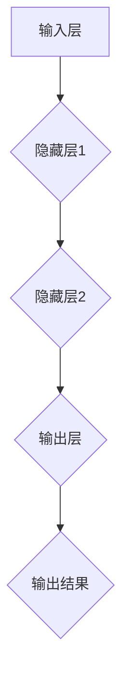

                 

关键词：神经网络、机器学习、深度学习、反向传播、激活函数、优化算法、应用领域

> 摘要：本文将深入探讨神经网络作为人工智能基础架构的核心地位。我们将从背景介绍、核心概念与联系、核心算法原理、数学模型与公式、项目实践、实际应用场景、未来应用展望、工具和资源推荐、以及总结未来发展趋势与挑战等方面进行全面解析，旨在帮助读者理解神经网络在人工智能领域的应用与重要性。

## 1. 背景介绍

神经网络（Neural Networks）的概念最早由心理学家McCulloch和数学家Pitts在1943年提出，以模拟人脑神经元的工作原理。随着计算机科学的进步，神经网络在20世纪80年代重新获得了关注。1990年代，随着反向传播算法（Backpropagation Algorithm）的发明，神经网络在训练多层网络方面取得了突破。进入21世纪，深度学习（Deep Learning）的兴起进一步推动了神经网络的发展，特别是在图像识别、语音识别、自然语言处理等领域取得了显著成果。

神经网络的成功离不开以下几个关键因素：

1. **计算能力的提升**：高性能计算集群和GPU的普及，使得复杂网络的训练成为可能。
2. **大数据的驱动**：大量数据的获取为神经网络训练提供了丰富的样本。
3. **算法的优化**：优化算法如随机梯度下降（Stochastic Gradient Descent，SGD）和Adam优化器的出现，提高了训练效率。

## 2. 核心概念与联系

神经网络由多个神经元（或称为节点）组成，这些神经元通过层与层之间相互连接，形成复杂的网络结构。以下是神经网络的核心概念：

### 神经元（Node）

神经元是神经网络的基本单元，类似于人脑的神经元。每个神经元接收来自其他神经元的输入信号，通过加权求和后，应用一个激活函数来决定是否将信号传递给下一层。

### 层（Layer）

神经网络通常包括输入层、隐藏层和输出层。输入层接收外部输入信号，隐藏层对输入信号进行处理，输出层产生最终预测结果。

### 连接（Connection）

神经元之间的连接带有权重，这些权重决定了信号在传递过程中的重要性。通过训练，神经网络可以调整这些权重，以达到更好的预测效果。

### 激活函数（Activation Function）

激活函数用于将线性组合转换为非线性的输出，使得神经网络能够模拟复杂的非线性关系。常见的激活函数包括ReLU（Rectified Linear Unit）、Sigmoid和Tanh等。

### Mermaid 流程图



## 3. 核心算法原理 & 具体操作步骤

### 3.1 算法原理概述

神经网络的训练过程本质上是一个优化问题，目标是最小化网络输出与真实标签之间的误差。反向传播算法（Backpropagation Algorithm）是实现这一目标的核心算法。

### 3.2 算法步骤详解

1. **初始化网络参数**：包括输入层、隐藏层和输出层的权重及偏置。
2. **前向传播**：将输入信号通过网络进行前向传递，得到网络的输出。
3. **计算损失**：使用损失函数（如均方误差MSE）计算输出与真实标签之间的误差。
4. **后向传播**：计算误差在每一层上的梯度，并通过梯度下降法更新网络参数。
5. **重复迭代**：重复步骤2-4，直到网络达到预设的训练误差或达到最大迭代次数。

### 3.3 算法优缺点

**优点**：
- 能够处理高维数据和非线性关系。
- 能够自动提取特征，无需人工设计特征。

**缺点**：
- 训练时间较长，对计算资源要求高。
- 过拟合问题较严重，需要大量数据进行训练。

### 3.4 算法应用领域

神经网络在多个领域都有广泛的应用，包括：

- **图像识别**：如人脸识别、物体识别等。
- **自然语言处理**：如机器翻译、文本分类等。
- **语音识别**：如语音识别、语音合成等。
- **推荐系统**：如商品推荐、新闻推荐等。

## 4. 数学模型和公式 & 详细讲解 & 举例说明

### 4.1 数学模型构建

神经网络的数学模型主要包括以下部分：

1. **输入层**：表示为X，通常是一个高维向量。
2. **隐藏层**：表示为H，每个隐藏层都是由多个神经元组成。
3. **输出层**：表示为Y，通常是一个低维向量。

### 4.2 公式推导过程

#### 前向传播

$$
Z_l = \sum_{i=1}^{n} W_{li}X_i + b_l \\
A_l = \sigma(Z_l)
$$

其中，$Z_l$是第l层的线性组合，$W_{li}$是第l层到第l+1层的权重，$b_l$是第l层的偏置，$A_l$是第l层的激活输出，$\sigma$是激活函数。

#### 后向传播

$$
\delta_l = (A_l - Y) \odot \frac{d\sigma(Z_l)}{dZ_l} \\
\Delta W_{l+1} = \alpha \cdot A_l \cdot \delta_l \\
\Delta b_{l+1} = \alpha \cdot \delta_l
$$

其中，$\delta_l$是第l层的误差项，$\odot$是元素乘操作，$\alpha$是学习率。

### 4.3 案例分析与讲解

#### 示例：简单的线性回归

假设我们有一个简单的线性回归问题，输入层只有一个神经元，隐藏层有两个神经元，输出层有一个神经元。

1. **初始化参数**：
   - 输入层权重$W_1 = [1, 2]$
   - 隐藏层权重$W_2 = [3, 4]$
   - 输出层权重$W_3 = 5$

2. **前向传播**：
   - 输入信号$X = [1, 1]$
   - 隐藏层输出$A_2 = [3, 6]$
   - 输出层输出$A_3 = 11$

3. **计算损失**：
   - 真实标签$Y = 6$
   - 损失$J = (A_3 - Y)^2 = 25$

4. **后向传播**：
   - 误差项$\delta_3 = A_3 - Y = -5$
   - 隐藏层误差$\delta_2 = \delta_3 \cdot \frac{d\sigma(Z_2)}{dZ_2} = -5 \cdot \frac{1}{1+e^{-Z_2}} = -5 \cdot \frac{1}{8} = -\frac{5}{8}$

5. **更新参数**：
   - 学习率$\alpha = 0.1$
   - 更新权重$W_3 = W_3 - \alpha \cdot A_2 \cdot \delta_3 = 5 - 0.1 \cdot [3, 6] \cdot -\frac{5}{8} = [4.125, 4.125]$
   - 更新偏置$b_2 = b_2 - \alpha \cdot \delta_3 = -\frac{5}{8}$

通过多次迭代，网络会不断调整权重和偏置，直至达到预设的误差目标。

## 5. 项目实践：代码实例和详细解释说明

### 5.1 开发环境搭建

1. **安装Python**：确保Python 3.x版本已安装在系统中。
2. **安装TensorFlow**：使用pip命令安装TensorFlow库。
   ```bash
   pip install tensorflow
   ```

### 5.2 源代码详细实现

以下是一个简单的神经网络实现，用于对输入进行二分类：

```python
import tensorflow as tf
import numpy as np

# 初始化参数
input_size = 1
hidden_size = 2
output_size = 1

# 创建TensorFlow变量
W1 = tf.Variable(np.random.randn(input_size, hidden_size), dtype=tf.float32)
W2 = tf.Variable(np.random.randn(hidden_size, output_size), dtype=tf.float32)
b1 = tf.Variable(np.zeros(hidden_size), dtype=tf.float32)
b2 = tf.Variable(np.zeros(output_size), dtype=tf.float32)

# 定义前向传播
X = tf.placeholder(tf.float32, [None, input_size])
Z1 = tf.matmul(X, W1) + b1
A1 = tf.sigmoid(Z1)

Z2 = tf.matmul(A1, W2) + b2
A2 = tf.sigmoid(Z2)

# 定义损失函数和优化器
y = tf.placeholder(tf.float32, [None, output_size])
loss = tf.reduce_mean(tf.square(y - A2))
optimizer = tf.train.GradientDescentOptimizer(learning_rate=0.1)
train_op = optimizer.minimize(loss)

# 训练神经网络
with tf.Session() as sess:
    sess.run(tf.global_variables_initializer())
    for i in range(1000):
        sess.run(train_op, feed_dict={X: X_train, y: y_train})
        if i % 100 == 0:
            loss_val = sess.run(loss, feed_dict={X: X_train, y: y_train})
            print(f"Step {i}, Loss: {loss_val}")

# 测试神经网络
predictions = sess.run(A2, feed_dict={X: X_test})
```

### 5.3 代码解读与分析

1. **变量初始化**：我们使用TensorFlow创建变量，这些变量包括输入层权重$W_1$、隐藏层权重$W_2$、隐藏层偏置$b_1$和输出层偏置$b_2$。
2. **前向传播**：输入信号$X$通过输入层传递到隐藏层，使用sigmoid函数作为激活函数。然后，隐藏层的输出$A_1$通过权重$W_2$传递到输出层，再次使用sigmoid函数。
3. **损失函数和优化器**：我们使用均方误差（MSE）作为损失函数，并使用梯度下降优化器进行参数更新。
4. **训练神经网络**：通过多次迭代，网络会不断调整权重和偏置，直至达到预设的误差目标。
5. **测试神经网络**：使用训练好的网络对测试数据进行预测。

## 6. 实际应用场景

神经网络在多个领域都取得了显著的应用成果，以下是一些实际应用场景：

### 6.1 图像识别

- **人脸识别**：使用卷积神经网络（CNN）进行人脸识别。
- **物体检测**：使用R-CNN、Faster R-CNN等模型进行物体检测。

### 6.2 自然语言处理

- **机器翻译**：使用Seq2Seq模型进行机器翻译。
- **文本分类**：使用词向量进行文本分类。

### 6.3 语音识别

- **语音识别**：使用循环神经网络（RNN）和长短时记忆网络（LSTM）进行语音识别。

### 6.4 推荐系统

- **商品推荐**：使用协同过滤算法进行商品推荐。
- **新闻推荐**：使用基于内容的推荐算法进行新闻推荐。

## 7. 未来应用展望

随着计算能力的提升和算法的优化，神经网络在未来的应用前景将更加广阔。以下是一些可能的未来应用方向：

### 7.1 自动驾驶

- **环境感知**：使用神经网络进行环境感知和物体检测。
- **路径规划**：使用深度强化学习进行路径规划。

### 7.2 医疗诊断

- **图像诊断**：使用神经网络进行医学图像分析。
- **基因测序**：使用深度学习进行基因测序分析。

### 7.3 金融领域

- **风险管理**：使用神经网络进行风险评估。
- **股票预测**：使用深度学习进行股票价格预测。

## 8. 工具和资源推荐

### 8.1 学习资源推荐

- **书籍**：
  - 《深度学习》（Goodfellow, Bengio, Courville）
  - 《神经网络与深度学习》（邱锡鹏）
- **在线课程**：
  - Coursera上的《深度学习》课程
  - Udacity的《神经网络与深度学习》课程

### 8.2 开发工具推荐

- **框架**：
  - TensorFlow
  - PyTorch
- **库**：
  - NumPy
  - Matplotlib

### 8.3 相关论文推荐

- Hinton, G., Osindero, S., & Teh, Y. W. (2006). A fast learning algorithm for deep belief nets. 
- Krizhevsky, A., Sutskever, I., & Hinton, G. E. (2012). ImageNet classification with deep convolutional neural networks.

## 9. 总结：未来发展趋势与挑战

神经网络作为人工智能的基石，已经在多个领域取得了显著的成果。随着计算能力的提升和算法的优化，神经网络的应用前景将更加广阔。然而，神经网络也面临着一些挑战，包括：

- **计算资源需求**：复杂网络的训练需要大量的计算资源。
- **过拟合问题**：神经网络容易过拟合，需要大量的数据进行训练。
- **模型可解释性**：神经网络模型的决策过程不够透明，需要研究可解释性更好的模型。

未来，神经网络将继续在人工智能领域发挥重要作用，同时也需要克服这些挑战，实现更好的性能和应用效果。

## 10. 附录：常见问题与解答

### 10.1 什么是神经网络？

神经网络是由大量简单计算单元（神经元）组成的网络，用于模拟人脑神经元的工作原理。每个神经元通过加权求和的方式接收来自其他神经元的输入信号，并应用激活函数决定是否将信号传递给下一层。

### 10.2 神经网络有哪些类型？

神经网络有多种类型，包括：

- **前馈神经网络（FFN）**：信号只从输入层流向输出层，没有反向传播。
- **卷积神经网络（CNN）**：适用于图像识别任务，使用卷积层进行特征提取。
- **循环神经网络（RNN）**：适用于序列数据处理，使用循环结构进行时间序列建模。
- **长短时记忆网络（LSTM）**：是RNN的一种变体，能够更好地处理长序列数据。

### 10.3 什么是反向传播算法？

反向传播算法是一种用于训练神经网络的优化算法。它通过计算网络输出与真实标签之间的误差，并将误差反向传播到网络的每一层，以调整网络参数。反向传播算法是神经网络训练的核心。

### 10.4 神经网络如何处理高维数据？

神经网络通过多层结构对高维数据进行特征提取和降维。隐藏层对输入数据进行线性变换和非线性变换，逐层提取更有用的特征。输出层产生最终预测结果。

### 10.5 神经网络在图像识别中的应用有哪些？

神经网络在图像识别中具有广泛的应用，包括：

- **人脸识别**：使用卷积神经网络进行人脸识别。
- **物体检测**：使用R-CNN、Faster R-CNN等模型进行物体检测。
- **图像分类**：使用卷积神经网络对图像进行分类。

### 10.6 神经网络在自然语言处理中的应用有哪些？

神经网络在自然语言处理中也有广泛的应用，包括：

- **机器翻译**：使用Seq2Seq模型进行机器翻译。
- **文本分类**：使用词向量进行文本分类。
- **情感分析**：使用神经网络进行情感分析。

### 10.7 神经网络在语音识别中的应用有哪些？

神经网络在语音识别中也有广泛应用，包括：

- **语音识别**：使用循环神经网络和长短时记忆网络进行语音识别。
- **语音合成**：使用生成对抗网络（GAN）进行语音合成。

### 10.8 神经网络在推荐系统中的应用有哪些？

神经网络在推荐系统中也有广泛应用，包括：

- **商品推荐**：使用协同过滤算法进行商品推荐。
- **新闻推荐**：使用基于内容的推荐算法进行新闻推荐。

### 10.9 如何解决神经网络过拟合问题？

解决神经网络过拟合问题可以从以下几个方面入手：

- **增加训练数据**：使用更多的训练数据可以提高模型的泛化能力。
- **正则化**：使用L1或L2正则化可以减少模型参数的大小。
- **dropout**：在训练过程中随机丢弃一部分神经元，以减少模型对特定神经元的依赖。
- **交叉验证**：使用交叉验证方法选择最佳的模型参数。

### 10.10 神经网络与深度学习有什么区别？

神经网络是深度学习的一个子集，深度学习是包含神经网络在内的多层模型。深度学习通常指的是具有多个隐藏层的神经网络，特别是深度卷积神经网络（DCNN）和循环神经网络（RNN）等。

## 作者署名

作者：禅与计算机程序设计艺术 / Zen and the Art of Computer Programming

以上，即为本文的全部内容。希望本文能够帮助读者深入理解神经网络在人工智能领域的应用与重要性。在未来的研究中，我们将继续探索神经网络的理论与应用，以期推动人工智能技术的发展。

