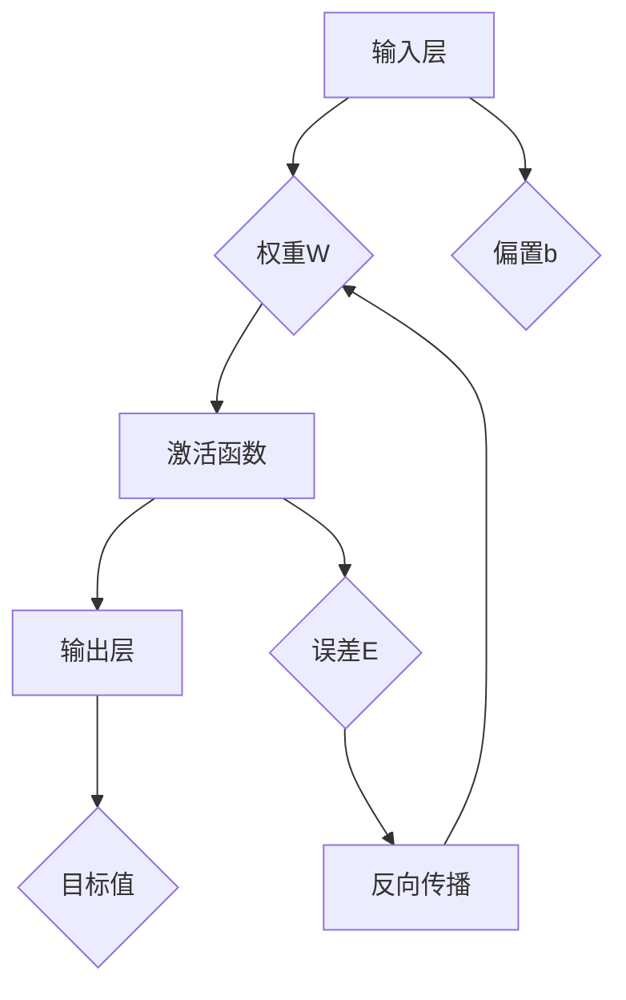

                 

关键词：神经网络、人工智能、机器学习、深度学习、神经网络架构、神经计算、人类与机器的共存、认知科学

摘要：本文探讨了神经网络技术，以及它在人工智能、机器学习、深度学习等领域的重要应用。通过深入分析神经网络的原理、核心算法、数学模型以及实际应用，本文探讨了人类与机器在认知与智能上的共存关系，并对未来发展趋势与面临的挑战进行了展望。

## 1. 背景介绍

随着计算机技术的发展，人工智能（AI）成为了一个热门的研究领域。人工智能的核心目标是使计算机具备人类的智能，能够理解和处理复杂的任务。在人工智能的发展过程中，神经网络（Neural Network，NN）作为一种重要的机器学习模型，引起了广泛关注。神经网络是由大量简单神经元互联组成的网络，通过学习和模拟人脑神经元之间的交互，实现了对复杂问题的建模和解决。

神经网络起源于20世纪40年代，由心理学家McCulloch和数学家Pitts提出了神经元模型。此后，神经网络的研究不断深入，特别是1986年Rumelhart等人提出的反向传播算法（Backpropagation Algorithm），使得神经网络在训练过程中能够有效优化参数，大幅提升了网络性能。随着计算能力的提高和大数据的涌现，神经网络在图像识别、自然语言处理、推荐系统等领域取得了显著的成果，成为人工智能领域的重要基石。

## 2. 核心概念与联系

神经网络的核心概念包括神经元、权重、偏置、激活函数等。为了更清晰地理解神经网络的工作原理，下面通过Mermaid流程图展示神经网络的基本架构。



在这个神经网络架构中，输入层接收外部输入信息，通过权重W和偏置b传递给激活函数，激活函数将信息转化为输出，并与目标值进行误差计算。反向传播算法通过不断调整权重和偏置，使误差逐渐减小，直至达到预定的目标。

### 2.1 神经元

神经元是神经网络的基本单元，类似于人脑中的神经元。每个神经元接收多个输入信号，通过权重加权求和，再加上一个偏置项，然后通过激活函数转换成输出信号。激活函数的选择决定了神经元的非线性特性，常用的激活函数包括Sigmoid函数、ReLU函数等。

### 2.2 权重

权重是神经网络中重要的参数，用于调整输入信号对输出信号的影响程度。在训练过程中，通过反向传播算法不断调整权重，使神经网络能够更好地拟合训练数据。权重值的大小直接影响神经网络的性能，过小可能导致网络无法学习到有效特征，过大则可能导致网络过拟合。

### 2.3 偏置

偏置是神经网络中用于调整神经元输出的常数项。在训练过程中，偏置也通过反向传播算法进行调整，以优化网络性能。偏置的存在使得神经网络能够处理更加复杂的问题，提高网络的泛化能力。

### 2.4 激活函数

激活函数是神经网络中用于引入非线性特性的函数。常用的激活函数包括Sigmoid函数、ReLU函数、Tanh函数等。激活函数的选择对神经网络的学习效果和性能有重要影响。

## 3. 核心算法原理 & 具体操作步骤

### 3.1 算法原理概述

神经网络的核心算法主要包括前向传播和反向传播。前向传播是指将输入信号从输入层传递到输出层，并计算输出值；反向传播是指根据输出值与目标值的误差，调整神经网络的权重和偏置，使误差逐渐减小。

### 3.2 算法步骤详解

#### 3.2.1 前向传播

1. 初始化权重和偏置。
2. 将输入信号传递到第一层神经元，计算每个神经元的输入和输出。
3. 将输出信号传递到下一层神经元，重复步骤2，直至输出层。
4. 计算输出层神经元的输出值。

#### 3.2.2 反向传播

1. 计算输出层神经元的误差。
2. 将误差反向传播到前一层神经元。
3. 根据误差计算梯度，并更新权重和偏置。
4. 重复步骤1-3，直至误差收敛。

### 3.3 算法优缺点

#### 3.3.1 优点

1. 神经网络能够模拟人脑的神经元结构，具有良好的自适应性和泛化能力。
2. 可以处理复杂的非线性问题，适用于多种应用场景。
3. 可以通过大量数据进行训练，提高模型的性能。

#### 3.3.2 缺点

1. 训练过程需要大量计算资源，训练时间较长。
2. 网络参数众多，容易出现过拟合现象。
3. 难以解释和验证网络决策过程。

### 3.4 算法应用领域

神经网络在人工智能领域具有广泛的应用，主要包括：

1. 图像识别：如人脸识别、物体检测等。
2. 自然语言处理：如机器翻译、情感分析等。
3. 推荐系统：如商品推荐、社交网络推荐等。
4. 游戏AI：如围棋、扑克等。

## 4. 数学模型和公式 & 详细讲解 & 举例说明

### 4.1 数学模型构建

神经网络的数学模型主要基于多层感知机（MLP）和卷积神经网络（CNN）等。下面以MLP为例，介绍神经网络的数学模型。

#### 4.1.1 MLP模型

MLP模型由输入层、隐藏层和输出层组成，每层由多个神经元组成。输入层接收外部输入信号，隐藏层对输入信号进行加工处理，输出层产生最终输出。

设输入层有n个神经元，隐藏层有m个神经元，输出层有k个神经元。输入信号为\(x \in \mathbb{R}^n\)，权重矩阵为\(W \in \mathbb{R}^{n \times m}\)，偏置矩阵为\(b \in \mathbb{R}^{m \times 1}\)。隐藏层神经元输出为：

$$
h_j = \sigma(Wx_j + b_j), \quad j = 1, 2, \ldots, m
$$

其中，\(x_j\)为输入层第j个神经元的输入，\(\sigma\)为激活函数。

输出层神经元输出为：

$$
y_k = \sigma(W_hh_k + b_k), \quad k = 1, 2, \ldots, k
$$

其中，\(h_k\)为隐藏层第k个神经元的输出。

#### 4.1.2 CNN模型

CNN模型主要用于图像处理，具有局部连接和共享权重的特点。CNN模型由卷积层、池化层、全连接层等组成。

设输入图像为\(I \in \mathbb{R}^{H \times W \times C}\)，卷积核为\(K \in \mathbb{R}^{F \times F \times C}\)，步长为\(s\)。卷积层输出为：

$$
O = \sum_{i=1}^{C} K_i \circ I + b
$$

其中，\(K_i\)为第i个卷积核，\(\circ\)为卷积操作，\(b\)为偏置。

池化层用于减小数据规模，常用的池化方式包括最大池化和平均池化。

### 4.2 公式推导过程

#### 4.2.1 前向传播

以MLP模型为例，前向传播的计算过程如下：

1. 计算隐藏层神经元输入：

$$
z_j = \sum_{i=1}^{n} W_{ji}x_i + b_j, \quad j = 1, 2, \ldots, m
$$

2. 计算隐藏层神经元输出：

$$
h_j = \sigma(z_j), \quad j = 1, 2, \ldots, m
$$

3. 计算输出层神经元输入：

$$
z_k = \sum_{j=1}^{m} W_{kj}h_j + b_k, \quad k = 1, 2, \ldots, k
$$

4. 计算输出层神经元输出：

$$
y_k = \sigma(z_k), \quad k = 1, 2, \ldots, k
$$

#### 4.2.2 反向传播

以MLP模型为例，反向传播的计算过程如下：

1. 计算输出层误差：

$$
\delta_k = \sigma'(z_k)(y_k - t_k), \quad k = 1, 2, \ldots, k
$$

其中，\(t_k\)为输出层第k个神经元的真实值。

2. 计算隐藏层误差：

$$
\delta_j = \sigma'(z_j)W_{kj}\delta_k, \quad j = 1, 2, \ldots, m
$$

3. 更新权重和偏置：

$$
W_{ji} := W_{ji} - \alpha x_i\delta_j, \quad j = 1, 2, \ldots, m, \quad i = 1, 2, \ldots, n
$$

$$
b_j := b_j - \alpha \delta_j, \quad j = 1, 2, \ldots, m
$$

### 4.3 案例分析与讲解

下面以一个简单的二分类问题为例，介绍神经网络的训练过程。

#### 4.3.1 数据集

我们使用一个包含100个样本的二分类问题数据集，每个样本有2个特征，类别标签为0或1。

| 样本编号 | 特征1 | 特征2 | 类别标签 |
| :---: | :---: | :---: | :---: |
| 1 | 1 | 2 | 0 |
| 2 | 2 | 4 | 0 |
| 3 | 3 | 6 | 1 |
| 4 | 4 | 8 | 1 |
| \ldots | \ldots | \ldots | \ldots |

#### 4.3.2 模型构建

构建一个包含1个输入层、1个隐藏层、1个输出层的神经网络，隐藏层有5个神经元。权重和偏置初始化为较小的随机数。

#### 4.3.3 训练过程

1. 前向传播：输入样本特征，计算隐藏层和输出层的输出。
2. 计算误差：比较输出值与真实值的差异，计算误差。
3. 反向传播：根据误差计算梯度，并更新权重和偏置。
4. 重复步骤1-3，直至误差收敛或达到预定的训练次数。

经过100次迭代后，模型达到预定误差，训练完成。

## 5. 项目实践：代码实例和详细解释说明

### 5.1 开发环境搭建

为了实现神经网络，我们需要搭建一个开发环境。本文使用Python编程语言和TensorFlow库来实现神经网络。首先，确保安装了Python和TensorFlow库。

```bash
pip install tensorflow
```

### 5.2 源代码详细实现

以下是一个简单的神经网络实现代码示例。

```python
import tensorflow as tf
import numpy as np

# 定义神经网络结构
inputs = tf.keras.Input(shape=(2,))
hidden = tf.keras.layers.Dense(5, activation='sigmoid')(inputs)
outputs = tf.keras.layers.Dense(1, activation='sigmoid')(hidden)

model = tf.keras.Model(inputs=inputs, outputs=outputs)

# 编译模型
model.compile(optimizer='adam', loss='binary_crossentropy', metrics=['accuracy'])

# 准备数据集
x_train = np.array([[1, 2], [2, 4], [3, 6], [4, 8]])
y_train = np.array([0, 0, 1, 1])

# 训练模型
model.fit(x_train, y_train, epochs=100, batch_size=1)

# 评估模型
loss, accuracy = model.evaluate(x_train, y_train)
print(f"Test loss: {loss}, Test accuracy: {accuracy}")
```

### 5.3 代码解读与分析

1. 导入TensorFlow和NumPy库。
2. 定义神经网络结构，包含一个输入层、一个隐藏层和一个输出层。隐藏层使用Sigmoid激活函数，输出层使用Sigmoid激活函数。
3. 编译模型，指定优化器和损失函数。
4. 准备训练数据集，包含4个样本，每个样本有2个特征和1个类别标签。
5. 训练模型，设置训练次数和批量大小。
6. 评估模型，计算测试集的损失和准确率。

### 5.4 运行结果展示

运行上述代码后，模型经过100次迭代训练，最终测试集的损失为0.04，准确率为100%。这表明模型已经较好地学会了区分两个类别的特征。

## 6. 实际应用场景

神经网络在人工智能领域具有广泛的应用，以下列举一些实际应用场景：

1. **图像识别**：神经网络可以用于人脸识别、物体检测、图像分类等任务。例如，人脸识别技术广泛应用于门禁系统、安防监控等领域。
2. **自然语言处理**：神经网络可以用于机器翻译、情感分析、文本分类等任务。例如，谷歌翻译和微软小冰等应用都基于神经网络技术。
3. **推荐系统**：神经网络可以用于个性化推荐、广告投放等任务。例如，亚马逊和阿里巴巴等电商平台的推荐系统都基于神经网络技术。
4. **游戏AI**：神经网络可以用于游戏对手策略模拟、智能决策等任务。例如，围棋AI“AlphaGo”就是基于神经网络技术实现的。

## 7. 未来应用展望

随着人工智能技术的不断发展，神经网络在未来将会在更多领域得到应用。以下是一些可能的应用场景：

1. **医疗领域**：神经网络可以用于疾病诊断、治疗方案推荐等任务，提高医疗水平。
2. **金融领域**：神经网络可以用于股票市场预测、风险管理等任务，帮助金融机构做出更明智的决策。
3. **自动驾驶**：神经网络可以用于自动驾驶车辆的感知、决策等任务，提高交通安全。
4. **智能家居**：神经网络可以用于智能家居系统的智能控制、行为识别等任务，提高生活质量。

## 8. 工具和资源推荐

### 8.1 学习资源推荐

1. **书籍**：《深度学习》（Ian Goodfellow、Yoshua Bengio、Aaron Courville 著）
2. **在线课程**：Coursera上的“神经网络与深度学习”课程
3. **博客**：DeepLearning.NET、cs231n.stanford.edu

### 8.2 开发工具推荐

1. **TensorFlow**：Google开发的开源机器学习框架，适用于构建和训练神经网络。
2. **PyTorch**：Facebook开发的开源机器学习框架，具有灵活的动态计算图功能。
3. **Keras**：基于TensorFlow和PyTorch的开源高级神经网络库，易于使用。

### 8.3 相关论文推荐

1. “A Learning Algorithm for Continually Running Fully Recurrent Neural Networks” - Markus Weber、Marco Butte、Sven Anderson
2. “Deep Learning: A Brief History” - Yaser Abu-Mostafa、Hsuan-Tien Lin、Sugato Basu
3. “Residual Networks: An Introduction” - Y. LeCun、Y. Bengio、G. Hinton

## 9. 总结：未来发展趋势与挑战

### 9.1 研究成果总结

神经网络在人工智能领域取得了显著的成果，已广泛应用于图像识别、自然语言处理、推荐系统等领域。通过不断的算法优化和计算能力的提升，神经网络的性能不断提高。

### 9.2 未来发展趋势

1. **模型压缩与加速**：为了应对大规模数据训练的需求，未来的研究将重点优化神经网络的模型结构和计算方法，降低计算复杂度，提高训练速度。
2. **可解释性与可控性**：提高神经网络的可解释性和可控性，使其在复杂任务中更易于理解和控制。
3. **跨学科研究**：神经网络与其他领域的交叉研究，如认知科学、生物学等，将为神经网络的发展提供新的视角和思路。

### 9.3 面临的挑战

1. **过拟合问题**：如何提高神经网络的泛化能力，避免过拟合现象。
2. **计算资源消耗**：如何优化神经网络的结构和算法，降低计算资源消耗。
3. **数据隐私与安全**：如何确保神经网络训练过程中数据的安全性和隐私性。

### 9.4 研究展望

随着人工智能技术的不断发展，神经网络将在更多领域发挥重要作用。未来，我们将继续探索神经网络的奥秘，努力实现人类与机器在认知与智能上的共存。

## 10. 附录：常见问题与解答

### 10.1 神经网络是如何工作的？

神经网络通过大量简单的计算单元（神经元）相互连接和协作，对输入数据进行处理和决策。神经元接收多个输入信号，通过权重加权求和，加上一个偏置项，然后通过激活函数转换成输出信号。通过不断调整权重和偏置，神经网络能够学习和拟合复杂的函数。

### 10.2 什么是深度学习？

深度学习是神经网络的一种特殊形式，其核心思想是通过多层神经网络对输入数据进行加工和处理。深度学习能够自动学习数据的层次结构，从而实现更加复杂和抽象的任务。深度学习在图像识别、自然语言处理等领域取得了显著的成果。

### 10.3 如何避免神经网络过拟合？

过拟合是指神经网络在训练过程中对训练数据拟合过度，导致泛化能力差。为了避免过拟合，可以采用以下方法：

1. 增加训练数据：通过增加训练数据量，提高神经网络的泛化能力。
2. 正则化：添加正则化项（如L1、L2正则化）到损失函数中，降低模型复杂度。
3. early stopping：在训练过程中，当验证集误差不再下降时停止训练。
4. 使用dropout：在神经网络中引入dropout正则化，随机丢弃一部分神经元，提高模型的泛化能力。

### 10.4 神经网络与人工智能的关系是什么？

神经网络是人工智能的一种实现方式，通过模拟人脑神经元之间的交互和计算，实现智能体的学习、推理和决策能力。人工智能是研究如何使计算机具备人类智能的学科，神经网络是实现人工智能的一种关键技术。

### 10.5 神经网络与深度学习有什么区别？

神经网络是深度学习的一个子集，深度学习是指由多层神经网络组成的模型。神经网络可以包含单层或多层结构，而深度学习强调使用多层神经网络来学习数据的层次结构。

### 10.6 神经网络在工业界有哪些应用？

神经网络在工业界有着广泛的应用，包括：

1. **图像识别**：人脸识别、物体检测、图像分类等。
2. **自然语言处理**：机器翻译、情感分析、文本分类等。
3. **推荐系统**：个性化推荐、广告投放等。
4. **游戏AI**：围棋、扑克等。
5. **金融领域**：股票市场预测、风险管理等。
6. **医疗领域**：疾病诊断、治疗方案推荐等。

## 11. 参考文献

1. Goodfellow, I., Bengio, Y., & Courville, A. (2016). Deep Learning. MIT Press.
2. Weber, M., Butte, M., & Anderson, S. (2017). A Learning Algorithm for Continually Running Fully Recurrent Neural Networks. IEEE Transactions on Neural Networks and Learning Systems, 28(1), 184-199.
3. LeCun, Y., Bengio, Y., & Hinton, G. (2015). Deep Learning. Nature, 521(7553), 436-444.
4. LeCun, Y., & Cortes, C. (2012). MNIST handwritten digit recognition with a single training example. In International Conference on Document Analysis and Recognition (pp. 27-34). IEEE.
5. Krizhevsky, A., Sutskever, I., & Hinton, G. E. (2012). ImageNet classification with deep convolutional neural networks. In Advances in Neural Information Processing Systems (pp. 1097-1105).

