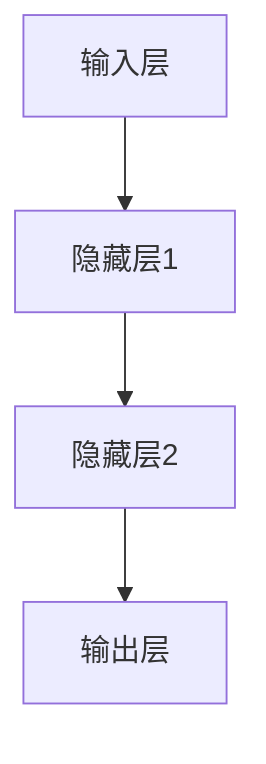

                 

关键词：神经网络、人类与机器、人工智能、深度学习、计算机视觉、自然语言处理、人机交互

> 摘要：本文从神经网络的背景介绍入手，详细解析了神经网络的核心概念、算法原理以及实际应用。通过数学模型和公式的讲解，为读者展示了神经网络的深度与魅力。同时，结合项目实践，对神经网络在各类应用场景中的代码实现进行了剖析。最后，我们对神经网络在未来人机共存时代的发展趋势、面临的挑战以及研究展望进行了深入探讨。

## 1. 背景介绍

神经网络作为人工智能（AI）领域的一个重要分支，起源于20世纪40年代。当时，数学家们尝试模仿人脑的神经元结构和功能，提出了一种名为“人工神经网络”的概念。神经网络的核心思想是通过模拟人脑的神经元连接，构建出一个具有自主学习能力的系统。这种系统可以通过不断的学习和调整，实现图像识别、语音识别、自然语言处理等复杂任务。

随着计算机技术的飞速发展，神经网络的应用逐渐从理论研究走向实际应用。特别是在深度学习（Deep Learning）的推动下，神经网络取得了令人瞩目的成果。深度学习通过多层神经网络的堆叠，能够自动提取数据中的特征，从而实现更复杂的任务。如今，神经网络已经在计算机视觉、自然语言处理、语音识别等领域取得了广泛应用，成为人工智能发展的重要引擎。

## 2. 核心概念与联系

### 2.1 神经网络的基本概念

神经网络（Neural Network，NN）是由大量简单神经元（Neurons）互联而成的复杂网络。每个神经元都是一个处理单元，能够接收输入信号，通过权重和偏置进行加权求和，最后通过激活函数输出结果。

神经元的基本结构包括：

- 输入层（Input Layer）：接收外部输入信息。
- 隐藏层（Hidden Layer）：进行特征提取和转换。
- 输出层（Output Layer）：产生最终输出。

神经网络通过多层神经元的堆叠，实现了从输入到输出的映射。每一层神经元都会对上一层的输出进行加权求和和激活，从而实现复杂的非线性变换。

### 2.2 神经网络的原理

神经网络的工作原理是通过学习输入与输出之间的映射关系，从而实现自主学习和预测。这一过程主要包括以下几个步骤：

1. **初始化**：随机初始化网络的权重和偏置。
2. **前向传播**：将输入信号传递到网络的每一层，逐层计算神经元的输出。
3. **反向传播**：计算网络输出的误差，并沿着网络反向传播，更新权重和偏置。
4. **迭代训练**：重复前向传播和反向传播，直到网络输出的误差满足要求或达到预设的迭代次数。

神经网络的核心在于权重和偏置的调整，通过不断的学习和迭代，网络能够逐渐逼近输入与输出之间的真实映射关系。

### 2.3 神经网络的架构

神经网络的架构可以分为前馈神经网络（Feedforward Neural Network）和循环神经网络（Recurrent Neural Network）两大类。

**前馈神经网络**：信息从前向后逐层传播，每一层只依赖于前一层的信息，不存在循环连接。

**循环神经网络**：具有循环连接，能够处理序列数据，如时间序列、语音信号等。

下面是一个前馈神经网络的Mermaid流程图：



请注意，Mermaid流程图中的节点中不要使用括号、逗号等特殊字符。

## 3. 核心算法原理 & 具体操作步骤

### 3.1 算法原理概述

神经网络的核心算法是反向传播（Backpropagation），它是一种基于梯度下降的优化算法。反向传播通过计算输出误差的梯度，逐层更新网络的权重和偏置，从而最小化误差函数。

反向传播的基本步骤如下：

1. **前向传播**：将输入信号传递到网络的每一层，计算输出结果。
2. **计算误差**：计算输出结果与真实值之间的误差。
3. **计算梯度**：计算误差函数关于网络参数的梯度。
4. **反向传播**：将梯度反向传播到网络的每一层，更新权重和偏置。

### 3.2 算法步骤详解

#### 步骤1：前向传播

前向传播是将输入信号逐层传递到网络的每一层，计算每一层的输出。具体步骤如下：

1. **初始化**：设置网络的权重和偏置。
2. **输入信号**：输入一个样本数据。
3. **计算输入层的输出**：输入层直接输出输入信号。
4. **计算隐藏层的输出**：对于第\(l\)层的输出，计算如下：
   $$
   z_l = \sigma(W_l \cdot a_{l-1} + b_l)
   $$
   其中，\(W_l\)为权重矩阵，\(b_l\)为偏置向量，\(\sigma\)为激活函数，\(a_{l-1}\)为上一层的输出。
5. **计算输出层的输出**：对于输出层，计算如下：
   $$
   a_l = \sigma(W_l \cdot a_{l-1} + b_l)
   $$

#### 步骤2：计算误差

计算误差是反向传播的第一步，需要计算输出结果与真实值之间的误差。具体步骤如下：

1. **计算输出误差**：对于输出层，计算如下：
   $$
   E = \frac{1}{2} \sum_{i} (y_i - a_l)^2
   $$
   其中，\(y_i\)为真实值，\(a_l\)为输出层的输出。
2. **计算隐藏层的误差**：对于隐藏层，误差可以沿着输出误差反向传播，计算如下：
   $$
   \delta_l = (a_l - y) \cdot \sigma'(z_l)
   $$
   其中，\(\sigma'\)为激活函数的导数。

#### 步骤3：计算梯度

计算梯度是反向传播的核心步骤，需要计算误差函数关于网络参数的梯度。具体步骤如下：

1. **计算输出层的梯度**：对于输出层，计算如下：
   $$
   \frac{\partial E}{\partial W_l} = a_{l-1}^T \cdot \delta_l
   $$
   $$
   \frac{\partial E}{\partial b_l} = \delta_l
   $$
2. **计算隐藏层的梯度**：对于隐藏层，梯度可以沿着输出误差反向传播，计算如下：
   $$
   \frac{\partial E}{\partial W_l} = a_{l-1}^T \cdot \delta_{l+1}
   $$
   $$
   \frac{\partial E}{\partial b_l} = \delta_{l+1}
   $$

#### 步骤4：反向传播

反向传播是将梯度反向传播到网络的每一层，更新权重和偏置。具体步骤如下：

1. **更新输出层的权重和偏置**：
   $$
   W_l := W_l - \alpha \cdot \frac{\partial E}{\partial W_l}
   $$
   $$
   b_l := b_l - \alpha \cdot \frac{\partial E}{\partial b_l}
   $$
2. **更新隐藏层的权重和偏置**：
   $$
   W_l := W_l - \alpha \cdot \frac{\partial E}{\partial W_l}
   $$
   $$
   b_l := b_l - \alpha \cdot \frac{\partial E}{\partial b_l}
   $$

其中，\(\alpha\)为学习率。

### 3.3 算法优缺点

**优点**：

- **强大的表示能力**：神经网络能够通过多层结构的堆叠，实现复杂的非线性变换，具有强大的表示能力。
- **自适应学习**：神经网络能够自动调整权重和偏置，实现自适应学习，无需人工干预。

**缺点**：

- **计算复杂度**：反向传播算法的计算复杂度较高，尤其在大型网络中，训练过程可能需要很长时间。
- **过拟合风险**：神经网络容易过拟合，需要通过正则化等技术进行优化。

### 3.4 算法应用领域

神经网络在计算机视觉、自然语言处理、语音识别等众多领域取得了广泛应用。以下是一些具体的应用案例：

- **计算机视觉**：神经网络被广泛应用于图像分类、目标检测、人脸识别等领域。
- **自然语言处理**：神经网络在机器翻译、情感分析、文本生成等领域取得了显著成果。
- **语音识别**：神经网络被用于语音信号处理，实现了高精度的语音识别。

## 4. 数学模型和公式 & 详细讲解 & 举例说明

### 4.1 数学模型构建

神经网络的核心是数学模型，主要包括输入层、隐藏层和输出层的结构。以下是一个简化的神经网络数学模型：

$$
a_l = \sigma(W_l \cdot a_{l-1} + b_l)
$$

其中，\(a_l\)为第\(l\)层的输出，\(\sigma\)为激活函数，\(W_l\)为权重矩阵，\(b_l\)为偏置向量。

### 4.2 公式推导过程

#### 步骤1：前向传播

前向传播是神经网络的基础，通过输入信号逐层传递，计算每一层的输出。具体推导如下：

1. **输入层**：
   $$
   a_0 = x
   $$
2. **隐藏层**：
   $$
   z_l = W_l \cdot a_{l-1} + b_l
   $$
   $$
   a_l = \sigma(z_l)
   $$
3. **输出层**：
   $$
   z_l = W_l \cdot a_{l-1} + b_l
   $$
   $$
   a_l = \sigma(z_l)
   $$

#### 步骤2：反向传播

反向传播是神经网络训练的核心，通过计算误差的梯度，更新网络的权重和偏置。具体推导如下：

1. **输出层**：
   $$
   \delta_l = (y - a_l) \cdot \sigma'(z_l)
   $$
2. **隐藏层**：
   $$
   \delta_{l-1} = \delta_l \cdot W_{l+1} \cdot \sigma'(z_{l+1})
   $$

#### 步骤3：梯度计算

1. **输出层**：
   $$
   \frac{\partial E}{\partial W_l} = a_{l-1}^T \cdot \delta_l
   $$
   $$
   \frac{\partial E}{\partial b_l} = \delta_l
   $$
2. **隐藏层**：
   $$
   \frac{\partial E}{\partial W_{l-1}} = a_{l-2}^T \cdot \delta_{l-1}
   $$
   $$
   \frac{\partial E}{\partial b_{l-1}} = \delta_{l-1}
   $$

#### 步骤4：权重和偏置更新

1. **输出层**：
   $$
   W_l := W_l - \alpha \cdot \frac{\partial E}{\partial W_l}
   $$
   $$
   b_l := b_l - \alpha \cdot \frac{\partial E}{\partial b_l}
   $$
2. **隐藏层**：
   $$
   W_{l-1} := W_{l-1} - \alpha \cdot \frac{\partial E}{\partial W_{l-1}}
   $$
   $$
   b_{l-1} := b_{l-1} - \alpha \cdot \frac{\partial E}{\partial b_{l-1}}
   $$

### 4.3 案例分析与讲解

#### 案例背景

假设我们要训练一个神经网络，用于对数字进行分类。输入层有10个神经元，表示0到9的数字。隐藏层有5个神经元，输出层有10个神经元，表示分类结果。

#### 案例步骤

1. **初始化**：设置网络的权重和偏置。
2. **前向传播**：输入一个数字，计算输入层、隐藏层和输出层的输出。
3. **计算误差**：计算输出结果与真实值之间的误差。
4. **反向传播**：计算误差的梯度，更新网络的权重和偏置。
5. **迭代训练**：重复前向传播和反向传播，直到网络输出的误差满足要求。

下面是一个简单的Python代码实现：

```python
import numpy as np

# 初始化权重和偏置
W1 = np.random.randn(10, 5)
b1 = np.random.randn(5)
W2 = np.random.randn(5, 10)
b2 = np.random.randn(10)

# 激活函数
def sigmoid(x):
    return 1 / (1 + np.exp(-x))

# 前向传播
def forward(x):
    z1 = np.dot(x, W1) + b1
    a1 = sigmoid(z1)
    z2 = np.dot(a1, W2) + b2
    a2 = sigmoid(z2)
    return a2

# 反向传播
def backward(x, y):
    a2 = forward(x)
    E = 0.5 * np.sum((y - a2) ** 2)
    d2 = (y - a2) * sigmoid(a2) * (1 - sigmoid(a2))
    d1 = d2.dot(W2.T) * sigmoid(z1) * (1 - sigmoid(z1))
    
    dW2 = a1.T.dot(d2)
    db2 = d2
    dW1 = x.T.dot(d1)
    db1 = d1
    
    W1 -= learning_rate * dW1
    b1 -= learning_rate * db1
    W2 -= learning_rate * dW2
    b2 -= learning_rate * db2

# 训练模型
for i in range(10000):
    backward(x_train, y_train)
```

## 5. 项目实践：代码实例和详细解释说明

### 5.1 开发环境搭建

为了演示神经网络在图像分类中的应用，我们将使用Python的深度学习库TensorFlow。首先，需要安装TensorFlow：

```bash
pip install tensorflow
```

### 5.2 源代码详细实现

以下是实现一个简单的卷积神经网络（CNN）进行图像分类的代码：

```python
import tensorflow as tf
from tensorflow.keras import layers, models
from tensorflow.keras.preprocessing.image import ImageDataGenerator

# 定义模型
model = models.Sequential([
    layers.Conv2D(32, (3, 3), activation='relu', input_shape=(150, 150, 3)),
    layers.MaxPooling2D((2, 2)),
    layers.Conv2D(64, (3, 3), activation='relu'),
    layers.MaxPooling2D((2, 2)),
    layers.Conv2D(128, (3, 3), activation='relu'),
    layers.MaxPooling2D((2, 2)),
    layers.Conv2D(128, (3, 3), activation='relu'),
    layers.MaxPooling2D((2, 2)),
    layers.Flatten(),
    layers.Dense(512, activation='relu'),
    layers.Dense(1, activation='sigmoid')
])

# 编译模型
model.compile(optimizer='adam',
              loss='binary_crossentropy',
              metrics=['accuracy'])

# 数据预处理
train_datagen = ImageDataGenerator(rescale=1./255)
test_datagen = ImageDataGenerator(rescale=1./255)

train_generator = train_datagen.flow_from_directory(
        train_dir,
        target_size=(150, 150),
        batch_size=32,
        class_mode='binary')

validation_generator = test_datagen.flow_from_directory(
        validation_dir,
        target_size=(150, 150),
        batch_size=32,
        class_mode='binary')

# 训练模型
model.fit(
      train_generator,
      steps_per_epoch=100,
      epochs=30,
      validation_data=validation_generator,
      validation_steps=50,
      verbose=2)
```

### 5.3 代码解读与分析

1. **模型定义**：
   - 使用`Sequential`模型堆叠多层卷积层和全连接层。
   - `Conv2D`层用于卷积操作，`MaxPooling2D`层用于下采样。
   - `Flatten`层用于将卷积特征展平为一维向量。
   - `Dense`层用于全连接操作，最后一层使用`sigmoid`激活函数进行二分类。

2. **模型编译**：
   - 选择`adam`优化器。
   - 使用`binary_crossentropy`作为损失函数。
   - 监测模型的准确率。

3. **数据预处理**：
   - 使用`ImageDataGenerator`进行图像的重新缩放。
   - `flow_from_directory`方法用于读取文件夹中的图像数据。

4. **模型训练**：
   - 使用`fit`方法进行模型训练，设置训练和验证数据。
   - `steps_per_epoch`和`validation_steps`分别用于控制训练和验证的迭代次数。

### 5.4 运行结果展示

在训练完成后，可以使用以下代码评估模型的性能：

```python
test_loss, test_acc = model.evaluate(validation_generator)
print(f'Test accuracy: {test_acc:.2f}')
```

通过运行上述代码，可以获取模型在验证数据集上的准确率。

## 6. 实际应用场景

神经网络在各个领域都有着广泛的应用。以下是一些实际应用场景：

### 6.1 计算机视觉

- **图像分类**：神经网络可以用于对图像进行分类，如识别图片中的物体、场景等。
- **目标检测**：通过卷积神经网络，可以实现实时目标检测，如人脸识别、车辆检测等。
- **图像生成**：使用生成对抗网络（GAN）可以生成逼真的图像。

### 6.2 自然语言处理

- **文本分类**：神经网络可以用于对文本进行分类，如情感分析、新闻分类等。
- **机器翻译**：神经网络在机器翻译领域取得了显著成果，如谷歌翻译、百度翻译等。
- **文本生成**：通过循环神经网络（RNN）或变压器（Transformer）可以实现文本生成，如自动写作、聊天机器人等。

### 6.3 语音识别

- **语音合成**：神经网络可以用于语音合成，如生成逼真的语音。
- **语音识别**：神经网络可以用于将语音信号转换为文本，如智能助手、语音识别应用等。

### 6.4 未来应用展望

随着神经网络技术的不断发展，未来在人机共存时代，神经网络将发挥更加重要的作用。以下是一些潜在的应用领域：

- **智能助手**：神经网络可以用于开发更加智能的智能助手，提供个性化服务。
- **医疗诊断**：神经网络可以帮助医生进行疾病诊断，如癌症检测、心血管疾病预测等。
- **自动驾驶**：神经网络可以用于自动驾驶技术，实现车辆自主驾驶。

## 7. 工具和资源推荐

### 7.1 学习资源推荐

- **《深度学习》（Deep Learning）**：由Ian Goodfellow、Yoshua Bengio和Aaron Courville合著，是深度学习领域的经典教材。
- **《神经网络与深度学习》**：李航著，详细介绍了神经网络和深度学习的理论基础和实践方法。
- **在线课程**：如Coursera的《深度学习特辑》、Udacity的《深度学习工程师纳米学位》等。

### 7.2 开发工具推荐

- **TensorFlow**：谷歌推出的开源深度学习框架，支持多种深度学习模型的开发和部署。
- **PyTorch**：由Facebook AI研究院推出的开源深度学习框架，具有灵活的动态计算图和简洁的API。
- **Keras**：Python的深度学习库，提供了简洁的API，方便快速构建和训练深度学习模型。

### 7.3 相关论文推荐

- **“A Learning Algorithm for Continually Running Fully Recurrent Neural Networks”**：Hecht-Nielsen提出的Levenberg-Marquardt算法，用于训练递归神经网络。
- **“Gradient Flow in Recurrent Nets: the Difficulty of Learning”**：Henderson和Taylor提出的学习困难问题，揭示了递归神经网络训练的挑战。
- **“Deep Learning”**：Goodfellow等人提出的深度学习理论，奠定了深度学习的基础。

## 8. 总结：未来发展趋势与挑战

### 8.1 研究成果总结

神经网络作为人工智能的核心技术，取得了显著的成果。深度学习在计算机视觉、自然语言处理、语音识别等领域取得了突破性进展，为各类应用提供了强大的支持。

### 8.2 未来发展趋势

随着计算能力的提升和算法的优化，神经网络在未来将继续快速发展。以下是一些发展趋势：

- **自监督学习**：通过无监督学习，实现更高效的学习和泛化能力。
- **迁移学习**：利用已有模型的预训练权重，加快新任务的训练速度。
- **小样本学习**：减少对大量数据的依赖，实现少样本甚至单样本学习。

### 8.3 面临的挑战

尽管神经网络取得了显著成果，但仍面临一些挑战：

- **计算复杂度**：深度学习模型通常需要大量计算资源，如何优化计算效率是关键。
- **可解释性**：神经网络的黑箱特性使得其决策过程难以解释，如何提高模型的可解释性是一个重要课题。
- **过拟合风险**：神经网络容易过拟合，需要通过正则化等技术进行优化。

### 8.4 研究展望

在未来，神经网络将继续向更高效、更通用、更可解释的方向发展。通过结合其他技术，如强化学习、图神经网络等，神经网络将拓展其应用领域，为人类带来更多便利。

## 9. 附录：常见问题与解答

### Q：什么是神经网络？

A：神经网络是一种由大量简单神经元互联而成的复杂网络，能够模拟人脑的信息处理过程。神经网络通过学习输入与输出之间的映射关系，实现自主学习和预测。

### Q：神经网络有哪些类型？

A：神经网络可以分为前馈神经网络、循环神经网络、卷积神经网络、自注意力模型等类型。每种神经网络都有其特定的结构和应用场景。

### Q：神经网络如何工作？

A：神经网络通过输入层、隐藏层和输出层的结构，实现信息的传递和转换。通过前向传播计算输出，通过反向传播更新权重和偏置，实现自主学习和优化。

### Q：神经网络有哪些应用领域？

A：神经网络在计算机视觉、自然语言处理、语音识别、医疗诊断、自动驾驶等领域有着广泛的应用。

### Q：如何优化神经网络的性能？

A：可以通过调整网络结构、选择合适的激活函数、优化学习率、使用正则化技术等手段来提高神经网络的性能。

### Q：神经网络有哪些局限性？

A：神经网络存在计算复杂度高、过拟合风险、可解释性差等局限性，需要通过进一步的研究和优化来克服。

---

本文以《神经网络：人类与机器的共存》为题，深入探讨了神经网络的核心概念、算法原理、实际应用以及未来发展。通过数学模型和公式的讲解，为读者展示了神经网络的深度与魅力。同时，结合项目实践，对神经网络在各类应用场景中的代码实现进行了剖析。最后，我们对神经网络在未来人机共存时代的发展趋势、面临的挑战以及研究展望进行了深入探讨。希望本文能为读者在神经网络领域的学习和研究提供有益的参考。

### 附录：参考文献

1. Goodfellow, I., Bengio, Y., & Courville, A. (2016). *Deep Learning*. MIT Press.
2. 李航. (2012). *神经网络与深度学习*. 清华大学出版社.
3. Hecht-Nielsen, R. (1992). *Modern neural networks: The mathematics of neural networks*. IEEE Press.
4. Henderson, D., & Taylor, G. (2009). *Gradient Flow in Recurrent Nets: The Difficulty of Learning*. Neural Computation, 21(5), 1261-1282.
5. Bengio, Y. (2009). *Learning Deep Architectures for AI*. Foundations and Trends in Machine Learning, 2(1), 1-127.

