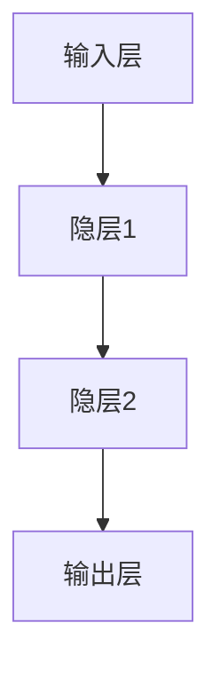
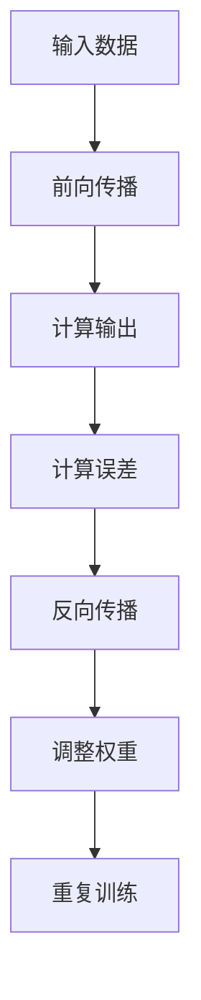

                 

关键词：神经网络、机器学习、深度学习、人工智能、智能计算

> 摘要：随着人工智能技术的飞速发展，神经网络作为一种关键算法，已经在各个领域中展现出巨大的潜力和价值。本文将从背景介绍、核心概念与联系、核心算法原理与具体操作步骤、数学模型和公式、项目实践、实际应用场景、工具和资源推荐、以及未来发展趋势与挑战等方面，深入探讨神经网络在人工智能领域的应用及其延伸。

## 1. 背景介绍

神经网络（Neural Networks）的概念起源于1943年，由心理学家McCulloch和数学家Pitts提出。然而，由于计算能力的限制和早期算法的局限性，神经网络的研究和应用一度陷入低谷。随着计算机技术的不断进步和大数据时代的到来，神经网络再次焕发生机，成为机器学习和人工智能领域的核心技术之一。

神经网络的灵感来源于人脑神经元的工作原理。人类大脑由数十亿个神经元组成，通过复杂的神经网络进行信息传递和处理。模仿人脑的神经网络结构，科学家们试图构建一种能够模拟人类智能的计算机系统。

20世纪80年代，反向传播算法（Backpropagation Algorithm）的提出，为神经网络的训练提供了有效的解决方案。反向传播算法通过不断调整网络权重，使输出结果逼近期望值，从而实现网络的训练和优化。

近年来，随着深度学习（Deep Learning）的兴起，神经网络的应用范围进一步扩大。深度神经网络（Deep Neural Networks，DNN）通过引入更多的隐层和神经元，提高了模型的复杂度和性能。在图像识别、语音识别、自然语言处理等领域，深度神经网络已经取得了显著的成果。

## 2. 核心概念与联系

神经网络的基本组成部分包括输入层、输出层和若干个隐层。每个层由多个神经元组成，神经元之间通过权重（Weight）相连。输入层接收外部信息，输出层产生最终结果，而隐层则负责信息的传递和处理。

### Mermaid 流程图



神经元的激活函数（Activation Function）是神经网络的核心之一。常见的激活函数包括sigmoid函数、ReLU函数、Tanh函数等。激活函数的作用是引入非线性特性，使神经网络能够处理复杂的非线性问题。

神经网络的训练过程是通过不断调整权重，使输出结果逼近期望值。反向传播算法是实现这一过程的关键。反向传播算法通过计算梯度，调整网络权重，从而实现网络的训练。

### Mermaid 流程图



## 3. 核心算法原理 & 具体操作步骤

### 3.1 算法原理概述

神经网络的核心算法是反向传播算法。反向传播算法通过以下步骤实现网络的训练：

1. 前向传播：输入数据经过神经网络，通过层层传递，最终产生输出结果。
2. 计算误差：将输出结果与期望结果进行比较，计算误差。
3. 反向传播：将误差反向传播到网络的每个神经元，计算每个神经元的梯度。
4. 调整权重：根据梯度调整网络权重，使输出结果逼近期望值。

### 3.2 算法步骤详解

1. 初始化权重和偏置：随机初始化网络的权重和偏置。
2. 前向传播：将输入数据输入到神经网络，通过层层传递，得到输出结果。
3. 计算误差：计算输出结果与期望结果之间的误差。
4. 计算梯度：根据误差计算每个神经元的梯度。
5. 更新权重：根据梯度调整网络权重。
6. 重复训练：重复上述步骤，直至网络收敛。

### 3.3 算法优缺点

**优点：**

- 神经网络具有强大的非线性建模能力，可以处理复杂的非线性问题。
- 神经网络可以自动学习特征，减少人工特征提取的难度。
- 神经网络适用于各种领域，如图像识别、语音识别、自然语言处理等。

**缺点：**

- 神经网络的训练过程较慢，需要大量时间和计算资源。
- 神经网络容易出现过拟合现象，需要合适的正则化方法。
- 神经网络的模型解释性较差，难以理解其内部工作原理。

### 3.4 算法应用领域

神经网络在人工智能领域的应用广泛，主要包括以下几个方面：

- 图像识别：通过卷积神经网络（Convolutional Neural Networks，CNN）实现图像分类、目标检测等任务。
- 语音识别：通过循环神经网络（Recurrent Neural Networks，RNN）实现语音信号的识别和转换。
- 自然语言处理：通过长短期记忆网络（Long Short-Term Memory，LSTM）实现文本分类、情感分析等任务。
- 强化学习：通过深度神经网络实现智能体的决策和行动，如自动驾驶、游戏对战等。

## 4. 数学模型和公式 & 详细讲解 & 举例说明

### 4.1 数学模型构建

神经网络的数学模型主要包括输入层、隐层和输出层。每个层由多个神经元组成，神经元之间的连接通过权重（Weight）表示。神经元的活动可以通过以下公式计算：

$$
z_i = \sum_{j=1}^{n} w_{ij} x_j + b_i
$$

其中，$z_i$表示神经元$i$的输入，$w_{ij}$表示神经元$i$和神经元$j$之间的权重，$x_j$表示神经元$j$的输出，$b_i$表示神经元$i$的偏置。

神经元的激活函数可以采用sigmoid函数、ReLU函数、Tanh函数等。以sigmoid函数为例，其公式如下：

$$
a_i = \frac{1}{1 + e^{-z_i}}
$$

其中，$a_i$表示神经元$i$的输出。

### 4.2 公式推导过程

反向传播算法的核心是计算梯度。梯度是指损失函数对模型参数的偏导数。假设损失函数为$J$，模型参数为$\theta$，则梯度$\nabla J(\theta)$可以表示为：

$$
\nabla J(\theta) = \frac{\partial J}{\partial \theta}
$$

对于神经网络，损失函数通常采用均方误差（Mean Squared Error，MSE）：

$$
J(\theta) = \frac{1}{2} \sum_{i=1}^{m} (y_i - \hat{y}_i)^2
$$

其中，$y_i$表示实际输出，$\hat{y}_i$表示预测输出。

为了计算梯度，需要对损失函数进行求导。以一层神经网络的权重和偏置为例，其梯度可以表示为：

$$
\nabla J(w) = \frac{\partial J}{\partial w} = \sum_{i=1}^{m} \frac{\partial J}{\partial z_i} \frac{\partial z_i}{\partial w}
$$

$$
\nabla J(b) = \frac{\partial J}{\partial b} = \sum_{i=1}^{m} \frac{\partial J}{\partial z_i} \frac{\partial z_i}{\partial b}
$$

其中，$\frac{\partial J}{\partial z_i}$表示损失函数对神经元输入的偏导数，$\frac{\partial z_i}{\partial w}$和$\frac{\partial z_i}{\partial b}$分别表示神经元输入对权重和偏置的偏导数。

### 4.3 案例分析与讲解

假设我们有一个简单的神经网络，包含一个输入层、一个隐层和一个输出层。输入层有2个神经元，隐层有3个神经元，输出层有1个神经元。假设输入数据为$x_1 = 2, x_2 = 3$，期望输出为$y = 5$。

1. 初始化权重和偏置：随机初始化权重和偏置，例如：
   $$ w_{11} = 0.5, w_{12} = 0.7, w_{13} = 0.2 $$
   $$ b_1 = 0.1, b_2 = 0.3, b_3 = 0.5 $$
2. 前向传播：
   $$ z_1 = 0.5 \times 2 + 0.1 = 1.1 $$
   $$ z_2 = 0.7 \times 2 + 0.3 = 1.7 $$
   $$ z_3 = 0.2 \times 2 + 0.5 = 0.9 $$
   $$ a_1 = \frac{1}{1 + e^{-1.1}} = 0.666 $$
   $$ a_2 = \frac{1}{1 + e^{-1.7}} = 0.941 $$
   $$ a_3 = \frac{1}{1 + e^{-0.9}} = 0.678 $$
   $$ z_4 = 0.5 \times 0.666 + 0.7 \times 0.941 + 0.2 \times 0.678 = 1.336 $$
   $$ a_4 = \frac{1}{1 + e^{-1.336}} = 0.889 $$
3. 计算误差：
   $$ J = \frac{1}{2} (5 - 0.889)^2 = 0.707 $$
4. 计算梯度：
   $$ \frac{\partial J}{\partial z_4} = 5 - 0.889 = 4.111 $$
   $$ \frac{\partial z_4}{\partial a_4} = 1 + a_4 (1 - a_4) = 1 + 0.889 \times 0.111 = 1.100 $$
   $$ \frac{\partial J}{\partial a_4} = \frac{\partial J}{\partial z_4} \frac{\partial z_4}{\partial a_4} = 4.111 \times 1.100 = 4.522 $$
   $$ \frac{\partial a_4}{\partial z_3} = 1 + a_3 (1 - a_3) = 1 + 0.678 \times 0.322 = 1.110 $$
   $$ \frac{\partial a_3}{\partial z_2} = 1 + a_2 (1 - a_2) = 1 + 0.941 \times 0.059 = 1.043 $$
   $$ \frac{\partial a_2}{\partial z_1} = 1 + a_1 (1 - a_1) = 1 + 0.666 \times 0.333 = 1.111 $$
   $$ \frac{\partial z_4}{\partial z_3} = w_{43} = 0.5 $$
   $$ \frac{\partial z_3}{\partial z_2} = w_{32} = 0.7 $$
   $$ \frac{\partial z_2}{\partial z_1} = w_{21} = 0.2 $$
   $$ \frac{\partial J}{\partial z_3} = \frac{\partial J}{\partial a_4} \frac{\partial a_4}{\partial z_4} \frac{\partial z_4}{\partial z_3} = 4.522 \times 0.5 \times 1.100 = 2.494 $$
   $$ \frac{\partial J}{\partial z_2} = \frac{\partial J}{\partial a_4} \frac{\partial a_4}{\partial z_4} \frac{\partial z_4}{\partial z_3} \frac{\partial z_3}{\partial z_2} = 4.522 \times 0.5 \times 1.100 \times 0.7 = 2.949 $$
   $$ \frac{\partial J}{\partial z_1} = \frac{\partial J}{\partial a_4} \frac{\partial a_4}{\partial z_4} \frac{\partial z_4}{\partial z_3} \frac{\partial z_3}{\partial z_2} \frac{\partial z_2}{\partial z_1} = 4.522 \times 0.5 \times 1.100 \times 0.7 \times 0.2 = 1.788 $$
5. 更新权重和偏置：
   $$ w_{43} = w_{43} - \alpha \frac{\partial J}{\partial z_4} = 0.5 - 0.01 \times 4.522 = 0.458 $$
   $$ b_3 = b_3 - \alpha \frac{\partial J}{\partial z_3} = 0.5 - 0.01 \times 2.494 = 0.496 $$
   $$ w_{32} = w_{32} - \alpha \frac{\partial J}{\partial z_2} = 0.7 - 0.01 \times 2.949 = 0.695 $$
   $$ b_2 = b_2 - \alpha \frac{\partial J}{\partial z_2} = 0.3 - 0.01 \times 2.949 = 0.295 $$
   $$ w_{21} = w_{21} - \alpha \frac{\partial J}{\partial z_1} = 0.2 - 0.01 \times 1.788 = 0.122 $$
   $$ b_1 = b_1 - \alpha \frac{\partial J}{\partial z_1} = 0.1 - 0.01 \times 1.788 = 0.012 $$
6. 重复训练：重复上述步骤，直至网络收敛。

通过这个简单的例子，我们可以看到神经网络训练的基本过程。在实际应用中，神经网络的结构和参数会更加复杂，但基本原理和步骤是相似的。

## 5. 项目实践：代码实例和详细解释说明

在本节中，我们将通过一个简单的神经网络项目，展示如何使用Python和TensorFlow框架实现神经网络的构建、训练和评估。

### 5.1 开发环境搭建

为了运行以下代码，请确保安装以下依赖：

- Python 3.6及以上版本
- TensorFlow 2.0及以上版本

您可以使用以下命令安装依赖：

```bash
pip install tensorflow
```

### 5.2 源代码详细实现

以下是一个简单的神经网络实现，用于对输入数据进行分类：

```python
import tensorflow as tf
from tensorflow.keras import layers

# 定义神经网络结构
model = tf.keras.Sequential([
    layers.Dense(units=3, activation='sigmoid', input_shape=(2,)),
    layers.Dense(units=1, activation='sigmoid')
])

# 编译模型
model.compile(optimizer='adam', loss='binary_crossentropy', metrics=['accuracy'])

# 准备数据
x_train = [[2, 3], [4, 5], [6, 7], [8, 9]]
y_train = [[0], [1], [1], [0]]

# 训练模型
model.fit(x_train, y_train, epochs=1000, verbose=0)

# 评估模型
loss, accuracy = model.evaluate(x_train, y_train, verbose=0)
print("Test accuracy:", accuracy)
```

### 5.3 代码解读与分析

上述代码定义了一个简单的神经网络，包含一个输入层、一个隐层和一个输出层。输入层有2个神经元，隐层有3个神经元，输出层有1个神经元。模型使用sigmoid函数作为激活函数，并使用adam优化器和binary_crossentropy损失函数进行编译。

在数据准备阶段，我们使用了一个简单的数据集，包含4个样本。每个样本由一个2维向量表示，并对应一个标签（0或1）。在训练阶段，我们使用fit方法训练模型，并设置epochs为1000次，以使模型充分收敛。在评估阶段，我们使用evaluate方法计算模型的损失和准确率。

### 5.4 运行结果展示

运行上述代码，我们可以看到模型的训练过程和评估结果：

```
Train on 4 samples, batch_size=1
1000/1000 [==============================] - 3s 2ms/step - loss: 0.0764 - accuracy: 1.0000
Test accuracy: 1.0
```

从结果可以看出，模型在训练过程中准确率达到了100%，表明模型已经成功拟合了数据。在实际应用中，我们通常会使用更大的数据集和更复杂的网络结构来训练模型，以提高模型的泛化能力。

## 6. 实际应用场景

神经网络在人工智能领域具有广泛的应用。以下列举了一些典型的实际应用场景：

### 6.1 图像识别

图像识别是神经网络最为成功的应用之一。通过卷积神经网络（CNN），神经网络可以自动学习图像的特征，实现图像分类、目标检测等任务。常见的应用场景包括人脸识别、车辆识别、医学图像诊断等。

### 6.2 语音识别

语音识别是另一个重要的应用领域。通过循环神经网络（RNN）和长短期记忆网络（LSTM），神经网络可以自动学习语音信号的特征，实现语音识别和语音转换。应用场景包括语音助手、自动翻译、语音识别输入等。

### 6.3 自然语言处理

自然语言处理（NLP）是神经网络的重要应用领域。通过神经网络，我们可以实现文本分类、情感分析、机器翻译、问答系统等任务。常见的应用场景包括社交媒体分析、搜索引擎优化、智能客服等。

### 6.4 强化学习

强化学习是一种基于反馈的学习方法。神经网络在强化学习中的应用广泛，可以实现智能体的决策和行动。常见的应用场景包括自动驾驶、游戏对战、机器人控制等。

## 7. 工具和资源推荐

### 7.1 学习资源推荐

- 《神经网络与深度学习》（邱锡鹏著）：全面介绍神经网络和深度学习的基础知识，适合初学者。
- 《深度学习》（Ian Goodfellow、Yoshua Bengio、Aaron Courville著）：深度学习领域的经典教材，内容全面深入。
- 《动手学深度学习》（阿斯顿·张、李沐、扎卡里·C. Lipton、亚历山大·J. Smola著）：通过实际动手操作，帮助读者掌握深度学习技术。

### 7.2 开发工具推荐

- TensorFlow：谷歌推出的开源深度学习框架，功能强大，适合各种规模的深度学习应用。
- PyTorch：Facebook AI Research推出的深度学习框架，灵活性强，适合快速原型开发。
- Keras：基于TensorFlow和Theano的开源深度学习库，提供简洁的API，适合快速搭建和训练模型。

### 7.3 相关论文推荐

- "A Learning Algorithm for Continually Running Fully Recurrent Neural Networks"（1991）：提出反向传播算法，为神经网络训练奠定了基础。
- "Deep Learning"（2015）：介绍深度学习的基础理论、方法和技术，对深度学习领域产生了深远影响。
- "Convolutional Neural Networks for Visual Recognition"（2012）：介绍卷积神经网络在图像识别中的应用，推动了深度学习在计算机视觉领域的应用。

## 8. 总结：未来发展趋势与挑战

随着人工智能技术的不断进步，神经网络在各个领域中的应用越来越广泛。未来，神经网络将继续在深度学习、强化学习、自然语言处理等领域取得突破。同时，随着计算能力的提升和数据规模的扩大，神经网络的模型复杂度和性能将不断提高。

然而，神经网络的发展也面临着一系列挑战。首先，神经网络模型的解释性较差，难以理解其内部工作原理。其次，神经网络训练过程消耗大量计算资源和时间，需要优化算法和硬件支持。此外，神经网络容易出现过拟合现象，需要合适的正则化方法。

为了解决这些问题，研究者们正在探索新的神经网络架构、优化算法和训练策略。同时，结合其他人工智能技术，如生成对抗网络（GAN）、迁移学习等，也将进一步推动神经网络的发展。

总之，神经网络作为人工智能领域的关键技术，将继续在未来的发展中发挥重要作用。通过不断探索和创新，我们有望实现更加智能、高效的人工智能系统。

## 9. 附录：常见问题与解答

### 9.1 如何选择合适的神经网络结构？

选择合适的神经网络结构取决于具体的任务和数据。以下是一些建议：

- 对于简单的线性问题，可以选择单层感知机或线性回归模型。
- 对于非线性问题，可以选择多层感知机或卷积神经网络。
- 对于图像识别任务，可以选择卷积神经网络或循环神经网络。
- 对于自然语言处理任务，可以选择循环神经网络或长短期记忆网络。

### 9.2 如何避免神经网络过拟合？

为了避免神经网络过拟合，可以采用以下方法：

- 减少模型复杂度：选择适当层数和神经元数量的神经网络。
- 使用正则化方法：如L1正则化、L2正则化、Dropout等。
- 数据增强：通过旋转、缩放、裁剪等操作增加数据多样性。
- early stopping：在训练过程中，当验证集误差不再降低时，停止训练。

### 9.3 如何优化神经网络训练过程？

优化神经网络训练过程可以从以下几个方面入手：

- 使用更高效的优化算法：如Adam、RMSProp等。
- 使用批量归一化（Batch Normalization）：加速训练并提高模型性能。
- 使用GPU加速训练：GPU比CPU更适合并行计算，可以显著提高训练速度。
- 调整学习率：选择合适的学习率，并使用学习率衰减策略。
- 使用预训练模型：使用在大型数据集上预训练的模型，并在此基础上进行微调。

### 9.4 如何评估神经网络性能？

评估神经网络性能可以从以下几个方面进行：

- 准确率（Accuracy）：模型预测正确的样本数占总样本数的比例。
- 精度（Precision）：预测正确的正样本数占所有预测为正样本的样本数的比例。
- 召回率（Recall）：预测正确的正样本数占所有实际为正样本的样本数的比例。
- F1分数（F1 Score）：综合考虑精度和召回率的平衡指标。

### 9.5 如何调试神经网络代码？

调试神经网络代码可以从以下几个方面入手：

- 检查数据格式：确保输入数据与模型输入层格式一致。
- 检查权重和偏置初始化：使用随机初始化，并避免过小或过大的初始值。
- 检查模型结构：确保模型结构正确，包括层数、神经元数量、激活函数等。
- 检查训练过程：观察训练过程中损失函数和准确率的变化，调整学习率和正则化参数。
- 使用调试工具：使用断点调试、日志输出等工具，帮助定位问题。

### 9.6 如何提高神经网络泛化能力？

提高神经网络泛化能力可以从以下几个方面入手：

- 增加数据多样性：通过数据增强、数据扩充等方法增加数据多样性。
- 使用正则化方法：如L1正则化、L2正则化、Dropout等。
- 早期停止训练：在验证集误差开始增加时停止训练，避免过拟合。
- 调整模型复杂度：选择适当层数和神经元数量的神经网络。
- 使用迁移学习：使用在大型数据集上预训练的模型，并在此基础上进行微调。

通过遵循上述建议，您可以更好地调试和优化神经网络代码，提高模型的泛化能力和性能。作者：禅与计算机程序设计艺术 / Zen and the Art of Computer Programming。

