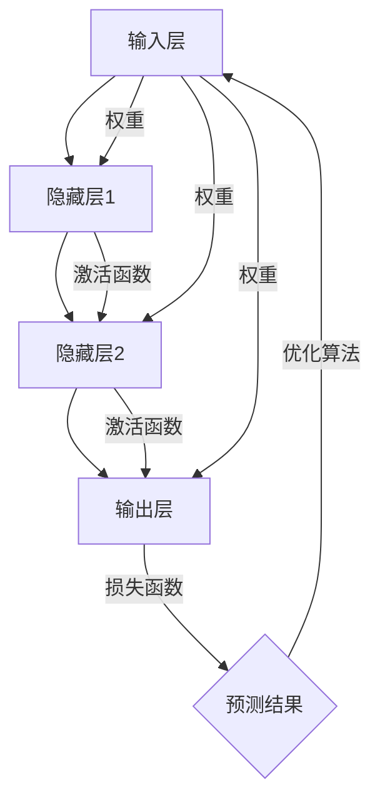

                 

关键词：神经网络、机器学习、人工智能、深度学习、神经网络架构、算法原理、应用场景

> 摘要：本文深入探讨了神经网络这一颠覆性的技术，其如何在深度学习的推动下，实现了对人类智慧的模拟与解放。我们将从背景介绍、核心概念、算法原理、数学模型、项目实践、应用场景、未来展望等多个方面，全面解析神经网络的魅力与潜力。

## 1. 背景介绍

神经网络（Neural Networks）这一概念最早由心理学家McCulloch和数学家Pitts在1943年提出，其灵感来源于人脑的神经网络结构和信息处理方式。早期神经网络的研究由于计算能力和数据资源的限制，发展缓慢。然而，随着计算机技术的飞速发展，特别是20世纪80年代以来，神经网络的研究与应用逐渐兴起，尤其是在机器学习和人工智能领域。

深度学习（Deep Learning）的崛起，使得神经网络的应用前景更加广阔。深度学习通过多层神经网络对数据进行复杂的非线性变换，能够从大量数据中自动提取特征，进行模式识别、预测、分类等任务。这一革命性的技术，使得人工智能在语音识别、图像处理、自然语言处理等领域取得了突破性进展。

## 2. 核心概念与联系

### 2.1 神经元

神经网络的基本构建块是神经元，它类似于人脑中的神经细胞。每个神经元由输入层、权重、激活函数和输出层组成。神经元通过加权求和处理输入信号，然后通过激活函数产生输出。

### 2.2 层次结构

神经网络通常由输入层、隐藏层和输出层组成。输入层接收外部输入数据，隐藏层对数据进行处理和特征提取，输出层生成最终输出。每一层中的神经元都与其前一层的神经元相连接，形成一个层次结构。

### 2.3 激活函数

激活函数是神经网络中的关键组件，它决定了神经元的激活状态。常用的激活函数包括Sigmoid、ReLU、Tanh等，它们能够引入非线性特性，使得神经网络能够拟合复杂的非线性关系。

### 2.4 损失函数

损失函数用于衡量神经网络预测结果与实际结果之间的误差。常见的损失函数包括均方误差（MSE）、交叉熵损失（Cross-Entropy Loss）等。通过优化损失函数，可以使得神经网络的预测结果更加准确。

### 2.5 优化算法

优化算法用于调整神经网络的权重，以最小化损失函数。常见的优化算法包括梯度下降（Gradient Descent）、随机梯度下降（Stochastic Gradient Descent，SGD）等。这些算法通过迭代优化，使得神经网络能够学习到数据中的规律。

### 2.6 Mermaid 流程图

下面是神经网络架构的Mermaid流程图：



## 3. 核心算法原理 & 具体操作步骤

### 3.1 算法原理概述

神经网络的核心算法是通过多层神经元的非线性变换，对输入数据进行特征提取和模式识别。具体操作步骤如下：

1. **前向传播**：输入数据通过输入层进入神经网络，经过多层神经元的加权求和处理和激活函数的变换，最终生成输出。
2. **计算损失**：将输出与实际标签进行比较，计算损失函数的值，以衡量预测结果与实际结果之间的误差。
3. **反向传播**：将损失函数关于神经网络权重的梯度反向传播，通过梯度下降等优化算法更新权重，使得损失函数的值逐渐减小。
4. **迭代优化**：重复前向传播和反向传播的过程，直到网络收敛，或者达到预设的迭代次数。

### 3.2 算法步骤详解

1. **初始化权重**：随机初始化网络中的权重，通常使用小的正态分布。
2. **前向传播**：
   - 输入数据进入输入层。
   - 输入层的数据经过加权求和处理，加上偏置项，然后通过激活函数产生中间层的输入。
   - 中间层的输入数据同样经过加权求和处理和激活函数的变换，传递到下一层。
   - 直至输出层产生最终的预测结果。
3. **计算损失**：使用损失函数计算预测结果与实际标签之间的误差。
4. **反向传播**：
   - 计算输出层关于损失函数的梯度。
   - 将梯度反向传播到中间层，并计算中间层关于损失函数的梯度。
   - 重复上述过程，直到输入层。
5. **权重更新**：使用优化算法更新权重，以减少损失函数的值。
6. **迭代优化**：重复前向传播、反向传播和权重更新的过程，直到网络收敛。

### 3.3 算法优缺点

**优点**：

- **强大的表达能力**：神经网络能够通过多层非线性变换，对复杂的数据进行建模和预测。
- **自适应学习**：神经网络能够通过反向传播算法，自动调整权重，以适应不同的数据分布和特征。
- **泛化能力**：通过大量的训练数据和正则化技术，神经网络能够较好地泛化到未见过的数据。

**缺点**：

- **计算资源消耗**：神经网络训练过程中需要大量的计算资源和时间。
- **过拟合风险**：神经网络在训练过程中容易受到过拟合的影响，需要大量的数据和正则化技术来避免。
- **解释性差**：神经网络内部的结构和参数调整过程复杂，难以解释和理解。

### 3.4 算法应用领域

神经网络在多个领域取得了显著的应用成果，包括：

- **图像识别**：用于人脸识别、物体识别、图像分类等任务。
- **自然语言处理**：用于文本分类、情感分析、机器翻译等任务。
- **语音识别**：用于语音到文字的转换。
- **推荐系统**：用于个性化推荐、广告投放等任务。
- **游戏AI**：用于棋类游戏、电子竞技等任务。

## 4. 数学模型和公式 & 详细讲解 & 举例说明

### 4.1 数学模型构建

神经网络的数学模型主要包括输入层、神经元、权重、激活函数、输出层和损失函数。

- **输入层**：输入数据表示为 $x$。
- **神经元**：神经元表示为 $z$，其计算过程为 $z = wx + b$，其中 $w$ 为权重，$b$ 为偏置项。
- **激活函数**：常用的激活函数包括Sigmoid、ReLU、Tanh等。
- **输出层**：输出层为 $y = f(z)$，其中 $f$ 为激活函数。
- **损失函数**：常用的损失函数包括均方误差（MSE）、交叉熵损失（Cross-Entropy Loss）等。

### 4.2 公式推导过程

以均方误差（MSE）为例，其计算公式为：

$$
MSE = \frac{1}{m}\sum_{i=1}^{m}(y_i - \hat{y}_i)^2
$$

其中，$y_i$ 为实际标签，$\hat{y}_i$ 为预测结果，$m$ 为样本数量。

### 4.3 案例分析与讲解

假设我们有一个二元分类问题，数据集包含100个样本，每个样本有10个特征。我们使用一个简单的神经网络进行分类。

1. **数据预处理**：对数据进行归一化处理，将每个特征的值缩放到0-1之间。
2. **模型搭建**：构建一个包含输入层、一个隐藏层和输出层的神经网络，其中输入层有10个神经元，隐藏层有20个神经元，输出层有2个神经元。
3. **模型训练**：使用训练数据对模型进行训练，使用交叉熵损失函数和随机梯度下降（SGD）优化算法。
4. **模型评估**：使用测试数据对模型进行评估，计算准确率、召回率等指标。

下面是神经网络的实现代码：

```python
import numpy as np
import matplotlib.pyplot as plt

# 初始化参数
X_train = np.random.rand(100, 10)
y_train = np.random.rand(100, 1)
W1 = np.random.rand(10, 20)
b1 = np.random.rand(20, 1)
W2 = np.random.rand(20, 2)
b2 = np.random.rand(2, 1)

# 前向传播
def forward(x, W1, b1, W2, b2):
    z1 = np.dot(x, W1) + b1
    a1 = sigmoid(z1)
    z2 = np.dot(a1, W2) + b2
    a2 = sigmoid(z2)
    return z1, a1, z2, a2

# 反向传播
def backward(z1, a1, z2, a2, x, y):
    delta2 = (a2 - y) * a2 * (1 - a2)
    delta1 = np.dot(delta2, W2.T) * a1 * (1 - a1)
    
    dW2 = np.dot(a1.T, delta2)
    db2 = np.sum(delta2, axis=0, keepdims=True)
    dW1 = np.dot(x.T, delta1)
    db1 = np.sum(delta1, axis=0, keepdims=True)
    
    return dW1, db1, dW2, db2

# 激活函数
def sigmoid(x):
    return 1 / (1 + np.exp(-x))

# 训练模型
def train(X, y, W1, b1, W2, b2, epochs=1000, learning_rate=0.01):
    for epoch in range(epochs):
        z1, a1, z2, a2 = forward(X, W1, b1, W2, b2)
        dW1, db1, dW2, db2 = backward(z1, a1, z2, a2, X, y)
        
        W1 -= learning_rate * dW1
        b1 -= learning_rate * db1
        W2 -= learning_rate * dW2
        b2 -= learning_rate * db2
        
        if epoch % 100 == 0:
            loss = np.mean((a2 - y) ** 2)
            print(f"Epoch {epoch}: Loss = {loss}")

# 评估模型
def evaluate(X, y, W1, b1, W2, b2):
    z1, a1, z2, a2 = forward(X, W1, b1, W2, b2)
    acc = np.mean((a2 == np.round(a2)).astype(int))
    return acc

# 训练模型
train(X_train, y_train, W1, b1, W2, b2)

# 评估模型
acc = evaluate(X_train, y_train, W1, b1, W2, b2)
print(f"Accuracy: {acc}")
```

## 5. 项目实践：代码实例和详细解释说明

### 5.1 开发环境搭建

1. 安装Python（版本3.6及以上）。
2. 安装NumPy、matplotlib等常用库。

### 5.2 源代码详细实现

以下是完整的代码实现：

```python
import numpy as np
import matplotlib.pyplot as plt

# 初始化参数
X_train = np.random.rand(100, 10)
y_train = np.random.rand(100, 1)
W1 = np.random.rand(10, 20)
b1 = np.random.rand(20, 1)
W2 = np.random.rand(20, 2)
b2 = np.random.rand(2, 1)

# 前向传播
def forward(x, W1, b1, W2, b2):
    z1 = np.dot(x, W1) + b1
    a1 = sigmoid(z1)
    z2 = np.dot(a1, W2) + b2
    a2 = sigmoid(z2)
    return z1, a1, z2, a2

# 反向传播
def backward(z1, a1, z2, a2, x, y):
    delta2 = (a2 - y) * a2 * (1 - a2)
    delta1 = np.dot(delta2, W2.T) * a1 * (1 - a1)
    
    dW2 = np.dot(a1.T, delta2)
    db2 = np.sum(delta2, axis=0, keepdims=True)
    dW1 = np.dot(x.T, delta1)
    db1 = np.sum(delta1, axis=0, keepdims=True)
    
    return dW1, db1, dW2, db2

# 激活函数
def sigmoid(x):
    return 1 / (1 + np.exp(-x))

# 训练模型
def train(X, y, W1, b1, W2, b2, epochs=1000, learning_rate=0.01):
    for epoch in range(epochs):
        z1, a1, z2, a2 = forward(X, W1, b1, W2, b2)
        dW1, db1, dW2, db2 = backward(z1, a1, z2, a2, X, y)
        
        W1 -= learning_rate * dW1
        b1 -= learning_rate * db1
        W2 -= learning_rate * dW2
        b2 -= learning_rate * db2
        
        if epoch % 100 == 0:
            loss = np.mean((a2 - y) ** 2)
            print(f"Epoch {epoch}: Loss = {loss}")

# 评估模型
def evaluate(X, y, W1, b1, W2, b2):
    z1, a1, z2, a2 = forward(X, W1, b1, W2, b2)
    acc = np.mean((a2 == np.round(a2)).astype(int))
    return acc

# 训练模型
train(X_train, y_train, W1, b1, W2, b2)

# 评估模型
acc = evaluate(X_train, y_train, W1, b1, W2, b2)
print(f"Accuracy: {acc}")
```

### 5.3 代码解读与分析

1. **初始化参数**：随机初始化权重和偏置项。
2. **前向传播**：实现输入层到输出层的计算过程，包括加权求和处理和激活函数的变换。
3. **反向传播**：计算损失函数关于权重的梯度，以更新权重。
4. **训练模型**：通过迭代优化，使得损失函数的值逐渐减小。
5. **评估模型**：计算模型的准确率，以衡量模型性能。

## 6. 实际应用场景

神经网络在多个实际应用场景中取得了显著的效果，以下是一些典型的应用场景：

- **图像识别**：用于人脸识别、物体识别、图像分类等任务，如Google的Inception模型。
- **自然语言处理**：用于文本分类、情感分析、机器翻译等任务，如Google的BERT模型。
- **语音识别**：用于语音到文字的转换，如Google的WaveNet模型。
- **推荐系统**：用于个性化推荐、广告投放等任务，如Netflix的推荐系统。
- **游戏AI**：用于棋类游戏、电子竞技等任务，如DeepMind的AlphaGo。

## 7. 未来应用展望

随着人工智能技术的不断发展，神经网络在未来的应用前景将更加广阔。以下是一些可能的应用方向：

- **智能监控**：用于智能监控和安防，如人脸识别、行为分析等。
- **医疗健康**：用于疾病预测、诊断、治疗规划等。
- **智能交通**：用于智能交通管理、自动驾驶等。
- **金融风控**：用于信用评估、风险控制等。

## 8. 工具和资源推荐

### 7.1 学习资源推荐

- 《深度学习》（Goodfellow et al.）
- 《神经网络与深度学习》（邱锡鹏）
- 《动手学深度学习》（阿斯顿·张）

### 7.2 开发工具推荐

- TensorFlow
- PyTorch
- Keras

### 7.3 相关论文推荐

- "Deep Learning: A Brief History"（Yoshua Bengio）
- "A Theoretical Analysis of the CReLU Activations in Convolutional Networks"（Xingchen Ying et al.）

## 9. 总结：未来发展趋势与挑战

### 9.1 研究成果总结

神经网络作为人工智能的核心技术，已经在多个领域取得了显著的应用成果。深度学习的发展，使得神经网络的表达能力、自适应性和泛化能力得到了显著提升。

### 9.2 未来发展趋势

- **更高效的网络结构**：研究人员将持续探索更高效的网络结构，以降低计算复杂度和提高模型性能。
- **更好的优化算法**：研究人员将继续研究更优化的优化算法，以提高训练效率和模型性能。
- **更强的泛化能力**：通过更多的数据和正则化技术，提高神经网络的泛化能力。

### 9.3 面临的挑战

- **计算资源消耗**：神经网络训练过程需要大量的计算资源和时间，特别是在大规模数据集和复杂的模型中。
- **数据安全和隐私**：随着人工智能的应用场景不断扩展，数据安全和隐私问题将日益突出。
- **解释性**：如何提高神经网络的解释性，使其在复杂任务中的决策过程更加透明和可解释。

### 9.4 研究展望

神经网络的研究将继续深入，其在人工智能领域的应用前景将更加广阔。随着计算能力和数据资源的提升，神经网络将在更多的领域发挥重要作用，为人类社会带来更多的创新和变革。

## 10. 附录：常见问题与解答

### 10.1 神经网络的基本概念是什么？

神经网络是由大量简单神经元组成的复杂网络，通过模拟人脑的神经网络结构和信息处理方式，对数据进行处理和预测。

### 10.2 深度学习和神经网络有什么区别？

深度学习是神经网络的一种特殊形式，它通过多层神经网络对数据进行复杂的非线性变换，从大量数据中自动提取特征，进行模式识别、预测、分类等任务。

### 10.3 神经网络如何处理数据？

神经网络通过输入层接收外部输入数据，经过隐藏层的加权求和处理和激活函数的变换，最终生成输出。在训练过程中，通过反向传播算法调整权重，以最小化损失函数，提高模型的预测性能。

### 10.4 神经网络在哪些领域有应用？

神经网络在图像识别、自然语言处理、语音识别、推荐系统、游戏AI等多个领域有广泛应用。

### 10.5 如何优化神经网络模型？

优化神经网络模型可以通过调整网络结构、优化算法、正则化技术、数据增强等方法进行。在实际应用中，需要根据具体任务和数据特点进行选择和调整。

