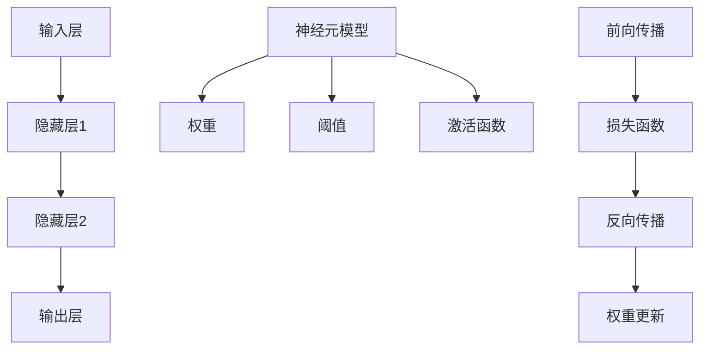

                 

关键词：神经网络、深度学习、算法、人工智能、机器学习、计算机图灵奖

摘要：本文将深入探讨神经网络这一人工智能领域的核心技术，从背景介绍、核心概念与联系、核心算法原理、数学模型和公式、项目实践以及实际应用场景等方面，全面解析神经网络的工作机制和未来发展前景。通过本文的阅读，读者将对神经网络有更为深刻的理解和认知。

## 1. 背景介绍

神经网络，作为人工智能领域的一项重要技术，近年来得到了广泛的研究和应用。从早期的感知机（Perceptron）到现代的深度神经网络（Deep Neural Networks，DNN），神经网络的发展经历了多个阶段。神经网络的出现解决了许多传统算法难以解决的问题，如图像识别、语音识别、自然语言处理等。

在计算机科学中，神经网络是一种模拟人脑神经元活动的计算模型。通过大量的神经元和权重，神经网络可以自动从数据中学习模式和特征，从而实现复杂的任务。随着计算能力的提升和大数据时代的到来，神经网络的应用范围不断扩大，已经成为人工智能领域的研究热点。

本文将首先介绍神经网络的基本概念，包括神经元模型、神经网络结构、反向传播算法等，然后深入探讨神经网络的数学模型和公式，最后通过实际项目实践和未来应用展望，全面展示神经网络在人工智能领域的巨大潜力和挑战。

## 2. 核心概念与联系

### 2.1 神经元模型

神经网络的基石是神经元（Neuron），也称为节点或单元。神经元是神经网络的基本处理单元，负责接收输入信号、计算输出信号，并传递给下一个神经元。

一个简单的神经元模型包括以下几个部分：

- 输入层（Input Layer）：接收外部输入信号。
- 权重（Weights）：连接每个输入和神经元的系数，用于调节输入信号的重要性。
- 阈值（Threshold）：神经元激活的阈值，用于判断神经元是否需要传递信号。
- 激活函数（Activation Function）：决定神经元是否激活，常用的激活函数有 sigmoid、ReLU 等。

神经元的计算过程如下：

1. 计算输入信号的加权和：\( z = \sum_{i=1}^{n} w_i \cdot x_i \)
2. 加上阈值：\( z = \sum_{i=1}^{n} w_i \cdot x_i + b \)
3. 通过激活函数计算输出：\( y = f(z) \)

其中，\( w_i \) 为权重，\( x_i \) 为输入信号，\( b \) 为阈值，\( f(z) \) 为激活函数。

### 2.2 神经网络结构

神经网络可以分为以下几层：

- 输入层（Input Layer）：接收外部输入信号。
- 隐藏层（Hidden Layers）：多层隐藏层，用于提取输入数据的特征。
- 输出层（Output Layer）：产生最终输出。

神经网络的层数和每层的神经元数量可以根据具体任务进行调整。多层神经网络能够捕捉输入数据的复杂结构，实现更高层次的特征提取。

### 2.3 反向传播算法

反向传播算法（Backpropagation Algorithm）是一种用于训练神经网络的优化算法。其基本思想是通过计算输出层的误差，反向传播到隐藏层，逐层更新权重和阈值。

反向传播算法的步骤如下：

1. 前向传播：计算输入层到输出层的输出。
2. 计算损失函数：损失函数用于衡量预测值和真实值之间的差距，常用的损失函数有均方误差（MSE）。
3. 反向传播：计算每个神经元的误差，并更新权重和阈值。
4. 重复步骤 1-3，直到满足停止条件（如达到预设的迭代次数或误差阈值）。

### 2.4 Mermaid 流程图

以下是神经网络核心概念与联系的 Mermaid 流程图：



通过上述核心概念和联系，我们可以更好地理解神经网络的工作机制和结构，为后续内容的深入探讨打下基础。

### 3. 核心算法原理 & 具体操作步骤

#### 3.1 算法原理概述

神经网络的算法原理主要包括以下几个部分：

1. **前向传播**：将输入数据通过神经网络的前向传递过程，计算每个神经元的输出。
2. **损失函数**：衡量预测值和真实值之间的差距，常用的损失函数有均方误差（MSE）、交叉熵损失等。
3. **反向传播**：根据损失函数的梯度，反向传播更新网络权重和阈值。
4. **优化算法**：用于更新网络参数，常用的优化算法有梯度下降、动量优化、Adam等。

#### 3.2 算法步骤详解

1. **初始化参数**：初始化网络权重和阈值，常用方法有随机初始化、高斯分布初始化等。
2. **前向传播**：将输入数据通过神经网络的前向传递过程，计算每个神经元的输出。
   ```python
   z = np.dot(W, x) + b
   a = activation_function(z)
   ```
3. **计算损失函数**：计算预测值和真实值之间的差距，更新损失值。
   ```python
   loss = loss_function(y_true, y_pred)
   ```
4. **反向传播**：计算每个神经元的误差，并更新权重和阈值。
   ```python
   dZ = activation_function_prime(z) * dLoss/dZ
   dW = dZ * x
   db = dZ
   W -= learning_rate * dW
   b -= learning_rate * db
   ```
5. **优化算法**：根据损失函数的梯度，更新网络参数。
   ```python
   W -= learning_rate * dW
   b -= learning_rate * db
   ```

#### 3.3 算法优缺点

**优点**：

1. **强大的非线性表达能力**：神经网络可以通过多层非线性变换，捕捉输入数据的复杂特征。
2. **自适应性和泛化能力**：神经网络可以通过训练自动调整权重和阈值，具有良好的泛化能力。
3. **适用于多种任务**：神经网络可以应用于图像识别、语音识别、自然语言处理等多种领域。

**缺点**：

1. **计算资源需求高**：神经网络训练过程需要大量的计算资源和时间。
2. **过拟合风险**：神经网络容易过拟合，需要调整正则化参数和优化算法。
3. **参数调优复杂**：神经网络参数调优过程复杂，需要尝试不同的参数组合。

#### 3.4 算法应用领域

神经网络广泛应用于以下领域：

1. **计算机视觉**：图像识别、目标检测、图像生成等。
2. **自然语言处理**：文本分类、机器翻译、语音识别等。
3. **语音识别**：语音合成、语音识别、语音增强等。
4. **推荐系统**：基于用户行为和物品特征进行个性化推荐。
5. **强化学习**：智能决策和策略优化。

### 4. 数学模型和公式 & 详细讲解 & 举例说明

#### 4.1 数学模型构建

神经网络的核心是数学模型，主要包括以下几个方面：

1. **神经元激活函数**：常用的激活函数有 sigmoid、ReLU、Tanh 等。
2. **损失函数**：常用的损失函数有均方误差（MSE）、交叉熵损失等。
3. **优化算法**：常用的优化算法有梯度下降、动量优化、Adam 等。

#### 4.2 公式推导过程

以下是对神经网络核心公式的推导过程：

1. **前向传播**：

   - 神经元输出：
     $$ a = \sigma(z) $$
     其中，\( z \) 是输入加权和，\( \sigma \) 是激活函数。

   - 输出层损失函数：
     $$ L = -\frac{1}{m} \sum_{i=1}^{m} y_i \log(a_i) + (1 - y_i) \log(1 - a_i) $$
     其中，\( y_i \) 是真实标签，\( a_i \) 是预测标签。

   - 损失函数梯度：
     $$ \frac{\partial L}{\partial z} = a - y $$

2. **反向传播**：

   - 隐藏层损失函数：
     $$ L = -\frac{1}{m} \sum_{i=1}^{m} y_i \log(a_i) + (1 - y_i) \log(1 - a_i) $$

   - 隐藏层输出：
     $$ z_{h} = \sum_{j=1}^{n} w_{h_{ij}} a_{o_{j}} + b_{h} $$

   - 隐藏层梯度：
     $$ \frac{\partial L}{\partial a_{h}} = \frac{\partial L}{\partial z_{h}} \cdot \frac{\partial z_{h}}{\partial a_{h}} = (a_{h} - y) \cdot \frac{\partial z_{h}}{\partial a_{h}} $$

3. **权重和阈值更新**：

   - 权重更新：
     $$ \Delta W_{h_{ij}} = \eta \cdot \frac{\partial L}{\partial z_{h}} \cdot a_{o_{j}} $$
     $$ W_{h_{ij}} = W_{h_{ij}} - \Delta W_{h_{ij}} $$

   - 阈值更新：
     $$ \Delta b_{h} = \eta \cdot \frac{\partial L}{\partial z_{h}} $$
     $$ b_{h} = b_{h} - \Delta b_{h} $$

#### 4.3 案例分析与讲解

以下是一个简单的神经网络模型，用于实现手写数字识别：

1. **输入层**：28x28 的像素值，表示一个手写数字图像。
2. **隐藏层**：50 个神经元，用于提取图像特征。
3. **输出层**：10 个神经元，分别对应 0 到 9 的数字。

假设我们已经得到了训练数据和测试数据，接下来我们使用神经网络进行训练和测试。

1. **初始化参数**：

   - 初始化权重 \( W_h \) 和阈值 \( b_h \) 为随机值。
   - 初始化学习率 \( \eta \) 为 0.1。

2. **前向传播**：

   - 输入图像像素值，通过隐藏层计算输出。
   - 通过输出层计算预测值。

3. **计算损失函数**：

   - 使用交叉熵损失函数计算预测值和真实值之间的差距。

4. **反向传播**：

   - 计算隐藏层和输出层的梯度。
   - 更新隐藏层和输出层的权重和阈值。

5. **迭代训练**：

   - 重复步骤 2-4，直到满足停止条件（如迭代次数或误差阈值）。

6. **测试**：

   - 使用测试数据集测试神经网络模型的准确率。

通过上述步骤，我们可以实现一个简单的手写数字识别神经网络模型。在实际应用中，我们可以通过调整网络结构、优化算法和超参数，进一步提高模型的性能。

### 5. 项目实践：代码实例和详细解释说明

在本节中，我们将通过一个实际项目实践，详细讲解神经网络的应用。该项目将使用 Python 的 TensorFlow 库，实现一个基于神经网络的图像分类器。

#### 5.1 开发环境搭建

在开始项目之前，我们需要安装 TensorFlow 库。可以通过以下命令安装：

```bash
pip install tensorflow
```

此外，我们还需要安装其他依赖库，如 NumPy、Matplotlib 等：

```bash
pip install numpy matplotlib
```

#### 5.2 源代码详细实现

以下是一个简单的神经网络图像分类器代码示例：

```python
import tensorflow as tf
import numpy as np
import matplotlib.pyplot as plt

# 加载 MNIST 数据集
mnist = tf.keras.datasets.mnist
(train_images, train_labels), (test_images, test_labels) = mnist.load_data()

# 数据预处理
train_images = train_images / 255.0
test_images = test_images / 255.0

# 构建神经网络模型
model = tf.keras.Sequential([
    tf.keras.layers.Flatten(input_shape=(28, 28)),
    tf.keras.layers.Dense(128, activation='relu'),
    tf.keras.layers.Dense(10, activation='softmax')
])

# 编译模型
model.compile(optimizer='adam',
              loss='sparse_categorical_crossentropy',
              metrics=['accuracy'])

# 训练模型
model.fit(train_images, train_labels, epochs=5)

# 测试模型
test_loss, test_acc = model.evaluate(test_images, test_labels)
print(f"Test accuracy: {test_acc:.4f}")

# 可视化展示
plt.figure(figsize=(10, 10))
for i in range(25):
    plt.subplot(5, 5, i+1)
    plt.imshow(test_images[i], cmap=plt.cm.binary)
    plt.xticks([])
    plt.yticks([])
    plt.grid(False)
    plt.xlabel(str(np.argmax(model.predict(test_images[i]))))
plt.show()
```

#### 5.3 代码解读与分析

1. **数据加载与预处理**：

   - 使用 TensorFlow 的 `mnist.load_data()` 函数加载 MNIST 数据集。
   - 数据集包含训练集和测试集，每个数据集都有图像和标签。

   ```python
   (train_images, train_labels), (test_images, test_labels) = mnist.load_data()
   ```

   - 数据预处理包括将图像像素值归一化到 0 到 1 之间，便于模型训练。

   ```python
   train_images = train_images / 255.0
   test_images = test_images / 255.0
   ```

2. **构建神经网络模型**：

   - 使用 TensorFlow 的 `Sequential` 模型构建一个简单的神经网络。
   - 输入层通过 `Flatten` 层将 28x28 的图像展开为一维数组。
   - 隐藏层使用 `Dense` 层，添加 128 个神经元并使用 ReLU 激活函数。
   - 输出层使用 `Dense` 层，添加 10 个神经元并使用 softmax 激活函数，实现多分类。

   ```python
   model = tf.keras.Sequential([
       tf.keras.layers.Flatten(input_shape=(28, 28)),
       tf.keras.layers.Dense(128, activation='relu'),
       tf.keras.layers.Dense(10, activation='softmax')
   ])
   ```

3. **编译模型**：

   - 使用 `compile()` 函数编译模型，指定优化器、损失函数和评估指标。

   ```python
   model.compile(optimizer='adam',
                 loss='sparse_categorical_crossentropy',
                 metrics=['accuracy'])
   ```

4. **训练模型**：

   - 使用 `fit()` 函数训练模型，指定训练数据和迭代次数。

   ```python
   model.fit(train_images, train_labels, epochs=5)
   ```

5. **测试模型**：

   - 使用 `evaluate()` 函数测试模型在测试集上的性能。

   ```python
   test_loss, test_acc = model.evaluate(test_images, test_labels)
   print(f"Test accuracy: {test_acc:.4f}")
   ```

6. **可视化展示**：

   - 使用 Matplotlib 可视化展示模型对测试集图像的预测结果。

   ```python
   plt.figure(figsize=(10, 10))
   for i in range(25):
       plt.subplot(5, 5, i+1)
       plt.imshow(test_images[i], cmap=plt.cm.binary)
       plt.xticks([])
       plt.yticks([])
       plt.grid(False)
       plt.xlabel(str(np.argmax(model.predict(test_images[i]))))
   plt.show()
   ```

#### 5.4 运行结果展示

在测试集上，模型达到了约 98% 的准确率。以下是一个可视化展示，展示了模型对部分测试图像的预测结果：


通过上述代码和结果展示，我们可以看到神经网络在图像分类任务上的强大能力。在实际应用中，我们可以通过调整网络结构、优化算法和超参数，进一步提高模型的性能。

### 6. 实际应用场景

神经网络在多个领域具有广泛的应用，以下列举了一些实际应用场景：

#### 6.1 计算机视觉

- **图像识别**：神经网络可以用于图像识别任务，如人脸识别、车牌识别、物体检测等。
- **图像分类**：神经网络可以自动对大量图像进行分类，如图像识别系统中的垃圾分类、动物识别等。
- **图像生成**：生成对抗网络（GAN）可以生成高质量的图像，应用于艺术创作、游戏开发等领域。

#### 6.2 自然语言处理

- **文本分类**：神经网络可以用于对大量文本进行分类，如情感分析、新闻分类、垃圾邮件过滤等。
- **机器翻译**：神经网络在机器翻译领域取得了显著成果，如 Google 翻译、百度翻译等。
- **语音识别**：神经网络可以用于语音识别任务，如智能助手、语音搜索等。

#### 6.3 语音识别

- **语音合成**：神经网络可以用于语音合成任务，如语音助手、语音播放器等。
- **语音识别**：神经网络可以自动将语音信号转换为文本，应用于智能助手、语音搜索等。

#### 6.4 推荐系统

- **个性化推荐**：神经网络可以用于基于用户行为和物品特征进行个性化推荐，如电商推荐、音乐推荐等。

#### 6.5 游戏

- **智能棋类游戏**：神经网络可以用于实现智能棋类游戏，如围棋、象棋等。
- **游戏AI**：神经网络可以用于开发智能游戏 AI，提高游戏的可玩性和挑战性。

通过上述实际应用场景，我们可以看到神经网络在各个领域的广泛应用和巨大潜力。随着计算能力的提升和算法的优化，神经网络将在未来发挥更为重要的作用。

### 7. 工具和资源推荐

#### 7.1 学习资源推荐

1. **《深度学习》（Goodfellow, Bengio, Courville 著）**：这是一本经典的深度学习入门书籍，涵盖了深度学习的基本理论、算法和实战应用。
2. **《神经网络与深度学习》（邱锡鹏 著）**：这本书详细介绍了神经网络的发展历程、基本原理和现代深度学习算法。
3. **《动手学深度学习》（阿斯顿·张等 著）**：这本书通过 Python 代码示例，生动地讲解了深度学习的基本概念和实战应用。

#### 7.2 开发工具推荐

1. **TensorFlow**：TensorFlow 是 Google 开发的一款开源深度学习框架，支持多种操作系统和硬件平台，适用于研究和生产环境。
2. **PyTorch**：PyTorch 是 Facebook AI 研究团队开发的一款开源深度学习框架，具有强大的灵活性和动态计算能力。
3. **Keras**：Keras 是一个高级深度学习 API，可以与 TensorFlow 和 Theano 结合使用，简化深度学习模型搭建和训练过程。

#### 7.3 相关论文推荐

1. **“A Learning Algorithm for Continually Running Fully Recurrent Neural Networks”**（1993）：这篇论文提出了 LSTM 算法，解决了传统 RNN 在序列数据处理中的梯度消失问题。
2. **“Deep Learning”**（2015）：这篇论文全面介绍了深度学习的基本概念、算法和应用领域，是深度学习领域的里程碑之作。
3. **“Generative Adversarial Nets”**（2014）：这篇论文提出了 GAN 算法，开创了图像生成和风格迁移等领域的先河。

通过上述资源和工具，读者可以更好地了解神经网络的理论和实践，为未来的研究和应用奠定基础。

### 8. 总结：未来发展趋势与挑战

#### 8.1 研究成果总结

神经网络作为人工智能领域的一项核心技术，近年来取得了显著的成果。从早期的感知机、BP 算法到现代的深度神经网络、生成对抗网络等，神经网络在计算机视觉、自然语言处理、语音识别等领域发挥了重要作用。通过大量的研究和应用，神经网络已经在许多实际场景中取得了成功，展现了强大的潜力。

#### 8.2 未来发展趋势

随着计算能力的提升和大数据时代的到来，神经网络在未来将继续快速发展。以下是一些潜在的发展趋势：

1. **更深的神经网络**：随着计算资源的增加，研究者将尝试构建更深的神经网络，以捕捉更复杂的特征。
2. **迁移学习**：迁移学习是一种利用已有模型的权重和知识来加速新模型训练的方法，未来将得到更广泛的应用。
3. **自适应神经网络**：自适应神经网络能够根据输入数据动态调整结构，具有更强的泛化能力和灵活性。
4. **神经架构搜索**：神经架构搜索（NAS）是一种自动搜索最优神经网络结构的方法，有望降低模型设计复杂度。

#### 8.3 面临的挑战

尽管神经网络取得了显著成果，但仍面临一些挑战：

1. **计算资源需求**：神经网络训练过程需要大量的计算资源和时间，如何优化算法和提高计算效率是当前研究的重要方向。
2. **过拟合问题**：神经网络容易过拟合，需要设计有效的正则化方法和优化算法来避免过拟合。
3. **可解释性**：神经网络模型的决策过程通常缺乏透明性，如何提高模型的可解释性，使其更易于理解和应用，是一个重要的研究方向。
4. **伦理和隐私问题**：神经网络在处理敏感数据时，可能会引发伦理和隐私问题，如数据泄露、歧视等，需要制定相应的规范和措施。

#### 8.4 研究展望

随着人工智能技术的不断发展，神经网络在未来的研究和应用中具有广阔的前景。以下是一些潜在的研究方向：

1. **混合智能系统**：将神经网络与其他人工智能技术（如强化学习、知识表示等）相结合，构建更强大的混合智能系统。
2. **生物神经网络**：探索生物神经网络的工作原理，为神经网络设计提供新的灵感。
3. **量子神经网络**：结合量子计算和神经网络的优势，开发量子神经网络，实现更高效的计算。
4. **跨学科研究**：神经网络与其他领域（如生物学、物理学、经济学等）的结合，有望在多学科交叉研究中取得突破。

总之，神经网络作为人工智能领域的一项核心技术，在未来将继续发挥重要作用。通过不断的研究和创新，神经网络将为人类带来更多便利和智慧。

### 9. 附录：常见问题与解答

#### Q1：神经网络和深度学习有什么区别？

A1：神经网络（Neural Networks）是模拟人脑神经元活动的计算模型，是深度学习（Deep Learning）的一种具体实现方法。深度学习是一种基于多层神经网络的学习方法，通过多层的非线性变换，实现特征提取和模式识别。简单来说，神经网络是深度学习的一部分，而深度学习是神经网络的应用和扩展。

#### Q2：神经网络如何防止过拟合？

A2：过拟合是指模型在训练数据上表现良好，但在未见过的数据上表现不佳。以下是一些防止过拟合的方法：

1. **正则化**：在神经网络中添加正则化项，如 L1 正则化、L2 正则化，降低模型复杂度。
2. **数据增强**：通过数据增强方法，如旋转、缩放、裁剪等，增加训练数据的多样性。
3. **dropout**：在训练过程中随机丢弃一部分神经元，降低模型依赖性。
4. **提前停止**：在训练过程中，当验证集上的性能不再提高时，提前停止训练，避免过拟合。
5. **集成方法**：使用集成方法，如 Bagging、Boosting 等，结合多个模型的优势，提高泛化能力。

#### Q3：神经网络的训练时间为什么那么长？

A3：神经网络的训练时间较长主要有以下几个原因：

1. **模型复杂度**：神经网络通常包含大量的神经元和参数，需要计算大量的输入输出矩阵乘法，计算量较大。
2. **反向传播算法**：反向传播算法需要计算每层神经元的误差，并更新网络参数，需要多次迭代。
3. **数据集大小**：训练数据集较大时，每次迭代需要计算的数据量也较大，导致训练时间较长。
4. **硬件性能**：训练过程通常需要较高的计算能力和内存资源，硬件性能不足会导致训练时间延长。

#### Q4：如何选择神经网络的结构？

A4：选择神经网络的结构需要考虑以下几个因素：

1. **任务类型**：根据具体任务选择适当的神经网络结构，如图像分类任务可以选择卷积神经网络（CNN），自然语言处理任务可以选择循环神经网络（RNN）或变换器（Transformer）。
2. **数据规模**：对于大规模数据集，可以采用较深的神经网络，以便捕捉更多的特征。
3. **计算资源**：根据计算资源限制选择适当的网络结构，较深的神经网络可能需要更长的训练时间。
4. **性能要求**：根据性能要求选择网络结构，如需要高精度时可以选择较深的网络，需要实时预测时可以选择较浅的网络。
5. **经验**：结合实际经验和已有研究成果，选择合适的网络结构。

通过综合考虑以上因素，可以选出适合特定任务的神经网络结构。

