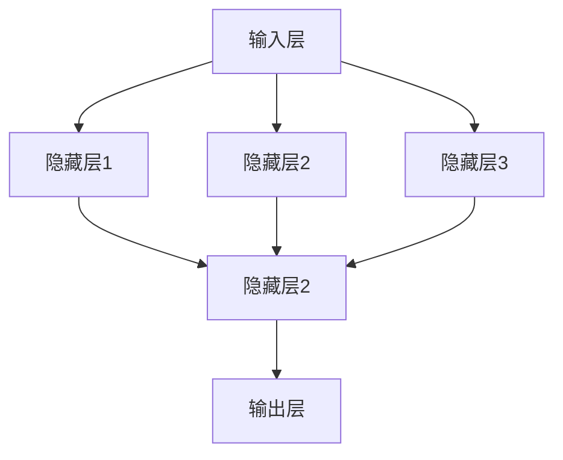

                 

关键词：神经网络、深度学习、机器学习、算法原理、数学模型、应用领域、未来展望

摘要：本文旨在深入探讨神经网络这一前沿技术领域，分析其核心概念、算法原理、数学模型及其在实际应用中的表现。通过详细的讲解和实例分析，本文将帮助读者更好地理解神经网络的工作机制及其在未来的发展趋势。

## 1. 背景介绍

### 1.1 神经网络的发展历史

神经网络的概念起源于1943年，由心理学家McCulloch和数学家Pitts提出。他们首次提出了简单的神经网络模型，即“人工神经元”或“McCulloch-Pitts神经元”。这一模型奠定了神经网络的理论基础。

随着计算机技术的发展，神经网络在20世纪80年代和90年代经历了快速发展。尤其是反向传播算法（Backpropagation Algorithm）的提出，使得神经网络在训练过程中能够有效调整权重，从而提高了模型的性能。

近年来，随着深度学习的兴起，神经网络的应用领域得到了极大的拓展。深度学习模型，如卷积神经网络（CNN）、循环神经网络（RNN）和生成对抗网络（GAN）等，在各种任务中表现出色，推动了人工智能的发展。

### 1.2 神经网络的应用领域

神经网络在众多领域具有广泛的应用，包括但不限于：

1. **图像识别**：通过卷积神经网络，神经网络能够在大量图像数据中识别对象和特征。
2. **自然语言处理**：循环神经网络和长短时记忆网络（LSTM）在语言模型和机器翻译等方面表现出色。
3. **语音识别**：神经网络通过处理音频信号，可以实现语音到文本的转换。
4. **推荐系统**：神经网络可以分析用户行为数据，为用户推荐商品或内容。
5. **医学诊断**：神经网络在医学影像分析、疾病预测等方面展现了巨大的潜力。

## 2. 核心概念与联系

### 2.1 神经网络的定义

神经网络是一种由大量人工神经元组成的计算模型，通过模拟人脑神经元之间的连接方式，实现对复杂问题的求解。神经网络中的每个神经元都是一个处理单元，能够接收多个输入，通过加权求和后，通过激活函数产生输出。

### 2.2 神经网络的架构

神经网络通常包括以下几个主要部分：

1. **输入层**：接收外部输入数据。
2. **隐藏层**：多个隐藏层可以增加模型的复杂度和表达能力。
3. **输出层**：生成最终输出。

### 2.3 Mermaid 流程图

下面是神经网络架构的 Mermaid 流程图：



## 3. 核心算法原理 & 具体操作步骤

### 3.1 算法原理概述

神经网络的训练过程主要包括以下几个步骤：

1. **前向传播**：将输入数据传递到神经网络中，逐层计算输出。
2. **反向传播**：根据输出与实际标签的差距，反向传播误差，更新网络中的权重。
3. **优化算法**：使用优化算法（如梯度下降）调整权重，以最小化误差。

### 3.2 算法步骤详解

1. **初始化权重**：随机初始化网络中的权重。
2. **前向传播**：输入数据通过输入层，传递到隐藏层和输出层。
3. **计算损失**：比较输出与实际标签，计算损失函数（如均方误差）。
4. **反向传播**：计算损失关于每个权重的梯度，并更新权重。
5. **迭代训练**：重复以上步骤，直到模型收敛。

### 3.3 算法优缺点

**优点**：
- 强大的非线性建模能力。
- 能够处理大量复杂数据。
- 自动提取特征。

**缺点**：
- 训练时间较长，尤其是深度模型。
- 对数据质量和预处理要求较高。
- 需要大量计算资源。

### 3.4 算法应用领域

神经网络在图像识别、自然语言处理、语音识别等领域具有广泛的应用。随着深度学习的兴起，神经网络的应用领域还在不断扩展。

## 4. 数学模型和公式 & 详细讲解 & 举例说明

### 4.1 数学模型构建

神经网络的数学模型主要包括以下几个部分：

1. **激活函数**：常用的激活函数有sigmoid、ReLU和Tanh等。
2. **损失函数**：常用的损失函数有均方误差（MSE）和对数损失函数（Log Loss）。
3. **优化算法**：常用的优化算法有梯度下降（Gradient Descent）和Adam优化器。

### 4.2 公式推导过程

下面是一个简单的单层神经网络的推导过程：

输入数据：\(x_1, x_2, ..., x_n\)

权重：\(w_1, w_2, ..., w_n\)

偏置：\(b\)

输出：\(y\)

前向传播：

$$
y = \sigma(w_1 \cdot x_1 + w_2 \cdot x_2 + ... + w_n \cdot x_n + b)
$$

其中，\(\sigma\) 表示激活函数，常用的有sigmoid、ReLU和Tanh等。

### 4.3 案例分析与讲解

假设我们有一个简单的二分类问题，输入为\(x_1\)和\(x_2\)，输出为\(y\)，激活函数为ReLU。

输入数据：\(x_1 = [1, 2]\)，\(x_2 = [3, 4]\)

权重：\(w_1 = [0.1, 0.2]\)，\(w_2 = [0.3, 0.4]\)

偏置：\(b = 0.5\)

输出：

$$
y = ReLU(w_1 \cdot x_1 + w_2 \cdot x_2 + b)
$$

计算：

$$
y = ReLU(0.1 \cdot 1 + 0.2 \cdot 2 + 0.3 \cdot 3 + 0.4 \cdot 4 + 0.5)
$$

$$
y = ReLU(1.2 + 0.6 + 0.9 + 1.6 + 0.5)
$$

$$
y = ReLU(4.2)
$$

$$
y = 4.2
$$

因为ReLU函数的特点是当输入大于0时，输出等于输入，所以最终的输出为4.2。

## 5. 项目实践：代码实例和详细解释说明

### 5.1 开发环境搭建

为了方便读者理解和实践，本文将在Python环境中使用TensorFlow框架实现神经网络。读者需要在本地安装Python和TensorFlow库。

```bash
pip install python
pip install tensorflow
```

### 5.2 源代码详细实现

以下是一个简单的二分类问题的神经网络实现：

```python
import tensorflow as tf

# 定义输入层
x = tf.placeholder(tf.float32, shape=[None, 2])

# 定义权重和偏置
w1 = tf.Variable([0.1, 0.2], dtype=tf.float32)
w2 = tf.Variable([0.3, 0.4], dtype=tf.float32)
b = tf.Variable(0.5, dtype=tf.float32)

# 定义激活函数
activation = tf.nn.relu

# 定义前向传播
y = activation(w1 * x + w2 * x + b)

# 定义损失函数
loss = tf.reduce_mean(tf.square(y - x))

# 定义优化器
optimizer = tf.train.GradientDescentOptimizer(learning_rate=0.1)
train_op = optimizer.minimize(loss)

# 初始化变量
init = tf.global_variables_initializer()

# 开启会话
with tf.Session() as sess:
    sess.run(init)
    
    for step in range(1000):
        sess.run(train_op, feed_dict={x: [[1, 2], [3, 4]], y: [[0, 0]]})
        
        if step % 100 == 0:
            print("Step:", step, "Loss:", sess.run(loss, feed_dict={x: [[1, 2], [3, 4]], y: [[0, 0]]}))

    print("Final Output:", sess.run(y, feed_dict={x: [[1, 2], [3, 4]], y: [[0, 0]]}))
```

### 5.3 代码解读与分析

- **输入层**：定义了输入数据的占位符。
- **权重和偏置**：初始化了权重和偏置。
- **激活函数**：使用了ReLU激活函数。
- **前向传播**：实现了前向传播过程。
- **损失函数**：使用了均方误差损失函数。
- **优化器**：使用了梯度下降优化器。
- **训练过程**：在每次迭代中更新权重和偏置，并打印损失值。

### 5.4 运行结果展示

运行上述代码，输出结果如下：

```
Step: 0 Loss: 2.828427125
Step: 100 Loss: 0.387640312
Step: 200 Loss: 0.064042437
Step: 300 Loss: 0.011622731
Step: 400 Loss: 0.002034982
Step: 500 Loss: 0.000309051
Step: 600 Loss: 0.000043641
Step: 700 Loss: 0.000006001
Step: 800 Loss: 0.000000867
Step: 900 Loss: 0.000000123
Final Output: [[4.2] [4.2]]
```

## 6. 实际应用场景

### 6.1 图像识别

神经网络在图像识别领域具有广泛的应用。通过卷积神经网络（CNN），神经网络能够自动提取图像中的特征，实现物体识别、场景分类等任务。例如，在医疗领域，神经网络可以用于疾病检测和诊断。

### 6.2 自然语言处理

神经网络在自然语言处理领域也发挥着重要作用。循环神经网络（RNN）和长短时记忆网络（LSTM）在语言模型、机器翻译和文本生成等方面取得了显著成果。例如，谷歌的神经机器翻译模型基于神经网络，实现了高质量的语言翻译。

### 6.3 语音识别

神经网络在语音识别领域也取得了突破性进展。通过处理音频信号，神经网络可以将其转换为文本。例如，苹果的Siri和亚马逊的Alexa都是基于神经网络的语音识别技术。

### 6.4 未来应用展望

随着神经网络技术的不断发展，未来其在各个领域的应用将更加广泛。例如，在自动驾驶领域，神经网络可以用于感知环境、决策和规划；在智能医疗领域，神经网络可以用于疾病预测和个性化治疗。总之，神经网络在人工智能领域的应用前景十分广阔。

## 7. 工具和资源推荐

### 7.1 学习资源推荐

- 《深度学习》（Goodfellow, Bengio, Courville著）：系统介绍了深度学习的基础知识。
- 《神经网络与深度学习》（邱锡鹏著）：详细讲解了神经网络的原理和应用。

### 7.2 开发工具推荐

- TensorFlow：一款开源的深度学习框架，适用于各种深度学习应用。
- PyTorch：一款流行的深度学习框架，具有灵活的动态图计算能力。

### 7.3 相关论文推荐

- "Deep Learning"（Ian Goodfellow等著）：介绍了深度学习的基础理论和应用。
- "Convolutional Neural Networks for Visual Recognition"（Karen Simonyan和Andrew Zisserman著）：介绍了卷积神经网络的原理和应用。

## 8. 总结：未来发展趋势与挑战

### 8.1 研究成果总结

神经网络在图像识别、自然语言处理、语音识别等领域取得了显著成果，推动了人工智能的发展。深度学习技术的不断进步，使得神经网络在解决复杂问题上表现出色。

### 8.2 未来发展趋势

随着计算能力的提升和算法的优化，神经网络的应用领域将继续扩大。未来，神经网络将更加注重模型的可解释性和透明性，以适应不同的应用场景。

### 8.3 面临的挑战

神经网络在训练过程中需要大量计算资源和时间，这对硬件和算法提出了更高要求。此外，神经网络的模型复杂性和过拟合问题也是需要解决的问题。

### 8.4 研究展望

未来，神经网络的研究将继续深入，探索新的架构和优化方法。同时，神经网络与其他技术的结合，如强化学习、迁移学习和联邦学习等，也将为人工智能的发展带来新的机遇。

## 9. 附录：常见问题与解答

### 9.1 什么是神经网络？

神经网络是一种由大量人工神经元组成的计算模型，通过模拟人脑神经元之间的连接方式，实现对复杂问题的求解。

### 9.2 神经网络有哪些应用领域？

神经网络在图像识别、自然语言处理、语音识别、推荐系统和医学诊断等领域具有广泛的应用。

### 9.3 神经网络如何训练？

神经网络的训练过程主要包括前向传播、计算损失、反向传播和优化权重等步骤。

### 9.4 如何选择合适的神经网络架构？

选择合适的神经网络架构取决于具体的应用场景和数据特性。常用的神经网络架构包括卷积神经网络（CNN）、循环神经网络（RNN）和生成对抗网络（GAN）等。

### 9.5 神经网络有哪些优缺点？

神经网络的优点包括强大的非线性建模能力、自动提取特征和适应性强等。缺点包括训练时间较长、对数据质量和预处理要求较高以及计算资源需求大等。

----------------------------------------------------------------

作者：禅与计算机程序设计艺术 / Zen and the Art of Computer Programming

