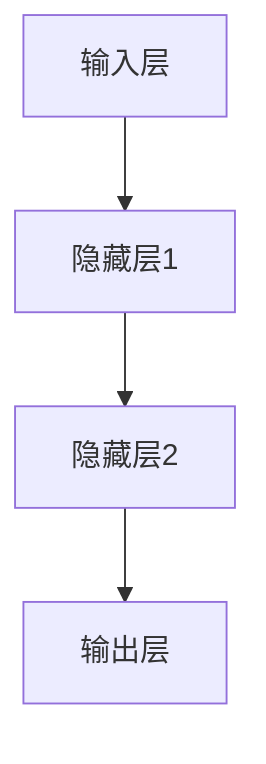
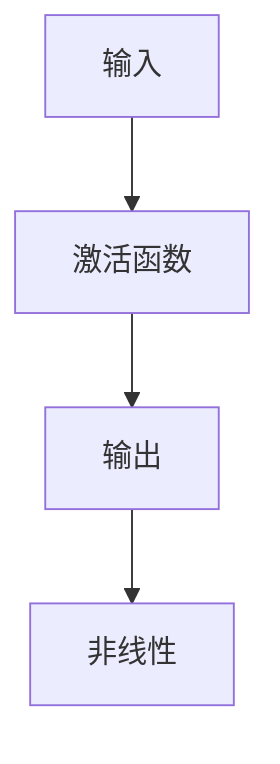

                 

神经网络（Neural Networks）是人工智能领域的一个重要分支，通过模仿人脑神经元的工作原理，实现了对复杂问题的求解。自1986年Hopfield网络提出以来，神经网络理论得到了快速发展，广泛应用于图像识别、自然语言处理、推荐系统等众多领域。本文将深入探讨神经网络的核心概念、算法原理、数学模型及其应用场景，旨在为读者提供一个全面的技术视角。

## 文章关键词

- 神经网络
- 人工智能
- 图像识别
- 自然语言处理
- 推荐系统
- 深度学习

## 文章摘要

本文从神经网络的基本概念出发，介绍了其核心算法原理，包括前向传播和反向传播。随后，通过数学模型和公式的详细讲解，阐述了神经网络在多个领域的应用，如图像识别和自然语言处理。文章最后探讨了神经网络在实际应用中的挑战和未来发展趋势，为读者提供了有价值的参考。

## 1. 背景介绍

### 1.1 神经网络的起源

神经网络的概念最早由心理学家McCulloch和数学家Pitts在1943年提出，称为MCP模型。随后，计算机科学家Rosenblatt在1958年提出了感知机（Perceptron）算法，标志着神经网络理论的发展进入新阶段。20世纪80年代，Hopfield网络和BP网络等算法相继提出，进一步推动了神经网络的研究和应用。

### 1.2 神经网络的发展历程

- **20世纪80年代**：神经网络开始应用于图像识别、语音识别等领域，取得了显著成果。
- **20世纪90年代**：支持向量机（SVM）等传统机器学习方法逐渐成为主流，神经网络研究受到一定程度的冷落。
- **2006年**：Hinton提出了深度学习（Deep Learning）概念，重新点燃了神经网络研究的热潮。
- **2012年**：AlexNet在ImageNet图像识别竞赛中取得突破性成果，深度学习开始广泛应用于各类实际问题。

### 1.3 神经网络的核心意义

神经网络在人工智能领域具有重要的地位，主要体现在以下几个方面：

- **自适应能力**：神经网络能够根据输入数据自动调整内部参数，适应不同的任务需求。
- **并行处理**：神经网络通过并行计算方式，能够高效地处理大量数据。
- **泛化能力**：神经网络通过训练，能够对未知数据进行有效分类和预测。
- **复杂模式识别**：神经网络能够识别传统方法难以处理的复杂模式，如图像、语音、文本等。

## 2. 核心概念与联系

### 2.1 神经元

神经元是神经网络的基本单元，类似于生物神经元。它通过接受外部输入信号，产生内部状态变化，并将信号传递给其他神经元。

### 2.2 神经网络架构

神经网络通常包括输入层、隐藏层和输出层。输入层接收外部输入数据，隐藏层通过非线性变换处理数据，输出层产生最终输出。



### 2.3 非线性激活函数

非线性激活函数是神经网络的核心组成部分，能够使神经网络具有非线性变换能力。常见的激活函数包括Sigmoid、ReLU和Tanh等。



## 3. 核心算法原理 & 具体操作步骤

### 3.1 算法原理概述

神经网络的算法主要包括前向传播和反向传播。前向传播过程中，输入数据经过神经网络传递，最终产生输出。反向传播过程中，通过计算输出误差，反向更新网络参数，以达到优化目标。

### 3.2 算法步骤详解

#### 3.2.1 前向传播

1. 初始化网络参数，包括权重和偏置。
2. 接收输入数据，通过输入层传递到隐藏层。
3. 在每个隐藏层，计算输入和权重之间的线性组合，并应用激活函数。
4. 将输出传递到下一层，直到最终输出层产生输出。

#### 3.2.2 反向传播

1. 计算实际输出和期望输出之间的误差。
2. 通过链式法则计算每个参数的梯度。
3. 根据梯度更新网络参数，使用梯度下降等方法优化目标。

### 3.3 算法优缺点

#### 优点：

- **自适应能力**：能够根据数据自动调整内部参数。
- **泛化能力**：能够对未知数据进行有效分类和预测。
- **并行处理**：能够高效地处理大量数据。

#### 缺点：

- **训练时间较长**：对于大型神经网络，训练时间可能较长。
- **对数据质量要求较高**：数据质量对神经网络性能有较大影响。
- **可解释性较差**：神经网络内部的决策过程难以解释。

### 3.4 算法应用领域

神经网络在多个领域具有广泛应用，如：

- **图像识别**：用于图像分类、目标检测等任务。
- **自然语言处理**：用于文本分类、情感分析、机器翻译等任务。
- **推荐系统**：用于商品推荐、用户行为分析等任务。
- **游戏AI**：用于游戏策略学习、智能决策等任务。

## 4. 数学模型和公式 & 详细讲解 & 举例说明

### 4.1 数学模型构建

神经网络的数学模型主要包括输入层、隐藏层和输出层。每个层由多个神经元组成，神经元之间通过权重和偏置进行连接。

假设神经网络包含一个输入层、一个隐藏层和一个输出层，其中输入层有m个神经元，隐藏层有n个神经元，输出层有k个神经元。

- 输入层：\[ x_1, x_2, ..., x_m \]
- 隐藏层：\[ h_1, h_2, ..., h_n \]
- 输出层：\[ y_1, y_2, ..., y_k \]

神经元的输出可以通过以下公式计算：

\[ o_i = \sigma(\sum_{j=1}^{m} w_{ij}x_j + b_i) \]

其中，\( o_i \)为第i个神经元的输出，\( \sigma \)为激活函数，\( w_{ij} \)为输入层到隐藏层的权重，\( b_i \)为隐藏层的偏置。

### 4.2 公式推导过程

假设神经网络的输出为：

\[ y_i = \sigma(\sum_{j=1}^{n} w_{ij}h_j + b_i) \]

其中，\( y_i \)为输出层第i个神经元的输出，\( h_j \)为隐藏层第j个神经元的输出。

为了推导反向传播公式，我们需要计算输出层的误差：

\[ E = \frac{1}{2}\sum_{i=1}^{k} (y_i - t_i)^2 \]

其中，\( t_i \)为输出层第i个神经元的期望输出。

对输出层的误差求导，得到：

\[ \frac{\partial E}{\partial y_i} = y_i - t_i \]

根据链式法则，可以得到隐藏层的误差：

\[ \frac{\partial E}{\partial h_j} = \sum_{i=1}^{k} \frac{\partial E}{\partial y_i} \frac{\partial y_i}{\partial h_j} \]

其中，\( \frac{\partial y_i}{\partial h_j} \)为输出层第i个神经元对隐藏层第j个神经元的导数。

### 4.3 案例分析与讲解

假设我们有一个简单的神经网络，包含一个输入层、一个隐藏层和一个输出层，用于实现二分类任务。输入层有2个神经元，隐藏层有3个神经元，输出层有1个神经元。

输入层到隐藏层的权重为：

\[ w_{11} = 0.1, w_{12} = 0.2, w_{13} = 0.3 \]
\[ w_{21} = 0.4, w_{22} = 0.5, w_{23} = 0.6 \]

隐藏层到输出层的权重为：

\[ w_{1} = 0.7, w_{2} = 0.8, w_{3} = 0.9 \]

输入数据为：

\[ x_1 = [1, 0] \]
\[ x_2 = [0, 1] \]

期望输出为：

\[ t_1 = 1 \]
\[ t_2 = 0 \]

#### 前向传播

对于第一个输入样本：

1. 隐藏层输出：

\[ h_1 = \sigma(w_{11}x_1 + w_{21}x_2 + b_1) = \sigma(0.1 \times 1 + 0.4 \times 0 + b_1) = \sigma(0.1 + b_1) \]

\[ h_2 = \sigma(w_{12}x_1 + w_{22}x_2 + b_2) = \sigma(0.2 \times 1 + 0.5 \times 0 + b_2) = \sigma(0.2 + b_2) \]

\[ h_3 = \sigma(w_{13}x_1 + w_{23}x_2 + b_3) = \sigma(0.3 \times 1 + 0.6 \times 0 + b_3) = \sigma(0.3 + b_3) \]

2. 输出层输出：

\[ y_1 = \sigma(w_{1}h_1 + w_{2}h_2 + w_{3}h_3 + b_4) = \sigma(0.7 \times \sigma(0.1 + b_1) + 0.8 \times \sigma(0.2 + b_2) + 0.9 \times \sigma(0.3 + b_3) + b_4) \]

#### 反向传播

对于第一个输入样本：

1. 输出层误差：

\[ \delta_1 = y_1 - t_1 = \sigma(0.7 \times \sigma(0.1 + b_1) + 0.8 \times \sigma(0.2 + b_2) + 0.9 \times \sigma(0.3 + b_3) + b_4) - 1 \]

2. 隐藏层误差：

\[ \delta_j = \sum_{i=1}^{k} \delta_i \frac{\partial y_i}{\partial h_j} = \sum_{i=1}^{k} (\delta_i \times \frac{\partial \sigma(h_j + b_j)}{\partial h_j}) \]

3. 更新权重和偏置：

\[ w_{ij} = w_{ij} - \alpha \frac{\partial E}{\partial w_{ij}} \]
\[ b_i = b_i - \alpha \frac{\partial E}{\partial b_i} \]

其中，\( \alpha \)为学习率。

通过以上步骤，我们可以完成神经网络的训练过程。

## 5. 项目实践：代码实例和详细解释说明

### 5.1 开发环境搭建

在开始编写代码之前，我们需要搭建一个合适的开发环境。本文使用Python编程语言，结合TensorFlow库来实现神经网络。

1. 安装Python和TensorFlow：

```bash
pip install python
pip install tensorflow
```

2. 创建一个名为`neural_network`的Python文件，用于编写神经网络代码。

### 5.2 源代码详细实现

```python
import tensorflow as tf
import numpy as np

# 定义神经网络结构
input_size = 2
hidden_size = 3
output_size = 1

# 初始化权重和偏置
weights = {
    'w1': tf.Variable(tf.random.normal([input_size, hidden_size])),
    'w2': tf.Variable(tf.random.normal([hidden_size, output_size]))
}
biases = {
    'b1': tf.Variable(tf.random.normal([hidden_size])),
    'b2': tf.Variable(tf.random.normal([output_size]))
}

# 定义前向传播函数
def forwardprop(x):
    hidden_layer = tf.nn.sigmoid(tf.matmul(x, weights['w1']) + biases['b1'])
    output_layer = tf.nn.sigmoid(tf.matmul(hidden_layer, weights['w2']) + biases['b2'])
    return output_layer

# 定义反向传播函数
def backwardprop(x, y):
    with tf.GradientTape() as tape:
        output = forwardprop(x)
        loss = tf.reduce_mean(tf.square(output - y))
    gradients = tape.gradient(loss, [weights['w1'], weights['w2'], biases['b1'], biases['b2']])
    return gradients

# 定义训练过程
def train(x, y, epochs, learning_rate):
    for epoch in range(epochs):
        with tf.GradientTape() as tape:
            output = forwardprop(x)
            loss = tf.reduce_mean(tf.square(output - y))
        gradients = backwardprop(x, y)
        weights['w1'].assign_sub(learning_rate * gradients[0])
        weights['w2'].assign_sub(learning_rate * gradients[1])
        biases['b1'].assign_sub(learning_rate * gradients[2])
        biases['b2'].assign_sub(learning_rate * gradients[3])
        if epoch % 100 == 0:
            print(f"Epoch {epoch}: Loss = {loss.numpy()}")

# 定义测试过程
def test(x, y):
    output = forwardprop(x)
    error = tf.reduce_mean(tf.square(output - y))
    print(f"Error: {error.numpy()}")

# 加载数据
x_train = np.array([[1, 0], [0, 1]])
y_train = np.array([1, 0])

# 训练神经网络
train(x_train, y_train, epochs=1000, learning_rate=0.1)

# 测试神经网络
test(x_train[0], y_train[0])
test(x_train[1], y_train[1])
```

### 5.3 代码解读与分析

1. **定义神经网络结构**：首先，我们定义了输入层、隐藏层和输出层的神经元数量，并初始化权重和偏置。
2. **定义前向传播函数**：`forwardprop`函数用于计算神经网络的输出。我们使用Sigmoid函数作为激活函数，实现非线性变换。
3. **定义反向传播函数**：`backwardprop`函数用于计算损失函数的梯度，并更新网络参数。
4. **定义训练过程**：`train`函数用于迭代更新网络参数，实现神经网络的训练过程。我们使用梯度下降方法优化损失函数。
5. **定义测试过程**：`test`函数用于计算测试数据的误差，评估神经网络性能。
6. **加载数据**：我们使用简单的二分类数据集进行训练和测试。
7. **训练神经网络**：调用`train`函数进行训练，设置训练迭代次数和学习率。
8. **测试神经网络**：调用`test`函数对训练好的神经网络进行测试，计算测试误差。

通过以上代码，我们可以实现一个简单的神经网络，并进行训练和测试。

## 6. 实际应用场景

神经网络在许多实际应用场景中取得了显著成果，下面列举几个典型的应用领域：

### 6.1 图像识别

神经网络在图像识别领域具有广泛的应用，如人脸识别、物体检测、图像分类等。卷积神经网络（CNN）是图像识别领域的常用模型，通过卷积操作和池化操作，实现对图像的逐层特征提取。

### 6.2 自然语言处理

神经网络在自然语言处理领域也发挥了重要作用，如文本分类、机器翻译、情感分析等。循环神经网络（RNN）和长短期记忆网络（LSTM）是自然语言处理领域的常用模型，通过处理序列数据，实现对语言结构的理解。

### 6.3 推荐系统

神经网络在推荐系统中的应用越来越广泛，如基于内容的推荐、基于协同过滤的推荐等。神经网络可以挖掘用户和商品之间的关联性，实现个性化推荐。

### 6.4 游戏AI

神经网络在游戏AI领域也取得了显著成果，如棋类游戏、策略游戏等。神经网络可以学习游戏策略，实现自主决策和对抗。

## 7. 工具和资源推荐

为了更好地学习和应用神经网络，以下推荐一些相关的工具和资源：

### 7.1 学习资源推荐

- **《深度学习》**：由Ian Goodfellow、Yoshua Bengio和Aaron Courville合著，是深度学习领域的经典教材。
- **《神经网络与深度学习》**：由邱锡鹏等著，系统介绍了神经网络的基本原理和应用。
- **在线课程**：如Coursera、edX、Udacity等平台上的深度学习和神经网络相关课程。

### 7.2 开发工具推荐

- **TensorFlow**：谷歌开发的开源深度学习框架，适用于各种深度学习任务。
- **PyTorch**：基于Python的开源深度学习框架，具有灵活的动态计算图机制。
- **Keras**：基于TensorFlow和PyTorch的简洁高效的深度学习库。

### 7.3 相关论文推荐

- **“A Learning Algorithm for Continually Running Fully Recurrent Neural Networks”**：介绍了Hessian Free优化算法，适用于训练大型神经网络。
- **“Deep Learning”**：Ian Goodfellow等人提出的深度学习理论，对深度学习的发展产生了深远影响。
- **“Rectified Linear Unit Improves Restricted Boltzmann Machine”**：ReLU激活函数对深度网络性能的提升具有重要意义。

## 8. 总结：未来发展趋势与挑战

### 8.1 研究成果总结

自1986年Hopfield网络提出以来，神经网络理论取得了长足的进步。深度学习技术的兴起，使得神经网络在图像识别、自然语言处理等领域取得了突破性成果。此外，神经网络的泛化能力、自适应能力和并行处理能力也得到了显著提升。

### 8.2 未来发展趋势

未来，神经网络将继续在人工智能领域发挥重要作用，以下是一些可能的发展趋势：

- **更大规模的神经网络**：随着计算能力的提升，神经网络将变得更加庞大和复杂，以处理更复杂的任务。
- **迁移学习和增量学习**：通过迁移学习和增量学习，神经网络将能够更好地适应不同领域和任务。
- **强化学习与神经网络的结合**：强化学习与神经网络的结合，将实现更加智能的决策和自主控制。
- **可解释性和安全性**：研究更加可解释的神经网络模型，提高模型的安全性和可靠性。

### 8.3 面临的挑战

尽管神经网络取得了显著成果，但仍面临一些挑战：

- **计算资源**：训练大型神经网络需要大量计算资源，特别是在深度学习领域。
- **数据质量**：神经网络对数据质量要求较高，数据质量对模型性能有较大影响。
- **模型解释性**：神经网络的内部决策过程难以解释，影响其应用和推广。
- **安全性和隐私**：神经网络可能存在安全隐患和隐私泄露问题，需要加强研究和防范。

### 8.4 研究展望

未来，神经网络研究将继续深入，以下是一些建议：

- **理论创新**：探索更加高效的算法和优化方法，提高神经网络性能。
- **跨学科合作**：加强与其他领域的合作，促进神经网络在更多领域的应用。
- **开源和共享**：推动神经网络模型的开源和共享，促进技术的普及和推广。

## 9. 附录：常见问题与解答

### 9.1 什么是神经网络？

神经网络是模仿人脑神经元工作原理的计算模型，通过多层神经网络结构实现复杂问题的求解。

### 9.2 神经网络有哪些类型？

神经网络主要分为前馈神经网络、反馈神经网络、卷积神经网络、循环神经网络等类型。

### 9.3 神经网络如何训练？

神经网络通过前向传播和反向传播过程训练。在前向传播过程中，输入数据经过神经网络传递，产生输出。在反向传播过程中，通过计算输出误差，反向更新网络参数，以达到优化目标。

### 9.4 神经网络在图像识别中的具体应用是什么？

神经网络在图像识别中可以用于目标检测、图像分类、人脸识别等任务，如卷积神经网络（CNN）在ImageNet图像识别竞赛中取得了突破性成果。

### 9.5 神经网络在自然语言处理中的具体应用是什么？

神经网络在自然语言处理中可以用于文本分类、机器翻译、情感分析等任务，如循环神经网络（RNN）和长短期记忆网络（LSTM）在语言模型和机器翻译中发挥了重要作用。

---

作者：禅与计算机程序设计艺术 / Zen and the Art of Computer Programming

