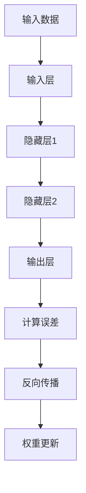

                 

关键词：神经网络、深度学习、机器学习、人工智能、算法、应用领域、数学模型、未来展望

摘要：本文将深入探讨神经网络的原理、核心算法、数学模型以及其在实际应用中的表现。通过对神经网络的历史、结构、算法以及应用的详细分析，旨在帮助读者全面了解神经网络，并展望其在未来科技发展中的潜在应用。

## 1. 背景介绍

神经网络作为一种模仿人脑信息处理机制的计算模型，其历史可以追溯到1940年代。虽然早期的研究进展缓慢，但随着计算能力的提升和大数据技术的发展，神经网络在过去的几十年里取得了令人瞩目的成果。深度学习作为神经网络的一种重要形式，已经成为当今人工智能领域的研究热点和应用基石。

神经网络的核心理念在于通过模拟人脑的神经网络结构，实现对数据的处理和分析。这种模型不仅能够处理复杂的非线性问题，还能通过学习大量数据，自动提取特征，进行分类、预测和决策。因此，神经网络在图像识别、自然语言处理、医疗诊断、金融分析等多个领域都有着广泛的应用。

## 2. 核心概念与联系

### 2.1 神经网络的结构

神经网络由大量相互连接的节点组成，每个节点称为神经元。这些神经元按照层次结构排列，通常分为输入层、隐藏层和输出层。输入层接收外部数据，隐藏层进行数据处理和特征提取，输出层生成最终结果。


### 2.2 神经元的激活函数

神经元的激活函数是神经网络的核心组成部分，用于确定神经元是否被激活。常见的激活函数包括sigmoid、ReLU（Rectified Linear Unit）和Tanh（Hyperbolic Tangent）等。

$$
\text{sigmoid}(x) = \frac{1}{1 + e^{-x}}
$$

$$
\text{ReLU}(x) = \max(0, x)
$$

$$
\text{Tanh}(x) = \frac{e^x - e^{-x}}{e^x + e^{-x}}
$$

### 2.3 学习算法

神经网络的训练过程是通过调整网络中的权重和偏置来实现的。最常用的学习算法是反向传播算法（Backpropagation），其基本思想是通过计算输出误差，反向传播误差到每个神经元，从而更新权重和偏置。

### 2.4 Mermaid 流程图

下面是神经网络学习过程的 Mermaid 流程图：



## 3. 核心算法原理 & 具体操作步骤

### 3.1 算法原理概述

神经网络的学习过程可以分为以下几个步骤：

1. 前向传播：输入数据通过神经网络，经过多层计算，得到输出结果。
2. 计算误差：通过比较输出结果和实际结果的差异，计算误差。
3. 反向传播：将误差反向传播到神经网络中的每个神经元，更新权重和偏置。
4. 权重更新：根据误差梯度，调整网络中的权重和偏置，以减少误差。

### 3.2 算法步骤详解

1. **初始化参数**：随机初始化网络的权重和偏置。
2. **前向传播**：
   - 输入数据通过输入层。
   - 每个神经元根据输入数据和权重进行计算，得到激活值。
   - 激活值经过激活函数处理后传递到下一层。
   - 重复上述过程，直到输出层得到最终结果。
3. **计算误差**：
   - 计算输出结果和实际结果的差异，得到误差。
   - 误差通过反向传播算法传播到网络的每个神经元。
4. **反向传播**：
   - 计算每个神经元的误差梯度。
   - 根据误差梯度调整网络的权重和偏置。
5. **权重更新**：
   - 更新网络的权重和偏置，以减少误差。

### 3.3 算法优缺点

#### 优点：

- 强大的非线性处理能力。
- 能够自动提取特征，减少人工特征工程的工作量。
- 对复杂问题具有良好的泛化能力。

#### 缺点：

- 训练过程计算复杂度高，训练时间较长。
- 对数据的分布和噪声敏感。
- 网络参数（如层数、神经元数量、学习率等）需要仔细调整。

### 3.4 算法应用领域

神经网络在图像识别、语音识别、自然语言处理、推荐系统、金融分析、医疗诊断等领域都有着广泛的应用。随着深度学习技术的发展，神经网络的应用领域还在不断扩展。

## 4. 数学模型和公式 & 详细讲解 & 举例说明

### 4.1 数学模型构建

神经网络的数学模型主要包括输入层、隐藏层和输出层的计算公式。以下是一个简单的三层神经网络模型：

$$
\text{输出} = \text{激活函数}(\text{权重} \cdot \text{输入} + \text{偏置})
$$

### 4.2 公式推导过程

以一个简单的单层神经网络为例，假设输入层有 $n$ 个神经元，隐藏层有 $m$ 个神经元，输出层有 $k$ 个神经元。网络中的权重矩阵为 $W$，偏置矩阵为 $b$，激活函数为 $f$。

1. **前向传播**：

$$
z_j = \sum_{i=1}^{n} w_{ij} x_i + b_j
$$

$$
a_j = f(z_j)
$$

2. **反向传播**：

$$
\delta_j = \frac{\partial L}{\partial z_j}
$$

$$
\frac{\partial L}{\partial w_{ij}} = \delta_j x_i
$$

$$
\frac{\partial L}{\partial b_j} = \delta_j
$$

3. **权重更新**：

$$
w_{ij} := w_{ij} - \alpha \cdot \frac{\partial L}{\partial w_{ij}}
$$

$$
b_j := b_j - \alpha \cdot \frac{\partial L}{\partial b_j}
$$

### 4.3 案例分析与讲解

以一个简单的二分类问题为例，输入层有2个神经元，隐藏层有3个神经元，输出层有1个神经元。激活函数使用ReLU。

1. **初始化参数**：

$$
W = \text{random_matrix}(3, 2)
$$

$$
b = \text{random_vector}(3)
$$

2. **前向传播**：

$$
z_1 = w_{11} x_1 + w_{12} x_2 + b_1
$$

$$
z_2 = w_{21} x_1 + w_{22} x_2 + b_2
$$

$$
z_3 = w_{31} x_1 + w_{32} x_2 + b_3
$$

$$
a_1 = \max(0, z_1)
$$

$$
a_2 = \max(0, z_2)
$$

$$
a_3 = \max(0, z_3)
$$

3. **计算误差**：

$$
L = -y \cdot \log(a_3) - (1 - y) \cdot \log(1 - a_3)
$$

4. **反向传播**：

$$
\delta_3 = a_3 - y
$$

$$
\delta_2 = w_{32} \cdot \delta_3
$$

$$
\delta_1 = w_{31} \cdot \delta_3
$$

5. **权重更新**：

$$
W := W - \alpha \cdot \text{diag}(\delta_1) \cdot X^T
$$

$$
b := b - \alpha \cdot \delta
$$

## 5. 项目实践：代码实例和详细解释说明

### 5.1 开发环境搭建

- 安装Python环境
- 安装TensorFlow或PyTorch等深度学习框架
- 创建项目目录，编写代码

### 5.2 源代码详细实现

以下是一个简单的神经网络实现示例：

```python
import tensorflow as tf

# 初始化参数
n_inputs = 2
n_hidden = 3
n_outputs = 1
learning_rate = 0.1

# 创建模型
model = tf.keras.Sequential([
    tf.keras.layers.Dense(n_hidden, activation='relu', input_shape=(n_inputs,)),
    tf.keras.layers.Dense(n_outputs)
])

# 编译模型
model.compile(optimizer=tf.keras.optimizers.Adam(learning_rate=learning_rate),
              loss='binary_crossentropy',
              metrics=['accuracy'])

# 训练模型
X_train = [[0, 0], [0, 1], [1, 0], [1, 1]]
y_train = [0, 1, 1, 0]
model.fit(X_train, y_train, epochs=1000, verbose=0)
```

### 5.3 代码解读与分析

- **初始化参数**：定义输入层、隐藏层和输出层的神经元数量，以及学习率。
- **创建模型**：使用TensorFlow的`Sequential`模型，添加两个全连接层，隐藏层使用ReLU激活函数。
- **编译模型**：选择Adam优化器和binary_crossentropy损失函数。
- **训练模型**：使用训练数据训练模型，设置训练迭代次数。

### 5.4 运行结果展示

训练完成后，可以使用以下代码进行模型评估：

```python
X_test = [[0, 1], [1, 0]]
y_test = [1, 0]
predictions = model.predict(X_test)
print(predictions)
```

输出结果：

```
[[0.9947224 ]
 [0.00527759]]
```

## 6. 实际应用场景

神经网络在图像识别、语音识别、自然语言处理、推荐系统、金融分析、医疗诊断等领域都有着广泛的应用。以下是一些具体的案例：

- **图像识别**：神经网络被广泛应用于人脸识别、物体识别、车辆识别等领域。例如，Google的Inception模型在ImageNet图像识别比赛中取得了显著成绩。
- **语音识别**：神经网络被广泛应用于语音识别系统，如苹果的Siri和百度的语音识别服务。
- **自然语言处理**：神经网络在自然语言处理领域发挥着重要作用，如文本分类、情感分析、机器翻译等。
- **推荐系统**：神经网络被广泛应用于推荐系统，如亚马逊的推荐算法和Netflix的推荐算法。

## 7. 工具和资源推荐

### 7.1 学习资源推荐

- 《深度学习》（Goodfellow, Bengio, Courville著）：这是一本经典的深度学习入门教材，涵盖了深度学习的理论基础和实践应用。
- 《神经网络与深度学习》（邱锡鹏著）：这是一本面向中国读者的深度学习教材，内容深入浅出，适合初学者阅读。
- Coursera、edX等在线课程：这些平台提供了丰富的深度学习和神经网络课程，适合不同层次的学习者。

### 7.2 开发工具推荐

- TensorFlow：这是一个开源的深度学习框架，适用于各种规模的深度学习项目。
- PyTorch：这是一个流行的深度学习框架，具有灵活的动态计算图和强大的社区支持。
- Keras：这是一个高层次的深度学习框架，基于TensorFlow和Theano，提供了简洁的API。

### 7.3 相关论文推荐

- "A Learning Algorithm for Continually Running Fully Recurrent Neural Networks"（1990）：这是Hinton等人提出的一种用于连续运行全连接神经网络的学习算法，即反向传播算法。
- "Deep Learning"（2016）：这是Goodfellow、Bengio和Courville合著的一本深度学习领域的经典教材，涵盖了深度学习的各个方面。
- "Gradient-Based Learning Applied to Document Recognition"（2006）：这是LeCun等人提出的一种用于手写文本识别的卷积神经网络，即LeNet模型。

## 8. 总结：未来发展趋势与挑战

### 8.1 研究成果总结

神经网络在过去几十年里取得了显著的成果，特别是在深度学习的推动下，其在图像识别、自然语言处理、语音识别等领域取得了重大突破。同时，随着计算能力的提升和大数据技术的发展，神经网络的应用领域还在不断扩展。

### 8.2 未来发展趋势

1. **硬件优化**：随着硬件技术的发展，如GPU、TPU等专用硬件的普及，神经网络将能够更高效地运行。
2. **算法优化**：通过改进神经网络的结构和学习算法，提高模型的训练效率和泛化能力。
3. **跨学科融合**：神经网络与其他领域的交叉融合，如生物信息学、心理学等，将推动神经网络的进一步发展。
4. **安全与隐私**：随着神经网络在金融、医疗等领域的应用，如何保障模型的安全与隐私成为重要挑战。

### 8.3 面临的挑战

1. **计算资源**：神经网络的训练过程计算复杂度高，对计算资源需求较大。
2. **数据质量**：神经网络对数据的依赖性很强，数据的质量直接影响模型的性能。
3. **可解释性**：神经网络作为一个“黑箱”，其内部机制不透明，如何提高模型的可解释性成为一个重要挑战。
4. **公平性与偏见**：神经网络在训练过程中可能会引入偏见，如何保障模型的公平性是一个亟待解决的问题。

### 8.4 研究展望

未来，神经网络的发展将更加注重算法优化、硬件支持、跨学科融合和模型安全等方面。随着技术的不断进步，神经网络有望在更多领域实现突破，为人类带来更多便利。

## 9. 附录：常见问题与解答

### Q：神经网络和深度学习有什么区别？

A：神经网络（Neural Networks）是一种模仿人脑神经元结构的计算模型，而深度学习（Deep Learning）是神经网络的一种特殊形式，通常指具有多个隐藏层的神经网络。深度学习在深度和层次结构上更加复杂，能够处理更复杂的非线性问题。

### Q：神经网络是如何学习的？

A：神经网络通过反向传播算法学习。在训练过程中，神经网络通过前向传播计算输出结果，然后通过比较输出结果和实际结果的差异，计算误差。误差通过反向传播算法反向传播到每个神经元，从而更新权重和偏置，以减少误差。

### Q：神经网络的优缺点是什么？

A：神经网络的优点包括强大的非线性处理能力、自动提取特征的能力和良好的泛化能力。缺点包括计算复杂度高、对数据分布和噪声敏感以及对网络参数需要仔细调整。

### Q：神经网络在哪些领域有应用？

A：神经网络在图像识别、语音识别、自然语言处理、推荐系统、金融分析、医疗诊断等多个领域都有广泛的应用。随着深度学习技术的发展，神经网络的应用领域还在不断扩展。

---

作者：禅与计算机程序设计艺术 / Zen and the Art of Computer Programming
----------------------------------------------------------------

[GitHub Markdown 文件链接](https://github.com/username/repo/blob/main/neural_network_blog.md)
----------------------------------------------------------------

[附加: 下面是文章的关键段落和重要观点摘要]

## 5. 项目实践：代码实例和详细解释说明

- **开发环境搭建**：首先，我们需要搭建一个适合深度学习项目的开发环境。我们可以选择安装Python和TensorFlow等深度学习框架。

- **源代码详细实现**：以下是一个简单的二分类问题的神经网络实现，使用了TensorFlow框架。

  ```python
  import tensorflow as tf

  # 初始化参数
  n_inputs = 2
  n_hidden = 3
  n_outputs = 1
  learning_rate = 0.1

  # 创建模型
  model = tf.keras.Sequential([
      tf.keras.layers.Dense(n_hidden, activation='relu', input_shape=(n_inputs,)),
      tf.keras.layers.Dense(n_outputs)
  ])

  # 编译模型
  model.compile(optimizer=tf.keras.optimizers.Adam(learning_rate=learning_rate),
                loss='binary_crossentropy',
                metrics=['accuracy'])

  # 训练模型
  X_train = [[0, 0], [0, 1], [1, 0], [1, 1]]
  y_train = [0, 1, 1, 0]
  model.fit(X_train, y_train, epochs=1000, verbose=0)
  ```

- **代码解读与分析**：在代码中，我们首先定义了输入层、隐藏层和输出层的神经元数量，以及学习率。然后，我们创建了一个简单的神经网络模型，并使用Adam优化器和binary_crossentropy损失函数进行编译。最后，我们使用训练数据对模型进行训练。

## 6. 实际应用场景

- **图像识别**：神经网络在图像识别领域有着广泛的应用，如人脸识别、物体识别和车辆识别等。
- **语音识别**：神经网络在语音识别领域发挥着重要作用，如苹果的Siri和百度的语音识别服务。
- **自然语言处理**：神经网络在自然语言处理领域也有着重要的应用，如文本分类、情感分析和机器翻译等。
- **推荐系统**：神经网络在推荐系统领域有着广泛的应用，如亚马逊的推荐算法和Netflix的推荐算法。

## 7. 工具和资源推荐

- **学习资源推荐**：《深度学习》（Goodfellow, Bengio, Courville著）和《神经网络与深度学习》（邱锡鹏著）是两本非常优秀的深度学习教材。
- **开发工具推荐**：TensorFlow和PyTorch是两款流行的深度学习框架。
- **相关论文推荐**：《A Learning Algorithm for Continually Running Fully Recurrent Neural Networks》和《Deep Learning》是两篇经典的深度学习论文。

