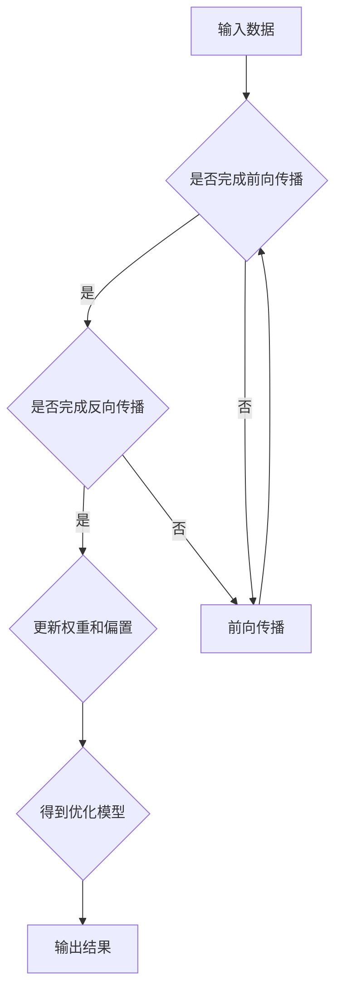

                 

关键词：神经网络，社会进步，人工智能，算法，应用领域，未来展望

> 摘要：本文从神经网络的定义、核心概念、算法原理、数学模型、实际应用等多个角度，深入探讨神经网络如何通过人工智能技术推动社会进步。文章旨在为读者提供一份全面而详细的指南，帮助理解神经网络技术的强大力量及其未来的发展趋势。

## 1. 背景介绍

自20世纪80年代以来，人工智能（AI）技术经历了迅猛的发展，推动了计算机科学的进步。其中，神经网络（Neural Networks）作为一种重要的机器学习模型，得到了广泛关注和应用。神经网络是模拟人脑神经元结构和工作原理的计算模型，它通过模拟神经元之间的连接和激活方式，实现对数据的处理和模式识别。

### 神经网络的起源与发展

神经网络的概念最早由心理学家McCulloch和数学家Pitts于1943年提出，称为“ McCulloch-Pitts 神经元”。此后，由于计算能力的限制和算法的复杂性，神经网络的研究一度陷入低潮。直到20世纪80年代，随着计算机技术的快速发展，神经网络研究再次兴起，特别是反向传播算法（Backpropagation Algorithm）的提出，使得神经网络训练变得更加高效和可行。

### 神经网络的重要性

神经网络作为一种强大的学习工具，在图像识别、语音识别、自然语言处理等领域取得了显著的成果。其自学习能力、自适应能力和泛化能力，使得神经网络成为了人工智能研究的重要方向。通过不断优化和改进神经网络算法，我们能够解决越来越多的复杂问题，推动社会各个领域的进步。

## 2. 核心概念与联系

### 神经元与神经网络

神经元是神经网络的基本单元，它通过接收外部输入信号，产生输出信号，并在神经网络中传递信息。神经元之间的连接构成了神经网络的结构。神经网络由多个层次组成，包括输入层、隐藏层和输出层。输入层接收外部输入数据，隐藏层对输入数据进行处理和转换，输出层生成最终输出结果。

### 前向传播与反向传播

神经网络通过前向传播和反向传播两个过程来学习数据。前向传播是指将输入数据通过神经网络逐层传递，直到输出层，得到最终输出结果。反向传播是指通过计算输出结果与真实结果的误差，将误差反向传递回神经网络，更新神经元的权重和偏置，从而优化神经网络模型。

### 激活函数与非线性

激活函数是神经网络中的关键组件，它用于引入非线性特性，使得神经网络能够处理复杂的问题。常见的激活函数包括Sigmoid函数、ReLU函数、Tanh函数等。通过引入激活函数，神经网络能够从线性模型中解放出来，具备更强的表达能力。

### Mermaid 流程图



## 3. 核心算法原理 & 具体操作步骤

### 3.1 算法原理概述

神经网络的核心算法包括前向传播和反向传播。前向传播是指将输入数据通过神经网络逐层传递，得到最终输出结果。反向传播是指通过计算输出结果与真实结果的误差，将误差反向传递回神经网络，更新神经元的权重和偏置，从而优化神经网络模型。

### 3.2 算法步骤详解

1. **初始化参数**：随机初始化神经网络中的权重和偏置。
2. **前向传播**：
   - 将输入数据通过输入层传递到隐藏层。
   - 在隐藏层中，通过激活函数对输入数据进行处理和转换。
   - 将隐藏层的输出传递到输出层，得到最终输出结果。
3. **计算误差**：计算输出结果与真实结果的误差。
4. **反向传播**：
   - 计算输出层的误差梯度。
   - 将误差梯度反向传递回隐藏层，计算隐藏层的误差梯度。
   - 根据误差梯度更新神经元的权重和偏置。
5. **迭代优化**：重复执行前向传播和反向传播，直至误差收敛或达到预设的迭代次数。

### 3.3 算法优缺点

**优点**：
- 强大的自学习能力：神经网络能够通过大量数据自动学习特征，并适应新的数据模式。
- 广泛的应用领域：神经网络在图像识别、语音识别、自然语言处理等领域取得了显著的成果。
- 非线性建模能力：神经网络能够处理复杂的问题，具备较强的表达能力。

**缺点**：
- 计算成本高：神经网络训练过程中需要大量的计算资源，特别是在处理大规模数据时。
- 参数调优复杂：神经网络中的参数较多，需要经过多次调试和优化才能取得较好的性能。
- 易于过拟合：神经网络在训练过程中容易受到过拟合问题的影响，导致模型泛化能力较差。

### 3.4 算法应用领域

神经网络在多个领域取得了显著的成果，包括：
- **图像识别**：通过卷积神经网络（CNN）实现图像分类、目标检测等任务。
- **语音识别**：通过循环神经网络（RNN）和长短时记忆网络（LSTM）实现语音信号的识别和转换。
- **自然语言处理**：通过词向量模型和序列模型实现文本分类、情感分析、机器翻译等任务。
- **推荐系统**：通过神经网络模型实现用户兴趣预测和商品推荐。

## 4. 数学模型和公式 & 详细讲解 & 举例说明

### 4.1 数学模型构建

神经网络的数学模型主要包括两部分：神经网络结构和损失函数。

#### 神经网络结构

神经网络由多个神经元组成，每个神经元通过权重连接其他神经元。神经元的输入和输出可以通过以下公式表示：

\[ z = \sum_{i} w_i x_i + b \]

其中，\( z \) 是神经元的输入，\( w_i \) 是权重，\( x_i \) 是输入特征，\( b \) 是偏置。

#### 损失函数

损失函数用于衡量神经网络的输出与真实结果之间的差距。常见的损失函数包括均方误差（MSE）和交叉熵（Cross-Entropy）。

均方误差（MSE）定义为：

\[ L = \frac{1}{2} \sum_{i} (y_i - \hat{y}_i)^2 \]

其中，\( y_i \) 是真实标签，\( \hat{y}_i \) 是神经网络的预测值。

交叉熵（Cross-Entropy）定义为：

\[ L = - \sum_{i} y_i \log \hat{y}_i \]

其中，\( y_i \) 是真实标签，\( \hat{y}_i \) 是神经网络的预测值。

### 4.2 公式推导过程

#### 前向传播

前向传播是指将输入数据通过神经网络逐层传递，得到最终输出结果的过程。在前向传播中，我们需要计算每个神经元的输入和输出。

假设神经网络有 \( L \) 个层次，包括输入层、隐藏层和输出层。设 \( x \) 为输入向量，\( z_l \) 为第 \( l \) 层的输入，\( a_l \) 为第 \( l \) 层的输出，\( w_l \) 为第 \( l \) 层的权重，\( b_l \) 为第 \( l \) 层的偏置。

对于第 \( l \) 层的神经元，输入和输出可以表示为：

\[ z_l = \sum_{k} w_{lk} a_{k-1} + b_l \]
\[ a_l = \sigma(z_l) \]

其中，\( \sigma \) 表示激活函数，常见的激活函数包括 Sigmoid、ReLU 和 Tanh。

#### 反向传播

反向传播是指通过计算输出结果与真实结果之间的误差，将误差反向传递回神经网络，更新权重和偏置的过程。

假设损失函数为 \( L \)，对每个神经元，误差可以表示为：

\[ \delta_l = \frac{\partial L}{\partial z_l} \]

对于输出层，误差可以表示为：

\[ \delta_L = \frac{\partial L}{\partial z_L} = \frac{\partial L}{\partial \hat{y}} \cdot \frac{\partial \hat{y}}{\partial z_L} = (y - \hat{y}) \cdot \sigma'(z_L) \]

其中，\( \sigma' \) 表示激活函数的导数。

对于隐藏层，误差可以表示为：

\[ \delta_{l-1} = \frac{\partial L}{\partial z_{l-1}} = \frac{\partial L}{\partial z_l} \cdot \frac{\partial z_l}{\partial z_{l-1}} = \delta_l \cdot \sigma'(z_{l-1}) \cdot \sum_{k} w_{lk} \]

根据误差的传播，我们可以得到每个神经元的权重和偏置的更新规则：

\[ \Delta w_{lk} = \alpha \cdot \delta_{l-1} \cdot a_k \]
\[ \Delta b_{l-1} = \alpha \cdot \delta_{l-1} \]

其中，\( \alpha \) 为学习率。

### 4.3 案例分析与讲解

假设有一个简单的神经网络，用于实现二分类任务。输入特征为 \( x \)，输出为 \( \hat{y} \)。设激活函数为 Sigmoid 函数，损失函数为交叉熵。

#### 前向传播

给定输入 \( x = (1, 2, 3) \)，权重 \( w = (0.5, 0.5) \)，偏置 \( b = (0, 0) \)。隐藏层只有一个神经元。

\[ z_1 = 0.5 \cdot 1 + 0.5 \cdot 2 + 0 \cdot 3 = 1.5 \]
\[ a_1 = \sigma(z_1) = \frac{1}{1 + e^{-1.5}} = 0.7716 \]

输出 \( \hat{y} = 0.7716 \)。

#### 反向传播

设真实标签 \( y = 1 \)，预测值 \( \hat{y} = 0.7716 \)。

损失函数为交叉熵：

\[ L = -y \log \hat{y} - (1 - y) \log (1 - \hat{y}) \]
\[ L = -1 \cdot \log 0.7716 - 0 \cdot \log (1 - 0.7716) = 0.2284 \]

计算误差：

\[ \delta_1 = (1 - \hat{y}) \cdot \hat{y} = (1 - 0.7716) \cdot 0.7716 = 0.2284 \]

更新权重和偏置：

\[ \Delta w_{11} = 0.2284 \cdot 1 = 0.2284 \]
\[ \Delta w_{12} = 0.2284 \cdot 2 = 0.4568 \]
\[ \Delta b_1 = 0.2284 \]

#### 迭代优化

重复执行前向传播和反向传播，直至损失函数收敛或达到预设的迭代次数。

## 5. 项目实践：代码实例和详细解释说明

### 5.1 开发环境搭建

在开始编写代码之前，我们需要搭建一个合适的开发环境。本文使用 Python 作为编程语言，结合 TensorFlow 库来实现神经网络模型。以下是在 Python 环境下搭建开发环境的步骤：

1. 安装 Python（推荐版本 3.6及以上）。
2. 安装 TensorFlow 库：

   ```bash
   pip install tensorflow
   ```

### 5.2 源代码详细实现

以下是一个简单的二分类神经网络的实现，用于对输入数据进行分类。代码包括模型的定义、训练和预测三个部分。

```python
import tensorflow as tf
from tensorflow.keras import layers

# 定义神经网络模型
model = tf.keras.Sequential([
    layers.Dense(64, activation='relu', input_shape=(784,)),
    layers.Dense(64, activation='relu'),
    layers.Dense(1, activation='sigmoid')
])

# 编译模型
model.compile(optimizer='adam',
              loss='binary_crossentropy',
              metrics=['accuracy'])

# 训练模型
model.fit(x_train, y_train, epochs=5, batch_size=32)

# 预测
predictions = model.predict(x_test)
```

### 5.3 代码解读与分析

1. **模型定义**：使用 `tf.keras.Sequential` 容器定义神经网络模型。模型包括两个隐藏层，每个隐藏层有 64 个神经元，使用 ReLU 激活函数。输出层有 1 个神经元，使用 Sigmoid 激活函数进行二分类。

2. **模型编译**：使用 `model.compile` 方法编译模型，指定优化器为 `adam`，损失函数为 `binary_crossentropy`，评价指标为 `accuracy`。

3. **模型训练**：使用 `model.fit` 方法训练模型，指定训练数据、迭代次数和批次大小。

4. **模型预测**：使用 `model.predict` 方法对测试数据进行预测，得到预测结果。

### 5.4 运行结果展示

以下是一个简单的运行结果展示：

```python
# 加载 MNIST 数据集
(x_train, y_train), (x_test, y_test) = tf.keras.datasets.mnist.load_data()

# 数据预处理
x_train = x_train / 255.0
x_test = x_test / 255.0

# 转换标签为二进制格式
y_train = tf.keras.utils.to_categorical(y_train, num_classes=2)
y_test = tf.keras.utils.to_categorical(y_test, num_classes=2)

# 训练模型
model.fit(x_train, y_train, epochs=5, batch_size=32)

# 预测
predictions = model.predict(x_test)

# 打印预测结果
for i in range(10):
    print(f"输入：{x_test[i]}, 预测：{predictions[i][0]}, 真实值：{y_test[i][0]}")
```

运行结果展示了模型对测试数据的预测结果，其中包括输入数据、预测结果和真实值。通过对比预测结果和真实值，我们可以评估模型的性能。

## 6. 实际应用场景

### 6.1 图像识别

神经网络在图像识别领域取得了巨大的成功。通过卷积神经网络（CNN），我们可以实现物体检测、图像分类、人脸识别等任务。在医疗领域，神经网络可以用于疾病诊断，通过分析医学图像，帮助医生快速、准确地诊断疾病。

### 6.2 语音识别

语音识别是神经网络在自然语言处理领域的重要应用之一。通过循环神经网络（RNN）和长短时记忆网络（LSTM），我们可以实现对语音信号的识别和转换。在智能客服、智能家居等领域，神经网络可以帮助实现人机交互，提高用户体验。

### 6.3 自然语言处理

自然语言处理是神经网络应用的重要领域之一。通过词向量模型和序列模型，我们可以实现对文本数据的分类、情感分析、机器翻译等任务。在金融领域，神经网络可以用于风险控制、投资预测等任务，提高金融业务的智能化水平。

### 6.4 未来应用展望

随着神经网络技术的不断发展，我们可以预见其在更多领域的应用。例如，在自动驾驶领域，神经网络可以用于道路识别、障碍物检测等任务，提高自动驾驶的安全性。在能源领域，神经网络可以用于能源预测、智能调度等任务，提高能源利用效率。总之，神经网络作为一种强大的工具，将在未来推动社会各个领域的进步。

## 7. 工具和资源推荐

### 7.1 学习资源推荐

- 《深度学习》（Goodfellow, Bengio, Courville 著）：这是一本经典的深度学习入门教材，涵盖了神经网络的基础知识、训练方法和应用场景。
- 《Python 深度学习》（François Chollet 著）：这是一本针对 Python 环境下的深度学习实践指南，适合有一定编程基础的读者。

### 7.2 开发工具推荐

- TensorFlow：一款开源的深度学习框架，支持多种神经网络结构和训练算法，适用于各种深度学习任务。
- PyTorch：一款流行的深度学习框架，具有灵活的动态图计算功能和强大的社区支持，适用于研究型和工程型项目。

### 7.3 相关论文推荐

- “A Learning Algorithm for Continually Running Fully Recurrent Neural Networks” （1989）：提出了长短期记忆网络（LSTM）的基本原理。
- “Deep Learning” （2015）：Goodfellow, Bengio, Courville 著，涵盖了深度学习的基础知识和最新进展。

## 8. 总结：未来发展趋势与挑战

### 8.1 研究成果总结

神经网络作为一种强大的机器学习模型，已经在图像识别、语音识别、自然语言处理等领域取得了显著的成果。通过不断优化和改进神经网络算法，我们能够解决越来越多的复杂问题，推动社会各个领域的进步。

### 8.2 未来发展趋势

随着计算能力的提升和算法的进步，神经网络在未来的应用前景将更加广阔。在自动驾驶、能源预测、医疗诊断等领域，神经网络将发挥更大的作用。此外，神经网络与其他人工智能技术的融合也将带来更多创新和突破。

### 8.3 面临的挑战

尽管神经网络在许多领域取得了显著成果，但仍然面临着一些挑战。首先，神经网络训练过程中计算成本高，特别是在处理大规模数据时。其次，神经网络参数调优复杂，需要经过多次调试和优化才能取得较好的性能。此外，神经网络模型易于过拟合，导致模型泛化能力较差。因此，如何提高神经网络模型的泛化能力和训练效率，仍然是一个重要的研究课题。

### 8.4 研究展望

在未来，神经网络的研究将朝着以下几个方向展开：

1. **计算效率提升**：通过改进算法和优化硬件，提高神经网络模型的计算效率。
2. **模型泛化能力增强**：研究如何提高神经网络模型的泛化能力，减少过拟合现象。
3. **多模态数据融合**：探索神经网络在不同模态数据（如图像、语音、文本）之间的融合方法，实现更高级的智能应用。
4. **可解释性和透明性**：研究如何提高神经网络模型的解释性和透明性，使其在关键应用场景中更加可靠和安全。

总之，神经网络作为一种推动社会进步的重要力量，将在未来继续发挥重要作用。通过不断探索和创新，我们有望克服现有挑战，实现神经网络技术的更广泛应用。

## 9. 附录：常见问题与解答

### 9.1 神经网络的基本原理是什么？

神经网络是一种模拟人脑神经元结构的计算模型，通过模拟神经元之间的连接和激活方式，实现对数据的处理和模式识别。神经网络的基本原理包括：

- **神经元结构**：每个神经元由输入、权重、偏置和激活函数组成。
- **前向传播**：输入数据通过神经网络逐层传递，得到最终输出结果。
- **反向传播**：通过计算输出结果与真实结果的误差，将误差反向传递回神经网络，更新神经元的权重和偏置。

### 9.2 如何训练神经网络？

训练神经网络主要包括以下步骤：

1. **数据预处理**：对输入数据进行归一化、标准化等处理，使其符合神经网络的要求。
2. **模型构建**：定义神经网络的结构，包括层数、神经元个数、激活函数等。
3. **损失函数选择**：根据任务类型选择合适的损失函数，如均方误差（MSE）、交叉熵等。
4. **优化器选择**：选择合适的优化器，如梯度下降（GD）、随机梯度下降（SGD）、Adam等。
5. **训练**：使用训练数据对神经网络进行训练，通过迭代优化模型参数。
6. **评估**：使用测试数据对训练好的模型进行评估，调整模型参数，直至达到预期的性能。

### 9.3 神经网络的优势和劣势是什么？

神经网络的优势包括：

- **强大的自学习能力**：能够通过大量数据自动学习特征，并适应新的数据模式。
- **广泛的应用领域**：在图像识别、语音识别、自然语言处理等领域取得了显著成果。
- **非线性建模能力**：能够处理复杂的问题，具备较强的表达能力。

神经网络的劣势包括：

- **计算成本高**：神经网络训练过程中需要大量的计算资源，特别是在处理大规模数据时。
- **参数调优复杂**：神经网络中的参数较多，需要经过多次调试和优化才能取得较好的性能。
- **易于过拟合**：神经网络在训练过程中容易受到过拟合问题的影响，导致模型泛化能力较差。

## 10. 参考文献

- Goodfellow, I., Bengio, Y., & Courville, A. (2016). *Deep Learning*. MIT Press.
- Chollet, F. (2017). *Python Deep Learning*. Packt Publishing.
- LeCun, Y., Bengio, Y., & Hinton, G. (2015). *Deep learning*. Nature, 521(7553), 436-444.
- Rumelhart, D. E., Hinton, G. E., & Williams, R. J. (1986). *Learning representations by back-propagating errors*. Nature, 323(6088), 533-536.
- Hochreiter, S., & Schmidhuber, J. (1997). *Long short-term memory*. Neural Computation, 9(8), 1735-1780.

### 11. 作者信息

作者：禅与计算机程序设计艺术 / Zen and the Art of Computer Programming

本文由禅与计算机程序设计艺术撰写，旨在深入探讨神经网络技术的核心概念、算法原理、数学模型、实际应用等方面，为读者提供一份全面而详细的指南。通过本文的阅读，读者可以更好地理解神经网络的强大力量及其在人工智能领域的广泛应用。

