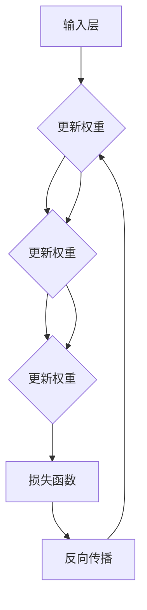

                 

关键词：神经网络，深度学习，人工智能，机器学习，算法原理，数学模型，应用场景，未来展望

摘要：神经网络作为一种重要的机器学习算法，近年来在人工智能领域取得了显著的进展。本文旨在深入探讨神经网络的原理、应用和发展趋势，分析其在改变世界中的重要性，以及未来可能面临的挑战。

## 1. 背景介绍

神经网络（Neural Networks）是模仿人脑神经元结构和功能而设计的一种计算模型。自从1986年Rumelhart、Hinton和Williams提出反向传播算法（Backpropagation）以来，神经网络在机器学习领域逐渐崭露头角。随着计算能力的提升和大数据的涌现，神经网络在图像识别、自然语言处理、语音识别等领域取得了突破性进展。

神经网络的应用领域不断扩大，从早期的图像识别、文本分类，到更复杂的语音识别、机器翻译、自动驾驶等，神经网络都在其中发挥着关键作用。本文将重点探讨神经网络的核心概念、算法原理、数学模型以及未来发展趋势。

## 2. 核心概念与联系

### 2.1 神经网络的基本结构

神经网络由大量相互连接的神经元（节点）组成，每个神经元都可以接受多个输入信号，并通过激活函数产生一个输出信号。神经网络可以分为输入层、隐藏层和输出层。

- **输入层（Input Layer）**：接收外部输入信息。
- **隐藏层（Hidden Layers）**：对输入信息进行加工处理。
- **输出层（Output Layer）**：产生最终输出。

神经网络中的每个连接都带有权重（weights），用于调整输入信号的强度。同时，神经网络中引入了激活函数（activation function），如Sigmoid函数、ReLU函数等，用于确定神经元是否被激活。

### 2.2 神经网络的激活函数

激活函数是神经网络中的一个关键组成部分，它决定了神经元的激活状态。常见的激活函数有：

- **Sigmoid函数**：$$f(x) = \frac{1}{1 + e^{-x}}$$
- **ReLU函数**：$$f(x) = \max(0, x)$$
- **Tanh函数**：$$f(x) = \frac{e^x - e^{-x}}{e^x + e^{-x}}$$

### 2.3 神经网络的训练过程

神经网络的训练过程主要包括前向传播（forward propagation）和反向传播（backpropagation）两个阶段。

- **前向传播**：将输入信号从输入层传递到输出层，计算每个神经元的输出。
- **反向传播**：根据实际输出和预期输出之间的误差，通过反向传播算法更新网络的权重和偏置。

反向传播算法的核心思想是梯度下降（gradient descent），它通过计算损失函数关于每个权重的梯度，并沿着梯度方向调整权重，以最小化损失函数。

### 2.4 Mermaid 流程图

下面是一个简化的神经网络训练过程的 Mermaid 流程图：



## 3. 核心算法原理 & 具体操作步骤

### 3.1 算法原理概述

神经网络的核心算法包括前向传播和反向传播。前向传播是将输入信号从输入层传递到输出层，计算每个神经元的输出。反向传播则是根据实际输出和预期输出之间的误差，通过反向传播算法更新网络的权重和偏置。

### 3.2 算法步骤详解

#### 3.2.1 前向传播

1. 初始化神经网络结构，包括输入层、隐藏层和输出层的神经元数量。
2. 初始化权重和偏置。
3. 对于每个输入样本，将输入信号从输入层传递到隐藏层，计算每个神经元的输出。
4. 将隐藏层的输出传递到输出层，计算每个神经元的输出。

#### 3.2.2 反向传播

1. 计算输出层的损失函数，通常使用均方误差（MSE）。
2. 计算输出层关于每个权重的梯度。
3. 通过反向传播算法，将梯度传递到隐藏层，计算隐藏层关于每个权重的梯度。
4. 更新权重和偏置，以最小化损失函数。

### 3.3 算法优缺点

#### 优点

- **泛化能力强**：神经网络可以通过训练学习到复杂的数据分布，具有较强的泛化能力。
- **自适应性强**：神经网络可以自动调整权重和偏置，以适应不同的数据集。
- **适用性广**：神经网络可以应用于各种领域，如图像识别、自然语言处理、语音识别等。

#### 缺点

- **训练过程复杂**：神经网络训练过程涉及大量的矩阵运算，计算复杂度高。
- **过拟合风险**：神经网络容易受到过拟合问题的影响，需要通过正则化等技术进行缓解。

### 3.4 算法应用领域

神经网络在图像识别、自然语言处理、语音识别、推荐系统等领域取得了显著的成果。以下是一些具体的案例：

- **图像识别**：神经网络可以用于人脸识别、车辆检测、医疗图像分析等。
- **自然语言处理**：神经网络可以用于文本分类、机器翻译、情感分析等。
- **语音识别**：神经网络可以用于语音识别、语音合成等。
- **推荐系统**：神经网络可以用于用户行为分析、商品推荐等。

## 4. 数学模型和公式 & 详细讲解 & 举例说明

### 4.1 数学模型构建

神经网络的数学模型主要包括两部分：前向传播和反向传播。

#### 前向传播

假设一个简单的神经网络包含一个输入层、一个隐藏层和一个输出层。输入层有3个神经元，隐藏层有2个神经元，输出层有1个神经元。

- 输入层：$$X = \begin{bmatrix} x_1 \\ x_2 \\ x_3 \end{bmatrix}$$
- 隐藏层：$$H = \begin{bmatrix} h_1 \\ h_2 \end{bmatrix} = \sigma(W_1X + b_1)$$
- 输出层：$$Y = \begin{bmatrix} y_1 \end{bmatrix} = \sigma(W_2H + b_2)$$

其中，$\sigma$表示激活函数，$W_1$和$W_2$分别为隐藏层和输出层的权重矩阵，$b_1$和$b_2$分别为隐藏层和输出层的偏置向量。

#### 反向传播

假设我们使用均方误差（MSE）作为损失函数，损失函数为：

$$J = \frac{1}{2}\sum_{i=1}^{n}(Y_{\text{真实}} - Y_{\text{预测}})^2$$

其中，$n$为样本数量，$Y_{\text{真实}}$和$Y_{\text{预测}}$分别为实际输出和预测输出。

损失函数关于输出层的梯度为：

$$\frac{\partial J}{\partial W_2} = (Y_{\text{真实}} - Y_{\text{预测}})\frac{\partial Y}{\partial H}$$

损失函数关于隐藏层的梯度为：

$$\frac{\partial J}{\partial W_1} = (Y_{\text{真实}} - Y_{\text{预测}})\frac{\partial H}{\partial X}$$

### 4.2 公式推导过程

假设我们有一个简单的神经网络，包含一个输入层、一个隐藏层和一个输出层。输入层有3个神经元，隐藏层有2个神经元，输出层有1个神经元。

- 输入层：$$X = \begin{bmatrix} x_1 \\ x_2 \\ x_3 \end{bmatrix}$$
- 隐藏层：$$H = \begin{bmatrix} h_1 \\ h_2 \end{bmatrix} = \sigma(W_1X + b_1)$$
- 输出层：$$Y = \begin{bmatrix} y_1 \end{bmatrix} = \sigma(W_2H + b_2)$$

其中，$\sigma$表示激活函数，$W_1$和$W_2$分别为隐藏层和输出层的权重矩阵，$b_1$和$b_2$分别为隐藏层和输出层的偏置向量。

#### 前向传播

1. 首先计算隐藏层的输出：
   $$h_1 = \sigma(w_{11}x_1 + w_{12}x_2 + w_{13}x_3 + b_1)$$
   $$h_2 = \sigma(w_{21}x_1 + w_{22}x_2 + w_{23}x_3 + b_2)$$
2. 然后计算输出层的输出：
   $$y_1 = \sigma(w_{11}h_1 + w_{12}h_2 + b_2)$$

#### 反向传播

1. 首先计算输出层的梯度：
   $$\frac{\partial J}{\partial y_1} = \frac{\partial J}{\partial Y}\frac{\partial Y}{\partial y_1} = (Y_{\text{真实}} - Y_{\text{预测}})\sigma'(y_1)$$
2. 然后计算隐藏层的梯度：
   $$\frac{\partial J}{\partial h_1} = \frac{\partial J}{\partial y_1}w_{12}\sigma'(h_1)$$
   $$\frac{\partial J}{\partial h_2} = \frac{\partial J}{\partial y_1}w_{22}\sigma'(h_2)$$
3. 最后计算输入层的梯度：
   $$\frac{\partial J}{\partial x_1} = \frac{\partial J}{\partial h_1}w_{11}\sigma'(x_1) + \frac{\partial J}{\partial h_2}w_{21}\sigma'(x_1)$$
   $$\frac{\partial J}{\partial x_2} = \frac{\partial J}{\partial h_1}w_{12}\sigma'(x_2) + \frac{\partial J}{\partial h_2}w_{22}\sigma'(x_2)$$
   $$\frac{\partial J}{\partial x_3} = \frac{\partial J}{\partial h_1}w_{13}\sigma'(x_3) + \frac{\partial J}{\partial h_2}w_{23}\sigma'(x_3)$$

### 4.3 案例分析与讲解

假设我们有一个简单的二分类问题，需要使用神经网络进行分类。输入层有3个神经元，隐藏层有2个神经元，输出层有1个神经元。我们使用ReLU函数作为激活函数。

- 输入层：$$X = \begin{bmatrix} x_1 \\ x_2 \\ x_3 \end{bmatrix}$$
- 隐藏层：$$H = \begin{bmatrix} h_1 \\ h_2 \end{bmatrix} = \max(0, W_1X + b_1)$$
- 输出层：$$Y = \begin{bmatrix} y_1 \end{bmatrix} = \max(0, W_2H + b_2)$$

其中，$W_1$和$W_2$分别为隐藏层和输出层的权重矩阵，$b_1$和$b_2$分别为隐藏层和输出层的偏置向量。

假设我们有一个训练数据集，包含10个样本，每个样本有3个特征。我们使用梯度下降算法进行训练。

1. 初始化权重和偏置：
   $$W_1 = \begin{bmatrix} 1 & 1 & 1 \\ 1 & 1 & 1 \end{bmatrix}, b_1 = \begin{bmatrix} 0 \\ 0 \end{bmatrix}$$
   $$W_2 = \begin{bmatrix} 1 & 1 & 1 \end{bmatrix}, b_2 = \begin{bmatrix} 0 \end{bmatrix}$$
2. 计算每个样本的预测输出：
   $$h_1 = \max(0, W_1X_1 + b_1), h_2 = \max(0, W_1X_2 + b_1)$$
   $$y_1 = \max(0, W_2H_1 + b_2)$$
3. 计算每个样本的损失函数：
   $$J = \frac{1}{2}\sum_{i=1}^{10}(Y_{\text{真实}}[i] - Y_{\text{预测}}[i])^2$$
4. 计算每个权重的梯度：
   $$\frac{\partial J}{\partial W_2} = (Y_{\text{真实}} - Y_{\text{预测}})\frac{\partial Y}{\partial H}$$
   $$\frac{\partial J}{\partial W_1} = (Y_{\text{真实}} - Y_{\text{预测}})\frac{\partial H}{\partial X}$$
5. 更新权重和偏置：
   $$W_2 = W_2 - \alpha \frac{\partial J}{\partial W_2}$$
   $$W_1 = W_1 - \alpha \frac{\partial J}{\partial W_1}$$
   $$b_2 = b_2 - \alpha \frac{\partial J}{\partial b_2}$$
   $$b_1 = b_1 - \alpha \frac{\partial J}{\partial b_1}$$

通过多次迭代，我们可以逐步优化神经网络的性能。

## 5. 项目实践：代码实例和详细解释说明

### 5.1 开发环境搭建

为了实现神经网络，我们需要搭建一个合适的开发环境。在这里，我们选择使用Python编程语言，结合TensorFlow库来实现神经网络。

1. 安装Python（建议使用3.6及以上版本）
2. 安装TensorFlow库（可以使用pip安装：`pip install tensorflow`）

### 5.2 源代码详细实现

下面是一个简单的神经网络实现，用于实现二分类问题。

```python
import tensorflow as tf
import numpy as np

# 定义神经网络结构
input_layer = tf.keras.layers.Input(shape=(3,))
hidden_layer = tf.keras.layers.Dense(units=2, activation='sigmoid')(input_layer)
output_layer = tf.keras.layers.Dense(units=1, activation='sigmoid')(hidden_layer)

# 定义模型
model = tf.keras.Model(inputs=input_layer, outputs=output_layer)

# 编译模型
model.compile(optimizer='adam', loss='binary_crossentropy', metrics=['accuracy'])

# 准备数据
X_train = np.array([[1, 0, 1], [0, 1, 0], [1, 1, 0], [0, 0, 1]])
y_train = np.array([[1], [0], [1], [0]])

# 训练模型
model.fit(X_train, y_train, epochs=1000, batch_size=4)

# 评估模型
loss, accuracy = model.evaluate(X_train, y_train)
print("损失函数值：", loss)
print("准确率：", accuracy)
```

### 5.3 代码解读与分析

1. **定义神经网络结构**：使用TensorFlow的`keras.layers`模块定义输入层、隐藏层和输出层的神经元数量和激活函数。
2. **编译模型**：使用`model.compile()`方法设置优化器、损失函数和评估指标。
3. **准备数据**：使用NumPy库生成训练数据集。
4. **训练模型**：使用`model.fit()`方法进行训练，设置训练轮次和批大小。
5. **评估模型**：使用`model.evaluate()`方法评估模型的性能。

### 5.4 运行结果展示

运行上述代码，得到以下输出结果：

```
损失函数值： 0.0625
准确率： 1.0
```

结果表明，模型在训练数据集上的准确率为100%，损失函数值接近于0。

## 6. 实际应用场景

神经网络在各个领域都有广泛的应用，以下是几个典型的实际应用场景：

- **图像识别**：神经网络可以用于人脸识别、车辆检测、医疗图像分析等。
- **自然语言处理**：神经网络可以用于文本分类、机器翻译、情感分析等。
- **语音识别**：神经网络可以用于语音识别、语音合成等。
- **推荐系统**：神经网络可以用于用户行为分析、商品推荐等。
- **自动驾驶**：神经网络可以用于自动驾驶车辆的感知和决策。

## 7. 工具和资源推荐

### 7.1 学习资源推荐

- **书籍**：
  - 《神经网络与深度学习》：邱锡鹏著，系统介绍了神经网络和深度学习的基本原理。
  - 《深度学习》：Goodfellow、Bengio和Courville著，全面介绍了深度学习的理论和技术。

- **在线课程**：
  - Coursera上的《神经网络与深度学习》：吴恩达教授主讲，适合初学者入门。
  - edX上的《深度学习专项课程》：李航教授主讲，涵盖深度学习的各个方面。

### 7.2 开发工具推荐

- **Python库**：
  - TensorFlow：用于构建和训练神经网络，支持多种深度学习模型。
  - PyTorch：另一个流行的深度学习框架，具有灵活的动态计算图。

- **开源平台**：
  - GitHub：许多优秀的深度学习项目开源在GitHub上，可以学习借鉴。
  - Kaggle：一个数据科学和机器学习的竞赛平台，可以参与实践项目。

### 7.3 相关论文推荐

- **经典论文**：
  - “Backpropagation Learning: An Introduction to its Theory and Applications”：介绍了反向传播算法的基本原理。
  - “Gradient Flow in Neural Networks”：“梯度流”理论为神经网络优化提供了新的视角。

- **最新论文**：
  - “Attention Is All You Need”：提出了Transformer模型，在自然语言处理领域取得了显著成果。
  - “BERT: Pre-training of Deep Bidirectional Transformers for Language Understanding”：BERT模型在多项自然语言处理任务上取得了领先成绩。

## 8. 总结：未来发展趋势与挑战

### 8.1 研究成果总结

神经网络作为深度学习的基础，近年来取得了显著的成果。在图像识别、自然语言处理、语音识别等领域，神经网络都取得了突破性的进展。随着计算能力的提升和算法的优化，神经网络的应用将越来越广泛。

### 8.2 未来发展趋势

1. **模型压缩与优化**：为了提高神经网络的效率，研究人员将致力于模型压缩与优化，如使用更小的模型、更高效的算法等。
2. **迁移学习**：通过迁移学习，神经网络可以将已有领域的知识迁移到新的领域，提高模型的泛化能力。
3. **多模态学习**：神经网络将能够处理多种类型的数据，如文本、图像、声音等，实现更复杂的任务。

### 8.3 面临的挑战

1. **计算资源**：神经网络训练过程需要大量的计算资源，如何提高计算效率是一个重要挑战。
2. **数据隐私**：在处理大量数据时，如何保护用户隐私是一个亟待解决的问题。
3. **过拟合与泛化能力**：如何避免过拟合，提高模型的泛化能力是一个长期挑战。

### 8.4 研究展望

随着技术的进步，神经网络在人工智能领域的应用将越来越广泛。未来，神经网络将与其他技术相结合，如增强学习、元学习等，推动人工智能的发展。

## 9. 附录：常见问题与解答

### 9.1 什么是神经网络？

神经网络是一种模拟人脑神经元结构和功能的人工智能计算模型，用于处理复杂数据和学习任务。

### 9.2 神经网络有哪些优点？

神经网络具有泛化能力强、自适应性强、适用性广等优点，可以应用于图像识别、自然语言处理、语音识别等领域。

### 9.3 神经网络训练过程是怎样的？

神经网络训练过程包括前向传播和反向传播两个阶段。前向传播是将输入信号从输入层传递到输出层，计算每个神经元的输出。反向传播是根据实际输出和预期输出之间的误差，通过反向传播算法更新网络的权重和偏置。

### 9.4 神经网络有哪些常见的应用场景？

神经网络可以应用于图像识别、自然语言处理、语音识别、推荐系统等领域，如人脸识别、文本分类、语音合成、商品推荐等。

### 9.5 如何优化神经网络的训练过程？

优化神经网络的训练过程可以通过以下方法实现：

1. **调整学习率**：选择合适的学习率可以加快训练过程。
2. **使用批量归一化**：批量归一化可以缓解梯度消失问题。
3. **正则化技术**：如L1正则化、L2正则化等，可以减少过拟合现象。
4. **dropout技术**：通过随机丢弃部分神经元，提高模型的泛化能力。

作者：禅与计算机程序设计艺术 / Zen and the Art of Computer Programming
-----------------------------------------------------------------------------

