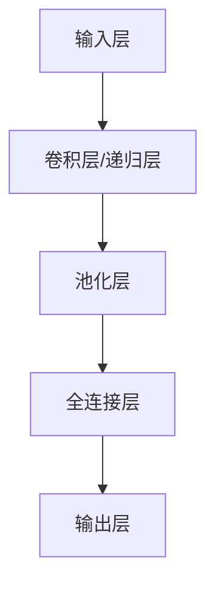

                 

关键词：神经网络，自然语言处理，深度学习，人工智能，机器学习，文本分析

> 摘要：本文深入探讨了神经网络在自然语言处理（NLP）领域的应用及其带来的新突破。通过对核心概念、算法原理、数学模型、项目实践和实际应用场景的详细分析，展示了神经网络在文本分析、机器翻译、情感分析等任务中的强大能力。文章还展望了神经网络在未来NLP领域的应用前景和面临的挑战。

## 1. 背景介绍

自然语言处理（NLP）是人工智能（AI）的一个重要分支，旨在使计算机能够理解、生成和处理人类自然语言。传统的NLP方法主要依赖于规则和统计方法，如词典、语法规则和隐马尔可夫模型（HMM）。然而，这些方法在处理复杂语言任务时存在诸多局限性。

随着深度学习技术的发展，神经网络在图像识别、语音识别等领域取得了显著成果。受此启发，研究人员开始探索神经网络在NLP领域的应用。其中，卷积神经网络（CNN）和递归神经网络（RNN）成为了NLP领域的两大主流模型。

神经网络通过模拟人脑神经元之间的连接和工作方式，能够自动提取文本中的特征，并逐步学习复杂的语义信息。这使得神经网络在处理自然语言任务时具有更高的灵活性和准确性。

## 2. 核心概念与联系

### 2.1 神经网络的基本原理

神经网络由大量简单且高度互联的神经元组成，每个神经元都可以接收多个输入信号，并通过激活函数产生一个输出。神经网络通过层层叠加的方式，将输入信号从底层传递到顶层，从而提取出更高层次的特征。

神经网络的训练过程包括两个主要阶段：前向传播和反向传播。前向传播是从输入层开始，将信号逐层传递到输出层，并计算损失函数。反向传播则通过梯度下降算法，根据损失函数的梯度调整网络中的权重和偏置，以最小化损失函数。

### 2.2 卷积神经网络（CNN）

卷积神经网络是神经网络的一种特殊形式，通过卷积操作自动提取图像中的特征。CNN主要由卷积层、池化层和全连接层组成。

- **卷积层**：通过卷积操作提取图像中的局部特征。
- **池化层**：对卷积层的特征进行下采样，减少参数数量，提高模型泛化能力。
- **全连接层**：将池化层输出的特征映射到分类结果。

### 2.3 递归神经网络（RNN）

递归神经网络是一种能够处理序列数据的神经网络。RNN通过在时间步上递归地更新隐藏状态，从而捕捉序列中的时间依赖关系。

- **隐藏状态**：RNN在当前时间步的隐藏状态由前一个时间步的隐藏状态和当前输入通过激活函数计算得到。
- **门控机制**：门控RNN（如LSTM和GRU）通过引入门控机制，能够更好地处理长时间依赖关系。

### 2.4 Mermaid 流程图

下面是一个简单的Mermaid流程图，展示了神经网络、CNN和RNN的基本结构：



## 3. 核心算法原理 & 具体操作步骤

### 3.1 算法原理概述

神经网络在NLP中的应用主要分为以下两个方向：

1. **基于CNN的文本分析**：通过卷积操作提取文本中的局部特征，然后通过全连接层进行分类或回归。
2. **基于RNN的序列建模**：通过递归操作捕捉序列中的时间依赖关系，适用于文本分类、序列标注、机器翻译等任务。

### 3.2 算法步骤详解

1. **文本预处理**：包括分词、词向量化、去除停用词等操作，将文本转换为适合输入神经网络的特征向量。
2. **构建神经网络模型**：根据任务需求选择合适的神经网络结构，如CNN或RNN。
3. **训练模型**：使用标注数据对模型进行训练，通过反向传播算法不断调整模型参数，以最小化损失函数。
4. **评估模型**：使用测试数据评估模型性能，调整模型参数，以达到最佳效果。
5. **应用模型**：将训练好的模型应用于实际问题，如文本分类、序列标注、机器翻译等。

### 3.3 算法优缺点

**优点**：

1. **自适应特征提取**：神经网络能够自动提取文本中的特征，避免了手工设计特征带来的繁琐和局限性。
2. **强大表达能力**：神经网络能够通过多层叠加，捕捉文本中的复杂语义信息。

**缺点**：

1. **计算复杂度较高**：神经网络模型通常需要大量计算资源，训练时间较长。
2. **数据依赖性强**：神经网络模型对数据质量要求较高，数据不足或数据质量问题可能导致模型性能下降。

### 3.4 算法应用领域

神经网络在NLP领域具有广泛的应用，包括但不限于：

1. **文本分类**：对文本进行分类，如情感分析、主题分类等。
2. **序列标注**：对文本中的词语进行序列标注，如命名实体识别、词性标注等。
3. **机器翻译**：将一种语言的文本翻译成另一种语言。
4. **问答系统**：基于文本理解能力，为用户提供问答服务。

## 4. 数学模型和公式 & 详细讲解 & 举例说明

### 4.1 数学模型构建

神经网络的核心是前向传播和反向传播算法。以下是神经网络的数学模型：

$$
Z = \sigma(W \cdot X + b)
$$

$$
\delta = \frac{\partial J}{\partial Z}
$$

$$
W_{new} = W - \alpha \cdot \frac{\partial J}{\partial W}
$$

$$
b_{new} = b - \alpha \cdot \frac{\partial J}{\partial b}
$$

其中：

- \( Z \) 是当前神经元的输出。
- \( \sigma \) 是激活函数，如Sigmoid、ReLU等。
- \( W \) 是权重矩阵。
- \( X \) 是输入特征。
- \( b \) 是偏置向量。
- \( J \) 是损失函数，如交叉熵损失函数。
- \( \delta \) 是梯度。
- \( \alpha \) 是学习率。

### 4.2 公式推导过程

以交叉熵损失函数为例，推导神经网络的反向传播算法。

$$
J = -\sum_{i=1}^{n} y_i \log (a_i)
$$

其中：

- \( y_i \) 是第 \( i \) 个样本的标签。
- \( a_i \) 是第 \( i \) 个神经元的输出。

对 \( J \) 分别对 \( Z \) 和 \( W \) 求偏导数，得到：

$$
\frac{\partial J}{\partial Z} = \frac{\partial J}{\partial a} \cdot \frac{\partial a}{\partial Z} = \frac{y - a}{Z(1 - Z)}
$$

$$
\frac{\partial J}{\partial W} = \frac{\partial J}{\partial Z} \cdot X^T
$$

根据梯度下降算法，更新权重和偏置：

$$
W_{new} = W - \alpha \cdot \frac{\partial J}{\partial W}
$$

$$
b_{new} = b - \alpha \cdot \frac{\partial J}{\partial b}
$$

### 4.3 案例分析与讲解

以文本分类任务为例，说明神经网络的构建和训练过程。

1. **数据预处理**：将文本转换为词向量表示，并添加一层嵌入层。
2. **构建模型**：使用CNN模型，包括嵌入层、卷积层、池化层和全连接层。
3. **训练模型**：使用标注数据训练模型，通过反向传播算法不断调整模型参数。
4. **评估模型**：使用测试数据评估模型性能，调整模型参数以达到最佳效果。
5. **应用模型**：将训练好的模型应用于新文本分类任务。

## 5. 项目实践：代码实例和详细解释说明

### 5.1 开发环境搭建

在本节中，我们将使用Python语言和TensorFlow框架实现一个简单的文本分类项目。首先，确保安装了Python（版本3.6及以上）和TensorFlow。

### 5.2 源代码详细实现

以下是一个简单的文本分类项目的代码实现：

```python
import tensorflow as tf
from tensorflow.keras.preprocessing.text import Tokenizer
from tensorflow.keras.preprocessing.sequence import pad_sequences
from tensorflow.keras.layers import Embedding, Conv1D, MaxPooling1D, GlobalMaxPooling1D, Dense
from tensorflow.keras.models import Sequential

# 数据预处理
tokenizer = Tokenizer(num_words=10000)
tokenizer.fit_on_texts(train_data)
sequences = tokenizer.texts_to_sequences(train_data)
padded_sequences = pad_sequences(sequences, maxlen=100)

# 构建模型
model = Sequential()
model.add(Embedding(10000, 16, input_length=100))
model.add(Conv1D(64, 5, activation='relu'))
model.add(MaxPooling1D(5))
model.add(Conv1D(64, 5, activation='relu'))
model.add(GlobalMaxPooling1D())
model.add(Dense(64, activation='relu'))
model.add(Dense(1, activation='sigmoid'))

# 编译模型
model.compile(optimizer='adam', loss='binary_crossentropy', metrics=['accuracy'])

# 训练模型
model.fit(padded_sequences, train_labels, epochs=10, validation_data=(test_sequences, test_labels))
```

### 5.3 代码解读与分析

1. **数据预处理**：使用Tokenizer将文本转换为词序列，然后使用pad_sequences将词序列填充为相同长度。
2. **构建模型**：使用Sequential模型堆叠多个层，包括Embedding层、卷积层、池化层和全连接层。
3. **编译模型**：设置优化器、损失函数和评价指标。
4. **训练模型**：使用fit方法训练模型，并使用validation_data进行验证。

### 5.4 运行结果展示

在训练完成后，使用以下代码评估模型性能：

```python
test_sequences = tokenizer.texts_to_sequences(test_data)
test_padded_sequences = pad_sequences(test_sequences, maxlen=100)
predictions = model.predict(test_padded_sequences)
```

通过分析预测结果，可以评估模型在测试数据集上的性能。

## 6. 实际应用场景

神经网络在NLP领域具有广泛的应用，以下是几个实际应用场景的例子：

1. **文本分类**：对新闻、评论、社交媒体内容等进行分类，以实现内容推荐、情感分析等任务。
2. **机器翻译**：将一种语言的文本翻译成另一种语言，如谷歌翻译、百度翻译等。
3. **问答系统**：基于文本理解能力，为用户提供问答服务，如苹果Siri、亚马逊Alexa等。
4. **文本生成**：生成文章、故事、对话等，如OpenAI的GPT模型。

## 6.4 未来应用展望

随着神经网络技术的不断发展，其在NLP领域的应用前景十分广阔。以下是几个可能的应用方向：

1. **多模态数据处理**：结合文本、图像、声音等多模态数据，实现更智能的文本分析。
2. **跨语言文本理解**：研究跨语言文本的理解和翻译，实现更高效的跨语言交流。
3. **自动摘要和文本生成**：生成有价值的文本摘要和故事，为用户提供个性化内容。
4. **智能对话系统**：开发更智能的对话系统，实现更自然的用户交互。

## 7. 工具和资源推荐

### 7.1 学习资源推荐

1. **书籍**：《深度学习》（Goodfellow、Bengio、Courville著）
2. **在线课程**：吴恩达的《深度学习专项课程》（Coursera）
3. **论文**：NLP领域的顶级论文，如《BERT：Pre-training of Deep Bidirectional Transformers for Language Understanding》

### 7.2 开发工具推荐

1. **TensorFlow**：Google开发的深度学习框架，广泛应用于NLP领域。
2. **PyTorch**：Facebook开发的深度学习框架，具有更灵活的动态计算图。
3. **NLTK**：Python的NLP工具包，提供丰富的文本处理功能。

### 7.3 相关论文推荐

1. **BERT**：Google提出的预训练模型，在NLP任务中取得了显著的成果。
2. **GPT**：OpenAI提出的预训练模型，具有强大的文本生成能力。
3. **Transformer**：Google提出的序列建模模型，取代了传统的RNN。

## 8. 总结：未来发展趋势与挑战

神经网络在NLP领域取得了显著的成果，但仍面临一些挑战：

1. **数据隐私与安全**：如何确保数据隐私和安全，避免数据泄露。
2. **计算资源**：如何提高计算效率，降低训练成本。
3. **模型可解释性**：如何提高模型的可解释性，使其更易于理解和应用。

未来，随着技术的不断发展，神经网络在NLP领域的应用将越来越广泛，有望实现更智能、更高效的文本处理。

## 9. 附录：常见问题与解答

### 9.1 什么是神经网络？

神经网络是一种模拟人脑神经元连接和工作方式的计算模型，通过层层叠加的方式，提取输入数据中的特征，并进行分类、回归等任务。

### 9.2 神经网络在NLP中有哪些应用？

神经网络在NLP中的主要应用包括文本分类、序列标注、机器翻译、文本生成等任务。

### 9.3 如何训练神经网络？

神经网络通过前向传播和反向传播算法进行训练。首先，使用输入数据和标签进行前向传播，计算输出；然后，通过反向传播计算损失函数的梯度，并调整模型参数，以最小化损失函数。

### 9.4 如何优化神经网络模型？

优化神经网络模型的方法包括调整学习率、增加训练数据、使用正则化技术等。此外，还可以尝试使用更先进的优化算法，如Adam。

### 9.5 神经网络在NLP中的优势是什么？

神经网络在NLP中的优势包括自适应特征提取、强大表达能力、多层抽象等，使其能够处理复杂的自然语言任务。

### 9.6 神经网络在NLP中面临的挑战是什么？

神经网络在NLP中面临的挑战包括数据隐私与安全、计算资源、模型可解释性等。

作者：禅与计算机程序设计艺术 / Zen and the Art of Computer Programming
----------------------------------------------------------------

以上是关于神经网络在自然语言处理领域的新突破的详细分析和技术博客文章。文章涵盖了背景介绍、核心概念、算法原理、数学模型、项目实践和实际应用场景等内容，旨在为读者提供全面的了解和深入思考。希望这篇文章能够对您在NLP领域的研究和应用带来启发和帮助。

