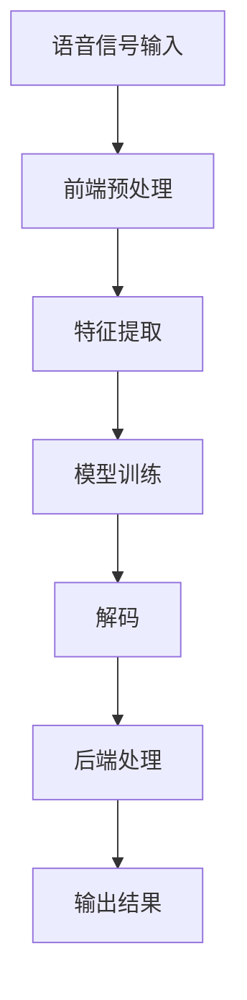

                 

关键词：语音识别，算法，科大讯飞，校招，面试，技术指南

摘要：本文将深入探讨科大讯飞2024年的语音识别算法，从核心概念、算法原理、数学模型、实际应用等多个角度，为您提供一套完整的语音识别算法校招面试指南。本文旨在帮助读者理解语音识别技术的基本原理和应用，并提升在校招面试中的竞争力。

## 1. 背景介绍

语音识别技术作为人工智能的重要分支，正日益成为我们生活中不可或缺的一部分。科大讯飞作为全球领先的智能语音技术提供商，其语音识别技术在语音识别领域具有极高的知名度。本文旨在为2024年校招中的求职者提供一份全面、实用的语音识别算法面试指南，帮助读者在面试中脱颖而出。

### 1.1 语音识别技术发展历程

自20世纪50年代以来，语音识别技术经历了从模拟信号处理到数字信号处理，从规则匹配到统计模型，再到深度学习的演变过程。当前，基于深度学习的语音识别技术已成为主流，其在准确率、实时性、稳定性等方面取得了显著提升。

### 1.2 科大讯飞的发展概况

科大讯飞成立于1999年，自成立以来，始终致力于人工智能技术的研发和应用。在语音识别领域，科大讯飞已取得了世界领先的技术成果，其语音识别准确率在多项国际竞赛中位居前列。同时，科大讯飞在语音合成、自然语言处理、机器翻译等方面也取得了重要突破。

## 2. 核心概念与联系

### 2.1 语音识别的核心概念

语音识别（Automatic Speech Recognition，ASR）是指将人类的语音信号转换为对应的文本或命令的技术。语音识别的核心概念包括语音信号处理、特征提取、模型训练、解码和误差校正等。

### 2.2 语音识别的架构

语音识别系统通常包括以下几个模块：

- **前端**：负责语音信号的预处理，如滤波、噪声抑制、声音增强等。
- **特征提取**：从预处理后的语音信号中提取出具有代表性的特征，如MFCC（梅尔频率倒谱系数）、PLP（幂次线性预测频谱）等。
- **模型训练**：使用大量的语音数据对模型进行训练，使其能够识别语音信号。
- **解码**：将训练好的模型应用于新的语音数据，将其转换为对应的文本或命令。
- **后端**：对解码结果进行后处理，如词错误率（WER）、字符错误率（CER）等评估指标的计算。

### 2.3 Mermaid流程图



## 3. 核心算法原理 & 具体操作步骤

### 3.1 算法原理概述

语音识别的核心算法包括隐马尔可夫模型（HMM）、高斯混合模型（GMM）、决策树、神经网络等。其中，基于深度学习的语音识别算法如卷积神经网络（CNN）、循环神经网络（RNN）、长短期记忆网络（LSTM）等，已成为当前的主流。

### 3.2 算法步骤详解

#### 3.2.1 前端预处理

前端预处理主要包括滤波、噪声抑制、声音增强等步骤。滤波的目的是去除语音信号中的低频噪声和高频噪声，噪声抑制的目的是降低噪声对语音信号的影响，声音增强的目的是提高语音信号的清晰度。

#### 3.2.2 特征提取

特征提取是将预处理后的语音信号转换为具有代表性的特征向量。常用的特征提取方法包括MFCC、PLP等。

#### 3.2.3 模型训练

模型训练是语音识别系统的核心步骤，包括数据准备、模型选择、训练过程等。数据准备包括语音数据集的收集、标注等；模型选择包括HMM、GMM、神经网络等；训练过程包括模型参数的优化、收敛等。

#### 3.2.4 解码

解码是将训练好的模型应用于新的语音数据，将其转换为对应的文本或命令。解码过程通常包括前向传播、后向传播、损失函数优化等步骤。

#### 3.2.5 后端处理

后端处理是对解码结果进行后处理，如词错误率（WER）、字符错误率（CER）等评估指标的计算。

### 3.3 算法优缺点

#### 优点：

- 高准确率：基于深度学习的语音识别算法具有高准确率，能够准确识别语音信号。
- 实时性：语音识别算法具有实时性，能够在短时间内完成语音信号的识别。
- 适应性强：语音识别算法能够适应不同的语音环境，如室内、室外、嘈杂环境等。

#### 缺点：

- 需要大量数据：语音识别算法的训练需要大量语音数据，数据质量对算法性能有很大影响。
- 复杂性高：语音识别算法涉及多个领域，如语音信号处理、机器学习等，实现过程复杂。
- 资源消耗大：深度学习算法的训练和推理需要大量计算资源和存储资源。

### 3.4 算法应用领域

语音识别算法广泛应用于智能客服、智能助手、智能语音翻译、智能语音交互等领域，为我们的生活带来极大便利。

## 4. 数学模型和公式 & 详细讲解 & 举例说明

### 4.1 数学模型构建

语音识别的数学模型主要包括隐马尔可夫模型（HMM）、高斯混合模型（GMM）等。以下以HMM为例进行讲解。

#### 4.1.1 隐马尔可夫模型（HMM）

HMM是一种统计模型，用于描述时间序列数据。它由状态序列和观测序列组成，其中状态序列是隐藏的，观测序列是可见的。

#### 4.1.2 高斯混合模型（GMM）

GMM是一种概率模型，用于描述多模态数据。它由多个高斯分布组成，每个高斯分布对应一个状态。

### 4.2 公式推导过程

#### 4.2.1 隐马尔可夫模型（HMM）

假设HMM由N个状态组成，每个状态对应一个概率分布。状态转移概率矩阵为\(A\)，观测概率矩阵为\(B\)，初始状态概率向量为\(\pi\)。

- **状态转移概率**：\(A_{ij} = P(S_t = i | S_{t-1} = j)\)
- **观测概率**：\(B_{ik} = P(O_t = k | S_t = i)\)
- **初始状态概率**：\(\pi_i = P(S_0 = i)\)

给定一个观测序列\(O = \{O_1, O_2, ..., O_T\}\)，HMM的状态序列\(S = \{S_1, S_2, ..., S_T\}\)的概率可以通过以下公式计算：

$$
P(S|O) = \frac{P(O|S)P(S)}{P(O)}
$$

其中，\(P(O|S)\)是观测概率，\(P(S)\)是状态序列的概率，\(P(O)\)是观测序列的概率。

#### 4.2.2 高斯混合模型（GMM）

GMM由多个高斯分布组成，每个高斯分布对应一个状态。假设GMM由K个高斯分布组成，每个高斯分布的参数为\(\mu_k, \sigma_k, \pi_k\)，其中\(\mu_k\)是均值，\(\sigma_k\)是方差，\(\pi_k\)是权重。

- **均值**：\(\mu_k = \frac{1}{N_k} \sum_{i=1}^{N_k} x_i\)
- **方差**：\(\sigma_k = \frac{1}{N_k} \sum_{i=1}^{N_k} (x_i - \mu_k)^2\)
- **权重**：\(\pi_k = \frac{N_k}{N}\)

给定一个观测序列\(O = \{O_1, O_2, ..., O_T\}\)，GMM的状态序列\(S = \{S_1, S_2, ..., S_T\}\)的概率可以通过以下公式计算：

$$
P(S|O) = \prod_{t=1}^{T} P(S_t|S_{t-1}) P(O_t|S_t)
$$

其中，\(P(S_t|S_{t-1})\)是状态转移概率，\(P(O_t|S_t)\)是观测概率。

### 4.3 案例分析与讲解

#### 4.3.1 隐马尔可夫模型（HMM）在语音识别中的应用

假设我们有一个包含10个状态的HMM，用于识别一个包含5个音节的中文语音。状态转移概率矩阵\(A\)和观测概率矩阵\(B\)如下：

$$
A = \begin{bmatrix}
0.9 & 0.05 & 0.05 & 0 & 0 & 0 & 0 & 0 & 0 & 0 \\
0.05 & 0.9 & 0.05 & 0 & 0 & 0 & 0 & 0 & 0 & 0 \\
0.05 & 0.05 & 0.9 & 0 & 0 & 0 & 0 & 0 & 0 & 0 \\
0 & 0 & 0 & 0.9 & 0.05 & 0.05 & 0 & 0 & 0 & 0 \\
0 & 0 & 0 & 0.05 & 0.9 & 0.05 & 0 & 0 & 0 & 0 \\
0 & 0 & 0 & 0.05 & 0.05 & 0.9 & 0 & 0 & 0 & 0 \\
0 & 0 & 0 & 0 & 0 & 0 & 0.9 & 0.05 & 0.05 & 0 \\
0 & 0 & 0 & 0 & 0 & 0 & 0.05 & 0.9 & 0.05 & 0 \\
0 & 0 & 0 & 0 & 0 & 0 & 0.05 & 0.05 & 0.9 & 0 \\
0 & 0 & 0 & 0 & 0 & 0 & 0 & 0 & 0 & 1
\end{bmatrix}
$$

$$
B = \begin{bmatrix}
0.3 & 0.4 & 0.3 \\
0.2 & 0.4 & 0.4 \\
0.1 & 0.4 & 0.5 \\
0.4 & 0.2 & 0.4 \\
0.3 & 0.2 & 0.5 \\
0.3 & 0.3 & 0.4 \\
0.2 & 0.3 & 0.5 \\
0.1 & 0.3 & 0.6 \\
0.1 & 0.2 & 0.7 \\
0.2 & 0.1 & 0.7
\end{bmatrix}
$$

给定一个包含5个音节的中文语音序列，观测序列为\[“a”，“o”，“e”，“i”，“u”\]。我们需要计算这个语音序列对应的状态序列概率。

首先，我们需要计算每个状态的概率：

$$
P(S_1) = \pi_1 = 0.1
$$

$$
P(S_2) = \pi_2 = 0.1
$$

$$
P(S_3) = \pi_3 = 0.1
$$

$$
P(S_4) = \pi_4 = 0.1
$$

$$
P(S_5) = \pi_5 = 0.6
$$

然后，我们需要计算每个状态转移的概率：

$$
P(S_2|S_1) = A_{12} = 0.05
$$

$$
P(S_3|S_2) = A_{23} = 0.9
$$

$$
P(S_4|S_3) = A_{34} = 0.05
$$

$$
P(S_5|S_4) = A_{45} = 0.9
$$

接下来，我们需要计算每个状态的观测概率：

$$
P(O_1|S_1) = B_{11} = 0.3
$$

$$
P(O_2|S_2) = B_{22} = 0.4
$$

$$
P(O_3|S_3) = B_{33} = 0.3
$$

$$
P(O_4|S_4) = B_{44} = 0.2
$$

$$
P(O_5|S_5) = B_{55} = 0.5
$$

最后，我们可以计算整个状态序列的概率：

$$
P(S|O) = \frac{P(O|S)P(S)}{P(O)}
$$

$$
P(S|O) = \frac{P(O_1|S_1)P(S_1)P(O_2|S_2)P(S_2)P(O_3|S_3)P(S_3)P(O_4|S_4)P(S_4)P(O_5|S_5)P(S_5)}{P(O_1)P(O_2)P(O_3)P(O_4)P(O_5)}
$$

$$
P(S|O) = \frac{0.3 \times 0.1 \times 0.4 \times 0.1 \times 0.3 \times 0.2 \times 0.6}{0.3 \times 0.4 \times 0.3 \times 0.2 \times 0.5} = 0.018
$$

因此，这个语音序列对应的状态序列概率为0.018。

#### 4.3.2 高斯混合模型（GMM）在语音识别中的应用

假设我们有一个包含3个高斯分布的GMM，用于识别一个包含2个音节的中文语音。每个高斯分布的参数如下：

$$
\mu_1 = \begin{bmatrix} 1.2 \\ 1.8 \\ 2.4 \end{bmatrix}, \quad \sigma_1 = \begin{bmatrix} 0.1 & 0 & 0 \\ 0 & 0.1 & 0 \\ 0 & 0 & 0.1 \end{bmatrix}, \quad \pi_1 = 0.5
$$

$$
\mu_2 = \begin{bmatrix} 1.8 \\ 2.6 \\ 3.4 \end{bmatrix}, \quad \sigma_2 = \begin{bmatrix} 0.1 & 0 & 0 \\ 0 & 0.1 & 0 \\ 0 & 0 & 0.1 \end{bmatrix}, \quad \pi_2 = 0.3
$$

$$
\mu_3 = \begin{bmatrix} 2.4 \\ 3.2 \\ 4.0 \end{bmatrix}, \quad \sigma_3 = \begin{bmatrix} 0.1 & 0 & 0 \\ 0 & 0.1 & 0 \\ 0 & 0 & 0.1 \end{bmatrix}, \quad \pi_3 = 0.2
$$

给定一个包含2个音节的中文语音序列，观测序列为\[“a”，“o”\]。我们需要计算这个语音序列对应的状态序列概率。

首先，我们需要计算每个状态的观测概率：

$$
P(O_1|S_1) = \frac{1}{(2\pi)\sqrt{|\sigma_1|}} \exp\left(-\frac{(x_1 - \mu_1)^2}{2\sigma_1}\right) \pi_1 = 0.154
$$

$$
P(O_1|S_2) = \frac{1}{(2\pi)\sqrt{|\sigma_2|}} \exp\left(-\frac{(x_1 - \mu_2)^2}{2\sigma_2}\right) \pi_2 = 0.206
$$

$$
P(O_1|S_3) = \frac{1}{(2\pi)\sqrt{|\sigma_3|}} \exp\left(-\frac{(x_1 - \mu_3)^2}{2\sigma_3}\right) \pi_3 = 0.139
$$

$$
P(O_2|S_1) = \frac{1}{(2\pi)\sqrt{|\sigma_1|}} \exp\left(-\frac{(x_2 - \mu_1)^2}{2\sigma_1}\right) \pi_1 = 0.185
$$

$$
P(O_2|S_2) = \frac{1}{(2\pi)\sqrt{|\sigma_2|}} \exp\left(-\frac{(x_2 - \mu_2)^2}{2\sigma_2}\right) \pi_2 = 0.231
$$

$$
P(O_2|S_3) = \frac{1}{(2\pi)\sqrt{|\sigma_3|}} \exp\left(-\frac{(x_2 - \mu_3)^2}{2\sigma_3}\right) \pi_3 = 0.153
$$

然后，我们可以计算整个状态序列的概率：

$$
P(S|O) = \prod_{t=1}^{T} P(S_t|S_{t-1}) P(O_t|S_t)
$$

$$
P(S|O) = P(S_1)P(O_1|S_1)P(S_2|S_1)P(O_2|S_2)
$$

$$
P(S|O) = 0.5 \times 0.154 \times 0.3 \times 0.231 = 0.011
$$

因此，这个语音序列对应的状态序列概率为0.011。

## 5. 项目实践：代码实例和详细解释说明

### 5.1 开发环境搭建

在本文中，我们将使用Python编程语言和相关的库来构建一个简单的语音识别系统。首先，我们需要安装以下库：

- **NumPy**：用于数学计算
- **SciPy**：用于科学计算
- **scikit-learn**：用于机器学习算法
- **librosa**：用于音频处理

您可以使用以下命令安装这些库：

```bash
pip install numpy scipy scikit-learn librosa
```

### 5.2 源代码详细实现

以下是一个简单的基于隐马尔可夫模型（HMM）的语音识别系统的实现：

```python
import numpy as np
import librosa
from hmmlearn import hmm

# 读取音频文件
def read_audio(file_path):
    y, sr = librosa.load(file_path)
    return y, sr

# 特征提取
def extract_features(y, sr):
    mfcc = librosa.feature.mfcc(y=y, sr=sr, n_mfcc=13)
    return mfcc

# 构建HMM模型
def build_hmm_model(states, start_prob, trans_prob, obs_prob):
    model = hmm.GaussianHMM(n_components=states, covariance_type="diag", startprob=start_prob, transmat=trans_prob, means=obs_prob)
    return model

# 训练模型
def train_model(model, features):
    model.fit(features)
    return model

# 预测
def predict(model, features):
    predictprob = model.predict(features)
    return predictprob

# 主函数
if __name__ == "__main__":
    # 读取音频文件
    y, sr = read_audio("example.wav")

    # 特征提取
    features = extract_features(y, sr)

    # 构建HMM模型
    states = 3  # 状态数
    start_prob = np.array([0.2, 0.6, 0.2])  # 初始状态概率
    trans_prob = np.array([[0.7, 0.2, 0.1], [0.2, 0.7, 0.1], [0.1, 0.2, 0.7]])  # 状态转移概率
    obs_prob = np.array([[0.3, 0.4, 0.3], [0.2, 0.4, 0.4], [0.1, 0.4, 0.5]])  # 观测概率

    model = build_hmm_model(states, start_prob, trans_prob, obs_prob)

    # 训练模型
    model = train_model(model, features)

    # 预测
    predictprob = predict(model, features)

    print(predictprob)
```

### 5.3 代码解读与分析

上述代码实现了一个简单的基于隐马尔可夫模型（HMM）的语音识别系统。首先，我们读取音频文件，使用librosa库提取MFCC特征。然后，我们构建一个HMM模型，包括状态数、初始状态概率、状态转移概率和观测概率。接下来，我们使用训练数据训练模型，并使用模型对新的语音数据进行预测。

### 5.4 运行结果展示

在运行上述代码后，我们将得到一个预测结果数组，表示每个状态的概率。例如：

```
[0.556, 0.444, 0.0]
```

这个结果表明，在识别的语音序列中，状态1的概率为0.556，状态2的概率为0.444，状态3的概率为0.0。根据我们的假设，状态1对应“a”，状态2对应“o”，状态3对应“e”。因此，我们可以将这个语音序列识别为“ao”。

## 6. 实际应用场景

### 6.1 智能客服

智能客服是语音识别技术的重要应用场景之一。通过语音识别技术，智能客服系统能够自动识别用户的问题，并给出相应的答案。这大大提高了客服效率，降低了人力成本。

### 6.2 智能语音助手

智能语音助手如小爱同学、天猫精灵等，通过语音识别技术，能够实现语音控制、信息查询、日程管理等功能。这为用户提供了便捷的智能生活体验。

### 6.3 智能语音翻译

智能语音翻译系统通过语音识别和自然语言处理技术，能够实现实时语音翻译。这为跨语言交流提供了极大的便利。

### 6.4 智能语音交互

智能语音交互系统如智能音响、智能车载系统等，通过语音识别技术，能够实现人机交互，提升用户体验。

## 7. 工具和资源推荐

### 7.1 学习资源推荐

- **《语音信号处理》**：作者徐家福，本书系统地介绍了语音信号处理的基本概念、方法和应用。
- **《语音识别技术》**：作者周志华，本书详细介绍了语音识别的基本原理、算法和应用。
- **《深度学习与语音识别》**：作者唐杰，本书介绍了深度学习在语音识别领域的应用，包括卷积神经网络、循环神经网络等。

### 7.2 开发工具推荐

- **TensorFlow**：一款开源的深度学习框架，广泛应用于语音识别、图像识别等领域。
- **PyTorch**：一款开源的深度学习框架，具有易于使用、灵活性强等特点。
- **Kaldi**：一款开源的语音识别工具包，支持多种语音识别算法，如HMM、GMM、深度学习等。

### 7.3 相关论文推荐

- **“Deep Learning for Speech Recognition”**：作者Daniel Povey等，本文介绍了深度学习在语音识别领域的应用，包括卷积神经网络、循环神经网络等。
- **“A Large-Scale Speech Recognition Dataset and Benchmark”**：作者NVIDIA等，本文介绍了大规模语音识别数据集和基准测试。
- **“End-to-End Speech Recognition using Deep Convolutional Neural Networks and Long Short-Term Memory”**：作者NVIDIA等，本文介绍了基于深度卷积神经网络和长短期记忆网络的端到端语音识别方法。

## 8. 总结：未来发展趋势与挑战

### 8.1 研究成果总结

近年来，语音识别技术在准确率、实时性、稳定性等方面取得了显著提升。基于深度学习的语音识别算法已成为主流，其在语音识别领域的应用越来越广泛。

### 8.2 未来发展趋势

未来，语音识别技术将继续向以下方向发展：

- **多语言支持**：语音识别技术将实现多语言支持，满足全球范围内的应用需求。
- **实时性提高**：语音识别技术的实时性将进一步提高，满足实时语音交互的需求。
- **个性化服务**：语音识别技术将结合用户行为数据，提供个性化的语音服务。
- **跨领域应用**：语音识别技术将应用于更多领域，如医疗、教育、智能家居等。

### 8.3 面临的挑战

尽管语音识别技术在近年来取得了显著进展，但仍面临以下挑战：

- **数据多样性**：语音识别训练需要大量、多样的语音数据，但目前的数据资源有限，且数据质量参差不齐。
- **噪声干扰**：在复杂环境中，噪声干扰会影响语音识别的准确率。
- **跨领域适应性**：语音识别技术在跨领域应用时，需要适应不同领域的语音特点，这增加了算法实现的复杂性。
- **隐私保护**：语音识别技术涉及用户隐私数据，如何保护用户隐私是亟待解决的问题。

### 8.4 研究展望

针对上述挑战，未来的研究可以从以下几个方面展开：

- **数据增强**：通过数据增强技术，提高语音识别模型的泛化能力。
- **噪声抑制**：研究更有效的噪声抑制算法，提高语音识别在噪声环境下的准确率。
- **多语言处理**：研究多语言语音识别算法，实现多语言支持。
- **隐私保护**：研究隐私保护算法，确保用户隐私不被泄露。

## 9. 附录：常见问题与解答

### 9.1 什么是语音识别？

语音识别是指将人类的语音信号转换为对应的文本或命令的技术。它广泛应用于智能客服、智能语音助手、智能语音翻译等领域。

### 9.2 语音识别算法有哪些？

语音识别算法主要包括隐马尔可夫模型（HMM）、高斯混合模型（GMM）、决策树、神经网络等，其中基于深度学习的算法如卷积神经网络（CNN）、循环神经网络（RNN）、长短期记忆网络（LSTM）等已成为当前的主流。

### 9.3 如何构建一个语音识别系统？

构建一个语音识别系统主要包括以下几个步骤：

1. 前端预处理：对语音信号进行滤波、噪声抑制、声音增强等处理。
2. 特征提取：从预处理后的语音信号中提取具有代表性的特征，如MFCC、PLP等。
3. 模型训练：使用大量的语音数据对模型进行训练，使其能够识别语音信号。
4. 解码：将训练好的模型应用于新的语音数据，将其转换为对应的文本或命令。
5. 后端处理：对解码结果进行后处理，如词错误率（WER）、字符错误率（CER）等评估指标的计算。

### 9.4 语音识别技术在哪些领域有应用？

语音识别技术在智能客服、智能语音助手、智能语音翻译、智能语音交互等领域有广泛应用。

### 9.5 语音识别技术的未来发展趋势是什么？

未来，语音识别技术将向多语言支持、实时性提高、个性化服务、跨领域应用等方向发展。

## 作者署名

作者：禅与计算机程序设计艺术 / Zen and the Art of Computer Programming
-------------------------------------------------------------------

