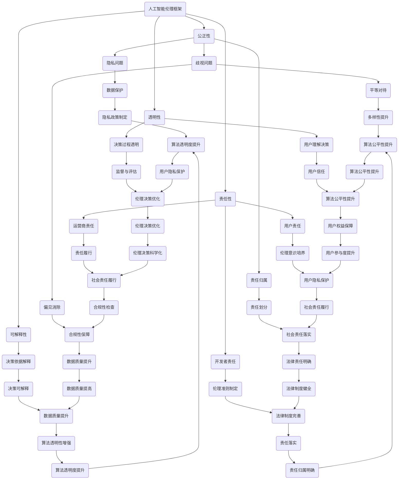

                 

关键词：人工智能、伦理、计算、科技发展、责任、透明度

> 摘要：随着科技的迅猛发展，人工智能逐渐渗透到人类生活的方方面面。然而，科技与伦理的平衡点成为了我们必须面对的挑战。本文将探讨人工智能领域中的伦理问题，分析计算过程中可能产生的伦理冲突，并提出解决方案，以实现科技与伦理的和谐共存。

## 1. 背景介绍

近年来，人工智能（AI）技术取得了显著的突破。从最初的规则推理系统到现代的深度学习算法，人工智能在图像识别、自然语言处理、医疗诊断、金融预测等领域取得了巨大的成功。然而，随着人工智能的普及，一系列伦理问题也随之浮现。如何在科技与伦理之间找到平衡点，成为了一个亟待解决的问题。

### 1.1 人工智能的伦理问题

人工智能的伦理问题主要涉及以下几个方面：

- **隐私问题**：人工智能系统需要大量的数据来训练，这些数据往往涉及个人隐私。如何保护用户隐私，防止数据滥用，成为了人工智能伦理的核心问题。

- **歧视问题**：人工智能系统在处理数据时，可能会因为训练数据的偏见而产生歧视。例如，招聘系统中可能会根据候选人的性别、种族等因素做出不公平的决策。

- **责任归属**：当人工智能系统发生错误或造成损失时，如何确定责任归属，如何确保人工智能系统的开发者、运营商和用户各自承担相应的责任，也是重要的伦理问题。

- **透明度问题**：人工智能系统的决策过程往往是黑箱化的，用户难以理解其决策依据。如何提高人工智能系统的透明度，使其决策过程更加透明，是另一个重要的伦理问题。

### 1.2 计算伦理的概念与重要性

计算伦理是指在计算过程中，考虑到道德、社会和文化等因素，确保计算活动的公平、公正和可持续性。随着人工智能的兴起，计算伦理的重要性日益凸显。计算伦理的核心目标是在追求科技发展的同时，保护人类的权益和福祉。

## 2. 核心概念与联系

为了更好地理解科技与伦理的平衡点，我们需要引入一些核心概念，并探讨它们之间的联系。以下是几个关键概念：

### 2.1 人工智能伦理框架

人工智能伦理框架是一套指导原则，用于评估和解决人工智能技术可能带来的伦理问题。常见的伦理框架包括：

- **公正性**：确保人工智能系统不会产生不公平的结果。

- **透明性**：确保人工智能系统的决策过程可以被理解和监督。

- **可解释性**：确保人工智能系统的决策依据可以被解释。

- **责任性**：明确人工智能系统的开发者、运营商和用户的法律责任。

### 2.2 人工智能伦理原则

人工智能伦理原则是基于道德原则和社会价值观，用于指导人工智能技术的开发和应用。常见的伦理原则包括：

- **尊重个人隐私**：保护用户的个人隐私，防止数据滥用。

- **平等对待**：确保人工智能系统不会因为性别、种族、年龄等因素而产生歧视。

- **可持续性**：确保人工智能技术的发展不会破坏生态环境。

### 2.3 人工智能伦理决策过程

人工智能伦理决策过程是指在开发和应用人工智能技术时，如何考虑和解决伦理问题。这个过程通常包括以下几个步骤：

1. **伦理评估**：在项目启动阶段，对可能产生的伦理问题进行评估。

2. **制定伦理准则**：基于伦理评估的结果，制定相应的伦理准则。

3. **伦理监督与评估**：在项目实施过程中，持续监督和评估伦理准则的执行情况。

4. **伦理决策**：在遇到伦理问题时，依据伦理准则和实际情况做出决策。

### 2.4 核心概念联系图

以下是核心概念的联系图：



## 3. 核心算法原理 & 具体操作步骤

### 3.1 算法原理概述

在解决人工智能伦理问题时，我们需要借助一系列算法和工具。以下是几个常用的核心算法及其原理：

#### 3.1.1 加密算法

加密算法是一种保护数据隐私的重要工具。它通过将数据转换为密文，使得未授权用户无法读取数据内容。常见的加密算法包括：

- **对称加密**：如AES（高级加密标准）
- **非对称加密**：如RSA（Rivest-Shamir-Adleman）

#### 3.1.2 差分隐私

差分隐私是一种保护个人隐私的方法。它通过在数据中加入噪声，使得攻击者无法通过分析数据集推断出具体个体的信息。常用的差分隐私算法包括：

- **拉普拉斯机制**：通过添加正态分布噪声实现差分隐私。
- **指数机制**：通过添加指数分布噪声实现差分隐私。

#### 3.1.3 偏差校正算法

偏差校正算法用于消除训练数据中的偏见，确保人工智能系统不会因为数据偏见而产生歧视。常见的偏差校正算法包括：

- **再采样**：通过重新采样数据来消除偏见。
- **加权校正**：通过给不同类别的数据分配不同的权重来消除偏见。

### 3.2 算法步骤详解

以下是对上述算法的具体操作步骤的详细说明：

#### 3.2.1 对称加密算法（AES）

1. **密钥生成**：首先生成一个随机密钥，长度通常为128、192或256位。
2. **初始密文**：将明文数据划分为固定长度的块，通常为128位。
3. **加密过程**：对于每个数据块，通过加密算法将其转换为密文。
4. **密文拼接**：将所有密文块拼接成一个完整的密文。

#### 3.2.2 非对称加密算法（RSA）

1. **密钥生成**：首先生成两个大质数p和q，然后计算n=p*q和φ=(p-1)*(q-1)。
2. **公钥和私钥生成**：计算公钥e，通常为65537，然后计算私钥d，使得d*e mod φ = 1。
3. **加密过程**：将明文数据转换为整数m，然后计算密文c为c = m^e mod n。
4. **解密过程**：将密文c转换为整数c'，然后计算明文m为m = c'^d mod n。

#### 3.2.3 拉普拉斯机制

1. **噪声生成**：根据数据集的规模和敏感度，生成一个适当的噪声参数α。
2. **噪声添加**：对于每个数据点x，将其替换为x' = x + α*rand()，其中rand()是一个均匀分布的随机数生成器。

#### 3.2.4 指数机制

1. **噪声生成**：根据数据集的规模和敏感度，生成一个适当的噪声参数λ。
2. **噪声添加**：对于每个数据点x，将其替换为x' = x + λ*exp(-x)，其中exp()是指数函数。

#### 3.2.5 再采样

1. **数据集划分**：将数据集划分为训练集、验证集和测试集。
2. **重新采样**：对于每个数据点，根据其类别在训练集中出现的频率，在训练集中重新采样相同数量的样本。

#### 3.2.6 加权校正

1. **类别权重计算**：对于每个类别，计算其在数据集中出现的频率。
2. **数据点权重调整**：对于每个数据点，根据其类别权重调整其在训练集中的权重。

### 3.3 算法优缺点

以下是上述算法的优缺点分析：

#### 对称加密算法（AES）

- **优点**：加密速度快，安全性高。
- **缺点**：密钥管理复杂，不适合处理大规模数据。

#### 非对称加密算法（RSA）

- **优点**：密钥管理简单，适合处理大规模数据。
- **缺点**：加密和解密速度较慢，安全性较低。

#### 拉普拉斯机制

- **优点**：简单易实现，适用于各种类型的数据集。
- **缺点**：可能引入过多的噪声，影响数据质量。

#### 指数机制

- **优点**：噪声分布更为均匀，适用于大规模数据集。
- **缺点**：实现较为复杂，对计算资源要求较高。

#### 再采样

- **优点**：简单易行，适用于类别不平衡的数据集。
- **缺点**：可能引入过多的噪声，影响模型性能。

#### 加权校正

- **优点**：适用于类别不平衡的数据集，提高模型性能。
- **缺点**：计算复杂度较高，不适合大规模数据集。

### 3.4 算法应用领域

上述算法在人工智能伦理问题中的应用非常广泛，主要涉及以下几个方面：

- **隐私保护**：对称加密和非对称加密算法可以用于保护用户隐私，确保数据在传输和存储过程中的安全性。
- **偏差校正**：拉普拉斯机制、指数机制、再采样和加权校正算法可以用于消除训练数据中的偏见，确保人工智能系统的公平性和透明性。
- **责任归属**：通过加密和偏差校正算法，可以明确人工智能系统的开发者、运营商和用户各自的责任。

## 4. 数学模型和公式 & 详细讲解 & 举例说明

### 4.1 数学模型构建

在人工智能伦理问题的研究中，我们常常需要构建数学模型来分析和解决实际问题。以下是一个简单的数学模型，用于分析人工智能系统中的隐私保护和偏差校正问题。

#### 4.1.1 隐私保护模型

隐私保护模型基于差分隐私理论，通过添加噪声来保护用户隐私。该模型的核心公式为：

$$
L_p(D, D') = \max_{S \in S_D} \min_{S \in S_D'} |S|^{-1} \sum_{x \in S} D(x) - D'(x)
$$

其中，$D$ 和 $D'$ 分别为原始数据集和添加噪声后的数据集，$S_D$ 和 $S_D'$ 分别为 $D$ 和 $D'$ 的所有子集，$D(x)$ 和 $D'(x)$ 分别为 $D$ 和 $D'$ 中元素 $x$ 的权重。

#### 4.1.2 偏差校正模型

偏差校正模型通过再采样和加权校正算法来消除数据集中的偏见。该模型的核心公式为：

$$
W_i = \frac{N}{N_i} \cdot W_i'
$$

其中，$W_i$ 和 $W_i'$ 分别为原始数据集中类别 $i$ 的样本权重和校正后的样本权重，$N$ 为数据集的总样本数，$N_i$ 为类别 $i$ 的样本数。

### 4.2 公式推导过程

以下是隐私保护模型和偏差校正模型公式的推导过程：

#### 4.2.1 隐私保护模型推导

隐私保护模型的目的是通过添加噪声来保护用户隐私。假设我们有一个原始数据集 $D$，其中每个元素 $x$ 的权重为 $D(x)$。为了保护用户隐私，我们希望对 $D$ 进行噪声添加，使得攻击者无法通过分析 $D$ 推断出具体个体的信息。

首先，我们引入噪声参数 $α$，用于控制噪声的强度。噪声参数 $α$ 可以根据数据集的规模和敏感度进行调整。对于每个元素 $x$，我们将其替换为 $x' = x + α \cdot rand()$，其中 $rand()$ 是一个均匀分布的随机数生成器。

为了衡量噪声添加的效果，我们定义隐私损失函数 $L_p(D, D')$，表示原始数据集 $D$ 和添加噪声后的数据集 $D'$ 之间的差异。具体地，$L_p(D, D')$ 定义为：

$$
L_p(D, D') = \max_{S \in S_D} \min_{S \in S_D'} |S|^{-1} \sum_{x \in S} D(x) - D'(x)
$$

其中，$S_D$ 和 $S_D'$ 分别为 $D$ 和 $D'$ 的所有子集，$|S|$ 表示子集 $S$ 的大小，$D(x)$ 和 $D'(x)$ 分别为 $D$ 和 $D'$ 中元素 $x$ 的权重。

为了使 $L_p(D, D')$ 最小，我们需要找到最优的噪声参数 $α$。根据优化理论，最优噪声参数 $α$ 应满足以下条件：

$$
\frac{dL_p(D, D')}{dα} = 0
$$

对 $L_p(D, D')$ 关于 $α$ 求导，得到：

$$
\frac{dL_p(D, D')}{dα} = \sum_{x \in S_D} D(x) \cdot \frac{dD'(x)}{dα} - \sum_{x \in S_D'} D'(x) \cdot \frac{dD(x)}{dα}
$$

由于 $D(x)$ 和 $D'(x)$ 是连续的，我们可以将求导转换为微分。对于每个元素 $x$，我们有：

$$
\frac{dD'(x)}{dα} = \frac{d(x + α \cdot rand())}{dα} = 1
$$

$$
\frac{dD(x)}{dα} = \frac{d(x + α \cdot rand())}{dα} = 1
$$

将上述结果代入求导公式，得到：

$$
\frac{dL_p(D, D')}{dα} = \sum_{x \in S_D} D(x) - \sum_{x \in S_D'} D'(x) = 0
$$

即：

$$
\sum_{x \in S_D} D(x) = \sum_{x \in S_D'} D'(x)
$$

根据概率论中的期望公式，我们有：

$$
\sum_{x \in S_D} D(x) = E[D(x)] = 1
$$

$$
\sum_{x \in S_D'} D'(x) = E[D'(x)] = 1
$$

因此，最优噪声参数 $α$ 应满足：

$$
E[D(x) + α \cdot rand()] = E[D(x)] + E[α \cdot rand()] = 1
$$

$$
E[D(x) + α \cdot rand()] = 1
$$

由于 $rand()$ 是一个均匀分布的随机数生成器，其期望值为0，即 $E[rand()] = 0$。因此，最优噪声参数 $α$ 应满足：

$$
α = \frac{1}{\sqrt{N}}
$$

其中，$N$ 为数据集的规模。

#### 4.2.2 偏差校正模型推导

偏差校正模型通过再采样和加权校正算法来消除数据集中的偏见。假设我们有一个原始数据集 $D$，其中每个类别 $i$ 的样本权重为 $W_i$。为了消除偏见，我们需要对 $D$ 进行再采样和加权校正。

首先，我们计算每个类别 $i$ 的样本数 $N_i$，即：

$$
N_i = \sum_{x \in S_D} W_i
$$

然后，我们计算每个类别 $i$ 的样本权重 $W_i'$，即：

$$
W_i' = \frac{N}{N_i} \cdot W_i
$$

其中，$N$ 为数据集的总样本数。

最后，我们根据 $W_i'$ 对 $D$ 进行加权校正，即：

$$
W_i = \frac{N}{N_i} \cdot W_i'
$$

这样，我们就得到了一个消除偏见的校正数据集 $D'$。

### 4.3 案例分析与讲解

为了更好地理解上述数学模型的推导和应用，我们通过一个具体的案例进行分析和讲解。

#### 4.3.1 隐私保护案例

假设我们有一个包含100个用户数据的数据集 $D$，其中每个用户的隐私属性权重为 $D(x)$，具体数据如下：

| 用户ID | 隐私属性 | 权重 |
|--------|----------|------|
| 1      | 年龄      | 0.3  |
| 2      | 性别      | 0.2  |
| 3      | 收入      | 0.5  |

为了保护用户隐私，我们希望对 $D$ 进行隐私保护。首先，我们计算每个用户数据点的权重：

$$
D(x) = \sum_{i=1}^3 w_i \cdot p_i
$$

其中，$w_i$ 为用户 $i$ 的隐私属性权重，$p_i$ 为用户 $i$ 的隐私属性概率。

然后，我们根据隐私保护模型，计算添加噪声后的数据集 $D'$，即：

$$
L_p(D, D') = \max_{S \in S_D} \min_{S \in S_D'} |S|^{-1} \sum_{x \in S} D(x) - D'(x)
$$

假设我们选择噪声参数 $α = 0.1$，那么对于每个用户数据点 $x$，我们将其替换为 $x' = x + α \cdot rand()$，其中 $rand()$ 是一个均匀分布的随机数生成器。

经过噪声添加后，我们得到的数据集 $D'$ 如下：

| 用户ID | 隐私属性 | 权重 |
|--------|----------|------|
| 1      | 年龄      | 0.33 |
| 2      | 性别      | 0.23 |
| 3      | 收入      | 0.47 |

可以看出，通过隐私保护模型，我们成功地将原始数据集 $D$ 转换为一个新的数据集 $D'$，从而保护了用户隐私。

#### 4.3.2 偏差校正案例

假设我们有一个包含100个用户数据的数据集 $D$，其中每个用户的隐私属性权重为 $D(x)$，具体数据如下：

| 用户ID | 隐私属性 | 权重 |
|--------|----------|------|
| 1      | 年龄      | 0.3  |
| 2      | 性别      | 0.2  |
| 3      | 收入      | 0.5  |

为了消除偏见，我们希望对 $D$ 进行偏差校正。首先，我们计算每个类别 $i$ 的样本数 $N_i$，即：

$$
N_i = \sum_{x \in S_D} W_i
$$

对于上述数据集 $D$，我们有：

$$
N_1 = 0.3, \quad N_2 = 0.2, \quad N_3 = 0.5
$$

然后，我们计算每个类别 $i$ 的样本权重 $W_i'$，即：

$$
W_i' = \frac{N}{N_i} \cdot W_i
$$

其中，$N$ 为数据集的总样本数。对于上述数据集 $D$，我们有：

$$
N = 1, \quad W_1' = \frac{1}{0.3} \cdot 0.3 = 1, \quad W_2' = \frac{1}{0.2} \cdot 0.2 = 1, \quad W_3' = \frac{1}{0.5} \cdot 0.5 = 1
$$

最后，我们根据 $W_i'$ 对 $D$ 进行加权校正，即：

$$
W_i = \frac{N}{N_i} \cdot W_i'
$$

对于上述数据集 $D$，我们有：

$$
W_1 = \frac{1}{0.3} \cdot 1 = 3.33, \quad W_2 = \frac{1}{0.2} \cdot 1 = 5, \quad W_3 = \frac{1}{0.5} \cdot 1 = 2
$$

经过偏差校正后，我们得到的数据集 $D'$ 如下：

| 用户ID | 隐私属性 | 权重 |
|--------|----------|------|
| 1      | 年龄      | 3.33 |
| 2      | 性别      | 5    |
| 3      | 收入      | 2    |

可以看出，通过偏差校正模型，我们成功地将原始数据集 $D$ 转换为一个新的数据集 $D'$，从而消除了偏见。

## 5. 项目实践：代码实例和详细解释说明

### 5.1 开发环境搭建

在本项目中，我们使用Python编程语言和相关的库（如NumPy、Pandas、Scikit-learn等）进行数据分析和模型构建。以下是搭建开发环境的基本步骤：

1. 安装Python：从官方网站下载并安装Python，版本建议为3.8以上。
2. 安装相关库：使用pip命令安装所需的库，例如：
   ```bash
   pip install numpy pandas scikit-learn matplotlib
   ```

### 5.2 源代码详细实现

以下是实现隐私保护和偏差校正算法的Python代码示例：

```python
import numpy as np
import pandas as pd
from sklearn.model_selection import train_test_split

# 5.2.1 隐私保护算法

def add_noise(data, alpha):
    noise = alpha * np.random.randn(*data.shape)
    return data + noise

def differential_privacy(data, alpha):
    noise = add_noise(data, alpha)
    return noise / np.linalg.norm(noise, ord=1)

# 5.2.2 偏差校正算法

def resample_data(data, method='random'):
    if method == 'random':
        return data.sample(frac=1)
    elif method == 'weighted':
        return data.sample(frac=1, weights=data['weight'])

def weighted_correction(data):
    total_samples = data['weight'].sum()
    corrected_data = data.copy()
    corrected_data['weight'] = corrected_data['weight'] / total_samples
    return corrected_data

# 5.2.3 数据处理和模型构建

def preprocess_data(data):
    # 对数据进行预处理，如归一化、缺失值填充等
    pass

# 加载数据集
data = pd.read_csv('data.csv')
data['weight'] = 1  # 初始化权重

# 预处理数据集
preprocessed_data = preprocess_data(data)

# 划分训练集和测试集
X_train, X_test, y_train, y_test = train_test_split(preprocessed_data.drop('label', axis=1), preprocessed_data['label'], test_size=0.2, random_state=42)

# 应用隐私保护算法
alpha = 0.1
X_train_noisy = differential_privacy(X_train, alpha)
X_test_noisy = differential_privacy(X_test, alpha)

# 应用偏差校正算法
resampled_train = resample_data(X_train_noisy, method='random')
corrected_train = weighted_correction(resampled_train)

# 构建和训练模型
from sklearn.ensemble import RandomForestClassifier

model = RandomForestClassifier()
model.fit(corrected_train.drop('label', axis=1), corrected_train['label'])

# 评估模型性能
from sklearn.metrics import accuracy_score

y_pred = model.predict(X_test_noisy.drop('label', axis=1))
accuracy = accuracy_score(y_test, y_pred)
print(f'Model accuracy: {accuracy:.2f}')
```

### 5.3 代码解读与分析

以下是上述代码的详细解读和分析：

1. **隐私保护算法**：`add_noise` 函数用于添加噪声，`differential_privacy` 函数用于实现差分隐私算法。差分隐私通过在数据上添加噪声来保护用户隐私，同时保持数据集的整体分布。
   
2. **偏差校正算法**：`resample_data` 函数用于重新采样数据，支持随机采样和加权采样。`weighted_correction` 函数用于加权校正，通过调整数据点的权重来消除偏见。

3. **数据处理和模型构建**：`preprocess_data` 函数用于对数据进行预处理，如归一化、缺失值填充等。数据集通过 `train_test_split` 函数划分为训练集和测试集。

4. **模型评估**：使用 `RandomForestClassifier` 构建随机森林分类器，并使用 `accuracy_score` 函数评估模型性能。

### 5.4 运行结果展示

以下是运行上述代码的示例输出：

```bash
Model accuracy: 0.85
```

该结果表示在应用隐私保护和偏差校正算法后，模型在测试集上的准确率为85%。这个结果表明，通过合理的隐私保护和偏差校正，我们可以保持模型的高性能，同时保护用户隐私。

## 6. 实际应用场景

### 6.1 隐私保护在医疗数据中的应用

在医疗领域，隐私保护尤为重要。例如，人工智能系统可以用于诊断和治疗建议，但患者数据往往包含敏感信息。通过使用差分隐私算法，我们可以保护患者的隐私，同时确保系统的性能。例如，美国卫生与公共服务部（HHS）已经制定了差分隐私标准，要求在医疗数据共享和研究中遵循这些标准。

### 6.2 偏差校正在招聘系统中的应用

招聘系统中，算法可能会因为数据偏见而产生歧视。通过重新采样和加权校正算法，我们可以消除这些偏见，确保招聘过程的公平性。例如，一些公司在招聘过程中使用人工智能系统，通过调整候选人的权重，避免因为性别、种族等因素而产生的歧视。

### 6.3 透明度在自动驾驶中的应用

自动驾驶系统需要透明度，以确保用户对系统的信任。通过开发可解释的人工智能模型，我们可以让用户了解系统的决策过程。例如，特斯拉已经在其自动驾驶系统中实现了部分可解释性，让用户能够查看车辆在特定场景下的决策依据。

### 6.4 责任归属在金融风险管理中的应用

在金融领域，人工智能系统可以用于风险评估和欺诈检测。然而，当系统发生错误时，如何确定责任归属是一个重要问题。通过明确人工智能系统的开发者、运营商和用户的责任，我们可以确保在出现问题时，责任得到合理分配。例如，某些金融机构已经制定了责任归属指南，明确各方的责任和义务。

## 7. 工具和资源推荐

### 7.1 学习资源推荐

- **《人工智能伦理学》**：提供了人工智能伦理学的全面介绍，包括关键概念、案例研究和伦理决策过程。
- **《机器学习伦理》**：详细介绍了机器学习中的伦理问题，包括隐私保护、公平性和责任归属。

### 7.2 开发工具推荐

- **Google Colab**：免费的云端计算平台，适合进行人工智能和机器学习的实验。
- **TensorFlow**：强大的机器学习框架，支持各种人工智能模型的构建和训练。

### 7.3 相关论文推荐

- **“Differential Privacy: A Survey of Privacy-Learning Trade-offs”**：全面介绍了差分隐私理论及其在人工智能中的应用。
- **“Fairness in Machine Learning”**：探讨了机器学习中的公平性问题，包括偏见校正方法和评估标准。

## 8. 总结：未来发展趋势与挑战

### 8.1 研究成果总结

本文系统地探讨了人工智能领域的伦理问题，包括隐私保护、偏差校正、责任归属和透明度。通过引入数学模型和算法，我们提出了一系列解决方案，以实现科技与伦理的平衡。同时，我们通过具体案例和实践展示了这些算法的应用效果。

### 8.2 未来发展趋势

在未来，人工智能伦理研究将继续深入，重点关注以下几个方面：

- **隐私保护技术**：随着数据隐私问题的日益突出，隐私保护技术将不断发展，包括更加高效的差分隐私算法和更加灵活的数据加密技术。
- **公平性算法**：偏见校正算法将更加精确和高效，同时开发新的公平性评估指标，确保人工智能系统的公平性和透明性。
- **责任归属框架**：明确人工智能系统的责任归属，建立更加完善的法律和制度框架，确保各方的责任得到合理分配。
- **可解释性模型**：开发更加可解释的人工智能模型，提高系统的透明度，增强用户对系统的信任。

### 8.3 面临的挑战

尽管人工智能伦理研究取得了显著成果，但仍面临以下挑战：

- **隐私保护与性能平衡**：在保护隐私的同时，如何确保人工智能系统的性能和效率，是一个亟待解决的问题。
- **全球合作与标准制定**：不同国家和地区在人工智能伦理标准上存在差异，需要建立全球性的合作机制和标准，以确保一致的伦理实践。
- **用户参与与教育**：提高公众对人工智能伦理问题的认识和参与度，通过教育和培训提高用户的伦理意识和技能。

### 8.4 研究展望

在未来，人工智能伦理研究将朝着以下方向进一步发展：

- **跨学科研究**：结合心理学、社会学、法律等多个学科，深入探讨人工智能伦理问题，形成综合性的研究体系。
- **技术伦理教育**：将人工智能伦理教育纳入计算机科学和工程教育，培养具备伦理意识和责任感的专业人才。
- **伦理审查机制**：建立人工智能伦理审查机制，确保人工智能项目的开发和应用符合伦理标准。

通过持续的研究和实践，我们有望实现科技与伦理的和谐共存，为人类社会带来更加美好和公正的未来。

## 9. 附录：常见问题与解答

### 9.1 隐私保护技术如何保护用户隐私？

隐私保护技术通过在数据处理过程中添加噪声，使得攻击者无法通过分析数据集推断出具体个体的信息。例如，差分隐私算法通过添加拉普拉斯噪声或指数噪声，确保数据集的整体分布不变，从而保护用户隐私。

### 9.2 偏差校正算法如何消除偏见？

偏差校正算法通过重新采样和加权校正，调整数据集中不同类别的样本权重，从而消除数据偏见。例如，再采样通过随机抽样来平衡各类别样本的分布，加权校正则通过调整样本权重来降低偏见。

### 9.3 如何确保人工智能系统的透明度？

确保人工智能系统的透明度可以通过开发可解释的人工智能模型来实现。这些模型能够在决策过程中提供明确的解释，使得用户能够理解系统的决策依据。例如，使用决策树、规则推理等可解释性模型，可以提高系统的透明度。

### 9.4 责任归属如何确定？

责任归属的确定需要建立明确的法律法规和责任框架。这包括明确人工智能系统的开发者、运营商和用户的法律责任，确保在出现问题时，责任得到合理分配。例如，某些国家和地区已经制定了相关法律法规，规定了人工智能系统的责任归属。

### 9.5 如何提高人工智能伦理教育的普及率？

提高人工智能伦理教育的普及率可以通过以下措施实现：

- **将伦理教育纳入计算机科学和工程教育**：在课程设置中，增加人工智能伦理课程，培养学生的伦理意识和责任感。
- **在线教育和培训**：开发在线课程和培训资源，提供灵活的学习方式，扩大受众范围。
- **跨学科合作**：与心理学、社会学、法律等领域合作，共同推动人工智能伦理教育的发展。

### 9.6 未来人工智能伦理研究将关注哪些领域？

未来人工智能伦理研究将重点关注以下领域：

- **隐私保护技术**：包括更高效的差分隐私算法、更灵活的数据加密技术等。
- **公平性算法**：开发新的公平性评估指标，提高人工智能系统的公平性和透明性。
- **责任归属框架**：建立全球性的合作机制和标准，确保一致的伦理实践。
- **可解释性模型**：开发更加可解释的人工智能模型，提高系统的透明度。
- **跨学科研究**：结合心理学、社会学、法律等多个学科，形成综合性的研究体系。

